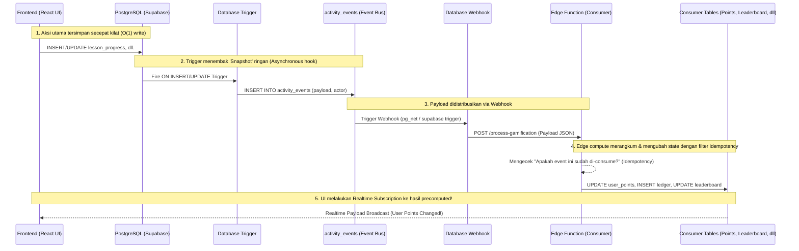

# EduSync Data Flow Architecture

Arsitektur aliran data ini memetakan pergerakan informasi dari *User Action* (Frontend) hingga memengaruhi agregasi data (*Consumer Tables*) tanpa menghalangi *Main Thread* atau User Experience. Keseluruhan pendekatan ini memanfaatkan pola **Event-Driven Database Webhooks** via Supabase.

---

## 🌊 Diagram Arus Data Inti (Core Flow)



---

## 🔀 Konteks Aliran Data: CQRS Lite

Secara alami, arsitektur event-driven EduSync memisahkan wewenang antara wilayah Tulis (Commands) dan Baca (Queries).

### ✍️ Command Path (Jalur Mutasi)
Ketika seorang pelajar (_Student_) menyelesaikan sebuah kuis berbatas waktu:
1. React aplikasi melakukan instruksi `supabase.from('quiz_attempts').update({ status: 'COMPLETED', score: 85 })`
2. **Synchronous (Langsung selesai):** Siswa diarahkan ke Halaman Sukses. UX mulus tanpa *loading spinner* berkepanjangan.
3. **Asynchronous (Belakang layar):** Kuis di atas men-*trigger* masuknya raw data `{ event_type: 'QUIZ_PASSED', score: 85 }` ke tabel `activity_events`.

### 📖 Query Path (Jalur Baca)
Alih-alih menyuruh UI mengalkulasi *(Query Mahal)*:
`"Hitung berapa poin yang dicapai Budi dari tabel quiz_attempts dikali multiplier, dll..."`

Edge Function secara otomatis 'menghisap' baris event `QUIZ_PASSED` tersebut, lalu memproses rumusnya, dan langsung meletakkan hasil finalnya di tabel agregate `user_points`.
Sehingga UI Halaman Profil CUKUP mengeksekusi *(Query Cepat)*:
`SELECT total_points FROM user_points WHERE user_id = 'budi'`

*(Waktu tempuh query: <5ms untuk dataset bermiliaran record)*

---

## 📡 Pola Event Terdistribusi (Fan-Out)

Pola Event Bus (`activity_events`) berarti dari **satu origin event**, kita bisa menjalarkan (fan-out) efek ke berbagai service (modul). 

```mermaid
graph LR
    A[LESSON_COMPLETED Event\n(activity_events)] --> B(Analytics Consumer\nEdge Function)
    A --> C(Gamification Consumer\nEdge Function)
    A --> D(Notification Consumer\nEdge Function)
    
    B --> E[Update course_progress\n(Precomputed)]
    C --> F[Earn 50 Points\nUpdate user_points]
    D --> G[Notify Teacher\n(In-app Notification)]
```
*Jika sekolah tersebut menonaktifkan fitur Gamifikasi (Module Toggled Off), Event `LESSON_COMPLETED` tetap akan diterbitkan, namun consumer Gamification cukup melakukan "Short-Circuit / Return 200 OK" langsung.*

---

## 🛡️ Jaminan Keamanan Jalur Event (Retries & Idempotency)

Banyak startup hancur ketika traffic tinggi tiba-tiba menduplikasi transaksi karena webhook yang sering me*retry* otomatis. EduSync menggagalkannya lewat mekanisme `Event Cursor / Watermarking`:

1. **Edge Function** dipanggil membawa ID Event: `evt_12345`
2. Function merakit operasi UPSERT ke database Consumer.
3. Function mengeksekusi operasi transaksi yang disandingkan dengan syarat:
   `WHERE processed_gamification_at IS NULL` (pada data event) atau mengecek tracking table log pemrosesan.
4. Ini menjamin sistem bisa di-replay puluhan kali sekalipun tanpa akan menduplikasi XP atau Badge kepada pengguna.
