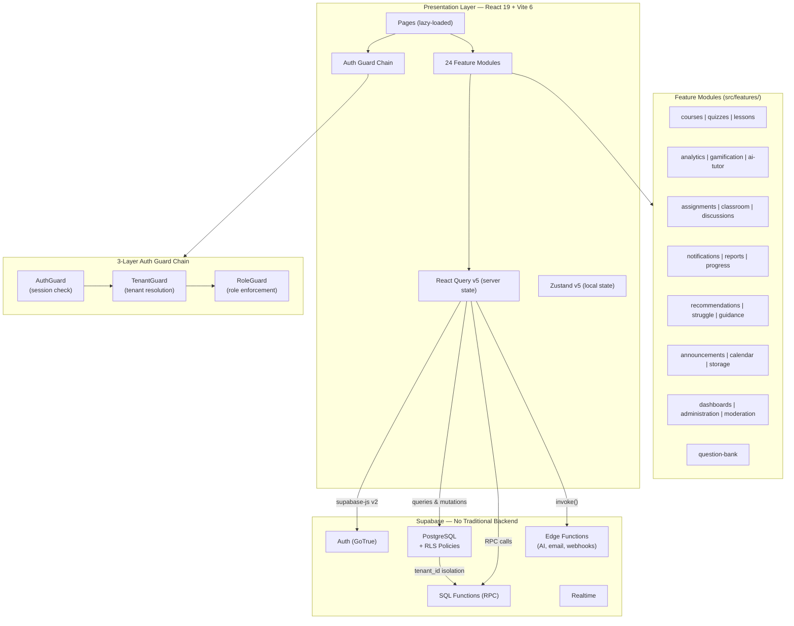

# EduSync LMS


A multi-tenant SaaS Learning Management System built for Indonesian schools. EduSync supports multiple school organizations (tenants) on a shared platform with complete data isolation via PostgreSQL Row-Level Security. All student/teacher-facing UI text is in Bahasa Indonesia.

---

## Architecture



### Key Architectural Decisions

- **No traditional backend** -- no Express, NestJS, or custom Node servers. All business logic lives in PostgreSQL (RLS policies, SQL functions, triggers) or Supabase Edge Functions.
- **Database-first** -- critical logic (tenant isolation, access control, grade calculations) is implemented in SQL, not in the frontend.
- **Multi-tenant via RLS** -- every tenant-scoped table includes `tenant_id`; Row-Level Security policies enforce isolation at the database level.
- **Feature-module architecture** -- 24 self-contained modules under `src/features/`, each with its own `api/`, `queries/`, `types/`, and `components/` subdirectories.
- **Event-driven telemetry** -- high-frequency events (lesson progress, quiz attempts) use client-side batching and Edge Function ingestion.

---

## Prerequisites

| Tool             | Version | Notes                                                            |
| ---------------- | ------- | ---------------------------------------------------------------- |
| **Node.js**      | 20+     | LTS recommended                                                  |
| **pnpm**         | 9+      | `npm install -g pnpm`                                            |
| **Supabase CLI** | latest  | `npm install -g supabase` -- needed for local dev and migrations |
| **Git**          | 2.30+   |                                                                  |

---

## Quick Start

```bash
# 1. Clone the repository
git clone https://github.com/your-org/edusync-lms.git
cd edusync-lms

# 2. Install dependencies
pnpm install

# 3. Configure environment
cp .env.example .env
# Edit .env with your Supabase project URL and anon key

# 4. Start Supabase locally (optional -- or use a remote project)
supabase start

# 5. Start the dev server
pnpm dev
# App runs at http://localhost:5173
```

---

## Environment Variables

Copy `.env.example` to `.env` and fill in the values. Do **not** commit `.env` to version control.

| Variable                 | Required | Description                                                |
| ------------------------ | -------- | ---------------------------------------------------------- |
| `VITE_SUPABASE_URL`      | Yes      | Supabase project URL (`https://<ref>.supabase.co`)         |
| `VITE_SUPABASE_ANON_KEY` | Yes      | Supabase anon/public key (safe for frontend)               |
| `VITE_DEV_PASSWORD`      | No       | Pre-fills Quick Login buttons on the login page (dev only) |

**Edge Function secrets** (set via `supabase secrets set`, not in `.env`):

| Secret                      | Purpose                            |
| --------------------------- | ---------------------------------- |
| `GROQ_API_KEY`              | AI Tutor and AI Grading (via Groq) |
| `SUPABASE_URL`              | Auto-available in Edge Functions   |
| `SUPABASE_ANON_KEY`         | Auto-available in Edge Functions   |
| `SUPABASE_SERVICE_ROLE_KEY` | Auto-available in Edge Functions   |
| `SUPABASE_DB_URL`           | Auto-available in Edge Functions   |

---

## Available Scripts

| Script                 | Command                                     | Description                          |
| ---------------------- | ------------------------------------------- | ------------------------------------ |
| `pnpm dev`             | `vite --host`                               | Start dev server with network access |
| `pnpm build`           | `vite build`                                | Production build to `dist/`          |
| `pnpm preview`         | `vite preview`                              | Preview production build locally     |
| `pnpm typecheck`       | `tsc --noEmit`                              | TypeScript type checking (no emit)   |
| `pnpm lint`            | `eslint src/`                               | ESLint code quality check            |
| `pnpm format`          | `prettier --write 'src/**/*.{ts,tsx}'`      | Auto-format source files             |
| `pnpm test`            | `vitest`                                    | Run unit tests with Vitest           |
| `pnpm test:e2e`        | `playwright test`                           | Run E2E tests with Playwright        |
| `pnpm storybook`       | `storybook dev -p 6006`                     | Component development with Storybook |
| `pnpm analyze`         | `ANALYZE=true vite build`                   | Bundle size analysis                 |
| `pnpm check:circular`  | `madge --circular --extensions ts,tsx src/` | Detect circular imports              |
| `pnpm perf:lighthouse` | Lighthouse CI autorun                       | Performance audit                    |

---

## Project Structure

```
src/
├── app/                    # Route tree and app providers
│   ├── routes.tsx          # Route orchestrator (imports domain route files)
│   ├── routes/             # Domain route splits (student, teacher, admin, shared)
│   ├── lazyPages.tsx       # All lazy-loaded page imports with error boundaries
│   ├── providers.tsx       # App-level React providers
│   └── queryClient.ts      # React Query client configuration
│
├── App.tsx                 # Root component
├── main.tsx                # Vite entry point
│
├── components/             # Shared UI components
│   ├── guards/             # AuthGuard, TenantGuard, RoleGuard, CourseEnrollmentGuard
│   ├── layout/             # Header, Sidebar, Layout, AdminLayout, StudentLayout, TeacherLayout
│   ├── LessonViewer/       # Smart Player (ArticleViewer, VideoViewer, MultiBlockViewer)
│   ├── CourseBuilder/      # Course builder UI + block editors
│   ├── CourseOverview/     # Course overview (header, module list, progress summary)
│   ├── skeletons/          # Loading skeleton components
│   ├── ui/                 # Reusable primitives (Button, Modal, Input, Toast, etc.)
│   ├── admin/              # Admin panel components (ChangeRoleModal, InviteUserModal)
│   └── moderation/         # Content moderation UI
│
├── contexts/               # React contexts (Auth, Builder, Theme)
├── hooks/                  # Shared React hooks (useDebounce, useNetworkStatus, etc.)
├── lib/                    # Shared library utilities (queryKeys.ts)
├── pages/                  # Page components (thin wrappers, lazy-loaded via routes.tsx)
│   ├── admin/              # Admin-only pages (UserManagement, SystemHealth, etc.)
│   └── __tests__/          # Page-level tests
├── services/               # Service utilities
│   └── supabase/           # Supabase client (client.ts)
├── shared/                 # Shared cross-feature utilities
│   ├── config/             # Navigation config, dev seeds, feature flag helpers
│   ├── lib/                # queryKeys.ts, validate.ts
│   ├── schemas/            # Shared Valibot form schemas
│   └── types/              # Shared TypeScript types (course, lesson, block)
├── utils/                  # General utility functions
│   └── queryConstants.ts   # Stale time constants (STALE.STATIC/MODERATE/DYNAMIC/REALTIME)
│
└── features/               # 24 feature modules
    ├── administration/     # Tenant administration & module config
    ├── ai-tutor/           # AI chat assistant (Groq llama-3.1-70b)
    ├── analytics/          # Teacher analytics dashboard & charts
    ├── announcements/      # School announcements
    ├── assignments/        # Assignment submission & AI grading
    ├── calendar/           # Academic calendar
    ├── classroom/          # Class management & enrollments
    ├── courses/            # Course catalog, builder logic & collaborators
    ├── dashboards/         # Custom dashboard with widget builder
    ├── discussions/        # Class discussion forums
    ├── gamification/       # XP, badges, leaderboard v2, streaks
    ├── gradebook/          # Digital gradebook & SpeedGrader
    ├── guidance/           # In-app walkthroughs, tooltips, banners
    ├── lessons/            # Lesson viewer, Smart Player, SCORM player
    ├── moderation/         # Content moderation
    ├── notifications/      # In-app + push notification system
    ├── onboarding/         # New user onboarding wizard
    ├── progress/           # Student progress tracking
    ├── question-bank/      # Reusable question bank
    ├── quizzes/            # Quiz player, grading, anti-cheat, Zustand store
    ├── recommendations/    # Content recommendation engine
    ├── reports/            # Academic & financial reports
    ├── storage/            # File & media management
    └── struggle/           # Automatic struggle detection & teacher alerts
```

Each feature module follows a consistent internal structure:

```
features/<module>/
├── api/          # Supabase query functions
├── queries/      # React Query hooks (useQuery, useMutation)
├── types/        # TypeScript interfaces and types
├── components/   # Module-specific UI components
├── hooks/        # Module-specific React hooks
├── store/        # Zustand stores (where applicable)
├── utils/        # Module-specific utilities
└── index.ts      # Public barrel export
```

---

## Routing

All routes use hash-based routing (`/#/`). Route protection is enforced by the guard chain: `AuthGuard` -> `TenantGuard` -> `RoleGuard`.

| Path                         | Access           |
| ---------------------------- | ---------------- |
| `/#/login`                   | Public           |
| `/#/app/student/*`           | Student          |
| `/#/app/teacher/*`           | Teacher          |
| `/#/app/admin/*`             | Admin            |
| `/#/teaching/course-builder` | Teacher, Admin   |
| `/#/teaching/quiz-manager`   | Teacher, Admin   |
| `/#/analytics`               | Teacher, Admin   |
| `/#/gradebook`               | Teacher, Admin   |
| `/#/leaderboard`             | Student, Teacher |

---

## Database

Migrations live in `supabase/migrations/` and should be applied in numeric order. See [docs/DATABASE.md](docs/DATABASE.md) for the full schema reference and [docs/RLS_POLICIES.md](docs/RLS_POLICIES.md) for Row-Level Security details.

Key constraints:

- Every tenant-scoped table has a `tenant_id` column
- RLS policies enforce `tenant_id = get_my_tenant_id()` on all operations
- All RPCs include `auth.uid() IS NOT NULL` checks
- Queries are paginated on large tables; `SELECT *` is never used

---

## Documentation

> **Start at [docs/DX.md](docs/DX.md)** for the full developer experience guide and complete documentation map.

| Document                                                   | Description                               |
| ---------------------------------------------------------- | ----------------------------------------- |
| [docs/DX.md](docs/DX.md)                                   | **DX guide & complete documentation map** |
| [docs/ARCHITECTURE.md](docs/ARCHITECTURE.md)               | System architecture, routing, state       |
| [docs/DATABASE.md](docs/DATABASE.md)                       | Database schema and RPC reference         |
| [docs/AUTH.md](docs/AUTH.md)                               | Authentication flow and setup             |
| [docs/SECURITY.md](docs/SECURITY.md)                       | Security model and threat mitigations     |
| [docs/RLS_POLICIES.md](docs/RLS_POLICIES.md)               | Row-Level Security policy catalog         |
| [docs/TENANT_ARCHITECTURE.md](docs/TENANT_ARCHITECTURE.md) | Multi-tenant architecture details         |
| [docs/ANALYTICS.md](docs/ANALYTICS.md)                     | Teacher analytics system                  |
| [docs/GAMIFICATION.md](docs/GAMIFICATION.md)               | XP, badges, leaderboard                   |
| [docs/TESTING.md](docs/TESTING.md)                         | Testing guide and test accounts           |
| [docs/ENGINEERING_ROADMAP.md](docs/ENGINEERING_ROADMAP.md) | Engineering phase roadmap                 |
| [docs/DEVELOPER_RUNBOOK.md](docs/DEVELOPER_RUNBOOK.md)     | Developer runbook and recipes             |
| [CONTRIBUTING.md](CONTRIBUTING.md)                         | Contribution guidelines                   |
| [CHANGELOG.md](CHANGELOG.md)                               | Version history                           |

---

## License

Proprietary. All rights reserved.
