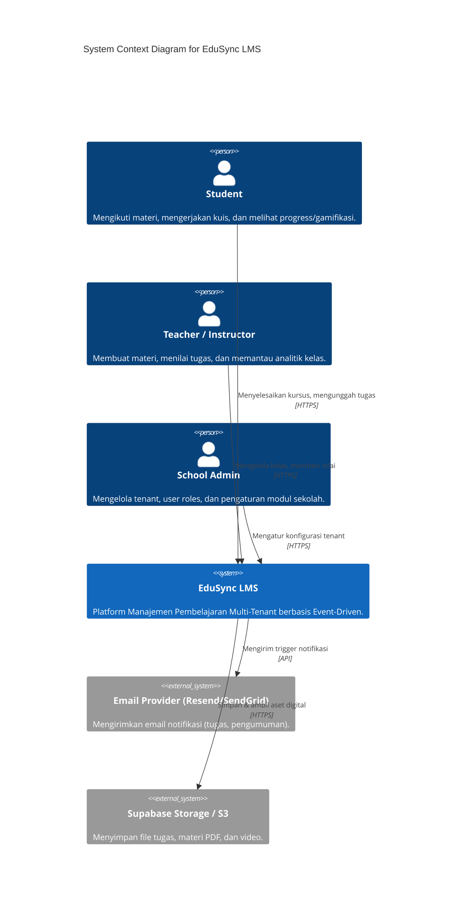
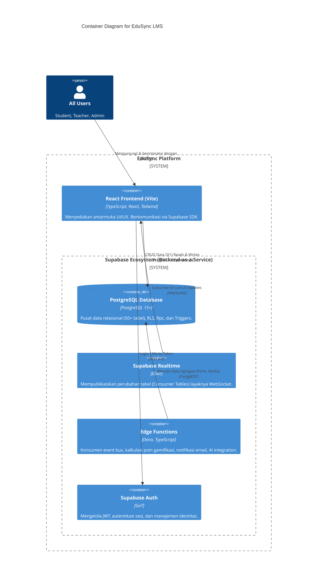

# EduSync System Context & Infrastructure Architecture

Dokumen ini memetakan arsitektur infrastruktur fisik dan logikal EduSync LMS. EduSync beroperasi secara penuh di dalam ekosistem **Supabase (Serverless/BaaS)** tanpa bergantung pada *traditional backend server* (seperti Node.js/Express). 

Pendekatan ini menjamin skalabilitas masif (*auto-scaling*), latensi minimal, dan arsitektur *event-driven* yang sangat efisien untuk operasi *multi-tenant* berskala besar.

---

## 🏗️ 1. System Context Diagram (C4 Model - Level 1)

Diagram abstraksi tertinggi yang menunjukkan bagaimana *Actor* (pengguna) dan *External Systems* berinteraksi dengan EduSync.

---

## 🧩 2. Container Diagram (C4 Model - Level 2)

Membedah bagian internal "EduSync LMS" ke dalam komponen-komponen utama (Containers) yang berkomunikasi satu sama lain.

---

## ⚡ 3. Infrastructure & Component Architecture

Di bawah ini adalah rincian topologi komponen yang dipakai EduSync:

### A. Frontend Presentation Layer
*   **Framework:** React 18 + Vite
*   **Language:** TypeScript (Strict typing dari Database Schema Generation)
*   **Styling:** Tailwind CSS + Framer Motion (Micro-interactions)
*   **State Management:** React Context (Untuk State global Auth & Theme) + React Query / Supabase SDK Cache.

### B. The "Smart" Database Layer (PostgreSQL)
Postgres di EduSync **bukan sekadar tempat simpan diam**. Ia adalah "Otak" utama:
1.  **Row Level Security (RLS):** Garda depan sekuritas multi-tenant. Tidak ada endpoint API (Node.js) khusus, karena akses tabel diseleksi langsung di level baris db oleh token JWT.
2.  **Database Triggers (`pg_trigger`):** Mengakselerasi event injection. Bila `lesson_progress` berubah menjadi status `100%`, trigger SQL akan menembakkan payload ke `activity_events` tanpa delay jaringan (0ms latensi dari sisi klien).
3.  **RPC (Stored Procedures):** Untuk fungsi relasional berat seperti menyalin kurikulum _course_ antar _term_ (Tahun Ajaran) agar tetap transaksional di level db.

### C. Logic & Asynchronous Processing Layer (Edge Functions)
Tidak ada _Long-Running Server_. Semua komputasi sampingan berjalan di infrastruktur **Deno Edge (Serverless)** yang hidup <100ms:
1.  **Event Consumers:** Mendengarkan webhook `activity_events` untuk memproses *Leaderboard* dan *Gamification XP*.
2.  **Idempotency & Retries:** Edge functions terdesain agar tahan-banting bila di-_retry_ oleh jaringan (webhook timeout). Fungsionalitas diproteksi melalui pengecekan `processed_at` flag atau log eksekusi.
3.  **Third-Party Integration:** Mengirim email _password reset_, memanggil API Generative AI (AI Tutor), atau _Payment Gateway_ (Stripe/Xendit) apabila _Billing Domain_ aktif.

### D. Realtime Data Layer
Memanfaatkan `Supabase Realtime`, tabel konsumer (contoh: `user_points`, `notifications`) diamati (*subscribed*) oleh Client UI. Ketika Edge Function meng-update poin siswa, layar siswa akan bertambah animasinya secara live.

---

## 🛡️ 4. Ketahanan & Observability (Resiliency Strategy)

1. **Idempotency Execution:** Event webhook dilengkapi proteksi _duplicate-handling_.
2. **Event Log / Observability:** Tabel `event_processing_logs` merekam eksekusi webhook Edge Function, menampung `status` (*Success/Failed*) serta waktu `execution_ms` untuk visibilitas dan _debugging_ (*Traceability*).
3. **Pemisahan Trafik Jaringan (Read vs Write):** 
   Trafik berat dari kelas dengan 500+ siswa yang menjejaki progress kuis tidak akan memperlambat halaman *dashboard*, karena Dashboard membaca entitas *Precomputed* secara sinkronus. 

Arsitektur "Supabase Native" ini pada dasarnya mengeliminasi *Middle-Tier Bottlenecks*, menghilangkan keharusan me-*maintain* pod Docker Express API, dan sangat mempermudah pengontrolan versi database serta infrastruktur sebagai kode (*Infrastructure-as-Code*).
