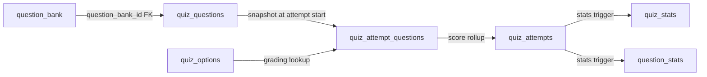
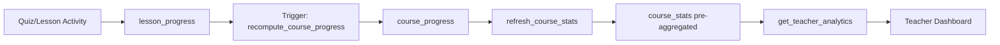

# EduSync LMS — Database Architecture

Production-ready schema built directly on Supabase PostgreSQL.

## Entity-Relationship Overview

```mermaid
erDiagram
    User ||--o| UserProfile : has
    User ||--o{ UserRole : has
    Role ||--o{ UserRole : has
    Role ||--o{ RolePermission : has
    Permission ||--o{ RolePermission : has

    User ||--o{ Class : teaches
    Course ||--o{ Class : "used in"
    User ||--o{ Course : creates
    Class ||--o{ Enrollment : has
    User ||--o{ Enrollment : "enrolled in"
    Enrollment ||--o{ AttendanceRecord : has

    Course ||--o{ CourseModule : contains
    CourseModule ||--o{ Lesson : contains
    Lesson ||--o{ LessonResource : has

    Class ||--o{ Assignment : has
    Assignment ||--o{ AssignmentSubmission : has
    User ||--o{ AssignmentSubmission : submits
    AssignmentSubmission ||--o| Grade : has

    Class ||--o{ Quiz : has
    Quiz ||--o{ QuizQuestion : has
    QuizQuestion ||--o{ QuizOption : has
    Quiz ||--o{ QuizAttempt : has
    User ||--o{ QuizAttempt : attempts

    QuestionBank ||--o{ QuestionOption : has
    QuestionBank ||--o{ QuestionTag : tagged
    QuestionBank }o--o{ QuizQuestion : "linked via question_bank_id"

    Class ||--o{ DiscussionThread : has
    DiscussionThread ||--o{ DiscussionPost : has
    User ||--o{ DiscussionPost : writes

    User ||--o{ LessonProgress : tracks
    Lesson ||--o{ LessonProgress : tracked
    User ||--o{ CourseProgress : tracks
    Course ||--o{ CourseProgress : tracked

    User ||--o{ UserBadge : earns
    Badge ||--o{ UserBadge : awarded
    User ||--o| UserPoint : accumulates

    User ||--o{ Notification : receives
    User ||--o{ ActivityLog : generates
    User ||--o{ ActivityEvent : generates
    ActivityEvent }|--|{ Class : "belongs to"
    User ||--o{ Invoice : billed
    Invoice ||--o{ Payment : paid

    Course ||--o{ CourseInsights : generates
```

---

## Technical Implementation Details

### Supabase Row Level Security (RLS)

Security is handled at the database layer using Row Level Security (RLS) policies. To minimize overhead, high-traffic policies use **scalar subqueries** (e.g., `(SELECT public.get_my_tenant_id())`) to ensure the planner caches function results instead of re-evaluating them for every row.

| Resource          | Who can Read                          | Who can Insert/Update                      |
| ----------------- | ------------------------------------- | ------------------------------------------ |
| `profiles`        | Authenticated users                   | Users (own), Admins                        |
| `classes`         | Authenticated users                   | Teachers, Admins                           |
| `enrollments`     | Enrolled students, Teachers           | Teachers, Admins, Students (via join_code) |
| `assignments`     | Enrolled students, Teachers           | Teachers                                   |
| `submissions`     | Submitting student, Teachers          | Students (submit), Teachers (grade)        |
| `notifications`   | Recipient user                        | System (Triggers/Edge Functions)           |
| `activity_events` | Authenticated users (tenant isolated) | System (Triggers)                          |

### PostgreSQL Remote Procedure Calls (RPCs)

Complex operations are wrapped in Postgres functions to prevent multiple network roundtrips from the client and to maintain data integrity.

- `get_my_classes()` — Returns a user's classes based on their role (enrolled in for students, teaching for teachers).
- `create_class(name, course_id, max_students)` — Creates a class and handles teacher assignments.
- `join_class_by_code(code)` — Validates class capacity and enrolls the student.
- `mark_lesson_complete(lesson_id)` — Updates progress and checks for module/course completion.

### Database Triggers

- `on_auth_user_created` — Automatically creates a `profiles` row when a user signs up.
- `on_assignment_graded` — Automatically inserts a notification for the student when a grade is submitted.
- `on_badge_earned` — Emits a realtime database event for Gamification popups.
- `trg_lesson_progress_activity`, `trg_assignment_submission_activity`, `trg_assignment_graded_activity`, `trg_quiz_attempt_activity`, `trg_enrollment_activity` — Insert strongly-typed records into `activity_events` via `create_activity_event()` for the event-driven system.

---

## Quiz Engine & Question Bank

### Architecture

The quiz engine uses a **snapshot chain** architecture for immutable quiz attempts:



**Two authoring modes:**

- **Direct**: Teacher creates questions directly in `quiz_questions` (`question_bank_id = NULL`)
- **Bank-backed**: Teacher selects from `question_bank` → `add_question_to_quiz` copies text + options into `quiz_questions` + `quiz_options`

**Runtime identity**: `quiz_questions.id` is used everywhere (snapshots, grading, stats). `question_bank_id` is a nullable FK for provenance only.

### Tables

| Table                    | Purpose                                                                                                        |
| ------------------------ | -------------------------------------------------------------------------------------------------------------- |
| `question_bank`          | Reusable question repository (per-tenant)                                                                      |
| `question_options`       | Options for bank questions                                                                                     |
| `question_tags`          | Tag-based categorization for bank questions                                                                    |
| `question_bank_usage`    | Tracks which quizzes use which bank questions                                                                  |
| `question_stats`         | Per-question analytics. Composite PK `(question_id, quiz_id)` supports per-quiz and global difficulty analysis |
| `quiz_questions`         | Quiz-scoped questions (snapshot layer) with optional `question_bank_id` FK                                     |
| `quiz_options`           | Options for quiz questions (used by grading pipeline)                                                          |
| `quiz_attempts`          | Student attempt records with status enum: `IN_PROGRESS`, `SUBMITTED`, `GRADED`, `EXPIRED`, `ABANDONED`         |
| `quiz_attempt_questions` | Per-question snapshot with `question_snapshot` JSONB for immutability                                          |
| `quiz_stats`             | Pre-aggregated quiz-level statistics                                                                           |

### Key RPCs

| Function                                               | Purpose                                                       | Access        |
| ------------------------------------------------------ | ------------------------------------------------------------- | ------------- |
| `start_quiz_attempt(quiz_id)`                          | Creates attempt, snapshots questions, handles recovery/expiry | Student       |
| `submit_quiz_attempt(attempt_id, answers, version)`    | Auto-grades MCQ/TRUE_FALSE/MULTIPLE_SELECT, defers essays     | Student       |
| `grade_attempt_question(id, points, correct, comment)` | Manual grading for SHORT_ANSWER/ESSAY                         | Teacher/Admin |
| `create_question(...)`                                 | Creates bank question with options/tags/stats                 | Teacher/Admin |
| `update_question(...)`                                 | Updates bank question, syncs linked `quiz_options`            | Teacher/Admin |
| `add_question_to_quiz(bank_id, quiz_id, order)`        | Links bank question to quiz, copies options to `quiz_options` | Teacher/Admin |
| `search_questions(...)`                                | Filtered search with pagination                               | Teacher/Admin |
| `get_question(id)`                                     | Full question with options and tags                           | Teacher/Admin |

### Migrations

| Version                       | Description                                                                                                                    |
| ----------------------------- | ------------------------------------------------------------------------------------------------------------------------------ |
| `63_quiz_engine_schema`       | Multi-type questions, quiz modes, stats tables, snapshot columns                                                               |
| `64_quiz_engine_rpc`          | Core RPCs: start/submit/grade attempt, stats trigger                                                                           |
| `65_quiz_engine_rls`          | Quiz engine RLS policies                                                                                                       |
| `66_quiz_engine_hardening`    | Security hardening                                                                                                             |
| `67_quiz_engine_rpc_patches`  | Optimistic locking, timer clamping, late submission handling                                                                   |
| `68_question_bank_migrations` | Question bank schema, options, tags, usage tracking, RLS                                                                       |
| `69_question_bank_rpc`        | Bank RPCs: create/update/search/archive question                                                                               |
| `71_schema_reconciliation`    | **Canonical fix**: composite PK `question_stats`, `question_bank_id` FK, option copy in `add_question_to_quiz`, fixed all RPCs |

---

## Learning Analytics Engine

The Learning Analytics Engine provides comprehensive analytics for teachers and administrators to monitor student progress, quiz performance, and course engagement.

### Data Flow



### Tables

| Table                       | Purpose                                                          |
| --------------------------- | ---------------------------------------------------------------- |
| `course_stats`              | Pre-aggregated analytics data (updated every 5 min or on-demand) |
| `course_progress`           | Per-student progress tracking per course                         |
| `lesson_progress`           | Per-lesson completion tracking                                   |
| `learning_events`           | AI Tutor event log for recommendations and analytics             |
| `course_analytics_mv`       | Materialized view for fast course-level aggregations             |
| `analytics_audit`           | Audit trail for tracking analytics access and actions            |
| `analytics_rate_limits`     | Tracks and limits analytics request frequency per user           |
| `analytics_metrics`         | Persistent storage for metrics used by Prometheus/Grafana        |
| `analytics_circuit_breaker` | Tracks failure states to prevent cascading analytics failures    |
| `course_insights`           | Storage for AI-ready insights and student pattern detection      |

### RPC Functions

| Function                                  | Purpose                                                | Access             |
| ----------------------------------------- | ------------------------------------------------------ | ------------------ |
| `get_teacher_analytics(p_course_id)`      | Returns comprehensive analytics JSON with pagination   | Teacher/Admin only |
| `refresh_course_stats(p_course_id)`       | Recalculates course_stats with locking and retry logic | Teacher/Admin only |
| `refresh_all_course_stats()`              | Refreshes stats for all courses                        | Teacher/Admin only |
| `recompute_course_progress(p_id, p_c_id)` | Recalculates student progress                          | System/Trigger     |
| `log_analytics_access(p_action, ...)`     | Records access into analytics_audit                    | System/RPC         |
| `check_analytics_rate_limit(p_user_id)`   | Enforces per-user rate limits for analytics            | System/RPC         |
| `record_analytics_metric(...)`            | Records Prometheus-style metrics                       | System/RPC         |
| `analytics_health_check()`                | Provides health status of the analytics engine         | Admin only         |
| `test_analytics_security()`               | Automated suite for security/isolation checks          | Admin only         |
| `refresh_course_analytics_mv()`           | CONCURRENTLY refreshes the course analytics MV         | Admin/System       |

### Security

- All analytics RPC functions require `teacher` or `admin` role
- Tenant isolation enforced via JWT `tenant_id` claim
- RLS policies on `course_stats` table restrict access to tenant members

### Performance

- Pre-aggregated `course_stats` table for fast dashboard loads
- Scheduled refresh every 5 minutes (via pg_cron)
- Critical indexes on progress tables for query optimization

### Migrations

| Version                          | Description                                                 |
| -------------------------------- | ----------------------------------------------------------- |
| `09_course_progress_engine`      | Progress tracking foundation                                |
| `10_learning_analytics`          | Analytics RPC functions                                     |
| `11_production_hardening`        | Security and performance improvements                       |
| `12_fix_analytics_security`      | Role validation and module calculation fixes                |
| `13_add_analytics_indexes`       | Performance indexes                                         |
| `14_analytics_cron_job`          | Scheduled auto-refresh                                      |
| `15_learning_events`             | AI Tutor event logging foundation                           |
| `26_analytics_retry_logic`       | Retry tracking and locking for refresh_course_stats         |
| `27_course_analytics_mv`         | Pre-computed materialized view for courses                  |
| `28_analytics_audit_trail`       | Persistent audit trail for analytics access                 |
| `29_analytics_pagination`        | Cursor-based pagination for student analytics               |
| `30_analytics_rate_limiting`     | Per-user rate limiting for analytics                        |
| `31_analytics_monitoring`        | Prometheus-style metrics RPC                                |
| `32_analytics_health_check`      | Diagnostic health check RPC                                 |
| `33_analytics_security_tests`    | Automated security validation test suite                    |
| `34_analytics_circuit_breaker`   | Failure-aware circuit breaker for stats refresh             |
| `35_learning_insights`           | Storage for AI-ready student pattern insights               |
| `36_final_refinement`            | `search_path` hardening and initial RLS optimization        |
| `37_comprehensive_reinforcement` | Global RLS optimization and Analytics hardening             |
| `38_final_polish`                | Idempotent schema alignment and final RLS performance sweep |

---

## Lesson Video Captions

Menyimpan WebVTT caption tracks untuk video pelajaran, memenuhi persyaratan aksesibilitas **WCAG 1.2.2 Level A** (Captions Pre-recorded).

### Design Notes

- Caption bersifat **per-lesson** (bila `block_id = NULL`) atau **per-block** (bila `block_id` diisi), memungkinkan caption granular untuk setiap konten video dalam block-based editor.
- URL caption (`vtt_url`) menunjuk ke file WebVTT yang tersimpan di Supabase Storage (public bucket).
- `is_default` menandai caption yang secara otomatis aktif saat video diputar.
- Satu lesson/block dapat memiliki beberapa caption dalam bahasa berbeda (`language_code`).

### Tables

| Table                   | Purpose                                                                         |
| ----------------------- | ------------------------------------------------------------------------------- |
| `lesson_video_captions` | WebVTT caption tracks per lesson atau per content block, mendukung multi-bahasa |

### Schema

```sql
CREATE TABLE public.lesson_video_captions (
    id             uuid DEFAULT gen_random_uuid() NOT NULL PRIMARY KEY,
    tenant_id      uuid NOT NULL REFERENCES public.tenants(id) ON DELETE CASCADE,
    lesson_id      uuid NOT NULL REFERENCES public.lessons(id) ON DELETE CASCADE,
    block_id       uuid,                          -- NULL = lesson-level; set = per-block caption
    language_code  varchar(5) NOT NULL DEFAULT 'id',
    label          text NOT NULL,                 -- e.g. "Bahasa Indonesia", "English"
    vtt_url        text NOT NULL,                 -- Supabase Storage public URL (.vtt)
    is_default     boolean DEFAULT false,
    created_at     timestamptz DEFAULT now() NOT NULL,
    updated_at     timestamptz DEFAULT now() NOT NULL
);
```

### RLS Policies

| Operation | Policy                           | Roles             |
| --------- | -------------------------------- | ----------------- |
| SELECT    | `tenant_id = get_my_tenant_id()` | Semua user tenant |
| INSERT    | `tenant_id = get_my_tenant_id()` | Teacher           |
| UPDATE    | `tenant_id = get_my_tenant_id()` | Teacher           |
| DELETE    | `tenant_id = get_my_tenant_id()` | Teacher           |

### Migrations

| Version                         | Description                                                                   |
| ------------------------------- | ----------------------------------------------------------------------------- |
| `20260402000001_video_captions` | Membuat tabel `lesson_video_captions`, RLS policies, dan trigger `updated_at` |

---

<!-- Phase 5 Feature Cross-Reference -->

## Feature Module Cross-Reference

EduSync LMS terdiri dari 24 feature module yang saling terintegrasi:

| Feature         | Domain         | Deskripsi                                                                                                                  |
| --------------- | -------------- | -------------------------------------------------------------------------------------------------------------------------- |
| administration  | Admin          | Administrasi — Manajemen tenant, konfigurasi modul sekolah, sinkronisasi data                                              |
| ai-tutor        | Learning       | AI Tutor — Asisten belajar berbasis AI yang memberikan penjelasan personal kepada siswa                                    |
| analytics       | Analytics      | Analitik — Dashboard analitik komprehensif untuk guru dan admin                                                            |
| announcements   | Communication  | Pengumuman — Sistem pengumuman sekolah                                                                                     |
| assignments     | Assessment     | Tugas — Manajemen tugas dari pembuatan hingga penilaian                                                                    |
| calendar        | Academic       | Kalender — Kalender akademik terintegrasi dengan jadwal pelajaran, ujian, deadline tugas, dan kegiatan sekolah             |
| classroom       | Academic       | Kelas — Manajemen kelas virtual dan fisik                                                                                  |
| courses         | Academic       | Kursus — Core learning module                                                                                              |
| dashboards      | Analytics      | Dashboard — Dashboard kustom dengan widget builder                                                                         |
| discussions     | Communication  | Diskusi — Forum diskusi per kursus                                                                                         |
| gamification    | Engagement     | Gamifikasi — Sistem gamifikasi lengkap: XP, badge, level, streak counter, dan leaderboard                                  |
| gradebook       | Assessment     | Buku Nilai — Buku nilai digital untuk guru                                                                                 |
| guidance        | Admin          | Panduan — Sistem panduan in-app (tooltip, walkthrough, banner, checkpoint)                                                 |
| lessons         | Learning       | Pelajaran — Konten pelajaran dengan block-based editor                                                                     |
| moderation      | Admin          | Moderasi — Moderasi konten user-generated (diskusi, komentar)                                                              |
| notifications   | Communication  | Notifikasi — Sistem notifikasi real-time dengan bell icon dan panel                                                        |
| onboarding      | Admin          | Onboarding — Wizard onboarding untuk pengguna baru                                                                         |
| progress        | Learning       | Kemajuan Belajar — Tracking progress belajar siswa secara granular per kursus, modul, dan pelajaran                        |
| question-bank   | Assessment     | Bank Soal — Repositori soal yang bisa digunakan ulang di berbagai kuis                                                     |
| quizzes         | Assessment     | Kuis — Sistem kuis komprehensif dengan timer, anti-cheat, autosave, review mode, dan analitik hasil per soal               |
| recommendations | Learning       | Rekomendasi — Engine rekomendasi konten berdasarkan progress, performa, dan pola belajar siswa                             |
| reports         | Analytics      | Laporan — Generator laporan akademik, keuangan (SPP), PPDB, dan custom                                                     |
| storage         | Infrastructure | Penyimpanan — Manajemen file dan media untuk materi pembelajaran                                                           |
| struggle        | Analytics      | Deteksi Kesulitan — Deteksi otomatis siswa yang kesulitan berdasarkan pola belajar, waktu per soal, dan penurunan performa |
| video-captions  | Learning       | Caption Video — WebVTT caption tracks untuk aksesibilitas video pelajaran (WCAG 1.2.2 Level A)                             |

Setiap feature module mengikuti arsitektur standar dengan folder: api/, queries/, hooks/, types/, components/, dan **tests**/. Semua feature mendukung dark mode dan skeleton loading screens.
