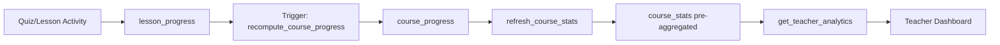

# EduSync LMS — Database Architecture

Production-ready schema built directly on Supabase PostgreSQL.

## Entity-Relationship Overview

```mermaid
erDiagram
    User ||--o| UserProfile : has
    User ||--o{ UserRole : has
    Role ||--o{ UserRole : has
    Role ||--o{ RolePermission : has
    Permission ||--o{ RolePermission : has

    User ||--o{ Class : teaches
    Course ||--o{ Class : "used in"
    User ||--o{ Course : creates
    Class ||--o{ Enrollment : has
    User ||--o{ Enrollment : "enrolled in"
    Enrollment ||--o{ AttendanceRecord : has

    Course ||--o{ CourseModule : contains
    CourseModule ||--o{ Lesson : contains
    Lesson ||--o{ LessonResource : has

    Class ||--o{ Assignment : has
    Assignment ||--o{ AssignmentSubmission : has
    User ||--o{ AssignmentSubmission : submits
    AssignmentSubmission ||--o| Grade : has

    Class ||--o{ Quiz : has
    Quiz ||--o{ QuizQuestion : has
    QuizQuestion ||--o{ QuizOption : has
    Quiz ||--o{ QuizAttempt : has
    User ||--o{ QuizAttempt : attempts

    Class ||--o{ DiscussionThread : has
    DiscussionThread ||--o{ DiscussionPost : has
    User ||--o{ DiscussionPost : writes

    User ||--o{ LessonProgress : tracks
    Lesson ||--o{ LessonProgress : tracked
    User ||--o{ CourseProgress : tracks
    Course ||--o{ CourseProgress : tracked

    User ||--o{ UserBadge : earns
    Badge ||--o{ UserBadge : awarded
    User ||--o| UserPoint : accumulates

    User ||--o{ Notification : receives
    User ||--o{ ActivityLog : generates
    User ||--o{ ActivityEvent : generates
    ActivityEvent }|--|{ Class : "belongs to"
    User ||--o{ Invoice : billed
    Invoice ||--o{ Payment : paid

    Course ||--o{ CourseInsights : generates
```

---

## Technical Implementation Details

### Supabase Row Level Security (RLS)

Security is handled at the database layer using Row Level Security (RLS) policies. To minimize overhead, high-traffic policies use **scalar subqueries** (e.g., `(SELECT public.get_my_tenant_id())`) to ensure the planner caches function results instead of re-evaluating them for every row.

| Resource | Who can Read | Who can Insert/Update |
|----------|--------------|------------------------|
| `profiles` | Authenticated users | Users (own), Admins |
| `classes` | Authenticated users | Teachers, Admins |
| `enrollments` | Enrolled students, Teachers | Teachers, Admins, Students (via join_code) |
| `assignments` | Enrolled students, Teachers | Teachers |
| `submissions` | Submitting student, Teachers | Students (submit), Teachers (grade) |
| `notifications` | Recipient user | System (Triggers/Edge Functions) |
| `activity_events`| Authenticated users (tenant isolated) | System (Triggers) |

### PostgreSQL Remote Procedure Calls (RPCs)

Complex operations are wrapped in Postgres functions to prevent multiple network roundtrips from the client and to maintain data integrity.

- `get_my_classes()` — Returns a user's classes based on their role (enrolled in for students, teaching for teachers).
- `create_class(name, course_id, max_students)` — Creates a class and handles teacher assignments.
- `join_class_by_code(code)` — Validates class capacity and enrolls the student.
- `mark_lesson_complete(lesson_id)` — Updates progress and checks for module/course completion.

### Database Triggers

- `on_auth_user_created` — Automatically creates a `profiles` row when a user signs up.
- `on_assignment_graded` — Automatically inserts a notification for the student when a grade is submitted.
- `on_badge_earned` — Emits a realtime database event for Gamification popups.
- `trg_lesson_progress_activity`, `trg_assignment_submission_activity`, `trg_assignment_graded_activity`, `trg_quiz_attempt_activity`, `trg_enrollment_activity` — Insert strongly-typed records into `activity_events` via `create_activity_event()` for the event-driven system.

---

## Learning Analytics Engine

The Learning Analytics Engine provides comprehensive analytics for teachers and administrators to monitor student progress, quiz performance, and course engagement.

### Data Flow



### Tables

| Table | Purpose |
|-------|---------|
| `course_stats` | Pre-aggregated analytics data (updated every 5 min or on-demand) |
| `course_progress` | Per-student progress tracking per course |
| `lesson_progress` | Per-lesson completion tracking |
| `learning_events` | AI Tutor event log for recommendations and analytics |
| `course_analytics_mv` | Materialized view for fast course-level aggregations |
| `analytics_audit` | Audit trail for tracking analytics access and actions |
| `analytics_rate_limits` | Tracks and limits analytics request frequency per user |
| `analytics_metrics` | Persistent storage for metrics used by Prometheus/Grafana |
| `analytics_circuit_breaker` | Tracks failure states to prevent cascading analytics failures |
| `course_insights` | Storage for AI-ready insights and student pattern detection |

### RPC Functions

| Function | Purpose | Access |
|----------|---------|--------|
| `get_teacher_analytics(p_course_id)` | Returns comprehensive analytics JSON with pagination | Teacher/Admin only |
| `refresh_course_stats(p_course_id)` | Recalculates course_stats with locking and retry logic | Teacher/Admin only |
| `refresh_all_course_stats()` | Refreshes stats for all courses | Teacher/Admin only |
| `recompute_course_progress(p_id, p_c_id)`| Recalculates student progress | System/Trigger |
| `log_analytics_access(p_action, ...)` | Records access into analytics_audit | System/RPC |
| `check_analytics_rate_limit(p_user_id)` | Enforces per-user rate limits for analytics | System/RPC |
| `record_analytics_metric(...)` | Records Prometheus-style metrics | System/RPC |
| `analytics_health_check()` | Provides health status of the analytics engine | Admin only |
| `test_analytics_security()` | Automated suite for security/isolation checks | Admin only |
| `refresh_course_analytics_mv()` | CONCURRENTLY refreshes the course analytics MV | Admin/System |

### Security

- All analytics RPC functions require `teacher` or `admin` role
- Tenant isolation enforced via JWT `tenant_id` claim
- RLS policies on `course_stats` table restrict access to tenant members

### Performance

- Pre-aggregated `course_stats` table for fast dashboard loads
- Scheduled refresh every 5 minutes (via pg_cron)
- Critical indexes on progress tables for query optimization

### Migrations

| Version | Description |
|---------|-------------|
| `09_course_progress_engine` | Progress tracking foundation |
| `10_learning_analytics` | Analytics RPC functions |
| `11_production_hardening` | Security and performance improvements |
| `12_fix_analytics_security` | Role validation and module calculation fixes |
| `13_add_analytics_indexes` | Performance indexes |
| `14_analytics_cron_job` | Scheduled auto-refresh |
| `15_learning_events` | AI Tutor event logging foundation |
| `26_analytics_retry_logic` | Retry tracking and locking for refresh_course_stats |
| `27_course_analytics_mv` | Pre-computed materialized view for courses |
| `28_analytics_audit_trail` | Persistent audit trail for analytics access |
| `29_analytics_pagination` | Cursor-based pagination for student analytics |
| `30_analytics_rate_limiting` | Per-user rate limiting for analytics |
| `31_analytics_monitoring` | Prometheus-style metrics RPC |
| `32_analytics_health_check` | Diagnostic health check RPC |
| `33_analytics_security_tests` | Automated security validation test suite |
| `34_analytics_circuit_breaker` | Failure-aware circuit breaker for stats refresh |
| `35_learning_insights` | Storage for AI-ready student pattern insights |
| `36_final_refinement` | `search_path` hardening and initial RLS optimization |
| `37_comprehensive_reinforcement` | Global RLS optimization and Analytics hardening |
| `38_final_polish` | Idempotent schema alignment and final RLS performance sweep |
