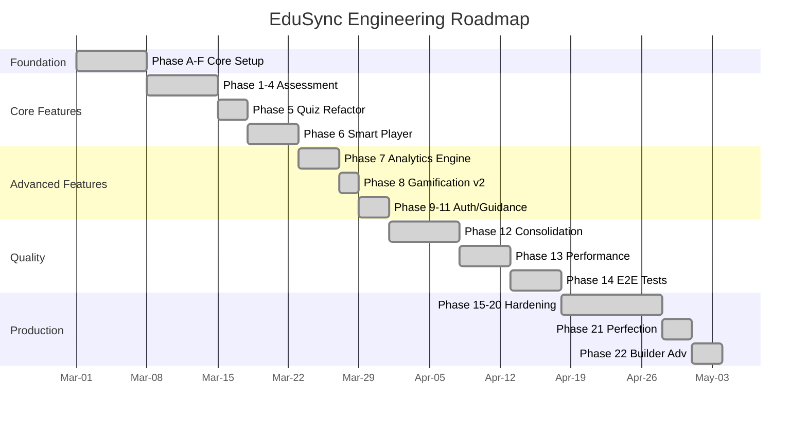

# EduSync LMS — Engineering Roadmap

From prototype to production. Built on a Supabase-centric serverless architecture.

---

## Current Status

```
✅ Phase A — UI & Mock Data Prototype (Full Frontend)
✅ Phase B — Supabase Backend Setup (Auth, DB Schema)
✅ Phase C — Edge Functions Deployment
✅ Phase D — Service Layer Context Migration (Mock → Supabase)
✅ Phase E — Consumer Page Type Fixing
✅ Phase F — Documentation
✅ Phase G — Testing Setup (Vitest + Playwright configured)
✅ Phase H — Production Hardening (RLS audit, security migrations)
✅ Phase I — Deployed (Supabase project: omfnkoufjqjqilswldtz)
```

---

## Feature Roadmap

```text
✅ Phase 1 — Core Assessment Engine (Quiz DB Schema, RPC grading, Security)
✅ Phase 2 — Assessment Enhancement (Quiz v2, Status, Versioning, Atomic Save, Anti-Cheat)
✅ Phase 3 — Learning Analytics & Progress Engine
   ✅ 3A: Gradebook UI & Exports
   ✅ 3B: Course Progress Engine (Event-driven DB Triggers)
   ✅ 3C: Learning Analytics Dashboard (course_stats, get_teacher_analytics)
✅ Phase 4 — Assignment System (Teacher-graded assignments, rubrics, SpeedGrader)
✅ Phase 5 — Quiz Engine Refactor (feature module, question bank, QuizPlayer v2)
✅ Phase 6 — Smart Player MVP (SP-0→SP-12: events, AI tutor, progress, UI)
✅ Phase 7 — Advanced Analytics Engine (810–820: aggregation, engagement, cohort, funnel, path, predictive alerts, struggle detection)
✅ Phase 8 — Gamification v2 (821–822: badges, certificates, XP, leaderboard v2, streaks)
✅ Phase 9 — Registration & Auth (Google OAuth, class join code, multi-step flow)
✅ Phase 10 — In-App Guidance (walkthroughs, tooltips, banners)
✅ Phase 11 — Attendance System (teacher scan, student view)
✅ Phase 12 — Feature Module Consolidation (migrate remaining services to features/*)
✅ Phase 12.5 — Feature Health 100/100 (24/24 features: structure, tests, dark mode, skeleton, docs)
✅ Phase 12.6 — Technical Debt Clearance (select(*) → explicit columns, moderation→Supabase, analytics RPC security, engagement RPC consolidation)
✅ Phase 13 — Performance & Scale (virtualization, infinite scroll, stale-time tiering, bundle splitting, Web Vitals)
✅ Phase 14 — E2E Test Coverage (shared helpers, quiz autosave+resume, class join code, CI workflow)
✅ Phase 15 — Production Readiness Audit (security fixes, dead code removal, performance, DX)
✅ Phase 16 — QA Browser Testing Gaps (22/22 gaps fixed: auth, routing, navigation, a11y, i18n, UX)
✅ Phase 17 — Free Tier Survival (remove all WebSockets, downgrade pg_cron to daily, debounce searches, cap query limits)
✅ Phase 18 — LTI 1.3 + SCORM Integration (external LMS launch, SCORM 1.2/2004 player, Interactive Video pop-up quizzes)
✅ Phase 19 — Course Builder Enhancement (content versioning, template library, collaborators, review workflow)
✅ Phase 20 — Security & Performance Cleanup (bare .select() elimination, tenant_id audit, memoization, dead code removal)
✅ Phase 21 — Production Perfection (UI/UX polish, logic hardening, code health, technical hardening, documentation)
✅ Phase 22 — Quick Wins, UX Polish, Feature Completion & Test Coverage (22A: lazy/error/animations; 22B: undo, offline forms, keyboard nav, help; 22C: group assignments, public profile, form validation; 22D: 26 unit tests + 5 E2E flows)
```

---

## Roadmap Overview



---

## Completed: Phase 13 — Performance & Scale

**Goal:** Prepare for 10k+ students.

```
✅ 13A — VirtualTable component + virtualised tables (DOM nodes −90%)
✅ 13B — Infinite scroll for Course Catalog (useInfiniteQuery, PAGE_SIZE=12)
✅ 13C — Stale-time tiering via STALE/GC constants in src/utils/queryConstants.ts
✅ 13D — 5 new vendor chunks in vite.config.ts (motion, dnd, markdown, sentry, date-fns)
✅ 13E — Web Vitals monitoring + Lighthouse CI (lighthouserc.json, perf:lighthouse script)
```

---

## Completed: Phase 14 — E2E Test Coverage

**Goal:** Catch regressions before users do.

```
✅ 14A — Shared E2E helpers (e2e/helpers/auth.ts) — eliminates login boilerplate across all specs
✅ 14B — Quiz autosave + resume flow (e2e/flows/quiz-autosave-resume.spec.ts)
✅ 14C — Class join code flow (e2e/flows/class-join-code.spec.ts)
✅ 14D — Upgraded stub tests: quiz.spec, course.spec, core.spec → real authenticated flows
✅ 14E — GitHub Actions CI workflow (.github/workflows/e2e.yml) — runs on every PR to main
```

---

## Completed: Phase 21 — Production Perfection

**Goal:** Final polish pass — eliminate every rough edge before public launch.

### 21A: UI/UX Polish

```
✅ Session expiry modal — warns users before automatic logout on token expiry
✅ LazyLoadTimeout component — shows helpful message when lazy chunks take too long
✅ Micro-animations — subtle Framer Motion transitions on page/component mounts
✅ RouteAnnouncer — live region announces route changes for screen readers (a11y)
✅ Dark mode audit — fixed remaining components missing dark: variants
```

### 21B: Logic & Product Hardening

```
✅ Global error handling — FeatureErrorBoundary with retry and fallback UI
✅ Token refresh monitoring — AuthContext tracks refresh cycles, prevents infinite spinner
✅ i18n cleanup — eliminated remaining English strings in UI (buttons, labels, errors)
✅ Creator page improvements — better UX for course creation flow
✅ Offline resilience — OfflineIndicator component, service worker improvements
```

### 21C: Code Health

```
✅ Route splitting — monolithic routes.tsx split into src/app/routes/ (7 domain files)
✅ 10 page refactors — extracted logic into feature-module hooks/components
✅ 4 service file splits — decomposed oversized services into focused modules
✅ ESLint rule enforcement — stricter rules, deep import restrictions
✅ Coverage thresholds — configured minimum coverage gates
```

### 21D: Technical Hardening

```
✅ SECURITY DEFINER fixes — 19 functions patched with SET search_path (20260325_fix_search_path.sql)
✅ CSP enforcement — upgraded from report-only to enforced Content-Security-Policy
✅ Bundle size checks — CI gate for chunk size regressions
✅ Deploy pipeline — documented deployment procedures
✅ Sentry hardening — sensitive data filtering (tokens, passwords, keys) in beforeSend/beforeBreadcrumb
✅ DR documentation — docs/DISASTER_RECOVERY.md (RPO 1h / RTO 4h, PITR, rollback procedures)
✅ PWA install prompt — deferred install banner with 30-day dismiss cooldown
✅ Push notifications — send-push Edge Function for notification delivery
```

### 21E: Documentation

```
✅ Updated docs/DATABASE.md, docs/ARCHITECTURE.md, docs/SECURITY.md
✅ Updated docs/ENGINEERING_ROADMAP.md, CHANGELOG.md
```

---

## Completed: Phase 22 — Quick Wins, UX Polish, Feature Completion & Test Coverage

**Goal:** Close UX gaps, complete group assignment and public profile features, enforce form validation, and raise test coverage with unit and E2E tests.

### 22A: Quick Wins

```
✅ LazyLoadTimeout component with retry option
✅ FeatureErrorBoundary session detection → redirect to login on expired session
✅ Token refresh failure hardening in AuthContext
✅ ESLint no-floating-promises enforced across async handlers
✅ Status i18n fixes — English status values translated to Bahasa Indonesia
✅ Playwright visual project added for screenshot regression tests
✅ Stagger animations on 7 grids (course catalog, assignments, quizzes, etc.)
```

### 22B: UX Polish

```
✅ useUndoableAction hook — generic 5-second undo window with countdown toast
✅ Undo toast for class deletion — deferred delete, cancellable
✅ OfflineFormNotice — blocks form submission when offline (3 forms)
✅ BottomNav badge counts — unread notifications + pending assignments
✅ Keyboard arrow navigation in sidebar (Up/Down/Home/End)
✅ HelpButton with 8 route help entries on all main pages
```

### 22C: Feature Completion

```
✅ Group Assignments — 3 tables (assignment_groups, assignment_group_members, group_submissions)
✅ Group Assignments — 5 RPCs (get_student_group_assignment, get_teacher_group_overview,
   create_assignment_groups, submit_group_assignment, grade_group_submission)
✅ StudentGroupView + TeacherGroupView components with full submission/grading flow
✅ Public Profile — privacy flags (is_public, show_badges, show_xp, show_courses) in profiles
✅ get_public_profile RPC — respects per-field privacy settings
✅ update_profile_privacy RPC — owner-only via RLS
✅ Form validation with react-hook-form + valibot on 4 high-traffic forms
   (CreateCourseForm, CreateAssignmentForm, LoginForm, OnboardingForm)
```

### 22D: Test Coverage

```
✅ 26 unit tests: AuthContext (8), useToast (6), useNetworkStatus (5), offlineStorage (7)
✅ 5 E2E smoke flows: group-assignment, public-profile, form-validation, undo-delete, offline-form
✅ tsc --noEmit: 0 errors
✅ eslint: 0 errors
✅ vite build: PASS
```

---

## Infrastructure

| Item               | Status                                                                                                                                                                                                                                                   |
| ------------------ | -------------------------------------------------------------------------------------------------------------------------------------------------------------------------------------------------------------------------------------------------------- |
| Supabase Project   | `omfnkoufjqjqilswldtz` — active                                                                                                                                                                                                                          |
| Migrations applied | 162 files (001–825, 20260324100000–20260324200000, 20260325_fix_search_path)                                                                                                                                                                             |
| Edge Functions     | 14 deployed (ai-tutor, ai-grade-essay, generate-ai-content, generate-pdf, grade-quiz-attempt, health-check, load-quiz-data, lti-jwks, lti-launch, lti-oidc-login, process-progress-events, progress-events, scorm-extract, send-email-digest, send-push) |
| pg_cron jobs       | badge-xp-streak-processor (daily 2 AM), aggregation jobs (daily 2 AM) — optimized for Free Tier Nano                                                                                                                                                     |
| Frontend deploy    | Vite + Vercel/Netlify                                                                                                                                                                                                                                    |

<!-- Phase 5 Feature Cross-Reference -->

## Feature Module Cross-Reference

EduSync LMS terdiri dari 24 feature module yang saling terintegrasi:

| Feature         | Domain         | Deskripsi                                                                                                                  |
| --------------- | -------------- | -------------------------------------------------------------------------------------------------------------------------- |
| administration  | Admin          | Administrasi — Manajemen tenant, konfigurasi modul sekolah, sinkronisasi data                                              |
| ai-tutor        | Learning       | AI Tutor — Asisten belajar berbasis AI yang memberikan penjelasan personal kepada siswa                                    |
| analytics       | Analytics      | Analitik — Dashboard analitik komprehensif untuk guru dan admin                                                            |
| announcements   | Communication  | Pengumuman — Sistem pengumuman sekolah                                                                                     |
| assignments     | Assessment     | Tugas — Manajemen tugas dari pembuatan hingga penilaian                                                                    |
| calendar        | Academic       | Kalender — Kalender akademik terintegrasi dengan jadwal pelajaran, ujian, deadline tugas, dan kegiatan sekolah             |
| classroom       | Academic       | Kelas — Manajemen kelas virtual dan fisik                                                                                  |
| courses         | Academic       | Kursus — Core learning module                                                                                              |
| dashboards      | Analytics      | Dashboard — Dashboard kustom dengan widget builder                                                                         |
| discussions     | Communication  | Diskusi — Forum diskusi per kursus                                                                                         |
| gamification    | Engagement     | Gamifikasi — Sistem gamifikasi lengkap: XP, badge, level, streak counter, dan leaderboard                                  |
| gradebook       | Assessment     | Buku Nilai — Buku nilai digital untuk guru                                                                                 |
| guidance        | Admin          | Panduan — Sistem panduan in-app (tooltip, walkthrough, banner, checkpoint)                                                 |
| lessons         | Learning       | Pelajaran — Konten pelajaran dengan block-based editor                                                                     |
| moderation      | Admin          | Moderasi — Moderasi konten user-generated (diskusi, komentar)                                                              |
| notifications   | Communication  | Notifikasi — Sistem notifikasi real-time dengan bell icon dan panel                                                        |
| onboarding      | Admin          | Onboarding — Wizard onboarding untuk pengguna baru                                                                         |
| progress        | Learning       | Kemajuan Belajar — Tracking progress belajar siswa secara granular per kursus, modul, dan pelajaran                        |
| question-bank   | Assessment     | Bank Soal — Repositori soal yang bisa digunakan ulang di berbagai kuis                                                     |
| quizzes         | Assessment     | Kuis — Sistem kuis komprehensif dengan timer, anti-cheat, autosave, review mode, dan analitik hasil per soal               |
| recommendations | Learning       | Rekomendasi — Engine rekomendasi konten berdasarkan progress, performa, dan pola belajar siswa                             |
| reports         | Analytics      | Laporan — Generator laporan akademik, keuangan (SPP), PPDB, dan custom                                                     |
| storage         | Infrastructure | Penyimpanan — Manajemen file dan media untuk materi pembelajaran                                                           |
| struggle        | Analytics      | Deteksi Kesulitan — Deteksi otomatis siswa yang kesulitan berdasarkan pola belajar, waktu per soal, dan penurunan performa |

Setiap feature module mengikuti arsitektur standar dengan folder: api/, queries/, hooks/, types/, components/, dan **tests**/. Semua feature mendukung dark mode dan skeleton loading screens.
