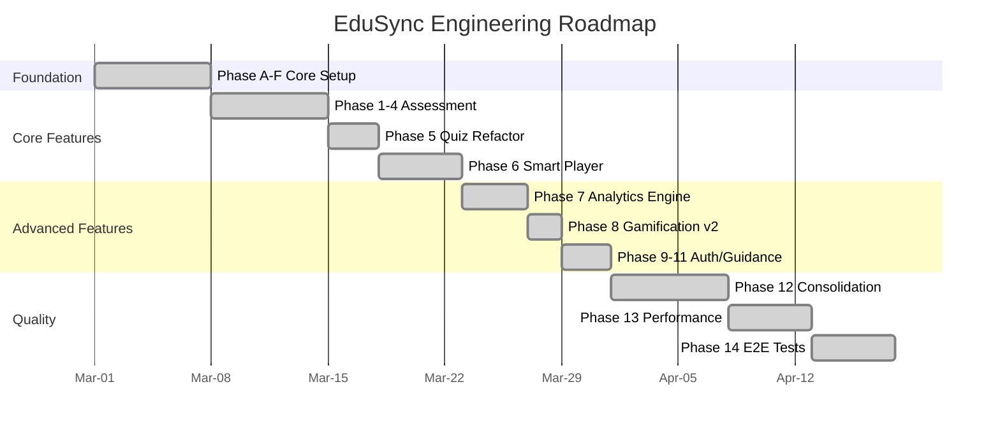

# EduSync LMS — Engineering Roadmap

From prototype to production. Built on a Supabase-centric serverless architecture.

---

## Current Status

```
✅ Phase A — UI & Mock Data Prototype (Full Frontend)
✅ Phase B — Supabase Backend Setup (Auth, DB Schema)
✅ Phase C — Edge Functions Deployment
✅ Phase D — Service Layer Context Migration (Mock → Supabase)
✅ Phase E — Consumer Page Type Fixing
✅ Phase F — Documentation
✅ Phase G — Testing Setup (Vitest + Playwright configured)
✅ Phase H — Production Hardening (RLS audit, security migrations)
✅ Phase I — Deployed (Supabase project: omfnkoufjqjqilswldtz)
```

---

## Feature Roadmap

```text
✅ Phase 1 — Core Assessment Engine (Quiz DB Schema, RPC grading, Security)
✅ Phase 2 — Assessment Enhancement (Quiz v2, Status, Versioning, Atomic Save, Anti-Cheat)
✅ Phase 3 — Learning Analytics & Progress Engine
   ✅ 3A: Gradebook UI & Exports
   ✅ 3B: Course Progress Engine (Event-driven DB Triggers)
   ✅ 3C: Learning Analytics Dashboard (course_stats, get_teacher_analytics)
✅ Phase 4 — Assignment System (Teacher-graded assignments, rubrics, SpeedGrader)
✅ Phase 5 — Quiz Engine Refactor (feature module, question bank, QuizPlayer v2)
✅ Phase 6 — Smart Player MVP (SP-0→SP-12: events, AI tutor, progress, UI)
✅ Phase 7 — Advanced Analytics Engine (810–820: aggregation, engagement, cohort, funnel, path, predictive alerts, struggle detection)
✅ Phase 8 — Gamification v2 (821–822: badges, certificates, XP, leaderboard v2, streaks)
✅ Phase 9 — Registration & Auth (Google OAuth, class join code, multi-step flow)
✅ Phase 10 — In-App Guidance (walkthroughs, tooltips, banners)
✅ Phase 11 — Attendance System (teacher scan, student view)
✅ Phase 12 — Feature Module Consolidation (migrate remaining services to features/*)
✅ Phase 12.5 — Feature Health 100/100 (24/24 features: structure, tests, dark mode, skeleton, docs)
✅ Phase 12.6 — Technical Debt Clearance (select(*) → explicit columns, moderation→Supabase, analytics RPC security, engagement RPC consolidation)
✅ Phase 13 — Performance & Scale (virtualization, infinite scroll, stale-time tiering, bundle splitting, Web Vitals)
✅ Phase 14 — E2E Test Coverage (shared helpers, quiz autosave+resume, class join code, CI workflow)
```

---

## Roadmap Overview



---

## Completed: Phase 13 — Performance & Scale

**Goal:** Prepare for 10k+ students.

```
✅ 13A — VirtualTable component + virtualised tables (DOM nodes −90%)
✅ 13B — Infinite scroll for Course Catalog (useInfiniteQuery, PAGE_SIZE=12)
✅ 13C — Stale-time tiering via STALE/GC constants in src/utils/queryConstants.ts
✅ 13D — 5 new vendor chunks in vite.config.ts (motion, dnd, markdown, sentry, date-fns)
✅ 13E — Web Vitals monitoring + Lighthouse CI (lighthouserc.json, perf:lighthouse script)
```

---

## Completed: Phase 14 — E2E Test Coverage

**Goal:** Catch regressions before users do.

```
✅ 14A — Shared E2E helpers (e2e/helpers/auth.ts) — eliminates login boilerplate across all specs
✅ 14B — Quiz autosave + resume flow (e2e/flows/quiz-autosave-resume.spec.ts)
✅ 14C — Class join code flow (e2e/flows/class-join-code.spec.ts)
✅ 14D — Upgraded stub tests: quiz.spec, course.spec, core.spec → real authenticated flows
✅ 14E — GitHub Actions CI workflow (.github/workflows/e2e.yml) — runs on every PR to main
```

---

## Infrastructure

| Item               | Status                                                                                                                                   |
| ------------------ | ---------------------------------------------------------------------------------------------------------------------------------------- |
| Supabase Project   | `omfnkoufjqjqilswldtz` — active                                                                                                          |
| Migrations applied | 157 files (001–825)                                                                                                                      |
| Edge Functions     | 7 deployed (ai-tutor, ai-grade-essay, grade-quiz-attempt, load-quiz-data, progress-events, process-progress-events, generate-ai-content) |
| pg_cron jobs       | badge-xp-streak-processor (every 5 min), aggregation jobs                                                                                |
| Frontend deploy    | Vite + Vercel/Netlify                                                                                                                    |

<!-- Phase 5 Feature Cross-Reference -->

## Feature Module Cross-Reference

EduSync LMS terdiri dari 24 feature module yang saling terintegrasi:

| Feature         | Domain         | Deskripsi                                                                                                                  |
| --------------- | -------------- | -------------------------------------------------------------------------------------------------------------------------- |
| administration  | Admin          | Administrasi — Manajemen tenant, konfigurasi modul sekolah, sinkronisasi data                                              |
| ai-tutor        | Learning       | AI Tutor — Asisten belajar berbasis AI yang memberikan penjelasan personal kepada siswa                                    |
| analytics       | Analytics      | Analitik — Dashboard analitik komprehensif untuk guru dan admin                                                            |
| announcements   | Communication  | Pengumuman — Sistem pengumuman sekolah                                                                                     |
| assignments     | Assessment     | Tugas — Manajemen tugas dari pembuatan hingga penilaian                                                                    |
| calendar        | Academic       | Kalender — Kalender akademik terintegrasi dengan jadwal pelajaran, ujian, deadline tugas, dan kegiatan sekolah             |
| classroom       | Academic       | Kelas — Manajemen kelas virtual dan fisik                                                                                  |
| courses         | Academic       | Kursus — Core learning module                                                                                              |
| dashboards      | Analytics      | Dashboard — Dashboard kustom dengan widget builder                                                                         |
| discussions     | Communication  | Diskusi — Forum diskusi per kursus                                                                                         |
| gamification    | Engagement     | Gamifikasi — Sistem gamifikasi lengkap: XP, badge, level, streak counter, dan leaderboard                                  |
| gradebook       | Assessment     | Buku Nilai — Buku nilai digital untuk guru                                                                                 |
| guidance        | Admin          | Panduan — Sistem panduan in-app (tooltip, walkthrough, banner, checkpoint)                                                 |
| lessons         | Learning       | Pelajaran — Konten pelajaran dengan block-based editor                                                                     |
| moderation      | Admin          | Moderasi — Moderasi konten user-generated (diskusi, komentar)                                                              |
| notifications   | Communication  | Notifikasi — Sistem notifikasi real-time dengan bell icon dan panel                                                        |
| onboarding      | Admin          | Onboarding — Wizard onboarding untuk pengguna baru                                                                         |
| progress        | Learning       | Kemajuan Belajar — Tracking progress belajar siswa secara granular per kursus, modul, dan pelajaran                        |
| question-bank   | Assessment     | Bank Soal — Repositori soal yang bisa digunakan ulang di berbagai kuis                                                     |
| quizzes         | Assessment     | Kuis — Sistem kuis komprehensif dengan timer, anti-cheat, autosave, review mode, dan analitik hasil per soal               |
| recommendations | Learning       | Rekomendasi — Engine rekomendasi konten berdasarkan progress, performa, dan pola belajar siswa                             |
| reports         | Analytics      | Laporan — Generator laporan akademik, keuangan (SPP), PPDB, dan custom                                                     |
| storage         | Infrastructure | Penyimpanan — Manajemen file dan media untuk materi pembelajaran                                                           |
| struggle        | Analytics      | Deteksi Kesulitan — Deteksi otomatis siswa yang kesulitan berdasarkan pola belajar, waktu per soal, dan penurunan performa |

Setiap feature module mengikuti arsitektur standar dengan folder: api/, queries/, hooks/, types/, components/, dan **tests**/. Semua feature mendukung dark mode dan skeleton loading screens.
