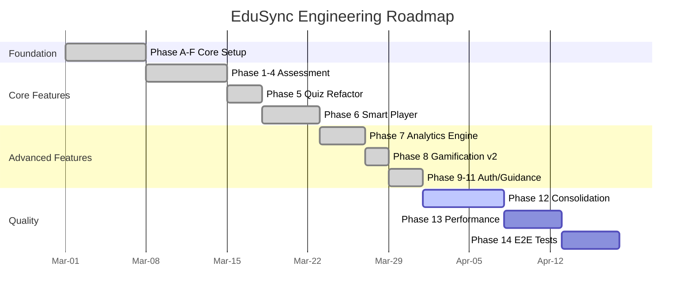

# EduSync LMS — Engineering Roadmap

From prototype to production. Built on a Supabase-centric serverless architecture.

---

## Current Status

```
✅ Phase A — UI & Mock Data Prototype (Full Frontend)
✅ Phase B — Supabase Backend Setup (Auth, DB Schema)
✅ Phase C — Edge Functions Deployment
✅ Phase D — Service Layer Context Migration (Mock → Supabase)
✅ Phase E — Consumer Page Type Fixing
✅ Phase F — Documentation
✅ Phase G — Testing Setup (Vitest + Playwright configured)
✅ Phase H — Production Hardening (RLS audit, security migrations)
✅ Phase I — Deployed (Supabase project: omfnkoufjqjqilswldtz)
```

---

## Feature Roadmap

```text
✅ Phase 1 — Core Assessment Engine (Quiz DB Schema, RPC grading, Security)
✅ Phase 2 — Assessment Enhancement (Quiz v2, Status, Versioning, Atomic Save, Anti-Cheat)
✅ Phase 3 — Learning Analytics & Progress Engine
   ✅ 3A: Gradebook UI & Exports
   ✅ 3B: Course Progress Engine (Event-driven DB Triggers)
   ✅ 3C: Learning Analytics Dashboard (course_stats, get_teacher_analytics)
✅ Phase 4 — Assignment System (Teacher-graded assignments, rubrics, SpeedGrader)
✅ Phase 5 — Quiz Engine Refactor (feature module, question bank, QuizPlayer v2)
✅ Phase 6 — Smart Player MVP (SP-0→SP-12: events, AI tutor, progress, UI)
✅ Phase 7 — Advanced Analytics Engine (810–820: aggregation, engagement, cohort, funnel, path, predictive alerts, struggle detection)
✅ Phase 8 — Gamification v2 (821–822: badges, certificates, XP, leaderboard v2, streaks)
✅ Phase 9 — Registration & Auth (Google OAuth, class join code, multi-step flow)
✅ Phase 10 — In-App Guidance (walkthroughs, tooltips, banners)
✅ Phase 11 — Attendance System (teacher scan, student view)
🔄 Phase 12 — Feature Module Consolidation (migrate remaining services to features/*)
⏳ Phase 13 — Performance & Scale (virtualization, infinite scroll, read replica)
⏳ Phase 14 — E2E Test Coverage (Playwright critical path)
```

---

## Roadmap Overview



---

## Active Phase: Phase 12 — Feature Module Consolidation

**Goal:** Finish migrating legacy `src/services/` into `src/features/*/api/` pattern.

```
Remaining to migrate:
- [ ] Gradebook → features/gradebook/
- [ ] Classroom → features/classroom/
- [ ] Course Builder (partial, BuilderContext still exists)
- [ ] Social/Forum → features/social/
- [ ] Admin pages → features/admin/

Already migrated (✅):
- [x] Quizzes → features/quizzes/
- [x] Analytics → features/analytics/
- [x] Gamification → features/gamification/
- [x] Guidance → features/guidance/
- [x] Struggle → features/struggle/
- [x] Courses → features/courses/ (api)
```

---

## Upcoming: Phase 13 — Performance & Scale

**Goal:** Prepare for 10k+ students.

```
Action Items:
- Add VirtualList component (@tanstack/react-virtual — already in package.json)
- Virtualize: gradebook, student roster, quiz attempt list, forum threads
- Implement infinite scroll for course catalog
- Apply stale-time strategy: STATIC(30m)/MODERATE(5m)/DYNAMIC(30s)/REALTIME(0)
- Add Supabase read replica for analytics queries (when >50k students)
```

---

## Upcoming: Phase 14 — E2E Test Coverage

**Goal:** Catch regressions before users do.

```
Action Items:
- E2E: login → enroll → lesson → quiz → progress (critical path)
- E2E: teacher invite → student register with class join code
- E2E: quiz attempt with autosave + resume
- Unit tests: domain mappers, service functions
- Add system_health monitoring view
```

---

## Infrastructure

| Item | Status |
|------|--------|
| Supabase Project | `omfnkoufjqjqilswldtz` — active |
| Migrations applied | 157 files (001–825) |
| Edge Functions | 7 deployed (ai-tutor, ai-grade-essay, grade-quiz-attempt, load-quiz-data, progress-events, process-progress-events, generate-ai-content) |
| pg_cron jobs | badge-xp-streak-processor (every 5 min), aggregation jobs |
| Frontend deploy | Vite + Vercel/Netlify |
