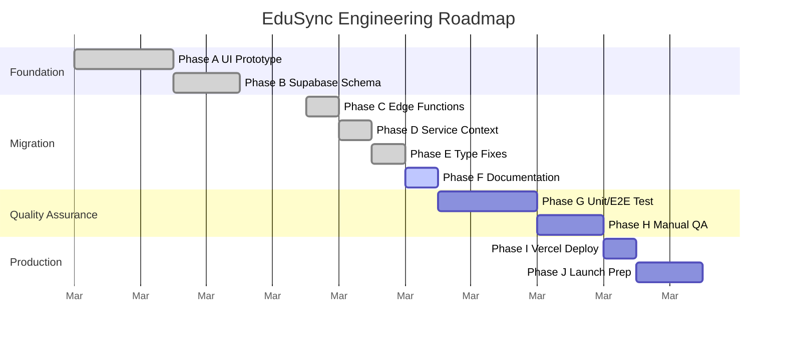

# EduSync LMS — Engineering Roadmap

From prototype to production. Migrated to a Supabase-centric architecture.

---

## Current Status

```
✅ Phase A — UI & Mock Data Prototype (Full Frontend)
✅ Phase B — Supabase Backend Setup (Auth, DB Schema)
✅ Phase C — Edge Functions Deployment
✅ Phase D — Service Layer Context Migration (Mock → Supabase)
✅ Phase E — Consumer Page Type Fixing
```

---

## Roadmap Overview



---

## Phase Details

### Phase G — Testing & QA (next)

**Goal:** Ensure system stability through automated testing.

```
Action Items:
- Run `npx tsc --noEmit` to ensure strict typing.
- Add Vitest for core utility/service testing.
- Add Playwright for E2E user flow tests (Login -> Enroll -> Submit).
```

---

### Phase I — Production Deployment 🚀

**Goal:** Live URL for EduSync LMS.

```
Action Items:
- Connect GitHub repo to Vercel/Netlify.
- Configure production environment variables (`VITE_SUPABASE_URL`, `VITE_SUPABASE_ANON_KEY`).
- Update Supabase Auth Redirect URLs.
- Setup custom domain (`edusync.com`).
```
