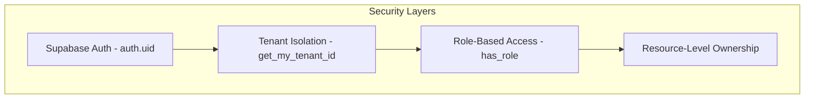

# EduSync LMS — Row Level Security Policies

> Complete reference for all RLS policies enforcing multi-tenant isolation.

---

## Architecture Overview

All data access flows through **four security layers**:

1. **Authentication** — `auth.uid()` ensures the user is logged in
2. **Tenant Isolation** — `tenant_id = get_my_tenant_id()` prevents cross-tenant data access
3. **Role Authorization** — `has_role('ROLE')` checks if user holds the required role _within their tenant_
4. **Ownership** — Resource-specific checks (e.g., teacher of a class, student's own submission)

---

## Helper Functions

### `get_my_tenant_id() → UUID`

Returns the `tenant_id` from `profiles` for the currently authenticated user.

- **Security**: `SECURITY DEFINER`, `STABLE`
- **Used in**: Every tenant-scoped RLS policy

### `has_role(required_role app_role) → BOOLEAN`

Returns `true` if the user holds the specified role **within their own tenant**.

- **Security**: `SECURITY DEFINER`, `STABLE`
- **Tenant-aware**: Checks `user_roles WHERE user_id = auth.uid() AND tenant_id = user's tenant`
- **Roles**: `STUDENT`, `TEACHER`, `ADMIN`

### `is_class_member(class_id UUID) → BOOLEAN`

Returns `true` if the user is the teacher of or enrolled in the class (same tenant).

### `is_class_teacher(class_id UUID) → BOOLEAN`

Returns `true` if the user is the teacher of the class (same tenant).

### `is_course_creator(course_id UUID) → BOOLEAN`

Returns `true` if the user created the course (same tenant).

---

## Tenant-Scoped Tables (26 tables)

All of these tables have a `tenant_id UUID NOT NULL` column with a foreign key to `tenants(id)` and an index.

| Domain         | Tables                                                                                                          |
| -------------- | --------------------------------------------------------------------------------------------------------------- |
| **Auth**       | `profiles`, `user_roles`                                                                                        |
| **Learning**   | `courses`, `course_modules`, `lessons`, `lesson_resources`, `lesson_progress`, `course_progress`                |
| **Classroom**  | `classes`, `enrollments`, `class_schedules`, `class_announcements`                                              |
| **Assessment** | `assignments`, `assignment_submissions`, `grades`, `quizzes`, `quiz_questions`, `quiz_options`, `quiz_attempts` |
| **Discussion** | `discussion_threads`, `discussion_posts`                                                                        |
| **Operations** | `attendance_records`, `notifications`, `activity_logs`, `invoices`, `payments`                                  |

## Global Tables (4 tables — no tenant_id)

| Table             | Scoped By                     |
| ----------------- | ----------------------------- |
| `badges`          | Global catalog, admin-managed |
| `user_badges`     | `user_id`                     |
| `user_points`     | `user_id`                     |
| `recommendations` | `user_id`                     |

---

## Policy Reference by Table

Legend: 🟢 Allowed | 🔴 Denied | ✅ Own data | 👨‍🏫 Class teacher | 🎓 Class member | 👑 Tenant admin

### Auth Domain

#### `tenants`

| Op     | Rule              |
| ------ | ----------------- |
| SELECT | Own tenant only   |
| UPDATE | Tenant admin only |

#### `profiles`

| Op     | Rule                                            |
| ------ | ----------------------------------------------- |
| SELECT | Same tenant (all members visible within tenant) |
| INSERT | Own user ID (`id = auth.uid()`)                 |
| UPDATE | Own profile OR tenant admin                     |
| DELETE | Tenant admin only                               |

#### `user_roles`

| Op     | Rule                      |
| ------ | ------------------------- |
| SELECT | Own roles OR tenant admin |
| INSERT | Tenant admin only         |
| UPDATE | Tenant admin only         |
| DELETE | Tenant admin only         |

---

### Learning Domain

#### `courses`

| Op     | Rule                                  |
| ------ | ------------------------------------- |
| SELECT | Any authenticated user within tenant  |
| INSERT | Teacher or admin within tenant        |
| UPDATE | Course creator or admin within tenant |
| DELETE | Course creator or admin within tenant |

#### `course_modules`

| Op     | Rule                                  |
| ------ | ------------------------------------- |
| SELECT | Any authenticated user within tenant  |
| INSERT | Course creator or admin within tenant |
| UPDATE | Course creator or admin within tenant |
| DELETE | Course creator or admin within tenant |

#### `lessons`

| Op     | Rule                                              |
| ------ | ------------------------------------------------- |
| SELECT | Any authenticated user within tenant              |
| INSERT | Course creator (via module→course chain) or admin |
| UPDATE | Course creator or admin within tenant             |
| DELETE | Course creator or admin within tenant             |

#### `lesson_resources`

| Op     | Rule                                                     |
| ------ | -------------------------------------------------------- |
| SELECT | Any authenticated user within tenant                     |
| INSERT | Course creator (via lesson→module→course chain) or admin |
| UPDATE | Course creator or admin within tenant                    |
| DELETE | Course creator or admin within tenant                    |

#### `lesson_progress`

| Op     | Rule                                     |
| ------ | ---------------------------------------- |
| SELECT | Own data, or teacher/admin within tenant |
| INSERT | Own data within tenant                   |
| UPDATE | Own data within tenant                   |
| DELETE | Tenant admin only                        |

#### `course_progress`

| Op     | Rule                                     |
| ------ | ---------------------------------------- |
| SELECT | Own data, or teacher/admin within tenant |
| INSERT | Own data within tenant                   |
| UPDATE | Own data within tenant                   |
| DELETE | Tenant admin only                        |

---

### Classroom Domain

#### `classes`

| Op     | Rule                                                      |
| ------ | --------------------------------------------------------- |
| SELECT | Class teacher, enrolled student, or admin — within tenant |
| INSERT | Teacher or admin within tenant                            |
| UPDATE | Class teacher or admin within tenant                      |
| DELETE | Class teacher or admin within tenant                      |

#### `enrollments`

| Op     | Rule                                                    |
| ------ | ------------------------------------------------------- |
| SELECT | Own enrollment, class teacher, or admin — within tenant |
| INSERT | Student (self-enroll) or admin within tenant            |
| UPDATE | Class teacher or admin within tenant                    |
| DELETE | Class teacher or admin within tenant                    |

#### `class_schedules`

| Op     | Rule                                 |
| ------ | ------------------------------------ |
| SELECT | Class member or admin within tenant  |
| INSERT | Class teacher or admin within tenant |
| UPDATE | Class teacher or admin within tenant |
| DELETE | Class teacher or admin within tenant |

#### `class_announcements`

| Op     | Rule                                 |
| ------ | ------------------------------------ |
| SELECT | Class member or admin within tenant  |
| INSERT | Class teacher or admin within tenant |
| UPDATE | Class teacher or admin within tenant |
| DELETE | Class teacher or admin within tenant |

---

### Assessment Domain

#### `assignments`

| Op     | Rule                                 |
| ------ | ------------------------------------ |
| SELECT | Class member or admin within tenant  |
| INSERT | Class teacher or admin within tenant |
| UPDATE | Class teacher or admin within tenant |
| DELETE | Class teacher or admin within tenant |

#### `assignment_submissions`

| Op     | Rule                                                        |
| ------ | ----------------------------------------------------------- |
| SELECT | Submitting student, class teacher, or admin — within tenant |
| INSERT | Student (own submission) within tenant                      |
| UPDATE | Student (own submission) within tenant                      |
| DELETE | Tenant admin only                                           |

#### `grades`

| Op     | Rule                                                         |
| ------ | ------------------------------------------------------------ |
| SELECT | Student (own grade), class teacher, or admin — within tenant |
| INSERT | Class teacher (via submission→assignment→class) or admin     |
| UPDATE | Class teacher or admin within tenant                         |
| DELETE | Tenant admin only                                            |

#### `quizzes`

| Op     | Rule                                 |
| ------ | ------------------------------------ |
| SELECT | Class member or admin within tenant  |
| INSERT | Class teacher or admin within tenant |
| UPDATE | Class teacher or admin within tenant |
| DELETE | Class teacher or admin within tenant |

#### `quiz_questions`

| Op     | Rule                                    |
| ------ | --------------------------------------- |
| SELECT | Any authenticated user within tenant    |
| INSERT | Class teacher (via quiz→class) or admin |
| UPDATE | Class teacher or admin within tenant    |
| DELETE | Class teacher or admin within tenant    |

#### `quiz_options`

| Op     | Rule                                             |
| ------ | ------------------------------------------------ |
| SELECT | Any authenticated user within tenant             |
| INSERT | Class teacher (via question→quiz→class) or admin |
| UPDATE | Class teacher or admin within tenant             |
| DELETE | Class teacher or admin within tenant             |

#### `quiz_attempts`

| Op     | Rule                                                   |
| ------ | ------------------------------------------------------ |
| SELECT | Student (own), class teacher, or admin — within tenant |
| INSERT | Student (own attempt) within tenant                    |
| DELETE | Tenant admin only                                      |

---

### Discussion Domain

#### `discussion_threads`

| Op     | Rule                                                  |
| ------ | ----------------------------------------------------- |
| SELECT | Class member or admin within tenant                   |
| INSERT | Class member within tenant                            |
| UPDATE | Thread creator, class teacher, or admin within tenant |
| DELETE | Thread creator, class teacher, or admin within tenant |

#### `discussion_posts`

| Op     | Rule                                                   |
| ------ | ------------------------------------------------------ |
| SELECT | Class member (via thread→class) or admin within tenant |
| INSERT | Post author within tenant                              |
| UPDATE | Post author within tenant                              |
| DELETE | Post author or admin within tenant                     |

---

### Operations Domain

#### `attendance_records`

| Op     | Rule                                                                  |
| ------ | --------------------------------------------------------------------- |
| SELECT | Student (own via enrollment), class teacher, or admin — within tenant |
| INSERT | Class teacher or admin within tenant                                  |
| UPDATE | Class teacher or admin within tenant                                  |
| DELETE | Tenant admin only                                                     |

#### `notifications`

| Op     | Rule                                           |
| ------ | ---------------------------------------------- |
| SELECT | Own notifications within tenant                |
| INSERT | Tenant admin (system/triggers)                 |
| UPDATE | Own notifications (mark as read) within tenant |
| DELETE | Tenant admin only                              |

#### `activity_logs`

| Op     | Rule                            |
| ------ | ------------------------------- |
| SELECT | Own logs or admin within tenant |
| INSERT | Own logs within tenant          |
| DELETE | Tenant admin only               |

#### `invoices`

| Op     | Rule                                |
| ------ | ----------------------------------- |
| SELECT | Own invoices or admin within tenant |
| INSERT | Tenant admin only                   |
| UPDATE | Tenant admin only                   |
| DELETE | Tenant admin only                   |

#### `payments`

| Op     | Rule                                     |
| ------ | ---------------------------------------- |
| SELECT | Own (via invoice) or admin within tenant |
| INSERT | Tenant admin only                        |
| UPDATE | Tenant admin only                        |
| DELETE | Tenant admin only                        |

---

### Global Tables

#### `badges`

| Op     | Rule                   |
| ------ | ---------------------- |
| SELECT | Any authenticated user |
| INSERT | Admin only             |
| UPDATE | Admin only             |
| DELETE | Admin only             |

#### `user_badges`

| Op     | Rule                |
| ------ | ------------------- |
| SELECT | Own badges or admin |
| INSERT | Admin only          |
| DELETE | Admin only          |

#### `user_points`

| Op     | Rule                |
| ------ | ------------------- |
| SELECT | Own points or admin |
| INSERT | Own or admin        |
| UPDATE | Own or admin        |
| DELETE | Admin only          |

#### `recommendations`

| Op     | Rule                |
| ------ | ------------------- |
| SELECT | Own recommendations |
| INSERT | Admin only          |
| UPDATE | Admin only          |
| DELETE | Admin only          |

---

## Migration History

| Version        | Name                                      | Description                                                                                                                |
| -------------- | ----------------------------------------- | -------------------------------------------------------------------------------------------------------------------------- |
| `20260308_01`  | `add_tenant_infrastructure`               | Created `tenants` table, added `tenant_id` to 26 tables                                                                    |
| `20260308_02`  | `add_tenant_helper_functions`             | Created `get_my_tenant_id()`, updated `has_role()`, added `is_class_member()`, `is_class_teacher()`, `is_course_creator()` |
| `20260308_03`  | `drop_all_existing_rls_policies`          | Dropped all 72 legacy policies                                                                                             |
| `20260308_04a` | `implement_tenant_rls_policies_core`      | Policies for tenants, profiles, user_roles, courses, classes, enrollments                                                  |
| `20260308_04b` | `implement_tenant_rls_policies_learning`  | Policies for course_modules, lessons, resources, progress                                                                  |
| `20260308_04c` | `implement_tenant_rls_policies_classroom` | Policies for assignments, grades, quizzes, discussions, attendance, schedules, announcements                               |
| `20260308_04d` | `implement_tenant_rls_policies_remaining` | Policies for notifications, activity_logs, invoices, payments, badges, user_badges, user_points, recommendations           |

<!-- Phase 5 Feature Cross-Reference -->

## Feature Module Cross-Reference

EduSync LMS terdiri dari 49 feature module yang saling terintegrasi:

| Feature         | Domain         | Deskripsi                                                                                                                  |
| --------------- | -------------- | -------------------------------------------------------------------------------------------------------------------------- |
| administration  | Admin          | Administrasi — Manajemen tenant, konfigurasi modul sekolah, sinkronisasi data                                              |
| ai-tutor        | Learning       | AI Tutor — Asisten belajar berbasis AI yang memberikan penjelasan personal kepada siswa                                    |
| analytics       | Analytics      | Analitik — Dashboard analitik komprehensif untuk guru dan admin                                                            |
| announcements   | Communication  | Pengumuman — Sistem pengumuman sekolah                                                                                     |
| assignments     | Assessment     | Tugas — Manajemen tugas dari pembuatan hingga penilaian                                                                    |
| calendar        | Academic       | Kalender — Kalender akademik terintegrasi dengan jadwal pelajaran, ujian, deadline tugas, dan kegiatan sekolah             |
| classroom       | Academic       | Kelas — Manajemen kelas virtual dan fisik                                                                                  |
| courses         | Academic       | Kursus — Core learning module                                                                                              |
| dashboards      | Analytics      | Dashboard — Dashboard kustom dengan widget builder                                                                         |
| discussions     | Communication  | Diskusi — Forum diskusi per kursus                                                                                         |
| gamification    | Engagement     | Gamifikasi — Sistem gamifikasi lengkap: XP, badge, level, streak counter, dan leaderboard                                  |
| gradebook       | Assessment     | Buku Nilai — Buku nilai digital untuk guru                                                                                 |
| guidance        | Admin          | Panduan — Sistem panduan in-app (tooltip, walkthrough, banner, checkpoint)                                                 |
| lessons         | Learning       | Pelajaran — Konten pelajaran dengan block-based editor                                                                     |
| moderation      | Admin          | Moderasi — Moderasi konten user-generated (diskusi, komentar)                                                              |
| notifications   | Communication  | Notifikasi — Sistem notifikasi real-time dengan bell icon dan panel                                                        |
| onboarding      | Admin          | Onboarding — Wizard onboarding untuk pengguna baru                                                                         |
| progress        | Learning       | Kemajuan Belajar — Tracking progress belajar siswa secara granular per kursus, modul, dan pelajaran                        |
| question-bank   | Assessment     | Bank Soal — Repositori soal yang bisa digunakan ulang di berbagai kuis                                                     |
| quizzes         | Assessment     | Kuis — Sistem kuis komprehensif dengan timer, anti-cheat, autosave, review mode, dan analitik hasil per soal               |
| recommendations | Learning       | Rekomendasi — Engine rekomendasi konten berdasarkan progress, performa, dan pola belajar siswa                             |
| reports         | Analytics      | Laporan — Generator laporan akademik, keuangan (SPP), PPDB, dan custom                                                     |
| storage         | Infrastructure | Penyimpanan — Manajemen file dan media untuk materi pembelajaran                                                           |
| struggle        | Analytics      | Deteksi Kesulitan — Deteksi otomatis siswa yang kesulitan berdasarkan pola belajar, waktu per soal, dan penurunan performa |

Setiap feature module mengikuti arsitektur standar dengan folder: api/, queries/, hooks/, types/, components/, dan **tests**/. Semua feature mendukung dark mode dan skeleton loading screens.
