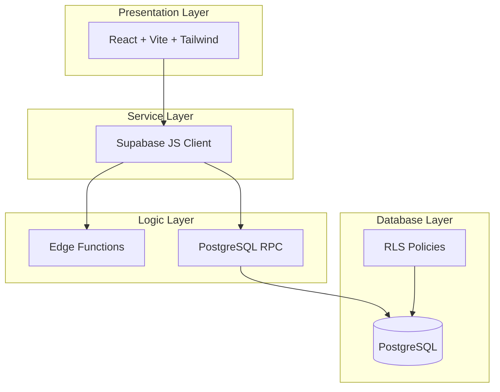
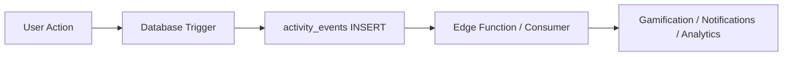

# EduSync LMS — System Map

> **Single Source of Truth** for all AI agents (executor/reviewer) to ensure consistent architecture and prevent collisions.
>
> This document maps all 9 core modules with their database schemas, RPCs, RLS policies, Edge Functions, service patterns, and event-driven triggers.
>
> **Principles:** Follows the [EduSync Engineering Constitution](./docs/architecture/DOMAIN_MAP.md) — Security, Correctness, Scalability, Maintainability.

---

## Table of Contents

1. [Architecture Overview](#architecture-overview)
2. [Module 1: Auth (Identity)](#module-1-auth-identity)
3. [Module 2: Tenant](#module-2-tenant)
4. [Module 3: Class](#module-3-class)
5. [Module 4: Course](#module-4-course)
6. [Module 5: Lesson](#module-5-lesson)
7. [Module 6: Quiz](#module-6-quiz)
8. [Module 7: Assignment](#module-7-assignment)
9. [Module 8: Gradebook](#module-8-gradebook)
10. [Module 9: Analytics](#module-9-analytics)
11. [AI Tutor System](#ai-tutor-system)
12. [Cross-Module Events](#cross-module-events)
13. [Security Checklist](#security-checklist)
14. [Performance Checklist](#performance-checklist)

---

## Architecture Overview



### Multi-Tenant Isolation Rules

| Rule                                                         | Implementation                                   |
| ------------------------------------------------------------ | ------------------------------------------------ |
| All tenant-scoped tables MUST have `tenant_id UUID NOT NULL` | Foreign key to `tenants(id)` with index          |
| Queries MUST include `tenant_id` filter                      | Service layer enforces via `tenantId` parameter  |
| RLS policies MUST enforce tenant boundaries                  | `tenant_id = get_my_tenant_id()` in all policies |
| Edge Functions MUST validate tenant_id                       | Extracted from JWT `app_metadata.tenant_id`      |

### Helper Functions (Security Layer)

```sql
-- Get current user's tenant_id
CREATE FUNCTION get_my_tenant_id() RETURNS UUID
    SECURITY DEFINER STABLE
    AS $$ SELECT tenant_id FROM profiles WHERE id = auth.uid() $$;

-- Check user role within tenant
CREATE FUNCTION has_role(required_role app_role) RETURNS BOOLEAN
    SECURITY DEFINER STABLE
    AS $$ SELECT EXISTS (
        SELECT 1 FROM user_roles
        WHERE user_id = auth.uid()
        AND tenant_id = get_my_tenant_id()
        AND role = required_role
    ) $$;

-- Class membership check
CREATE FUNCTION is_class_member(class_id UUID) RETURNS BOOLEAN
    SECURITY DEFINER STABLE
    AS $$ SELECT EXISTS (
        SELECT 1 FROM enrollments
        WHERE class_id = $1 AND student_id = auth.uid()
        UNION ALL
        SELECT 1 FROM classes
        WHERE id = $1 AND teacher_id = auth.uid()
    ) $$;
```

---

## Module 1: Auth (Identity)

**Domain Classification:** `identity`

### 1.1 Tables

| Table           | Purpose                              | tenant_id   | Key Columns                                              |
| --------------- | ------------------------------------ | ----------- | -------------------------------------------------------- |
| `profiles`      | User profile linked to Supabase Auth | ✅ Required | `id`, `tenant_id`, `full_name`, `avatar_url`, `role`     |
| `user_roles`    | Role assignments per tenant          | ✅ Required | `user_id`, `tenant_id`, `role`                           |
| `user_sessions` | Device tracking, login history       | ✅ Required | `user_id`, `device_info`, `ip_address`, `last_active_at` |

### 1.2 Key RPCs

| Function                   | Purpose                                   | Access                     |
| -------------------------- | ----------------------------------------- | -------------------------- |
| `get_current_user()`       | Returns authenticated user profile        | Authenticated              |
| `update_profile(updates)`  | Updates user profile                      | Own profile                |
| `switch_tenant(tenant_id)` | Switches between multi-tenant memberships | User with multiple tenants |

### 1.3 RLS Policies

```sql
-- profiles: SELECT for same tenant, UPDATE own, DELETE admin
CREATE POLICY "profiles_select_tenant" ON profiles
    FOR SELECT USING (tenant_id = get_my_tenant_id());

CREATE POLICY "profiles_insert_own" ON profiles
    FOR INSERT WITH CHECK (id = auth.uid());

CREATE POLICY "profiles_update_own" ON profiles
    FOR UPDATE USING (id = auth.uid() OR has_role('ADMIN'));
```

### 1.4 Service Layer

```typescript
// src/contexts/AuthContext.tsx
interface User {
  id: string
  email: string
  tenant_id: string
  role: 'STUDENT' | 'TEACHER' | 'ADMIN'
}

const signIn = async (email: string, password: string) => {
  const { data, error } = await supabase.auth.signInWithPassword({
    email,
    password,
  })
  // JWT includes tenant_id in app_metadata
}

const signUp = async (email: string, password: string, tenantId: string) => {
  const { data, error } = await supabase.auth.signUp({
    email,
    password,
    options: {
      data: { tenant_id: tenantId },
    },
  })
}
```

### 1.5 Event Triggers

| Event          | Trigger            | Action                               |
| -------------- | ------------------ | ------------------------------------ |
| `USER_CREATED` | Supabase Auth hook | Creates `profiles` row automatically |

---

## Module 2: Tenant

**Domain Classification:** `tenant`

### 2.1 Tables

| Table                | Purpose                            | tenant_id   | Key Columns                                 |
| -------------------- | ---------------------------------- | ----------- | ------------------------------------------- |
| `tenants`            | School/organization                | N/A (root)  | `id`, `name`, `slug`, `domain`, `status`    |
| `tenant_modules`     | Feature toggles per tenant         | N/A         | `tenant_id`, `module_name`, `is_enabled`    |
| `tenant_settings`    | UI/theme configuration             | N/A         | `tenant_id`, `theme_colors`, `logo_url`     |
| `academic_units`     | Academic levels (TK, SD, SMP, SMA) | ✅ Required | `id`, `tenant_id`, `name`                   |
| `tenant_memberships` | Multi-tenant user mapping          | ✅ Required | `tenant_id`, `user_id`, `role`, `joined_at` |

### 2.2 Key RPCs

| Function                                | Purpose                      | Access         |
| --------------------------------------- | ---------------------------- | -------------- |
| `create_tenant(name, slug)`             | Creates new tenant           | Superuser      |
| `get_tenant_settings(tenant_id)`        | Returns tenant configuration | Tenant members |
| `update_tenant_settings(settings)`      | Updates tenant config        | Tenant admin   |
| `toggle_tenant_module(module, enabled)` | Feature toggle               | Tenant admin   |

### 2.3 RLS Policies

```sql
-- tenants: Only own tenant
CREATE POLICY "tenants_select_own" ON tenants
    FOR SELECT USING (id = get_my_tenant_id());

-- tenant_modules: Tenant admin only
CREATE POLICY "tenant_modules_full_access" ON tenant_modules
    FOR ALL USING (has_role('ADMIN'));
```

### 2.4 Service Layer

```typescript
// src/contexts/TenantContext.tsx
const fetchTenantSettings = async (tenantId: string) => {
  const { data } = await supabase
    .from('tenant_settings')
    .select('*')
    .eq('tenant_id', tenantId)
    .single()
  return data
}
```

---

## Module 3: Class

**Domain Classification:** `academic`

### 3.1 Tables

| Table                 | Purpose                     | tenant_id   | Key Columns                                                                |
| --------------------- | --------------------------- | ----------- | -------------------------------------------------------------------------- |
| `classes`             | Physical/virtual classrooms | ✅ Required | `id`, `tenant_id`, `subject_id`, `teacher_id`, `join_code`, `max_students` |
| `class_teachers`      | Multi-teacher support       | ✅ Required | `class_id`, `teacher_id`, `role`                                           |
| `enrollments`         | Student class memberships   | ✅ Required | `class_id`, `student_id`, `status`, `joined_at`                            |
| `class_schedules`     | Weekly schedule             | ✅ Required | `class_id`, `day_of_week`, `time`, `room`                                  |
| `class_announcements` | Class broadcasts            | ✅ Required | `class_id`, `author_id`, `content`, `published_at`                         |

### 3.2 Key RPCs

| Function                               | Purpose                                           | Access        |
| -------------------------------------- | ------------------------------------------------- | ------------- |
| `create_class(name, subject_id)`       | Creates class with auto-generated join code       | Teacher/Admin |
| `join_class_by_code(code)`             | Enrolls student in class                          | Student       |
| `enroll_student(p_join_code)`          | RPC: Validates code, capacity, creates enrollment | Student       |
| `get_my_classes()`                     | Returns user's classes based on role              | Authenticated |
| `assign_teacher(class_id, teacher_id)` | Assigns co-teacher                                | Teacher/Admin |

### 3.3 RLS Policies

```sql
-- classes: SELECT for members, INSERT teacher/admin, UPDATE/DELETE teacher/admin
CREATE POLICY "classes_select" ON classes
    FOR SELECT USING (
        tenant_id = get_my_tenant_id() AND (
            teacher_id = auth.uid() OR
            has_role('ADMIN') OR
            is_class_member(id)
        )
    );

CREATE POLICY "classes_insert" ON classes
    FOR INSERT WITH CHECK (
        tenant_id = get_my_tenant_id() AND
        (has_role('TEACHER') OR has_role('ADMIN'))
    );
```

### 3.4 Service Layer

```typescript
// src/services/classroomService.ts
const fetchClassrooms = async (userId: string, role: UserRole, tenantId: string) => {
  if (role === 'teacher') {
    return supabase.from('classes').select('*').eq('teacher_id', userId).eq('tenant_id', tenantId)
  }
  // Students fetch via enrollments
  return supabase
    .from('enrollments')
    .select('class_id, classes(*)')
    .eq('student_id', userId)
    .eq('tenant_id', tenantId)
}

const joinClassroom = async (joinCode: string) => {
  await supabase.rpc('enroll_student', { p_join_code: joinCode.toUpperCase() })
}
```

### 3.5 Event Triggers

| Event              | Trigger              | Action                                               |
| ------------------ | -------------------- | ---------------------------------------------------- |
| `CLASS_CREATED`    | `classes` INSERT     | Log activity, notify assigned teachers               |
| `STUDENT_ENROLLED` | `enrollments` INSERT | Trigger `create_activity_event`, update gamification |
| `CLASS_JOINED`     | `enrollments` INSERT | Insert into `activity_events`                        |

---

## Module 4: Course

**Domain Classification:** `learning`

### 4.1 Tables

| Table             | Purpose                         | tenant_id   | Key Columns                                                           |
| ----------------- | ------------------------------- | ----------- | --------------------------------------------------------------------- |
| `courses`         | Course container                | ✅ Required | `id`, `tenant_id`, `subject_id`, `title`, `description`, `created_by` |
| `course_modules`  | Module/chapter grouping         | ✅ Required | `course_id`, `title`, `order_index`                                   |
| `course_classes`  | Course-class assignments        | ✅ Required | `course_id`, `class_id`                                               |
| `course_progress` | Pre-aggregated student progress | ✅ Required | `course_id`, `user_id`, `percentage`, `completed_lessons`             |
| `course_stats`    | Pre-aggregated analytics        | ✅ Required | `course_id`, `avg_progress`, `completion_rate`                        |

### 4.2 Key RPCs

| Function                                          | Purpose                   | Access               |
| ------------------------------------------------- | ------------------------- | -------------------- |
| `create_course(data)`                             | Creates new course        | Teacher/Admin        |
| `publish_course(course_id)`                       | Makes course visible      | Course creator/Admin |
| `distribute_course_to_class(course_id, class_id)` | Assigns course to class   | Teacher/Admin        |
| `refresh_course_stats(p_course_id)`               | Recalculates course_stats | Teacher/Admin        |
| `recompute_course_progress(user_id, course_id)`   | Updates student progress  | System/Trigger       |

### 4.3 RLS Policies

```sql
-- courses: SELECT for tenant, INSERT teacher/admin, UPDATE/DELETE creator/admin
CREATE POLICY "courses_select" ON courses
    FOR SELECT USING (tenant_id = get_my_tenant_id());

CREATE POLICY "courses_insert" ON courses
    FOR INSERT WITH CHECK (
        tenant_id = get_my_tenant_id() AND
        (has_role('TEACHER') OR has_role('ADMIN'))
    );
```

### 4.4 Service Layer

```typescript
// src/services/courseService.ts
const fetchCourses = async ({ tenantId, page = 1, limit = 10, search }) => {
  let query = supabase
    .from('courses')
    .select('*, assigned_classes:course_classes(class_id, class:classes(name))')
    .eq('tenant_id', tenantId)
    .order('created_at', { ascending: false })

  if (search) query = query.ilike('title', `%${search}%`)

  const from = (page - 1) * limit
  query = query.range(from, from + limit - 1)

  return query
}
```

### 4.5 Event Triggers

| Event              | Trigger                          | Action                             |
| ------------------ | -------------------------------- | ---------------------------------- |
| `COURSE_CREATED`   | `courses` INSERT                 | Log activity                       |
| `COURSE_COMPLETED` | `course_progress` UPDATE to 100% | Trigger gamification, award badges |

---

## Module 5: Lesson

**Domain Classification:** `learning`

### 5.1 Tables

| Table              | Purpose                   | tenant_id   | Key Columns                                                            |
| ------------------ | ------------------------- | ----------- | ---------------------------------------------------------------------- |
| `lessons`          | Individual learning units | ✅ Required | `id`, `module_id`, `title`, `type`, `content`, `order`, `is_published` |
| `lesson_resources` | Videos, PDFs, links       | ✅ Required | `lesson_id`, `type`, `url`, `title`, `content`                         |
| `lesson_comments`  | Student notes/feedback    | ✅ Required | `lesson_id`, `user_id`, `content`                                      |
| `lesson_progress`  | Per-student completion    | ✅ Required | `lesson_id`, `user_id`, `status`, `progress_percentage`, `completed`   |

### 5.2 Key RPCs

| Function                                    | Purpose                           | Access        |
| ------------------------------------------- | --------------------------------- | ------------- |
| `update_lesson_progress_monotonic(...)`     | Updates progress (monotonic only) | Student       |
| `mark_lesson_complete(lesson_id)`           | Marks lesson as 100% complete     | Student       |
| `get_lesson_context(lesson_id, user_id)`    | Returns context for AI Tutor      | Student       |
| `search_lesson_resources(course_id, query)` | Full-text search                  | Authenticated |

### 5.3 RLS Policies

```sql
-- lessons: SELECT for tenant, INSERT/UPDATE/DELETE course creator/admin
CREATE POLICY "lessons_select" ON lessons
    FOR SELECT USING (tenant_id = get_my_tenant_id());

-- lesson_progress: SELECT own or teacher/admin, INSERT/UPDATE own
CREATE POLICY "lesson_progress_select" ON lesson_progress
    FOR SELECT USING (
        tenant_id = get_my_tenant_id() AND (
            user_id = auth.uid() OR
            has_role('TEACHER') OR
            has_role('ADMIN')
        )
    );
```

### 5.4 Service Layer

```typescript
// src/services/lessonService.ts
const fetchLesson = async (lessonId: string, tenantId: string) => {
  return supabase
    .from('lessons')
    .select(
      `
            *, course_modules(course_id),
            lesson_resources(*),
            quizzes(*, quiz_questions(*, quiz_options(*)))
        `
    )
    .eq('id', lessonId)
    .eq('tenant_id', tenantId)
    .single()
}

const updateProgress = async (lessonId, tenantId, status, progressPercentage) => {
  await supabase.rpc('update_lesson_progress_monotonic', {
    p_user_id: user.id,
    p_lesson_id: lessonId,
    p_tenant_id: tenantId,
    p_status: status,
    p_progress_percentage: progressPercentage,
  })
}
```

### 5.5 Event Triggers

| Event                     | Trigger                                 | Action                                            |
| ------------------------- | --------------------------------------- | ------------------------------------------------- |
| `LESSON_STARTED`          | `lesson_progress` INSERT                | Insert into `activity_events`                     |
| `LESSON_PROGRESS_UPDATED` | `lesson_progress` UPDATE                | Insert into `activity_events`                     |
| `LESSON_COMPLETED`        | `lesson_progress` UPDATE completed=true | Trigger `recompute_course_progress`, gamification |

---

## Module 6: Quiz

**Domain Classification:** `assessment`

### 6.1 Tables

| Table                    | Purpose                       | tenant_id   | Key Columns                                                           |
| ------------------------ | ----------------------------- | ----------- | --------------------------------------------------------------------- |
| `quizzes`                | Quiz definition               | ✅ Required | `class_id`, `title`, `time_limit`, `passing_score`, `is_published`    |
| `quiz_questions`         | Questions in quiz             | ✅ Required | `quiz_id`, `question_text`, `type`, `points`, `question_bank_id`      |
| `quiz_options`           | Answer options                | ✅ Required | `question_id`, `option_text`, `is_correct`, `order`                   |
| `quiz_attempts`          | Student attempt records       | ✅ Required | `quiz_id`, `user_id`, `status`, `score`, `started_at`, `submitted_at` |
| `quiz_attempt_questions` | Per-question snapshot         | ✅ Required | `attempt_id`, `question_id`, `question_snapshot` JSONB                |
| `question_bank`          | Reusable question repository  | ✅ Required | `tenant_id`, `question_text`, `type`, `difficulty`                    |
| `question_options`       | Bank question options         | ✅ Required | `question_id`, `option_text`, `is_correct`                            |
| `quiz_stats`             | Pre-aggregated quiz analytics | ✅ Required | `quiz_id`, `avg_score`, `attempt_count`, `pass_rate`                  |

### 6.2 Key RPCs

| Function                                                    | Purpose                              | Access        |
| ----------------------------------------------------------- | ------------------------------------ | ------------- |
| `start_quiz_attempt(quiz_id)`                               | Creates attempt, snapshots questions | Student       |
| `submit_quiz_attempt(attempt_id, answers, version)`         | Auto-grades MCQ, defers essays       | Student       |
| `grade_attempt_question(id, points, correct, comment)`      | Manual grading                       | Teacher/Admin |
| `create_question(...)`                                      | Creates bank question                | Teacher/Admin |
| `add_question_to_quiz(bank_id, quiz_id, order)`             | Links bank question to quiz          | Teacher/Admin |
| `search_questions(filter)`                                  | Search questions with pagination     | Teacher/Admin |
| `get_quiz_for_student(quiz_id)`                             | Returns quiz without answers         | Student       |
| `save_quiz_progress(attempt_id, current_question, answers)` | Auto-save                            | Student       |

### 6.3 RLS Policies

```sql
-- quizzes: SELECT class members, INSERT/UPDATE/DELETE teacher/admin
CREATE POLICY "quizzes_select" ON quizzes
    FOR SELECT USING (
        tenant_id = get_my_tenant_id() AND (
            has_role('ADMIN') OR
            has_role('TEACHER') OR
            is_class_member(class_id)
        )
    );

-- quiz_attempts: SELECT own or teacher/admin
CREATE POLICY "quiz_attempts_select" ON quiz_attempts
    FOR SELECT USING (
        tenant_id = get_my_tenant_id() AND (
            user_id = auth.uid() OR
            has_role('TEACHER') OR
            has_role('ADMIN')
        )
    );
```

### 6.4 Edge Functions

| Edge Function        | Purpose                             | Triggers        |
| -------------------- | ----------------------------------- | --------------- |
| `grade-quiz-attempt` | Grades quiz attempts asynchronously | Timer/cron      |
| `load-quiz-data`     | Preloads quiz data for student      | On quiz start   |
| `ai-grade-essay`     | AI-powered essay grading via Groq   | Teacher request |

### 6.5 Service Layer

```typescript
// src/services/quizService.ts
const startAttempt = async (quizId: string) => {
  return supabase.rpc('start_quiz_attempt', { p_quiz_id: quizId })
}

const submitAttempt = async (attemptId: string, answers: Answer[]) => {
  return supabase.rpc('submit_quiz_attempt', {
    p_attempt_id: attemptId,
    p_answers: answers,
    p_version: 1,
  })
}

const fetchQuizForStudent = async (quizId: string) => {
  // Returns quiz WITHOUT is_correct flag
  return supabase.rpc('get_quiz_for_student', { p_quiz_id: quizId })
}
```

### 6.6 Event Triggers

| Event            | Trigger                                 | Action                                    |
| ---------------- | --------------------------------------- | ----------------------------------------- |
| `QUIZ_STARTED`   | `quiz_attempts` INSERT                  | Insert into `activity_events`             |
| `QUIZ_SUBMITTED` | `quiz_attempts` UPDATE status=SUBMITTED | Auto-grade via RPC                        |
| `QUIZ_GRADED`    | `quiz_attempts` UPDATE status=GRADED    | Update `quiz_stats`, trigger gamification |

---

## Module 7: Assignment

**Domain Classification:** `assessment`

### 7.1 Tables

| Table                    | Purpose               | tenant_id   | Key Columns                                                                   |
| ------------------------ | --------------------- | ----------- | ----------------------------------------------------------------------------- |
| `assignments`            | Assignment definition | ✅ Required | `class_id`, `title`, `instructions`, `due_date`, `max_points`, `is_published` |
| `rubrics`                | Grading rubrics       | ✅ Required | `assignment_id`, `title`, `description`, `criteria`                           |
| `rubric_scores`          | Per-criteria scores   | ✅ Required | `submission_id`, `rubric_id`, `score`, `comment`                              |
| `assignment_submissions` | Student submissions   | ✅ Required | `assignment_id`, `student_id`, `content`, `status`, `submitted_at`            |
| `assignment_attachments` | File attachments      | ✅ Required | `submission_id`, `file_url`, `file_type`                                      |

### 7.2 Key RPCs

| Function                                           | Purpose            | Access        |
| -------------------------------------------------- | ------------------ | ------------- |
| `create_assignment(data)`                          | Creates assignment | Teacher/Admin |
| `submit_assignment(assignment_id, content)`        | Student submits    | Student       |
| `grade_submission(submission_id, score, feedback)` | Teacher grades     | Teacher/Admin |
| `bulk_grade_submissions(submission_ids, scores)`   | Bulk grading       | Teacher/Admin |

### 7.3 RLS Policies

```sql
-- assignments: SELECT class members, INSERT/UPDATE/DELETE teacher/admin
CREATE POLICY "assignments_select" ON assignments
    FOR SELECT USING (
        tenant_id = get_my_tenant_id() AND (
            has_role('ADMIN') OR
            has_role('TEACHER') OR
            is_class_member(class_id)
        )
    );

-- assignment_submissions: SELECT own or teacher/admin
CREATE POLICY "submissions_select" ON assignment_submissions
    FOR SELECT USING (
        tenant_id = get_my_tenant_id() AND (
            student_id = auth.uid() OR
            has_role('TEACHER') OR
            has_role('ADMIN')
        )
    );
```

### 7.4 Service Layer

```typescript
// src/services/assignmentService.ts
const fetchAssignments = async (classId: string, tenantId: string) => {
  return supabase
    .from('assignments')
    .select('*, submissions(*)')
    .eq('class_id', classId)
    .eq('tenant_id', tenantId)
}

const submitAssignment = async (assignmentId: string, content: string) => {
  return supabase.from('assignment_submissions').insert({
    assignment_id: assignmentId,
    student_id: user.id,
    content,
    status: 'SUBMITTED',
    submitted_at: new Date().toISOString(),
  })
}
```

### 7.5 Event Triggers

| Event                  | Trigger                                       | Action                                              |
| ---------------------- | --------------------------------------------- | --------------------------------------------------- |
| `ASSIGNMENT_CREATED`   | `assignments` INSERT                          | Log activity, notify enrolled students              |
| `ASSIGNMENT_SUBMITTED` | `assignment_submissions` INSERT               | Insert into `activity_events`, trigger notification |
| `ASSIGNMENT_GRADED`    | `assignment_submissions` UPDATE status=GRADED | Insert notification, trigger gamification           |

---

## Module 8: Gradebook

**Domain Classification:** `assessment`

### 8.1 Tables

| Table           | Purpose              | tenant_id   | Key Columns                                                           |
| --------------- | -------------------- | ----------- | --------------------------------------------------------------------- |
| `grades`        | Grade records        | ✅ Required | `submission_id`, `grader_id`, `score`, `feedback`, `graded_at`        |
| `grade_history` | Grade change history | ✅ Required | `submission_id`, `old_score`, `new_score`, `changed_by`, `changed_at` |

### 8.2 Key RPCs

| Function                             | Purpose                   | Access        |
| ------------------------------------ | ------------------------- | ------------- |
| `get_gradebook(class_id)`            | Returns full gradebook    | Teacher/Admin |
| `calculate_class_averages(class_id)` | Computes class statistics | Teacher/Admin |
| `export_grades_csv(class_id)`        | Exports grades            | Teacher/Admin |

### 8.3 RLS Policies

```sql
-- grades: SELECT own or teacher/admin
CREATE POLICY "grades_select" ON grades
    FOR SELECT USING (
        tenant_id = get_my_tenant_id() AND (
            has_role('ADMIN') OR
            has_role('TEACHER')
        )
    );

CREATE POLICY "grades_insert" ON grades
    FOR INSERT WITH CHECK (
        has_role('TEACHER') OR has_role('ADMIN')
    );
```

### 8.4 Service Layer

```typescript
// src/services/gradebookService.ts
const fetchGradebook = async (tenantId: string) => {
  // Fetch assignments
  const { data: assignments } = await supabase
    .from('assignments')
    .select('id, title, due_date')
    .eq('tenant_id', tenantId)

  // Fetch submissions with grades
  const { data: submissions } = await supabase
    .from('assignment_submissions')
    .select('*, assignments(tenant_id)')
    .eq('status', 'GRADED')

  // Fetch quiz attempts
  const { data: quizAttempts } = await supabase
    .from('quiz_attempts')
    .select('id, quiz_id, user_id, score, status')
    .eq('tenant_id', tenantId)
    .eq('status', 'GRADED')

  return { assignments, submissions, quizAttempts }
}
```

---

## Module 9: Analytics

**Domain Classification:** `activity`

### 9.1 Tables

| Table                      | Purpose                                         | tenant_id   | Key Columns                                                     |
| -------------------------- | ----------------------------------------------- | ----------- | --------------------------------------------------------------- |
| `course_stats`             | Pre-aggregated course metrics                   | ✅ Required | `course_id`, `avg_progress`, `completion_rate`, `student_count` |
| `learning_events`          | Structured event log (Smart Player + Quiz)      | ✅ Required | `tenant_id`, `user_id`, `event_type`, `payload`                 |
| `course_analytics_mv`      | Materialized view                               | ✅ Required | Course-level aggregations                                       |
| `analytics_audit`          | Access audit trail                              | ✅ Required | `user_id`, `action`, `timestamp`                                |
| `analytics_rate_limits`    | Rate limiting                                   | ✅ Required | `user_id`, `request_count`, `window_start`                      |
| `student_lesson_signals`   | Per-student per-lesson aggregated signals       | ✅ Required | `user_id`, `lesson_id`, `is_completed`, `best_quiz_score`       |
| `lesson_analytics_summary` | Per-lesson aggregated metrics                   | ✅ Required | `lesson_id`, `avg_time_spent`, `completion_rate`                |
| `course_analytics_summary` | Per-course aggregated metrics                   | ✅ Required | `course_id`, `avg_score`, `at_risk_count`                       |
| `aggregation_state`        | Watermark tracking for incremental aggregations | N/A         | `job_name`, `last_processed`                                    |
| `predictive_alerts`        | ML-generated at-risk student alerts             | ✅ Required | `user_id`, `risk_level`, `risk_factors`                         |
| `struggle_alerts`          | Real-time student struggle signals              | ✅ Required | `user_id`, `lesson_id`, `alert_type`                            |
| `guidance_tours`           | In-app walkthrough definitions                  | ✅ Required | `tenant_id`, `tour_key`, `steps`                                |
| `user_guidance_state`      | Per-user completion state for tours             | ✅ Required | `user_id`, `tour_key`, `completed_at`                           |
| `badge_definitions`        | System + tenant badge definitions               | Optional    | `name`, `badge_type`, `criteria`, `rarity`                      |
| `student_badges`           | Earned badges per student                       | ✅ Required | `user_id`, `badge_id`, `earned_at`                              |
| `certificates`             | Course completion certificates                  | ✅ Required | `user_id`, `course_id`, `certificate_number`                    |
| `xp_transactions`          | Append-only XP ledger                           | ✅ Required | `user_id`, `xp_amount`, `source_type`                           |
| `student_xp_summary`       | Aggregated XP + level + streak per student      | ✅ Required | `user_id`, `total_xp`, `level`, `streak_current`                |
| `attendance_records`       | Teacher attendance scan sessions                | ✅ Required | `class_id`, `scan_date`, `details` JSONB                        |

### 9.2 Key RPCs

| Function                                | Purpose                                | Access        |
| --------------------------------------- | -------------------------------------- | ------------- |
| `get_teacher_analytics(course_id)`      | Returns comprehensive analytics JSON   | Teacher/Admin |
| `refresh_course_stats(p_course_id)`     | Recalculates with locking/retry        | Teacher/Admin |
| `refresh_all_course_stats()`            | Refreshes all courses                  | Teacher/Admin |
| `log_analytics_access(action, details)` | Records audit trail                    | System        |
| `check_analytics_rate_limit(user_id)`   | Enforces rate limits                   | System        |
| `analytics_health_check()`              | Diagnostic health check                | Admin         |
| `test_analytics_security()`             | Security test suite                    | Admin         |
| `aggregate_student_lesson_signals()`    | Incremental aggregation (pg_cron)      | System        |
| `aggregate_lesson_analytics()`          | Lesson-level aggregation (pg_cron)     | System        |
| `get_teacher_dashboard_v2(course_id)`   | Multi-panel dashboard data             | Teacher/Admin |
| `get_student_engagement_score(user_id)` | Engagement scoring 0-100               | Teacher/Admin |
| `detect_struggling_students(course_id)` | At-risk detection + alerts             | Teacher/Admin |
| `get_funnel_analysis(funnel_id)`        | Enrollment→completion funnel           | Teacher/Admin |
| `get_cohort_retention(cohort_id)`       | Cohort retention matrix                | Teacher/Admin |
| `get_path_analysis(course_id)`          | Learning path flow diagram             | Teacher/Admin |
| `check_badge_eligibility(user_id)`      | Evaluates + awards badges (pg_cron)    | System        |
| `process_xp_awards()`                   | Watermark-based XP awarding (pg_cron)  | System        |
| `get_student_badges(user_id)`           | Earned + available badges              | Authenticated |
| `get_student_certificates(user_id)`     | Course certificates                    | Authenticated |
| `get_student_xp_profile(user_id)`       | XP, level, streak, recent transactions | Authenticated |
| `get_leaderboard_v2(sort_by, period)`   | Sortable tenant leaderboard            | Authenticated |
| `public_lookup_class(join_code)`        | Pre-registration class lookup          | Anon          |
| `enroll_student(join_code)`             | Validates + creates enrollment         | Student       |

### 9.3 RLS Policies

```sql
-- course_stats: SELECT for tenant members
CREATE POLICY "course_stats_select" ON course_stats
    FOR SELECT USING (
        EXISTS (SELECT 1 FROM courses c WHERE c.id = course_stats.course_id AND c.tenant_id = get_my_tenant_id())
    );
```

### 9.4 Edge Functions

| Edge Function             | Purpose                         | Triggers           |
| ------------------------- | ------------------------------- | ------------------ |
| `process-progress-events` | Batch processes progress events | Client-triggered   |
| `progress-events`         | Processes individual events     | On progress update |

### 9.5 Service Layer

```typescript
// src/services/analyticsService.ts
const fetchTeacherAnalytics = async (courseId: string) => {
  return supabase.rpc('get_teacher_analytics', { p_course_id: courseId })
}

const refreshCourseStats = async (courseId: string) => {
  return supabase.rpc('refresh_course_stats', { p_course_id: courseId })
}
```

### 9.6 Event Triggers

| Event                | Trigger           | Action                        |
| -------------------- | ----------------- | ----------------------------- |
| `ANALYTICS_ACCESSED` | Any analytics RPC | Insert into `analytics_audit` |

---

## AI Tutor System

**Domain Classification:** `learning` / `ai`

### A.1 Tables

| Table                   | Purpose               | tenant_id   | Key Columns                                       |
| ----------------------- | --------------------- | ----------- | ------------------------------------------------- |
| `ai_tutor_sessions`     | Conversation sessions | ✅ Required | `lesson_id`, `user_id`, `status`, `message_count` |
| `ai_tutor_messages`     | Message history       | ✅ Required | `session_id`, `role`, `content`, `token_count`    |
| `ai_tutor_rate_limits`  | Rate limiting         | ✅ Required | `user_id`, `request_count`, `window_start`        |
| `ai_tutor_interactions` | Analytics log         | ✅ Required | `lesson_id`, `question`, `response`, `latency_ms` |

### A.2 Key RPCs

| Function                                           | Purpose                          | Access  |
| -------------------------------------------------- | -------------------------------- | ------- |
| `get_tutor_context(tenant_id, user_id, lesson_id)` | Returns lesson + progress for AI | Student |

### A.3 Edge Functions

| Edge Function         | Purpose                                                      |
| --------------------- | ------------------------------------------------------------ |
| `ai-tutor`            | Main AI Tutor inference via Groq (`llama-3.1-70b-versatile`) |
| `generate-ai-content` | AI-powered quiz/content generation via Groq                  |

### A.4 AI System Rules

1. **NEVER reveal quiz answers** — Quiz shield blocks requests
2. **Grounded in lesson content** — Uses `lesson_resources` as context
3. **Tenant isolation** — All queries filtered by tenant_id
4. **Difficulty adaptation** — Adjusts explanation level based on student progress

---

## Cross-Module Events

### Event Schema

```sql
CREATE TYPE event_type AS ENUM (
    'LESSON_COMPLETED',
    'QUIZ_COMPLETED',
    'ASSIGNMENT_SUBMITTED',
    'ASSIGNMENT_GRADED',
    'CLASS_JOINED',
    'COURSE_COMPLETED',
    'BADGE_EARNED',
    'AI_TUTOR_INTERACTION'
);

CREATE TABLE activity_events (
    id UUID PRIMARY KEY DEFAULT gen_random_uuid(),
    tenant_id UUID NOT NULL REFERENCES tenants(id),
    event_type event_type NOT NULL,
    event_version VARCHAR(10) DEFAULT '1.0',
    actor_id UUID REFERENCES profiles(id),
    payload JSONB,
    created_at TIMESTAMPTZ DEFAULT NOW()
);

CREATE INDEX idx_activity_events_tenant ON activity_events(tenant_id, created_at);
CREATE INDEX idx_activity_events_type ON activity_events(event_type, created_at);
```

### Event-Driven Flow



### Event Consumers

| Consumer      | Processes                        | Actions                    |
| ------------- | -------------------------------- | -------------------------- |
| Gamification  | LESSON_COMPLETED, QUIZ_COMPLETED | Award points, check badges |
| Notifications | ASSIGNMENT_GRADED, CLASS_JOINED  | Create notification record |
| Analytics     | All events                       | Update aggregations        |

---

## Security Checklist

Before completing any implementation, verify:

- [ ] All tables have `tenant_id` (except global tables: `badges`, `user_badges`, `user_points`)
- [ ] All RLS policies include `tenant_id = get_my_tenant_id()`
- [ ] No service role keys exposed in frontend code
- [ ] API keys stored only in Edge Function environment variables
- [ ] Tenant isolation enforced in all RPCs via `get_my_tenant_id()`
- [ ] Role checks use `has_role()` helper function
- [ ] Quiz answers never exposed to students via `get_quiz_for_student`

---

## Performance Checklist

- [ ] Use pre-aggregated tables (`course_stats`, `quiz_stats`) for dashboards
- [ ] Implement pagination for all list queries
- [ ] Add indexes on foreign keys and frequently queried columns
- [ ] Use materialized views for complex aggregations
- [ ] Batch progress updates via Edge Function (not individual RPCs)
- [ ] Implement rate limiting on high-traffic endpoints
- [ ] Use cron jobs for periodic aggregation refreshes

---

## Document Version

| Version | Date       | Description                                                                                                                                                                                                                                                                       |
| ------- | ---------- | --------------------------------------------------------------------------------------------------------------------------------------------------------------------------------------------------------------------------------------------------------------------------------- |
| 1.0     | 2026-03-15 | Initial System Map for all 9 modules                                                                                                                                                                                                                                              |
| 1.1     | 2026-03-19 | Add new tables/RPCs (810–825): aggregation engine, predictive alerts, struggle detection, in-app guidance, gamification v2 (badges, XP, leaderboard), attendance, registration helpers. Fix quiz edge functions (remove quiz-heartbeat, add ai-grade-essay, generate-ai-content). |

---

_This document serves as the single source of truth for all AI agents. Any changes to module architecture must be reflected here._

<!-- Phase 5 Feature Cross-Reference -->

## Feature Module Cross-Reference

EduSync LMS terdiri dari 49 feature module yang saling terintegrasi:

| Feature         | Domain         | Deskripsi                                                                                                                  |
| --------------- | -------------- | -------------------------------------------------------------------------------------------------------------------------- |
| administration  | Admin          | Administrasi — Manajemen tenant, konfigurasi modul sekolah, sinkronisasi data                                              |
| ai-tutor        | Learning       | AI Tutor — Asisten belajar berbasis AI yang memberikan penjelasan personal kepada siswa                                    |
| analytics       | Analytics      | Analitik — Dashboard analitik komprehensif untuk guru dan admin                                                            |
| announcements   | Communication  | Pengumuman — Sistem pengumuman sekolah                                                                                     |
| assignments     | Assessment     | Tugas — Manajemen tugas dari pembuatan hingga penilaian                                                                    |
| calendar        | Academic       | Kalender — Kalender akademik terintegrasi dengan jadwal pelajaran, ujian, deadline tugas, dan kegiatan sekolah             |
| classroom       | Academic       | Kelas — Manajemen kelas virtual dan fisik                                                                                  |
| courses         | Academic       | Kursus — Core learning module                                                                                              |
| dashboards      | Analytics      | Dashboard — Dashboard kustom dengan widget builder                                                                         |
| discussions     | Communication  | Diskusi — Forum diskusi per kursus                                                                                         |
| gamification    | Engagement     | Gamifikasi — Sistem gamifikasi lengkap: XP, badge, level, streak counter, dan leaderboard                                  |
| gradebook       | Assessment     | Buku Nilai — Buku nilai digital untuk guru                                                                                 |
| guidance        | Admin          | Panduan — Sistem panduan in-app (tooltip, walkthrough, banner, checkpoint)                                                 |
| lessons         | Learning       | Pelajaran — Konten pelajaran dengan block-based editor                                                                     |
| moderation      | Admin          | Moderasi — Moderasi konten user-generated (diskusi, komentar)                                                              |
| notifications   | Communication  | Notifikasi — Sistem notifikasi real-time dengan bell icon dan panel                                                        |
| onboarding      | Admin          | Onboarding — Wizard onboarding untuk pengguna baru                                                                         |
| progress        | Learning       | Kemajuan Belajar — Tracking progress belajar siswa secara granular per kursus, modul, dan pelajaran                        |
| question-bank   | Assessment     | Bank Soal — Repositori soal yang bisa digunakan ulang di berbagai kuis                                                     |
| quizzes         | Assessment     | Kuis — Sistem kuis komprehensif dengan timer, anti-cheat, autosave, review mode, dan analitik hasil per soal               |
| recommendations | Learning       | Rekomendasi — Engine rekomendasi konten berdasarkan progress, performa, dan pola belajar siswa                             |
| reports         | Analytics      | Laporan — Generator laporan akademik, keuangan (SPP), PPDB, dan custom                                                     |
| storage         | Infrastructure | Penyimpanan — Manajemen file dan media untuk materi pembelajaran                                                           |
| struggle        | Analytics      | Deteksi Kesulitan — Deteksi otomatis siswa yang kesulitan berdasarkan pola belajar, waktu per soal, dan penurunan performa |

Setiap feature module mengikuti arsitektur standar dengan folder: api/, queries/, hooks/, types/, components/, dan **tests**/. Semua feature mendukung dark mode dan skeleton loading screens.
