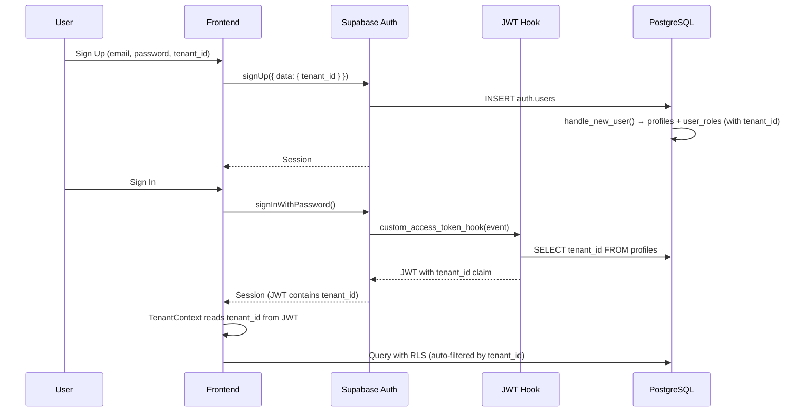
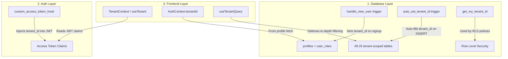

# EduSync LMS — Tenant Architecture

Multi-tenant isolation strategy for EduSync: how `tenant_id` flows from signup through JWT claims to every database query.

---

## Resolution Flow



---

## Architecture Layers



---

## Database Components

### `custom_access_token_hook(event jsonb)`

Supabase Auth Hook that injects `tenant_id` into every JWT access token.

- **Type**: Auth Hook (Custom Access Token)
- **Must be enabled manually**: Supabase Dashboard → Authentication → Hooks

### `handle_new_user()` trigger

Fires `AFTER INSERT ON auth.users`. Creates `profiles` and `user_roles` rows with `tenant_id` read from `raw_user_meta_data`.

### `auto_set_tenant_id()` trigger

Fires `BEFORE INSERT` on all 26 tenant-scoped tables. If `tenant_id IS NULL`, it auto-fills from the authenticated user's profile. This is a safety net so frontend code does not need to explicitly pass `tenant_id` on every insert.

### `get_my_tenant_id()` function

Returns the `tenant_id` for `auth.uid()` from `profiles`. Used in all RLS policies.

---

## Frontend Components

### `TenantContext` / `useTenant()`

**File**: `src/contexts/TenantContext.tsx`

Resolves tenant context on login:
1. Decodes `tenant_id` from JWT access token (no network call)
2. Falls back to querying `profiles.tenant_id` if JWT claim is missing
3. Fetches full tenant record (`name`, `slug`, `is_active`)

```tsx
const { tenantId, tenant, loading } = useTenant();
```

### `AuthContext.tenantId`

**File**: `src/contexts/AuthContext.tsx`

The `tenantId` is also available directly from `useAuth()` (populated from the profile fetch).

```tsx
const { tenantId } = useAuth();
```

### `useTenantQuery()`

**File**: `src/utils/useTenantQuery.ts`

Defense-in-depth query helper. Not required (RLS handles isolation), but provides explicit tenant filtering.

```tsx
const { tenantQuery, tenantInsert } = useTenantQuery();

// SELECT with tenant filter
const { data } = await tenantQuery('classes');

// INSERT with tenant_id auto-included
await tenantInsert('classes', { name: 'English 101', teacher_id: userId });
```

---

## Tenant-Scoped Tables (26)

All have `tenant_id UUID NOT NULL → tenants(id)` with the `auto_set_tenant_id` trigger.

| Domain | Tables |
|---|---|
| Auth | `profiles`, `user_roles` |
| Learning | `courses`, `course_modules`, `lessons`, `lesson_resources`, `lesson_progress`, `course_progress` |
| Classroom | `classes`, `enrollments`, `class_schedules`, `class_announcements` |
| Assessment | `assignments`, `assignment_submissions`, `grades`, `quizzes`, `quiz_questions`, `quiz_options`, `quiz_attempts` |
| Discussion | `discussion_threads`, `discussion_posts` |
| Operations | `attendance_records`, `notifications`, `activity_logs`, `invoices`, `payments` |

## Global Tables (4 — no tenant_id)

| Table | Scoped By |
|---|---|
| `badges` | Global catalog |
| `user_badges` | `user_id` |
| `user_points` | `user_id` |
| `recommendations` | `user_id` |

---

## Onboarding a New Tenant

1. Insert into `tenants` table:
   ```sql
   INSERT INTO tenants (name, slug) VALUES ('School Name', 'school-slug');
   ```

2. Use the returned `id` as `tenant_id` during user signup:
   ```tsx
   await signUp(email, password, firstName, lastName, tenantId);
   ```

3. The `handle_new_user` trigger will propagate `tenant_id` to `profiles` and `user_roles`.

4. All subsequent inserts auto-inherit `tenant_id` via the `auto_set_tenant_id` trigger.

---

## Migration History

| Version | Name | Description |
|---|---|---|
| `20260308_05` | `custom_access_token_hook` | JWT hook to inject `tenant_id` into access tokens |
| `20260308_06` | `update_handle_new_user_with_tenant` | Updated signup trigger to pass `tenant_id` |
| `20260308_07` | `auto_set_tenant_id_trigger` | Safety-net trigger on all 26 tables |
