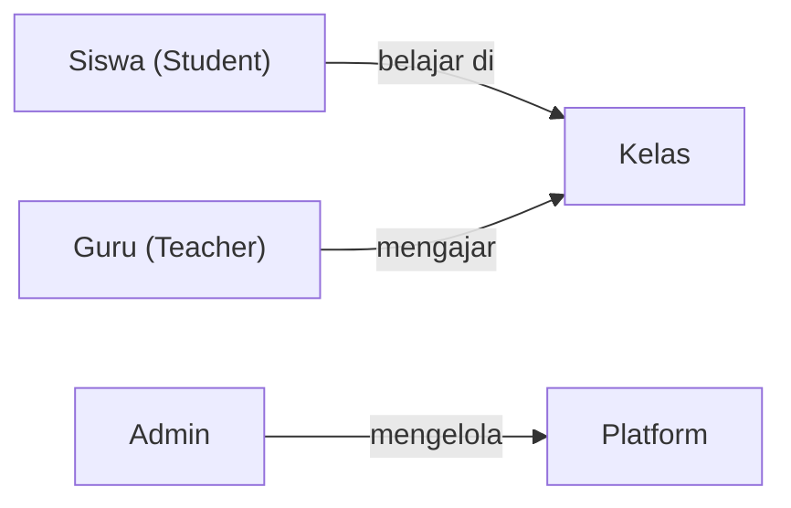
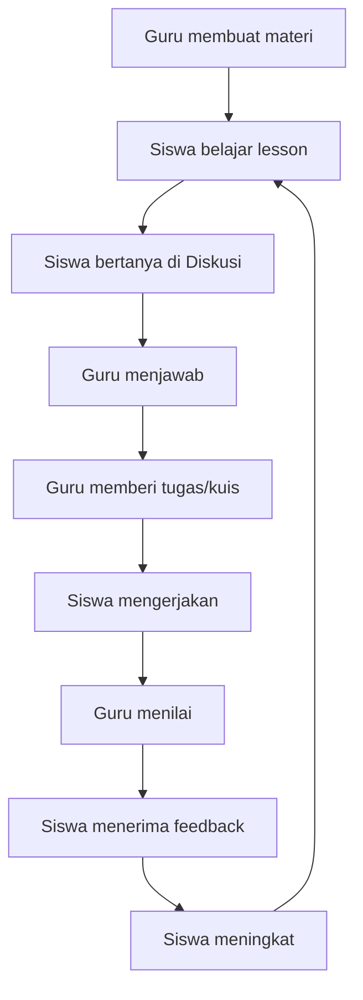

# EduSync LMS — User Flow

## System Actors



---

## Core Learning Loop



---

## 1. Student Flows

### 1.1 Onboarding

```
Login (/#/login)
  → Supabase Auth
  → Role resolved → RoleResolver → /#/app/student
  → Onboarding wizard (if first time)
  → Join Class via code (/#/classes/:classId)
```

### 1.2 Learning Flow

```
Student Dashboard (/#/app/student)
  → Open course (/#/courses/:courseId)
    → CourseEnrollmentGuard checks enrollment
    → LessonViewer loads lesson tree via get_lesson_viewer_payload()
    → Study content: article / video / quiz
    → ProgressReporter fires LESSON_COMPLETED
    → Trigger: recompute_course_progress
  → Module Complete → ModuleCompletionModal
  → SmartNextButton → next lesson
```

### 1.3 Quiz Flow

```
Lesson type = quiz
  → StartQuizModal (see limits: max_attempts, pass score)
  → v1_start_quiz_attempt() RPC
  → QuizPlayer: QuizHeader, QuizBody, QuestionPalette
  → v1_save_partial_answers() on each answer (autosave)
  → v1_submit_quiz_attempt() on submit
  → QuizReviewScreen
  → award_quiz_xp() trigger → XP awarded
  → QuizResultsView: score + XP + badge check
```

### 1.4 Gamification Flow

```
Quiz passed
  → award_quiz_xp() (security: auth.uid() must = p_user_id)
  → xp_transactions INSERT
  → xp_profiles.total_xp updated
  → compute_level() recalculates level
  → handle_quiz_badges() trigger → badge eligibility check
  → on_badge_earned trigger → realtime event → UI popup
  → Leaderboard updated (/#/leaderboard)
```

---

## 2. Teacher Flows

### 2.1 Course Builder

```
Teacher Dashboard (/#/app/teacher)
  → Teaching Hub (/#/teaching)
  → Course Builder (/#/teaching/course-builder)
    → Create course → add modules → add lessons
    → Lesson types: article / video / quiz
    → For quiz lessons: Quiz Manager (/#/teaching/quiz-manager)
  → Publish course → status = 'published'
  → Assign course to class
```

### 2.2 Analytics Flow

```
Analytics (/#/analytics)
  → Select course → get_teacher_analytics(p_course_id) RPC
  → Per-student table: completion %, struggle score, time spent
  → 4 engagement segments (Aktif / Berkembang / Perlu Perhatian / Pasif)
  → Drill-down: Course Analytics (/#/teaching/course-analytics)
```

### 2.3 Grading Flow

```
Gradebook (/#/gradebook)
  → SpeedGrader (/#/grader)
    → Select assignment → view submissions → score + feedback
  → Quiz Gradebook (/#/teaching/quiz-gradebook)
    → Manual grading for Short Answer / Essay questions
    → grade_attempt_question() RPC
```

### 2.4 Class Management

```
Classes (/#/teaching/classes)
  → Create class → share join code with students
  → Students join via code → enrollments table
  → Attendance: ScanAttendance (/#/scan-attendance)
```

---

## 3. Admin Flows

### 3.1 Overview

```
Admin Hub (/#/admin-hub) or Admin Dashboard (/#/app/admin)
  → User Management (/#/admin/users)
  → Finance Dashboard (/#/admin/finance)
  → Moderation (/#/admin/moderation)
  → Audit Dashboard (/#/admin/audit)
  → Platform Analytics (/#/admin/analytics)
  → PPDB / Registration (/#/admin/ppdb)
```

---

## Route Quick Reference

All routes use hash prefix `/#/`:

| Path | Who | Page |
|------|-----|------|
| `/login` | Public | Login |
| `/app/student` | Student | Student Dashboard |
| `/app/teacher` | Teacher | Teacher Dashboard |
| `/app/admin` | Admin | Admin Dashboard |
| `/dashboard` | Student | Dashboard (legacy) |
| `/analytics` | Teacher/Admin | Analytics |
| `/teaching` | Teacher | Teaching Hub |
| `/teaching/course-builder` | Teacher/Admin | Course Builder |
| `/teaching/quiz-manager` | Teacher/Admin | Quiz Manager |
| `/teaching/classes` | Teacher/Admin | Class Management |
| `/teaching/course-analytics` | Teacher/Admin | Per-course analytics |
| `/gradebook` | Teacher/Admin | Gradebook |
| `/leaderboard` | Student/Teacher | Leaderboard |
| `/courses/:courseId` | Student | Lesson Viewer |
| `/settings` | All | Settings |
| `/profile` | All | Profile |
| `/announcements` | All | Announcements |
