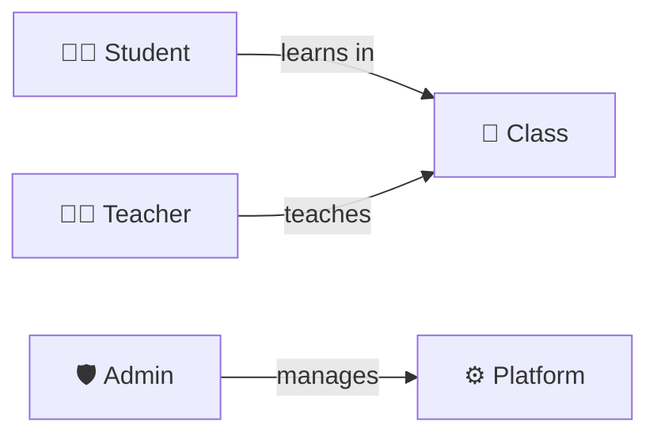
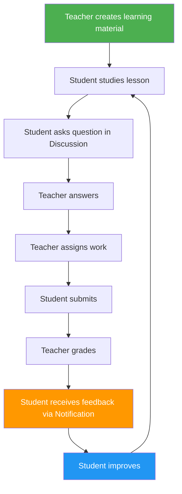
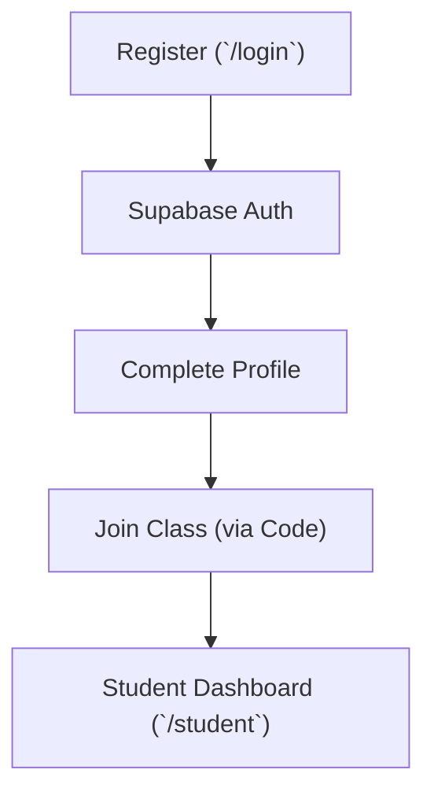
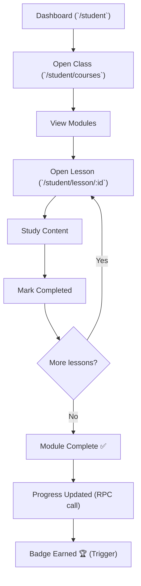
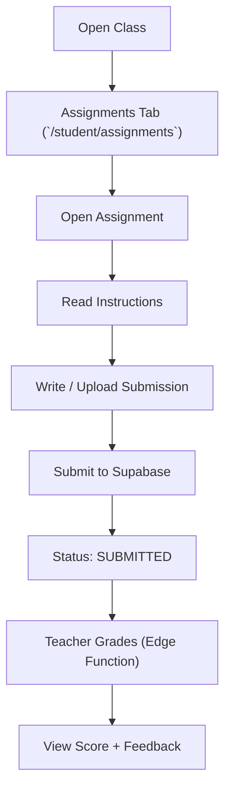
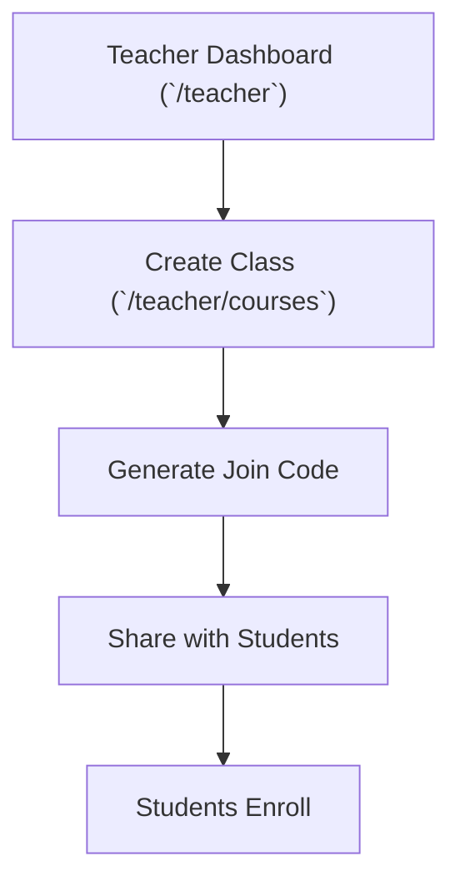
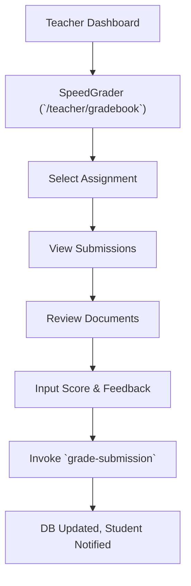
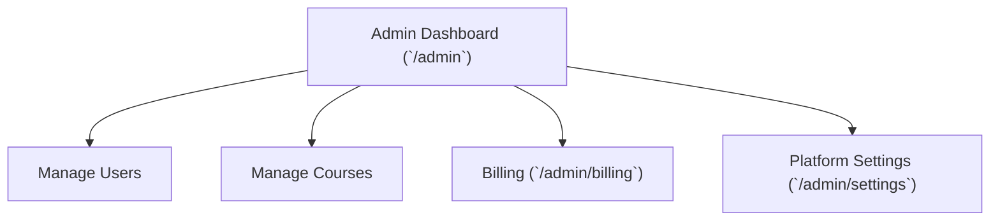

# EduSync LMS — User Flow

## System Actors

---

## Core Learning Loop

This is the heart of EduSync. Everything else supports this cycle.

---

## 1. Student Flows

### 1.1 Onboarding

### 1.2 Learning Flow

### 1.3 Assignment Flow

---

## 2. Teacher Flows

### 2.1 Class Management

### 2.2 Grading Flow (SpeedGrader)

---

## 3. Admin Flows

### 3.1 Overview

