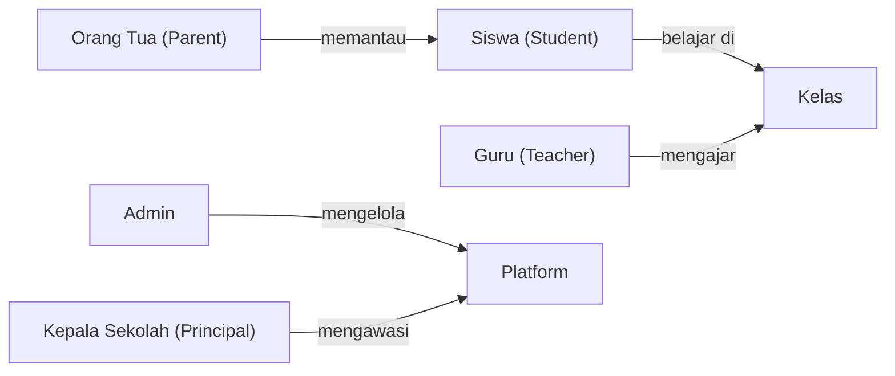
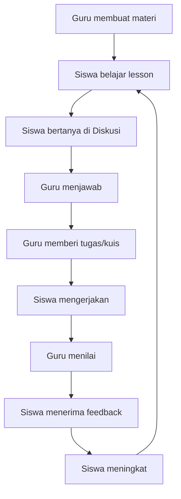

# EduSync LMS — User Flow

## System Actors



---

## Core Learning Loop



---

## 1. Student Flows

### 1.1 Onboarding

```
Login (/#/login)
  → Supabase Auth
  → Role resolved → RoleResolver → /#/app/student
  → Onboarding wizard (if first time)
  → Join Class via code (/#/classes/:classId)
```

### 1.2 Learning Flow

```
Student Dashboard (/#/app/student)
  → Open course (/#/courses/:courseId)
    → CourseEnrollmentGuard checks enrollment
    → LessonViewer loads lesson tree via get_lesson_viewer_payload()
    → Study content: article / video / quiz
    → ProgressReporter fires LESSON_COMPLETED
    → Trigger: recompute_course_progress
  → Module Complete → ModuleCompletionModal
  → SmartNextButton → next lesson
```

### 1.3 Quiz Flow

```
Lesson type = quiz
  → StartQuizModal (see limits: max_attempts, pass score)
  → v1_start_quiz_attempt() RPC
  → QuizPlayer: QuizHeader, QuizBody, QuestionPalette
  → v1_save_partial_answers() on each answer (autosave)
  → v1_submit_quiz_attempt() on submit
  → QuizReviewScreen
  → award_quiz_xp() trigger → XP awarded
  → QuizResultsView: score + XP + badge check
```

### 1.4 Gamification Flow

```
Quiz passed
  → award_quiz_xp() (security: auth.uid() must = p_user_id)
  → xp_transactions INSERT
  → xp_profiles.total_xp updated
  → compute_level() recalculates level
  → handle_quiz_badges() trigger → badge eligibility check
  → on_badge_earned trigger → realtime event → UI popup
  → Leaderboard updated (/#/leaderboard)
```

---

## 2. Teacher Flows

### 2.1 Course Builder

```
Teacher Dashboard (/#/app/teacher)
  → Teaching Hub (/#/teaching)
  → Course Builder (/#/teaching/course-builder)
    → Create course → add modules → add lessons
    → Lesson types: article / video / quiz
    → For quiz lessons: Quiz Manager (/#/teaching/quiz-manager)
  → Publish course → status = 'published'
  → Assign course to class
```

### 2.2 Analytics Flow

```
Analytics (/#/analytics)
  → Select course → get_teacher_analytics(p_course_id) RPC
  → Per-student table: completion %, struggle score, time spent
  → 4 engagement segments (Aktif / Berkembang / Perlu Perhatian / Pasif)
  → Drill-down: Course Analytics (/#/teaching/course-analytics)
```

### 2.3 Grading Flow

```
Gradebook (/#/gradebook)
  → SpeedGrader (/#/grader)
    → Select assignment → view submissions → score + feedback
  → Quiz Gradebook (/#/teaching/quiz-gradebook)
    → Manual grading for Short Answer / Essay questions
    → grade_attempt_question() RPC
```

### 2.4 Class Management

```
Classes (/#/teaching/classes)
  → Create class → share join code with students
  → Students join via code → enrollments table
  → Attendance: ScanAttendance (/#/scan-attendance)
```

---

## 3. Admin Flows

### 3.1 Overview

```
Admin Hub (/#/admin-hub) or Admin Dashboard (/#/app/admin)
  → User Management (/#/admin/users)
  → Finance Dashboard (/#/admin/finance)
  → Moderation (/#/admin/moderation)
  → Audit Dashboard (/#/admin/audit)
  → Platform Analytics (/#/admin/analytics)
  → PPDB / Registration (/#/admin/ppdb)
```

---

## 4. Parent Flows

### 4.1 Registrasi & Login

```
/register-parent
  → OTP via nomor HP (WhatsApp)
  → Verifikasi OTP
  → Setup profil (nama, hubungan ke siswa)
  → Auto-link ke profil siswa via student_parent_links
  → /app/parent (Parent Dashboard)

Login via /login
  → role 'parent' detected
  → redirect /app/parent
```

### 4.2 Dashboard Orang Tua

```
Parent Dashboard (/app/parent)
  → ParentDashboard: traffic light status, nilai terbaru, kehadiran, tugas
  → /app/parent/nilai → detail nilai per mata pelajaran (semua subject)
  → /app/parent/kehadiran → kalender kehadiran (monthly calendar view)
  → /app/parent/pesan → MessageTeacher (daftar percakapan dengan guru)
  → /app/parent/pesan/:threadId → MessageThreadView (in-app chat)
  → /app/parent/laporan → MonthlyReportPage (laporan bulanan PDF)
  → /app/parent/pengaturan → DigestSettings (konfigurasi notifikasi harian)
```

---

## 5. Principal Flows

### 5.1 Login & Dashboard

```
Login via /login
  → role 'principal' detected
  → redirect /app/principal

Executive Dashboard (/app/principal)
  → ExecutiveDashboard: adoption metrics + academic overview + ROI calculator
  → /app/principal/analytics → BeforeAfterAnalytics (perbandingan sebelum/sesudah LMS)
  → /app/principal/report → ReportPreview (laporan print-friendly untuk yayasan/dinas)
  → /app/principal/survey → SurveyPage (kelola survey kepuasan guru/siswa/orang tua)
```

---

## Route Quick Reference

All routes use hash prefix `/#/`:

| Path                          | Who             | Page                       |
| ----------------------------- | --------------- | -------------------------- |
| `/login`                      | Public          | Login                      |
| `/register-parent`            | Public          | Registrasi Orang Tua (OTP) |
| `/join?code=XXXXXX`           | Public/Student  | Deep Link Enrollment       |
| `/app/student`                | Student         | Student Dashboard          |
| `/app/teacher`                | Teacher         | Teacher Dashboard          |
| `/app/admin`                  | Admin           | Admin Dashboard            |
| `/app/parent`                 | Parent          | Parent Dashboard           |
| `/app/parent/nilai`           | Parent          | Detail Nilai               |
| `/app/parent/kehadiran`       | Parent          | Kalender Kehadiran         |
| `/app/parent/pesan`           | Parent          | Pesan ke Guru              |
| `/app/parent/pesan/:threadId` | Parent          | Thread Percakapan          |
| `/app/parent/laporan`         | Parent          | Laporan Bulanan            |
| `/app/parent/pengaturan`      | Parent          | Pengaturan Notifikasi      |
| `/app/principal`              | Principal       | Executive Dashboard        |
| `/app/principal/analytics`    | Principal       | Before-After Analytics     |
| `/app/principal/report`       | Principal       | Report Preview             |
| `/app/principal/survey`       | Principal       | Survey Kepuasan            |
| `/dashboard`                  | Student         | Dashboard (legacy)         |
| `/analytics`                  | Teacher/Admin   | Analytics                  |
| `/teaching`                   | Teacher         | Teaching Hub               |
| `/teaching/course-builder`    | Teacher/Admin   | Course Builder             |
| `/teaching/quiz-manager`      | Teacher/Admin   | Quiz Manager               |
| `/teaching/classes`           | Teacher/Admin   | Class Management           |
| `/teaching/course-analytics`  | Teacher/Admin   | Per-course analytics       |
| `/gradebook`                  | Teacher/Admin   | Gradebook                  |
| `/leaderboard`                | Student/Teacher | Leaderboard                |
| `/courses/:courseId`          | Student         | Lesson Viewer              |
| `/settings`                   | All             | Settings                   |
| `/profile`                    | All             | Profile                    |
| `/announcements`              | All             | Announcements              |

<!-- Phase 5 Feature Cross-Reference -->

## Feature Module Cross-Reference

EduSync LMS terdiri dari 49 feature module yang saling terintegrasi:

| Feature         | Domain         | Deskripsi                                                                                                                  |
| --------------- | -------------- | -------------------------------------------------------------------------------------------------------------------------- |
| administration  | Admin          | Administrasi — Manajemen tenant, konfigurasi modul sekolah, sinkronisasi data                                              |
| ai-tutor        | Learning       | AI Tutor — Asisten belajar berbasis AI yang memberikan penjelasan personal kepada siswa                                    |
| analytics       | Analytics      | Analitik — Dashboard analitik komprehensif untuk guru dan admin                                                            |
| announcements   | Communication  | Pengumuman — Sistem pengumuman sekolah                                                                                     |
| assignments     | Assessment     | Tugas — Manajemen tugas dari pembuatan hingga penilaian                                                                    |
| calendar        | Academic       | Kalender — Kalender akademik terintegrasi dengan jadwal pelajaran, ujian, deadline tugas, dan kegiatan sekolah             |
| classroom       | Academic       | Kelas — Manajemen kelas virtual dan fisik                                                                                  |
| courses         | Academic       | Kursus — Core learning module                                                                                              |
| dashboards      | Analytics      | Dashboard — Dashboard kustom dengan widget builder                                                                         |
| discussions     | Communication  | Diskusi — Forum diskusi per kursus                                                                                         |
| gamification    | Engagement     | Gamifikasi — Sistem gamifikasi lengkap: XP, badge, level, streak counter, dan leaderboard                                  |
| gradebook       | Assessment     | Buku Nilai — Buku nilai digital untuk guru                                                                                 |
| guidance        | Admin          | Panduan — Sistem panduan in-app (tooltip, walkthrough, banner, checkpoint)                                                 |
| lessons         | Learning       | Pelajaran — Konten pelajaran dengan block-based editor                                                                     |
| moderation      | Admin          | Moderasi — Moderasi konten user-generated (diskusi, komentar)                                                              |
| notifications   | Communication  | Notifikasi — Sistem notifikasi real-time dengan bell icon dan panel                                                        |
| onboarding      | Admin          | Onboarding — Wizard onboarding untuk pengguna baru                                                                         |
| **parent**      | **Parent**     | **Parent Portal — Registrasi OTP, dashboard pemantauan anak, pesan guru, laporan bulanan, digest notifikasi**              |
| **principal**   | **Principal**  | **Principal Dashboard — Executive metrics, before-after analytics, report otomatis, survey kepuasan**                      |
| progress        | Learning       | Kemajuan Belajar — Tracking progress belajar siswa secara granular per kursus, modul, dan pelajaran                        |
| question-bank   | Assessment     | Bank Soal — Repositori soal yang bisa digunakan ulang di berbagai kuis                                                     |
| quizzes         | Assessment     | Kuis — Sistem kuis komprehensif dengan timer, anti-cheat, autosave, review mode, dan analitik hasil per soal               |
| recommendations | Learning       | Rekomendasi — Engine rekomendasi konten berdasarkan progress, performa, dan pola belajar siswa                             |
| reports         | Analytics      | Laporan — Generator laporan akademik, keuangan (SPP), PPDB, dan custom                                                     |
| storage         | Infrastructure | Penyimpanan — Manajemen file dan media untuk materi pembelajaran                                                           |
| struggle        | Analytics      | Deteksi Kesulitan — Deteksi otomatis siswa yang kesulitan berdasarkan pola belajar, waktu per soal, dan penurunan performa |

Setiap feature module mengikuti arsitektur standar dengan folder: api/, queries/, hooks/, types/, components/, dan **tests**/. Semua feature mendukung dark mode dan skeleton loading screens.
