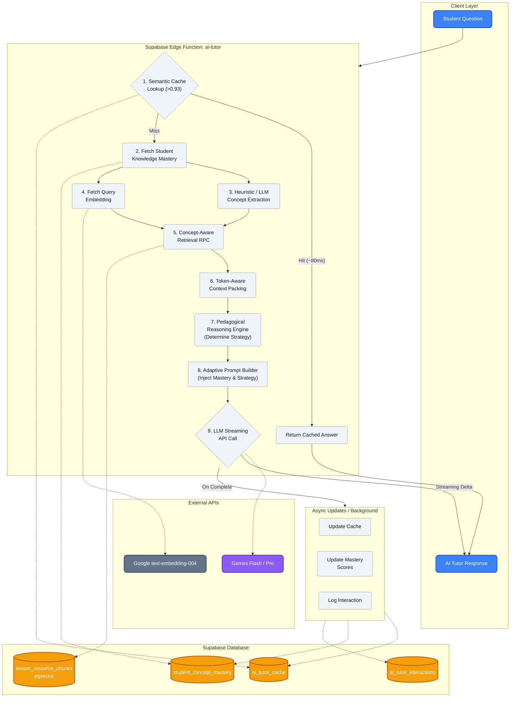

# EduSync AI Tutor — Full Architecture Map

This document provides a visual representation of the complete pipeline for the EduSync AI Tutor, from the moment a student asks a question to the generation of the pedagogical response and the subsequent asynchronous knowledge updates.

## System Pipeline Diagram

## Component Breakdown

1. **Semantic Cache Layer**: The fastest path to an answer. Checks if an identical conceptual question has been asked before.
2. **Student Knowledge Model (SKM)**: Fetches the student's mastery profile to adapt the explanation complexity.
3. **Concept & Embedding Extraction**: Converts the question into mathematical vectors and extracts core concepts (either via simple heuristics or a fast LLM).
4. **Concept-Aware Retrieval**: Queries `pgvector` combining cosine distance with proximity and concept boosts.
5. **Token-Aware Packing**: Safely fits retrieved chunks into a strict context window budget to avoid hallucination and API limits.
6. **Pedagogical Layer**: Rules engine that decides the teaching strategy (e.g., hinted analogy vs direct step-by-step breakdown).
7. **Adaptive LLM Generation**: Combines all previous context into a final system prompt and streams the response back to the client for low TTFB.
8. **Async Observers**: Logs data, updates mastery, and populates the semantic cache in the background without blocking the user.
