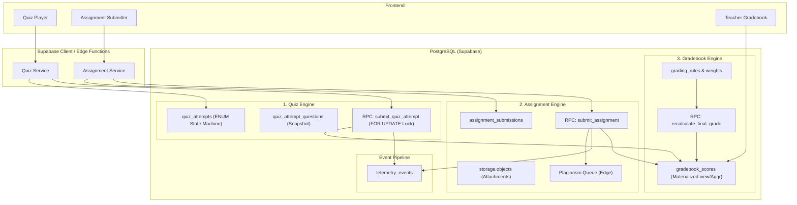

# EduSync Assessment Engine Architecture

The EduSync Assessment Engine is the core system responsible for evaluating student knowledge, assignments, and overall performance. Because of its critical nature and high concurrency (handling potentially thousands of simultaneous submissions per tenant), the engine relies heavily on **database-first logic, atomic transactions, and event-driven telemetry**.

This architecture integrates three major subsystems into a unified evaluation engine:

## 1. System Overview

## 2. The Three Core Pillars

### Pillar 1: Quiz Engine (High Concurrency, Auto-Grading)
- **Characteristics**: Extremely high simultaneous writes (e.g., mid-terms, final exams). Requires microsecond transactional integrity under massive strain.
- **State Machine**: Enum-based state flow (`NOT_STARTED` &rarr; `IN_PROGRESS` &rarr; `SUBMITTED` &rarr; `GRADED` | `EXPIRED` | `ABANDONED`).
- **Data Integrity / Snapshots**: Uses `quiz_attempt_questions` to snapshot question permutations, ensuring grading remains completely accurate even if the base quiz is actively modified by a teacher while a student is taking it.
- **Concurrency Locks**: `submit_quiz_attempt` utilizes `SELECT ... FOR UPDATE` row-level locks to completely prevent double-submissions from rapid UI retry requests.

### Pillar 2: Assignment Engine (Subjective, Artifact-Based)
- **Characteristics**: Large payload submissions (documents, media, URLs). Relies heavily on Supabase Storage, row-level security over objects, and asynchronous processing.
- **Submission Integrity**: Tracks submission times strictly against due dates natively within the DB, applying late penalty formulas as defined in the database rules.
- **Plagiarism / Review Queue**: Routes textual or PDF artifacts to external LLMs/plagiarism APIs via Supabase Edge Functions *after* the initial database submission event is securely recorded.

### Pillar 3: Gradebook Engine (Aggregation & Reporting)
- **Characteristics**: Heavy read-operations. Must aggregate thousands of diverse data points efficiently for instant Teacher and Admin rendering.
- **Rollup Strategy**: Scores from the Quiz Engine and Assignment Engine are seamlessly pushed into or queried by `gradebook_scores` (via materialized views or robust unified aggregation tables).
- **Weighting**: Applies categorical weights (e.g., "Exams are 40%, Homework is 60%") using configurable `grading_rules` to compute students' final, real-time standings.

## 3. Telemetry & Analytics Integration
Every structural transition within the Assessment Engine triggers an immutable telemetry event. 
- Example events: `quiz_started`, `assignment_submitted`, `grade_published`.
These events are ingested by the underlying **Event Pipeline**, powering EduSync's Learning Analytics dashboards and providing rich situational context arrays for the **AI Tutor** to adapt its pedagogy based on immediate assessment performance.
