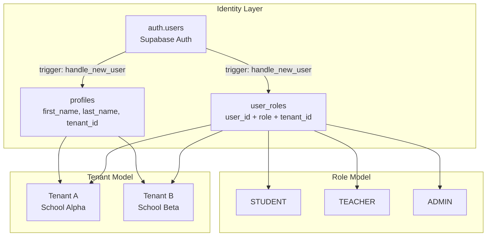
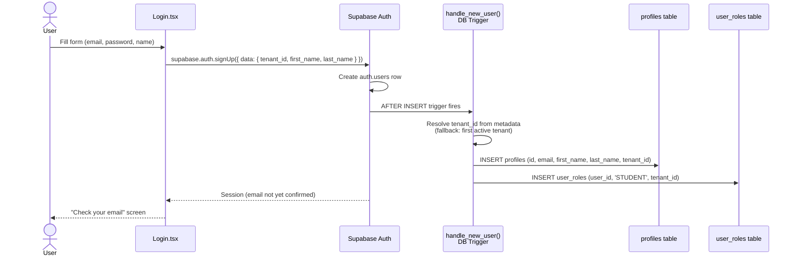
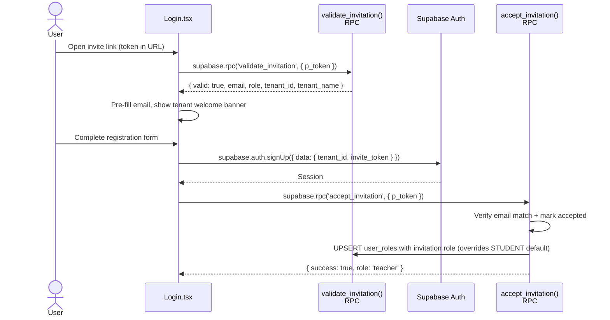
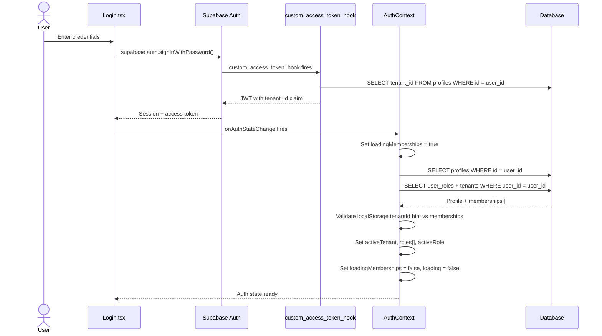
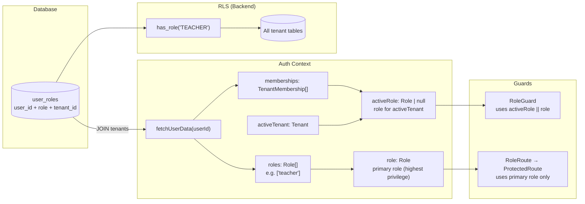

# EduSync LMS — Auth & Roles Architecture (Production Reference)

> **Status**: Living document — updated as part of the P0 security remediation (migrations 96–98).
> **Audience**: Engineers working on EduSync LMS (frontend, backend, devops).

---

## Table of Contents

1. [System Overview](#1-system-overview)
2. [JWT Claims Spec](#2-jwt-claims-spec)
3. [Auth Flow — Signup to Authenticated Page](#3-auth-flow--signup-to-authenticated-page)
4. [Role Resolution Flow](#4-role-resolution-flow)
5. [Frontend Guard Chain](#5-frontend-guard-chain)
6. [RLS Pattern Reference](#6-rls-pattern-reference)
7. [Database Helper Functions](#7-database-helper-functions)
8. [Tech Debt Registry](#8-tech-debt-registry)
9. [Migration Path — Dual System → Clean System](#9-migration-path--dual-system--clean-system)

---

## 1. System Overview

EduSync is a **multi-tenant LMS SaaS**. Each school/institution is a **Tenant**. A user can be a member of multiple tenants with **different roles in each**.



**Key invariants:**
- One user can have **one role per tenant** (unique constraint on `user_roles(user_id, tenant_id)`).
- `profiles.tenant_id` is the user's **primary / default** tenant.
- The JWT contains `tenant_id` only — **never `role`** (see §2).
- Role checks always go to the database via `has_role()` — never to the JWT.

---

## 2. JWT Claims Spec

### What IS in the access token

| Claim | Type | Source | Example |
|-------|------|--------|---------|
| `sub` | `uuid` | Supabase Auth (standard) | `"7f3e...a12b"` |
| `email` | `string` | Supabase Auth (standard) | `"alice@school.edu"` |
| `role` | `string` | Supabase Auth (standard) | `"authenticated"` |
| `tenant_id` | `uuid` | `custom_access_token_hook` | `"a1b2...c3d4"` |
| `aud` | `string` | Supabase Auth (standard) | `"authenticated"` |
| `exp` / `iat` | `int` | Supabase Auth (standard) | Unix timestamps |

> ⚠️ The `role` claim is the **Supabase internal role** (`"authenticated"` or `"anon"`), NOT the application role.

### What is NOT in the token

| What you might expect | Why it's NOT there | Correct alternative |
|-----------------------|-------------------|---------------------|
| App role (`TEACHER`, `ADMIN`) | User can have different roles in different tenants; a single claim cannot express this | `has_role('TEACHER')` DB function |
| `app_role` | Same reason | `has_role()` |
| Full tenant object | Too large; changes infrequently | `TenantContext` fetches on login |

### custom_access_token_hook

Location: `supabase/migrations/801_fix_jwt_tenant_injection.sql`

```sql
-- Injects tenant_id from profiles into every access token
CREATE OR REPLACE FUNCTION public.custom_access_token_hook(event jsonb)
RETURNS jsonb LANGUAGE plpgsql SECURITY DEFINER AS $$
DECLARE
  v_user_id uuid;
  v_tenant_id uuid;
BEGIN
  v_user_id := (event->>'user_id')::uuid;
  SELECT tenant_id INTO v_tenant_id
  FROM public.profiles WHERE id = v_user_id;

  IF v_tenant_id IS NOT NULL THEN
    event := jsonb_set(
      event,
      '{custom_claims,tenant_id}',
      to_jsonb(v_tenant_id)
    );
  END IF;

  RETURN event;
END;
$$;
```

**Must be enabled in Supabase Dashboard:**
`Authentication → Hooks → Custom Access Token Hook → select this function`

---

## 3. Auth Flow — Signup to Authenticated Page

### 3a. Registration (New User)



**Invitation flow (variant):**


### 3b. Login (Existing User)



---

## 4. Role Resolution Flow

How a role ends up controlling what the user can see and do:



### Role Priority (getPrimaryRole)

When a user has multiple roles across tenants, the **primary role** (for legacy routes) is the highest-privilege one:

```
ADMIN > TEACHER > STUDENT
```

### activeRole vs role

| Property | Source | Used by |
|----------|--------|---------|
| `activeRole` | `user_roles` WHERE `tenant_id = activeTenant.id` | `RoleGuard` (new routes) |
| `role` | `getPrimaryRole(roles)` across ALL tenants | `ProtectedRoute` (legacy routes) |

> **Recommended**: Always use `activeRole` via `RoleGuard`. The `role` primary shortcut is a legacy concern.

---

## 5. Frontend Guard Chain

The canonical 3-layer guard chain for all protected routes:

```
AuthGuard
  └── TenantGuard
        └── RoleGuard
              └── <Page Component>
```

### AuthGuard (Layer 1)

**File**: `src/components/guards/AuthGuard.tsx`

| Check | Outcome |
|-------|---------|
| `loading === true` | Show `<AppLoading />` |
| `!session \|\| !user` | `<Navigate to="/login" state={{ from: location }} />` |
| `emailVerified === false` (when `requireEmailVerification` is default `true`) | `<Navigate to="/verify-email" />` |
| All pass | Render children |

```tsx
// Usage
<AuthGuard>                               {/* default: requireEmailVerification=true */}
  <TenantGuard>
    <Layout />
  </TenantGuard>
</AuthGuard>

// For /verify-email itself (prevent infinite loop)
<AuthGuard requireEmailVerification={false}>
  <VerifyEmail />
</AuthGuard>
```

### TenantGuard (Layer 2)

**File**: `src/components/guards/TenantGuard.tsx`

| Check | Outcome |
|-------|---------|
| `loading === true` | Show `<AppLoading />` |
| `!activeTenant` | `<Navigate to="/workspace-selector" state={{ from: location }} />` |
| All pass | Render children |

### RoleGuard (Layer 3)

**File**: `src/components/guards/RoleGuard.tsx`

| Check | Outcome |
|-------|---------|
| `loading === true` | Show `<AppLoading />` |
| `(activeRole \|\| role) ∉ allowedRoles` | `<Navigate to="/unauthorized" />` |
| All pass | Render children |

```tsx
// Usage
<RoleGuard allowedRoles={['admin']}>
  <AdministrationDashboard />
</RoleGuard>
```

### Complete Route Example

```tsx
// ✅ CORRECT — new pattern (use this for all new routes)
<Route
  path="admin"
  element={
    <RoleGuard allowedRoles={['admin']}>
      <Outlet />
    </RoleGuard>
  }
>
  <Route index element={<AdministrationDashboard />} />
  <Route path="users" element={<UserManagement />} />
</Route>

// ⚠️ LEGACY — old pattern (do not use for new routes)
<Route
  path="admin-hub"
  element={
    <RoleRoute role="admin">   {/* wraps ProtectedRoute */}
      <AdminHub />
    </RoleRoute>
  }
/>
```

---

## 6. RLS Pattern Reference

### ✅ Canonical Correct Pattern

```sql
-- SELECT: tenant-scoped, any authenticated member
CREATE POLICY "table_select_tenant"
    ON public.some_table FOR SELECT
    USING ( tenant_id = public.get_my_tenant_id() );

-- INSERT: tenant-scoped, teacher or admin only
CREATE POLICY "table_insert_staff"
    ON public.some_table FOR INSERT
    WITH CHECK (
        tenant_id = public.get_my_tenant_id()
        AND (
            public.has_role('TEACHER'::public.app_role)
            OR public.has_role('ADMIN'::public.app_role)
        )
    );

-- UPDATE: owner or admin
CREATE POLICY "table_update_owner"
    ON public.some_table FOR UPDATE
    USING (
        tenant_id = public.get_my_tenant_id()
        AND (
            created_by = auth.uid()
            OR public.has_role('ADMIN'::public.app_role)
        )
    )
    WITH CHECK (
        tenant_id = public.get_my_tenant_id()
    );

-- DELETE: admin only
CREATE POLICY "table_delete_admin"
    ON public.some_table FOR DELETE
    USING (
        tenant_id = public.get_my_tenant_id()
        AND public.has_role('ADMIN'::public.app_role)
    );
```

### ❌ Broken Pattern (DO NOT USE)

```sql
-- ❌ BROKEN: auth.jwt() ->> 'role' is ALWAYS NULL
--            custom_access_token_hook does not inject app role
CREATE POLICY "broken_policy"
    ON public.some_table FOR INSERT
    WITH CHECK (
        tenant_id::text = auth.jwt() ->> 'tenant_id'   -- ⚠️ also avoid raw jwt
        AND auth.jwt() ->> 'role' in ('TEACHER', 'ADMIN')  -- ❌ always NULL
    );

-- ❌ BROKEN variants found in legacy migrations:
--   auth.jwt() ->> 'role' = 'admin'
--   auth.jwt() ->> 'role' = 'ADMIN'
--   (auth.jwt() ->> 'role') NOT IN ('teacher', 'admin')
--   auth.jwt() ->> 'role' in ('TEACHER', 'ADMIN')
```

### Policy Checklist

Before committing a new RLS policy:

- [ ] Uses `get_my_tenant_id()` for tenant isolation (not raw `auth.jwt() ->> 'tenant_id'`)
- [ ] Uses `has_role('ROLE'::public.app_role)` for role checks (not `auth.jwt() ->> 'role'`)
- [ ] Has `ENABLE ROW LEVEL SECURITY` on the table
- [ ] Both `USING` and `WITH CHECK` specified for UPDATE policies
- [ ] Policy name is snake_case and descriptive: `{table}_{operation}_{who}`
- [ ] SECURITY DEFINER functions have `SET search_path TO 'public'`

---

## 7. Database Helper Functions

### `get_my_tenant_id() → uuid`

```sql
-- Returns the tenant_id for the calling user.
-- Resolution order:
--   1. JWT custom_claims.tenant_id  (fastest, no DB hit)
--   2. profiles.tenant_id           (fallback when JWT claim is absent)
```

**Used in**: Every RLS policy for tenant isolation.

**Security**: `SECURITY DEFINER` + `SET search_path TO 'public'` — bypasses RLS on profiles to read tenant_id.

### `has_role(required_role app_role) → boolean`

```sql
-- Returns true if auth.uid() has the required role in their current tenant.
SELECT EXISTS (
    SELECT 1 FROM public.user_roles
    WHERE user_id  = auth.uid()
      AND role     = required_role
      AND tenant_id = public.get_my_tenant_id()
);
```

**Used in**: All role-gated RLS policies and SECURITY DEFINER RPCs.

**Note**: `has_role()` is tenant-aware — it checks the role specifically for `get_my_tenant_id()`, not globally.

### `get_my_roles() → app_role[]`

```sql
-- Returns ALL roles for auth.uid() across ALL tenants.
-- ⚠️ NOT tenant-scoped — used for getPrimaryRole() logic only.
-- For security checks, always use has_role() instead.
```

### `validate_invitation(p_token text) → json`

```sql
-- Callable by 'anon' role (unauthenticated users during registration).
-- Returns { valid, email, role (lowercase), tenant_id, tenant_name }
-- or      { valid: false, error: '...' }
```

### `accept_invitation(p_token text) → json`

```sql
-- Callable by 'authenticated' role only.
-- Marks invitation as accepted + upserts user_roles with invited role.
-- Security: verifies profile.email == invitation.email to prevent token theft.
```

### `get_my_profile() → json`

```sql
-- Single-RPC bootstrap for AuthContext.
-- Returns { profile, memberships[] } in one round-trip.
-- Replaces two separate queries: profiles + user_roles+tenants JOIN.
```

---

## 8. Tech Debt Registry

### 🔴 P0 — Fixed in migrations 96–98

| # | Issue | Migration |
|---|-------|-----------|
| P0-1 | `auth.jwt() ->> 'role'` in RLS policies always NULL | `96_rls_jwt_role_fix.sql` |
| P0-2 | `validate_invitation` RPC missing (runtime error) | `97_missing_rpcs_and_fixes.sql` |
| P0-3 | Email verification not enforced in `AuthGuard` | `AuthGuard.tsx` update |
| P0-4 | `admin_list_tenants` exposes all tenants to any admin | `98_admin_security_hardening.sql` |
| P0-5 | `handle_new_user` hardcoded UUID fallback | `98_admin_security_hardening.sql` |

### 🟡 P1 — Planned

| # | Issue | Target |
|---|-------|--------|
| P1-1 | Analytics RPCs (migrations 14, 26, 29, 30, 121) still use `auth.jwt() ->> 'role'` | Migration 99 |
| P1-2 | Dual guard systems: `ProtectedRoute`/`RoleRoute` vs `AuthGuard`/`RoleGuard` | Refactor sprint |
| P1-3 | `TenantContext` duplicates `AuthContext` tenant resolution | Refactor sprint |
| P1-4 | `Login.tsx` bypasses `AuthContext.signUp()` for registration | Refactor sprint |

### 🟢 P2 — Backlog

| # | Issue | Notes |
|---|-------|-------|
| P2-1 | Developer warning banner visible in production Login.tsx | Guard with `import.meta.env.DEV` |
| P2-2 | `ProtectedRoute` shows inline "LOADING AUTH..." text (not `AppLoading`) | Minor UX |
| P2-3 | `fetchLock` in `AuthContext` prevents re-fetch after token refresh | Investigate if causing stale data |
| P2-4 | `get_my_roles()` returns roles from ALL tenants (not scoped) | Document + guard usage |
| P2-5 | No `PLATFORM_ADMIN` role for cross-tenant super-admin use case | Schema evolution |

### P1-1 Detail: Analytics RPC jwt-role locations

Files still using `auth.jwt() ->> 'role'` for RPC authorization (do NOT break functionality — role check passes vacuously, tenant isolation still holds):

```
migrations/14_analytics_cron_job.sql      → refresh_all_course_stats (fixed in 96)
migrations/26_analytics_retry_logic.sql   → refresh_course_stats (fixed in 96)
migrations/28_analytics_audit_trail.sql   → log_analytics_access
migrations/29_analytics_pagination.sql    → get_teacher_analytics cursor version
migrations/30_analytics_rate_limiting.sql → check_analytics_rate_limit
migrations/31_analytics_monitoring.sql    → record_analytics_metric
migrations/121_fix_analytics_security.sql → get_teacher_analytics v2
migrations/801_teacher_dashboard_results  → teacher dashboard bundle RPC
```

---

## 9. Migration Path — Dual System → Clean System

### Current State (as of migrations 95)

```
Route protection approach A (new, correct):
  AuthGuard → TenantGuard → RoleGuard
  Used by: /app/student, /app/teacher, /app/admin routes

Route protection approach B (legacy, inconsistent):
  ProtectedRoute ← RoleRoute
  Used by: all legacy flat routes (/dashboard, /creator, etc.)
  Problems:
    - Only checks primary role (not per-tenant activeRole)
    - Does check emailVerified ✓ (fixed in AuthGuard as of this migration)
    - Shows raw "LOADING AUTH..." text
```

### Target State

```
Route protection approach A ONLY:
  AuthGuard → TenantGuard → RoleGuard
  Used by: ALL routes

Files to delete after migration:
  src/components/ProtectedRoute.tsx
  src/components/RoleRoute.tsx
```

### Migration Steps

**Step 1** (done): Add `requireEmailVerification` to `AuthGuard`

**Step 2**: Move all legacy flat routes under `/app/*` tree

For each legacy route like:
```tsx
<Route path="creator" element={<RoleRoute role={['teacher', 'admin']}><Creator /></RoleRoute>} />
```
Replace with:
```tsx
// Already covered by RoleGuard wrapper on /app/teacher and /app/admin
// OR add as a shared route:
<Route path="creator" element={
  <RoleGuard allowedRoles={['teacher', 'admin']}>
    <Creator />
  </RoleGuard>
} />
```

**Step 3**: Delete `ProtectedRoute.tsx` and `RoleRoute.tsx`

**Step 4**: Fix `TenantContext` duplication
```
BEFORE: AuthContext.tenantId + TenantContext.tenantId (both fetch same data)
AFTER:  AuthContext is single source of truth
        TenantContext becomes a thin re-export:
          export function useTenant() { return useAuth(); }
```

**Step 5**: Replace two-query bootstrap with `get_my_profile()` RPC
```tsx
// BEFORE: AuthContext.fetchUserData()
// - query 1: SELECT FROM profiles
// - query 2: SELECT FROM user_roles JOIN tenants

// AFTER: single RPC call
const { data } = await supabase.rpc('get_my_profile');
const { profile, memberships } = data;
```

---

## Appendix: Role × Permission Matrix

| Permission | STUDENT | TEACHER | ADMIN |
|-----------|---------|---------|-------|
| View published courses | ✅ | ✅ | ✅ |
| Create / edit courses | ❌ | ✅ | ✅ |
| Delete courses | ❌ | ✅ (own) | ✅ |
| Take quizzes | ✅ | ❌ | ❌ |
| Create quizzes | ❌ | ✅ | ✅ |
| Grade submissions | ❌ | ✅ | ✅ |
| View class analytics | ❌ | ✅ | ✅ |
| Manage users | ❌ | ❌ | ✅ |
| Create invitations | ❌ | ❌ | ✅ |
| View audit logs | ❌ | ❌ | ✅ |
| Manage tenant settings | ❌ | ❌ | ✅ |
| View all tenants | ❌ | ❌ | ❌ (own only) |

---

*Last updated: migrations 96–98 (P0 security remediation)*