# EduSync LMS Feature Map

> **Status:** v1.0  
> **Dibuat:** 2026-03-11  
> **Tujuan:** Pemetaan visual seluruh fitur sistem EduSync untuk menghindari arsitektur kacau saat project semakin besar.

---

## 1. Feature Overview

Dokumen ini menunjukkan overview keseluruhan sistem EduSync LMS yang mencakup 6 domain utama:

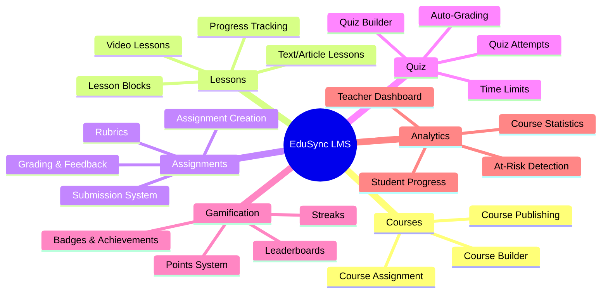

---

## 2. Feature Hierarchy & Relationships

### 2.1 Core Learning Structure

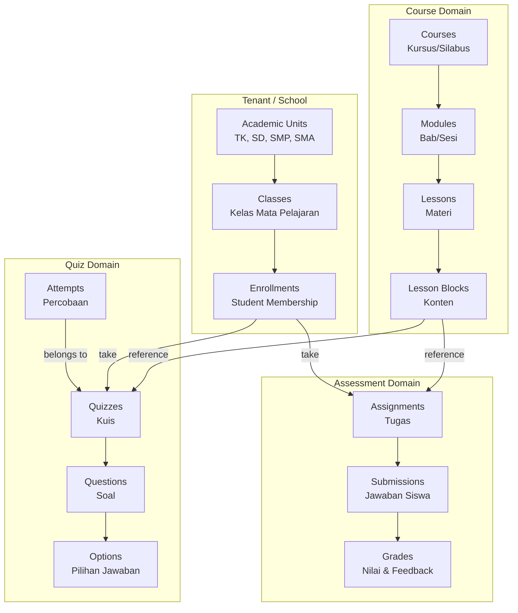

---

## 3. Domain Detail: Courses

### 3.1 Feature List

| Feature | Deskripsi | Status |
|---------|-----------|--------|
| Course CRUD | Create, Read, Update, Delete kursus | ✅ |
| Course Builder | Interface drag-drop untuk membangun materi | ✅ |
| Course Publishing | Workflow Draft → Published → Archived | ✅ |
| Course Assignment | Assign kursus ke multiple classes | ✅ |
| Course Modules | Hierarki bab/sesi dalam kursus | ✅ |
| Course Progress | Tracking persentase penyelesaian | ✅ |

### 3.2 Course Hierarchy

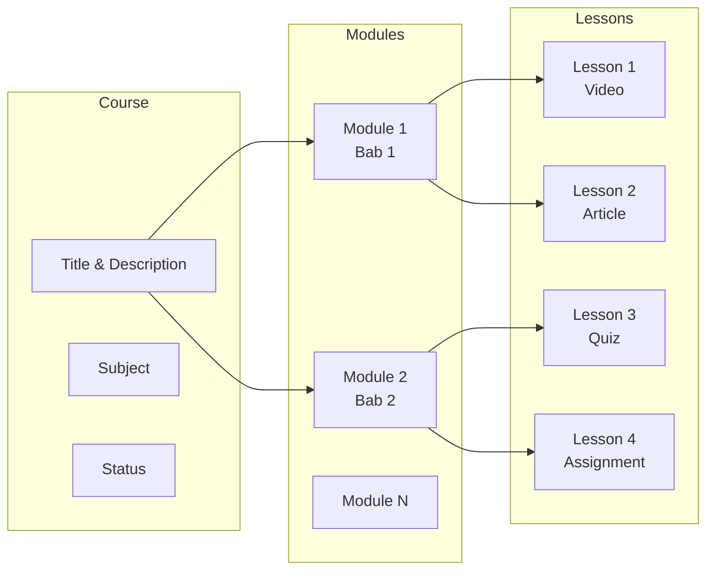

---

## 4. Domain Detail: Lessons

### 4.1 Feature List

| Feature | Deskripsi | Status |
|---------|-----------|--------|
| Video Lessons | Pemutaran video dengan tracking progress | ✅ |
| Text/Article Lessons | Konten artikel dengan formatting | ✅ |
| Lesson Blocks | Sistem block-based content | ✅ |
| Lesson Comments | Catatan siswa & feedback guru | ✅ |
| Lesson Resources | File attachments | ✅ |
| AI Tutor | AI assistant untuk materi | ✅ |

### 4.2 Lesson Block Types

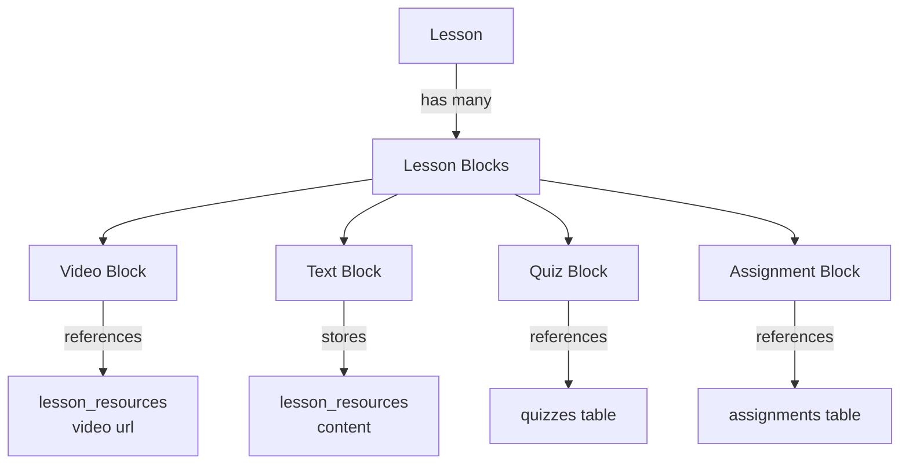

---

## 5. Domain Detail: Assignments

### 5.1 Feature List

| Feature | Deskripsi | Status |
|---------|-----------|--------|
| Assignment Creation | Buat tugas dengan instruksi | ✅ |
| Due Dates | Tanggal jatuh tempo | ✅ |
| File Attachments | Upload file soal & jawaban | ✅ |
| Submission System | Sistem pengumpulan tugas | ✅ |
| Rubrics | Panduan penilaian terstandar | ✅ |
| Grading | Input nilai & feedback | ✅ |
| Late Submission | Penanganan keterlambatan | ✅ |

### 5.2 Assignment Flow

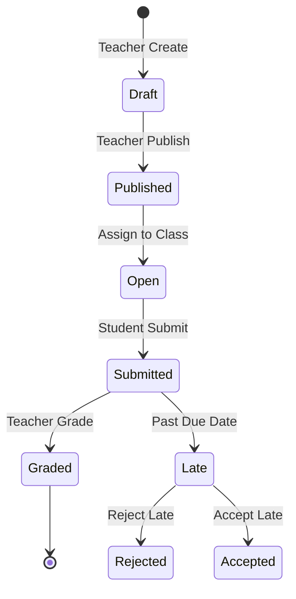

---

## 6. Domain Detail: Quiz

### 6.1 Feature List

| Feature | Deskripsi | Status |
|---------|-----------|--------|
| Quiz Builder | Interface buat soal kuis | ✅ |
| Question Types | Multiple Choice, Essay | ✅ |
| Time Limits | Batasan waktu kuis | ✅ |
| Max Attempts | Batasan percobaan | ✅ |
| Auto-Grading | Penskoran otomatis | ✅ |
| Quiz Attempts | Tracking percobaan siswa | ✅ |
| Quiz Analytics | Statistik hasil kuis | ✅ |

### 6.2 Quiz Attempt Flow

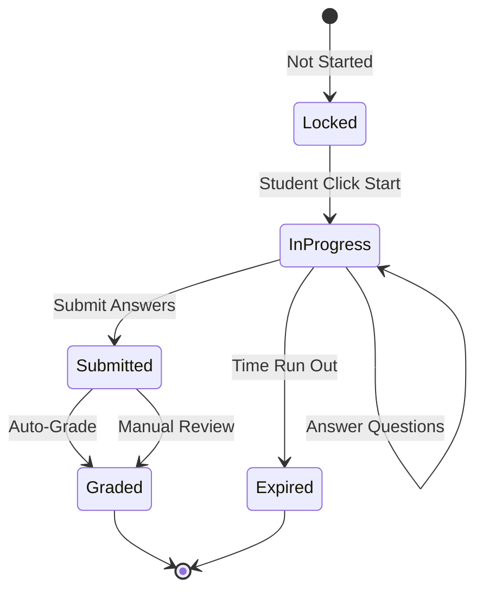

### 6.3 Quiz Security

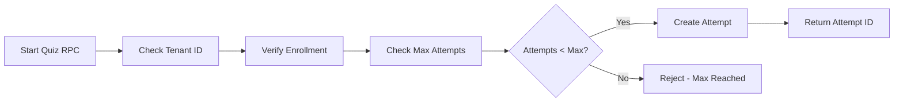

---

## 7. Domain Detail: Gamification

### 7.1 Feature List

| Feature | Deskripsi | Status |
|---------|-----------|--------|
| Points System | Earn & deduct points | ✅ |
| Level Progression | Level up berdasarkan XP | ✅ |
| Badges | Achievement badges | ✅ |
| Leaderboards | Ranking per kelas | ✅ |
| Streaks | Daily learning streaks | ✅ |
| Badge Rules | Auto-award berdasarkan trigger | ✅ |

### 7.2 Gamification Entities

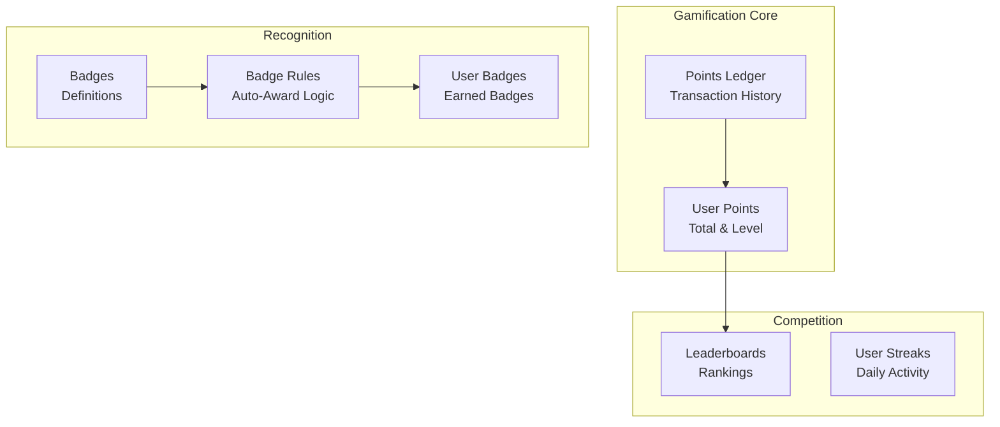

### 7.3 Points Earning Events

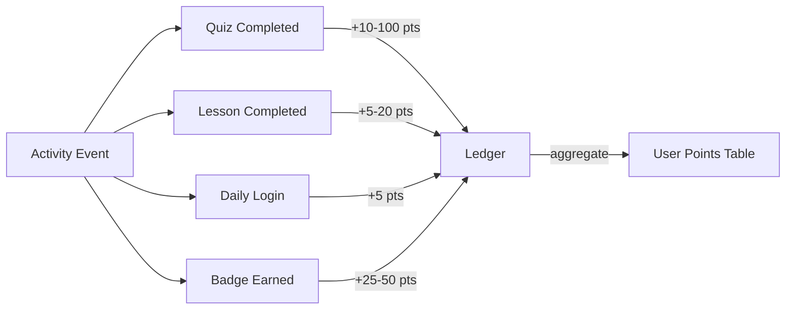

---

## 8. Domain Detail: Analytics

### 8.1 Feature List

| Feature | Deskripsi | Status |
|---------|-----------|--------|
| Teacher Dashboard | Overview kelas & kursus | ✅ |
| Course Stats | Metrik pre-aggregated | ✅ |
| Student Progress | Progress individual siswa | ✅ |
| Quiz Analytics | Statistik hasil kuis | ✅ |
| At-Risk Detection | Identifikasi siswa bermasalah | ✅ |
| Progress Reports | Laporan kemajuan | ✅ |

### 8.2 Analytics Data Pipeline

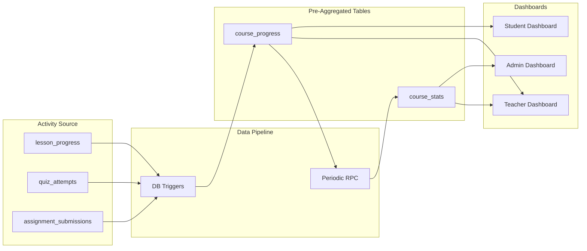

### 8.3 Teacher Analytics Metrics

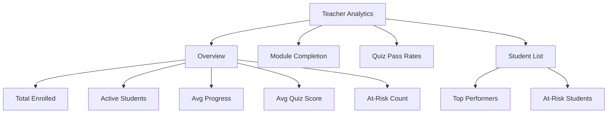

---

## 9. Cross-Domain Relationships

### 9.1 Data Flow Diagram

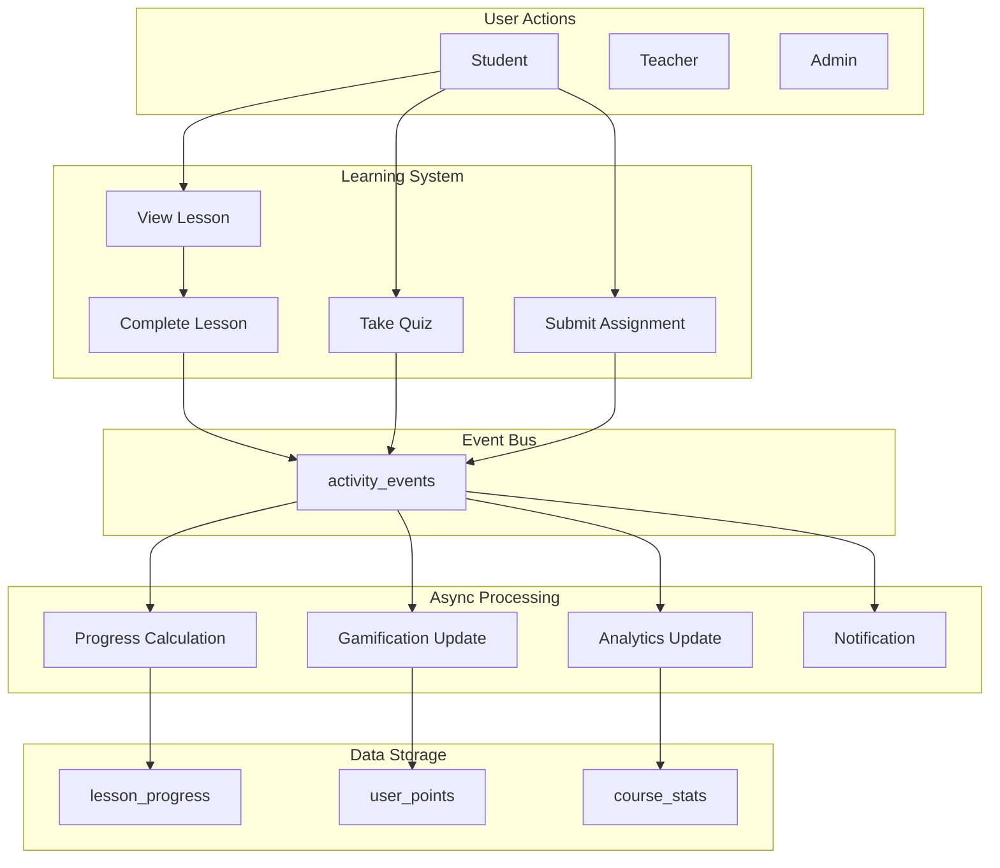

---

## 10. Feature Dependencies

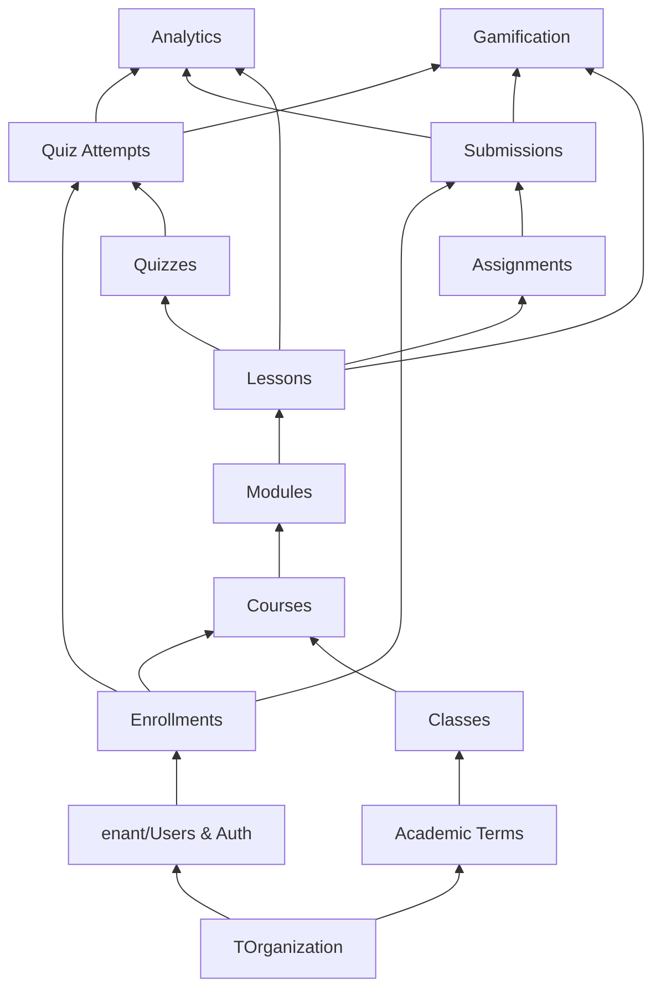

---

## 11. Quick Reference

### 11.1 Feature to Table Mapping

| Feature Area | Primary Tables |
|--------------|----------------|
| Courses | `courses`, `course_modules`, `course_classes` |
| Lessons | `lessons`, `lesson_resources`, `lesson_progress`, `lesson_comments` |
| Assignments | `assignments`, `assignment_submissions`, `assignment_attachments`, `grades`, `rubrics` |
| Quiz | `quizzes`, `quiz_questions`, `quiz_options`, `quiz_attempts`, `quiz_answers` |
| Gamification | `user_points`, `points_ledger`, `badges`, `badge_rules`, `user_badges`, `leaderboards`, `user_streaks` |
| Analytics | `course_stats`, `activity_events`, `user_progress` |

### 11.2 Key Services

| Domain | Service File |
|--------|--------------|
| Courses | `courseService.ts`, `courseBuilderService.ts` |
| Lessons | `lessonService.ts`, `progressService.ts` |
| Assignments | `assignmentService.ts` |
| Quiz | `quizService.ts`, `quizAnalyticsService.ts` |
| Gamification | `gamificationService.ts`, `leaderboardService.ts` |
| Analytics | `analyticsService.ts`, `studentProgressService.ts` |

---

## 12. Related Documents

| Document | Purpose |
|----------|---------|
| [DOMAIN_MAP.md](./DOMAIN_MAP.md) | Entity & database mapping |
| [COURSE_ENGINE_BLUEPRINT.md](./COURSE_ENGINE_BLUEPRINT.md) | Learning engine detailed architecture |
| [DATABASE_SCHEMA.md](./DATABASE_SCHEMA.md) | SQL schema definitions |
| [QUIZ_SYSTEM_ARCHITECTURE.md](./QUIZ_SYSTEM_ARCHITECTURE.md) | Quiz system detailed design |
| [RLS_POLICIES.md](./RLS_POLICIES.md) | Security policies |

---

_Dokumen ini adalah living document. Update saat arsitektur fitur berubah._
