# EduSync LMS Feature Map

> **Status:** v1.0  
> **Dibuat:** 2026-03-11  
> **Tujuan:** Pemetaan visual seluruh fitur sistem EduSync untuk menghindari arsitektur kacau saat project semakin besar.

---

## 1. Feature Overview

Dokumen ini menunjukkan overview keseluruhan sistem EduSync LMS yang mencakup 6 domain utama:

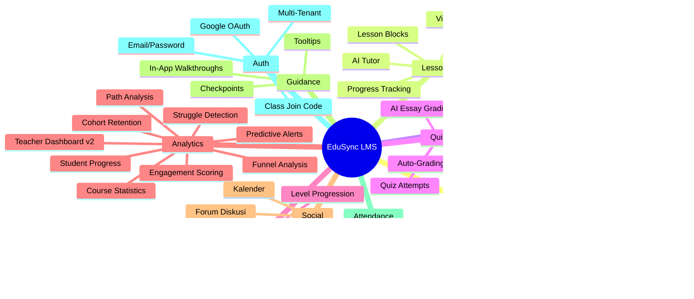

---

## 2. Feature Hierarchy & Relationships

### 2.1 Core Learning Structure

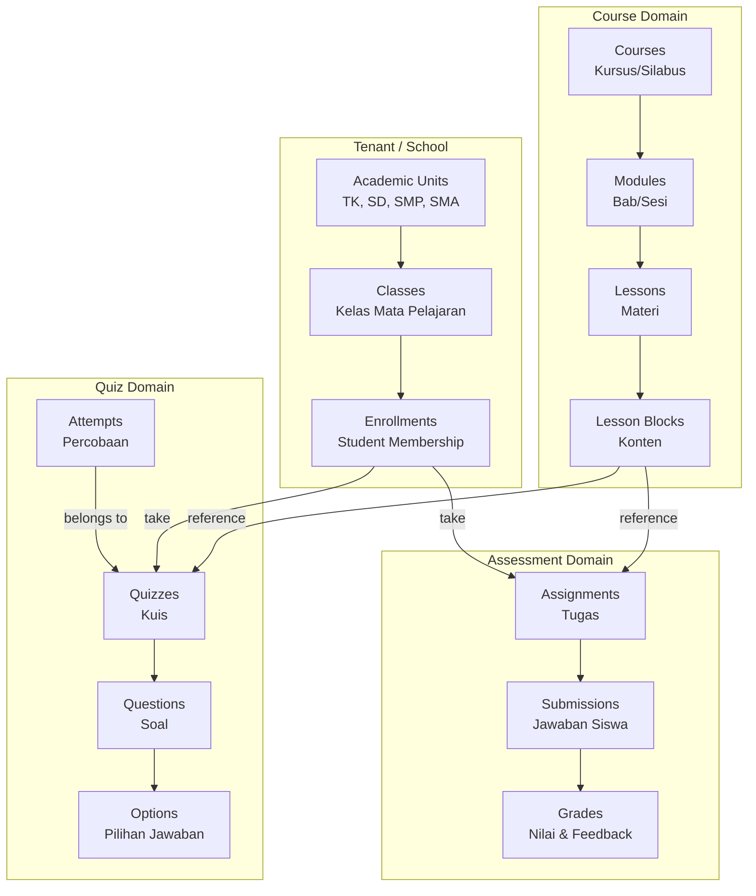

---

## 3. Domain Detail: Courses

### 3.1 Feature List

| Feature | Deskripsi | Status |
|---------|-----------|--------|
| Course CRUD | Create, Read, Update, Delete kursus | ✅ |
| Course Builder | Interface drag-drop untuk membangun materi | ✅ |
| Course Publishing | Workflow Draft → Published → Archived | ✅ |
| Course Assignment | Assign kursus ke multiple classes | ✅ |
| Course Modules | Hierarki bab/sesi dalam kursus | ✅ |
| Course Progress | Tracking persentase penyelesaian | ✅ |

### 3.2 Course Hierarchy

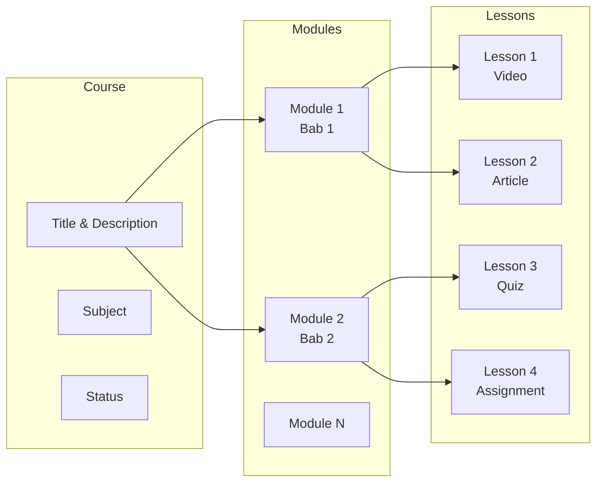

---

## 4. Domain Detail: Lessons

### 4.1 Feature List

| Feature | Deskripsi | Status |
|---------|-----------|--------|
| Video Lessons | Pemutaran video dengan tracking progress | ✅ |
| Text/Article Lessons | Konten artikel dengan formatting | ✅ |
| Lesson Blocks | Sistem block-based content | ✅ |
| Lesson Comments | Catatan siswa & feedback guru | ✅ |
| Lesson Resources | File attachments | ✅ |
| AI Tutor | AI assistant untuk materi | ✅ |

### 4.2 Lesson Block Types

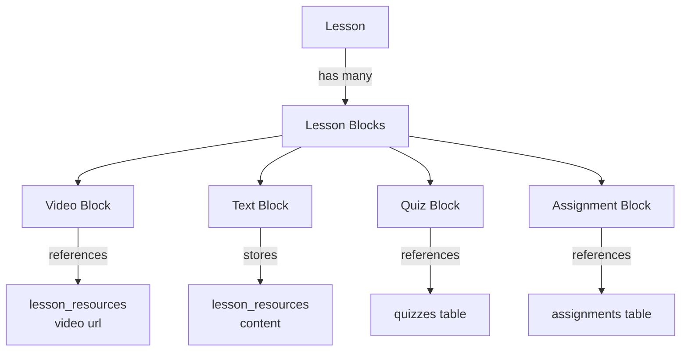

---

## 5. Domain Detail: Assignments

### 5.1 Feature List

| Feature | Deskripsi | Status |
|---------|-----------|--------|
| Assignment Creation | Buat tugas dengan instruksi | ✅ |
| Due Dates | Tanggal jatuh tempo | ✅ |
| File Attachments | Upload file soal & jawaban | ✅ |
| Submission System | Sistem pengumpulan tugas | ✅ |
| Rubrics | Panduan penilaian terstandar | ✅ |
| Grading | Input nilai & feedback | ✅ |
| Late Submission | Penanganan keterlambatan | ✅ |

### 5.2 Assignment Flow

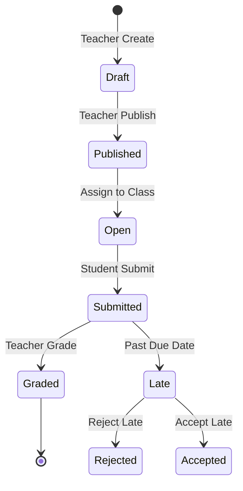

---

## 6. Domain Detail: Quiz

### 6.1 Feature List

| Feature | Deskripsi | Status |
|---------|-----------|--------|
| Quiz Builder | Interface buat soal kuis | ✅ |
| Question Types | MCQ, True/False, Multiple Select, Short Answer, Essay | ✅ |
| Question Bank | Repository soal yang bisa dipakai ulang | ✅ |
| Question Randomization | Soal & pilihan diacak per attempt | ✅ |
| Time Limits | Batasan waktu kuis | ✅ |
| Max Attempts | Batasan percobaan | ✅ |
| Auto-Grading | Penskoran otomatis (MCQ/True-False/Multiple-Select) | ✅ |
| AI Essay Grading | Penilaian esai via Groq (ai-grade-essay edge function) | ✅ |
| Anti-Cheat | Tab-switch detection, heartbeat, optimistic locking | ✅ |
| Autosave | Interval-based answer autosave (30s) | ✅ |
| Quiz Attempts | Tracking percobaan siswa + resume support | ✅ |
| Quiz Analytics | Statistik hasil kuis, difficulty chart | ✅ |
| Quiz Review | Answer review screen post-submission | ✅ |

### 6.2 Quiz Attempt Flow

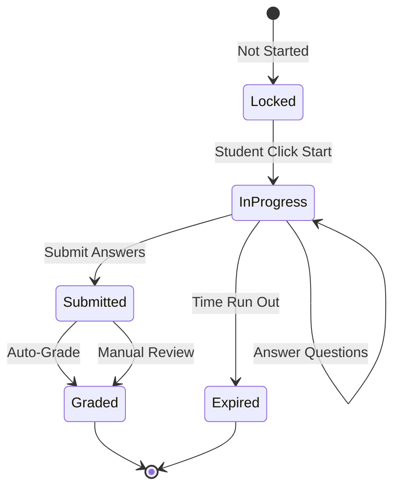

### 6.3 Quiz Security

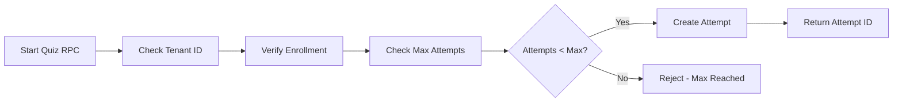

---

## 7. Domain Detail: Gamification

### 7.1 Feature List

| Feature | Deskripsi | Status |
|---------|-----------|--------|
| XP Transactions | Append-only XP ledger (lesson +10, quiz +5/+25, badge, streak) | ✅ |
| Level Progression | 10 levels (L1=0 XP → L10=5500 XP) via `compute_level()` | ✅ |
| Badges v2 | `badge_definitions` + `student_badges`, 4 rarity tiers, 6 types | ✅ |
| Auto-Award (pg_cron) | `check_badge_eligibility()` + `process_xp_awards()` every 5 min | ✅ |
| Certificates | `issue_certificate()` RPC, unique cert number, teacher-issued | ✅ |
| Leaderboard v2 | XP or streak sort, weekly/monthly/all-time periods | ✅ |
| Streaks | Daily streak tracking, streak bonus XP (5×streak_day) | ✅ |

### 7.2 Gamification Entities

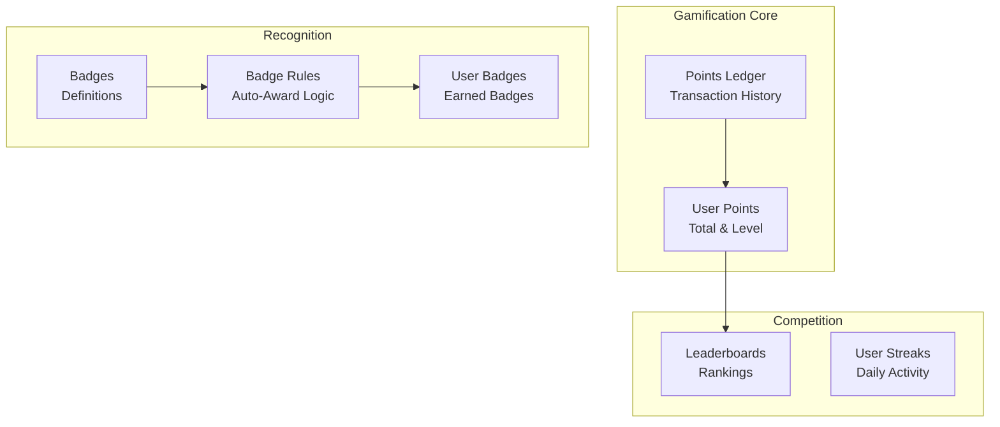

### 7.3 Points Earning Events

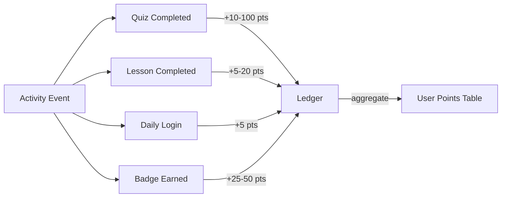

---

## 8. Domain Detail: Analytics

### 8.1 Feature List

| Feature | Deskripsi | Status |
|---------|-----------|--------|
| Teacher Dashboard v2 | Multi-panel analytics (engagement, lesson, course, student) | ✅ |
| Course Stats | Metrik pre-aggregated (810–812 aggregation engine) | ✅ |
| Student Progress | Progress individual siswa | ✅ |
| Engagement Scoring | 0-100 score: activity×40 + completion×30 + quiz×20 + streak×10 | ✅ |
| Cohort Retention | Weekly retention heatmap per enrollment cohort | ✅ |
| Funnel Analysis | Custom funnel builder (enrollment → lesson → quiz → completion) | ✅ |
| Path Analysis | Sankey-style learning path flow diagram | ✅ |
| Predictive Alerts | ML risk scoring → early warning panel for teachers | ✅ |
| Struggle Detection | Real-time alerts: slow progress, low score, repeated re-watch | ✅ |
| Course Analytics per Course | `/course-analytics/:id` page with lesson breakdown table | ✅ |

### 8.2 Analytics Data Pipeline

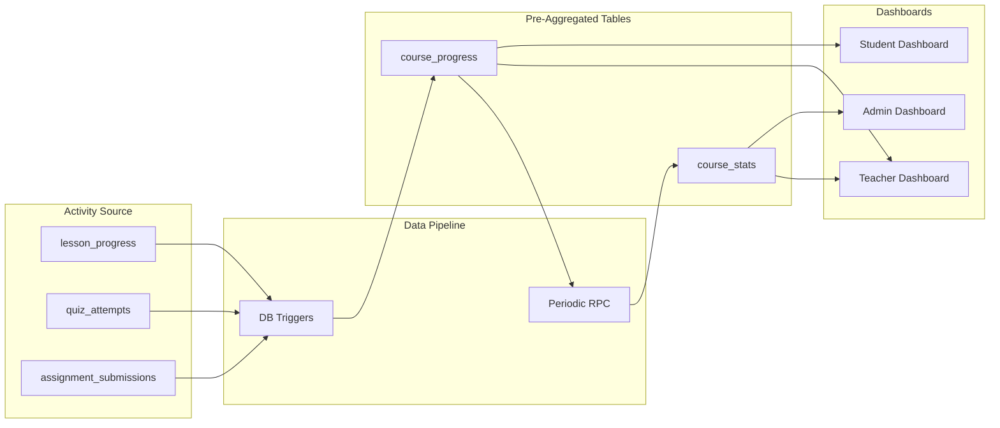

### 8.3 Teacher Analytics Metrics

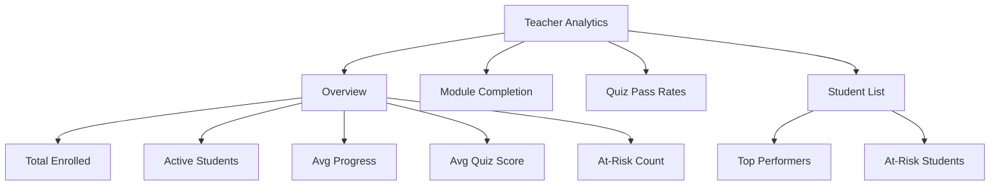

---

## 9. Cross-Domain Relationships

### 9.1 Data Flow Diagram

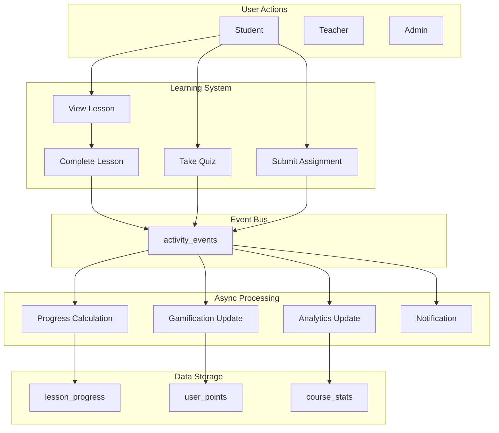

---

## 10. Feature Dependencies

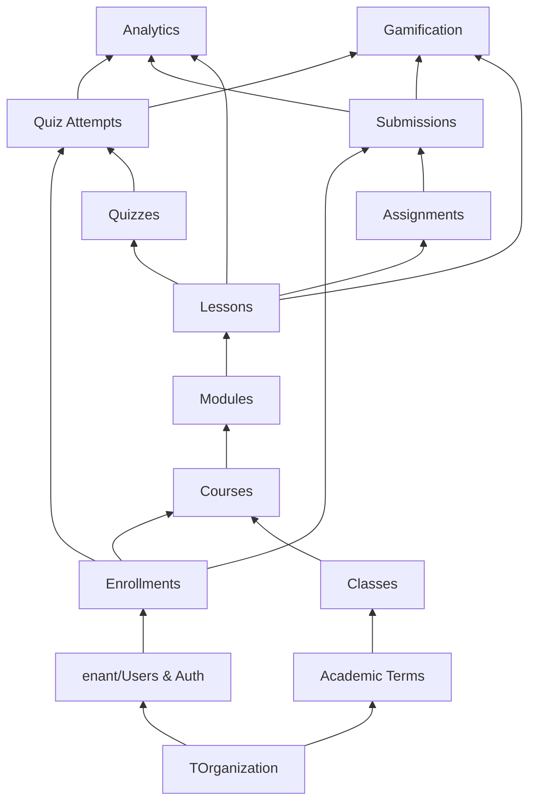

---

## 11. Quick Reference

### 13.1 Feature to Table Mapping

| Feature Area | Primary Tables |
|--------------|----------------|
| Courses | `courses`, `course_modules`, `course_classes` |
| Lessons | `lessons`, `lesson_resources`, `lesson_progress` |
| Assignments | `assignments`, `assignment_submissions`, `assignment_attachments`, `grades`, `rubrics` |
| Quiz | `quizzes`, `quiz_questions`, `quiz_options`, `quiz_attempts_v2`, `quiz_attempt_questions` |
| Gamification v2 | `badge_definitions`, `student_badges`, `certificates`, `xp_transactions`, `student_xp_summary` |
| Analytics Engine | `student_lesson_signals`, `lesson_analytics_summary`, `course_analytics_summary`, `aggregation_state` |
| Advanced Analytics | `predictive_alerts`, `struggle_alerts`, `funnel_definitions`, `student_cohorts` |
| In-App Guidance | `guidance_tours`, `user_guidance_state` |
| Attendance | `attendance_records` |
| Discussions | `discussions` (forum + lesson comments unified) |

### 13.2 Key Services / Modules

| Domain | Service File |
|--------|--------------|
| Courses | `src/features/courses/api/courseService.ts` |
| Lessons | `src/services/lessonService.ts` |
| Assignments | `src/services/assignmentService.ts` |
| Quiz | `src/features/quizzes/api/quizPlayer.service.ts`, `quizManager.service.ts`, `quizAnalytics.service.ts` |
| Gamification | `src/features/gamification/` |
| Analytics | `src/features/analytics/api/analyticsService.ts` |
| Struggle | `src/features/struggle/` |
| Guidance | `src/features/guidance/` |
| Forum | `src/services/discussionService.ts` |

---

---

## 9. Domain Detail: Auth & Registration

### 9.1 Feature List

| Feature | Deskripsi | Status |
|---------|-----------|--------|
| Email/Password | Supabase Auth sign-up + sign-in | ✅ |
| Google OAuth | `signInWithOAuth({ provider: 'google' })` | ✅ |
| Email Verification | Supabase email confirm flow | ✅ |
| Multi-Tenant | `handle_new_user()` trigger assigns tenant from signup metadata | ✅ |
| Class Join Code | Student enters teacher's join code at registration → auto-enrolled | ✅ |
| Pending Join Code | `localStorage.pendingJoinCode` processed after email verification | ✅ |
| Pending Invite Token | `localStorage.pendingInviteToken` for teacher invite links | ✅ |
| Default Tenant Fallback | UUID `00000000-0000-0000-0000-000000000001` seeded in migration 825 | ✅ |

---

## 10. Domain Detail: In-App Guidance

### 10.1 Feature List

| Feature | Deskripsi | Status |
|---------|-----------|--------|
| Walkthroughs | Multi-step guided tours anchored to DOM elements | ✅ |
| Tooltips | Contextual help tooltips | ✅ |
| Banner Guides | Dismissable informational banners | ✅ |
| Checkpoints | Progress-gated hints | ✅ |
| Completion State | Per-user tour state persisted in `user_guidance_state` | ✅ |

---

## 11. Domain Detail: Attendance

### 11.1 Feature List

| Feature | Deskripsi | Status |
|---------|-----------|--------|
| Teacher Scan | `ScanAttendance` page: AI-powered paper scan, class selector, save to DB | ✅ |
| Attendance Records | `attendance_records` table: per class+date session with JSONB details | ✅ |
| Student View | `StudentAttendance` page: matches student by first name in JSONB, shows summary + per-meeting list | ✅ |
| Status Types | `hadir` / `sakit` / `izin` / `alpha` | ✅ |

---

## 12. Related Documents

| Document | Purpose |
|----------|---------|
| [DOMAIN_MAP.md](./DOMAIN_MAP.md) | Entity & database mapping |
| [COURSE_ENGINE_BLUEPRINT.md](./COURSE_ENGINE_BLUEPRINT.md) | Learning engine detailed architecture |
| [DATABASE_SCHEMA.md](./DATABASE_SCHEMA.md) | SQL schema definitions |
| [QUIZ_SYSTEM_ARCHITECTURE.md](./QUIZ_SYSTEM_ARCHITECTURE.md) | Quiz system detailed design |
| [RLS_POLICIES.md](./RLS_POLICIES.md) | Security policies |

---

_Dokumen ini adalah living document. Update saat arsitektur fitur berubah._
