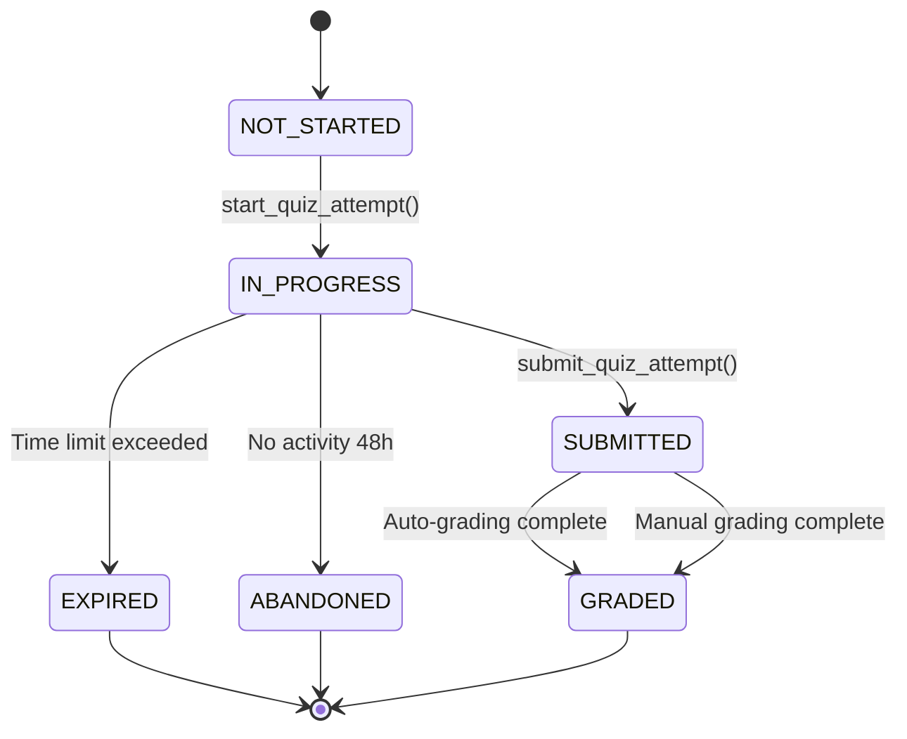

# EduSync Quiz Engine — Production Architecture

## Final Blueprint: Quizizz-Level for Multi-Tenant SaaS LMS

**Document Version:** 2.1  
**Last Updated:** 2026-03-15  
**Architecture:** Supabase + PostgreSQL RPC + React  
**Target Scale:** 1M+ concurrent students

---

## Quiz Lifecycle (End-to-End Flow)

```mermaid
flowchart LR
    subgraph Teacher["Teacher Workflow"]
        T1[Create Quiz]
        T2[Add Questions]
        T3[Configure Settings]
        T4[Assign to Class]
        T5[Publish]
    end

    subgraph Student["Student Workflow"]
        S1[View Assignment]
        S2[Start Attempt]
        S3[Answer Questions]
        S4[Autosave]
        S5[Submit Quiz]
        S6[View Results]
    end

    subgraph Engine["Quiz Engine"]
        E1[Snapshot Questions]
        E2[Create Manifest]
        E3[Start Timer]
        E4[Validate Answers]
        E5[Calculate Score]
        E6[Emit Events]
    end

    T1 --> T2 --> T3 --> T4 --> T5
    T5 -->|quiz_published| S1
    S1 --> S2
    S2 -->|start_quiz_attempt| E1
    E1 --> E2
    E2 --> E3
    E3 --> S3
    S3 -->|autosave| E4
    S4 --> S3
    S3 --> S5
    S5 -->|submit_quiz_attempt| E5
    E5 --> E6
    E6 -->|quiz_graded| S6
```



---

## Table of Contents

1. [Executive Summary](#1-executive-summary)
2. [System Overview](#2-system-overview)
3. [Core Data Model](#3-core-data-model)
4. [Attempt System Architecture](#4-attempt-system-architecture)
5. [Anti-Cheat Layer](#5-anti-cheat-layer)
6. [Autosave & Recovery](#6-autosave--recovery)
7. [Question Randomization](#7-question-randomization)
8. [Analytics Engine](#8-analytics-engine)
9. [Scaling to 1M Students](#9-scaling-to-1m-students)
10. [RPC Layer Reference](#10-rpc-layer-reference)
11. [Security Model](#11-security-model)
12. [Event-Driven Architecture](#12-event-driven-architecture)
13. [Frontend Integration](#13-frontend-integration)
14. [Implementation Checklist](#14-implementation-checklist)
15. [Future Enhancements](#15-future-enhancements)

---

## 1. Executive Summary

EduSync Quiz Engine is a production-grade assessment platform designed for multi-tenant SaaS Learning Management Systems, capable of supporting **1 million+ concurrent students** across multiple schools. The architecture follows a **database-first** principle where all critical logic resides in PostgreSQL RPC functions, ensuring security, correctness, and scalability.

### Design Principles

```
Frontend = UI Only
Logic = RPC Functions
Truth = Database
Events = Telemetry Pipeline
```

### Key Capabilities

| Capability | Implementation |
|------------|---------------|
| Anti-Cheat | Heartbeat system + tab-switch detection + focus monitoring |
| Autosave | Debounced answer persistence (2-second intervals) |
| Attempt Recovery | Automatic IN_PROGRESS state restoration |
| Question Randomization | Deterministic shuffle using `md5(question_id || seed)` |
| Analytics | Pre-aggregated stats + materialized views |
| 1M Concurrent | Partitioning + connection pooling + batch processing |

---

## 2. System Overview

```mermaid
flowchart TB
    subgraph Client["Student Quiz Player"]
        UI[React Quiz UI]
        Timer[Server-Timer Sync]
        Heartbeat[Heartbeat Service]
        Autosave[Autosave Manager]
        AntiCheat[Anti-Cheat Sensors]
    end

    subgraph API["Supabase Client"]
        RPC1[v1_start_quiz_attempt]
        RPC2[v1_submit_quiz_attempt]
        RPC3[v1_save_answer]
        RPC4[record_quiz_heartbeat]
        RPC5[record_cheating_signal]
    end

    subgraph Database["PostgreSQL Database"]
        subgraph CoreTables["Core Tables"]
            Quiz[quizzes]
            Questions[quiz_questions]
            Options[quiz_options]
        end

        subgraph AttemptSystem["Attempt System"]
            Attempts[quiz_attempts_v2]
            AttemptQuestions[quiz_attempt_questions_v2]
            Manifest[question_manifest UUID[]]
        end

        subgraph AntiCheatDB["Anti-Cheat Tables"]
            Heartbeats[last_heartbeat_at]
            Signals[cheating_signals JSONB]
            TabCount[tab_switch_count]
        end

        subgraph AnalyticsDB["Analytics Tables"]
            QuizStats[quiz_stats]
            QuestionStats[question_stats]
            Leaderboard[quiz_leaderboard MV]
        end
    end

    subgraph Events["Event Pipeline"]
        Telemetry[telemetry_events]
        Consumers[Analytics / Gamification / Notifications]
    end

    UI --> Timer
    UI --> Heartbeat
    UI --> Autosave
    UI --> AntiCheat

    Heartbeat --> RPC4
    Autosave --> RPC3
    AntiCheat --> RPC5

    RPC1 --> Attempts
    RPC2 --> Attempts
    RPC3 --> AttemptQuestions

    Attempts --> Manifest
    Manifest --> Questions
    Attempts --> Heartbeats
    Attempts --> Signals
    Attempts --> QuizStats

    Attempts --> Telemetry
    Telemetry --> Consumers
```

---

## 3. Core Data Model

### 3.1 Quiz Tables

```sql
-- quizzes: Main quiz definition
CREATE TABLE public.quizzes (
    id UUID PRIMARY KEY DEFAULT gen_random_uuid(),
    tenant_id UUID REFERENCES tenants(id) ON DELETE CASCADE NOT NULL,
    
    -- Content
    title TEXT NOT NULL,
    instructions TEXT,
    lesson_id UUID,  -- For lesson quizzes
    course_id UUID,  -- For course-linked quizzes
    origin_class_id UUID,  -- Original creator class
    
    -- Configuration
    mode quiz_mode DEFAULT 'graded',  -- practice | graded | exam
    status quiz_status DEFAULT 'draft',  -- draft | published | archived
    
    -- Attempt Control
    max_attempts INTEGER DEFAULT 1,
    time_limit_minutes INTEGER,
    passing_score INTEGER DEFAULT 70,
    
    -- Randomization
    shuffle_questions BOOLEAN DEFAULT false,
    shuffle_options BOOLEAN DEFAULT false,
    
    -- Feedback
    show_correct_answers BOOLEAN DEFAULT false,
    
    -- Scheduling
    available_from TIMESTAMPTZ,
    available_until TIMESTAMPTZ,
    
    -- Metadata
    created_by UUID REFERENCES auth.users(id),
    created_at TIMESTAMPTZ DEFAULT now(),
    updated_at TIMESTAMPTZ DEFAULT now()
);

-- quiz_questions: Questions within a quiz
CREATE TABLE public.quiz_questions (
    id UUID PRIMARY KEY DEFAULT gen_random_uuid(),
    quiz_id UUID REFERENCES quizzes(id) ON DELETE CASCADE NOT NULL,
    tenant_id UUID REFERENCES tenants(id) ON DELETE CASCADE NOT NULL,
    
    text TEXT NOT NULL,
    question_type question_type NOT NULL DEFAULT 'MCQ',
    explanation TEXT,
    points INTEGER DEFAULT 1,
    "order" INTEGER DEFAULT 0,
    
    created_at TIMESTAMPTZ DEFAULT now()
);

-- quiz_options: Answer options for questions
CREATE TABLE public.quiz_options (
    id UUID PRIMARY KEY DEFAULT gen_random_uuid(),
    question_id UUID REFERENCES quiz_questions(id) ON DELETE CASCADE NOT NULL,
    tenant_id UUID REFERENCES tenants(id) ON DELETE CASCADE NOT NULL,
    
    text TEXT NOT NULL,
    is_correct BOOLEAN DEFAULT false,
    
    created_at TIMESTAMPTZ DEFAULT now()
);
```

### 3.2 Attempt Tables

```sql
-- quiz_attempts_v2: Student quiz attempt records
CREATE TABLE public.quiz_attempts_v2 (
    id UUID PRIMARY KEY DEFAULT gen_random_uuid(),
    tenant_id UUID REFERENCES tenants(id) ON DELETE CASCADE NOT NULL,
    quiz_id UUID REFERENCES quizzes(id) ON DELETE CASCADE NOT NULL,
    assignment_id UUID REFERENCES quiz_assignments(id) ON DELETE SET NULL,
    student_id UUID REFERENCES auth.users(id) NOT NULL,
    
    -- State
    status attempt_status DEFAULT 'NOT_STARTED',
    attempt_number INTEGER DEFAULT 1,
    
    -- Timing
    started_at TIMESTAMPTZ DEFAULT now(),
    submitted_at TIMESTAMPTZ,
    expires_at TIMESTAMPTZ,
    last_heartbeat_at TIMESTAMPTZ DEFAULT now(),
    time_spent INTEGER DEFAULT 0,
    
    -- Scoring (immutable after submit)
    score NUMERIC(5,2),
    passed BOOLEAN,
    correct_count INTEGER DEFAULT 0,
    total_questions INTEGER DEFAULT 0,
    
    -- Question Manifest (ordered question IDs for this attempt)
    question_manifest UUID[] DEFAULT '{}',
    
    -- Anti-Cheat
    attempt_seed UUID DEFAULT gen_random_uuid(),
    tab_switch_count INTEGER DEFAULT 0,
    focus_loss_count INTEGER DEFAULT 0,
    cheating_signals JSONB DEFAULT '[]',
    
    created_at TIMESTAMPTZ DEFAULT now(),
    
    UNIQUE(quiz_id, student_id, attempt_number)
);

-- Indexes for performance
CREATE INDEX idx_qa_v2_assignment_student ON quiz_attempts_v2(assignment_id, student_id, status);
CREATE INDEX idx_qa_v2_quiz_student ON quiz_attempts_v2(quiz_id, student_id, status);
CREATE INDEX idx_qa_v2_tenant ON quiz_attempts_v2(tenant_id);
CREATE INDEX idx_qa_v2_expires ON quiz_attempts_v2(expires_at) WHERE status = 'IN_PROGRESS';
```

### 3.3 Quiz Assignment Tables

```sql
-- quiz_assignments: Cross-class quiz assignment
CREATE TABLE public.quiz_assignments (
    id UUID PRIMARY KEY DEFAULT gen_random_uuid(),
    tenant_id UUID REFERENCES tenants(id) ON DELETE CASCADE NOT NULL,
    quiz_id UUID REFERENCES quizzes(id) ON DELETE CASCADE NOT NULL,
    class_id UUID REFERENCES classes(id) ON DELETE CASCADE NOT NULL,
    
    -- Schedule
    available_from TIMESTAMPTZ,
    due_at TIMESTAMPTZ,
    
    -- Override quiz settings
    max_attempts INTEGER,
    passing_score INTEGER,
    
    -- Status
    status assignment_status DEFAULT 'draft',
    
    created_at TIMESTAMPTZ DEFAULT now(),
    
    UNIQUE(quiz_id, class_id)
);
```

---

## 4. Attempt System Architecture

### 4.1 State Machine



### 4.2 Attempt Lifecycle

#### Start Attempt (`v1_start_quiz_attempt`)

```sql
CREATE OR REPLACE FUNCTION public.v1_start_quiz_attempt(
    p_quiz_id UUID,
    p_assignment_id UUID DEFAULT NULL
)
RETURNS JSONB
LANGUAGE plpgsql
SECURITY DEFINER
AS $$
DECLARE
    v_tenant_id UUID;
    v_student_id UUID := auth.uid();
    v_new_attempt_id UUID := gen_random_uuid();
    v_attempt_seed UUID := gen_random_uuid();
    v_quiz RECORD;
    v_assignment RECORD;
    v_existing_attempt RECORD;
    v_manifest UUID[];
    v_expires_at TIMESTAMPTZ;
    v_attempt_number INTEGER;
    v_effective_max_attempts INTEGER;
BEGIN
    -- 1. Get tenant from JWT
    v_tenant_id := get_my_tenant_id();
    
    -- 2. Validate quiz exists and is published
    SELECT * INTO v_quiz FROM quizzes 
    WHERE id = p_quiz_id AND tenant_id = v_tenant_id AND status = 'published';
    
    -- 3. Check assignment if provided
    IF p_assignment_id IS NOT NULL THEN
        SELECT * INTO v_assignment FROM quiz_assignments
        WHERE id = p_assignment_id AND quiz_id = p_quiz_id;
        
        -- 4. Verify enrollment
        IF NOT is_enrolled_in_class(v_assignment.class_id, v_student_id) THEN
            RAISE EXCEPTION 'Not enrolled';
        END IF;
    END IF;
    
    -- 5. Check for existing IN_PROGRESS attempt (RECOVERY)
    SELECT * INTO v_existing_attempt FROM quiz_attempts_v2
    WHERE student_id = v_student_id 
      AND status = 'IN_PROGRESS'
      AND expires_at >= now()
      AND quiz_id = p_quiz_id;
    
    IF v_existing_attempt.id IS NOT NULL THEN
        -- RECOVERY: Return existing attempt
        RETURN jsonb_build_object(
            'attempt_id', v_existing_attempt.id,
            'status', 'IN_PROGRESS',
            'recovered', true,
            'question_manifest', v_existing_attempt.question_manifest
        );
    END IF;
    
    -- 6. Check attempt limit
    SELECT MAX(attempt_number) + 1 INTO v_attempt_number
    FROM quiz_attempts_v2
    WHERE student_id = v_student_id AND quiz_id = p_quiz_id;
    
    v_effective_max_attempts := COALESCE(v_assignment.max_attempts, v_quiz.max_attempts, 1);
    IF v_attempt_number > v_effective_max_attempts THEN
        RAISE EXCEPTION 'Attempt limit reached';
    END IF;
    
    -- 7. Generate question manifest with RANDOMIZATION
    IF v_quiz.shuffle_questions THEN
        -- Deterministic shuffle: md5(question_id || attempt_seed)
        SELECT ARRAY(
            SELECT id FROM quiz_questions
            WHERE quiz_id = p_quiz_id
            ORDER BY md5(id::text || v_attempt_seed::text)
        ) INTO v_manifest;
    ELSE
        SELECT ARRAY(
            SELECT id FROM quiz_questions
            WHERE quiz_id = p_quiz_id
            ORDER BY "order"
        ) INTO v_manifest;
    END IF;
    
    -- 8. Set expiration
    IF v_quiz.time_limit_minutes > 0 THEN
        v_expires_at := now() + (v_quiz.time_limit_minutes * INTERVAL '1 minute');
    ELSE
        v_expires_at := now() + INTERVAL '24 hours';
    END IF;
    
    -- 9. Create attempt
    INSERT INTO quiz_attempts_v2 (
        id, tenant_id, quiz_id, assignment_id, student_id,
        started_at, status, expires_at, question_manifest,
        attempt_number, attempt_seed, last_heartbeat_at
    ) VALUES (
        v_new_attempt_id, v_tenant_id, p_quiz_id, p_assignment_id, v_student_id,
        now(), 'IN_PROGRESS', v_expires_at, v_manifest,
        v_attempt_number, v_attempt_seed, now()
    );
    
    RETURN jsonb_build_object(
        'attempt_id', v_new_attempt_id,
        'status', 'IN_PROGRESS',
        'recovered', false,
        'expires_at', v_expires_at,
        'question_manifest', v_manifest,
        'attempt_seed', v_attempt_seed
    );
END;
$$;
```

#### Submit Attempt (`v1_submit_quiz_attempt`)

```sql
CREATE OR REPLACE FUNCTION public.v1_submit_quiz_attempt(
    p_attempt_id UUID,
    p_final_answers JSONB DEFAULT '[]',
    p_telemetry_data JSONB DEFAULT '{}'
)
RETURNS JSONB
LANGUAGE plpgsql
SECURITY DEFINER
AS $$
DECLARE
    v_attempt RECORD;
    v_question RECORD;
    v_total_questions INTEGER := 0;
    v_total_correct INTEGER := 0;
    v_total_points NUMERIC := 0;
    v_points_earned NUMERIC := 0;
    v_has_ungraded BOOLEAN := FALSE;
    v_score NUMERIC := 0;
    v_passed BOOLEAN;
    v_time_spent INTEGER;
BEGIN
    -- 1. Lock and get attempt
    SELECT a.*, q.passing_score, q.show_correct_answers
    INTO v_attempt
    FROM quiz_attempts_v2 a
    JOIN quizzes q ON q.id = a.quiz_id
    WHERE a.id = p_attempt_id
    FOR UPDATE;
    
    -- 2. Validate ownership
    IF v_attempt.student_id != auth.uid() THEN
        RAISE EXCEPTION 'Unauthorized';
    END IF;
    
    -- 3. Check expiration
    IF v_attempt.expires_at < now() THEN
        UPDATE quiz_attempts_v2 SET status = 'EXPIRED' WHERE id = p_attempt_id;
        RAISE EXCEPTION 'Time limit exceeded';
    END IF;
    
    -- 4. Already submitted - return existing result
    IF v_attempt.status IN ('SUBMITTED', 'GRADED') THEN
        RETURN get_existing_attempt_result(p_attempt_id);
    END IF;
    
    -- 5. Save final answers
    IF jsonb_array_length(p_final_answers) > 0 THEN
        PERFORM v1_save_partial_answers(p_attempt_id, p_final_answers);
    END IF;
    
    -- 6. Calculate time spent
    v_time_spent := FLOOR(EXTRACT(EPOCH FROM (now() - v_attempt.started_at)))::integer;
    
    -- 7. Grade each question
    FOR v_question IN
        SELECT q.id, q.question_type, q.points, aq.student_answers
        FROM quiz_questions q
        LEFT JOIN quiz_attempt_questions_v2 aq ON aq.attempt_id = p_attempt_id AND aq.question_id = q.id
        WHERE q.id = ANY(v_attempt.question_manifest)
    LOOP
        v_total_questions := v_total_questions + 1;
        v_total_points := v_total_points + COALESCE(v_question.points, 0);
        
        -- Skip manual grading questions
        IF v_question.question_type IN ('SHORT_ANSWER', 'ESSAY') THEN
            v_has_ungraded := TRUE;
            CONTINUE;
        END IF;
        
        -- Auto-grade objective questions
        PERFORM grade_objective_question(
            p_attempt_id, 
            v_question.id, 
            v_question.question_type, 
            v_question.points,
            v_question.student_answers
        );
        
        -- Tally correct answers
        IF is_answer_correct(p_attempt_id, v_question.id) THEN
            v_total_correct := v_total_correct + 1;
            v_points_earned := v_points_earned + COALESCE(v_question.points, 0);
        END IF;
    END LOOP;
    
    -- 8. Calculate score
    v_score := CASE WHEN v_total_points > 0 
        THEN ROUND((v_points_earned / v_total_points) * 100, 2) 
        ELSE 0 END;
    
    v_passed := v_score >= v_attempt.passing_score;
    
    -- 9. Update attempt status
    UPDATE quiz_attempts_v2
    SET status = CASE WHEN v_has_ungraded THEN 'SUBMITTED' ELSE 'GRADED' END,
        submitted_at = now(),
        time_spent = v_time_spent,
        score = v_score,
        passed = v_passed,
        correct_count = v_total_correct,
        total_questions = v_total_questions
    WHERE id = p_attempt_id;
    
    -- 10. Emit event
    PERFORM create_activity_event(
        v_attempt.tenant_id,
        v_attempt.student_id,
        'quiz_attempt_activity',
        jsonb_build_object(
            'action', 'quiz_submitted',
            'quiz_id', v_attempt.quiz_id,
            'attempt_id', p_attempt_id,
            'score', v_score,
            'passed', v_passed
        )
    );
    
    RETURN jsonb_build_object(
        'attempt_id', p_attempt_id,
        'status', CASE WHEN v_has_ungraded THEN 'SUBMITTED' ELSE 'GRADED' END,
        'score', v_score,
        'passed', v_passed,
        'correct_answers', v_total_correct,
        'total_questions', v_total_questions,
        'show_correct_answers', v_attempt.show_correct_answers
    );
END;
$$;
```

---

## 5. Anti-Cheat Layer

### 5.1 Heartbeat System

The heartbeat system ensures students remain active during the quiz. It's the primary anti-cheat mechanism.

**Critical: Heartbeat Abuse Prevention**

Heartbeat can be abused by scripts. We implement threshold detection:

```sql
-- Constants for threshold detection
CONSTANT HEARTBEAT_INTERVAL_SECONDS = 10;
CONSTANT MAX_TOLERATED_GAP_SECONDS = 60;
CONSTANT SUSPICIOUS_GAP_SECONDS = 120;
```

```sql
-- record_quiz_heartbeat: Called every 10 seconds from client
-- CRITICAL: Detects heartbeat abuse and flags suspicious behavior
CREATE OR REPLACE FUNCTION public.record_quiz_heartbeat(p_attempt_id UUID)
RETURNS JSONB
LANGUAGE plpgsql
SECURITY DEFINER
AS $
DECLARE
    v_updated BOOLEAN := FALSE;
    v_last_heartbeat TIMESTAMPTZ;
    v_gap_seconds INTEGER;
    v_is_suspicious BOOLEAN := FALSE;
BEGIN
    -- Get last heartbeat timestamp
    SELECT last_heartbeat_at INTO v_last_heartbeat
    FROM quiz_attempts_v2
    WHERE id = p_attempt_id;
    
    -- Calculate gap
    IF v_last_heartbeat IS NOT NULL THEN
        v_gap_seconds := EXTRACT(EPOCH FROM (now() - v_last_heartbeat))::INTEGER;
        
        -- Flag if gap exceeds threshold (possible automation/tab-abandonment)
        IF v_gap_seconds > SUSPICIOUS_GAP_SECONDS THEN
            v_is_suspicious := TRUE;
        END IF;
    END IF;
    
    UPDATE quiz_attempts_v2
    SET last_heartbeat_at = now()
    WHERE id = p_attempt_id
      AND student_id = auth.uid()
      AND tenant_id = get_my_tenant_id()
      AND status = 'IN_PROGRESS';

    GET DIAGNOSTICS v_updated = ROW_COUNT;
    
    -- Return result with suspicious flag
    RETURN jsonb_build_object(
        'success', v_updated,
        'suspicious', v_is_suspicious,
        'gap_seconds', v_gap_seconds
    );
END;
$;
```

> **CTO Note:** This prevents scripts from maintaining fake heartbeat. If gap > 120 seconds, flag for manual review.

### 5.2 Cheating Signal Detection

```sql
-- record_cheating_signal: Record tab switches, focus loss, etc.
CREATE OR REPLACE FUNCTION public.record_cheating_signal(
    p_attempt_id UUID,
    p_signal_type TEXT,
    p_metadata JSONB DEFAULT '{}'
)
RETURNS BOOLEAN
LANGUAGE plpgsql
SECURITY DEFINER
AS $$
DECLARE
    v_updated BOOLEAN := FALSE;
BEGIN
    UPDATE quiz_attempts_v2
    SET 
        last_heartbeat_at = now(),
        tab_switch_count = CASE 
            WHEN p_signal_type = 'TAB_SWITCH' THEN tab_switch_count + 1 
            ELSE tab_switch_count 
        END,
        focus_loss_count = CASE 
            WHEN p_signal_type = 'FOCUS_LOSS' THEN focus_loss_count + 1 
            ELSE focus_loss_count 
        END,
        cheating_signals = cheating_signals || jsonb_build_array(
            jsonb_build_object(
                'type', p_signal_type,
                'timestamp', now(),
                'metadata', p_metadata
            )
        )
    WHERE id = p_attempt_id
      AND student_id = auth.uid()
      AND status = 'IN_PROGRESS';

    GET DIAGNOSTICS v_updated = ROW_COUNT;
    RETURN v_updated;
END;
$$;
```

### 5.3 Client-Side Implementation

```typescript
// Anti-cheat sensors in React
export function useAntiCheat(attemptId: string) {
    const recordSignal = useCallback((type: CheatingSignal, metadata = {}) => {
        quizService.recordCheatingSignal(attemptId, type, metadata);
    }, [attemptId]);

    useEffect(() => {
        // Tab visibility change
        const handleVisibilityChange = () => {
            if (document.hidden) {
                recordSignal('TAB_SWITCH', { timestamp: Date.now() });
            }
        };

        // Window blur/focus
        const handleBlur = () => {
            recordSignal('FOCUS_LOSS', { timestamp: Date.now() });
        };

        // Prevent right-click
        const handleContextMenu = (e: Event) => {
            e.preventDefault();
            recordSignal('RIGHT_CLICK', { timestamp: Date.now() });
        };

        // Prevent text selection
        const handleSelectStart = (e: Event) => {
            e.preventDefault();
        };

        document.addEventListener('visibilitychange', handleVisibilityChange);
        window.addEventListener('blur', handleBlur);
        document.addEventListener('contextmenu', handleContextMenu);
        document.addEventListener('selectstart', handleSelectStart);

        return () => {
            document.removeEventListener('visibilitychange', handleVisibilityChange);
            window.removeEventListener('blur', handleBlur);
            document.removeEventListener('contextmenu', handleContextMenu);
            document.removeEventListener('selectstart', handleSelectStart);
        };
    }, [recordSignal]);

    // Heartbeat interval
    useEffect(() => {
        const interval = setInterval(() => {
            quizService.recordHeartbeat(attemptId);
        }, 10000); // Every 10 seconds

        return () => clearInterval(interval);
    }, [attemptId]);
}
```

### 5.4 Signal Types

| Signal | Description | Action |
|--------|-------------|--------|
| `TAB_SWITCH` | Student switched browser tabs | Increment counter, log event |
| `FOCUS_LOSS` | Window lost focus (alt-tab, click outside) | Increment counter, log event |
| `RIGHT_CLICK` | Right-click context menu attempted | Log event |
| `DEVTOOLS_OPEN` | Developer tools detected | Flag for review |
| `LONG_IDLE` | No heartbeat for > 60 seconds | Mark for review |

---

## 6. Autosave & Recovery

### 6.1 Autosave System

The autosave system persists answers as students navigate between questions.

```sql
-- v1_save_answer: Save single answer (autosave)
CREATE OR REPLACE FUNCTION public.v1_save_answer(
    p_attempt_id UUID,
    p_question_id UUID,
    p_selected_option_ids UUID[] DEFAULT '{}',
    p_text_answer TEXT DEFAULT NULL
)
RETURNS JSONB
LANGUAGE plpgsql
SECURITY DEFINER
AS $$
DECLARE
    v_student_answer JSONB;
BEGIN
    -- Convert to JSONB format
    IF p_text_answer IS NOT NULL AND btrim(p_text_answer) <> '' THEN
        v_student_answer := to_jsonb(p_text_answer);
    ELSE
        v_student_answer := to_jsonb(COALESCE(p_selected_option_ids, ARRAY[]::uuid[]));
    END IF;

    INSERT INTO quiz_attempt_questions_v2 (
        attempt_id, question_id, tenant_id, student_answers
    )
    VALUES (
        p_attempt_id, p_question_id, get_my_tenant_id(), v_student_answer
    )
    ON CONFLICT (attempt_id, question_id) DO UPDATE
    SET student_answers = EXCLUDED.student_answers;

    RETURN jsonb_build_object('success', true);
END;
$$;
```

### 6.2 Frontend Autosave Implementation

```typescript
// Autosave hook with debouncing
export function useAutosave(attemptId: string) {
    const [saveStatus, setSaveStatus] = useState<'idle' | 'saving' | 'saved'>('idle');
    const answerBuffer = useRef<Map<string, Answer>>(new Map());
    const debounceTimer = useRef<NodeJS.Timeout>();

    const saveAnswer = useCallback(async (questionId: string, answer: Answer) => {
        // Buffer the answer locally
        answerBuffer.current.set(questionId, answer);
        setSaveStatus('idle');

        // Debounce: save after 2 seconds of inactivity
        clearTimeout(debounceTimer.current);
        debounceTimer.current = setTimeout(async () => {
            setSaveStatus('saving');
            
            // Batch save all buffered answers
            const answers = Array.from(answerBuffer.current.entries()).map(
                ([question_id, answer]) => ({ question_id, ...answer })
            );
            
            await quizService.batchSaveAnswers(attemptId, answers);
            
            setSaveStatus('saved');
            setTimeout(() => setSaveStatus('idle'), 2000);
        }, 2000);
    }, [attemptId]);

    // Force save on question navigation
    const forceSave = useCallback(async () => {
        clearTimeout(debounceTimer.current);
        if (answerBuffer.current.size > 0) {
            setSaveStatus('saving');
            const answers = Array.from(answerBuffer.current.entries()).map(
                ([question_id, answer]) => ({ question_id, ...answer })
            );
            await quizService.batchSaveAnswers(attemptId, answers);
            setSaveStatus('saved');
        }
    }, [attemptId]);

    return { saveAnswer, forceSave, saveStatus };
}
```

### 6.3 Attempt Recovery

The system automatically recovers in-progress attempts when students return.

```typescript
// Recovery on page load
export async function recoverAttempt(quizId: string, assignmentId?: string) {
    const existingAttempt = await quizService.getActiveAttempt(quizId, assignmentId);
    
    if (existingAttempt && existingAttempt.status === 'IN_PROGRESS') {
        // Check if expired
        if (new Date(existingAttempt.expires_at) < new Date()) {
            // Already expired - submit as-is
            return await quizService.submitQuizAttempt(existingAttempt.id, []);
        }
        
        // Recover - return existing attempt
        return {
            recovered: true,
            attempt: existingAttempt,
            questions: await quizService.getAttemptQuestions(existingAttempt.id)
        };
    }
    
    return null;
}
```

---

## 7. Question Randomization

### 7.1 Deterministic Shuffle Algorithm

Questions are shuffled using a deterministic algorithm based on the attempt seed, ensuring:
- Same student gets consistent order on recovery
- Different students get different orders
- Attempt is immutable (teacher edits don't affect in-progress attempts)

```sql
-- Deterministic shuffle using md5 hash
SELECT ARRAY(
    SELECT id FROM quiz_questions
    WHERE quiz_id = p_quiz_id
    ORDER BY md5(id::text || v_attempt_seed::text)
) INTO v_manifest;
```

### 7.2 Option Randomization

Options within each question can also be shuffled:

```sql
-- Get shuffled options for a question
CREATE OR REPLACE FUNCTION public.get_shuffled_options(
    p_question_id UUID,
    p_seed UUID DEFAULT gen_random_uuid()
)
RETURNS TABLE(id UUID, text TEXT, order_index INTEGER)
LANGUAGE plpgsql
AS $
BEGIN
    RETURN QUERY
    SELECT 
        id, 
        text, 
        ROW_NUMBER() OVER (ORDER BY md5(id::text || p_seed::text)) as order_index
    FROM quiz_options
    WHERE question_id = p_question_id;
END;
$;
```

---

## 8. Analytics Engine

### 8.1 Pre-aggregated Statistics

```sql
-- quiz_stats: Precomputed quiz-level statistics
CREATE TABLE public.quiz_stats (
    id UUID PRIMARY KEY DEFAULT gen_random_uuid(),
    quiz_id UUID REFERENCES quizzes(id) ON DELETE CASCADE NOT NULL,
    tenant_id UUID REFERENCES tenants(id) ON DELETE CASCADE NOT NULL,
    
    total_attempts INTEGER DEFAULT 0,
    completed_attempts INTEGER DEFAULT 0,
    average_score NUMERIC(5,2),
    median_score NUMERIC(5,2),
    highest_score NUMERIC(5,2),
    pass_rate NUMERIC(5,2),
    average_time_seconds INTEGER,
    
    last_updated TIMESTAMPTZ DEFAULT now(),
    UNIQUE(quiz_id)
);

-- question_stats: Precomputed question-level statistics
CREATE TABLE public.question_stats (
    id UUID PRIMARY KEY DEFAULT gen_random_uuid(),
    question_id UUID REFERENCES quiz_questions(id) ON DELETE CASCADE NOT NULL,
    quiz_id UUID REFERENCES quizzes(id) ON DELETE CASCADE NOT NULL,
    tenant_id UUID REFERENCES tenants(id) ON DELETE CASCADE NOT NULL,
    
    times_shown INTEGER DEFAULT 0,
    times_correct INTEGER DEFAULT 0,
    difficulty_percent NUMERIC(5,2),
    
    last_updated TIMESTAMPTZ DEFAULT now(),
    UNIQUE(question_id, quiz_id)
);
```

### 8.2 Update Triggers

```sql
-- Auto-update stats after grading
CREATE OR REPLACE FUNCTION trg_update_quiz_stats()
RETURNS trigger
LANGUAGE plpgsql
AS $$
BEGIN
    IF NEW.status = 'GRADED' THEN
        INSERT INTO quiz_stats (quiz_id, tenant_id, total_attempts, average_score)
        SELECT 
            NEW.quiz_id,
            NEW.tenant_id,
            1,
            NEW.score
        ON CONFLICT (quiz_id) DO UPDATE
        SET 
            total_attempts = quiz_stats.total_attempts + 1,
            average_score = (
                (quiz_stats.average_score * quiz_stats.total_attempts) + NEW.score
            ) / (quiz_stats.total_attempts + 1);
    END IF;
    RETURN NEW;
END;
$$;

CREATE TRIGGER update_quiz_stats_trigger
AFTER UPDATE ON quiz_attempts_v2
FOR EACH ROW
EXECUTE FUNCTION trg_update_quiz_stats();
```

### 8.3 Leaderboard Materialized View

```sql
-- Fast leaderboard queries without scanning millions of rows
CREATE MATERIALIZED VIEW public.quiz_leaderboard AS
SELECT 
    qa.quiz_id,
    qa.tenant_id,
    qa.student_id,
    p.full_name,
    qa.score,
    qa.time_spent_seconds,
    ROW_NUMBER() OVER (
        PARTITION BY qa.quiz_id, qa.tenant_id 
        ORDER BY qa.score DESC, qa.time_spent_seconds ASC
    ) as rank
FROM quiz_attempts_v2 qa
JOIN profiles p ON p.id = qa.student_id
WHERE qa.status = 'GRADED'
WITH DATA;

CREATE UNIQUE INDEX idx_quiz_leaderboard_unique 
ON quiz_leaderboard(quiz_id, tenant_id, student_id);
```

---

## 9. Scaling to 1M Students

### 9.1 Database Partitioning

For 1M+ concurrent students, partition large tables by time:

```sql
-- Partition quiz_attempts_v2 by month
CREATE TABLE public.quiz_attempts_v2_partitioned (
    LIKE public.quiz_attempts_v2 INCLUDING ALL
) PARTITION BY RANGE (created_at);

CREATE TABLE quiz_attempts_2026_01 PARTITION OF quiz_attempts_v2_partitioned
    FOR VALUES FROM ('2026-01-01') TO ('2026-02-01');

CREATE TABLE quiz_attempts_2026_02 PARTITION OF quiz_attempts_v2_partitioned
    FOR VALUES FROM ('2026-02-01') TO ('2026-03-01');

-- Partition quiz_attempt_questions similarly
CREATE TABLE public.quiz_attempt_questions_v2_partitioned (
    LIKE public.quiz_attempt_questions_v2 INCLUDING ALL
) PARTITION BY RANGE (created_at);
```

### 9.2 Connection Pooling

```sql
-- Use Supabase connection pooler
-- Configure pool mode: transaction
-- Target: < 100ms per query
```

### 9.3 Batch Processing for High Concurrency

```typescript
// Client-side answer batching for high-concurrency scenarios
class AnswerBatcher {
    private buffer: Map<string, Answer[]> = new Map();
    private flushInterval: number = 5000; // 5 seconds

    async flush() {
        if (this.buffer.size === 0) return;

        const batches = Array.from(this.buffer.entries()).map(
            ([attemptId, answers]) => ({ attemptId, answers })
        );

        // Batch RPC call
        await supabase.rpc('batch_save_answers', {
            p_batches: batches
        });

        this.buffer.clear();
    }
}
```

### 9.4 Performance Targets

| Metric | Target |
|--------|--------|
| Quiz Load | < 500ms |
| Start Attempt | < 200ms |
| Save Answer | < 100ms |
| Submit Quiz | < 1 second |
| Grade Quiz (50 questions) | < 2 seconds |
| Concurrent Students | 1,000,000+ |

---

## 10. RPC Layer Reference

### Core RPC Functions

| Function | Purpose | Security |
|----------|---------|----------|
| `v1_start_quiz_attempt` | Initialize attempt with validation | SECURITY DEFINER |
| `v1_submit_quiz_attempt` | Submit and grade quiz | SECURITY DEFINER |
| `v1_save_answer` | Autosave single answer | SECURITY DEFINER |
| `v1_save_partial_answers` | Batch save answers | SECURITY DEFINER |
| `record_quiz_heartbeat` | Update last activity timestamp (with abuse detection) | SECURITY DEFINER |
| `record_cheating_signal` | Log anti-cheat signals | SECURITY DEFINER |
| `get_quiz_for_student` | Get quiz WITHOUT answers - **SECURE** | SECURITY DEFINER |
| `v1_get_assignment_results` | Teacher: get class results | Teacher role |
| `get_attempt_detail` | Get attempt for review | Owner/Teacher |
| `get_question_difficulty` | Get question analytics | Teacher role |

### 10.1 Secure Student Quiz Access RPC

**CRITICAL: This RPC must NEVER return `is_correct` to students**

```sql
-- get_quiz_for_student: Returns quiz questions WITHOUT revealing correct answers
-- This is the ONLY safe way for students to load quiz questions
CREATE OR REPLACE FUNCTION public.get_quiz_for_student(
    p_quiz_id UUID,
    p_assignment_id UUID DEFAULT NULL
)
RETURNS JSONB
LANGUAGE plpgsql
SECURITY DEFINER
AS $
DECLARE
    v_tenant_id UUID;
    v_student_id UUID := auth.uid();
    v_quiz RECORD;
    v_is_enrolled BOOLEAN := FALSE;
    v_questions JSONB;
BEGIN
    v_tenant_id := get_my_tenant_id();
    
    -- Get quiz metadata
    SELECT * INTO v_quiz FROM quizzes
    WHERE id = p_quiz_id AND tenant_id = v_tenant_id AND status = 'published';
    
    IF v_quiz.id IS NULL THEN
        RAISE EXCEPTION 'Quiz not found or not published';
    END IF;
    
    -- Validate enrollment via assignment
    IF p_assignment_id IS NOT NULL THEN
        SELECT EXISTS (
            SELECT 1 FROM quiz_assignments qa
            JOIN enrollments e ON e.class_id = qa.class_id
            WHERE qa.id = p_assignment_id
              AND e.student_id = v_student_id
              AND e.status = 'ACTIVE'
        ) INTO v_is_enrolled;
    ELSE
        -- Check direct course enrollment
        IF v_quiz.course_id IS NOT NULL THEN
            SELECT EXISTS (
                SELECT 1 FROM course_enrollments
                WHERE course_id = v_quiz.course_id
                  AND user_id = v_student_id
                  AND status = 'ACTIVE'
            ) INTO v_is_enrolled;
        END IF;
    END IF;
    
    IF NOT v_is_enrolled THEN
        RAISE EXCEPTION 'Not enrolled in this quiz';
    END IF;
    
    -- CRITICAL: Return questions WITHOUT is_correct
    -- This is the ONLY place students should get questions from
    SELECT jsonb_agg(
        jsonb_build_object(
            'id', q.id,
            'text', q.text,
            'question_type', q.question_type,
            'points', q.points,
            'explanation', q.explanation,
            'options', (
                SELECT jsonb_agg(
                    jsonb_build_object(
                        'id', o.id,
                        'text', o.text
                        -- is_correct is intentionally EXCLUDED
                    ) ORDER BY o.id
                )
                FROM quiz_options o
                WHERE o.question_id = q.id
            )
        ) ORDER BY q."order"
    )
    INTO v_questions
    FROM quiz_questions q
    WHERE q.quiz_id = p_quiz_id;
    
    RETURN jsonb_build_object(
        'id', v_quiz.id,
        'title', v_quiz.title,
        'instructions', v_quiz.instructions,
        'mode', v_quiz.mode,
        'time_limit_minutes', v_quiz.time_limit_minutes,
        'shuffle_questions', v_quiz.shuffle_questions,
        'shuffle_options', v_quiz.shuffle_options,
        'show_correct_answers', v_quiz.show_correct_answers,
        'passing_score', v_quiz.passing_score,
        'questions', v_questions
    );
END;
$;
```

> **CTO Note:** This RPC ensures `is_correct` is NEVER exposed to students. Frontend must use this, not direct table queries.

### Error Codes

| Code | Meaning |
|------|---------|
| P0001 | Tenant not found |
| P0002 | Quiz not found |
| P0003 | Quiz not published |
| P0004 | Assignment not found |
| P0005 | Assignment not active |
| P0006 | Not enrolled |
| P0007 | Unauthorized |
| P0008 | Attempt limit reached |
| P0009 | Quiz not yet available |
| P0010 | Quiz expired |
| P0011 | Time limit exceeded |

---

## 11. Security Model

### 11.1 Tenant Isolation

- All tables have `tenant_id` column
- RLS policies enforce tenant boundaries
- JWT contains `tenant_id` claim
- All RPC functions validate tenant

### 11.2 Score Integrity

- All scoring happens server-side in RPC
- Scores are immutable after submission
- Frontend never sees correct answers until after submission (if enabled)
- `FOR UPDATE` locks prevent race conditions

### 11.3 RLS Policies

```sql
-- Quiz attempts: students can only see own attempts
CREATE POLICY "students_own_attempts"
ON quiz_attempts_v2 FOR SELECT
USING (
    tenant_id = get_my_tenant_id()
    AND student_id = auth.uid()
);

-- Quiz attempts: teachers can see class attempts
CREATE POLICY "teachers_class_attempts"
ON quiz_attempts_v2 FOR SELECT
USING (
    tenant_id = get_my_tenant_id()
    AND quiz_id IN (
        SELECT id FROM quizzes 
        WHERE created_by = auth.uid()
    )
);
```

---

## 12. Event-Driven Architecture

### 12.1 Quiz Events

```sql
-- Events emitted during quiz lifecycle
CREATE TYPE quiz_event_type AS ENUM (
    'QUIZ_STARTED',
    'QUESTION_ANSWERED',
    'QUIZ_SUBMITTED',
    'QUIZ_GRADED',
    'QUIZ_EXPIRED',
    'CHEATING_DETECTED'
);
```

### 12.2 Event Schema

```sql
-- telemetry_events table (existing)
INSERT INTO telemetry_events (
    tenant_id,
    user_id,
    event_type,
    event_data
) VALUES (
    v_tenant_id,
    v_student_id,
    'quiz_attempt_activity',
    jsonb_build_object(
        'action', 'quiz_submitted',
        'quiz_id', p_quiz_id,
        'attempt_id', v_attempt_id,
        'score', v_score,
        'passed', v_passed,
        'tab_switches', v_tab_switches,
        'focus_losses', v_focus_losses
    )
);
```

### 12.3 Event Consumers

| Consumer | Purpose |
|----------|---------|
| Analytics Engine | Quiz performance dashboards |
| Gamification System | Award XP, badges for completed quizzes |
| Notifications | Notify teachers of submissions |
| AI Tutor | Update student knowledge model |

---

## 13. Frontend Integration

### 13.1 Quiz Service API

```typescript
// src/services/quizService.ts

export interface Quiz {
    id: string;
    title: string;
    mode: QuizMode;
    time_limit_minutes: number | null;
    shuffle_questions: boolean;
    shuffle_options: boolean;
    show_correct_answers: boolean;
    passing_score: number;
    quiz_questions?: QuizQuestion[];
}

export interface QuizAttempt {
    id: string;
    status: QuizAttemptStatus;
    score: number | null;
    passed: boolean | null;
    started_at: string;
    expires_at: string;
    question_manifest: string[];
    attempt_seed: string;
}

export interface QuizAnswer {
    question_id: string;
    selected_option_ids?: string[];
    text_answer?: string;
}

export const quizService = {
    async startQuizAttempt(quizId: string, assignmentId?: string) { /* RPC */ },
    async submitQuizAttempt(attemptId: string, answers: QuizAnswer[]) { /* RPC */ },
    async saveQuizAnswer(attemptId: string, questionId: string, answer: Partial<QuizAnswer>) { /* RPC */ },
    async recordHeartbeat(attemptId: string): Promise<boolean> { /* RPC */ },
    async recordCheatingSignal(attemptId: string, type: string, metadata?: object) { /* RPC */ },
    async getActiveAttempt(quizId: string, assignmentId?: string): Promise<QuizAttempt | null> { /* Query */ },
    async getAttemptQuestions(attemptId: string): Promise<QuizAttemptQuestion[]> { /* Query */ },
    async getUserAttempts(tenantId: string): Promise<QuizAttempt[]> { /* Query */ },
};
```

### 13.2 Quiz Player Components

```
src/pages/quiz/
├── QuizPlayer.tsx       # Main quiz container
├── QuizHeader.tsx       # Timer, progress, title
├── QuizBody.tsx        # Question display + input
├── QuizFooter.tsx      # Navigation, submit button
├── QuizTimer.tsx       # Countdown timer (server-synced)
├── QuestionPalette.tsx # Question navigator
├── AutosaveIndicator.tsx
└── QuizReviewScreen.tsx
```

---

## 14. Implementation Checklist

### Phase 1: Core Infrastructure

- [x] Quiz tables (quizzes, quiz_questions, quiz_options)
- [x] Attempt tables (quiz_attempts_v2, quiz_attempt_questions_v2)
- [x] Assignment tables (quiz_assignments)
- [x] Core RPCs (start, submit, save)
- [x] RLS policies
- [x] Basic analytics

### Phase 2: Anti-Cheat

- [x] Heartbeat system
- [x] Cheating signal recording
- [x] Tab-switch detection (client)
- [x] Focus loss detection (client)
- [ ] DevTools detection (client)
- [ ] Suspicious behavior flagging

### Phase 3: Recovery & Autosave

- [x] Attempt recovery logic
- [x] Debounced autosave
- [x] Force save on navigation
- [ ] Offline support (Service Worker)

### Phase 4: Scaling

- [ ] Table partitioning
- [ ] Connection pool optimization
- [ ] Batch processing for high concurrency
- [ ] CDN caching for static quiz content

### Phase 5: Advanced Analytics

- [x] Pre-aggregated stats
- [x] Question difficulty tracking
- [x] Leaderboard materialized view
- [ ] Real-time dashboards
- [ ] Export capabilities

---

## Appendix A: Migration History

| Migration | Description |
|-----------|-------------|
| 63 | Quiz engine schema (quizzes, questions, options) |
| 64 | Quiz engine RPCs |
| 65 | Quiz engine RLS |
| 76 | Quiz engine Phase 1 |
| 77 | Quiz analytics RPCs |
| 78 | Quiz audit fixes |
| 79 | Quiz engine V1 RPCs |
| 80 | Fix attempt number |
| 81 | Quiz assignments schema |
| 82 | Class assignment quiz V2 refactor |

---

## Appendix B: Related Documents

- [DATABASE_ARCHITECTURE.md](../DATABASE_ARCHITECTURE.md)
- [DOMAIN_MAP.md](../DOMAIN_MAP.md)
- [RLS_POLICIES.md](../RLS_POLICIES.md)
- [QUIZ_SYSTEM_TECHNICAL_ARCHITECTURE.md](../../plans/QUIZ_SYSTEM_TECHNICAL_ARCHITECTURE.md)

---

## 15. Future Enhancements

### 15.1 Adaptive Quiz (IRT - Item Response Theory)

Implement adaptive difficulty based on student performance:

```sql
-- Add to question_stats
ALTER TABLE question_stats ADD COLUMN difficulty_index NUMERIC(5,2);
ALTER TABLE question_stats ADD COLUMN discrimination_index NUMERIC(5,2);
```

**Algorithm:**
1. Track student's ability estimate after each question
2. Select next question based on information gain
3. Questions adapt to student skill level (like GMAT)

### 15.2 Question Bank Reuse

Enable questions to be reused across quizzes:

```sql
-- question_bank table
CREATE TABLE public.question_bank (
    id UUID PRIMARY KEY DEFAULT gen_random_uuid(),
    tenant_id UUID REFERENCES tenants(id) NOT NULL,
    question_type question_type NOT NULL,
    text TEXT NOT NULL,
    explanation TEXT,
    difficulty TEXT DEFAULT 'medium',
    tags TEXT[],
    times_used INTEGER DEFAULT 0,
    created_by UUID REFERENCES auth.users(id)
);

-- Link questions to bank
CREATE TABLE public.quiz_question_bank_map (
    quiz_id UUID REFERENCES quizzes(id),
    question_id UUID REFERENCES quiz_questions(id),
    question_bank_id UUID REFERENCES question_bank(id),
    PRIMARY KEY (quiz_id, question_id, question_bank_id)
);
```

### 15.3 Attempt Streaming (Real-time Analytics)

Real-time quiz progress for teachers:

```typescript
// Real-time subscription to quiz events
const teacherWatchesQuiz = (quizId: string) => {
    // Subscribe to real-time attempt submissions
    supabase
        .channel(`quiz:${quizId}:attempts`)
        .on('postgres_changes', {
            event: 'INSERT',
            schema: 'public',
            table: 'quiz_attempts_v2',
            filter: `quiz_id=eq.${quizId}`
        }, (payload) => {
            // Notify teacher: student submitted
            notifyTeacher(payload.new);
        })
        .subscribe();
};
```

### 15.4 Progressive Leaderboard

Live leaderboard during quiz:

```sql
-- Live leaderboard with WebSocket push
-- Updates every 10 seconds during active quiz
CREATE MATERIALIZED VIEW public.quiz_live_leaderboard AS
SELECT 
    a.quiz_id,
    a.student_id,
    p.full_name,
    a.score,
    ROW_NUMBER() OVER (PARTITION BY a.quiz_id ORDER BY a.score DESC) as rank
FROM quiz_attempts_v2 a
JOIN profiles p ON p.id = a.student_id
WHERE a.status IN ('SUBMITTED', 'GRADED')
WITH DATA;
```

### 15.5 Cheating Risk Score

Combine signals into actionable risk score:

```sql
-- Calculate cheating risk score
CREATE OR REPLACE FUNCTION public.calculate_cheating_risk_score(
    p_attempt_id UUID
)
RETURNS NUMERIC
LANGUAGE plpgsql
AS $
DECLARE
    v_attempt RECORD;
    v_risk_score NUMERIC := 0;
BEGIN
    SELECT * INTO v_attempt FROM quiz_attempts_v2 WHERE id = p_attempt_id;
    
    -- Tab switches (weight: 5 points each, max 50)
    v_risk_score := v_risk_score + LEAST(v_attempt.tab_switch_count * 5, 50);
    
    -- Focus losses (weight: 3 points each, max 30)
    v_risk_score := v_risk_score + LEAST(v_attempt.focus_loss_count * 3, 30);
    
    -- Long idle (if detected)
    IF v_attempt.last_heartbeat_at < v_attempt.started_at + INTERVAL '5 minutes' THEN
        v_risk_score := v_risk_score + 20;
    END IF;
    
    RETURN LEAST(v_risk_score, 100);
END;
$;

-- Risk thresholds:
-- 0-30: Normal
-- 31-60: Review recommended
-- 61-100: Flag for investigation
```

---

*Document maintained by EduSync Engineering Team*  
*For questions, refer to #engineering or the Architecture Guild*
*Version 2.1 - CTO Review Applied*
