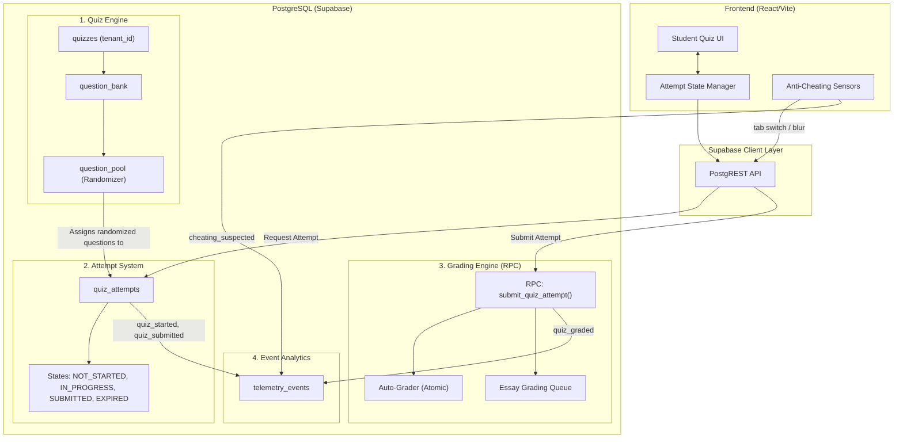

# EduSync Quiz System Architecture (Production Grade)

This document outlines the production-grade architecture for the EduSync Quiz System, designed to handle multi-tenant isolation, massive concurrency, robust anti-cheating measures, and event-driven analytics.

## 1. Architecture Overview

## 2. Core Subsystems

### 2.1 Quiz Engine & Question Pool
To prevent questions from being easily shared among students, the system implements a **Question Pool Randomization** strategy.
- **`question_bank`**: Stores all possible questions at the tenant level.
- **`question_pool`**: Defines dynamic subsets of questions (e.g., "Select 5 random questions from the Chapter 1 Algebra pool").
- When a new attempt is generated, the database assigns a randomized set of questions specific to that attempt, ensuring no two students get the exact same quiz sequence.

### 2.2 Attempt Integrity (State Machine)
Quiz attempts follow a strict state machine implemented at the database level to prevent replay attacks, overlapping sessions, and browser-refresh exploits.
- **States**: `NOT_STARTED` &rarr; `IN_PROGRESS` &rarr; `SUBMITTED` &rarr; `EXPIRED` &rarr; `GRADED`.
- Database constraints ensure a student can only have one `IN_PROGRESS` attempt for a given quiz at a time.
- Resuming a quiz strictly restores the state from the active `IN_PROGRESS` attempt.

### 2.3 Grading Engine (Database-First)
Grading is executed entirely within PostgreSQL via RPC to guarantee atomic transactions and prevent client-side manipulation.
- **`submit_quiz_attempt()`**: Encapsulated RPC that accepts the student's payload.
- **Auto-Grader**: Immediately calculates scores for Objective questions (Multiple Choice, True/False) atomically.
- **Essay Queue**: Moves subjective questions into a grading queue for Teacher review, enabling Partial Grading workflows before moving the attempt to `GRADED`.

### 2.4 Event-Driven Analytics
Every significant action emits a standardized event to the system's telemetry pipeline, aligning with EduSync's event-driven architecture.
- **Events Tracked**: `quiz_started`, `question_answered`, `quiz_submitted`, `quiz_graded`, `quiz_expired`.
- **Use Cases**: Feeds real-time scoreboards, populates the Learning Analytics engine, and informs the AI Tutor about specific student knowledge gaps.

### 2.5 Anti-Cheating Layer
A multi-layered approach to maintaining academic integrity.
- **Client-Side Sensors**:
  - `visibilitychange` & `blur` event listeners detect when a student switches tabs, opens a search engine, or minimizes the browser window.
  - Strict UI configuration disabling text selection and right-click to prevent easy copy/pasting.
- **Server-Side Enforcement**:
  - Attempts are time-boxed using server timestamps. If an attempt is submitted after `start_time + time_limit + grace_period`, it is forcibly marked as `EXPIRED`.
  - Rapid sequential submissions are blocked via strict deterministic state transitions.

## 3. Implementation Roadmap Strategy

Following the CTO's directive, the development pipeline is prioritized securely:

1. **Phase 1: Security & Tenant Hardening (Priority 0)**
   - Enforce explicit `tenant_id` filtering on all Quiz application filters.
   - Implement the Core `quiz_attempts` State Machine.
   - Inject robust pagination into the Gradebook queries.
2. **Phase 2: Teacher Productivity**
   - Question Bank management architecture.
   - Quiz duplication and CSV import/export utilities.
3. **Phase 3: Student Experience (UX)**
   - Question navigator.
   - Floating timer warnings and post-quiz answer review.
4. **Phase 4: Advanced LMS Capabilities**
   - Essay grading workflows.
   - Event-driven anti-cheating alerts.
   - AI-assisted quiz content generation.
