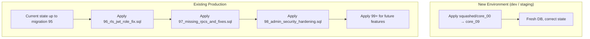
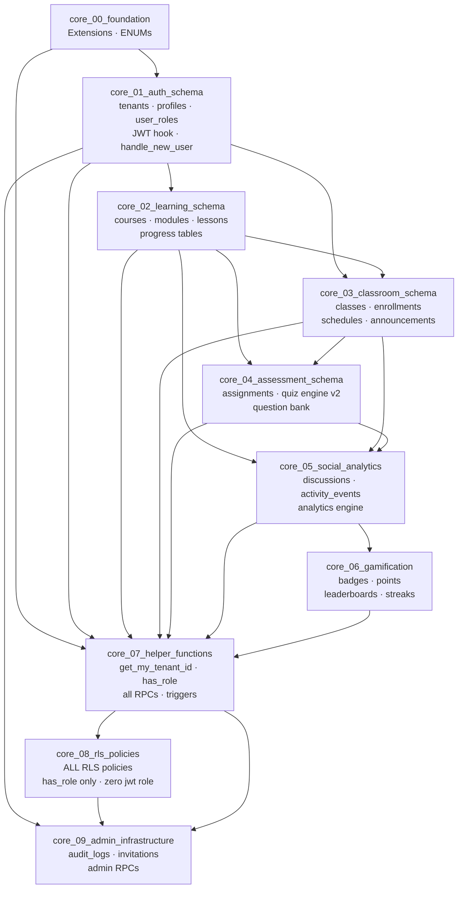

# EduSync LMS — Migration Consolidation Plan

# 125 Migrations → 10 Core Migrations

> **Status**: Planning document — not yet executed.
> **Applies to**: Fresh deployments only. Existing production DB continues using incremental migrations.
> **Last updated**: After migrations 96–98 (P0 security remediation).

---

## Why Consolidate?

The current 125 migration files have grown organically through:

- Feature development sprints (quiz engine v1 → v2, gamification phases 1–5)
- Bug fixes applied as new migrations instead of amending earlier ones
- Chaotic numbering: `01_`, `093_`, `261_`, `801_` mixed with `.ignored` files
- 11 `.ignored` files representing "soft-deleted" migrations that still confuse `supabase db diff`
- Duplicate logic: the same table gets RLS policies added, dropped, and re-added across 15+ files

**Goal:** A single authoritative baseline (`squashed/`) that new developers can apply in 10 steps to
get a correct, production-equivalent database — without having to replay 125 files in uncertain order.

---

## Critical Rule

```
┌─────────────────────────────────────────────────────────────────────┐
│  SQUASHED MIGRATIONS ARE FOR FRESH DEPLOYMENTS ONLY.                │
│                                                                     │
│  DO NOT apply squashed migrations to an existing database.          │
│  Existing prod / staging DBs must continue to use incremental       │
│  migrations (96_, 97_, 98_, 99_, ...).                              │
│                                                                     │
│  The squashed files represent the TARGET STATE, not a patch.        │
└─────────────────────────────────────────────────────────────────────┘
```

---

## Deployment Strategy



---

## The 10 Core Migrations

Target directory: `supabase/squashed/`

| File                               | Domain                                         | Source Migrations               |
| ---------------------------------- | ---------------------------------------------- | ------------------------------- |
| `core_00_foundation.sql`           | Extensions, types, enums                       | 01 (partial)                    |
| `core_01_auth_schema.sql`          | tenants, profiles, user_roles, auth hooks      | 01, 03, 25, 74, 801             |
| `core_02_learning_schema.sql`      | courses, modules, lessons, resources, progress | 01, 03, 05, 09, 23, 093, 161    |
| `core_03_classroom_schema.sql`     | classes, enrollments, schedules, announcements | 01, 05, 16, 43, 44, 72          |
| `core_04_assessment_schema.sql`    | assignments, submissions, quiz engine v2       | 01, 12, 15, 53–71, 76–84, 90–94 |
| `core_05_social_analytics.sql`     | discussions, activity_events, analytics tables | 01, 10–14, 26–38, 121, 141, 151 |
| `core_06_gamification.sql`         | badges, points, leaderboards, streaks          | 42, 50–52, 465, 475, 485, 095   |
| `core_07_helper_functions.sql`     | All SECURITY DEFINER utility functions & RPCs  | Across all migrations           |
| `core_08_rls_policies.sql`         | ALL RLS policies (clean, has_role() only)      | 06, 87–89, 96 (final state)     |
| `core_09_admin_infrastructure.sql` | admin_audit_logs, invitations, admin RPCs      | 95, 97, 98                      |

---

## Detailed File Specs

---

### `core_00_foundation.sql`

**Purpose**: Extensions, custom types, and ENUMs. Must run first — everything else depends on these types.

**Contents:**

- `CREATE EXTENSION IF NOT EXISTS` for: `pg_graphql`, `pg_stat_statements`, `pgcrypto`, `uuid-ossp`, `vector`, `supabase_vault`
- `CREATE TYPE public.app_role AS ENUM ('STUDENT', 'TEACHER', 'ADMIN')`
- `CREATE TYPE public.activity_event_type AS ENUM (...)`
- `CREATE TYPE public.attempt_status AS ENUM ('in_progress', 'submitted', 'graded')`
- `CREATE TYPE public.attendance_status AS ENUM ('PRESENT', 'ABSENT', 'LATE', 'EXCUSED')`
- `CREATE TYPE public.enrollment_status AS ENUM ('ACTIVE', 'INACTIVE', 'DROPPED')`
- Any other custom ENUMs defined across migrations

**Source migrations**: `01_migration.sql` lines 1–100

**Schema decisions**:

- All ENUMs kept UPPERCASE to match `app_role` convention
- `app_role` stays as 3 values: `STUDENT`, `TEACHER`, `ADMIN`
- `PLATFORM_ADMIN` is intentionally excluded (future migration 100+)

---

### `core_01_auth_schema.sql`

**Purpose**: The identity and tenancy layer. Everything auth-related.

**Tables:**

```sql
public.tenants          (id, name, slug, is_active, created_at, updated_at)
public.profiles         (id → auth.users, email, first_name, last_name, avatar_url, tenant_id → tenants)
public.user_roles       (id, user_id → profiles, role app_role, tenant_id → tenants, created_at)
```

**Unique constraints:**

```sql
UNIQUE (user_id, tenant_id)   -- on user_roles (required by accept_invitation ON CONFLICT)
UNIQUE (slug)                 -- on tenants
```

**Auth hooks & triggers:**

```sql
-- JWT hook: injects tenant_id into access token
public.custom_access_token_hook(event jsonb) → jsonb   [from migration 801]

-- Signup trigger: creates profile + default STUDENT role
public.handle_new_user() → trigger   [from migration 98 — fixed version, no hardcoded UUID]

-- Trigger binding:
CREATE TRIGGER on_auth_user_created
  AFTER INSERT ON auth.users
  FOR EACH ROW EXECUTE FUNCTION public.handle_new_user();
```

**Indexes:**

```sql
idx_profiles_tenant_id          ON profiles(tenant_id)
idx_profiles_email              ON profiles(email)
idx_user_roles_user_id          ON user_roles(user_id)
idx_user_roles_tenant_id        ON user_roles(tenant_id)
idx_user_roles_user_tenant      ON user_roles(user_id, tenant_id)
idx_user_roles_user_tenant_role ON user_roles(user_id, tenant_id, role)   -- covering
```

**Source migrations**: `01_migration.sql`, `03_add_tenant_id.sql`, `25_multi_tenant_hardening.sql`, `74_demo_seed_data.sql`, `801_fix_jwt_tenant_injection.sql`, `98_admin_security_hardening.sql`

**Schema decisions**:

- `handle_new_user` uses dynamic tenant lookup — NOT the hardcoded UUID `000...001`
- `profiles.id` references `auth.users(id)` directly (not a separate UUID)
- RLS is enabled but policies are defined in `core_08_rls_policies.sql`

---

### `core_02_learning_schema.sql`

**Purpose**: The core learning content layer.

**Tables:**

```
courses              (id, tenant_id, title, description, status, created_by, ...)
course_modules       (id, tenant_id, course_id, title, order, ...)
lessons              (id, tenant_id, module_id, title, content, type, order, ...)
lesson_resources     (id, tenant_id, lesson_id, type, title, content, url, ...)
lesson_progress      (id, tenant_id, user_id, lesson_id, completed, progress_percentage, ...)
course_progress      (id, tenant_id, user_id, course_id, percentage, completed_lessons, ...)
course_enrollments   (id, tenant_id, course_id, user_id, role, status, enrolled_at, ...)
course_classes       (id, tenant_id, course_id, class_id, ...)
course_stats         (id, tenant_id, course_id, total_enrolled, avg_progress, ...)
```

**Triggers:**

```sql
-- Auto-recompute course_progress when lesson_progress changes
on_lesson_progress_completed_insert
on_lesson_progress_completed_update
→ execute public.recompute_course_progress_trigger()
```

**Source migrations**: `01_migration.sql`, `03_add_tenant_id.sql`, `05_create_enrollments.sql`,
`09_course_progress_engine.sql`, `23_progress_engine_fixes.sql`, `093_course_progress_engine.sql`,
`161_course_distribution_flow.sql`, `24_distribution_stability.sql`

**Schema decisions**:

- Use final `course_enrollments` schema from migration 05 with status enum
- `course_progress.percentage` is computed by trigger, not user-supplied
- `course_stats` is pre-aggregated; refreshed by `refresh_course_stats()` RPC
- `auto_set_tenant_id` trigger on all tables (safety net from migration 01)

---

### `core_03_classroom_schema.sql`

**Purpose**: The classroom / class management layer.

**Tables:**

```
classes              (id, tenant_id, name, teacher_id, course_id, join_code, max_students, ...)
enrollments          (id, tenant_id, class_id, student_id, status, joined_at, ...)
class_schedules      (id, tenant_id, class_id, day_of_week, start_time, end_time, ...)
class_announcements  (id, tenant_id, class_id, author_id, title, body, ...)
attendance_records   (id, tenant_id, class_id, student_id, date, status, ...)
notifications        (id, tenant_id, user_id, type, title, body, is_read, ...)
```

**Source migrations**: `01_migration.sql`, `05_create_enrollments.sql`, `16_announcement_system.sql`,
`43_migration.sql`, `44_migration.sql`, `72_assignments_schema_sync.sql`

**Schema decisions**:

- `classes.join_code` is generated by `generate_join_code()` helper function
- `enrollments` uses `enrollment_status` ENUM (`ACTIVE`, `INACTIVE`, `DROPPED`)
- Notifications are tenant-scoped; system-generated via triggers

---

### `core_04_assessment_schema.sql`

**Purpose**: Assignments + Quiz Engine v2. This is the most complex domain.

**Sub-domains:**

#### Assignments

```
assignments              (id, tenant_id, class_id, course_id, title, due_date, is_published, ...)
assignment_submissions   (id, tenant_id, assignment_id, student_id, submission_text, score, ...)
grades                   (id, tenant_id, submission_id, teacher_id, score, feedback, ...)
```

#### Quiz Engine v2 (final schema from migration 71+)

```
quizzes                  (id, tenant_id, class_id, title, time_limit_minutes, max_attempts, ...)
quiz_questions           (id, tenant_id, quiz_id, question_text, type, position, question_bank_id, ...)
quiz_options             (id, tenant_id, question_id, option_text, is_correct, ...)
quiz_attempts            (id, tenant_id, quiz_id, student_id, status attempt_status, score, ...)
quiz_attempt_questions   (id, attempt_id, question_id, question_snapshot jsonb, ...)
quiz_answers             (id, attempt_id, question_id, selected_option_id, is_correct, ...)
quiz_stats               (quiz_id, tenant_id, avg_score, pass_rate, attempt_count, ...)
question_stats           (question_id, quiz_id, correct_count, total_attempts, ...)  -- composite PK
```

#### Question Bank

```
question_bank            (id, tenant_id, question_text, type, difficulty, ...)
question_options         (id, question_id, option_text, is_correct, ...)
question_tags            (id, question_id, tag, ...)
question_bank_usage      (question_bank_id, quiz_id, quiz_question_id, ...)
```

**Source migrations**: `01_migration.sql`, `12_assignment_system.sql`, `15_assignment_system_hardening.sql`,
`22_add_quiz_is_published.sql`, `53–71_quiz_*`, `76–84_quiz_*`, `90–94_quiz_*`, `355_assignment_feedback.sql`

**Schema decisions**:

- Use quiz engine **v2 snapshot architecture** from migration 71 (`quiz_attempt_questions` table)
- `question_stats` uses **composite PK** `(question_id, quiz_id)` — from migration 71 reconciliation
- `question_bank_id` FK on `quiz_questions` is nullable (direct vs bank-backed authoring)
- Legacy `quiz_attempts` columns from v1 are included for backwards compat (`attempt_number`, `passed`)
- `attempt_status` ENUM: `in_progress`, `submitted`, `graded`

---

### `core_05_social_analytics.sql`

**Purpose**: Social features (discussions) + full analytics engine.

**Social tables:**

```
discussions              (id, tenant_id, course_id, author_id, title, body, ...)
discussion_replies       (id, tenant_id, discussion_id, author_id, body, ...)
activity_events          (id, tenant_id, user_id, event_type, class_id, course_id, ...)
```

**Analytics tables:**

```
course_analytics_mv      (materialized view — refreshed by cron/RPC)
analytics_audit          (id, tenant_id, user_id, action, created_at, ...)
analytics_rate_limits    (id, tenant_id, user_id, request_count, window_start, ...)
analytics_metrics        (id, tenant_id, metric_name, value, labels, ...)
analytics_circuit_breaker (id, name, failure_count, state, last_failure_at, ...)
analytics_monitoring_jobs (id, name, last_run_at, status, ...)
course_insights          (id, tenant_id, course_id, insight_type, data jsonb, ...)
student_concept_mastery  (id, tenant_id, student_id, concept, mastery_level, ...)
recommendations          (id, tenant_id, user_id, course_id, reason, ...)
learning_events          (id, tenant_id, user_id, lesson_id, event_type, ...)
```

**Source migrations**: `01_migration.sql`, `10_learning_analytics.sql`, `11_production_hardening.sql`,
`13_add_analytics_indexes.sql`, `14_analytics_cron_job.sql`, `26–38_analytics_*.sql`,
`121_fix_analytics_security.sql`, `141_social_system.sql`, `151_learning_events.sql`,
`155_quiz_attempt_refactor.sql`, `261_security_hardening.sql`

**Schema decisions**:

- Analytics tables use `has_role()` in RLS — NOT `auth.jwt() ->> 'role'`
- `course_analytics_mv` is a materialized view refreshed `CONCURRENTLY` every 5 min via pg_cron
- Circuit breaker state machine: `closed` → `open` → `half_open`
- `recommendations.tenant_id` added in migration 261 (previously was global)
- `activity_events` uses `activity_event_type` ENUM

**Analytics data flow:**

```
lesson_progress INSERT/UPDATE
  → trigger: recompute_course_progress_trigger()
      → course_progress UPSERT
          → refresh_course_stats() [called by cron or teacher action]
              → course_stats UPSERT
                  → get_teacher_analytics() [called by dashboard]
```

---

### `core_06_gamification.sql`

**Purpose**: Badges, points, leaderboards, weekly boards, streaks.

**Tables:**

```
badges                   (id, name, description, icon, xp_reward, criteria jsonb, ...)  -- global catalog
user_badges              (id, tenant_id, user_id, badge_id, earned_at, ...)
user_points              (id, tenant_id, user_id, points, level, ...)
leaderboards             (id, tenant_id, user_id, rank, total_points, ...)
weekly_leaderboards      (id, tenant_id, user_id, week_start, points, rank, ...)
user_streaks             (id, tenant_id, user_id, current_streak, longest_streak, last_activity_date, ...)
```

**Source migrations**: `42_level_system.sql`, `50–52_gamification_phase*.sql`,
`465_weekly_leaderboards.sql`, `475_badge_system.sql`, `485_user_streak_system.sql`,
`095_gamification_system.sql`, `61_fix_award_badge_function.sql`,
`83_fix_enroll_student_user_points.sql`

**Schema decisions**:

- `badges` table is **global** (no `tenant_id`) — shared badge catalog
- `user_badges` and `user_points` are **tenant-scoped**
- Badge awarding is done via `SECURITY DEFINER` function `award_badge_if_qualified()`
- XP/points are cumulative; level is derived from points thresholds defined in `badges` config
- Weekly leaderboard resets automatically via pg_cron on Monday 00:00 UTC

---

### `core_07_helper_functions.sql`

**Purpose**: All reusable SECURITY DEFINER utility functions and RPC entry points. This file has NO table definitions — only functions.

**Auth helpers:**

```sql
public.get_my_tenant_id() → uuid                    -- JWT first, profiles fallback
public.get_my_roles() → app_role[]                  -- all roles for current user (cross-tenant)
public.has_role(required_role app_role) → boolean   -- tenant-scoped role check
public.get_my_profile() → json                      -- profile + memberships in one call [migration 97]
```

**Class helpers:**

```sql
public.generate_join_code() → text                  -- generates random 6-char join code
public.create_class(name, course_id, ...) → uuid    -- creates class + sets teacher
public.join_class_by_code(code) → json              -- validates + enrolls student
public.get_my_classes() → json                      -- role-aware class list
public.enroll_student(class_id, student_id) → void  -- admin/teacher enrollment
public.is_class_member(class_id) → boolean
public.is_class_teacher(class_id) → boolean
public.is_course_creator(course_id) → boolean
```

**Invitation helpers:**

```sql
public.validate_invitation(p_token text) → json     -- callable by anon [migration 97]
public.accept_invitation(p_token text) → json       -- callable by authenticated [migration 97]
```

**Learning helpers:**

```sql
public.mark_lesson_complete(lesson_id uuid) → void
public.update_lesson_progress_monotonic(...) → void
public.recompute_course_progress(user_id, course_id) → void
```

**Analytics RPCs:**

```sql
public.refresh_course_stats(course_id) → void       -- fixed in migration 96
public.refresh_all_course_stats() → integer         -- fixed in migration 96
public.get_teacher_analytics(course_id) → json
public.get_student_progress_bundle(student_id) → jsonb  -- fixed in migration 96
public.get_question_difficulty(quiz_id) → table     -- fixed in migration 96
public.log_analytics_access(action, ...) → void
public.check_analytics_rate_limit(user_id) → boolean
public.analytics_health_check() → json
```

**Quiz Engine RPCs:**

```sql
public.start_quiz_attempt(quiz_id) → json
public.submit_quiz_attempt(attempt_id, answers, version) → json
public.grade_attempt_question(id, points, correct, comment) → void
public.create_question(...) → uuid
public.update_question(...) → void
public.add_question_to_quiz(bank_id, quiz_id, order) → void
public.search_questions(...) → table
public.get_question(id) → json
```

**Admin RPCs:**

```sql
public.log_admin_action(action, ...) → uuid
public.admin_list_tenants(...) → table              -- fixed in migration 98 (own tenant only)
public.admin_create_invitation(...) → json          -- patched in migration 98
public.admin_revoke_invitation(id) → json
public.admin_assign_role(user_id, role) → json
public.admin_list_users(...) → table
```

**Triggers (functions only — bindings in respective schema files):**

```sql
public.handle_new_user() → trigger                  -- fixed in migration 98
public.handle_updated_at() → trigger
public.auto_set_tenant_id() → trigger
public.recompute_course_progress_trigger() → trigger
public.handle_assignment_graded() → trigger
public.handle_quiz_attempt_activity() → trigger
public.handle_enrollment_activity() → trigger
public.handle_student_joined_class() → trigger
public.notify_announcement_published() → trigger
public.notify_course_published() → trigger
public.award_badge_if_qualified() → trigger
```

**Source migrations**: Across virtually all 125 migrations; the FINAL version of each function wins.

**Schema decisions**:

- Every function has `SET search_path TO 'public'` or `'public', 'extensions'`
- All SECURITY DEFINER functions use `has_role()` for authorization — never `auth.jwt() ->> 'role'`
- `get_my_profile()` is new in migration 97; replaces the two-query pattern in AuthContext

---

### `core_08_rls_policies.sql`

**Purpose**: ALL Row Level Security policies for ALL tables. This is the single source of truth
for data access rules. It runs AFTER all schema files so every table exists.

**Structure within the file:**

```sql
-- 1. Enable RLS on every table
-- 2. Drop all existing policies (clean slate)
-- 3. Auth domain policies
-- 4. Learning domain policies
-- 5. Classroom domain policies
-- 6. Assessment domain policies
-- 7. Social & analytics domain policies
-- 8. Gamification domain policies
```

**Canonical pattern used throughout:**

```sql
-- SELECT — any tenant member
CREATE POLICY "{table}_select_tenant"
    ON public.{table} FOR SELECT
    USING ( tenant_id = public.get_my_tenant_id() );

-- INSERT — teacher or admin
CREATE POLICY "{table}_insert_staff"
    ON public.{table} FOR INSERT
    WITH CHECK (
        tenant_id = public.get_my_tenant_id()
        AND ( public.has_role('TEACHER'::public.app_role)
              OR public.has_role('ADMIN'::public.app_role) )
    );
```

**Policy naming convention**: `{table}_{operation}_{who}`

- `courses_select_tenant`
- `courses_insert_staff`
- `courses_update_owner`
- `courses_delete_admin`
- `lesson_progress_select_own`
- `lesson_progress_select_staff`

**NEVER used in this file:**

```sql
auth.jwt() ->> 'role'       -- BANNED: role not in JWT
current_setting('app.current_tenant', ...)  -- BANNED: use get_my_tenant_id()
```

**Source migrations**: `06_rls_policies.sql`, `87_rls_standardization.sql`,
`88_rls_standardization_complete.sql`, `89_rls_analytics_gamification_fix.sql`,
`96_rls_jwt_role_fix.sql` (final state of all policies)

**Schema decisions**:

- This file represents the FINAL desired RLS state — earlier migrations' policies are overwritten
- `tenants` table: members can SELECT their own tenant only (`id = get_my_tenant_id()`)
- `badges` table (global): any authenticated user can SELECT; only ADMIN can INSERT/UPDATE/DELETE
- Service role bypass policies are explicit: `TO service_role USING (true)` only where necessary
- `user_badges` and `user_points`: users see their own + teacher/admin see all in tenant

---

### `core_09_admin_infrastructure.sql`

**Purpose**: Admin-specific tables, audit logging, and invitation system.

**Tables:**

```sql
admin_audit_logs     (id, tenant_id, admin_user_id, action, target_user_id, metadata, ip_address, ...)
user_invitations     (id, tenant_id, email, invited_by, role, token, status, expires_at, accepted_at, ...)
```

**RPCs** (defined here since they only apply when admin tables exist):

```sql
public.log_admin_action(action, target_user_id, ...) → uuid
public.admin_list_tenants(...) → table              -- scoped to own tenant
public.admin_create_invitation(email, role, days) → json
public.admin_revoke_invitation(invitation_id) → json
public.admin_assign_role(user_id, role) → json
public.admin_list_users(...) → table
public.validate_invitation(token) → json            -- accessible to anon
public.accept_invitation(token) → json              -- authenticated only
```

**RLS policies** (included in this file, not `core_08`, because these tables are optional):

```sql
-- admin_audit_logs: admins can view, service_role can insert
-- user_invitations: admins can CRUD, anon/authenticated access via SECURITY DEFINER RPCs only
```

**Source migrations**: `95_admin_infrastructure.sql`, `97_missing_rpcs_and_fixes.sql`,
`98_admin_security_hardening.sql`

**Schema decisions**:

- `admin_list_tenants` scoped to caller's own tenant (fixed in migration 98)
- `validate_invitation` callable by `anon` role (unauthenticated user during registration)
- `user_invitations.token` is 64-char hex from `gen_random_bytes(32)` — cryptographically secure
- Invitation expiry clamped: 1–30 days; default 7

---

## Migration → Core Mapping Table

| Original Migration                              | Core File                                                 | Notes                                                  |
| ----------------------------------------------- | --------------------------------------------------------- | ------------------------------------------------------ |
| `01_migration.sql`                              | core_00 + core_01 + core_02 + core_03 + core_04 + core_05 | Baseline dump — split across all domains               |
| `02_enhance_quiz_security.sql`                  | core_04                                                   | Early quiz security — absorbed into quiz engine v2     |
| `03_add_tenant_id.sql`                          | core_01 + core_02                                         | tenant_id additions — schema already includes them     |
| `04_add_indexes.sql`                            | core_02                                                   | Indexes included in respective schema files            |
| `05_create_enrollments.sql`                     | core_02 + core_03                                         | Enrollments schema                                     |
| `06_rls_policies.sql`                           | core_08                                                   | REPLACED entirely — old policies used jwt role         |
| `07_scheduled_processor.sql`                    | core_05                                                   | Analytics cron setup                                   |
| `08_ai_tutor_foundation.sql`                    | core_05                                                   | AI tutor tables                                        |
| `08_quiz_analytics.ignored`                     | SKIP                                                      | Superseded                                             |
| `09_course_progress_engine.sql`                 | core_02 + core_07                                         | Progress engine                                        |
| `09_rag_architecture_foundation.ignored`        | SKIP                                                      | Superseded by migration 20                             |
| `10_learning_analytics.sql`                     | core_05 + core_07                                         | Analytics RPCs                                         |
| `11_production_hardening.sql`                   | core_07                                                   | RPCs fixed in migration 96                             |
| `12_assignment_system.sql`                      | core_04                                                   | Assignment tables                                      |
| `12_fix_analytics_security.ignored`             | SKIP                                                      | Superseded                                             |
| `121_fix_analytics_security.sql`                | core_07                                                   | Analytics RPC — still has jwt role issue (P1)          |
| `13_add_analytics_indexes.sql`                  | core_05                                                   | Indexes in schema file                                 |
| `13_assignment_refinement.ignored`              | SKIP                                                      | Superseded                                             |
| `131_assignment_refinement.sql`                 | core_04                                                   | Assignment refinements                                 |
| `14_analytics_cron_job.sql`                     | core_05 + core_07                                         | Cron + RPCs                                            |
| `14_social_system.ignored`                      | SKIP                                                      | Superseded                                             |
| `141_social_system.sql`                         | core_05                                                   | Social tables                                          |
| `15_assignment_system_hardening.sql`            | core_04                                                   | Assignment hardening                                   |
| `15_learning_events.ignored`                    | SKIP                                                      | Superseded                                             |
| `151_learning_events.sql`                       | core_05                                                   | Learning events                                        |
| `155_quiz_attempt_refactor.sql`                 | core_04                                                   | Quiz attempt schema                                    |
| `16_announcement_system.sql`                    | core_03                                                   | Announcements                                          |
| `16_course_distribution_flow.ignored`           | SKIP                                                      | Superseded                                             |
| `161_course_distribution_flow.sql`              | core_02                                                   | Course→class assignment                                |
| `165_quiz_heartbeat.sql`                        | core_04                                                   | Quiz heartbeat column                                  |
| `17_social_hub_standardization.sql`             | core_05                                                   | Social standardization                                 |
| `175_quiz_security_hardening.sql`               | core_04                                                   | Quiz security                                          |
| `18_restore_ai_tutor_foundation.sql`            | core_05                                                   | AI tutor restore                                       |
| `185_quiz_cheating_detection.sql`               | core_04                                                   | Anti-cheat columns                                     |
| `19_restore_fts_schema.sql`                     | core_05                                                   | Full-text search                                       |
| `20_remove_rag_infrastructure.sql`              | SKIP                                                      | RAG removed — not in squashed                          |
| `21_cleanup_rag_artifacts.sql`                  | SKIP                                                      | RAG cleanup — not in squashed                          |
| `22_add_quiz_is_published.sql`                  | core_04                                                   | `is_published` column                                  |
| `23_progress_engine_fixes.sql`                  | core_02 + core_07                                         | Progress fixes                                         |
| `24_distribution_stability.sql`                 | core_02                                                   | Distribution stability                                 |
| `25_multi_tenant_hardening.sql`                 | core_01                                                   | Tenant hardening                                       |
| `26_analytics_retry_logic.sql`                  | core_07                                                   | Analytics RPC update                                   |
| `26_security_hardening.ignored`                 | SKIP                                                      | Superseded                                             |
| `261_security_hardening.sql`                    | core_05 + core_08                                         | Security hardening                                     |
| `271_performance_tuning.sql`                    | core_05                                                   | Performance indexes                                    |
| `27_course_analytics_mv.sql`                    | core_05                                                   | Materialized view                                      |
| `27_performance_tuning.ignored`                 | SKIP                                                      | Superseded                                             |
| `28_analytics_audit_trail.sql`                  | core_05 + core_08                                         | Audit trail — fixed in 96                              |
| `28_schema_cleanup.ignored`                     | SKIP                                                      | Superseded                                             |
| `281_schema_cleanup.sql`                        | core_02 + core_03                                         | Schema cleanup                                         |
| `29_analytics_pagination.sql`                   | core_07                                                   | Pagination RPC                                         |
| `30_analytics_rate_limiting.sql`                | core_05 + core_07                                         | Rate limiting                                          |
| `31_analytics_monitoring.sql`                   | core_05 + core_07                                         | Prometheus-style metrics                               |
| `32_analytics_health_check.sql`                 | core_07                                                   | Health check RPC                                       |
| `33_analytics_security_tests.sql`               | core_07                                                   | Security test RPC                                      |
| `34_analytics_circuit_breaker.sql`              | core_05 + core_08                                         | Circuit breaker — fixed in 96                          |
| `35_learning_insights.sql`                      | core_05                                                   | `course_insights` table                                |
| `355_assignment_feedback.sql`                   | core_04                                                   | Assignment feedback columns                            |
| `36_final_refinement.sql`                       | core_08                                                   | RLS optimization sweep                                 |
| `37_comprehensive_reinforcement.sql`            | core_08                                                   | Global RLS reinforcement                               |
| `38_final_polish.sql`                           | core_08                                                   | Final schema alignment                                 |
| `39_iron_shell_hardening.sql`                   | core_08                                                   | Iron shell RLS sweep                                   |
| `40_leaderboard_hardening.sql`                  | core_06 + core_08                                         | Leaderboard hardening                                  |
| `41_leaderboards_rls.sql`                       | core_08                                                   | Leaderboard policies                                   |
| `42_level_system.sql`                           | core_06                                                   | User levels table                                      |
| `43_migration.sql`                              | core_03                                                   | Notifications schema                                   |
| `44_migration.sql`                              | core_03                                                   | Notifications triggers                                 |
| `45_quiz_analytics_events.sql`                  | core_04                                                   | Quiz analytics events                                  |
| `46_quiz_production_excellence.sql`             | core_04                                                   | Quiz production hardening                              |
| `465_weekly_leaderboards.sql`                   | core_06                                                   | Weekly leaderboard snapshots                           |
| `47_quiz_heartbeat_system.sql`                  | core_04                                                   | Quiz heartbeat system                                  |
| `475_badge_system.sql`                          | core_06                                                   | Badges + user_badges tables                            |
| `48_quiz_final_hardening.sql`                   | core_04                                                   | Quiz hardening                                         |
| `485_user_streak_system.sql`                    | core_06                                                   | User streaks                                           |
| `49_quiz_resume_index.sql`                      | core_04                                                   | Quiz resume index                                      |
| `50_gamification_phase3_streaks.sql`            | core_06 + core_07                                         | Streak RPC                                             |
| `51_gamification_phase4_badges.sql`             | core_06 + core_07                                         | `award_badge_if_qualified()`                           |
| `52_gamification_phase5_weekly_leaderboard.sql` | core_06 + core_07                                         | Weekly snapshot cron                                   |
| `53_quiz_schema_corrections.sql`                | core_04                                                   | Quiz schema corrections                                |
| `54_add_assignment_score_and_seed_demo.sql`     | core_04                                                   | `max_score` column (schema only)                       |
| `55_add_is_demo_flag.sql`                       | core_04                                                   | `is_demo` flag                                         |
| `56_quiz_rls_sync.sql`                          | core_08                                                   | Quiz RLS sync                                          |
| `57_start_quiz_rpc_fix.sql`                     | core_07                                                   | start_quiz_attempt fix                                 |
| `58_seed_demo_questions.sql`                    | SKIP                                                      | Seed data — separate seed file                         |
| `59_fix_quiz_answers_constraint.sql`            | core_04                                                   | Constraint fix                                         |
| `60_fix_quiz_attempt_column_name.sql`           | core_04                                                   | Column rename                                          |
| `61_fix_award_badge_function.sql`               | core_07                                                   | Badge function NULL fix                                |
| `62_fix_quiz_expiration_and_resume.sql`         | core_04 + core_07                                         | Expiry + resume                                        |
| `63_quiz_engine_schema.sql`                     | core_04                                                   | Quiz engine v2 schema foundation                       |
| `64_quiz_engine_rpc.sql`                        | core_07                                                   | start/submit/grade RPCs                                |
| `65_quiz_engine_rls.sql`                        | core_08                                                   | Quiz engine RLS                                        |
| `66_quiz_engine_hardening.sql`                  | core_04 + core_07                                         | Quiz hardening                                         |
| `67_quiz_engine_rpc_patches.sql`                | core_07                                                   | Optimistic locking patches                             |
| `68_question_bank_migrations.sql`               | core_04                                                   | Question bank schema                                   |
| `69_question_bank_rpc.sql`                      | core_07                                                   | Question bank RPCs                                     |
| `71_schema_reconciliation.sql`                  | core_04 + core_07                                         | **Canonical composite PK fix** — must use this version |
| `72_assignments_schema_sync.sql`                | core_03 + core_04                                         | Schema sync                                            |
| `73_demo_seed_data.sql`                         | SKIP                                                      | Seed data — separate seed file                         |
| `74_demo_seed_data.sql`                         | SKIP                                                      | Seed data — separate seed file                         |
| `75_security_audit_fixes.sql`                   | core_06 + core_08                                         | Leaderboard + user_badges RLS                          |
| `76_quiz_engine_phase1.sql`                     | core_07                                                   | Quiz engine phase 1 RPCs                               |
| `77_quiz_analytics_rpc.sql`                     | core_07                                                   | Quiz analytics RPCs                                    |
| `78_quiz_audit_fixes.sql`                       | core_07                                                   | Quiz audit fixes                                       |
| `79_quiz_engine_v1_rpcs.sql`                    | core_07                                                   | v1 compat RPCs                                         |
| `80_fix_quiz_attempt_number.sql`                | core_04                                                   | Attempt number fix                                     |
| `801_fix_jwt_tenant_injection.sql`              | core_01 + core_07                                         | **Canonical JWT hook**                                 |
| `801_teacher_dashboard_results_v1.sql`          | core_07                                                   | Teacher dashboard bundle RPC                           |
| `81_quiz_assignments_schema.sql`                | core_04                                                   | Quiz assignment linking                                |
| `82_class_assignment_quiz_v2_refactor.sql`      | core_03 + core_04                                         | **Major v2 refactor**                                  |
| `83_fix_enroll_student_user_points.sql`         | core_07                                                   | Enrollment + points fix                                |
| `84_quiz_v1_v2_consolidation.ignored`           | SKIP                                                      | Superseded                                             |
| `87_rls_standardization.sql`                    | core_08                                                   | `has_role()` standardization                           |
| `88_rls_standardization_complete.sql`           | core_08                                                   | RLS standardization pt.2                               |
| `89_rls_analytics_gamification_fix.sql`         | core_08                                                   | Gamification RLS fixes                                 |
| `90_quiz_engine_hardening.sql`                  | core_04 + core_07                                         | Quiz hardening                                         |
| `91_quiz_performance_indexes.sql`               | core_04                                                   | Quiz performance indexes                               |
| `92_quiz_triggers_v2_and_remediation.sql`       | core_07                                                   | Quiz v2 triggers                                       |
| `93_single_active_attempt_guard.sql`            | core_04                                                   | Single-attempt constraint                              |
| `094_rag_architecture_foundation.sql`           | SKIP                                                      | RAG removed in migration 20                            |
| `094_rag_architecture_foundation.sql`           | SKIP                                                      | RAG removed in migration 20                            |
| `095_gamification_system.sql`                   | core_06                                                   | Gamification foundation                                |
| `093_course_progress_engine.sql`                | core_02 + core_07                                         | Progress engine v2                                     |
| `94_quiz_autosave_history_timer.sql`            | core_04 + core_07                                         | Autosave + history                                     |
| `95_admin_infrastructure.sql`                   | core_09                                                   | Admin tables + RPCs                                    |
| `96_rls_jwt_role_fix.sql`                       | core_08                                                   | **P0 fix** — absorbed into final RLS state             |
| `97_missing_rpcs_and_fixes.sql`                 | core_07 + core_09                                         | validate/accept invitation + get_my_profile            |
| `98_admin_security_hardening.sql`               | core_01 + core_07 + core_09                               | handle_new_user fix + admin security                   |
| `diagnostic_quiz_schema.sql`                    | SKIP                                                      | Diagnostic only — never apply                          |

---

## Deployment Strategy

### Fresh Environment (dev / new team member)

```bash
# 1. Create a new Supabase project and link it
npx supabase link --project-ref <new-project-ref>

# 2. Apply the 10 squashed core migrations in order
psql $DATABASE_URL -f supabase/squashed/core_00_foundation.sql
psql $DATABASE_URL -f supabase/squashed/core_01_auth_schema.sql
psql $DATABASE_URL -f supabase/squashed/core_02_learning_schema.sql
psql $DATABASE_URL -f supabase/squashed/core_03_classroom_schema.sql
psql $DATABASE_URL -f supabase/squashed/core_04_assessment_schema.sql
psql $DATABASE_URL -f supabase/squashed/core_05_social_analytics.sql
psql $DATABASE_URL -f supabase/squashed/core_06_gamification.sql
psql $DATABASE_URL -f supabase/squashed/core_07_helper_functions.sql
psql $DATABASE_URL -f supabase/squashed/core_08_rls_policies.sql
psql $DATABASE_URL -f supabase/squashed/core_09_admin_infrastructure.sql

# 3. Mark all original migrations as "already applied" so Supabase CLI doesn't
#    try to re-run them against this fresh DB.
#    (Insert rows into supabase_migrations.schema_migrations for each file)

# 4. Enable the custom_access_token_hook manually:
#    Supabase Dashboard → Authentication → Hooks
#    → Custom Access Token Hook → select public.custom_access_token_hook

# 5. Apply seed data (optional — for dev environments):
psql $DATABASE_URL -f supabase/seeds/dev_seed.sql
```

### Existing Production Database

```bash
# DO NOT apply squashed migrations.
# Continue applying incremental migrations as normal:

npx supabase db push   # applies any unapplied migrations from supabase/migrations/
```

The current production migration chain is complete up to `98_admin_security_hardening.sql`.
New features go into `99_`, `100_`, etc.

### Staging / QA Environment

Staging should mirror production exactly:

- Apply incremental migrations from `96_` onwards (same as production)
- Never use squashed files on a DB that already has schema

---

## Team Workflow: Going Forward

### Adding New Features (incremental migrations)

```
supabase/migrations/99_<feature_name>.sql
supabase/migrations/100_<feature_name>.sql
...
```

**Naming convention**: `{number}_{snake_case_description}.sql`

**Rules:**

1. Numbers must be strictly sequential — check the current highest number first
2. Never reuse or backfill numbers
3. Each migration must be idempotent where possible (`IF NOT EXISTS`, `OR REPLACE`, `DROP IF EXISTS`)
4. Always include `NOTIFY pgrst, 'reload schema';` at the end
5. Always wrap in `BEGIN; ... COMMIT;` for transactional safety
6. Test locally with `npx supabase db reset` before pushing

### New Migration Template

```sql
-- =============================================================================
-- Migration NNN: <Short Description>
-- =============================================================================
-- Purpose: <1-2 sentences>
-- Depends on: <list any tables/functions that must exist>
-- Breaking changes: <none | describe what changes>
-- =============================================================================

BEGIN;

-- Your changes here
-- Use has_role() not auth.jwt() ->> 'role'
-- Use get_my_tenant_id() not auth.jwt() ->> 'tenant_id'

COMMIT;

NOTIFY pgrst, 'reload schema';
```

### Keeping Squashed Files in Sync

When a new incremental migration (`99_+`) adds or modifies:

- A **table** → update the relevant `core_0N_*schema*.sql`
- A **function or RPC** → update `core_07_helper_functions.sql`
- An **RLS policy** → update `core_08_rls_policies.sql`
- An **admin feature** → update `core_09_admin_infrastructure.sql`

This should be done as a **separate PR** labelled `chore: sync squashed migrations`.

### Team Branching Strategy for Migrations

```
main branch:         incremental migrations (96, 97, 98, ...)
feature branches:    new migrations prefixed with current max + 1
                     e.g. if main is at 98, feature branch adds 99_

NEVER create two branches with the same migration number.
Coordinate via the team migration register (see below).
```

### Migration Number Register

Maintain this table in your team wiki / Notion to prevent collisions:

| Number | Feature                            | Author | Status    |
| ------ | ---------------------------------- | ------ | --------- |
| 96     | RLS JWT role fix                   | Done   | ✅ merged |
| 97     | Missing RPCs + invitation system   | Done   | ✅ merged |
| 98     | Admin security hardening           | Done   | ✅ merged |
| 99     | _Reserved — claim before starting_ |        |           |
| 100    | _Reserved_                         |        |           |

---

## Ignored Files — Cleanup Plan

The 11 `.ignored` files in `supabase/migrations/` should be removed from the repository
after the squashed files are verified. They serve no purpose and confuse `supabase db diff`.

```bash
# After squashed files are validated on a staging environment:
git rm supabase/migrations/*.ignored
git commit -m "chore: remove superseded .ignored migration files"
```

Files to remove:

```
08_quiz_analytics.ignored
09_rag_architecture_foundation.ignored
12_fix_analytics_security.ignored
13_assignment_refinement.ignored
14_social_system.ignored
15_learning_events.ignored
16_course_distribution_flow.ignored
26_security_hardening.ignored
27_performance_tuning.ignored
28_schema_cleanup.ignored
84_quiz_v1_v2_consolidation.ignored
```

Also remove `diagnostic_quiz_schema.sql` — it is a diagnostic/debug file, not a migration.

---

## Dependency Graph



---

## Estimated Build Effort

| File                               | Complexity | Estimated Hours               |
| ---------------------------------- | ---------- | ----------------------------- |
| `core_00_foundation.sql`           | Low        | 0.5h                          |
| `core_01_auth_schema.sql`          | Medium     | 2h                            |
| `core_02_learning_schema.sql`      | High       | 4h                            |
| `core_03_classroom_schema.sql`     | Medium     | 2h                            |
| `core_04_assessment_schema.sql`    | Very High  | 8h (quiz engine v2 is large)  |
| `core_05_social_analytics.sql`     | High       | 4h                            |
| `core_06_gamification.sql`         | Medium     | 2h                            |
| `core_07_helper_functions.sql`     | Very High  | 6h (many RPCs to reconcile)   |
| `core_08_rls_policies.sql`         | High       | 4h (systematic, but thorough) |
| `core_09_admin_infrastructure.sql` | Medium     | 2h                            |
| **Total**                          |            | **~35 hours**                 |

> This effort is a one-time investment. The payoff is: new devs can spin up a correct
> local environment in under 2 minutes instead of debugging 125-migration ordering issues.

---

_Document maintained alongside `docs/architecture/AUTH_ARCHITECTURE.md`._
_When migrations 96–98 are applied to production, update the "Migration Number Register" above._
