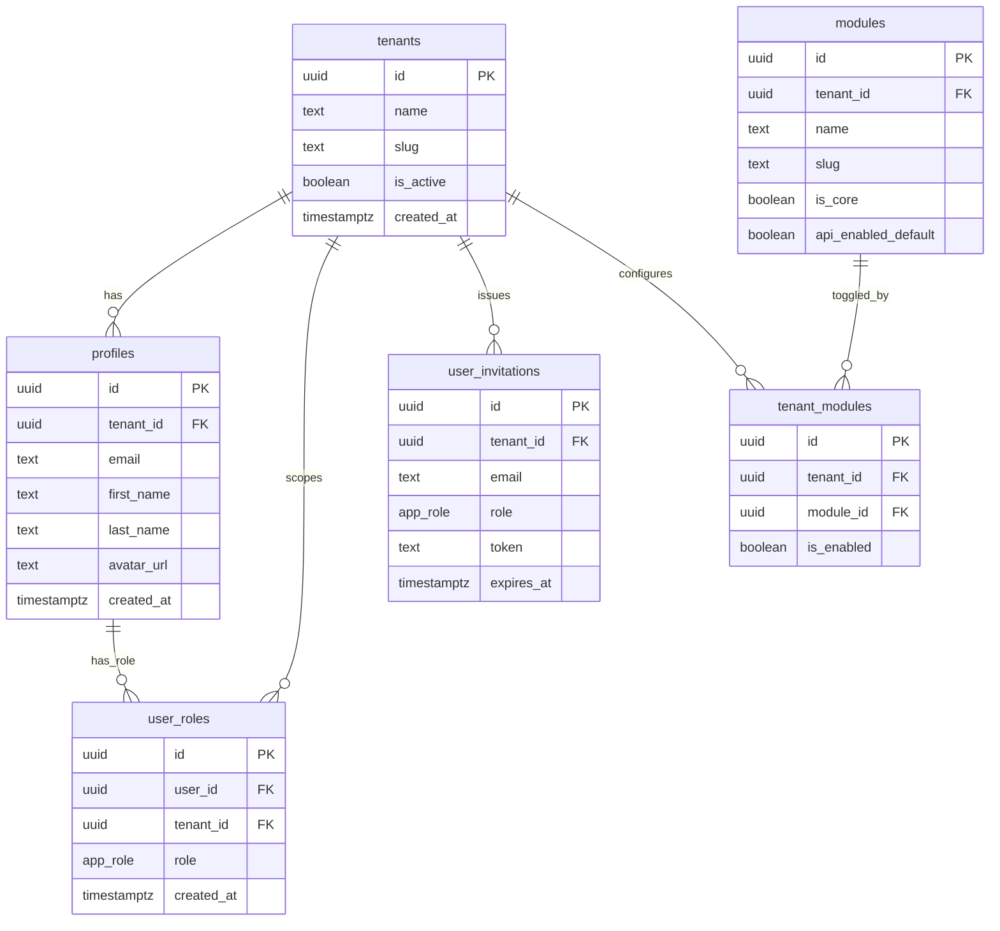
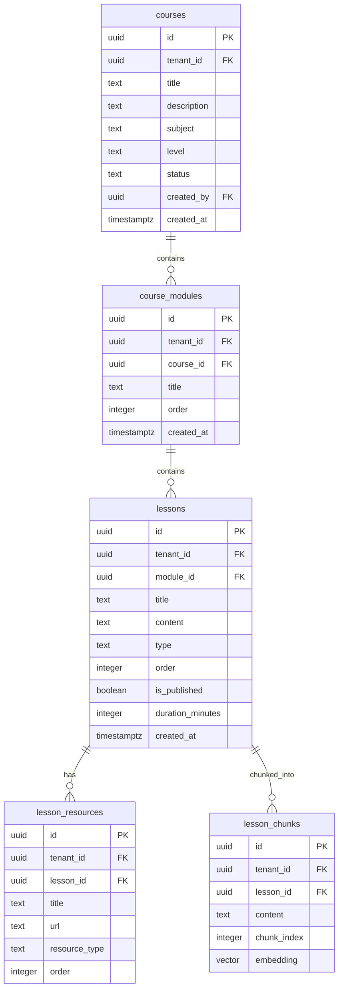
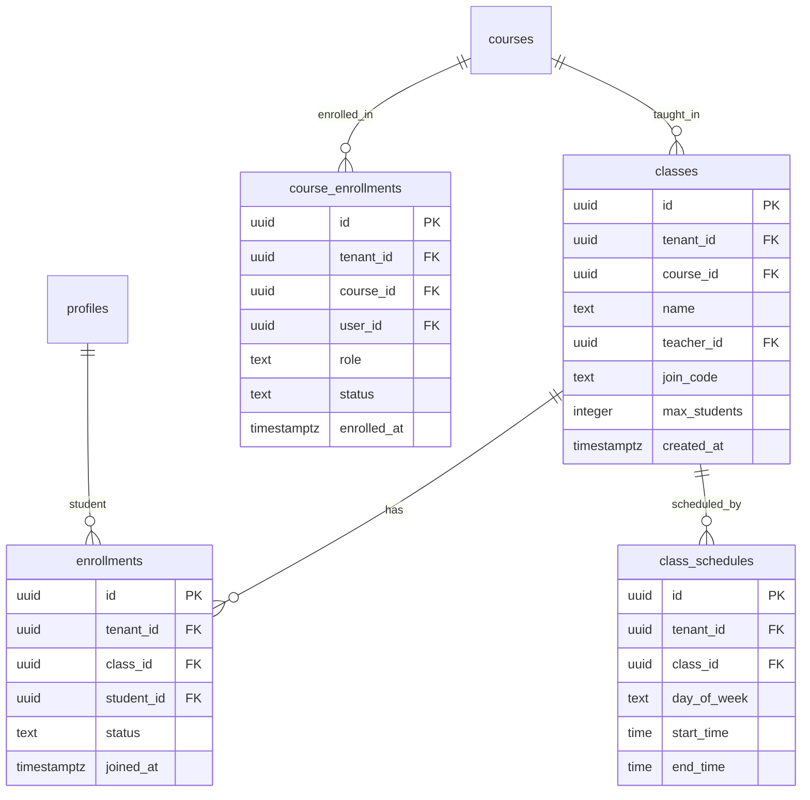
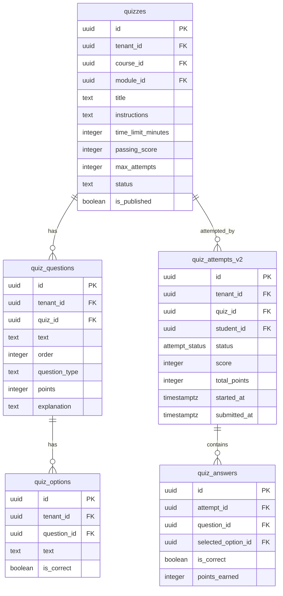
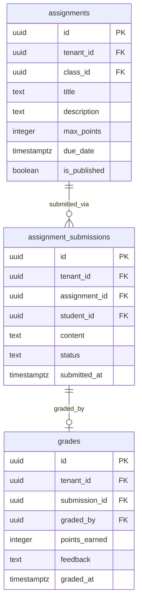
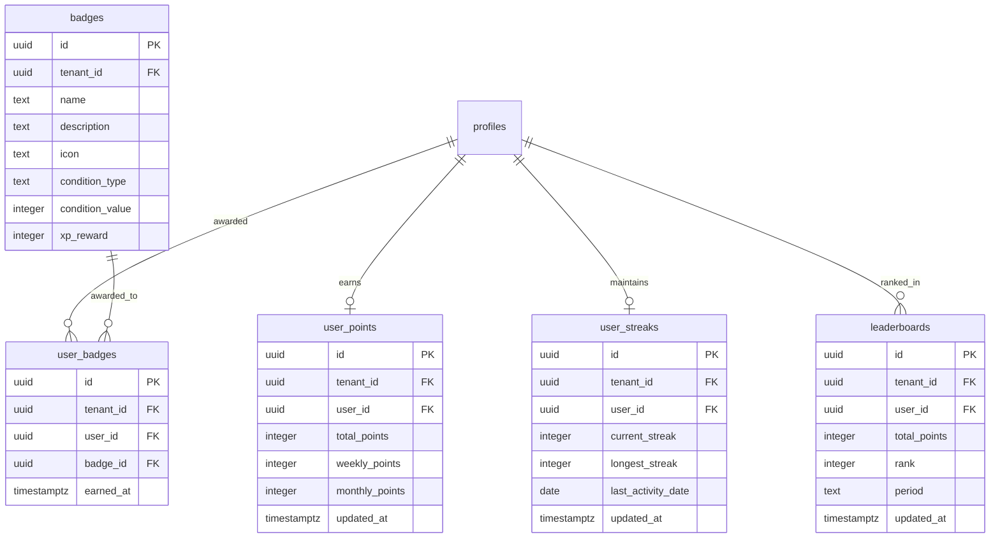
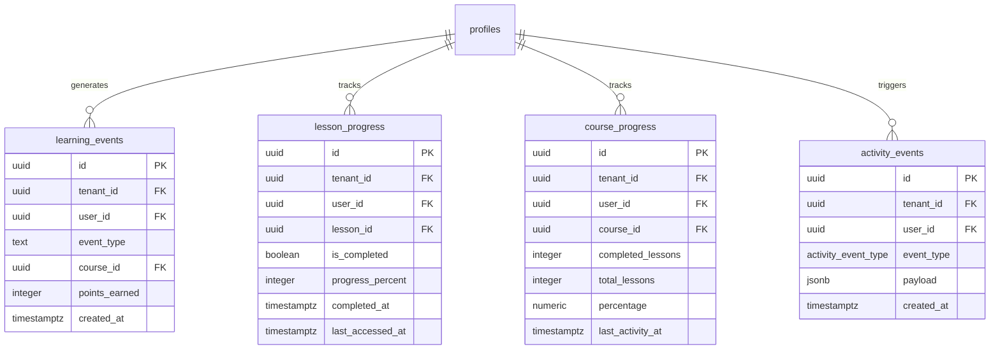
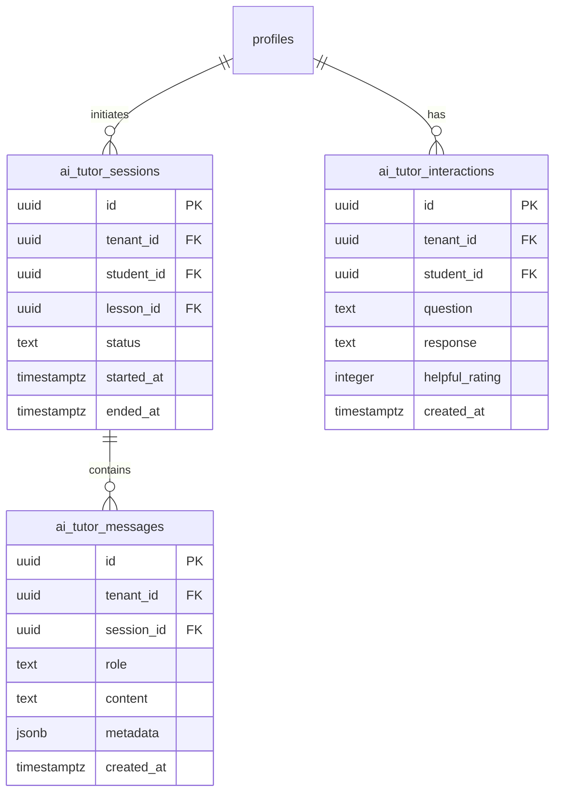

# EduSync LMS — Schema ERD

This document shows the core entity relationships for the EduSync LMS database.

The schema contains **84 tables** across 8 functional domains. All tenant-scoped tables include a `tenant_id` column enforced by Row Level Security.

> Generated from `supabase/migrations/000_baseline.sql` (consolidated from migrations 001–840).

---

## Core Domain Map

```
Identity & Tenancy      → tenants, profiles, user_roles, user_invitations
Academic Structure      → courses, course_modules, lessons, lesson_resources, lesson_chunks
Classroom & Enrollment  → classes, enrollments, course_enrollments, class_schedules
Assessment              → quizzes, quiz_questions, quiz_options, quiz_attempts_v2, quiz_answers
Assignments             → assignments, assignment_submissions, grades
Gamification            → user_points, user_streaks, badges, user_badges, leaderboards
Analytics & Events      → learning_events, activity_events, lesson_progress, course_progress
AI & Communication      → ai_tutor_sessions, ai_tutor_messages, announcements, notifications
```

---

## Entity Relationship Diagram

### Identity & Tenancy



### Academic Structure



### Classroom & Enrollment



### Assessment — Quizzes



### Assignments & Grades



### Gamification



### Analytics & Progress



### AI Tutor



---

## Cross-domain FK Summary

| Table           | Most Referenced By                                     |
| --------------- | ------------------------------------------------------ |
| `tenants`       | 58 FK references — all tenant-scoped tables            |
| `profiles`      | 28 FK references — user context everywhere             |
| `courses`       | 17 FK references — modules, classes, progress          |
| `classes`       | 11 FK references — enrollments, assignments, schedules |
| `lessons`       | 10 FK references — resources, chunks, progress         |
| `quizzes`       | 7 FK references — questions, attempts, assignments     |
| `question_bank` | 5 FK references — options, tags, usage                 |

---

## Table Inventory (all 84 tables)

| Domain        | Tables                                                                                                                                                                                                                                                                                                                                                                                                                                                                                                                       |
| ------------- | ---------------------------------------------------------------------------------------------------------------------------------------------------------------------------------------------------------------------------------------------------------------------------------------------------------------------------------------------------------------------------------------------------------------------------------------------------------------------------------------------------------------------------- |
| Identity      | `tenants`, `profiles`, `user_roles`, `user_invitations`, `modules`, `tenant_modules`                                                                                                                                                                                                                                                                                                                                                                                                                                         |
| Academic      | `courses`, `course_modules`, `lessons`, `lesson_resources`, `lesson_chunks`                                                                                                                                                                                                                                                                                                                                                                                                                                                  |
| Classroom     | `classes`, `enrollments`, `course_enrollments`, `class_schedules`, `course_classes`                                                                                                                                                                                                                                                                                                                                                                                                                                          |
| Assessment    | `quizzes`, `quiz_questions`, `quiz_options`, `quiz_attempts_v2`, `quiz_answers`, `quiz_attempt_questions_v2`, `quiz_assignments`, `quiz_submission_queue`, `quiz_cheating_events`, `quiz_attempt_telemetry`, `quiz_stats`, `quiz_answer_history`, `quiz_attempts_v2_2026_03`, `quiz_attempts_v2_2026_04`, `quiz_attempts_v2_2026_07`, `quiz_attempts_v2_2026_10`, `quiz_attempts_v2_historic`, `quiz_a_q_v2_2026_03`, `quiz_a_q_v2_2026_04`, `quiz_a_q_v2_historic`, `quiz_attempts_legacy`, `quiz_attempt_questions_legacy` |
| Question Bank | `question_bank`, `question_options`, `question_tags`, `question_stats`, `question_bank_usage`                                                                                                                                                                                                                                                                                                                                                                                                                                |
| Assignments   | `assignments`, `assignment_submissions`, `grades`                                                                                                                                                                                                                                                                                                                                                                                                                                                                            |
| Gamification  | `user_points`, `user_streaks`, `badges`, `user_badges`, `leaderboards`, `leaderboards_weekly`                                                                                                                                                                                                                                                                                                                                                                                                                                |
| Analytics     | `learning_events`, `activity_events`, `activity_logs`, `lesson_progress`, `course_progress`, `course_stats`, `course_insights`, `analytics_metrics`, `analytics_audit`, `analytics_rate_limits`, `analytics_circuit_breaker`, `student_concept_mastery`, `recommendations`                                                                                                                                                                                                                                                   |
| Attendance    | `attendance_records`                                                                                                                                                                                                                                                                                                                                                                                                                                                                                                         |
| Discussions   | `discussions`                                                                                                                                                                                                                                                                                                                                                                                                                                                                                                                |
| Announcements | `announcements`, `class_announcements`, `announcement_rsvps`                                                                                                                                                                                                                                                                                                                                                                                                                                                                 |
| Notifications | `notifications`                                                                                                                                                                                                                                                                                                                                                                                                                                                                                                              |
| AI Tutor      | `ai_tutor_sessions`, `ai_tutor_messages`, `ai_tutor_interactions`, `ai_tutor_feedback`, `ai_tutor_cache`, `ai_tutor_rate_limits`, `ai_generation_metadata`                                                                                                                                                                                                                                                                                                                                                                   |
| Billing       | `invoices`, `payments`                                                                                                                                                                                                                                                                                                                                                                                                                                                                                                       |
| Admin         | `admin_audit_logs`                                                                                                                                                                                                                                                                                                                                                                                                                                                                                                           |

<!-- Phase 5 Feature Cross-Reference -->

## Feature Module Cross-Reference

EduSync LMS terdiri dari 24 feature module yang saling terintegrasi:

| Feature         | Domain         | Deskripsi                                                                                                                  |
| --------------- | -------------- | -------------------------------------------------------------------------------------------------------------------------- |
| administration  | Admin          | Administrasi — Manajemen tenant, konfigurasi modul sekolah, sinkronisasi data                                              |
| ai-tutor        | Learning       | AI Tutor — Asisten belajar berbasis AI yang memberikan penjelasan personal kepada siswa                                    |
| analytics       | Analytics      | Analitik — Dashboard analitik komprehensif untuk guru dan admin                                                            |
| announcements   | Communication  | Pengumuman — Sistem pengumuman sekolah                                                                                     |
| assignments     | Assessment     | Tugas — Manajemen tugas dari pembuatan hingga penilaian                                                                    |
| calendar        | Academic       | Kalender — Kalender akademik terintegrasi dengan jadwal pelajaran, ujian, deadline tugas, dan kegiatan sekolah             |
| classroom       | Academic       | Kelas — Manajemen kelas virtual dan fisik                                                                                  |
| courses         | Academic       | Kursus — Core learning module                                                                                              |
| dashboards      | Analytics      | Dashboard — Dashboard kustom dengan widget builder                                                                         |
| discussions     | Communication  | Diskusi — Forum diskusi per kursus                                                                                         |
| gamification    | Engagement     | Gamifikasi — Sistem gamifikasi lengkap: XP, badge, level, streak counter, dan leaderboard                                  |
| gradebook       | Assessment     | Buku Nilai — Buku nilai digital untuk guru                                                                                 |
| guidance        | Admin          | Panduan — Sistem panduan in-app (tooltip, walkthrough, banner, checkpoint)                                                 |
| lessons         | Learning       | Pelajaran — Konten pelajaran dengan block-based editor                                                                     |
| moderation      | Admin          | Moderasi — Moderasi konten user-generated (diskusi, komentar)                                                              |
| notifications   | Communication  | Notifikasi — Sistem notifikasi real-time dengan bell icon dan panel                                                        |
| onboarding      | Admin          | Onboarding — Wizard onboarding untuk pengguna baru                                                                         |
| progress        | Learning       | Kemajuan Belajar — Tracking progress belajar siswa secara granular per kursus, modul, dan pelajaran                        |
| question-bank   | Assessment     | Bank Soal — Repositori soal yang bisa digunakan ulang di berbagai kuis                                                     |
| quizzes         | Assessment     | Kuis — Sistem kuis komprehensif dengan timer, anti-cheat, autosave, review mode, dan analitik hasil per soal               |
| recommendations | Learning       | Rekomendasi — Engine rekomendasi konten berdasarkan progress, performa, dan pola belajar siswa                             |
| reports         | Analytics      | Laporan — Generator laporan akademik, keuangan (SPP), PPDB, dan custom                                                     |
| storage         | Infrastructure | Penyimpanan — Manajemen file dan media untuk materi pembelajaran                                                           |
| struggle        | Analytics      | Deteksi Kesulitan — Deteksi otomatis siswa yang kesulitan berdasarkan pola belajar, waktu per soal, dan penurunan performa |

Setiap feature module mengikuti arsitektur standar dengan folder: api/, queries/, hooks/, types/, components/, dan **tests**/. Semua feature mendukung dark mode dan skeleton loading screens.
