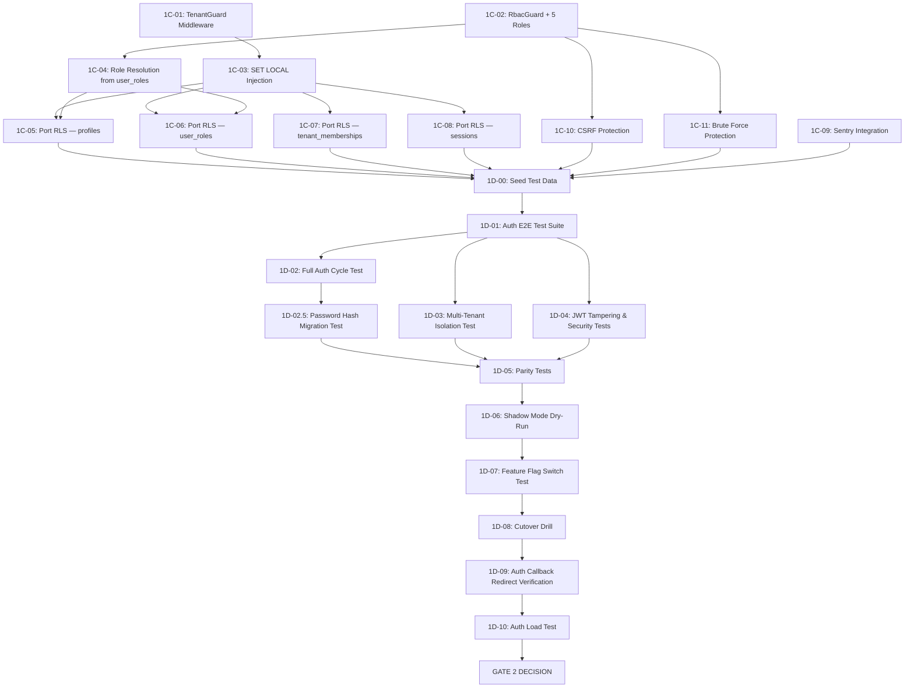

# Agent Task Queue — Phase 1C-1D

<aside>
🛡️

**Phase 1C-1D: Tenant & RBAC Middleware + Auth Verification.**

Semua task di halaman ini adalah **self-contained work packets** untuk AI coding agents / CLI executors.

Source of truth: Main Plan, Spec 1, Spec 3, Spec 4, Bootstrap Context, Gap Analysis.

**Target: full migration via multi-agent execution — JANGAN turunkan scope.**

</aside>

---

## Dependency Graph



---

## Prerequisite Checklist

- [ ] Phase 1A (VIL scaffold, Docker Compose, health check) — **DONE**
- [ ] Phase 1B (JWT, password hashing, login/register/OAuth/MFA endpoints) — **DONE**
- [ ] `edusync-api/crates/auth/src/jwt.rs` — JWT `Claims` struct exists with `sub`, `email`, `roles`, `tenant_id`, `exp`, `iat`
- [ ] `edusync-api/crates/api-server/src/auth/` — all auth endpoints compiled and tested
- [ ] PostgreSQL connected (same DB as Supabase)
- [ ] 3 dev accounts exist: `teacher@edusync.dev`, `student@edusync.dev`, `admin@edusync.dev`
- [ ] CORS middleware configured (`crates/middleware/src/cors.rs` — from Phase 1A Week 12-13)
- [ ] Password reset endpoints implemented (Spec 4 §2 — `POST /api/v1/auth/reset-password`, `POST /api/v1/auth/update-password`)

<aside>
📝

**Source of Truth:** **6 Execution Contracts** di [Full Migration EduSync LMS: Supabase → VIL Backend — Plan & Strategi](../Full%20Migration%20EduSync%20LMS%20Supabase%20%E2%86%92%20VIL%20Backend%20%20ace54d0159584b0c8330eaad52e6e05b.md). Contract 2 (Auth Side-Effects) + Contract 6 (Cutover Rehearsal) berlaku penuh untuk Phase 1C-1D. Gate 2 decision point menggunakan Contract 2 sebagai pass/fail checklist.

</aside>

<aside>
🛠️

**🛠️ Systemic Gap Fixes Applied to Phase 1C-1D:**

- **Gap #2 (DB schema):** Task 1C-05 `parent_student_links` — STOP IF table doesn't exist. Run `\dt *parent*` di psql sebelum coding.
- **Gap #5 (Nginx):** Middleware endpoints tidak perlu Nginx update (internal), tapi jika ada public endpoint baru → HARUS update `nginx.conf`.
- **Gap #9 (Rollback):** Commit SEBELUM mulai task: `git add -A && git commit -m "checkpoint: before task 1C/D-XX"`. Jika verify gagal: `git stash`. JANGAN lanjut dengan state setengah jadi.
- **Gap #2 (Schema ambiguity):** `discussion_comments` vs `discussion_posts` — Task 1C-05 dan 1D-03 WAJIB run `\dt *discussion*` di psql dan gunakan nama tabel aktual.
</aside>

---

# Phase 1C — Tenant & RBAC Middleware

---

## TASK 1C-01: TenantGuard Middleware

```
TASK ID:       1C-01
OWNER TYPE:    Rust backend agent
GOAL:          Implement TenantGuard middleware that extracts tenant_id from JWT
               claims, injects into request extensions, and rejects requests
               with missing/invalid tenant_id. Replaces Supabase's
               get_my_tenant_id() SQL function + auto_set_tenant_id() trigger.

READ FIRST:
  - Spec 1 §1.2 (Tenant & Role Resolution fields)
  - Spec 1 §6 (Tenant Switching Contract)
  - Spec 4 §4 (VIL Multi-Tenancy NOT Open-Source — all tenant isolation is custom)
  - Bootstrap Context §4 (VIL JwtAuth built-in)
  - Gap Analysis §5 (Tenant switching via localStorage)
  - Main Plan Phase 1C (TenantGuard replaces get_my_tenant_id + auto_set_tenant_id)

EDIT ONLY:
  - edusync-api/crates/middleware/src/tenant.rs         (CREATE)
  - edusync-api/crates/middleware/src/mod.rs             (ADD pub mod tenant)
  - edusync-api/crates/api-server/src/main.rs            (APPLY middleware layer)

DO NOT TOUCH:
  - edusync-api/crates/auth/src/jwt.rs
  - edusync-api/crates/auth/src/password.rs
  - supabase/ (anything)
  - src/ (frontend)

IMPLEMENTATION STEPS:
  1. Create TenantId newtype: pub struct TenantId(pub Uuid);
  2. Create TenantGuard middleware struct.
  3. In middleware handle():
     a. Extract Claims from request extensions (JWT already decoded by JwtAuth layer).
     b. Parse claims.tenant_id as Uuid → if invalid, return 403 with
        { code: "tenant_mismatch", message: "Tenant ID tidak valid", details: null, hint: null }.
     c. Validate tenant_id exists in DB: SELECT id FROM tenants WHERE id = $1 AND is_active = true.
     d. Insert TenantId(uuid) into request extensions.
     e. Call next handler.
  4. Create extractor: impl<S> FromRequestParts<S> for TenantId.
  5. Apply TenantGuard as layer AFTER JwtAuth on all protected ServiceProcess.
  6. Add unit test: valid tenant → passes, missing tenant → 403, inactive tenant → 403.

COPY-PASTE STARTER:
```

```rust
// edusync-api/crates/middleware/src/tenant.rs
use axum::{
    extract::{FromRequestParts, State},
    http::{request::Parts, StatusCode},
    middleware::Next,
    response::{IntoResponse, Response},
    Json,
};
use serde_json::json;
use sqlx::PgPool;
use uuid::Uuid;

/// Newtype for tenant ID — injected into request extensions by TenantGuard.
#[derive(Clone, Debug)]
pub struct TenantId(pub Uuid);

/// Extracts tenant_id from JWT claims, validates against DB, injects into extensions.
/// Replaces Supabase get_my_tenant_id() + auto_set_tenant_id().
pub async fn tenant_guard(
    State(db): State<PgPool>,
    mut req: axum::http::Request<axum::body::Body>,
    next: Next,
) -> Result<Response, Response> {
    // 1. Extract claims (set by JwtAuth layer)
    let claims = req
        .extensions()
        .get::<crate::auth::jwt::Claims>()
        .cloned()
        .ok_or_else(|| {
            (StatusCode::UNAUTHORIZED, Json(json!({
                "code": "unauthorized",
                "message": "Token tidak valid",
                "details": null,
                "hint": null
            }))).into_response()
        })?;

    // 2. Parse tenant_id from claims
    let tenant_id = Uuid::parse_str(&claims.tenant_id).map_err(|_| {
        (StatusCode::FORBIDDEN, Json(json!({
            "code": "tenant_mismatch",
            "message": "Tenant ID tidak valid",
            "details": null,
            "hint": null
        }))).into_response()
    })?;

    // 3. Validate tenant exists and is active
    let tenant_exists: bool = sqlx::query_scalar(
        "SELECT EXISTS(SELECT 1 FROM tenants WHERE id = $1 AND is_active = true)"
    )
    .bind(tenant_id)
    .fetch_one(&db)
    .await
    .unwrap_or(false);

    if !tenant_exists {
        return Err((StatusCode::FORBIDDEN, Json(json!({
            "code": "tenant_mismatch",
            "message": "Anda tidak memiliki akses ke tenant ini",
            "details": null,
            "hint": null
        }))).into_response());
    }

    // 4. Inject TenantId into request extensions
    req.extensions_mut().insert(TenantId(tenant_id));

    Ok(next.run(req).await)
}

/// Extractor — use in handlers: async fn handler(tenant: TenantId) -> ...
impl<S: Send + Sync> FromRequestParts<S> for TenantId {
    type Rejection = (StatusCode, Json<serde_json::Value>);

    async fn from_request_parts(parts: &mut Parts, _state: &S) -> Result<Self, Self::Rejection> {
        parts
            .extensions
            .get::<TenantId>()
            .cloned()
            .ok_or_else(|| (
                StatusCode::INTERNAL_SERVER_ERROR,
                Json(json!({
                    "code": "internal_error",
                    "message": "Tenant context tidak tersedia",
                    "details": null,
                    "hint": null
                }))
            ))
    }
}
```

```
VERIFY:
  cargo check --all-targets
  cargo test -p middleware -- tenant
  # Manual: curl with valid JWT → 200, curl with bad tenant_id → 403

STOP IF:
  - Claims struct does not have tenant_id field → BLOCKED (Phase 1B incomplete)
  - tenants table does not exist in DB → BLOCKED (schema missing)
  - JwtAuth layer not applied → BLOCKED (Phase 1B incomplete)
  - More than 3 files need editing → ESCALATE

OUTPUT FORMAT: DONE / BLOCKED / FILES / VERIFY
```

---

## TASK 1C-02: RbacGuard Middleware + 5 EduSync Roles

```
TASK ID:       1C-02
OWNER TYPE:    Rust backend agent
GOAL:          Configure VIL built-in RbacPolicy with 5 EduSync roles
               (admin, principal, teacher, student, parent) and wildcard
               permissions. Create RbacGuard middleware that checks
               user roles from JWT claims against required permissions.

READ FIRST:
  - Bootstrap Context §4 (VIL RBAC built-in: RbacPolicy, Role)
  - Phase 1 Detail Week 18 (RbacGuard section)
  - Main Plan Phase 1C (5 roles, wildcard permissions)
  - Gap Analysis §7 (AuthContextType — roles come from user_roles table)

EDIT ONLY:
  - edusync-api/crates/middleware/src/rbac.rs           (CREATE)
  - edusync-api/crates/middleware/src/mod.rs             (ADD pub mod rbac)

DO NOT TOUCH:
  - edusync-api/crates/middleware/src/tenant.rs (from 1C-01)
  - edusync-api/crates/auth/
  - supabase/
  - src/ (frontend)

IMPLEMENTATION STEPS:
  1. Import VIL RbacPolicy + Role from vil_server::auth::rbac.
  2. Define 5 roles with wildcard permissions:
     - admin:     courses:*, users:*, analytics:*, settings:*, quizzes:*,
                  gradebook:*, attendance:*, reports:*, surveys:*
     - principal: analytics:*, reports:*, surveys:*, courses:read,
                  users:read, attendance:read
     - teacher:   courses:*, quizzes:*, gradebook:*, attendance:*,
                  analytics:read, assignments:*, lessons:*, discussions:*,
                  notifications:*, question-bank:*
     - student:   courses:read, quizzes:submit, quizzes:read, progress:read,
                  assignments:submit, assignments:read, lessons:read,
                  discussions:read, discussions:write, notifications:read,
                  gamification:read
     - parent:    progress:read, messages:*, attendance:read, grades:read,
                  notifications:read
  3. Create require_permission(permission: &str) middleware function.
  4. In middleware:
     a. Extract Claims from extensions.
     b. Check policy.check_permission(&claims.roles, permission).
     c. If denied → 403 { code: "forbidden", message: "Anda tidak memiliki izin" }.
  5. Create require_any_role(roles: &[&str]) middleware function for
     simple role-gate checks.
  6. Export lazy_static RBAC_POLICY for global access.
  7. Unit tests: admin can courses:write, student cannot courses:write,
     teacher can quizzes:*, wildcard matches sub-permissions.

COPY-PASTE STARTER:
```

```rust
// edusync-api/crates/middleware/src/rbac.rs
use vil_server::auth::rbac::{RbacPolicy, Role};
use axum::{
    http::StatusCode,
    response::{IntoResponse, Response},
    middleware::Next,
    Json,
};
use serde_json::json;
use std::sync::LazyLock;

/// Global RBAC policy — 5 EduSync roles with wildcard permissions.
pub static RBAC_POLICY: LazyLock<RbacPolicy> = LazyLock::new(|| {
    let mut policy = RbacPolicy::new();

    policy.add_role(Role::new("admin")
        .permission("courses:*")
        .permission("users:*")
        .permission("analytics:*")
        .permission("settings:*")
        .permission("quizzes:*")
        .permission("gradebook:*")
        .permission("attendance:*")
        .permission("reports:*")
        .permission("surveys:*")
        .permission("assignments:*")
        .permission("lessons:*")
        .permission("discussions:*")
        .permission("notifications:*")
        .permission("question-bank:*")
        .permission("gamification:*")
        .permission("certificates:*")
        .permission("finance:*")
        .permission("onboarding:*")
    );

    policy.add_role(Role::new("principal")
        .permission("analytics:*")
        .permission("reports:*")
        .permission("surveys:*")
        .permission("courses:read")
        .permission("users:read")
        .permission("attendance:read")
        .permission("gradebook:read")
        .permission("notifications:read")
    );

    policy.add_role(Role::new("teacher")
        .permission("courses:*")
        .permission("quizzes:*")
        .permission("gradebook:*")
        .permission("attendance:*")
        .permission("analytics:read")
        .permission("assignments:*")
        .permission("lessons:*")
        .permission("discussions:*")
        .permission("notifications:*")
        .permission("question-bank:*")
        .permission("certificates:read")
    );

    policy.add_role(Role::new("student")
        .permission("courses:read")
        .permission("quizzes:submit")
        .permission("quizzes:read")
        .permission("progress:read")
        .permission("assignments:submit")
        .permission("assignments:read")
        .permission("lessons:read")
        .permission("discussions:read")
        .permission("discussions:write")
        .permission("notifications:read")
        .permission("gamification:read")
        .permission("certificates:read")
    );

    policy.add_role(Role::new("parent")
        .permission("progress:read")
        .permission("messages:*")
        .permission("attendance:read")
        .permission("grades:read")
        .permission("notifications:read")
    );

    policy
});

/// Middleware factory — checks if user's roles have required permission.
pub fn require_permission(
    permission: &'static str,
) -> impl Fn(
    axum::http::Request<axum::body::Body>,
    Next,
) -> std::pin::Pin<Box<dyn std::future::Future<Output = Result<Response, Response>> + Send>>
       + Clone
       + Send {
    move |req: axum::http::Request<axum::body::Body>, next: Next| {
        Box::pin(async move {
            let claims = req
                .extensions()
                .get::<crate::auth::jwt::Claims>()
                .cloned()
                .ok_or_else(|| {
                    (StatusCode::UNAUTHORIZED, Json(json!({
                        "code": "unauthorized",
                        "message": "Token tidak valid",
                        "details": null,
                        "hint": null
                    }))).into_response()
                })?;

            let roles_refs: Vec<&str> = claims.roles.iter().map(|s| s.as_str()).collect();
            if !RBAC_POLICY.check_permission(&roles_refs, permission) {
                return Err((StatusCode::FORBIDDEN, Json(json!({
                    "code": "forbidden",
                    "message": "Anda tidak memiliki izin untuk aksi ini",
                    "details": null,
                    "hint": format!("Required permission: {}", permission)
                }))).into_response());
            }

            Ok(next.run(req).await)
        })
    }
}

/// Simple role gate — checks if user has ANY of the specified roles.
pub fn require_any_role(
    allowed_roles: &'static [&'static str],
) -> impl Fn(
    axum::http::Request<axum::body::Body>,
    Next,
) -> std::pin::Pin<Box<dyn std::future::Future<Output = Result<Response, Response>> + Send>>
       + Clone
       + Send {
    move |req, next| {
        Box::pin(async move {
            let claims = req
                .extensions()
                .get::<crate::auth::jwt::Claims>()
                .cloned()
                .ok_or_else(|| {
                    (StatusCode::UNAUTHORIZED, Json(json!({
                        "code": "unauthorized",
                        "message": "Token tidak valid",
                        "details": null,
                        "hint": null
                    }))).into_response()
                })?;

            let has_role = claims.roles.iter().any(|r| allowed_roles.contains(&r.as_str()));
            if !has_role {
                return Err((StatusCode::FORBIDDEN, Json(json!({
                    "code": "forbidden",
                    "message": "Role Anda tidak memiliki akses",
                    "details": null,
                    "hint": format!("Required roles: {:?}", allowed_roles)
                }))).into_response());
            }

            Ok(next.run(req).await)
        })
    }
}

#[cfg(test)]
mod tests {
    use super::*;

    #[test]
    fn test_admin_has_all_permissions() {
        assert!(RBAC_POLICY.check_permission(&["admin"], "courses:read"));
        assert!(RBAC_POLICY.check_permission(&["admin"], "courses:write"));
        assert!(RBAC_POLICY.check_permission(&["admin"], "users:delete"));
    }

    #[test]
    fn test_student_limited_permissions() {
        assert!(RBAC_POLICY.check_permission(&["student"], "courses:read"));
        assert!(!RBAC_POLICY.check_permission(&["student"], "courses:write"));
        assert!(!RBAC_POLICY.check_permission(&["student"], "users:read"));
        assert!(RBAC_POLICY.check_permission(&["student"], "quizzes:submit"));
    }

    #[test]
    fn test_teacher_wildcard() {
        assert!(RBAC_POLICY.check_permission(&["teacher"], "courses:read"));
        assert!(RBAC_POLICY.check_permission(&["teacher"], "courses:write"));
        assert!(RBAC_POLICY.check_permission(&["teacher"], "courses:delete"));
        assert!(!RBAC_POLICY.check_permission(&["teacher"], "settings:write"));
    }

    #[test]
    fn test_parent_restricted() {
        assert!(RBAC_POLICY.check_permission(&["parent"], "progress:read"));
        assert!(RBAC_POLICY.check_permission(&["parent"], "messages:send"));
        assert!(!RBAC_POLICY.check_permission(&["parent"], "courses:write"));
    }

    #[test]
    fn test_principal_analytics() {
        assert!(RBAC_POLICY.check_permission(&["principal"], "analytics:read"));
        assert!(RBAC_POLICY.check_permission(&["principal"], "analytics:export"));
        assert!(!RBAC_POLICY.check_permission(&["principal"], "courses:write"));
    }
}
```

```
VERIFY:
  cargo check --all-targets
  cargo test -p middleware -- rbac
  # All 5 test cases pass

STOP IF:
  - vil_server::auth::rbac module does not exist → BLOCKED (check VIL version)
  - RbacPolicy API differs from Bootstrap Context §4 → BLOCKED (adapt to actual API)
  - Claims struct does not have roles: Vec<String> → BLOCKED (Phase 1B incomplete)

OUTPUT FORMAT: DONE / BLOCKED / FILES / VERIFY
```

---

## TASK 1C-03: SET LOCAL Injection for SQL Context

```
TASK ID:       1C-03
OWNER TYPE:    Rust backend agent
GOAL:          Create middleware that runs SET LOCAL app.current_user_id and
               SET LOCAL app.current_tenant_id on every DB request.
               This replaces Supabase auth.uid() and get_my_tenant_id() for
               stored procedures and RLS policies that reference auth context.
               Per Spec 4 §3: auth.* SQL functions must be replaced.

READ FIRST:
  - Spec 4 §3 (Supabase auth.* SQL Functions Migration)
  - Main Plan Phase 1C (TenantGuard replaces get_my_tenant_id)
  - Bootstrap Context §5 (sqlx query patterns)

DEPENDENCY: 1C-01 (TenantGuard — provides TenantId in extensions)

EDIT ONLY:
  - edusync-api/crates/middleware/src/db_context.rs     (CREATE)
  - edusync-api/crates/middleware/src/mod.rs             (ADD pub mod db_context)

DO NOT TOUCH:
  - supabase/migrations/ (do NOT alter existing SQL yet)
  - edusync-api/crates/auth/
  - src/ (frontend)

IMPLEMENTATION STEPS:
  1. Create helper function set_request_context(pool, user_id, tenant_id)
     that acquires a connection and runs:
       SET LOCAL app.current_user_id = '<uuid>';
       SET LOCAL app.current_tenant_id = '<uuid>';
  2. Create SQL replacement functions in public schema (migration):
       CREATE OR REPLACE FUNCTION current_user_id() RETURNS UUID AS $$
         SELECT current_setting('app.current_user_id')::UUID;
       $$ LANGUAGE SQL STABLE;
       CREATE OR REPLACE FUNCTION current_tenant_id() RETURNS UUID AS $$
         SELECT current_setting('app.current_tenant_id')::UUID;
       $$ LANGUAGE SQL STABLE;
  3. Create a RequestScoped DB wrapper that auto-sets context per query.
  4. Unit test: SET LOCAL values visible within same transaction,
     not visible in separate connection.

COPY-PASTE STARTER:
```

```rust
// edusync-api/crates/middleware/src/db_context.rs
use sqlx::{PgPool, Postgres, Transaction};
use uuid::Uuid;

/// Sets per-request SQL context variables.
/// Stored procedures can call current_user_id() / current_tenant_id()
/// instead of Supabase's auth.uid() / get_my_tenant_id().
pub async fn set_request_context(
    tx: &mut Transaction<'_, Postgres>,
    user_id: &Uuid,
    tenant_id: &Uuid,
) -> Result<(), sqlx::Error> {
    sqlx::query(&format!(
        "SET LOCAL app.current_user_id = '{}'; SET LOCAL app.current_tenant_id = '{}';",
        user_id, tenant_id
    ))
    .execute(&mut **tx)
    .await?;
    Ok(())
}

/// Convenience: begin transaction with context already set.
pub async fn begin_with_context(
    pool: &PgPool,
    user_id: &Uuid,
    tenant_id: &Uuid,
) -> Result<Transaction<'_, Postgres>, sqlx::Error> {
    let mut tx = pool.begin().await?;
    set_request_context(&mut tx, user_id, tenant_id).await?;
    Ok(tx)
}

#[cfg(test)]
mod tests {
    use super::*;
    use sqlx::Row;

    #[sqlx::test]
    async fn test_set_local_visible_in_transaction(pool: PgPool) {
        let user_id = Uuid::new_v4();
        let tenant_id = Uuid::new_v4();

        let mut tx = begin_with_context(&pool, &user_id, &tenant_id).await.unwrap();

        let row = sqlx::query("SELECT current_setting('app.current_user_id') as uid")
            .fetch_one(&mut *tx)
            .await
            .unwrap();
        let uid: String = row.get("uid");
        assert_eq!(uid, user_id.to_string());

        tx.rollback().await.unwrap();
    }

    #[sqlx::test]
    async fn test_set_local_not_visible_outside_transaction(pool: PgPool) {
        let user_id = Uuid::new_v4();
        let tenant_id = Uuid::new_v4();

        let mut tx = begin_with_context(&pool, &user_id, &tenant_id).await.unwrap();
        tx.commit().await.unwrap();

        // Outside transaction — should fail or return empty
        let result = sqlx::query("SELECT current_setting('app.current_user_id', true) as uid")
            .fetch_one(&pool)
            .await
            .unwrap();
        let uid: Option<String> = result.get("uid");
        assert!(uid.is_none() || uid.unwrap().is_empty());
    }
}
```

```sql
-- Migration: edusync-api/migrations/001_public_auth_functions.sql
-- Replacement for Supabase auth.uid() and get_my_tenant_id()
-- Per Spec 4 §3

CREATE OR REPLACE FUNCTION public.current_user_id()
RETURNS UUID AS $$
  SELECT current_setting('app.current_user_id')::UUID;
$$ LANGUAGE SQL STABLE;

CREATE OR REPLACE FUNCTION public.current_tenant_id()
RETURNS UUID AS $$
  SELECT current_setting('app.current_tenant_id')::UUID;
$$ LANGUAGE SQL STABLE;
```

```
VERIFY:
  cargo check --all-targets
  cargo test -p middleware -- db_context
  # Apply migration: sqlx migrate run
  # Test: SELECT current_user_id() inside transaction with SET LOCAL

STOP IF:
  - PgPool not available in test environment → BLOCKED
  - SET LOCAL syntax not supported by sqlx → BLOCKED (use raw query)
  - More than 4 files need editing → ESCALATE

OUTPUT FORMAT: DONE / BLOCKED / FILES / VERIFY
```

---

## TASK 1C-04: Role Resolution from user_roles Table

```
TASK ID:       1C-04
OWNER TYPE:    Rust backend agent
GOAL:          Implement role resolution that reads roles from user_roles table
               (NOT profiles.role). Used during JWT creation at login/refresh.
               Roles are per-tenant: a user may be teacher in tenant A and
               admin in tenant B.

READ FIRST:
  - Gap Analysis §1 (get_auth_bootstrap — roles from user_roles)
  - Gap Analysis §7 (AuthContextType — role, roles, activeRole)
  - Spec 1 §1.2 (Tenant & Role Resolution — CRITICAL: user_roles table)
  - Spec 1 §2 (get_auth_bootstrap RPC contract)
  - Main Plan Phase 1C (Role from user_roles table, NOT profiles.role)

DEPENDENCY: 1C-02 (RBAC_POLICY defined)

EDIT ONLY:
  - edusync-api/crates/auth/src/roles.rs                (CREATE)
  - edusync-api/crates/auth/src/mod.rs                   (ADD pub mod roles)
  - edusync-api/crates/models/src/user_role.rs           (CREATE)
  - edusync-api/crates/models/src/mod.rs                 (ADD pub mod user_role)

DO NOT TOUCH:
  - edusync-api/crates/auth/src/jwt.rs (Claims struct already defined)
  - edusync-api/crates/auth/src/password.rs
  - supabase/
  - src/ (frontend)

IMPLEMENTATION STEPS:
  1. Create UserRole model struct (sqlx::FromRow):
     { id, user_id, tenant_id, role, created_at }
     role is one of: 'student' | 'teacher' | 'admin' | 'parent' | 'principal'
  2. Create resolve_user_roles(pool, user_id, tenant_id) → Vec<String>
     Query: SELECT role FROM user_roles
            WHERE user_id = $1 AND tenant_id = $2
  3. Create resolve_all_memberships(pool, user_id) → Vec<Membership>
     Query: SELECT ur.tenant_id, ur.role, t.name as tenant_name,
                   t.logo_url as tenant_logo, t.slug as tenant_slug,
                   ur.created_at as joined_at
            FROM user_roles ur
            JOIN tenants t ON t.id = ur.tenant_id
            WHERE ur.user_id = $1 AND t.is_active = true
  4. Create get_primary_role(roles) → String
     Priority: admin > principal > teacher > parent > student
  5. Integrate into JWT creation: login/register handlers must call
     resolve_user_roles() to populate claims.roles.
  6. Unit test: user with teacher+admin roles in same tenant → both returned.
     user in 2 tenants → only roles for requested tenant.

COPY-PASTE STARTER:
```

```rust
// edusync-api/crates/auth/src/roles.rs
use sqlx::PgPool;
use uuid::Uuid;
use serde::{Serialize, Deserialize};

/// Role priority for getPrimaryRole() — matches frontend getPermissions()
const ROLE_PRIORITY: &[&str] = &["admin", "principal", "teacher", "parent", "student"];

#[derive(Debug, Serialize, Deserialize, sqlx::FromRow)]
pub struct UserRole {
    pub id: Uuid,
    pub user_id: Uuid,
    pub tenant_id: Uuid,
    pub role: String,
    pub created_at: chrono::DateTime<chrono::Utc>,
}

#[derive(Debug, Serialize, Deserialize)]
pub struct Membership {
    pub tenant_id: Uuid,
    pub tenant_name: String,
    pub tenant_logo: Option<String>,
    pub tenant_slug: String,
    pub role: String,
    pub status: String,
    pub is_active: bool,
    pub joined_at: chrono::DateTime<chrono::Utc>,
}

/// Resolve roles for a specific user+tenant pair.
/// CRITICAL: reads from user_roles table, NOT profiles.role.
pub async fn resolve_user_roles(
    pool: &PgPool,
    user_id: &Uuid,
    tenant_id: &Uuid,
) -> Result<Vec<String>, sqlx::Error> {
    let roles: Vec<(String,)> = sqlx::query_as(
        "SELECT role FROM user_roles WHERE user_id = $1 AND tenant_id = $2"
    )
    .bind(user_id)
    .bind(tenant_id)
    .fetch_all(pool)
    .await?;

    Ok(roles.into_iter().map(|r| r.0).collect())
}

/// Resolve all tenant memberships for bootstrap response.
/// Matches Spec 1 §2 get_auth_bootstrap response shape.
pub async fn resolve_all_memberships(
    pool: &PgPool,
    user_id: &Uuid,
) -> Result<Vec<Membership>, sqlx::Error> {
    let memberships = sqlx::query_as::<_, Membership>(
        r#"SELECT
            ur.tenant_id,
            t.name as tenant_name,
            t.logo_url as tenant_logo,
            t.slug as tenant_slug,
            ur.role,
            'active' as status,
            true as is_active,
            ur.created_at as joined_at
        FROM user_roles ur
        JOIN tenants t ON t.id = ur.tenant_id
        WHERE ur.user_id = $1 AND t.is_active = true
        ORDER BY ur.created_at ASC"#
    )
    .bind(user_id)
    .fetch_all(pool)
    .await?;

    Ok(memberships)
}

/// Get primary role — highest privilege wins.
/// Matches frontend getPrimaryRole() logic.
pub fn get_primary_role(roles: &[String]) -> String {
    for priority_role in ROLE_PRIORITY {
        if roles.iter().any(|r| r == priority_role) {
            return priority_role.to_string();
        }
    }
    "student".to_string() // fallback
}

#[cfg(test)]
mod tests {
    use super::*;

    #[test]
    fn test_primary_role_priority() {
        assert_eq!(get_primary_role(&["student".into(), "admin".into()]), "admin");
        assert_eq!(get_primary_role(&["teacher".into(), "parent".into()]), "teacher");
        assert_eq!(get_primary_role(&["student".into()]), "student");
        assert_eq!(get_primary_role(&[]), "student");
        assert_eq!(get_primary_role(&["principal".into(), "teacher".into()]), "principal");
    }
}
```

```
VERIFY:
  cargo check --all-targets
  cargo test -p auth -- roles
  # DB test: INSERT INTO user_roles → resolve_user_roles() returns correct roles

STOP IF:
  - user_roles table does not exist in DB → BLOCKED (check schema)
  - user_roles table has different column names → ADAPT (query actual schema)
  - tenants table missing slug/logo_url columns → BLOCKED
  - Membership shape differs from Spec 1 §2 → BLOCKED

OUTPUT FORMAT: DONE / BLOCKED / FILES / VERIFY
```

---

## TASK 1C-05: Port RLS Policies — profiles Table

```
TASK ID:       1C-05
OWNER TYPE:    Rust backend agent
GOAL:          Implement Rust guard functions that replicate Supabase RLS
               policies for the profiles table. Users can only read/update
               their own profile. Admins can read all profiles in their tenant.

READ FIRST:
  - Main Plan Phase 1C (Port RLS policies table-by-table)
  - Spec 4 §3 (auth.* SQL migration — profiles.id FK to auth.users.id)
  - Bootstrap Context §13 (SQL Gotchas)

DEPENDENCY: 1C-01, 1C-03, 1C-04

EDIT ONLY:
  - edusync-api/crates/middleware/src/guards/mod.rs      (CREATE)
  - edusync-api/crates/middleware/src/guards/profiles.rs  (CREATE)
  - edusync-api/crates/middleware/src/mod.rs              (ADD pub mod guards)

DO NOT TOUCH:
  - supabase/migrations/ (existing RLS stays until Phase 6)
  - src/ (frontend)

IMPLEMENTATION STEPS:
  1. Create guard function: can_read_profile(claims, target_user_id) → bool
     Rules:
     - User can always read own profile (claims.sub == target_user_id)
     - Admin/principal can read profiles in their tenant
       (SELECT 1 FROM user_roles WHERE user_id = target AND tenant_id = claims.tenant_id)
     - Teacher can read student profiles in their classes
     - Parent can read their children's profiles
  2. Create guard function: can_update_profile(claims, target_user_id) → bool
     Rules:
     - User can only update own profile (claims.sub == target_user_id)
     - Admin can update profiles in their tenant
  3. Apply guards in profile CRUD handlers.
  4. If any RLS policy is too complex → mark BLOCKED with policy description.

COPY-PASTE STARTER:
```

```rust
// edusync-api/crates/middleware/src/guards/profiles.rs
use sqlx::PgPool;
use uuid::Uuid;

/// Replicates RLS: SELECT on profiles
/// - Own profile: always allowed
/// - Admin/principal: all profiles in same tenant
/// - Teacher: student profiles in their classes
/// - Parent: their children's profiles
pub async fn can_read_profile(
    pool: &PgPool,
    requester_id: &Uuid,
    requester_roles: &[String],
    requester_tenant_id: &Uuid,
    target_user_id: &Uuid,
) -> Result<bool, sqlx::Error> {
    // Own profile — always allowed
    if requester_id == target_user_id {
        return Ok(true);
    }

    // Admin or principal — all in tenant
    if requester_roles.iter().any(|r| r == "admin" || r == "principal") {
        let in_tenant: bool = sqlx::query_scalar(
            "SELECT EXISTS(SELECT 1 FROM user_roles WHERE user_id = $1 AND tenant_id = $2)"
        )
        .bind(target_user_id)
        .bind(requester_tenant_id)
        .fetch_one(pool)
        .await?;
        return Ok(in_tenant);
    }

    // Teacher — students in their classes
    if requester_roles.iter().any(|r| r == "teacher") {
        let in_class: bool = sqlx::query_scalar(
            r#"SELECT EXISTS(
                SELECT 1 FROM enrollments e
                JOIN classes c ON c.id = e.class_id
                WHERE e.user_id = $1
                  AND c.teacher_id = $2
                  AND c.tenant_id = $3
            )"#
        )
        .bind(target_user_id)
        .bind(requester_id)
        .bind(requester_tenant_id)
        .fetch_one(pool)
        .await?;
        return Ok(in_class);
    }

    // Parent — their children
    if requester_roles.iter().any(|r| r == "parent") {
        let is_child: bool = sqlx::query_scalar(
            "SELECT EXISTS(SELECT 1 FROM parent_student_links WHERE parent_id = $1 AND student_id = $2)"
        )
        .bind(requester_id)
        .bind(target_user_id)
        .fetch_one(pool)
        .await?;
        return Ok(is_child);
    }

    Ok(false)
}

/// Replicates RLS: UPDATE on profiles
/// - Own profile: always allowed
/// - Admin: profiles in same tenant
pub async fn can_update_profile(
    pool: &PgPool,
    requester_id: &Uuid,
    requester_roles: &[String],
    requester_tenant_id: &Uuid,
    target_user_id: &Uuid,
) -> Result<bool, sqlx::Error> {
    if requester_id == target_user_id {
        return Ok(true);
    }

    if requester_roles.iter().any(|r| r == "admin") {
        let in_tenant: bool = sqlx::query_scalar(
            "SELECT EXISTS(SELECT 1 FROM user_roles WHERE user_id = $1 AND tenant_id = $2)"
        )
        .bind(target_user_id)
        .bind(requester_tenant_id)
        .fetch_one(pool)
        .await?;
        return Ok(in_tenant);
    }

    Ok(false)
}
```

```
VERIFY:
  cargo check --all-targets
  cargo test -p middleware -- guards::profiles
  # Integration: admin reads other profile → 200, student reads other → 403

STOP IF:
  - profiles table schema unknown → BLOCKED (run \d profiles in psql first)
  - parent_student_links table does not exist → ADAPT (find actual FK table)
  - enrollments table uses student_id instead of user_id → ADAPT per Bootstrap Context §13
  - RLS policy involves subquery with >3 JOINs → BLOCKED (mark specific policy)

OUTPUT FORMAT: DONE / BLOCKED / FILES / VERIFY
```

---

## TASK 1C-06: Port RLS Policies — user_roles Table

```
TASK ID:       1C-06
OWNER TYPE:    Rust backend agent
GOAL:          Implement guard functions for user_roles table.
               Only admins can INSERT/UPDATE/DELETE roles.
               Users can read their own roles. Admins can read all in tenant.

DEPENDENCY: 1C-01, 1C-03, 1C-04

EDIT ONLY:
  - edusync-api/crates/middleware/src/guards/user_roles.rs  (CREATE)
  - edusync-api/crates/middleware/src/guards/mod.rs          (ADD pub mod user_roles)

DO NOT TOUCH:
  - supabase/migrations/
  - src/ (frontend)

IMPLEMENTATION STEPS:
  1. can_read_user_roles(claims, target_user_id) → bool
     - Own roles: always
     - Admin: all in tenant
  2. can_modify_user_roles(claims) → bool
     - Only admin role can INSERT/UPDATE/DELETE
     - CRITICAL: prevent role escalation — admin cannot create another admin
       unless they are the tenant owner. Mark BLOCKED if tenant owner concept
       is unclear.
  3. validate_role_assignment(new_role, assigner_roles) → bool
     - teacher can be assigned by admin
     - admin can only be assigned by tenant owner / existing admin
     - principal can be assigned by admin
  4. SECURITY: prevent self-role-escalation
     (user cannot change their own role to higher privilege)

COPY-PASTE STARTER:
```

```rust
// edusync-api/crates/middleware/src/guards/user_roles.rs
use uuid::Uuid;

pub fn can_read_user_roles(
    requester_id: &Uuid,
    requester_roles: &[String],
    target_user_id: &Uuid,
) -> bool {
    // Own roles
    if requester_id == target_user_id {
        return true;
    }
    // Admin can read all
    requester_roles.iter().any(|r| r == "admin")
}

pub fn can_modify_user_roles(requester_roles: &[String]) -> bool {
    requester_roles.iter().any(|r| r == "admin")
}

/// Prevent role escalation: assigner must have equal or higher privilege.
pub fn validate_role_assignment(
    new_role: &str,
    assigner_roles: &[String],
    target_user_id: &Uuid,
    assigner_id: &Uuid,
) -> Result<(), String> {
    // Cannot self-escalate
    if target_user_id == assigner_id {
        return Err("Tidak dapat mengubah role sendiri".into());
    }

    // Only admin can assign roles
    if !assigner_roles.iter().any(|r| r == "admin") {
        return Err("Hanya admin yang dapat mengubah role".into());
    }

    // Valid role values
    let valid_roles = ["student", "teacher", "admin", "parent", "principal"];
    if !valid_roles.contains(&new_role) {
        return Err(format!("Role tidak valid: {}", new_role));
    }

    Ok(())
}

#[cfg(test)]
mod tests {
    use super::*;
    use uuid::Uuid;

    #[test]
    fn test_self_escalation_blocked() {
        let user = Uuid::new_v4();
        let result = validate_role_assignment("admin", &["teacher".into()], &user, &user);
        assert!(result.is_err());
    }

    #[test]
    fn test_admin_can_assign_teacher() {
        let admin = Uuid::new_v4();
        let target = Uuid::new_v4();
        let result = validate_role_assignment("teacher", &["admin".into()], &target, &admin);
        assert!(result.is_ok());
    }

    #[test]
    fn test_teacher_cannot_assign_roles() {
        let teacher = Uuid::new_v4();
        let target = Uuid::new_v4();
        let result = validate_role_assignment("student", &["teacher".into()], &target, &teacher);
        assert!(result.is_err());
    }
}
```

```
VERIFY:
  cargo check --all-targets
  cargo test -p middleware -- guards::user_roles

STOP IF:
  - user_roles table has additional constraints (e.g. tenant_owner column) → ADAPT
  - Role escalation rules unclear from existing RLS → BLOCKED

OUTPUT FORMAT: DONE / BLOCKED / FILES / VERIFY
```

---

## TASK 1C-07: Port RLS Policies — tenant_memberships / tenants Table

```
TASK ID:       1C-07
OWNER TYPE:    Rust backend agent
GOAL:          Implement guard functions for tenant_memberships and tenants tables.
               Users can only see tenants they belong to.
               Only admin can modify tenant settings.

DEPENDENCY: 1C-01, 1C-04

EDIT ONLY:
  - edusync-api/crates/middleware/src/guards/tenants.rs     (CREATE)
  - edusync-api/crates/middleware/src/guards/mod.rs          (ADD pub mod tenants)

DO NOT TOUCH:
  - supabase/migrations/
  - src/ (frontend)

IMPLEMENTATION STEPS:
  1. can_read_tenant(pool, user_id, tenant_id) → bool
     - User must have at least one role in tenant (from user_roles)
  2. can_update_tenant(roles) → bool
     - Only admin role
  3. can_create_tenant() → bool
     - Any authenticated user (create_school_tenant RPC)
  4. tenant_scope_filter(user_id) → query fragment
     - Returns WHERE clause: "tenant_id IN (SELECT tenant_id FROM user_roles WHERE user_id = $1)"

COPY-PASTE STARTER:
```

```rust
// edusync-api/crates/middleware/src/guards/tenants.rs
use sqlx::PgPool;
use uuid::Uuid;

pub async fn can_read_tenant(
    pool: &PgPool,
    user_id: &Uuid,
    tenant_id: &Uuid,
) -> Result<bool, sqlx::Error> {
    let has_membership: bool = sqlx::query_scalar(
        "SELECT EXISTS(SELECT 1 FROM user_roles WHERE user_id = $1 AND tenant_id = $2)"
    )
    .bind(user_id)
    .bind(tenant_id)
    .fetch_one(pool)
    .await?;
    Ok(has_membership)
}

pub fn can_update_tenant(roles: &[String]) -> bool {
    roles.iter().any(|r| r == "admin")
}

pub fn can_create_tenant() -> bool {
    true // Any authenticated user can create a school tenant
}
```

```
VERIFY:
  cargo check --all-targets
  cargo test -p middleware -- guards::tenants

STOP IF:
  - tenant_memberships is a separate table from user_roles → ADAPT
  - Tenant isolation logic more complex than user_roles lookup → BLOCKED

OUTPUT FORMAT: DONE / BLOCKED / FILES / VERIFY
```

---

## TASK 1C-08: Port RLS Policies — sessions / refresh_tokens Table

```
TASK ID:       1C-08
OWNER TYPE:    Rust backend agent
GOAL:          Implement guard functions for VIL session/refresh token storage.
               Users can only see/revoke their own sessions.
               This is NEW table for VIL (replacing Supabase auth.sessions).

DEPENDENCY: 1C-01

EDIT ONLY:
  - edusync-api/crates/middleware/src/guards/sessions.rs    (CREATE)
  - edusync-api/crates/middleware/src/guards/mod.rs          (ADD pub mod sessions)
  - edusync-api/migrations/002_sessions_table.sql            (CREATE)

DO NOT TOUCH:
  - supabase/migrations/
  - src/ (frontend)

IMPLEMENTATION STEPS:
  1. Create migration: refresh_tokens table
     (id, user_id, token_hash, expires_at, created_at, revoked_at)
  2. Guard: can_read_session(requester_id, session_user_id) → bool
     - Only own sessions
  3. Guard: can_revoke_session(requester_id, session_user_id) → bool
     - Own sessions OR admin for any user in tenant
  4. Cleanup function: revoke_all_user_sessions(pool, user_id)
     — used during password reset (Spec 4 §2)

COPY-PASTE STARTER:
```

```sql
-- edusync-api/migrations/002_sessions_table.sql
CREATE TABLE IF NOT EXISTS refresh_tokens (
    id UUID PRIMARY KEY DEFAULT gen_random_uuid(),
    user_id UUID NOT NULL REFERENCES public.users(id) ON DELETE CASCADE,
    token_hash TEXT NOT NULL,
    expires_at TIMESTAMPTZ NOT NULL,
    created_at TIMESTAMPTZ NOT NULL DEFAULT NOW(),
    revoked_at TIMESTAMPTZ,
    CONSTRAINT refresh_tokens_not_expired CHECK (expires_at > created_at)
);

CREATE INDEX idx_refresh_tokens_user_id ON refresh_tokens(user_id);
CREATE INDEX idx_refresh_tokens_token_hash ON refresh_tokens(token_hash);
```

```rust
// edusync-api/crates/middleware/src/guards/sessions.rs
use sqlx::PgPool;
use uuid::Uuid;

pub fn can_read_session(requester_id: &Uuid, session_user_id: &Uuid) -> bool {
    requester_id == session_user_id
}

pub async fn revoke_all_user_sessions(
    pool: &PgPool,
    user_id: &Uuid,
) -> Result<u64, sqlx::Error> {
    let result = sqlx::query(
        "UPDATE refresh_tokens SET revoked_at = NOW() WHERE user_id = $1 AND revoked_at IS NULL"
    )
    .bind(user_id)
    .execute(pool)
    .await?;
    Ok(result.rows_affected())
}
```

```
VERIFY:
  sqlx migrate run
  cargo check --all-targets
  cargo test -p middleware -- guards::sessions

STOP IF:
  - public.users table does not exist yet → BLOCKED (Phase 1B auth.users migration needed)
  - refresh_tokens table already exists with different schema → ADAPT

OUTPUT FORMAT: DONE / BLOCKED / FILES / VERIFY
```

---

## TASK 1C-09: Sentry Integration for VIL Errors

```
TASK ID:       1C-09
OWNER TYPE:    Rust backend agent
GOAL:          Integrate sentry-rust crate for error capture in VIL server.
               All panics, VilError::internal, and unhandled errors must be
               sent to Sentry. Per Spec 4 §14 and Main Plan CC1.

READ FIRST:
  - Spec 4 §14 (Server-Side Logging & Error Tracking)
  - Spec 3 §7 (Observability — Error Code Catalog)
  - Main Plan Phase 1C (Sentry integration)

EDIT ONLY:
  - edusync-api/Cargo.toml                               (ADD sentry dep)
  - edusync-api/crates/api-server/Cargo.toml              (ADD sentry dep)
  - edusync-api/crates/api-server/src/main.rs             (INIT sentry)
  - edusync-api/crates/api-server/src/errors.rs           (ADD sentry capture)

DO NOT TOUCH:
  - src/main.tsx (frontend Sentry already exists)
  - supabase/

IMPLEMENTATION STEPS:
  1. Add to Cargo.toml: sentry = "0.34"
  2. Init Sentry in main.rs before VilApp::run():
     let _guard = sentry::init((dsn, sentry::ClientOptions {
       release: sentry::release_name!(),
       traces_sample_rate: 0.1,
       environment: Some(env::var("VIL_ENV").unwrap_or("dev").into()),
       ..Default::default()
     }));
  3. In error handler, capture 5xx errors:
     if status >= 500 { sentry::capture_message(&msg, sentry::Level::Error); }
  4. Add sentry::integrations::tower::SentryLayer to VilApp if supported,
     OR wrap panic hook.
  5. Test: trigger internal error → verify event in Sentry dashboard.

COPY-PASTE STARTER:
```

```toml
# Add to edusync-api/crates/api-server/Cargo.toml [dependencies]
sentry = { version = "0.34", features = ["tower"] }
sentry-tower = "0.34"
```

```rust
// In main.rs, before VilApp::new()
let _sentry_guard = sentry::init((
    std::env::var("SENTRY_DSN").unwrap_or_default(),
    sentry::ClientOptions {
        release: sentry::release_name!(),
        traces_sample_rate: 0.1,
        environment: Some(
            std::env::var("VIL_ENV")
                .unwrap_or_else(|_| "development".into())
                .into(),
        ),
        ..Default::default()
    },
));

// In error response builder:
pub fn internal_error(msg: &str) -> (StatusCode, Json<serde_json::Value>) {
    sentry::capture_message(msg, sentry::Level::Error);
    (StatusCode::INTERNAL_SERVER_ERROR, Json(json!({
        "code": "internal_error",
        "message": "Terjadi kesalahan. Coba lagi nanti.",
        "details": null,
        "hint": null
    })))
}
```

```
VERIFY:
  cargo check --all-targets
  # Set SENTRY_DSN env var → start server → trigger 500 → check Sentry dashboard
  # If no SENTRY_DSN → init silently succeeds (no crash)

STOP IF:
  - sentry crate version conflict with VIL dependencies → ADAPT version
  - sentry-tower not compatible with VIL's tower version → use manual capture only

OUTPUT FORMAT: DONE / BLOCKED / FILES / VERIFY
```

---

## TASK 1C-10: CSRF Protection Configuration

```
TASK ID:       1C-10
OWNER TYPE:    Rust backend agent
GOAL:          Configure VIL built-in CsrfProtection with double-submit cookie
               pattern. Exempt public auth endpoints (login, register, refresh,
               OAuth callback, LTI launch). All other state-changing endpoints
               (POST/PUT/DELETE) require CSRF token.
               Per Phase 1 Detail Week 20 Gap #7.

READ FIRST:
  - Phase 1 Detail Week 20 (CSRF Protection section)
  - Bootstrap Context §4 (VIL security built-ins)

DEPENDENCY: 1C-02 (RbacGuard — CSRF applied after auth layer)

EDIT ONLY:
  - edusync-api/crates/middleware/src/csrf.rs            (CREATE)
  - edusync-api/crates/middleware/src/mod.rs              (ADD pub mod csrf)
  - edusync-api/crates/api-server/src/main.rs             (APPLY CSRF layer)

DO NOT TOUCH:
  - edusync-api/crates/auth/
  - src/ (frontend)

IMPLEMENTATION STEPS:
  1. Import VIL CsrfProtection + CsrfConfig.
  2. Configure exempt paths:
     - /api/v1/auth/login
     - /api/v1/auth/register
     - /api/v1/auth/refresh
     - /api/v1/auth/callback/google
     - /api/v1/auth/oauth/google
     - /api/v1/lti/launch
     - /api/v1/lti/oidc-login
     - /api/v1/health
     - /api/v1/auth/reset-password
     - /api/v1/auth/update-password
  3. Apply CsrfProtection as middleware layer on VilApp.
  4. Test: POST to non-exempt endpoint without CSRF token → 403.
  5. Test: POST to exempt endpoint without CSRF token → allowed.
  6. Test: POST with valid CSRF cookie + header → allowed.

COPY-PASTE STARTER:
```

```rust
// edusync-api/crates/middleware/src/csrf.rs
use vil_server::auth::csrf::{CsrfConfig, CsrfProtection};

pub fn create_csrf_protection() -> CsrfProtection {
    CsrfProtection::new(
        CsrfConfig::new()
            .exempt_path("/api/v1/auth/login")
            .exempt_path("/api/v1/auth/register")
            .exempt_path("/api/v1/auth/refresh")
            .exempt_path("/api/v1/auth/callback/google")
            .exempt_path("/api/v1/auth/oauth/google")
            .exempt_path("/api/v1/auth/reset-password")
            .exempt_path("/api/v1/auth/update-password")
            .exempt_path("/api/v1/lti/launch")
            .exempt_path("/api/v1/lti/oidc-login")
            .exempt_path("/api/v1/health")
    )
}
```

```
VERIFY:
  cargo check --all-targets
  cargo test -p middleware -- csrf
  # curl -X POST /api/v1/auth/login (no CSRF) → 200 (exempt)
  # curl -X POST /api/v1/courses (no CSRF) → 403 (protected)

STOP IF:
  - vil_server::auth::csrf module does not exist → BLOCKED (check VIL version)
  - CsrfConfig API differs from Phase 1 Detail → ADAPT
  - Frontend does not send CSRF cookie/header → document for Phase 0 fix

OUTPUT FORMAT: DONE / BLOCKED / FILES / VERIFY
```

---

## TASK 1C-11: Brute Force Protection Configuration

```
TASK ID:       1C-11
OWNER TYPE:    Rust backend agent
GOAL:          Configure VIL built-in BruteForceProtection: 5 failed login
               attempts → 15 min lockout per IP+email combination.
               Different from rate limiting (1B) — this tracks failed
               attempts specifically for login endpoint.
               Per Phase 1 Detail Week 20 Gap #4.

READ FIRST:
  - Phase 1 Detail Week 20 (Brute Force Protection section)
  - Bootstrap Context §4 (VIL security built-ins)

DEPENDENCY: 1C-02 (middleware stack order)

EDIT ONLY:
  - edusync-api/crates/middleware/src/brute_force.rs     (CREATE)
  - edusync-api/crates/middleware/src/mod.rs              (ADD pub mod brute_force)
  - edusync-api/crates/api-server/src/auth/login.rs      (INTEGRATE into login handler)

DO NOT TOUCH:
  - edusync-api/crates/auth/src/password.rs
  - src/ (frontend)

IMPLEMENTATION STEPS:
  1. Import VIL BruteForceProtection.
  2. Configure: max_attempts=5, lockout_duration=900s (15min),
     tracking_window=600s (10min).
  3. In login handler:
     a. Before password verify: brute_force.check(key) → if locked, return 429
        { code: "account_locked", message: "Terlalu banyak percobaan login. Akun terkunci 15 menit." }
     b. On success: brute_force.record_success(key)
     c. On failure: brute_force.record_failure(key)
  4. Key format: "login:{client_ip}:{email}"
  5. Unit test: 5 failures → 6th attempt locked.
  6. Unit test: after lockout_duration → unlocked.
  7. IMPORTANT: This is what makes 1D-04 test_login_rate_limit pass.

COPY-PASTE STARTER:
```

```rust
// edusync-api/crates/middleware/src/brute_force.rs
use vil_server::auth::security::BruteForceProtection;
use std::time::Duration;
use std::sync::LazyLock;

pub static LOGIN_BRUTE_FORCE: LazyLock<BruteForceProtection> = LazyLock::new(|| {
    BruteForceProtection::new()
        .max_attempts(5)
        .lockout_duration(Duration::from_secs(900))   // 15 min
        .tracking_window(Duration::from_secs(600))    // 10 min window
});

/// Call in login handler BEFORE password verification.
pub fn check_login_allowed(client_ip: &str, email: &str) -> Result<(), (u16, String)> {
    let key = format!("login:{}:{}", client_ip, email);
    LOGIN_BRUTE_FORCE.check(&key).map_err(|_| (
        429,
        "Terlalu banyak percobaan login. Akun terkunci 15 menit.".into()
    ))
}

pub fn record_login_success(client_ip: &str, email: &str) {
    let key = format!("login:{}:{}", client_ip, email);
    LOGIN_BRUTE_FORCE.record_success(&key);
}

pub fn record_login_failure(client_ip: &str, email: &str) {
    let key = format!("login:{}:{}", client_ip, email);
    LOGIN_BRUTE_FORCE.record_failure(&key);
}
```

```
VERIFY:
  cargo check --all-targets
  cargo test -p middleware -- brute_force
  # Manual: 5 wrong passwords → 6th returns 429
  # Wait 15 min → login works again

STOP IF:
  - vil_server::auth::security::BruteForceProtection does not exist → BLOCKED
  - Login handler not accessible for integration → BLOCKED (Phase 1B)
  - BruteForceProtection API differs → ADAPT to actual API

OUTPUT FORMAT: DONE / BLOCKED / FILES / VERIFY
```

---

# Phase 1D — Auth Verification & Testing

---

## TASK 1D-00: Seed Test Data

```
TASK ID:       1D-00
OWNER TYPE:    DB / setup agent
GOAL:          Create idempotent seed script that ensures test data exists in DB.
               Prerequisite for ALL 1D tasks. Creates/verifies:
               • 3 dev accounts (teacher/student/admin @edusync.dev)
               • 2 tenants (test-school-1, test-school-2)
               • user_roles entries for each account
               • profiles for each account
               Without this, 1D-01/1D-03 will BLOCKED on missing seed data.

READ FIRST:
  - Spec 1 §2 (get_auth_bootstrap response shape — membership fields)
  - Spec 4 §15 (Integration Test Environment — 3 pre-seeded tenants)
  - Phase 1 Detail Week 14 (auth.users migration plan)
  - Bootstrap Context §13 (SQL Gotchas — enrollments.user_id, not student_id)

DEPENDENCY: All 1C tasks complete (tables exist)

EDIT ONLY:
  - edusync-api/tests/fixtures/seed_test_data.sql        (CREATE)
  - edusync-api/tests/fixtures/mod.rs                     (CREATE)
  - edusync-api/scripts/seed-test-data.sh                 (CREATE)

DO NOT TOUCH:
  - supabase/migrations/ (seed data, not schema)
  - edusync-api/crates/
  - src/ (frontend)

IMPLEMENTATION STEPS:
  1. FIRST: Run schema audit to confirm table/column names:
     \d public.users
     \d profiles
     \d tenants
     \d user_roles
     \d enrollments
     \d parent_student_links  (or equivalent)
     Document actual schema in output.
  2. Create seed SQL (idempotent — uses ON CONFLICT DO NOTHING):
     a. 2 tenants: test-school-1 (id: fixed UUID), test-school-2
     b. 3 users in public.users: teacher/student/admin @edusync.dev
        Password: 'password123' hashed with bcrypt (Supabase format)
        — CRITICAL: must use bcrypt hash so password hash migration test works
     c. 3 profiles linked to users
     d. user_roles: teacher→teacher@tenant1, student→student@tenant1,
        admin→admin@tenant1. Admin also in tenant2 for isolation tests.
     e. At least 1 enrollment (teacher→class→student) for 1C-05 guard tests
  3. Create shell script to run seed SQL.
  4. Verify: all 3 accounts can be queried.

COPY-PASTE STARTER:
```

```sql
-- edusync-api/tests/fixtures/seed_test_data.sql
-- Idempotent test data seed for Phase 1D E2E tests
-- Password: 'password123' as bcrypt hash (Supabase GoTrue format)

-- Fixed UUIDs for deterministic tests
DO $$ BEGIN

-- Tenants
INSERT INTO tenants (id, name, slug, is_active, created_at)
VALUES
  ('a0000000-0000-0000-0000-000000000001', 'Test School 1', 'test-school-1', true, NOW()),
  ('a0000000-0000-0000-0000-000000000002', 'Test School 2', 'test-school-2', true, NOW())
ON CONFLICT (id) DO NOTHING;

-- Users (password123 as bcrypt)
INSERT INTO public.users (id, email, password_hash, email_confirmed_at, created_at)
VALUES
  ('b0000000-0000-0000-0000-000000000001', 'teacher@edusync.dev',
   '$2a$10$PwWo5bOKEfgSv8TjQYJBUeGEb6M2HVfqJAKCD9QEJ3EYFWK3iBwXe',
   NOW(), NOW()),
  ('b0000000-0000-0000-0000-000000000002', 'student@edusync.dev',
   '$2a$10$PwWo5bOKEfgSv8TjQYJBUeGEb6M2HVfqJAKCD9QEJ3EYFWK3iBwXe',
   NOW(), NOW()),
  ('b0000000-0000-0000-0000-000000000003', 'admin@edusync.dev',
   '$2a$10$PwWo5bOKEfgSv8TjQYJBUeGEb6M2HVfqJAKCD9QEJ3EYFWK3iBwXe',
   NOW(), NOW())
ON CONFLICT (id) DO NOTHING;

-- Profiles
INSERT INTO profiles (id, email, first_name, last_name, tenant_id)
VALUES
  ('b0000000-0000-0000-0000-000000000001', 'teacher@edusync.dev', 'Test', 'Teacher', 'a0000000-0000-0000-0000-000000000001'),
  ('b0000000-0000-0000-0000-000000000002', 'student@edusync.dev', 'Test', 'Student', 'a0000000-0000-0000-0000-000000000001'),
  ('b0000000-0000-0000-0000-000000000003', 'admin@edusync.dev', 'Test', 'Admin', 'a0000000-0000-0000-0000-000000000001')
ON CONFLICT (id) DO NOTHING;

-- User roles (admin in both tenants for isolation tests)
INSERT INTO user_roles (user_id, tenant_id, role, created_at)
VALUES
  ('b0000000-0000-0000-0000-000000000001', 'a0000000-0000-0000-0000-000000000001', 'teacher', NOW()),
  ('b0000000-0000-0000-0000-000000000002', 'a0000000-0000-0000-0000-000000000001', 'student', NOW()),
  ('b0000000-0000-0000-0000-000000000003', 'a0000000-0000-0000-0000-000000000001', 'admin', NOW()),
  ('b0000000-0000-0000-0000-000000000003', 'a0000000-0000-0000-0000-000000000002', 'admin', NOW())
ON CONFLICT DO NOTHING;

END $$;
```

```bash
#!/bin/bash
# edusync-api/scripts/seed-test-data.sh
set -euo pipefail
echo "Seeding test data..."
psql "$DATABASE_URL" -f tests/fixtures/seed_test_data.sql
echo "Verifying seed data..."
psql "$DATABASE_URL" -c "SELECT email, (SELECT string_agg(role, ',') FROM user_roles ur WHERE ur.user_id = u.id) as roles FROM public.users u WHERE email LIKE '%@edusync.dev';"
echo "✅ Seed data ready"
```

```
VERIFY:
  bash scripts/seed-test-data.sh
  # Output shows 3 accounts with correct roles
  # Re-run is idempotent (no errors on duplicate)

STOP IF:
  - public.users table does not exist → BLOCKED (Phase 1B migration needed)
  - profiles table has different columns → ADAPT (check \d profiles first)
  - user_roles table has different columns → ADAPT
  - bcrypt hash format wrong (password123 doesn't verify) → generate correct hash
  - tenants table missing slug column → ADAPT

OUTPUT FORMAT: DONE / BLOCKED / FILES / VERIFY
  Additional output: schema audit results (\d output for all tables)
```

---

## TASK 1D-01: Auth E2E Test Suite Foundation

```
TASK ID:       1D-01
OWNER TYPE:    Test agent
GOAL:          Create comprehensive E2E test suite for VIL auth endpoints.
               Tests use 3 dev accounts: teacher@edusync.dev, student@edusync.dev,
               admin@edusync.dev. All must pass against VIL server.
               Per Spec 1 §9 Auth Parity Test Suite.

READ FIRST:
  - Spec 1 §9 (Auth Parity Test Suite — full checklist)
  - Spec 1 §1 (AuthContextType 25+ fields)
  - Spec 1 §2 (get_auth_bootstrap response shape)
  - Spec 1 §4 (Token Refresh Semantics)
  - Spec 1 §8 (Error Response Shape Contract)
  - Phase 1 Detail Week 21 (Integration Tests)

EDIT ONLY:
  - edusync-api/tests/auth_e2e.rs                         (CREATE)
  - edusync-api/tests/common/mod.rs                        (CREATE — test helpers)

DO NOT TOUCH:
  - edusync-api/crates/ (source code)
  - supabase/
  - src/ (frontend)

IMPLEMENTATION STEPS:
  1. Create test helpers:
     - setup_test_server() → TestClient
     - login_as(email, password) → (access_token, refresh_token)
     - auth_header(token) → HeaderMap
  2. Test: 3 dev accounts login successfully
     POST /api/v1/auth/login { email: "teacher@edusync.dev", password: "password123" }
     Assert: 200, body has access_token, refresh_token, user.email matches
  3. Test: bootstrap returns correct shape
     GET /api/v1/auth/bootstrap with Bearer token
     Assert: profile, memberships[], default_tenant_id all present
  4. Test: role resolution correct
     teacher@edusync.dev → roles contains "teacher"
     student@edusync.dev → roles contains "student"
     admin@edusync.dev → roles contains "admin"
  5. Test: invalid credentials → 401 with PostgREST error shape
  6. Test: expired token → 401
  7. Test: malformed token → 401

COPY-PASTE STARTER:
```

```rust
// edusync-api/tests/auth_e2e.rs
use reqwest::Client;
use serde_json::{json, Value};

const BASE_URL: &str = "http://localhost:8080";

struct TestContext {
    client: Client,
}

impl TestContext {
    fn new() -> Self {
        Self { client: Client::new() }
    }

    async fn login(&self, email: &str, password: &str) -> Value {
        let resp = self.client
            .post(format!("{}/api/v1/auth/login", BASE_URL))
            .json(&json!({ "email": email, "password": password }))
            .send()
            .await
            .unwrap();
        assert_eq!(resp.status(), 200, "Login failed for {}", email);
        resp.json().await.unwrap()
    }

    async fn bootstrap(&self, token: &str) -> Value {
        let resp = self.client
            .get(format!("{}/api/v1/auth/bootstrap", BASE_URL))
            .header("Authorization", format!("Bearer {}", token))
            .send()
            .await
            .unwrap();
        assert_eq!(resp.status(), 200);
        resp.json().await.unwrap()
    }
}

#[tokio::test]
async fn test_teacher_login_and_bootstrap() {
    let ctx = TestContext::new();
    let auth = ctx.login("teacher@edusync.dev", "password123").await;

    assert!(auth["access_token"].is_string());
    assert!(auth["refresh_token"].is_string());
    assert_eq!(auth["user"]["email"], "teacher@edusync.dev");

    let token = auth["access_token"].as_str().unwrap();
    let bootstrap = ctx.bootstrap(token).await;

    assert!(bootstrap["profile"].is_object());
    assert!(bootstrap["memberships"].is_array());
    assert!(bootstrap["default_tenant_id"].is_string());

    // Verify role from user_roles table
    let memberships = bootstrap["memberships"].as_array().unwrap();
    assert!(memberships.iter().any(|m| m["role"] == "teacher"));
}

#[tokio::test]
async fn test_student_login_and_bootstrap() {
    let ctx = TestContext::new();
    let auth = ctx.login("student@edusync.dev", "password123").await;
    let token = auth["access_token"].as_str().unwrap();
    let bootstrap = ctx.bootstrap(token).await;
    let memberships = bootstrap["memberships"].as_array().unwrap();
    assert!(memberships.iter().any(|m| m["role"] == "student"));
}

#[tokio::test]
async fn test_admin_login_and_bootstrap() {
    let ctx = TestContext::new();
    let auth = ctx.login("admin@edusync.dev", "password123").await;
    let token = auth["access_token"].as_str().unwrap();
    let bootstrap = ctx.bootstrap(token).await;
    let memberships = bootstrap["memberships"].as_array().unwrap();
    assert!(memberships.iter().any(|m| m["role"] == "admin"));
}

#[tokio::test]
async fn test_invalid_credentials_returns_401() {
    let ctx = TestContext::new();
    let resp = ctx.client
        .post(format!("{}/api/v1/auth/login", BASE_URL))
        .json(&json!({ "email": "teacher@edusync.dev", "password": "wrong" }))
        .send()
        .await
        .unwrap();
    assert_eq!(resp.status(), 401);
    let body: Value = resp.json().await.unwrap();
    // PostgREST-compatible error shape (Spec 1 §8)
    assert!(body["code"].is_string());
    assert!(body["message"].is_string());
}

#[tokio::test]
async fn test_expired_token_returns_401() {
    let ctx = TestContext::new();
    // Manually crafted expired JWT (or use short-lived test token)
    let expired_token = "eyJhbGciOiJIUzI1NiJ9.eyJzdWIiOiJ0ZXN0IiwiZXhwIjoxfQ.invalid";
    let resp = ctx.client
        .get(format!("{}/api/v1/auth/bootstrap", BASE_URL))
        .header("Authorization", format!("Bearer {}", expired_token))
        .send()
        .await
        .unwrap();
    assert_eq!(resp.status(), 401);
}
```

```
VERIFY:
  # Start VIL server first: cargo run -p api-server
  cargo test --test auth_e2e -- --test-threads=1
  # All 5 tests pass

STOP IF:
  - VIL server not running → start it first
  - Dev accounts not seeded in DB → BLOCKED (seed data needed)
  - Bootstrap endpoint not implemented → BLOCKED (Phase 1B incomplete)
  - Response shape differs from Spec 1 §2 → BLOCKED (document diff)

OUTPUT FORMAT: DONE / BLOCKED / FILES / VERIFY
```

---

## TASK 1D-02: Full Auth Cycle Test (Login → OAuth → MFA → Logout)

```
TASK ID:       1D-02
OWNER TYPE:    Test agent
GOAL:          Test complete auth lifecycle: register → login → token refresh →
               MFA enroll → MFA verify → logout. Plus OAuth flow stub test.
               Per Spec 1 §7 (MFA Contract) and §3 (SignOut Side Effects).

DEPENDENCY: 1D-01 (test foundation)

EDIT ONLY:
  - edusync-api/tests/auth_cycle_e2e.rs                    (CREATE)

DO NOT TOUCH:
  - edusync-api/crates/
  - src/ (frontend)

IMPLEMENTATION STEPS:
  1. Test: Register new user → login → get bootstrap → signout
  2. Test: Login → refresh token → new token works → old token still works
     (until rotation policy kicks in)
  3. Test: Login → enroll MFA → verify TOTP → session has mfa_verified
  4. Test: Login with MFA enrolled → must verify before bootstrap access
  5. Test: Signout → refresh token invalidated → refresh attempt → 401
  6. Test: OAuth initiate → returns redirect URL to Google
     (cannot test full flow without Google, but verify redirect shape)
  7. Test: Token refresh timing — token with 4min remaining → refresh succeeds

COPY-PASTE STARTER:
```

```rust
// edusync-api/tests/auth_cycle_e2e.rs
use reqwest::Client;
use serde_json::{json, Value};
use totp_rs::{TOTP, Algorithm, Secret};

const BASE_URL: &str = "http://localhost:8080";

#[tokio::test]
async fn test_full_register_login_signout_cycle() {
    let client = Client::new();
    let unique_email = format!("test-{}@edusync.dev", uuid::Uuid::new_v4());

    // 1. Register
    let resp = client
        .post(format!("{}/api/v1/auth/register", BASE_URL))
        .json(&json!({
            "email": unique_email,
            "password": "TestPassword123!"
        }))
        .send().await.unwrap();
    assert_eq!(resp.status(), 200);
    let auth: Value = resp.json().await.unwrap();
    let access_token = auth["access_token"].as_str().unwrap();
    let refresh_token = auth["refresh_token"].as_str().unwrap();

    // 2. Bootstrap works
    let resp = client
        .get(format!("{}/api/v1/auth/bootstrap", BASE_URL))
        .header("Authorization", format!("Bearer {}", access_token))
        .send().await.unwrap();
    assert_eq!(resp.status(), 200);

    // 3. Signout
    let resp = client
        .post(format!("{}/api/v1/auth/signout", BASE_URL))
        .header("Authorization", format!("Bearer {}", access_token))
        .send().await.unwrap();
    assert_eq!(resp.status(), 204);

    // 4. Refresh token invalidated after signout
    let resp = client
        .post(format!("{}/api/v1/auth/refresh", BASE_URL))
        .json(&json!({ "refresh_token": refresh_token }))
        .send().await.unwrap();
    assert_eq!(resp.status(), 401);
}

#[tokio::test]
async fn test_token_refresh_cycle() {
    let client = Client::new();
    let auth: Value = client
        .post(format!("{}/api/v1/auth/login", BASE_URL))
        .json(&json!({ "email": "teacher@edusync.dev", "password": "password123" }))
        .send().await.unwrap()
        .json().await.unwrap();

    let refresh_token = auth["refresh_token"].as_str().unwrap();

    // Refresh → new tokens
    let resp = client
        .post(format!("{}/api/v1/auth/refresh", BASE_URL))
        .json(&json!({ "refresh_token": refresh_token }))
        .send().await.unwrap();
    assert_eq!(resp.status(), 200);
    let new_auth: Value = resp.json().await.unwrap();
    assert!(new_auth["access_token"].is_string());
    assert!(new_auth["refresh_token"].is_string());
    // Verify new access token works
    let resp = client
        .get(format!("{}/api/v1/auth/bootstrap", BASE_URL))
        .header("Authorization", format!("Bearer {}", new_auth["access_token"].as_str().unwrap()))
        .send().await.unwrap();
    assert_eq!(resp.status(), 200);
}

#[tokio::test]
async fn test_mfa_enroll_and_verify() {
    let client = Client::new();
    let auth: Value = client
        .post(format!("{}/api/v1/auth/login", BASE_URL))
        .json(&json!({ "email": "teacher@edusync.dev", "password": "password123" }))
        .send().await.unwrap()
        .json().await.unwrap();
    let token = auth["access_token"].as_str().unwrap();

    // Enroll MFA
    let resp = client
        .post(format!("{}/api/v1/auth/mfa/enroll", BASE_URL))
        .header("Authorization", format!("Bearer {}", token))
        .send().await.unwrap();
    assert_eq!(resp.status(), 200);
    let mfa: Value = resp.json().await.unwrap();
    assert!(mfa["factor_id"].is_string());
    assert!(mfa["qr_code_base64"].is_string());
    let secret_uri = mfa["secret_uri"].as_str().unwrap();

    // Generate TOTP code from secret
    let totp = TOTP::from_url(secret_uri).unwrap();
    let code = totp.generate_current().unwrap();

    // Verify MFA
    let resp = client
        .post(format!("{}/api/v1/auth/mfa/verify", BASE_URL))
        .header("Authorization", format!("Bearer {}", token))
        .json(&json!({
            "factor_id": mfa["factor_id"],
            "code": code
        }))
        .send().await.unwrap();
    assert_eq!(resp.status(), 200);
}

#[tokio::test]
async fn test_oauth_initiate_returns_redirect() {
    let client = Client::builder()
        .redirect(reqwest::redirect::Policy::none())
        .build().unwrap();
    let resp = client
        .get(format!("{}/api/v1/auth/oauth/google", BASE_URL))
        .send().await.unwrap();
    // Should redirect to Google OAuth
    assert!(resp.status().is_redirection() || resp.status() == 302);
    let location = resp.headers().get("location").unwrap().to_str().unwrap();
    assert!(location.contains("accounts.google.com"));
}
```

```
VERIFY:
  cargo test --test auth_cycle_e2e -- --test-threads=1
  # All tests pass

STOP IF:
  - MFA endpoints not implemented → BLOCKED (Phase 1B Week 17)
  - OAuth redirect not configured (no GOOGLE_CLIENT_ID) → SKIP oauth test
  - TOTP secret_uri format differs from totp-rs expected → ADAPT

OUTPUT FORMAT: DONE / BLOCKED / FILES / VERIFY
```

---

## TASK 1D-03: Multi-Tenant Isolation Verification

```
TASK ID:       1D-03
OWNER TYPE:    Security test agent
GOAL:          Verify that user A in tenant 1 CANNOT access data from tenant 2.
               Tests cover: direct tenant_id manipulation in JWT, cross-tenant
               API calls, bootstrap leaking other tenants' data.
               Per Spec 1 §6 (Tenant Switching Contract).

DEPENDENCY: 1D-01, 1C-01 (TenantGuard)

EDIT ONLY:
  - edusync-api/tests/tenant_isolation_e2e.rs              (CREATE)

DO NOT TOUCH:
  - edusync-api/crates/
  - src/ (frontend)

IMPLEMENTATION STEPS:
  1. Setup: Need 2 tenants with different users seeded in test DB.
  2. Test: User in tenant A calls bootstrap → memberships only contain tenant A.
  3. Test: User in tenant A calls GET /api/v1/courses → only tenant A courses.
  4. Test: Forge JWT with different tenant_id → TenantGuard rejects (403).
  5. Test: User with memberships in 2 tenants → JWT tenant_id must match
     one of their memberships.
  6. Test: Admin in tenant A cannot read profiles from tenant B.
  7. Test: Student in tenant A cannot read courses from tenant B
     even if they know the course UUID.

COPY-PASTE STARTER:
```

```rust
// edusync-api/tests/tenant_isolation_e2e.rs
use reqwest::Client;
use serde_json::{json, Value};

const BASE_URL: &str = "http://localhost:8080";

#[tokio::test]
async fn test_bootstrap_only_shows_own_tenants() {
    let client = Client::new();
    let auth: Value = client
        .post(format!("{}/api/v1/auth/login", BASE_URL))
        .json(&json!({ "email": "teacher@edusync.dev", "password": "password123" }))
        .send().await.unwrap()
        .json().await.unwrap();
    let token = auth["access_token"].as_str().unwrap();

    let bootstrap: Value = client
        .get(format!("{}/api/v1/auth/bootstrap", BASE_URL))
        .header("Authorization", format!("Bearer {}", token))
        .send().await.unwrap()
        .json().await.unwrap();

    let memberships = bootstrap["memberships"].as_array().unwrap();
    let tenant_ids: Vec<&str> = memberships.iter()
        .map(|m| m["tenant_id"].as_str().unwrap())
        .collect();

    // All returned tenants must be tenants this user belongs to
    // (no leaked tenant data)
    assert!(!tenant_ids.is_empty());
    // Verify no duplicate tenant entries
    let unique: std::collections::HashSet<&&str> = tenant_ids.iter().collect();
    assert_eq!(unique.len(), tenant_ids.len());
}

#[tokio::test]
async fn test_forged_tenant_id_rejected() {
    // This test requires manually crafting a JWT with wrong tenant_id
    // OR: login as user A, then try to access tenant B resource
    let client = Client::new();

    // Login as teacher (tenant A)
    let auth: Value = client
        .post(format!("{}/api/v1/auth/login", BASE_URL))
        .json(&json!({ "email": "teacher@edusync.dev", "password": "password123" }))
        .send().await.unwrap()
        .json().await.unwrap();
    let token = auth["access_token"].as_str().unwrap();

    // Try to access a known tenant B resource (if courses endpoint exists)
    // The TenantGuard should filter results to only tenant A
    let courses: Value = client
        .get(format!("{}/api/v1/courses", BASE_URL))
        .header("Authorization", format!("Bearer {}", token))
        .send().await.unwrap()
        .json().await.unwrap();

    // All returned courses must belong to user's tenant
    if let Some(arr) = courses.as_array() {
        let bootstrap: Value = client
            .get(format!("{}/api/v1/auth/bootstrap", BASE_URL))
            .header("Authorization", format!("Bearer {}", token))
            .send().await.unwrap()
            .json().await.unwrap();
        let user_tenant = bootstrap["default_tenant_id"].as_str().unwrap();

        for course in arr {
            assert_eq!(
                course["tenant_id"].as_str().unwrap(),
                user_tenant,
                "TENANT ISOLATION BREACH: course from different tenant returned!"
            );
        }
    }
}

#[tokio::test]
async fn test_tampered_jwt_rejected() {
    let client = Client::new();

    // Tampered JWT — modified payload but same signature
    let tampered = "eyJhbGciOiJIUzI1NiJ9.eyJzdWIiOiJoYWNrZXIiLCJ0ZW5hbnRfaWQiOiJmYWtlIn0.invalid";
    let resp = client
        .get(format!("{}/api/v1/auth/bootstrap", BASE_URL))
        .header("Authorization", format!("Bearer {}", tampered))
        .send().await.unwrap();
    assert_eq!(resp.status(), 401, "Tampered JWT must be rejected!");
}
```

```
VERIFY:
  cargo test --test tenant_isolation_e2e -- --test-threads=1

STOP IF:
  - Only 1 tenant in test DB → BLOCKED (need at least 2 tenants seeded)
  - Courses endpoint not yet implemented → SKIP courses test, test bootstrap only
  - TenantGuard not applied → BLOCKED (1C-01 incomplete)

OUTPUT FORMAT: DONE / BLOCKED / FILES / VERIFY
```

---

## TASK 1D-04: JWT Tampering & Security Tests

```
TASK ID:       1D-04
OWNER TYPE:    Security test agent
GOAL:          Verify JWT security: tampering rejection, algorithm confusion
               prevention, expired token rejection, role escalation prevention.
               Security-critical tests per Main Plan Risk Register.

DEPENDENCY: 1D-01

EDIT ONLY:
  - edusync-api/tests/security_e2e.rs                      (CREATE)

DO NOT TOUCH:
  - edusync-api/crates/
  - src/ (frontend)

IMPLEMENTATION STEPS:
  1. Test: JWT with modified payload (different sub) → 401
  2. Test: JWT with "alg": "none" → 401 (algorithm confusion attack)
  3. Test: JWT signed with wrong secret → 401
  4. Test: JWT with future iat (issued-at) → rejected or accepted (document)
  5. Test: JWT with roles manually elevated (student → admin) → 403 on admin endpoint
  6. Test: Replay old refresh token after rotation → 401
  7. Test: Missing Authorization header → 401
  8. Test: "Bearer " with empty token → 401
  9. Test: Rate limit on login → 429 after threshold

COPY-PASTE STARTER:
```

```rust
// edusync-api/tests/security_e2e.rs
use reqwest::Client;
use serde_json::{json, Value};
use base64::{Engine, engine::general_purpose::URL_SAFE_NO_PAD};

const BASE_URL: &str = "http://localhost:8080";

#[tokio::test]
async fn test_alg_none_attack_rejected() {
    let client = Client::new();
    // JWT with alg: none — classic attack
    let header = URL_SAFE_NO_PAD.encode(r#"{"alg":"none","typ":"JWT"}"#);
    let payload = URL_SAFE_NO_PAD.encode(r#"{"sub":"hacker","roles":["admin"],"tenant_id":"fake","exp":9999999999}"#);
    let token = format!("{}.{}.", header, payload);

    let resp = client
        .get(format!("{}/api/v1/auth/bootstrap", BASE_URL))
        .header("Authorization", format!("Bearer {}", token))
        .send().await.unwrap();
    assert_eq!(resp.status(), 401, "alg:none attack must be rejected!");
}

#[tokio::test]
async fn test_wrong_secret_rejected() {
    let client = Client::new();
    // Generate JWT with a different secret
    use jsonwebtoken::{encode, Header, EncodingKey};
    let claims = json!({
        "sub": "fake-user",
        "email": "hacker@evil.com",
        "roles": ["admin"],
        "tenant_id": "00000000-0000-0000-0000-000000000000",
        "exp": 9999999999i64,
        "iat": 1000000000i64
    });
    let token = encode(
        &Header::default(),
        &claims,
        &EncodingKey::from_secret(b"wrong-secret-key"),
    ).unwrap();

    let resp = client
        .get(format!("{}/api/v1/auth/bootstrap", BASE_URL))
        .header("Authorization", format!("Bearer {}", token))
        .send().await.unwrap();
    assert_eq!(resp.status(), 401, "JWT with wrong secret must be rejected!");
}

#[tokio::test]
async fn test_missing_auth_header_rejected() {
    let client = Client::new();
    let resp = client
        .get(format!("{}/api/v1/auth/bootstrap", BASE_URL))
        .send().await.unwrap();
    assert_eq!(resp.status(), 401);
}

#[tokio::test]
async fn test_empty_bearer_rejected() {
    let client = Client::new();
    let resp = client
        .get(format!("{}/api/v1/auth/bootstrap", BASE_URL))
        .header("Authorization", "Bearer ")
        .send().await.unwrap();
    assert_eq!(resp.status(), 401);
}

#[tokio::test]
async fn test_student_cannot_access_admin_endpoint() {
    let client = Client::new();
    // Login as student
    let auth: Value = client
        .post(format!("{}/api/v1/auth/login", BASE_URL))
        .json(&json!({ "email": "student@edusync.dev", "password": "password123" }))
        .send().await.unwrap()
        .json().await.unwrap();
    let token = auth["access_token"].as_str().unwrap();

    // Try admin-only endpoint (e.g. user management)
    // Adjust endpoint based on what's implemented
    let resp = client
        .get(format!("{}/api/v1/admin/users", BASE_URL))
        .header("Authorization", format!("Bearer {}", token))
        .send().await.unwrap();
    assert!(
        resp.status() == 403 || resp.status() == 404,
        "Student accessing admin endpoint must be rejected (got {})",
        resp.status()
    );
}

#[tokio::test]
async fn test_login_rate_limit() {
    let client = Client::new();
    // Attempt >10 logins with wrong password within 60 seconds
    for i in 0..12 {
        let resp = client
            .post(format!("{}/api/v1/auth/login", BASE_URL))
            .json(&json!({ "email": "teacher@edusync.dev", "password": "wrong" }))
            .send().await.unwrap();
        if i >= 10 {
            // Should be rate limited after 10 attempts
            assert!(
                resp.status() == 429 || resp.status() == 401,
                "Expected 429 after rate limit, got {}",
                resp.status()
            );
        }
    }
}
```

```
VERIFY:
  cargo test --test security_e2e -- --test-threads=1

STOP IF:
  - jsonwebtoken crate not in test dependencies → ADD to Cargo.toml [dev-dependencies]
  - Rate limiter not implemented → SKIP rate limit test
  - Admin endpoint does not exist yet → ADAPT to test any RBAC-protected endpoint

OUTPUT FORMAT: DONE / BLOCKED / FILES / VERIFY
```

---

## TASK 1D-05: Parity Tests — Supabase vs VIL Identical Output

```
TASK ID:       1D-05
OWNER TYPE:    Test agent
GOAL:          Run identical requests against Supabase AND VIL, compare
               response shapes field-by-field. Per Spec 1 §2 golden test
               and Main Plan Phase 0F Compatibility Contract.

DEPENDENCY: 1D-01, 1D-02

EDIT ONLY:
  - edusync-api/tests/parity_e2e.rs                        (CREATE)

DO NOT TOUCH:
  - supabase/ (do not modify Supabase)
  - edusync-api/crates/
  - src/ (frontend)

IMPLEMENTATION STEPS:
  1. Configure both endpoints:
     SUPABASE_URL (existing) and VIL_URL (localhost:8080)
  2. Test: Login → compare response keys (access_token, refresh_token, user)
  3. Test: Bootstrap → compare profile shape, memberships shape,
     default_tenant_id presence
  4. Test: Error response → compare { code, message, details, hint } shape
  5. Comparison function: assert_shape_match(supabase_json, vil_json)
     — checks same keys exist, same types, allows value differences
     (tokens will differ, but structure must match)
  6. Document any diffs found as BLOCKED items

COPY-PASTE STARTER:
```

```rust
// edusync-api/tests/parity_e2e.rs
use reqwest::Client;
use serde_json::Value;
use std::env;

fn supabase_url() -> String {
    env::var("SUPABASE_URL").unwrap_or_else(|_| "http://localhost:54321".into())
}
fn vil_url() -> String {
    env::var("VIL_URL").unwrap_or_else(|_| "http://localhost:8080".into())
}

/// Assert two JSON values have the same structure (keys and types).
/// Values can differ (e.g. different tokens), but shape must match.
fn assert_shape_match(path: &str, supabase: &Value, vil: &Value) {
    match (supabase, vil) {
        (Value::Object(s), Value::Object(v)) => {
            for key in s.keys() {
                assert!(
                    v.contains_key(key),
                    "PARITY FAIL at {}.{}: key missing in VIL response",
                    path, key
                );
                assert_shape_match(
                    &format!("{}.{}", path, key),
                    &s[key],
                    &v[key],
                );
            }
        }
        (Value::Array(s), Value::Array(v)) => {
            if !s.is_empty() && !v.is_empty() {
                assert_shape_match(
                    &format!("{}[0]", path),
                    &s[0],
                    &v[0],
                );
            }
        }
        _ => {
            // Leaf — check type matches
            assert_eq!(
                std::mem::discriminant(supabase),
                std::mem::discriminant(vil),
                "PARITY FAIL at {}: type mismatch (supabase={:?}, vil={:?})",
                path, supabase, vil
            );
        }
    }
}

#[tokio::test]
async fn test_login_response_parity() {
    let client = Client::new();
    let body = serde_json::json!({
        "email": "teacher@edusync.dev",
        "password": "password123"
    });

    // Call Supabase auth (adjust endpoint for GoTrue)
    // Note: Supabase login is POST /auth/v1/token?grant_type=password
    let sb_resp: Value = client
        .post(format!("{}/auth/v1/token?grant_type=password", supabase_url()))
        .header("apikey", env::var("SUPABASE_ANON_KEY").unwrap_or_default())
        .json(&body)
        .send().await.unwrap()
        .json().await.unwrap();

    // Call VIL auth
    let vil_resp: Value = client
        .post(format!("{}/api/v1/auth/login", vil_url()))
        .json(&body)
        .send().await.unwrap()
        .json().await.unwrap();

    println!("Supabase keys: {:?}", sb_resp.as_object().map(|o| o.keys().collect::<Vec<_>>()));
    println!("VIL keys: {:?}", vil_resp.as_object().map(|o| o.keys().collect::<Vec<_>>()));

    // Both must have access_token, refresh_token
    assert!(vil_resp["access_token"].is_string(), "VIL missing access_token");
    assert!(vil_resp["refresh_token"].is_string(), "VIL missing refresh_token");
}

#[tokio::test]
async fn test_bootstrap_response_parity() {
    let client = Client::new();

    // Login via VIL to get token
    let auth: Value = client
        .post(format!("{}/api/v1/auth/login", vil_url()))
        .json(&serde_json::json!({
            "email": "teacher@edusync.dev",
            "password": "password123"
        }))
        .send().await.unwrap()
        .json().await.unwrap();
    let token = auth["access_token"].as_str().unwrap();

    // Call VIL bootstrap
    let vil_bootstrap: Value = client
        .get(format!("{}/api/v1/auth/bootstrap", vil_url()))
        .header("Authorization", format!("Bearer {}", token))
        .send().await.unwrap()
        .json().await.unwrap();

    // Verify Spec 1 §2 required fields
    assert!(vil_bootstrap["profile"].is_object(), "Missing profile");
    assert!(vil_bootstrap["profile"]["id"].is_string(), "Missing profile.id");
    assert!(vil_bootstrap["profile"]["email"].is_string(), "Missing profile.email");
    assert!(vil_bootstrap["memberships"].is_array(), "Missing memberships");
    assert!(vil_bootstrap["default_tenant_id"].is_string(), "Missing default_tenant_id");

    // Check membership shape
    let m = &vil_bootstrap["memberships"][0];
    assert!(m["tenant_id"].is_string(), "Missing membership.tenant_id");
    assert!(m["tenant_name"].is_string(), "Missing membership.tenant_name");
    assert!(m["role"].is_string(), "Missing membership.role");
    assert!(m["is_active"].is_boolean(), "Missing membership.is_active");
    assert!(m["joined_at"].is_string(), "Missing membership.joined_at");
}

#[tokio::test]
async fn test_error_response_shape_parity() {
    let client = Client::new();

    // Trigger error on VIL
    let vil_err: Value = client
        .post(format!("{}/api/v1/auth/login", vil_url()))
        .json(&serde_json::json!({
            "email": "nobody@edusync.dev",
            "password": "wrong"
        }))
        .send().await.unwrap()
        .json().await.unwrap();

    // PostgREST-compatible error shape (Spec 1 §8)
    assert!(vil_err["code"].is_string(), "Error missing code field");
    assert!(vil_err["message"].is_string(), "Error missing message field");
    // details and hint can be null but keys must exist
    assert!(vil_err.get("details").is_some(), "Error missing details field");
    assert!(vil_err.get("hint").is_some(), "Error missing hint field");
}
```

```
VERIFY:
  # Start both Supabase and VIL servers
  SUPABASE_URL=http://localhost:54321 VIL_URL=http://localhost:8080 \
    cargo test --test parity_e2e -- --test-threads=1

STOP IF:
  - Supabase not running locally → SKIP Supabase comparison, test VIL shape only
  - Bootstrap shape has >3 field mismatches → BLOCKED (document all diffs)
  - Error shape missing code/message → BLOCKED (Phase 1B needs fix)

OUTPUT FORMAT: DONE / BLOCKED / FILES / VERIFY
```

---

## TASK 1D-06: Shadow Mode Dry-Run for Auth Endpoints

```
TASK ID:       1D-06
OWNER TYPE:    Rust backend agent
GOAL:          Implement shadow mode: duplicate incoming auth requests to both
               Supabase and VIL, log response diffs without affecting user.
               Per Main Plan CC3 (Staging Parity) and Spec 3 §8.

DEPENDENCY: 1D-05 (parity test shows shapes match)

EDIT ONLY:
  - edusync-api/crates/middleware/src/shadow.rs            (CREATE)
  - edusync-api/crates/middleware/src/mod.rs                (ADD pub mod shadow)

DO NOT TOUCH:
  - Nginx config (shadow at app level, not proxy level)
  - src/ (frontend)

IMPLEMENTATION STEPS:
  1. Create ShadowMode middleware (enabled via SHADOW_MODE=true env var).
  2. When enabled, for each auth request:
     a. Clone the request body.
     b. Forward original to VIL handler (primary).
     c. Async fire-and-forget: forward clone to Supabase endpoint.
     d. Compare responses (status code + response body keys).
     e. Log any diff via vil_warn!() — do NOT fail the request.
  3. Shadow mode MUST NOT:
     - Delay the primary response
     - Cause errors if Supabase is unreachable
     - Affect any user-facing behavior
  4. Metrics: shadow_match_count, shadow_mismatch_count (for Grafana)

COPY-PASTE STARTER:
```

```rust
// edusync-api/crates/middleware/src/shadow.rs
use reqwest::Client as HttpClient;
use serde_json::Value;
use std::sync::Arc;
use vil_log::prelude::*;

#[derive(Clone)]
pub struct ShadowConfig {
    pub enabled: bool,
    pub supabase_url: String,
    pub supabase_anon_key: String,
    pub client: Arc<HttpClient>,
}

impl ShadowConfig {
    pub fn from_env() -> Self {
        Self {
            enabled: std::env::var("SHADOW_MODE")
                .map(|v| v == "true")
                .unwrap_or(false),
            supabase_url: std::env::var("SUPABASE_URL").unwrap_or_default(),
            supabase_anon_key: std::env::var("SUPABASE_ANON_KEY").unwrap_or_default(),
            client: Arc::new(HttpClient::new()),
        }
    }

    /// Fire-and-forget comparison — spawns background task.
    pub fn compare_async(
        &self,
        endpoint: String,
        vil_status: u16,
        vil_body: Value,
        request_body: Option<Value>,
    ) {
        if !self.enabled {
            return;
        }
        let config = self.clone();
        tokio::spawn(async move {
            match config.call_supabase(&endpoint, request_body).await {
                Ok((sb_status, sb_body)) => {
                    if sb_status != vil_status {
                        vil_warn!("Shadow mismatch",
                            endpoint = %endpoint,
                            supabase_status = sb_status,
                            vil_status = vil_status,
                        );
                    }
                    // Compare response key sets
                    let sb_keys = sb_body.as_object().map(|o| o.keys().collect::<Vec<_>>());
                    let vil_keys = vil_body.as_object().map(|o| o.keys().collect::<Vec<_>>());
                    if sb_keys != vil_keys {
                        vil_warn!("Shadow shape mismatch",
                            endpoint = %endpoint,
                            supabase_keys = ?sb_keys,
                            vil_keys = ?vil_keys,
                        );
                    } else {
                        vil_info!("Shadow match OK", endpoint = %endpoint);
                    }
                }
                Err(e) => {
                    vil_warn!("Shadow Supabase unreachable", endpoint = %endpoint, error = %e);
                }
            }
        });
    }

    async fn call_supabase(
        &self,
        endpoint: &str,
        body: Option<Value>,
    ) -> Result<(u16, Value), reqwest::Error> {
        let mut req = self.client
            .post(format!("{}{}", self.supabase_url, endpoint))
            .header("apikey", &self.supabase_anon_key);
        if let Some(b) = body {
            req = req.json(&b);
        }
        let resp = req.send().await?;
        let status = resp.status().as_u16();
        let body = resp.json().await.unwrap_or(Value::Null);
        Ok((status, body))
    }
}
```

```
VERIFY:
  cargo check --all-targets
  # Set SHADOW_MODE=true SUPABASE_URL=... → start VIL → login → check logs for shadow match/mismatch
  # Set SHADOW_MODE=false → verify no shadow requests sent

STOP IF:
  - reqwest conflicts with VIL dependencies → use different HTTP client
  - Supabase endpoint paths differ from expected → ADAPT mapping
  - Shadow requests take >500ms → optimize or reduce scope

OUTPUT FORMAT: DONE / BLOCKED / FILES / VERIFY
```

---

## TASK 1D-07: Feature Flag Switch Test (Supabase ↔ VIL Auth)

```
TASK ID:       1D-07
OWNER TYPE:    Integration test agent
GOAL:          Verify that VITE_API_BACKEND=supabase and VITE_API_BACKEND=vil
               both work for auth flows. Switching flag should be instant rollback.
               Per Spec 3 §9 (Rollback Strategy — Phase 1).

DEPENDENCY: 1D-05, 1D-06

EDIT ONLY:
  - edusync-api/tests/feature_flag_e2e.rs                  (CREATE)

DO NOT TOUCH:
  - src/ (frontend — flag already implemented in Phase 0)
  - nginx.conf

IMPLEMENTATION STEPS:
  1. Test: Start with VIL backend → login works → get bootstrap
  2. Test: Switch to Supabase backend (via Nginx route change or env flag)
     → same login works → same bootstrap shape
  3. Test: Switch back to VIL → still works (no stale state)
  4. Test: Measure switch time — must be <1 minute
  5. Document the exact switchover procedure:
     a. Nginx: change upstream from VIL to Supabase for /api/v1/auth
     b. Reload nginx: nginx -s reload
     c. Verify: login still works

COPY-PASTE STARTER:
```

```rust
// edusync-api/tests/feature_flag_e2e.rs
use reqwest::Client;
use serde_json::{json, Value};
use std::env;

/// This test requires manual Nginx switching.
/// Run with: VIL_URL=http://localhost:8080 cargo test --test feature_flag_e2e
#[tokio::test]
async fn test_vil_auth_works() {
    let client = Client::new();
    let url = env::var("VIL_URL").unwrap_or_else(|_| "http://localhost:8080".into());

    let resp = client
        .post(format!("{}/api/v1/auth/login", url))
        .json(&json!({ "email": "teacher@edusync.dev", "password": "password123" }))
        .send().await.unwrap();
    assert_eq!(resp.status(), 200, "VIL auth login failed");

    let auth: Value = resp.json().await.unwrap();
    assert!(auth["access_token"].is_string());

    let token = auth["access_token"].as_str().unwrap();
    let resp = client
        .get(format!("{}/api/v1/auth/bootstrap", url))
        .header("Authorization", format!("Bearer {}", token))
        .send().await.unwrap();
    assert_eq!(resp.status(), 200, "VIL auth bootstrap failed");
}

/// After switching Nginx to Supabase, run:
/// SUPABASE_URL=http://localhost:54321 cargo test --test feature_flag_e2e -- test_supabase_fallback
#[tokio::test]
#[ignore] // Run manually after Nginx switch
async fn test_supabase_fallback() {
    let client = Client::new();
    let url = env::var("SUPABASE_URL").unwrap_or_else(|_| "http://localhost:54321".into());

    // Supabase auth endpoint format differs
    let resp = client
        .post(format!("{}/auth/v1/token?grant_type=password", url))
        .header("apikey", env::var("SUPABASE_ANON_KEY").unwrap_or_default())
        .json(&json!({ "email": "teacher@edusync.dev", "password": "password123" }))
        .send().await.unwrap();
    assert_eq!(resp.status(), 200, "Supabase fallback login failed");
}
```

```
VERIFY:
  # Step 1: VIL active
  cargo test --test feature_flag_e2e -- test_vil_auth_works
  # Step 2: Switch Nginx → Supabase (nginx -s reload)
  cargo test --test feature_flag_e2e -- test_supabase_fallback --ignored
  # Step 3: Switch back → VIL (nginx -s reload)
  cargo test --test feature_flag_e2e -- test_vil_auth_works
  # All pass within 60 seconds total

STOP IF:
  - Nginx not configured for switchover → BLOCKED (setup routing first)
  - Supabase not running → SKIP fallback test
  - Switch takes >1 minute → investigate (should be instant)

OUTPUT FORMAT: DONE / BLOCKED / FILES / VERIFY
```

---

## TASK 1D-08: Cutover Drill

```
TASK ID:       1D-08
OWNER TYPE:    DevOps / integration agent
GOAL:          Execute full cutover drill: switch to VIL → verify all auth flows
               → rollback to Supabase → verify again. Document exact timing
               and procedure. Per Spec 3 §9 (Rollback <1 min for Phase 1).

DEPENDENCY: 1D-07 (feature flag test passes)

EDIT ONLY:
  - edusync-api/docs/cutover-drill-results.md              (CREATE)
  - edusync-api/scripts/cutover-to-vil.sh                  (CREATE)
  - edusync-api/scripts/rollback-to-supabase.sh            (CREATE)

DO NOT TOUCH:
  - edusync-api/crates/
  - src/ (frontend)
  - supabase/

IMPLEMENTATION STEPS:
  1. Create cutover script:
     a. Update Nginx upstream to VIL
     b. Reload Nginx
     c. Run smoke test (login + bootstrap)
     d. Log timestamp
  2. Create rollback script:
     a. Update Nginx upstream to Supabase
     b. Reload Nginx
     c. Run smoke test (login + bootstrap)
     d. Log timestamp
  3. Execute drill:
     a. T+0: Run cutover-to-vil.sh
     b. T+1: Verify login works
     c. T+2: Verify bootstrap works
     d. T+3: Run rollback-to-supabase.sh
     e. T+4: Verify login works
     f. T+5: Verify bootstrap works
  4. Document results in cutover-drill-results.md:
     - Cutover time (seconds)
     - Rollback time (seconds)
     - Any errors observed
     - Total drill duration

COPY-PASTE STARTER:
```

```bash
#!/bin/bash
# edusync-api/scripts/cutover-to-vil.sh
set -euo pipefail

echo "[$(date -Iseconds)] Starting cutover to VIL..."

# 1. Switch Nginx upstream
sed -i 's|proxy_pass http://supabase-kong:8000|proxy_pass http://vil-server:8080|g' /etc/nginx/conf.d/edusync.conf

# 2. Reload
nginx -s reload
echo "[$(date -Iseconds)] Nginx reloaded — VIL active"

# 3. Smoke test
RESP=$(curl -s -o /dev/null -w "%{http_code}" \
  -X POST http://localhost/api/v1/auth/login \
  -H "Content-Type: application/json" \
  -d '{"email":"teacher@edusync.dev","password":"password123"}')

if [ "$RESP" = "200" ]; then
    echo "[$(date -Iseconds)] ✅ Cutover SUCCESS — VIL auth working"
else
    echo "[$(date -Iseconds)] ❌ Cutover FAILED — HTTP $RESP — ROLLBACK NEEDED"
    exit 1
fi
```

```bash
#!/bin/bash
# edusync-api/scripts/rollback-to-supabase.sh
set -euo pipefail

echo "[$(date -Iseconds)] Starting rollback to Supabase..."

sed -i 's|proxy_pass http://vil-server:8080|proxy_pass http://supabase-kong:8000|g' /etc/nginx/conf.d/edusync.conf

nginx -s reload
echo "[$(date -Iseconds)] Nginx reloaded — Supabase active"

RESP=$(curl -s -o /dev/null -w "%{http_code}" \
  -X POST http://localhost/api/v1/auth/login \
  -H "Content-Type: application/json" \
  -H "apikey: ${SUPABASE_ANON_KEY}" \
  -d '{"email":"teacher@edusync.dev","password":"password123"}')

if [ "$RESP" = "200" ]; then
    echo "[$(date -Iseconds)] ✅ Rollback SUCCESS — Supabase auth working"
else
    echo "[$(date -Iseconds)] ❌ Rollback FAILED — HTTP $RESP"
    exit 1
fi
```

```
VERIFY:
  bash scripts/cutover-to-vil.sh
  # Wait 5 seconds
  bash scripts/rollback-to-supabase.sh
  # Total drill < 2 minutes
  # Both scripts exit 0

STOP IF:
  - Nginx not set up for this pattern → BLOCKED
  - Cutover takes >1 minute → investigate routing
  - Smoke test fails after cutover → BLOCKED (auth endpoints broken)
  - Smoke test fails after rollback → CRITICAL (Supabase also broken)

OUTPUT FORMAT: DONE / BLOCKED / FILES / VERIFY
```

---

## TASK 1D-09: Auth Callback Redirect Verification

```
TASK ID:       1D-09
OWNER TYPE:    Integration test agent
GOAL:          Verify OAuth callback redirect path matches actual codebase
               routing. Per Spec 1 §5 (Routing Source-of-Truth Audit) and
               Gap Analysis §2 (OAuth callback uses PATH routing, NOT hash).

DEPENDENCY: 1D-02 (OAuth flow test)

EDIT ONLY:
  - edusync-api/tests/auth_callback_e2e.rs                 (CREATE)
  - edusync-api/docs/routing-audit-results.md              (CREATE)

DO NOT TOUCH:
  - src/ (frontend)
  - edusync-api/crates/

IMPLEMENTATION STEPS:
  1. Execute Spec 1 §5 audit tasks:
     grep -r 'HashRouter|createHashRouter' src/
     grep -r 'BrowserRouter|createBrowserRouter' src/
     grep -r 'redirectTo' src/features/auth/
     grep -r '/auth/callback' src/
  2. Document findings in routing-audit-results.md:
     - Router type: BrowserRouter or HashRouter
     - OAuth callback path: exact URL
     - Post-login redirect: exact URL
     - Post-signup redirect: exact URL
  3. Verify VIL OAuth callback endpoint matches:
     - If PATH routing: /auth/callback (no hash)
     - If HASH routing: redirect to /#/auth/callback
  4. Test: Initiate OAuth → check redirect URL contains correct callback path
  5. If gap between Spec 1 and codebase → BLOCKED with details

COPY-PASTE STARTER:
```

```bash
#!/bin/bash
# routing-audit.sh — Execute Spec 1 §5 audit
echo "=== Router Type ==="
grep -rn 'HashRouter\|createHashRouter' src/ || echo "No HashRouter found"
grep -rn 'BrowserRouter\|createBrowserRouter' src/ || echo "No BrowserRouter found"

echo "=== OAuth Callback ==="
grep -rn 'redirectTo' src/features/auth/ src/contexts/auth/ || echo "No redirectTo found"
grep -rn '/auth/callback' src/ || echo "No /auth/callback found"

echo "=== Session Management ==="
grep -rn 'window.location.pathname\|window.location.hash' src/contexts/auth/ || echo "No location checks found"

echo "=== Navigate calls in auth ==="
grep -rn 'navigate(' src/features/auth/ src/contexts/auth/ || echo "No navigate calls found"
```

```rust
// edusync-api/tests/auth_callback_e2e.rs
use reqwest::Client;

const BASE_URL: &str = "http://localhost:8080";

#[tokio::test]
async fn test_oauth_redirect_url_contains_correct_callback() {
    let client = Client::builder()
        .redirect(reqwest::redirect::Policy::none())
        .build().unwrap();

    let resp = client
        .get(format!("{}/api/v1/auth/oauth/google", BASE_URL))
        .send().await.unwrap();

    if resp.status().is_redirection() {
        let location = resp.headers()
            .get("location")
            .unwrap()
            .to_str()
            .unwrap();

        // Per Gap Analysis §2: callback is PATH-based, not hash
        // redirect_uri should contain /auth/callback, NOT /#/auth/callback
        assert!(
            location.contains("redirect_uri"),
            "OAuth redirect missing redirect_uri parameter"
        );

        // Extract redirect_uri value
        let url = url::Url::parse(location).unwrap();
        let redirect_uri = url.query_pairs()
            .find(|(k, _)| k == "redirect_uri")
            .map(|(_, v)| v.to_string())
            .unwrap_or_default();

        println!("OAuth redirect_uri: {}", redirect_uri);

        // Verify it matches codebase routing
        // Gap Analysis §2: window.location.origin + '/auth/callback'
        assert!(
            redirect_uri.contains("/auth/callback"),
            "redirect_uri must contain /auth/callback (path-based per Gap Analysis §2)"
        );
        assert!(
            !redirect_uri.contains("/#/"),
            "redirect_uri must NOT use hash routing (per Gap Analysis §2)"
        );
    } else {
        // If not redirect, might return JSON with auth URL
        println!("OAuth response status: {} (may need GOOGLE_CLIENT_ID)", resp.status());
    }
}
```

```
VERIFY:
  bash routing-audit.sh > docs/routing-audit-results.md
  cargo test --test auth_callback_e2e
  # Verify redirect_uri matches actual frontend routing

STOP IF:
  - GOOGLE_CLIENT_ID not configured → SKIP OAuth test, document routing audit only
  - Codebase uses HashRouter BUT Spec says BrowserRouter → BLOCKED (document gap)
  - Codebase uses BrowserRouter BUT VIL redirects to hash → BLOCKED (fix VIL callback)
  - Routing audit finds MIXED routing → BLOCKED (needs resolution before Phase 2)

OUTPUT FORMAT: DONE / BLOCKED / FILES / VERIFY
```

---

# Gate 2 Checklist

<aside>
🚪

**Gate 2 Decision — EXIT POINT TERAKHIR.** Semua item di bawah harus ✅ sebelum proceed ke Phase 2. Jika VIL auth tidak bisa full parity → STOP, tetap pakai Supabase Auth.

</aside>

| **#** | **Criteria**                                                | **Task** | **Status** |
| ----- | ----------------------------------------------------------- | -------- | ---------- |
| 1     | TenantGuard middleware deployed                             | 1C-01    | ⬜         |
| 2     | RbacGuard with 5 roles configured                           | 1C-02    | ⬜         |
| 3     | SET LOCAL replaces auth.uid()                               | 1C-03    | ⬜         |
| 4     | Role resolution from user_roles table                       | 1C-04    | ⬜         |
| 5     | RLS guards for profiles                                     | 1C-05    | ⬜         |
| 6     | RLS guards for user_roles                                   | 1C-06    | ⬜         |
| 7     | RLS guards for tenants                                      | 1C-07    | ⬜         |
| 8     | RLS guards for sessions                                     | 1C-08    | ⬜         |
| 9     | Sentry error capture working                                | 1C-09    | ⬜         |
| 10    | **🆕 CSRF protection configured**                           | 1C-10    | ⬜         |
| 11    | **🆕 Brute force protection (5 attempts → 15 min lockout)** | 1C-11    | ⬜         |
| 12    | **🆕 Test data seeded (3 accounts, 2 tenants)**             | 1D-00    | ⬜         |
| 13    | 3 dev accounts login via VIL                                | 1D-01    | ⬜         |
| 14    | Full auth cycle (register→login→MFA→logout)                 | 1D-02    | ⬜         |
| 15    | **🆕 Password hash migration (bcrypt→argon2 on login)**     | 1D-02.5  | ⬜         |
| 16    | Multi-tenant isolation verified                             | 1D-03    | ⬜         |
| 17    | JWT tampering rejected                                      | 1D-04    | ⬜         |
| 18    | Parity tests pass (shape match)                             | 1D-05    | ⬜         |
| 19    | Shadow mode logs no critical mismatches                     | 1D-06    | ⬜         |
| 20    | Feature flag switch works both ways                         | 1D-07    | ⬜         |
| 21    | Cutover drill: switch + rollback < 2 min                    | 1D-08    | ⬜         |
| 22    | Auth callback routing verified                              | 1D-09    | ⬜         |
| 23    | **🆕 Auth load test baseline (k6 100 VU smoke)**            | 1D-10    | ⬜         |

---

## Parallelism Map

| **Wave**  | **Tasks (parallel)**                                                                                                                                                       | **Est. Hours** |
| --------- | -------------------------------------------------------------------------------------------------------------------------------------------------------------------------- | -------------- |
| Wave 1C-α | 1C-01 + 1C-02 + 1C-09 (independent middleware + Sentry)                                                                                                                    | 8-10           |
| Wave 1C-β | 1C-03 + 1C-04 + 1C-10 + 1C-11 (depends on α)                                                                                                                               | 8-10           |
| Wave 1C-γ | 1C-05 + 1C-06 + 1C-07 + 1C-08 (parallel guards, depends on β). **Branch convention:** `feat/1c-05-rls-profiles`, etc.                                                      | 10-14          |
| Wave 1D-α | 1D-00 (seed test data, depends on γ). **Must complete before any other 1D task.**                                                                                          | 3-4            |
| Wave 1D-β | 1D-01 + 1D-04 (test foundation + security tests, depends on α). **Note:** 1D-04 `test_student_cannot_access_admin` may SKIP if no admin endpoint yet — document in output. | 8-10           |
| Wave 1D-γ | 1D-02 + 1D-02.5 + 1D-03 (auth cycle + password hash migration + tenant isolation, depends on β)                                                                            | 8-10           |
| Wave 1D-δ | 1D-05 + 1D-09 (parity + routing, depends on γ)                                                                                                                             | 6-8            |
| Wave 1D-ε | 1D-06 → 1D-07 → 1D-08 (serial: shadow → flag → drill)                                                                                                                      | 8-10           |
| Wave 1D-ζ | 1D-10 (auth load test — last before Gate 2)                                                                                                                                | 3-4            |
| **Total** | **24 tasks (11 Phase 1C + 13 Phase 1D)**                                                                                                                                   | **63-80 jam**  |

<aside>
⚠️

**Known gaps acknowledged but deferred (not blocking Gate 2):**

- **Gap #7 — Email verification test:** 1D-02 tests register→login but skips email confirmation step. If production requires `email_confirmed_at != null` before login, add assertion to 1D-02. Current seed data has `email_confirmed_at = NOW()` so tests pass.
- **Gap #8 — 1C-07 tenant_memberships:** If `tenant_memberships` is a separate table from `user_roles`, 1D-00 schema audit will surface it. Agent should ADAPT query or mark BLOCKED.
- **Gap #12 — Branch naming:** Added convention note to Wave 1C-γ. Recommended: `feat/{task-id}-{short-desc}` per wave.
- **Gap #13 — Tenant owner:** 1C-06 intentionally marks BLOCKED if tenant owner concept unclear. This is a spec question, not a coding gap.
- **Gap #14 — Audit logging:** Deferred to Phase 2. CC8 audit logging will be added when CRUD endpoints are implemented. Role modification in Phase 1 is admin-only and low-volume.
</aside>

---

## File Ownership Map

| **Path**                              | **Risk**            | **Owner Tasks**            |
| ------------------------------------- | ------------------- | -------------------------- |
| `crates/middleware/src/tenant.rs`     | 🔴 High (security)  | 1C-01                      |
| `crates/middleware/src/rbac.rs`       | 🔴 High (security)  | 1C-02                      |
| `crates/middleware/src/db_context.rs` | 🟡 Medium           | 1C-03                      |
| `crates/auth/src/roles.rs`            | 🟡 Medium           | 1C-04                      |
| `crates/middleware/src/guards/*`      | 🔴 High (security)  | 1C-05, 1C-06, 1C-07, 1C-08 |
| `tests/*_e2e.rs`                      | 🟢 Low (test-only)  | 1D-01 to 1D-09             |
| `migrations/*`                        | 🔴 High (DB schema) | 1C-03, 1C-08               |
