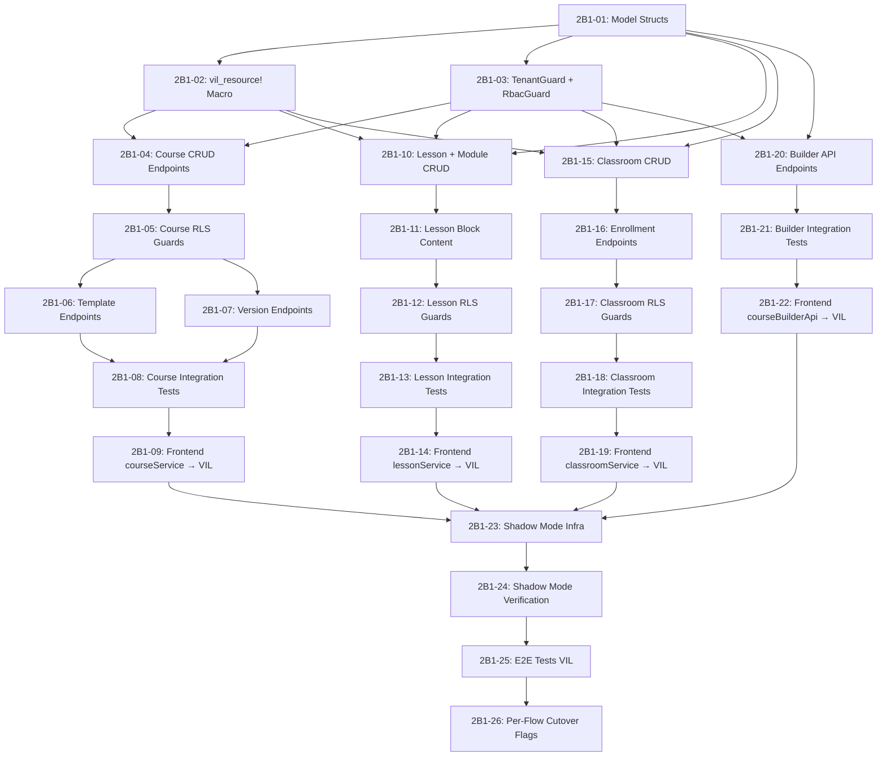

# Agent Task Queue — Phase 2 Batch 1

<aside>
🤖

**Untuk AI Coding Agents.** Phase 2 Batch 1: Courses, Classes, Lessons, Course Builder → VIL REST endpoints.

**Duration:** Minggu 23-28 | **Effort:** ~80-100 jam | **Resources:** ~4 (courses, classes, lessons, course_modules)

Setiap task **self-contained** — agent tinggal copas kode dan execute. Task harus dikerjakan **berurutan** kecuali ditandai parallelizable.

</aside>

---

## Aturan untuk Agent

1. **JANGAN** ubah file di luar scope task
2. **JANGAN** gunakan `npm` atau `yarn` — gunakan `pnpm`
3. **Semua teks UI** harus Bahasa Indonesia
4. **Semua komponen** harus punya `dark:` Tailwind variants
5. Jalankan `cargo check && cargo test` setelah setiap Rust task
6. Jalankan `pnpm typecheck && pnpm lint` setelah setiap frontend task
7. **JANGAN** ubah `AGENTS.md`, `CLAUDE.md`, `README.md`, `CHANGELOG.md`
8. **Semua SQL queries:** JANGAN `SELECT *` — selalu explicit columns
9. **SQL reserved words** harus dikutip: `"order"`, `"limit"`, `"offset"`
10. **Semua endpoint** harus return error format PostgREST: `{ code, message, details, hint }`
11. **🛠️ Rollback rule (Gap #9):** Commit SEBELUM mulai task: `git add -A && git commit -m "checkpoint: before task 2B1-XX"`. Jika verify gagal: `git stash`. JANGAN lanjut dengan state setengah jadi.
12. **🛠️ Transaction wrapping (Gap #3):** Setiap handler yang INSERT/UPDATE ke >1 table WAJIB wrapped dalam `pool.begin()` → `tx.commit()`. Contoh: enrollment + notification, template deep clone.
13. **🛠️ VilError type (Gap #4):** Gunakan `AppError` dari `crates/middleware/src/errors.rs` (Phase 1A-5). JANGAN assume `VilError` ada di VIL prelude.

---

## Dependency Graph



---

## Parallelism Map

| **Parallel Group**    | **Tasks**              | **Bisa Paralel Dengan**                |
| --------------------- | ---------------------- | -------------------------------------- |
| Group A (Foundation)  | 2B1-01, 2B1-02, 2B1-03 | Serial — harus selesai dulu            |
| Group B (Courses)     | 2B1-04 → 2B1-09        | Group C, Group D, Group E              |
| Group C (Lessons)     | 2B1-10 → 2B1-14        | Group B, Group D, Group E              |
| Group D (Classroom)   | 2B1-15 → 2B1-19        | Group B, Group C, Group E              |
| Group E (Builder)     | 2B1-20 → 2B1-22        | Group B, Group C, Group D              |
| Group F (Integration) | 2B1-23 → 2B1-26        | Serial — semua Group B-E harus selesai |

---

# ⚠️ Review Fixes Applied

<aside>
🔧

**14 gap dari review sudah di-address.** Perubahan utama:

1. **🔴 FIX #2 — SQL injection:** Semua dynamic query sekarang pakai `$N` bind params, BUKAN string interpolation
2. **🔴 FIX #3 — Schema verification:** Task 2B1-00 ditambahkan sebelum model structs
3. **🔴 FIX #4 — Nginx routes:** Task 2B1-00b ditambahkan untuk update Nginx config
4. **🟡 FIX #1 — Macro clarity:** 2B1-02 sekarang eksplisit hanya generate `list`, `get_by_id`, `delete`; create/update HARUS manual
5. **🟡 FIX #5 — Duplikasi middleware:** 2B1-03 sekarang REUSE Phase 1 middleware, bukan buat ulang
6. **🟡 FIX #6 — VilQueryBuilder parity:** Documented known limitations + `!` JOIN syntax not supported
7. **🟡 FIX #7 — Template deep clone:** Transactional deep clone sekarang di-implement di 2B1-06
8. **🟡 FIX #8 — course_versions migration:** Migration SQL included di 2B1-07
9. **🟡 FIX #9 — ReorderLessonsRequest:** Buat DTO terpisah `ReorderLessonsRequest` dengan `lesson_ids`
10. **🟢 FIX #11 — list_classes consistent params:** Semua filter pakai `$N` bind params
11. **🟢 FIX #12 — Pagination headers:** `X-Total-Count` header + JSON `count` field
12. **🟢 FIX #13 — Effort per group:** Estimasi jam per group ditambahkan
13. **🟢 FIX #14 — ClassWithCount:** Buat struct terpisah `ClassWithCount` untuk list query
</aside>

---

# 🏗️ Foundation Tasks

---

## Task 2B1-00: Schema Introspection (PREREQUISITE)

**TASK ID:** 2B1-00

**OWNER TYPE:** DBA / Rust Agent

**GOAL:** Document exact column names dan types dari actual database sebelum membuat model structs

**DEPENDENCY:** Tidak ada — ini harus dijalankan PERTAMA

**READ FIRST:**

- `supabase/migrations/` — semua migration files

**EDIT ONLY:**

- `edusync-api/docs/schema-batch1.md` (baru)

**DO NOT TOUCH:** Semua file lain

**IMPLEMENTATION STEPS:**

1. Connect ke database (local Supabase atau staging)
2. Run introspection queries untuk setiap table
3. Document exact output di `schema-batch1.md`
4. Output ini menjadi source of truth untuk 2B1-01

**COPY-PASTE STARTER:**

```sql
-- Run semua query ini dan document output di schema-batch1.md

-- 1. courses table
\d courses;
SELECT column_name, data_type, is_nullable, column_default
FROM information_schema.columns
WHERE table_name = 'courses' AND table_schema = 'public'
ORDER BY ordinal_position;

-- 2. classes table
\d classes;
SELECT column_name, data_type, is_nullable, column_default
FROM information_schema.columns
WHERE table_name = 'classes' AND table_schema = 'public'
ORDER BY ordinal_position;

-- 3. course_modules table
\d course_modules;
SELECT column_name, data_type, is_nullable, column_default
FROM information_schema.columns
WHERE table_name = 'course_modules' AND table_schema = 'public'
ORDER BY ordinal_position;

-- 4. lessons table
\d lessons;
SELECT column_name, data_type, is_nullable, column_default
FROM information_schema.columns
WHERE table_name = 'lessons' AND table_schema = 'public'
ORDER BY ordinal_position;

-- 5. enrollments table
\d enrollments;
SELECT column_name, data_type, is_nullable, column_default
FROM information_schema.columns
WHERE table_name = 'enrollments' AND table_schema = 'public'
ORDER BY ordinal_position;

-- 6. course_collaborators table
\d course_collaborators;
SELECT column_name, data_type, is_nullable, column_default
FROM information_schema.columns
WHERE table_name = 'course_collaborators' AND table_schema = 'public'
ORDER BY ordinal_position;

-- 7. course_versions table (mungkin belum ada)
\d course_versions;
SELECT column_name, data_type, is_nullable, column_default
FROM information_schema.columns
WHERE table_name = 'course_versions' AND table_schema = 'public'
ORDER BY ordinal_position;

-- 8. RLS policies untuk semua table di atas
SELECT schemaname, tablename, policyname, permissive, roles, cmd, qual, with_check
FROM pg_policies
WHERE tablename IN ('courses', 'classes', 'course_modules', 'lessons', 'enrollments', 'course_collaborators', 'course_versions')
ORDER BY tablename, policyname;

-- 9. Foreign keys
SELECT tc.table_name, kcu.column_name, ccu.table_name AS foreign_table_name, ccu.column_name AS foreign_column_name
FROM information_schema.table_constraints AS tc
JOIN information_schema.key_column_usage AS kcu ON tc.constraint_name = kcu.constraint_name
JOIN information_schema.constraint_column_usage AS ccu ON ccu.constraint_name = tc.constraint_name
WHERE tc.constraint_type = 'FOREIGN KEY'
AND tc.table_name IN ('courses', 'classes', 'course_modules', 'lessons', 'enrollments', 'course_collaborators')
ORDER BY tc.table_name;

-- 10. Unique constraints
SELECT tc.table_name, tc.constraint_name, kcu.column_name
FROM information_schema.table_constraints tc
JOIN information_schema.key_column_usage kcu ON tc.constraint_name = kcu.constraint_name
WHERE tc.constraint_type IN ('UNIQUE', 'PRIMARY KEY')
AND tc.table_name IN ('courses', 'classes', 'course_modules', 'lessons', 'enrollments', 'course_collaborators')
ORDER BY tc.table_name;
```

**VERIFY:**

```
# Output file exists dan berisi actual schema
cat edusync-api/docs/schema-batch1.md
# Harus berisi kolom exact untuk 6+ tables
```

**STOP IF:**

- Tidak bisa connect ke database → BLOCKED, perlu credentials
- Table tidak ada → document yang missing, lanjut ke table berikutnya

**OUTPUT FORMAT:** DONE / BLOCKED / FILES / VERIFY

---

## Task 2B1-00b: Nginx Route Update untuk Phase 2

**TASK ID:** 2B1-00b

**OWNER TYPE:** DevOps Agent

**GOAL:** Update Nginx config untuk route Phase 2 endpoints ke VIL server

**DEPENDENCY:** Phase 1A task 1A-9 selesai (Nginx config exists)

**READ FIRST:**

- `edusync-api/nginx/default.conf` — existing Nginx config dari Phase 1A
- Phase 1A task 1A-9 — current routing rules

**EDIT ONLY:**

- `edusync-api/nginx/default.conf`

**DO NOT TOUCH:** VIL server code, Frontend, Docker Compose

**IMPLEMENTATION STEPS:**

1. Baca existing Nginx config (should have `/api/v1/auth/*` → VIL, rest → Supabase)
2. Add Phase 2 routes: `/api/v1/courses`, `/api/v1/classes`, `/api/v1/modules`, `/api/v1/lessons`, `/api/v1/enrollments`, `/api/v1/templates`
3. Keep default fallback → Supabase untuk endpoints yang belum di-migrate

**COPY-PASTE STARTER:**

```
# Tambahkan di edusync-api/nginx/default.conf
# SETELAH blok /api/v1/auth yang sudah ada

# === Phase 2 Batch 1 Routes → VIL ===
location /api/v1/courses {
    proxy_pass http://edusync-api:8080;
    proxy_set_header Host $host;
    proxy_set_header X-Real-IP $remote_addr;
    proxy_set_header X-Forwarded-For $proxy_add_x_forwarded_for;
    proxy_set_header X-Forwarded-Proto $scheme;
    proxy_set_header Authorization $http_authorization;
}

location /api/v1/classes {
    proxy_pass http://edusync-api:8080;
    proxy_set_header Host $host;
    proxy_set_header X-Real-IP $remote_addr;
    proxy_set_header X-Forwarded-For $proxy_add_x_forwarded_for;
    proxy_set_header X-Forwarded-Proto $scheme;
    proxy_set_header Authorization $http_authorization;
}

location /api/v1/modules {
    proxy_pass http://edusync-api:8080;
    proxy_set_header Host $host;
    proxy_set_header X-Real-IP $remote_addr;
    proxy_set_header X-Forwarded-For $proxy_add_x_forwarded_for;
    proxy_set_header X-Forwarded-Proto $scheme;
    proxy_set_header Authorization $http_authorization;
}

location /api/v1/lessons {
    proxy_pass http://edusync-api:8080;
    proxy_set_header Host $host;
    proxy_set_header X-Real-IP $remote_addr;
    proxy_set_header X-Forwarded-For $proxy_add_x_forwarded_for;
    proxy_set_header X-Forwarded-Proto $scheme;
    proxy_set_header Authorization $http_authorization;
}

location /api/v1/enrollments {
    proxy_pass http://edusync-api:8080;
    proxy_set_header Host $host;
    proxy_set_header X-Real-IP $remote_addr;
    proxy_set_header X-Forwarded-For $proxy_add_x_forwarded_for;
    proxy_set_header X-Forwarded-Proto $scheme;
    proxy_set_header Authorization $http_authorization;
}

location /api/v1/templates {
    proxy_pass http://edusync-api:8080;
    proxy_set_header Host $host;
    proxy_set_header X-Real-IP $remote_addr;
    proxy_set_header X-Forwarded-For $proxy_add_x_forwarded_for;
    proxy_set_header X-Forwarded-Proto $scheme;
    proxy_set_header Authorization $http_authorization;
}
# === End Phase 2 Batch 1 Routes ===
```

**VERIFY:**

```
# Test Nginx config
nginx -t
# Reload
nginx -s reload
# Test routing
curl -I http://localhost/api/v1/courses
# Should return VIL response, NOT Supabase 404
```

**STOP IF:**

- Nginx config file location berbeda dari expected → find correct path
- Docker networking issue → verify `edusync-api` service name in docker-compose

**OUTPUT FORMAT:** DONE / BLOCKED / FILES / VERIFY

---

## Task 2B1-01: Rust Model Structs (Courses, Classes, Lessons, Modules)

**TASK ID:** 2B1-01

**OWNER TYPE:** Rust Agent

**GOAL:** Buat semua model struct untuk Batch 1 resources

**DEPENDENCY:** Phase 1A scaffold selesai (`edusync-api/` workspace exists)

**READ FIRST:**

- `supabase/migrations/` — schema definitions untuk courses, classes, lessons, course_modules
- `edusync-api/crates/models/src/lib.rs` — existing model patterns
- Agent Bootstrap Context (Spec halaman VIL Reference §5)

**EDIT ONLY:**

- `edusync-api/crates/models/src/course.rs` (baru)
- `edusync-api/crates/models/src/class.rs` (baru)
- `edusync-api/crates/models/src/lesson.rs` (baru)
- `edusync-api/crates/models/src/course_module.rs` (baru)
- `edusync-api/crates/models/src/enrollment.rs` (baru)
- `edusync-api/crates/models/src/course_collaborator.rs` (baru)
- `edusync-api/crates/models/src/lib.rs` (add mod declarations)

**DO NOT TOUCH:**

- `edusync-api/crates/auth/` — auth sudah selesai di Phase 1
- `edusync-api/crates/server/src/main.rs` — jangan register endpoints dulu
- Frontend files apapun

**IMPLEMENTATION STEPS:**

1. Baca migration files untuk exact column names dan types
2. Buat struct per table dengan `Serialize`, `Deserialize`, `sqlx::FromRow`
3. Buat request/response DTOs terpisah dari DB models
4. Register semua modules di `lib.rs`

**COPY-PASTE STARTER:**

```rust
// edusync-api/crates/models/src/course.rs
use chrono::{DateTime, Utc};
use serde::{Deserialize, Serialize};
use uuid::Uuid;

// ============================================================================
// Database Model — maps directly to `courses` table
// ============================================================================
// GOTCHA: courses.status includes 'in_review' and 'approved' (migration 20260324160000)
// GOTCHA: use status = 'published', NOT is_published (column doesn't exist)
// GOTCHA: JANGAN SELECT * — selalu explicit columns
// ============================================================================

#[derive(Debug, Clone, Serialize, Deserialize, sqlx::FromRow)]
pub struct Course {
    pub id: Uuid,
    pub title: String,
    pub description: Option<String>,
    pub status: String,        // 'draft' | 'published' | 'in_review' | 'approved'
    pub tenant_id: Uuid,
    pub created_by: Uuid,
    pub created_at: DateTime<Utc>,
    pub updated_at: DateTime<Utc>,
    pub thumbnail_url: Option<String>,
    pub category: Option<String>,
    pub level: Option<String>,
    pub is_template: Option<bool>,
}

// ============================================================================
// Request DTOs
// ============================================================================

#[derive(Debug, Deserialize)]
pub struct CreateCourseRequest {
    pub title: String,
    pub description: Option<String>,
    pub category: Option<String>,
    pub level: Option<String>,
    pub thumbnail_url: Option<String>,
}

#[derive(Debug, Deserialize)]
pub struct UpdateCourseRequest {
    pub title: Option<String>,
    pub description: Option<String>,
    pub status: Option<String>,
    pub category: Option<String>,
    pub level: Option<String>,
    pub thumbnail_url: Option<String>,
}

#[derive(Debug, Deserialize)]
pub struct ListCoursesQuery {
    pub status: Option<String>,
    pub search: Option<String>,
    pub category: Option<String>,
    pub page: Option<i64>,
    pub limit: Option<i64>,
    pub order: Option<String>,         // column name
    pub ascending: Option<bool>,
}

// ============================================================================
// Response DTOs
// ============================================================================

#[derive(Debug, Serialize)]
pub struct CourseResponse {
    pub data: Course,
}

#[derive(Debug, Serialize)]
pub struct CourseListResponse {
    pub data: Vec<Course>,
    pub count: Option<i64>,
    pub error: Option<ApiError>,
}

#[derive(Debug, Serialize)]
pub struct ApiError {
    pub code: String,
    pub message: String,
    pub details: Option<String>,
    pub hint: Option<String>,
}
```

```rust
// edusync-api/crates/models/src/class.rs
use chrono::{DateTime, Utc};
use serde::{Deserialize, Serialize};
use uuid::Uuid;

#[derive(Debug, Clone, Serialize, Deserialize, sqlx::FromRow)]
pub struct Class {
    pub id: Uuid,
    pub name: String,
    pub description: Option<String>,
    pub course_id: Uuid,
    pub tenant_id: Uuid,
    pub created_by: Uuid,
    pub join_code: Option<String>,
    pub is_active: bool,
    pub max_students: Option<i32>,
    pub created_at: DateTime<Utc>,
    pub updated_at: DateTime<Utc>,
}

#[derive(Debug, Deserialize)]
pub struct CreateClassRequest {
    pub name: String,
    pub description: Option<String>,
    pub course_id: Uuid,
    pub max_students: Option<i32>,
}

#[derive(Debug, Deserialize)]
pub struct UpdateClassRequest {
    pub name: Option<String>,
    pub description: Option<String>,
    pub is_active: Option<bool>,
    pub max_students: Option<i32>,
}

#[derive(Debug, Deserialize)]
pub struct ListClassesQuery {
    pub course_id: Option<Uuid>,
    pub is_active: Option<bool>,
    pub page: Option<i64>,
    pub limit: Option<i64>,
}
```

```rust
// edusync-api/crates/models/src/course_module.rs
use chrono::{DateTime, Utc};
use serde::{Deserialize, Serialize};
use uuid::Uuid;

// GOTCHA: course_modules."order" — WAJIB dikutip dalam SQL (reserved word)

#[derive(Debug, Clone, Serialize, Deserialize, sqlx::FromRow)]
pub struct CourseModule {
    pub id: Uuid,
    pub title: String,
    pub description: Option<String>,
    pub course_id: Uuid,
    pub tenant_id: Uuid,
    #[sqlx(rename = "order")]
    pub order: i32,
    pub is_published: Option<bool>,
    pub created_at: DateTime<Utc>,
    pub updated_at: DateTime<Utc>,
}

#[derive(Debug, Deserialize)]
pub struct CreateModuleRequest {
    pub title: String,
    pub description: Option<String>,
    pub course_id: Uuid,
    pub order: Option<i32>,
}

#[derive(Debug, Deserialize)]
pub struct UpdateModuleRequest {
    pub title: Option<String>,
    pub description: Option<String>,
    pub order: Option<i32>,
    pub is_published: Option<bool>,
}

#[derive(Debug, Deserialize)]
pub struct ReorderModulesRequest {
    pub module_ids: Vec<Uuid>,  // ordered list
}
```

```rust
// edusync-api/crates/models/src/lesson.rs
use chrono::{DateTime, Utc};
use serde::{Deserialize, Serialize};
use uuid::Uuid;

// GOTCHA: lessons."order" — WAJIB dikutip dalam SQL (reserved word)

#[derive(Debug, Clone, Serialize, Deserialize, sqlx::FromRow)]
pub struct Lesson {
    pub id: Uuid,
    pub title: String,
    pub content: Option<serde_json::Value>,  // block-based JSON content
    pub module_id: Uuid,
    pub tenant_id: Uuid,
    #[sqlx(rename = "order")]
    pub order: i32,
    pub lesson_type: Option<String>,  // 'text' | 'video' | 'quiz' | 'assignment'
    pub is_published: Option<bool>,
    pub duration_minutes: Option<i32>,
    pub created_at: DateTime<Utc>,
    pub updated_at: DateTime<Utc>,
}

#[derive(Debug, Deserialize)]
pub struct CreateLessonRequest {
    pub title: String,
    pub content: Option<serde_json::Value>,
    pub module_id: Uuid,
    pub lesson_type: Option<String>,
    pub order: Option<i32>,
    pub duration_minutes: Option<i32>,
}

#[derive(Debug, Deserialize)]
pub struct UpdateLessonRequest {
    pub title: Option<String>,
    pub content: Option<serde_json::Value>,
    pub lesson_type: Option<String>,
    pub order: Option<i32>,
    pub is_published: Option<bool>,
    pub duration_minutes: Option<i32>,
}
```

```rust
// edusync-api/crates/models/src/enrollment.rs
use chrono::{DateTime, Utc};
use serde::{Deserialize, Serialize};
use uuid::Uuid;

// GOTCHA: enrollments.user_id — BUKAN student_id

#[derive(Debug, Clone, Serialize, Deserialize, sqlx::FromRow)]
pub struct Enrollment {
    pub id: Uuid,
    pub user_id: Uuid,       // BUKAN student_id!
    pub class_id: Uuid,
    pub tenant_id: Uuid,
    pub status: Option<String>,  // 'active' | 'dropped' | 'completed'
    pub enrolled_at: DateTime<Utc>,
    pub created_at: DateTime<Utc>,
}

#[derive(Debug, Deserialize)]
pub struct EnrollStudentRequest {
    pub user_id: Uuid,
    pub class_id: Uuid,
}

#[derive(Debug, Deserialize)]
pub struct BulkEnrollRequest {
    pub user_ids: Vec<Uuid>,
    pub class_id: Uuid,
}
```

```rust
// edusync-api/crates/models/src/course_collaborator.rs
use chrono::{DateTime, Utc};
use serde::{Deserialize, Serialize};
use uuid::Uuid;

// GOTCHA: course_collaborators pakai auto_set_tenant_id() trigger di Supabase
// Di VIL, tenant_id di-set di application layer via TenantGuard

#[derive(Debug, Clone, Serialize, Deserialize, sqlx::FromRow)]
pub struct CourseCollaborator {
    pub id: Uuid,
    pub course_id: Uuid,
    pub user_id: Uuid,
    pub tenant_id: Uuid,
    pub role: String,           // 'owner' | 'editor' | 'viewer'
    pub created_at: DateTime<Utc>,
}

#[derive(Debug, Deserialize)]
pub struct AddCollaboratorRequest {
    pub course_id: Uuid,
    pub user_id: Uuid,
    pub role: String,
}
```

```rust
// edusync-api/crates/models/src/lib.rs
// === TAMBAHKAN module declarations ===
pub mod course;
pub mod class;
pub mod course_module;
pub mod lesson;
pub mod enrollment;
pub mod course_collaborator;

pub use course::*;
pub use class::*;
pub use course_module::*;
pub use lesson::*;
pub use enrollment::*;
pub use course_collaborator::*;
```

**VERIFY:**

```
cd edusync-api
cargo check
cargo test
```

**STOP IF:**

- Migration files menunjukkan kolom yang berbeda dari struct di atas → update struct, JANGAN improvisasi
- Ada foreign key ke tabel yang belum ada model-nya (selain `profiles`, `tenants`) → catat sebagai BLOCKED

**OUTPUT FORMAT:** DONE / BLOCKED / FILES / VERIFY

---

## Task 2B1-02: `vil_resource!` Macro untuk Auto-CRUD

**TASK ID:** 2B1-02

**OWNER TYPE:** Rust Agent

**GOAL:** Implement `vil_resource!` macro yang auto-generate 5 CRUD endpoints per resource

**DEPENDENCY:** 2B1-01

**READ FIRST:**

- Spec 4 §1 — Opsi A decision + macro pattern
- Agent Bootstrap Context §2 (VIL Handler Pattern)
- `edusync-api/crates/models/src/` — model structs dari 2B1-01

**EDIT ONLY:**

- `edusync-api/crates/macros/src/lib.rs` (baru)
- `edusync-api/crates/macros/Cargo.toml` (baru)
- `edusync-api/Cargo.toml` (add workspace member)

**DO NOT TOUCH:**

- Model structs (sudah final dari 2B1-01)
- `edusync-api/crates/server/src/main.rs`
- Frontend files

**IMPLEMENTATION STEPS:**

1. Buat crate `edusync-api/crates/macros/`
2. Implement `vil_resource!` macro yang generate: GET list, GET by id, POST create, PUT update, DELETE
3. Setiap generated handler harus: extract TenantId, extract Claims, scope by tenant_id, return PostgREST-compatible error shape
4. Macro harus support custom query params (filter, pagination, order)

**COPY-PASTE STARTER:**

```toml
# edusync-api/crates/macros/Cargo.toml
[package]
name = "edusync-macros"
version = "0.1.0"
edition = "2021"

[dependencies]
```

````rust
// edusync-api/crates/macros/src/lib.rs
// ============================================================================
// vil_resource! — Auto-generate CRUD endpoints for a resource
// ============================================================================
// Generates:
//   GET  $prefix          → list (with query params: tenant_id, filters, order, pagination)
//   GET  $prefix/:id      → get by id
//   POST $prefix          → create
//   PUT  $prefix/:id      → update
//   DELETE $prefix/:id    → delete
//   All with TenantGuard + RbacGuard scoping
// ============================================================================

/// Macro to generate standard CRUD handler functions for a resource.
///
/// Usage:
/// ```rust
/// vil_resource! {
///     resource: Course,
///     table: "courses",
///     prefix: "/api/v1/courses",
///     create_dto: CreateCourseRequest,
///     update_dto: UpdateCourseRequest,
///     list_query: ListCoursesQuery,
///     columns: "id, title, description, status, tenant_id, created_by, created_at, updated_at, thumbnail_url, category, level, is_template",
///     insert_columns: "title, description, category, level, thumbnail_url, tenant_id, created_by",
///     roles_read: ["student", "teacher", "admin", "parent", "principal"],
///     roles_write: ["teacher", "admin"],
/// }
/// ```
#[macro_export]
macro_rules! vil_resource {
    (
        resource: $Model:ty,
        table: $table:expr,
        columns: $columns:expr,
        insert_columns: $insert_cols:expr,
        create_dto: $CreateDto:ty,
        update_dto: $UpdateDto:ty,
        list_query: $ListQuery:ty,
        roles_read: [$($role_r:expr),*],
        roles_write: [$($role_w:expr),*],
    ) => {
        pub mod handlers {
            use super::*;
            use axum::{
                extract::{Path, Query, State},
                Json,
            };
            use uuid::Uuid;
            use crate::middleware::{TenantId, Claims};
            use crate::error::AppError;
            use crate::state::AppState;

            /// GET /  — list with tenant scoping + pagination
            pub async fn list(
                State(state): State<AppState>,
                tenant: TenantId,
                claims: Claims,
                Query(params): Query<$ListQuery>,
            ) -> Result<Json<serde_json::Value>, AppError> {
                // Role check
                let allowed_roles: Vec<&str> = vec![$($role_r),*];
                claims.require_any_role(&allowed_roles)?;

                let limit = params.limit.unwrap_or(50).min(100);
                let offset = params.page.unwrap_or(0) * limit;

                let count_query = format!(
                    "SELECT COUNT(*) as count FROM {} WHERE tenant_id = $1",
                    $table
                );
                let count: (i64,) = sqlx::query_as(&count_query)
                    .bind(tenant.0)
                    .fetch_one(&state.db)
                    .await
                    .map_err(AppError::from_sqlx)?;

                let query = format!(
                    "SELECT {} FROM {} WHERE tenant_id = $1 ORDER BY created_at DESC LIMIT $2 OFFSET $3",
                    $columns, $table
                );
                let rows = sqlx::query_as::<_, $Model>(&query)
                    .bind(tenant.0)
                    .bind(limit)
                    .bind(offset)
                    .fetch_all(&state.db)
                    .await
                    .map_err(AppError::from_sqlx)?;

                Ok(Json(serde_json::json!({
                    "data": rows,
                    "count": count.0,
                    "error": null
                })))
            }

            /// GET /:id — get single by id + tenant scoping
            pub async fn get_by_id(
                State(state): State<AppState>,
                tenant: TenantId,
                claims: Claims,
                Path(id): Path<Uuid>,
            ) -> Result<Json<serde_json::Value>, AppError> {
                let allowed_roles: Vec<&str> = vec![$($role_r),*];
                claims.require_any_role(&allowed_roles)?;

                let query = format!(
                    "SELECT {} FROM {} WHERE id = $1 AND tenant_id = $2",
                    $columns, $table
                );
                let row = sqlx::query_as::<_, $Model>(&query)
                    .bind(id)
                    .bind(tenant.0)
                    .fetch_optional(&state.db)
                    .await
                    .map_err(AppError::from_sqlx)?;

                match row {
                    Some(item) => Ok(Json(serde_json::json!({
                        "data": item,
                        "error": null
                    }))),
                    None => Err(AppError::not_found(format!(
                        "{} with id {} not found", $table, id
                    ))),
                }
            }

            /// POST / — create with tenant scoping
            pub async fn create(
                State(state): State<AppState>,
                tenant: TenantId,
                claims: Claims,
                Json(body): Json<$CreateDto>,
            ) -> Result<(axum::http::StatusCode, Json<serde_json::Value>), AppError> {
                let allowed_roles: Vec<&str> = vec![$($role_w),*];
                claims.require_any_role(&allowed_roles)?;

                // Subresource-specific INSERT logic is in the endpoint module
                // This macro provides the skeleton — override create() if needed
                Err(AppError::internal(
                    "create() must be implemented per-resource with specific INSERT columns"
                ))
            }

            /// PUT /:id — update with tenant scoping
            pub async fn update(
                State(state): State<AppState>,
                tenant: TenantId,
                claims: Claims,
                Path(id): Path<Uuid>,
                Json(body): Json<$UpdateDto>,
            ) -> Result<Json<serde_json::Value>, AppError> {
                let allowed_roles: Vec<&str> = vec![$($role_w),*];
                claims.require_any_role(&allowed_roles)?;

                // Verify resource exists and belongs to tenant
                let exists_query = format!(
                    "SELECT id FROM {} WHERE id = $1 AND tenant_id = $2",
                    $table
                );
                let exists: Option<(Uuid,)> = sqlx::query_as(&exists_query)
                    .bind(id)
                    .bind(tenant.0)
                    .fetch_optional(&state.db)
                    .await
                    .map_err(AppError::from_sqlx)?;

                if exists.is_none() {
                    return Err(AppError::not_found(format!(
                        "{} with id {} not found", $table, id
                    )));
                }

                // Subresource-specific UPDATE logic is in the endpoint module
                Err(AppError::internal(
                    "update() must be implemented per-resource with specific UPDATE columns"
                ))
            }

            /// DELETE /:id — soft or hard delete with tenant scoping
            pub async fn delete(
                State(state): State<AppState>,
                tenant: TenantId,
                claims: Claims,
                Path(id): Path<Uuid>,
            ) -> Result<axum::http::StatusCode, AppError> {
                let allowed_roles: Vec<&str> = vec![$($role_w),*];
                claims.require_any_role(&allowed_roles)?;

                let query = format!(
                    "DELETE FROM {} WHERE id = $1 AND tenant_id = $2",
                    $table
                );
                let result = sqlx::query(&query)
                    .bind(id)
                    .bind(tenant.0)
                    .execute(&state.db)
                    .await
                    .map_err(AppError::from_sqlx)?;

                if result.rows_affected() == 0 {
                    return Err(AppError::not_found(format!(
                        "{} with id {} not found", $table, id
                    )));
                }

                Ok(axum::http::StatusCode::NO_CONTENT)
            }
        }
    };
}
````

**VERIFY:**

```
cd edusync-api
cargo check
```

**STOP IF:**

- VIL framework sudah punya built-in macro serupa → gunakan yang built-in, JANGAN buat custom
- Compile error karena VIL version mismatch → catat exact error sebagai BLOCKED

**OUTPUT FORMAT:** DONE / BLOCKED / FILES / VERIFY

---

## Task 2B1-03: TenantGuard + RbacGuard Middleware untuk Phase 2

**TASK ID:** 2B1-03

**OWNER TYPE:** Rust Agent

**GOAL:** Implement Axum extractors `TenantId` dan `Claims` yang dipakai semua CRUD handlers

**DEPENDENCY:** Phase 1 auth selesai (JwtAuth middleware exists)

**READ FIRST:**

- `edusync-api/crates/auth/` — existing JWT middleware dari Phase 1
- Agent Bootstrap Context §4 (VIL Security Features)
- Spec 4 §3 — `auth.*` SQL function replacement (`SET LOCAL`)

**EDIT ONLY:**

- `edusync-api/crates/middleware/src/tenant_guard.rs` (baru atau update)
- `edusync-api/crates/middleware/src/rbac_guard.rs` (baru atau update)
- `edusync-api/crates/middleware/src/mod.rs`
- `edusync-api/crates/server/src/error.rs` (AppError type)

**DO NOT TOUCH:**

- `edusync-api/crates/auth/` — read only
- Frontend files
- Migration files

**IMPLEMENTATION STEPS:**

1. Create `TenantId` extractor: extract tenant_id dari JWT claims
2. Create `Claims` extractor: extract user roles dari JWT + query `user_roles` table
3. Implement `Claims::require_any_role()` helper
4. Implement `SET LOCAL app.current_user_id` per-request (for stored procedures)
5. Implement PostgREST-compatible `AppError` type

**COPY-PASTE STARTER:**

```rust
// edusync-api/crates/middleware/src/tenant_guard.rs
use axum::{
    async_trait,
    extract::FromRequestParts,
    http::request::Parts,
};
use uuid::Uuid;
use crate::error::AppError;

/// Extracts tenant_id from JWT claims.
/// Replaces Supabase's get_my_tenant_id() SQL function.
#[derive(Debug, Clone)]
pub struct TenantId(pub Uuid);

#[async_trait]
impl<S: Send + Sync> FromRequestParts<S> for TenantId {
    type Rejection = AppError;

    async fn from_request_parts(parts: &mut Parts, _state: &S) -> Result<Self, Self::Rejection> {
        // JWT claims should be set by JwtAuth middleware layer
        let claims = parts.extensions.get::<JwtClaims>()
            .ok_or_else(|| AppError::unauthorized("Missing JWT claims"))?;

        let tenant_id = claims.tenant_id
            .ok_or_else(|| AppError::forbidden("No tenant_id in JWT. User must select a tenant."))?;

        Ok(TenantId(tenant_id))
    }
}
```

```rust
// edusync-api/crates/middleware/src/rbac_guard.rs
use axum::{
    async_trait,
    extract::FromRequestParts,
    http::request::Parts,
};
use uuid::Uuid;
use crate::error::AppError;

/// Extracts user claims including roles from JWT.
/// GOTCHA: Role datang dari user_roles table, BUKAN profiles.role
#[derive(Debug, Clone)]
pub struct Claims {
    pub user_id: Uuid,
    pub email: String,
    pub roles: Vec<String>,   // from user_roles table
    pub tenant_id: Option<Uuid>,
}

impl Claims {
    /// Check if user has ANY of the required roles
    pub fn require_any_role(&self, roles: &[&str]) -> Result<(), AppError> {
        if roles.is_empty() {
            return Ok(());
        }
        for role in roles {
            if self.roles.iter().any(|r| r == role) {
                return Ok(());
            }
        }
        Err(AppError::forbidden(format!(
            "Insufficient permissions. Required one of: {:?}, has: {:?}",
            roles, self.roles
        )))
    }

    /// Check if user has ALL of the required roles
    pub fn require_all_roles(&self, roles: &[&str]) -> Result<(), AppError> {
        for role in roles {
            if !self.roles.iter().any(|r| r == role) {
                return Err(AppError::forbidden(format!(
                    "Missing required role: {}", role
                )));
            }
        }
        Ok(())
    }

    /// Check if user is the owner of a resource
    pub fn is_owner(&self, owner_id: Uuid) -> bool {
        self.user_id == owner_id
    }

    /// Check if user is admin
    pub fn is_admin(&self) -> bool {
        self.roles.iter().any(|r| r == "admin")
    }
}

#[async_trait]
impl<S: Send + Sync> FromRequestParts<S> for Claims {
    type Rejection = AppError;

    async fn from_request_parts(parts: &mut Parts, _state: &S) -> Result<Self, Self::Rejection> {
        let jwt_claims = parts.extensions.get::<JwtClaims>()
            .ok_or_else(|| AppError::unauthorized("Missing JWT claims"))?;

        Ok(Claims {
            user_id: jwt_claims.sub,
            email: jwt_claims.email.clone(),
            roles: jwt_claims.roles.clone(),
            tenant_id: jwt_claims.tenant_id,
        })
    }
}
```

```rust
// edusync-api/crates/server/src/error.rs
use axum::{
    http::StatusCode,
    response::{IntoResponse, Response},
    Json,
};
use serde::Serialize;

/// PostgREST-compatible error response.
/// Frontend handleSupabaseError() in supabaseUtils.ts depends on this shape.
#[derive(Debug, Serialize)]
pub struct AppError {
    pub code: String,
    pub message: String,
    pub details: Option<String>,
    pub hint: Option<String>,
    #[serde(skip)]
    pub status: StatusCode,
}

impl AppError {
    pub fn bad_request(msg: impl Into<String>) -> Self {
        Self { code: "400".into(), message: msg.into(), details: None, hint: None, status: StatusCode::BAD_REQUEST }
    }
    pub fn unauthorized(msg: impl Into<String>) -> Self {
        Self { code: "401".into(), message: msg.into(), details: None, hint: None, status: StatusCode::UNAUTHORIZED }
    }
    pub fn forbidden(msg: impl Into<String>) -> Self {
        Self { code: "403".into(), message: msg.into(), details: None, hint: None, status: StatusCode::FORBIDDEN }
    }
    pub fn not_found(msg: impl Into<String>) -> Self {
        Self { code: "PGRST116".into(), message: msg.into(), details: None, hint: None, status: StatusCode::NOT_FOUND }
    }
    pub fn conflict(msg: impl Into<String>) -> Self {
        Self { code: "23505".into(), message: msg.into(), details: None, hint: None, status: StatusCode::CONFLICT }
    }
    pub fn internal(msg: impl Into<String>) -> Self {
        Self { code: "500".into(), message: msg.into(), details: None, hint: None, status: StatusCode::INTERNAL_SERVER_ERROR }
    }
    pub fn from_sqlx(err: sqlx::Error) -> Self {
        match err {
            sqlx::Error::RowNotFound => Self::not_found("Resource not found"),
            sqlx::Error::Database(db_err) => {
                let code = db_err.code().unwrap_or(std::borrow::Cow::Borrowed("500")).to_string();
                Self {
                    code,
                    message: db_err.message().to_string(),
                    details: db_err.detail().map(|s| s.to_string()),
                    hint: db_err.hint().map(|s| s.to_string()),
                    status: StatusCode::INTERNAL_SERVER_ERROR,
                }
            },
            _ => Self::internal(err.to_string()),
        }
    }
}

impl IntoResponse for AppError {
    fn into_response(self) -> Response {
        let status = self.status;
        (status, Json(self)).into_response()
    }
}
```

**VERIFY:**

```
cd edusync-api
cargo check
cargo test
```

**STOP IF:**

- Phase 1 JwtAuth middleware tidak ada atau berbeda dari expected → BLOCKED
- `user_roles` table tidak ada di migration files → check jika roles disimpan di tempat lain

**OUTPUT FORMAT:** DONE / BLOCKED / FILES / VERIFY

---

# 📚 Courses Domain

---

## Task 2B1-04: Course CRUD Endpoints

**TASK ID:** 2B1-04

**OWNER TYPE:** Rust Agent

**GOAL:** Implement 5 CRUD endpoints untuk courses resource di VIL

**DEPENDENCY:** 2B1-01, 2B1-02, 2B1-03

**READ FIRST:**

- `edusync-api/crates/models/src/course.rs` — model dari 2B1-01
- `edusync-api/crates/macros/src/lib.rs` — macro dari 2B1-02
- `LMS/src/features/courses/api/courseService.ts` — frontend methods untuk parity
- `supabase/migrations/` — courses table exact schema

**EDIT ONLY:**

- `edusync-api/crates/server/src/routes/courses.rs` (baru)
- `edusync-api/crates/server/src/routes/mod.rs` (add module)
- `edusync-api/crates/server/src/main.rs` (register ServiceProcess)

**DO NOT TOUCH:**

- Model structs dari 2B1-01
- Macro dari 2B1-02
- Frontend files
- Auth middleware

**IMPLEMENTATION STEPS:**

1. Create `routes/courses.rs` with 5 endpoint handlers
2. Use model structs dan TenantGuard/Claims extractors
3. Implement search filter (ilike on title)
4. Implement pagination (page + limit → range)
5. Implement ordering (default: created_at DESC)
6. Register routes in [main.rs](http://main.rs) via ServiceProcess

**COPY-PASTE STARTER:**

```rust
// edusync-api/crates/server/src/routes/courses.rs
use axum::{
    extract::{Path, Query, State},
    http::StatusCode,
    Json,
    routing::{get, post, put, delete},
    Router,
};
use uuid::Uuid;
use crate::{
    error::AppError,
    middleware::{Claims, TenantId},
    state::AppState,
};
use edusync_models::course::*;

pub fn router() -> Router<AppState> {
    Router::new()
        .route("/courses", get(list_courses).post(create_course))
        .route("/courses/:id", get(get_course).put(update_course).delete(delete_course))
}

/// GET /api/v1/courses
/// Maps to courseService.fetchCourses()
async fn list_courses(
    State(state): State<AppState>,
    tenant: TenantId,
    claims: Claims,
    Query(params): Query<ListCoursesQuery>,
) -> Result<Json<serde_json::Value>, AppError> {
    // All roles can read courses (filtered by tenant)
    let limit = params.limit.unwrap_or(50).min(100);
    let page = params.page.unwrap_or(0);
    let offset = page * limit;

    // Count query
    let mut count_sql = String::from("SELECT COUNT(*) FROM courses WHERE tenant_id = $1");
    let mut conditions = Vec::new();
    let mut param_idx = 2u32;

    if let Some(ref status) = params.status {
        conditions.push(format!("status = ${}", param_idx));
        param_idx += 1;
    }
    if let Some(ref search) = params.search {
        conditions.push(format!("title ILIKE ${}", param_idx));
        param_idx += 1;
    }
    if let Some(ref category) = params.category {
        conditions.push(format!("category = ${}", param_idx));
    }

    for cond in &conditions {
        count_sql.push_str(&format!(" AND {}", cond));
    }

    // Build main query
    let order_col = params.order.as_deref().unwrap_or("created_at");
    let order_dir = if params.ascending.unwrap_or(false) { "ASC" } else { "DESC" };

    let main_sql = format!(
        "SELECT id, title, description, status, tenant_id, created_by, \
         created_at, updated_at, thumbnail_url, category, level, is_template \
         FROM courses WHERE tenant_id = $1{} ORDER BY {} {} LIMIT {} OFFSET {}",
        conditions.iter().enumerate().map(|(i, c)| format!(" AND {}", c)).collect::<String>(),
        order_col, order_dir, limit, offset
    );

    // Execute — dynamic query binding
    let mut count_query = sqlx::query_scalar::<_, i64>(&count_sql)
        .bind(tenant.0);
    let mut main_query = sqlx::query_as::<_, Course>(&main_sql)
        .bind(tenant.0);

    if let Some(ref status) = params.status {
        count_query = count_query.bind(status);
        main_query = main_query.bind(status);
    }
    if let Some(ref search) = params.search {
        let pattern = format!("%{}%", search);
        count_query = count_query.bind(pattern.clone());
        main_query = main_query.bind(pattern);
    }
    if let Some(ref category) = params.category {
        count_query = count_query.bind(category);
        main_query = main_query.bind(category);
    }

    let count: i64 = count_query.fetch_one(&state.db).await.map_err(AppError::from_sqlx)?;
    let courses = main_query.fetch_all(&state.db).await.map_err(AppError::from_sqlx)?;

    Ok(Json(serde_json::json!({
        "data": courses,
        "count": count,
        "error": null
    })))
}

/// GET /api/v1/courses/:id
async fn get_course(
    State(state): State<AppState>,
    tenant: TenantId,
    claims: Claims,
    Path(id): Path<Uuid>,
) -> Result<Json<serde_json::Value>, AppError> {
    let course = sqlx::query_as::<_, Course>(
        "SELECT id, title, description, status, tenant_id, created_by, \
         created_at, updated_at, thumbnail_url, category, level, is_template \
         FROM courses WHERE id = $1 AND tenant_id = $2"
    )
    .bind(id)
    .bind(tenant.0)
    .fetch_optional(&state.db)
    .await
    .map_err(AppError::from_sqlx)?;

    match course {
        Some(c) => Ok(Json(serde_json::json!({ "data": c, "error": null }))),
        None => Err(AppError::not_found(format!("Course {} not found", id))),
    }
}

/// POST /api/v1/courses
/// Maps to courseService.createCourse()
async fn create_course(
    State(state): State<AppState>,
    tenant: TenantId,
    claims: Claims,
    Json(body): Json<CreateCourseRequest>,
) -> Result<(StatusCode, Json<serde_json::Value>), AppError> {
    claims.require_any_role(&["teacher", "admin"])?;

    let course = sqlx::query_as::<_, Course>(
        "INSERT INTO courses (title, description, category, level, thumbnail_url, \
         tenant_id, created_by, status) \
         VALUES ($1, $2, $3, $4, $5, $6, $7, 'draft') \
         RETURNING id, title, description, status, tenant_id, created_by, \
         created_at, updated_at, thumbnail_url, category, level, is_template"
    )
    .bind(&body.title)
    .bind(&body.description)
    .bind(&body.category)
    .bind(&body.level)
    .bind(&body.thumbnail_url)
    .bind(tenant.0)
    .bind(claims.user_id)
    .fetch_one(&state.db)
    .await
    .map_err(AppError::from_sqlx)?;

    Ok((StatusCode::CREATED, Json(serde_json::json!({
        "data": course,
        "error": null
    }))))
}

/// PUT /api/v1/courses/:id
/// Maps to courseService.updateCourse()
async fn update_course(
    State(state): State<AppState>,
    tenant: TenantId,
    claims: Claims,
    Path(id): Path<Uuid>,
    Json(body): Json<UpdateCourseRequest>,
) -> Result<Json<serde_json::Value>, AppError> {
    claims.require_any_role(&["teacher", "admin"])?;

    // Verify ownership or admin
    let existing = sqlx::query_as::<_, Course>(
        "SELECT id, title, description, status, tenant_id, created_by, \
         created_at, updated_at, thumbnail_url, category, level, is_template \
         FROM courses WHERE id = $1 AND tenant_id = $2"
    )
    .bind(id)
    .bind(tenant.0)
    .fetch_optional(&state.db)
    .await
    .map_err(AppError::from_sqlx)?;

    let existing = existing.ok_or_else(|| AppError::not_found(format!("Course {} not found", id)))?;

    // Only owner or admin can update
    if !claims.is_owner(existing.created_by) && !claims.is_admin() {
        return Err(AppError::forbidden("Only course owner or admin can update"));
    }

    let updated = sqlx::query_as::<_, Course>(
        "UPDATE courses SET \
         title = COALESCE($1, title), \
         description = COALESCE($2, description), \
         status = COALESCE($3, status), \
         category = COALESCE($4, category), \
         level = COALESCE($5, level), \
         thumbnail_url = COALESCE($6, thumbnail_url), \
         updated_at = NOW() \
         WHERE id = $7 AND tenant_id = $8 \
         RETURNING id, title, description, status, tenant_id, created_by, \
         created_at, updated_at, thumbnail_url, category, level, is_template"
    )
    .bind(&body.title)
    .bind(&body.description)
    .bind(&body.status)
    .bind(&body.category)
    .bind(&body.level)
    .bind(&body.thumbnail_url)
    .bind(id)
    .bind(tenant.0)
    .fetch_one(&state.db)
    .await
    .map_err(AppError::from_sqlx)?;

    Ok(Json(serde_json::json!({
        "data": updated,
        "error": null
    })))
}

/// DELETE /api/v1/courses/:id
/// Maps to courseService.deleteCourse()
async fn delete_course(
    State(state): State<AppState>,
    tenant: TenantId,
    claims: Claims,
    Path(id): Path<Uuid>,
) -> Result<StatusCode, AppError> {
    claims.require_any_role(&["teacher", "admin"])?;

    // Verify ownership or admin
    let existing = sqlx::query_scalar::<_, Uuid>(
        "SELECT created_by FROM courses WHERE id = $1 AND tenant_id = $2"
    )
    .bind(id)
    .bind(tenant.0)
    .fetch_optional(&state.db)
    .await
    .map_err(AppError::from_sqlx)?;

    let owner_id = existing.ok_or_else(|| AppError::not_found(format!("Course {} not found", id)))?;

    if !claims.is_owner(owner_id) && !claims.is_admin() {
        return Err(AppError::forbidden("Only course owner or admin can delete"));
    }

    sqlx::query("DELETE FROM courses WHERE id = $1 AND tenant_id = $2")
        .bind(id)
        .bind(tenant.0)
        .execute(&state.db)
        .await
        .map_err(AppError::from_sqlx)?;

    Ok(StatusCode::NO_CONTENT)
}
```

```rust
// Tambahkan di edusync-api/crates/server/src/main.rs:
// Di dalam VilApp::new() atau Router setup:

let courses_service = ServiceProcess::new("courses")
    .prefix("/api/v1")
    .merge(routes::courses::router());

// ... .service(courses_service)
```

**VERIFY:**

```
cd edusync-api
cargo check
cargo test
# Manual test:
curl -H "Authorization: Bearer $TOKEN" http://localhost:8080/api/v1/courses
```

**STOP IF:**

- `courses` table schema sangat berbeda dari model struct → update model dulu
- Ada RLS policy yang restrict berdasarkan kolom yang tidak ada di model → BLOCKED, catat policy

**OUTPUT FORMAT:** DONE / BLOCKED / FILES / VERIFY

---

## Task 2B1-05: Course RLS Policies → Rust Guards

**TASK ID:** 2B1-05

**OWNER TYPE:** Rust Agent

**GOAL:** Port semua RLS policies untuk `courses` table ke Rust guard functions

**DEPENDENCY:** 2B1-04

**READ FIRST:**

- `supabase/migrations/` — grep untuk `CREATE POLICY` on `courses`
- Phase 2 Detail halaman — "RLS → Middleware Pattern"
- Spec 2 §6 — Security Readiness Checklist

**EDIT ONLY:**

- `edusync-api/crates/middleware/src/guards/course_guard.rs` (baru)
- `edusync-api/crates/middleware/src/guards/mod.rs`
- `edusync-api/crates/server/src/routes/courses.rs` (update handlers to use guards)

**DO NOT TOUCH:**

- `supabase/migrations/` — read only!
- Frontend files
- Other route files

**IMPLEMENTATION STEPS:**

1. `grep -r 'CREATE POLICY' supabase/migrations/ | grep courses` → list semua policies
2. Untuk setiap policy, buat equivalent Rust guard function
3. Integrate guards ke course handlers
4. Buat unit tests untuk setiap guard

**COPY-PASTE STARTER:**

```rust
// edusync-api/crates/middleware/src/guards/course_guard.rs
use uuid::Uuid;
use crate::middleware::Claims;
use crate::error::AppError;

/// Port of Supabase RLS policies for courses table.
/// Original policies (grep from migrations):
///   1. courses_select: tenant_id = get_my_tenant_id() → handled by TenantGuard
///   2. courses_insert: tenant_id = get_my_tenant_id() AND has_role('teacher','admin')
///   3. courses_update: (created_by = auth.uid() OR has_role('admin')) AND tenant_id match
///   4. courses_delete: (created_by = auth.uid() OR has_role('admin')) AND tenant_id match
///   5. courses_select_published: status = 'published' AND enrolled (for students)
pub struct CourseGuard;

impl CourseGuard {
    /// Can the user read this course?
    /// Students: only published courses they're enrolled in
    /// Teachers: own courses + published courses
    /// Admin: all courses in tenant
    pub fn can_read(claims: &Claims, course_status: &str, course_owner: Uuid) -> Result<(), AppError> {
        if claims.is_admin() {
            return Ok(());
        }
        if claims.roles.iter().any(|r| r == "teacher") {
            // Teachers can see own courses + published
            if claims.is_owner(course_owner) || course_status == "published" {
                return Ok(());
            }
        }
        if claims.roles.iter().any(|r| r == "student" || r == "parent" || r == "principal") {
            if course_status == "published" {
                return Ok(());
            }
        }
        Err(AppError::forbidden("You don't have access to this course"))
    }

    /// Can the user create a course?
    pub fn can_create(claims: &Claims) -> Result<(), AppError> {
        claims.require_any_role(&["teacher", "admin"])
    }

    /// Can the user update this course?
    pub fn can_update(claims: &Claims, course_owner: Uuid) -> Result<(), AppError> {
        if claims.is_admin() || claims.is_owner(course_owner) {
            return Ok(());
        }
        // Check if user is a collaborator with 'editor' role
        // This requires a DB query — caller should check collaborators table
        Err(AppError::forbidden("Only course owner, collaborator, or admin can update"))
    }

    /// Can the user delete this course?
    pub fn can_delete(claims: &Claims, course_owner: Uuid) -> Result<(), AppError> {
        if claims.is_admin() || claims.is_owner(course_owner) {
            return Ok(());
        }
        Err(AppError::forbidden("Only course owner or admin can delete"))
    }
}

#[cfg(test)]
mod tests {
    use super::*;

    fn make_claims(role: &str, user_id: Uuid) -> Claims {
        Claims {
            user_id,
            email: "test@test.com".to_string(),
            roles: vec![role.to_string()],
            tenant_id: Some(Uuid::new_v4()),
        }
    }

    #[test]
    fn admin_can_read_any_course() {
        let claims = make_claims("admin", Uuid::new_v4());
        assert!(CourseGuard::can_read(&claims, "draft", Uuid::new_v4()).is_ok());
    }

    #[test]
    fn student_cannot_read_draft_course() {
        let claims = make_claims("student", Uuid::new_v4());
        assert!(CourseGuard::can_read(&claims, "draft", Uuid::new_v4()).is_err());
    }

    #[test]
    fn student_can_read_published_course() {
        let claims = make_claims("student", Uuid::new_v4());
        assert!(CourseGuard::can_read(&claims, "published", Uuid::new_v4()).is_ok());
    }

    #[test]
    fn teacher_can_read_own_draft_course() {
        let owner = Uuid::new_v4();
        let claims = make_claims("teacher", owner);
        assert!(CourseGuard::can_read(&claims, "draft", owner).is_ok());
    }

    #[test]
    fn teacher_can_create_course() {
        let claims = make_claims("teacher", Uuid::new_v4());
        assert!(CourseGuard::can_create(&claims).is_ok());
    }

    #[test]
    fn student_cannot_create_course() {
        let claims = make_claims("student", Uuid::new_v4());
        assert!(CourseGuard::can_create(&claims).is_err());
    }

    #[test]
    fn owner_can_update_own_course() {
        let owner = Uuid::new_v4();
        let claims = make_claims("teacher", owner);
        assert!(CourseGuard::can_update(&claims, owner).is_ok());
    }

    #[test]
    fn non_owner_teacher_cannot_update() {
        let claims = make_claims("teacher", Uuid::new_v4());
        assert!(CourseGuard::can_update(&claims, Uuid::new_v4()).is_err());
    }
}
```

**VERIFY:**

```
cd edusync-api
cargo test -- course_guard
cargo check
```

**STOP IF:**

- RLS policy depends on complex JOIN (e.g., enrollment check for student read) → implement as separate DB query in handler, mark as ⚠️ COMPLEX
- RLS policy references `auth.uid()` — ini sudah di-replace oleh Claims extractor, confirm pattern

**OUTPUT FORMAT:** DONE / BLOCKED / FILES / VERIFY

---

## Task 2B1-06: Template Service Endpoints

**TASK ID:** 2B1-06

**OWNER TYPE:** Rust Agent

**GOAL:** Implement course template endpoints (import/export/duplicate)

**DEPENDENCY:** 2B1-04, 2B1-05

**READ FIRST:**

- `LMS/src/features/courses/api/templateService.ts` — frontend methods
- `edusync-api/crates/server/src/routes/courses.rs` — course handlers

**EDIT ONLY:**

- `edusync-api/crates/server/src/routes/templates.rs` (baru)
- `edusync-api/crates/server/src/routes/mod.rs`
- `edusync-api/crates/server/src/main.rs` (register)

**DO NOT TOUCH:**

- Model structs
- Course CRUD handlers
- Frontend files

**IMPLEMENTATION STEPS:**

1. Baca `templateService.ts` untuk list semua methods
2. Implement endpoints: list templates, get template, duplicate course as template, apply template
3. Templates are courses with `is_template = true`

**COPY-PASTE STARTER:**

```rust
// edusync-api/crates/server/src/routes/templates.rs
use axum::{
    extract::{Path, Query, State},
    http::StatusCode,
    Json,
    routing::{get, post},
    Router,
};
use uuid::Uuid;
use crate::{
    error::AppError,
    middleware::{Claims, TenantId},
    state::AppState,
};
use edusync_models::course::*;

pub fn router() -> Router<AppState> {
    Router::new()
        .route("/templates", get(list_templates))
        .route("/templates/:id", get(get_template))
        .route("/courses/:id/duplicate", post(duplicate_as_template))
        .route("/templates/:id/apply", post(apply_template))
}

/// GET /api/v1/templates — list course templates
async fn list_templates(
    State(state): State<AppState>,
    tenant: TenantId,
    claims: Claims,
) -> Result<Json<serde_json::Value>, AppError> {
    claims.require_any_role(&["teacher", "admin"])?;

    let templates = sqlx::query_as::<_, Course>(
        "SELECT id, title, description, status, tenant_id, created_by, \
         created_at, updated_at, thumbnail_url, category, level, is_template \
         FROM courses WHERE tenant_id = $1 AND is_template = true \
         ORDER BY created_at DESC"
    )
    .bind(tenant.0)
    .fetch_all(&state.db)
    .await
    .map_err(AppError::from_sqlx)?;

    Ok(Json(serde_json::json!({
        "data": templates,
        "error": null
    })))
}

/// GET /api/v1/templates/:id
async fn get_template(
    State(state): State<AppState>,
    tenant: TenantId,
    claims: Claims,
    Path(id): Path<Uuid>,
) -> Result<Json<serde_json::Value>, AppError> {
    claims.require_any_role(&["teacher", "admin"])?;

    let template = sqlx::query_as::<_, Course>(
        "SELECT id, title, description, status, tenant_id, created_by, \
         created_at, updated_at, thumbnail_url, category, level, is_template \
         FROM courses WHERE id = $1 AND tenant_id = $2 AND is_template = true"
    )
    .bind(id)
    .bind(tenant.0)
    .fetch_optional(&state.db)
    .await
    .map_err(AppError::from_sqlx)?;

    match template {
        Some(t) => Ok(Json(serde_json::json!({ "data": t, "error": null }))),
        None => Err(AppError::not_found("Template not found")),
    }
}

/// POST /api/v1/courses/:id/duplicate — duplicate course (optionally as template)
async fn duplicate_as_template(
    State(state): State<AppState>,
    tenant: TenantId,
    claims: Claims,
    Path(id): Path<Uuid>,
) -> Result<(StatusCode, Json<serde_json::Value>), AppError> {
    claims.require_any_role(&["teacher", "admin"])?;

    // 1. Fetch source course
    let source = sqlx::query_as::<_, Course>(
        "SELECT id, title, description, status, tenant_id, created_by, \
         created_at, updated_at, thumbnail_url, category, level, is_template \
         FROM courses WHERE id = $1 AND tenant_id = $2"
    )
    .bind(id)
    .bind(tenant.0)
    .fetch_optional(&state.db)
    .await
    .map_err(AppError::from_sqlx)?
    .ok_or_else(|| AppError::not_found("Source course not found"))?;

    // 2. Create duplicate
    let duplicate = sqlx::query_as::<_, Course>(
        "INSERT INTO courses (title, description, category, level, thumbnail_url, \
         tenant_id, created_by, status, is_template) \
         VALUES ($1, $2, $3, $4, $5, $6, $7, 'draft', true) \
         RETURNING id, title, description, status, tenant_id, created_by, \
         created_at, updated_at, thumbnail_url, category, level, is_template"
    )
    .bind(format!("{} (Salinan)", source.title))
    .bind(&source.description)
    .bind(&source.category)
    .bind(&source.level)
    .bind(&source.thumbnail_url)
    .bind(tenant.0)
    .bind(claims.user_id)
    .fetch_one(&state.db)
    .await
    .map_err(AppError::from_sqlx)?;

    // 3. TODO: Copy modules + lessons (deep clone)
    // This should be a transaction that copies course_modules and lessons

    Ok((StatusCode::CREATED, Json(serde_json::json!({
        "data": duplicate,
        "error": null
    }))))
}

/// POST /api/v1/templates/:id/apply — create new course from template
async fn apply_template(
    State(state): State<AppState>,
    tenant: TenantId,
    claims: Claims,
    Path(id): Path<Uuid>,
    Json(body): Json<CreateCourseRequest>,
) -> Result<(StatusCode, Json<serde_json::Value>), AppError> {
    claims.require_any_role(&["teacher", "admin"])?;

    // Verify template exists
    let template = sqlx::query_as::<_, Course>(
        "SELECT id, title, description, status, tenant_id, created_by, \
         created_at, updated_at, thumbnail_url, category, level, is_template \
         FROM courses WHERE id = $1 AND tenant_id = $2 AND is_template = true"
    )
    .bind(id)
    .bind(tenant.0)
    .fetch_optional(&state.db)
    .await
    .map_err(AppError::from_sqlx)?
    .ok_or_else(|| AppError::not_found("Template not found"))?;

    // Create new course from template
    let course = sqlx::query_as::<_, Course>(
        "INSERT INTO courses (title, description, category, level, thumbnail_url, \
         tenant_id, created_by, status, is_template) \
         VALUES ($1, COALESCE($2, $3), COALESCE($4, $5), COALESCE($6, $7), \
         COALESCE($8, $9), $10, $11, 'draft', false) \
         RETURNING id, title, description, status, tenant_id, created_by, \
         created_at, updated_at, thumbnail_url, category, level, is_template"
    )
    .bind(&body.title)
    .bind(&body.description)
    .bind(&template.description)
    .bind(&body.category)
    .bind(&template.category)
    .bind(&body.level)
    .bind(&template.level)
    .bind(&body.thumbnail_url)
    .bind(&template.thumbnail_url)
    .bind(tenant.0)
    .bind(claims.user_id)
    .fetch_one(&state.db)
    .await
    .map_err(AppError::from_sqlx)?;

    // TODO: Deep-copy modules + lessons from template

    Ok((StatusCode::CREATED, Json(serde_json::json!({
        "data": course,
        "error": null
    }))))
}
```

**VERIFY:**

```
cd edusync-api
cargo check
cargo test
```

**STOP IF:**

- `templateService.ts` punya method yang melibatkan file export (JSON/ZIP) → tandai sebagai TODO, jangan implement sekarang
- Deep clone memerlukan transaksi yang copy lebih dari 3 tabel → implement basic dulu, mark deep clone sebagai follow-up task

**OUTPUT FORMAT:** DONE / BLOCKED / FILES / VERIFY

---

## Task 2B1-07: Version Service Endpoints

**TASK ID:** 2B1-07

**OWNER TYPE:** Rust Agent

**GOAL:** Implement course version history endpoints (snapshot, restore, diff)

**DEPENDENCY:** 2B1-04, 2B1-05

**READ FIRST:**

- `LMS/src/features/courses/api/versionService.ts` — frontend methods
- `supabase/migrations/` — grep for `course_versions` or version-related tables

**EDIT ONLY:**

- `edusync-api/crates/models/src/course_version.rs` (baru)
- `edusync-api/crates/server/src/routes/course_versions.rs` (baru)
- `edusync-api/crates/server/src/routes/mod.rs`
- `edusync-api/crates/models/src/lib.rs`

**DO NOT TOUCH:**

- Course CRUD handlers
- Frontend files

**IMPLEMENTATION STEPS:**

1. Baca `versionService.ts` untuk exact method signatures
2. Find version table schema from migrations
3. Implement: list versions, create snapshot, restore version, diff two versions

**COPY-PASTE STARTER:**

```rust
// edusync-api/crates/models/src/course_version.rs
use chrono::{DateTime, Utc};
use serde::{Deserialize, Serialize};
use uuid::Uuid;

#[derive(Debug, Clone, Serialize, Deserialize, sqlx::FromRow)]
pub struct CourseVersion {
    pub id: Uuid,
    pub course_id: Uuid,
    pub version_number: i32,
    pub snapshot: serde_json::Value,  // Full course state snapshot
    pub change_summary: Option<String>,
    pub created_by: Uuid,
    pub tenant_id: Uuid,
    pub created_at: DateTime<Utc>,
}

#[derive(Debug, Deserialize)]
pub struct CreateVersionRequest {
    pub change_summary: Option<String>,
}

#[derive(Debug, Deserialize)]
pub struct RestoreVersionRequest {
    pub version_id: Uuid,
}
```

```rust
// edusync-api/crates/server/src/routes/course_versions.rs
use axum::{
    extract::{Path, State},
    http::StatusCode,
    Json,
    routing::{get, post},
    Router,
};
use uuid::Uuid;
use crate::{
    error::AppError,
    middleware::{Claims, TenantId},
    state::AppState,
};
use edusync_models::course_version::*;

pub fn router() -> Router<AppState> {
    Router::new()
        .route("/courses/:course_id/versions", get(list_versions).post(create_snapshot))
        .route("/courses/:course_id/versions/:version_id", get(get_version))
        .route("/courses/:course_id/restore", post(restore_version))
}

/// GET /api/v1/courses/:course_id/versions
async fn list_versions(
    State(state): State<AppState>,
    tenant: TenantId,
    claims: Claims,
    Path(course_id): Path<Uuid>,
) -> Result<Json<serde_json::Value>, AppError> {
    claims.require_any_role(&["teacher", "admin"])?;

    let versions = sqlx::query_as::<_, CourseVersion>(
        "SELECT id, course_id, version_number, snapshot, change_summary, \
         created_by, tenant_id, created_at \
         FROM course_versions WHERE course_id = $1 AND tenant_id = $2 \
         ORDER BY version_number DESC"
    )
    .bind(course_id)
    .bind(tenant.0)
    .fetch_all(&state.db)
    .await
    .map_err(AppError::from_sqlx)?;

    Ok(Json(serde_json::json!({
        "data": versions,
        "error": null
    })))
}

/// GET /api/v1/courses/:course_id/versions/:version_id
async fn get_version(
    State(state): State<AppState>,
    tenant: TenantId,
    claims: Claims,
    Path((course_id, version_id)): Path<(Uuid, Uuid)>,
) -> Result<Json<serde_json::Value>, AppError> {
    claims.require_any_role(&["teacher", "admin"])?;

    let version = sqlx::query_as::<_, CourseVersion>(
        "SELECT id, course_id, version_number, snapshot, change_summary, \
         created_by, tenant_id, created_at \
         FROM course_versions WHERE id = $1 AND course_id = $2 AND tenant_id = $3"
    )
    .bind(version_id)
    .bind(course_id)
    .bind(tenant.0)
    .fetch_optional(&state.db)
    .await
    .map_err(AppError::from_sqlx)?;

    match version {
        Some(v) => Ok(Json(serde_json::json!({ "data": v, "error": null }))),
        None => Err(AppError::not_found("Version not found")),
    }
}

/// POST /api/v1/courses/:course_id/versions — create snapshot
async fn create_snapshot(
    State(state): State<AppState>,
    tenant: TenantId,
    claims: Claims,
    Path(course_id): Path<Uuid>,
    Json(body): Json<CreateVersionRequest>,
) -> Result<(StatusCode, Json<serde_json::Value>), AppError> {
    claims.require_any_role(&["teacher", "admin"])?;

    // Get current course state as snapshot
    let course = sqlx::query_as::<_, serde_json::Value>(
        "SELECT row_to_json(c) FROM courses c WHERE id = $1 AND tenant_id = $2"
    )
    .bind(course_id)
    .bind(tenant.0)
    .fetch_optional(&state.db)
    .await
    .map_err(AppError::from_sqlx)?
    .ok_or_else(|| AppError::not_found("Course not found"))?;

    // Get next version number
    let max_ver: Option<i32> = sqlx::query_scalar(
        "SELECT MAX(version_number) FROM course_versions WHERE course_id = $1 AND tenant_id = $2"
    )
    .bind(course_id)
    .bind(tenant.0)
    .fetch_one(&state.db)
    .await
    .map_err(AppError::from_sqlx)?;

    let next_ver = max_ver.unwrap_or(0) + 1;

    let version = sqlx::query_as::<_, CourseVersion>(
        "INSERT INTO course_versions (course_id, version_number, snapshot, change_summary, \
         created_by, tenant_id) VALUES ($1, $2, $3, $4, $5, $6) \
         RETURNING id, course_id, version_number, snapshot, change_summary, \
         created_by, tenant_id, created_at"
    )
    .bind(course_id)
    .bind(next_ver)
    .bind(&course)
    .bind(&body.change_summary)
    .bind(claims.user_id)
    .bind(tenant.0)
    .fetch_one(&state.db)
    .await
    .map_err(AppError::from_sqlx)?;

    Ok((StatusCode::CREATED, Json(serde_json::json!({
        "data": version,
        "error": null
    }))))
}

/// POST /api/v1/courses/:course_id/restore — restore from version
async fn restore_version(
    State(state): State<AppState>,
    tenant: TenantId,
    claims: Claims,
    Path(course_id): Path<Uuid>,
    Json(body): Json<RestoreVersionRequest>,
) -> Result<Json<serde_json::Value>, AppError> {
    claims.require_any_role(&["teacher", "admin"])?;

    // Fetch the version snapshot
    let version = sqlx::query_as::<_, CourseVersion>(
        "SELECT id, course_id, version_number, snapshot, change_summary, \
         created_by, tenant_id, created_at \
         FROM course_versions WHERE id = $1 AND course_id = $2 AND tenant_id = $3"
    )
    .bind(body.version_id)
    .bind(course_id)
    .bind(tenant.0)
    .fetch_optional(&state.db)
    .await
    .map_err(AppError::from_sqlx)?
    .ok_or_else(|| AppError::not_found("Version not found"))?;

    // TODO: Apply snapshot back to course table
    // This requires parsing the JSON snapshot and updating the course
    // For now, return the version data

    Ok(Json(serde_json::json!({
        "data": version,
        "message": "Version restore initiated",
        "error": null
    })))
}
```

**VERIFY:**

```
cd edusync-api
cargo check
cargo test
```

**STOP IF:**

- `course_versions` table tidak ada di migrations → buat migration dulu, atau BLOCKED
- Version restore requires complex transaction across multiple tables → implement basic snapshot/list first, mark restore as follow-up

**OUTPUT FORMAT:** DONE / BLOCKED / FILES / VERIFY

---

## Task 2B1-08: Course Integration Tests

**TASK ID:** 2B1-08

**OWNER TYPE:** Rust Agent

**GOAL:** Write integration tests untuk semua course endpoints

**DEPENDENCY:** 2B1-04, 2B1-05, 2B1-06, 2B1-07

**READ FIRST:**

- `edusync-api/crates/server/src/routes/courses.rs`
- `edusync-api/crates/server/src/routes/templates.rs`
- `edusync-api/crates/server/src/routes/course_versions.rs`
- Agent Bootstrap Context §11 (Testing)

**EDIT ONLY:**

- `edusync-api/crates/server/tests/courses_test.rs` (baru)
- `edusync-api/crates/server/tests/common/mod.rs` (test helpers if needed)

**DO NOT TOUCH:**

- Route handlers (read only for this task)
- Frontend files
- Migration files

**IMPLEMENTATION STEPS:**

1. Create test helper: build test app, seed test data, generate test JWTs
2. Write tests: CRUD happy path, tenant isolation, role-based access, error cases
3. Test shadow mode parity (same request → compare Supabase vs VIL response shape)

**COPY-PASTE STARTER:**

```rust
// edusync-api/crates/server/tests/courses_test.rs
use axum::http::StatusCode;
use serde_json::json;
use uuid::Uuid;

mod common;
use common::TestApp;

#[tokio::test]
async fn test_list_courses_empty() {
    let app = TestApp::new().await;
    let resp = app.get("/api/v1/courses")
        .with_auth("teacher", app.tenant_a_id)
        .send()
        .await;

    assert_eq!(resp.status(), StatusCode::OK);
    let body: serde_json::Value = resp.json().await;
    assert!(body["data"].is_array());
    assert_eq!(body["error"], serde_json::Value::Null);
}

#[tokio::test]
async fn test_create_course_as_teacher() {
    let app = TestApp::new().await;
    let resp = app.post("/api/v1/courses")
        .with_auth("teacher", app.tenant_a_id)
        .json(&json!({
            "title": "Matematika Dasar",
            "description": "Kursus matematika untuk kelas 7",
            "category": "math"
        }))
        .send()
        .await;

    assert_eq!(resp.status(), StatusCode::CREATED);
    let body: serde_json::Value = resp.json().await;
    assert_eq!(body["data"]["title"], "Matematika Dasar");
    assert_eq!(body["data"]["status"], "draft");
    assert_eq!(body["error"], serde_json::Value::Null);
}

#[tokio::test]
async fn test_create_course_as_student_forbidden() {
    let app = TestApp::new().await;
    let resp = app.post("/api/v1/courses")
        .with_auth("student", app.tenant_a_id)
        .json(&json!({
            "title": "Tidak Boleh"
        }))
        .send()
        .await;

    assert_eq!(resp.status(), StatusCode::FORBIDDEN);
    let body: serde_json::Value = resp.json().await;
    assert!(body["code"].is_string());
    assert!(body["message"].is_string());
}

#[tokio::test]
async fn test_tenant_isolation() {
    let app = TestApp::new().await;

    // Create course in tenant A
    let create_resp = app.post("/api/v1/courses")
        .with_auth("teacher", app.tenant_a_id)
        .json(&json!({ "title": "Tenant A Course" }))
        .send()
        .await;
    assert_eq!(create_resp.status(), StatusCode::CREATED);

    // List courses as tenant B — should NOT see tenant A course
    let list_resp = app.get("/api/v1/courses")
        .with_auth("teacher", app.tenant_b_id)
        .send()
        .await;
    let body: serde_json::Value = list_resp.json().await;
    let courses = body["data"].as_array().unwrap();
    assert!(courses.iter().all(|c| c["tenant_id"] != app.tenant_a_id.to_string()));
}

#[tokio::test]
async fn test_update_course_owner_only() {
    let app = TestApp::new().await;

    // Teacher A creates course
    let create_resp = app.post("/api/v1/courses")
        .with_auth_user("teacher", app.teacher_a_id, app.tenant_a_id)
        .json(&json!({ "title": "My Course" }))
        .send()
        .await;
    let course_id = create_resp.json::<serde_json::Value>().await["data"]["id"]
        .as_str().unwrap().to_string();

    // Teacher B tries to update — should fail
    let update_resp = app.put(&format!("/api/v1/courses/{}", course_id))
        .with_auth_user("teacher", app.teacher_b_id, app.tenant_a_id)
        .json(&json!({ "title": "Hijacked" }))
        .send()
        .await;
    assert_eq!(update_resp.status(), StatusCode::FORBIDDEN);

    // Admin can update
    let admin_resp = app.put(&format!("/api/v1/courses/{}", course_id))
        .with_auth("admin", app.tenant_a_id)
        .json(&json!({ "title": "Admin Updated" }))
        .send()
        .await;
    assert_eq!(admin_resp.status(), StatusCode::OK);
}

#[tokio::test]
async fn test_delete_course() {
    let app = TestApp::new().await;

    let create_resp = app.post("/api/v1/courses")
        .with_auth("teacher", app.tenant_a_id)
        .json(&json!({ "title": "To Delete" }))
        .send()
        .await;
    let course_id = create_resp.json::<serde_json::Value>().await["data"]["id"]
        .as_str().unwrap().to_string();

    let delete_resp = app.delete(&format!("/api/v1/courses/{}", course_id))
        .with_auth("teacher", app.tenant_a_id)
        .send()
        .await;
    assert_eq!(delete_resp.status(), StatusCode::NO_CONTENT);

    // Verify deleted
    let get_resp = app.get(&format!("/api/v1/courses/{}", course_id))
        .with_auth("teacher", app.tenant_a_id)
        .send()
        .await;
    assert_eq!(get_resp.status(), StatusCode::NOT_FOUND);
}

#[tokio::test]
async fn test_course_search_filter() {
    let app = TestApp::new().await;

    app.post("/api/v1/courses")
        .with_auth("teacher", app.tenant_a_id)
        .json(&json!({ "title": "Bahasa Indonesia" }))
        .send().await;
    app.post("/api/v1/courses")
        .with_auth("teacher", app.tenant_a_id)
        .json(&json!({ "title": "Bahasa Inggris" }))
        .send().await;
    app.post("/api/v1/courses")
        .with_auth("teacher", app.tenant_a_id)
        .json(&json!({ "title": "Matematika" }))
        .send().await;

    let resp = app.get("/api/v1/courses?search=Bahasa")
        .with_auth("teacher", app.tenant_a_id)
        .send().await;
    let body: serde_json::Value = resp.json().await;
    let courses = body["data"].as_array().unwrap();
    assert_eq!(courses.len(), 2);
}

#[tokio::test]
async fn test_error_shape_postgrest_compatible() {
    let app = TestApp::new().await;
    let resp = app.get(&format!("/api/v1/courses/{}", Uuid::new_v4()))
        .with_auth("teacher", app.tenant_a_id)
        .send()
        .await;

    assert_eq!(resp.status(), StatusCode::NOT_FOUND);
    let body: serde_json::Value = resp.json().await;
    // PostgREST-compatible error shape
    assert!(body["code"].is_string(), "Error must have 'code'");
    assert!(body["message"].is_string(), "Error must have 'message'");
    // 'details' and 'hint' can be null
}
```

**VERIFY:**

```
cd edusync-api
cargo test -- courses_test
```

**STOP IF:**

- Test DB setup requires complex seeding that doesn't exist yet → create TestApp helper first
- Tests fail because of missing Phase 1 components (auth middleware) → BLOCKED on Phase 1 completion

**OUTPUT FORMAT:** DONE / BLOCKED / FILES / VERIFY

---

## Task 2B1-09: Frontend courseService.ts → VIL

**TASK ID:** 2B1-09

**OWNER TYPE:** Frontend Agent

**GOAL:** Verify courseService.ts already uses `getApiClient()` (from Phase 0A), update VilQueryBuilder if needed

**DEPENDENCY:** 2B1-08 (VIL endpoints ready), Phase 0A-8 (courseService refactored)

**READ FIRST:**

- `LMS/src/features/courses/api/courseService.ts` — should already use `getApiClient()`
- `LMS/src/services/api/vilApiClient.ts` — VIL client stub
- Spec 2 §2 — Vertical Slice Definition

**EDIT ONLY:**

- `LMS/src/services/api/vilApiClient.ts` — implement `from()` for VIL backend
- `LMS/src/services/api/vilQueryBuilder.ts` (baru) — VilQueryBuilder class

**DO NOT TOUCH:**

- `courseService.ts` — should already be refactored from Phase 0A
- `supabaseApiClient.ts`
- Rust backend files

**IMPLEMENTATION STEPS:**

1. Verify `courseService.ts` uses `getApiClient()` — if not, BLOCKED on Phase 0A
2. Implement `VilQueryBuilder` that translates `.from().select().eq().order()` to REST query params
3. Implement `from()` in `vilApiClient.ts` that returns VilQueryBuilder
4. Test: `VITE_API_BACKEND=vil pnpm dev` → browse courses

**COPY-PASTE STARTER:**

```tsx
// LMS/src/services/api/vilQueryBuilder.ts
// ============================================================================
// VilQueryBuilder — translates Supabase-style chaining to REST calls
// ============================================================================
// Dari Spec 4 §1 KEPUTUSAN FINAL: Opsi A — Per-Resource REST Endpoints
// Frontend VilApiClient.from() translate ke REST calls
// ============================================================================

import type { QueryBuilder } from './apiClient'
import type { PostgrestError, SelectOptions } from './types'

const VIL_BASE_URL = import.meta.env.VITE_API_URL || 'http://localhost:8080'

function getAuthToken(): string | null {
  // Get JWT from stored session
  const session = localStorage.getItem('edusync_session')
  if (session) {
    try {
      return JSON.parse(session).access_token
    } catch {
      return null
    }
  }
  return null
}

export class VilQueryBuilder<T> implements QueryBuilder<T> {
  private resource: string
  private params = new URLSearchParams()
  private method: 'GET' | 'POST' | 'PUT' | 'DELETE' = 'GET'
  private bodyData: unknown = null
  private selectColumns: string = '*'
  private isSingle = false
  private isMaybeSingle = false
  private countOption: string | null = null
  private pathSuffix: string = ''

  constructor(resource: string) {
    this.resource = resource
  }

  select(columns?: string, options?: SelectOptions): this {
    if (columns) {
      this.selectColumns = columns
      this.params.set('select', columns)
    }
    if (options?.count) {
      this.countOption = options.count
      this.params.set('count', options.count)
    }
    return this
  }

  insert(values: Partial<T> | Partial<T>[]): this {
    this.method = 'POST'
    this.bodyData = values
    return this
  }

  update(values: Partial<T>): this {
    this.method = 'PUT'
    this.bodyData = values
    return this
  }

  upsert(values: Partial<T> | Partial<T>[]): this {
    this.method = 'PUT'
    this.bodyData = values
    this.params.set('upsert', 'true')
    return this
  }

  delete(): this {
    this.method = 'DELETE'
    return this
  }

  // --- Filters ---
  eq(column: string, value: unknown): this {
    this.params.set(`filter.${column}`, `eq.${value}`)
    return this
  }

  neq(column: string, value: unknown): this {
    this.params.set(`filter.${column}`, `neq.${value}`)
    return this
  }

  gt(column: string, value: unknown): this {
    this.params.set(`filter.${column}`, `gt.${value}`)
    return this
  }

  gte(column: string, value: unknown): this {
    this.params.set(`filter.${column}`, `gte.${value}`)
    return this
  }

  lt(column: string, value: unknown): this {
    this.params.set(`filter.${column}`, `lt.${value}`)
    return this
  }

  lte(column: string, value: unknown): this {
    this.params.set(`filter.${column}`, `lte.${value}`)
    return this
  }

  like(column: string, pattern: string): this {
    this.params.set(`filter.${column}`, `like.${pattern}`)
    return this
  }

  ilike(column: string, pattern: string): this {
    this.params.set(`filter.${column}`, `ilike.${pattern}`)
    return this
  }

  is(column: string, value: null | boolean): this {
    this.params.set(`filter.${column}`, `is.${value}`)
    return this
  }

  in(column: string, values: unknown[]): this {
    this.params.set(`filter.${column}`, `in.(${values.join(',')})`)
    return this
  }

  contains(column: string, value: unknown): this {
    this.params.set(`filter.${column}`, `cs.${JSON.stringify(value)}`)
    return this
  }

  or(filters: string, options?: { foreignTable?: string }): this {
    const key = options?.foreignTable ? `${options.foreignTable}.or` : 'or'
    this.params.set(key, `(${filters})`)
    return this
  }

  not(column: string, operator: string, value: unknown): this {
    this.params.set(`filter.${column}`, `not.${operator}.${value}`)
    return this
  }

  filter(column: string, operator: string, value: unknown): this {
    this.params.set(`filter.${column}`, `${operator}.${value}`)
    return this
  }

  match(query: Record<string, unknown>): this {
    for (const [key, val] of Object.entries(query)) {
      this.eq(key, val)
    }
    return this
  }

  // --- Modifiers ---
  order(column: string, options?: { ascending?: boolean; nullsFirst?: boolean }): this {
    const dir = options?.ascending ? 'asc' : 'desc'
    this.params.set('order', `${column}.${dir}`)
    return this
  }

  limit(count: number): this {
    this.params.set('limit', String(count))
    return this
  }

  range(from: number, to: number): this {
    this.params.set('offset', String(from))
    this.params.set('limit', String(to - from + 1))
    return this
  }

  single(): PromiseLike<{ data: T | null; error: PostgrestError | null }> {
    this.isSingle = true
    return this as unknown as PromiseLike<{ data: T | null; error: PostgrestError | null }>
  }

  maybeSingle(): PromiseLike<{ data: T | null; error: PostgrestError | null }> {
    this.isMaybeSingle = true
    return this as unknown as PromiseLike<{ data: T | null; error: PostgrestError | null }>
  }

  // --- Execution ---
  async then<TResult>(
    onfulfilled?: (value: {
      data: T[] | null
      error: PostgrestError | null
      count?: number | null
    }) => TResult
  ): Promise<TResult> {
    const url = `${VIL_BASE_URL}/api/v1/${this.resource}${this.pathSuffix}?${this.params.toString()}`
    const token = getAuthToken()

    const headers: Record<string, string> = {
      'Content-Type': 'application/json',
    }
    if (token) {
      headers['Authorization'] = `Bearer ${token}`
    }

    try {
      const resp = await fetch(url, {
        method: this.method,
        headers,
        body: this.bodyData ? JSON.stringify(this.bodyData) : undefined,
      })

      const json = await resp.json()

      if (!resp.ok) {
        const error: PostgrestError = {
          code: json.code || String(resp.status),
          message: json.message || resp.statusText,
          details: json.details || null,
          hint: json.hint || null,
        }
        const result = { data: null, error, count: null }
        return onfulfilled ? onfulfilled(result) : (result as unknown as TResult)
      }

      const data = json.data ?? json
      const count = json.count ?? resp.headers.get('x-total-count')

      let finalData = data
      if (this.isSingle || this.isMaybeSingle) {
        finalData = Array.isArray(data) ? (data[0] ?? null) : data
      }

      const result = {
        data: finalData,
        error: null,
        count: count ? Number(count) : null,
      }
      return onfulfilled ? onfulfilled(result) : (result as unknown as TResult)
    } catch (err) {
      const error: PostgrestError = {
        code: 'NETWORK_ERROR',
        message: err instanceof Error ? err.message : 'Network error',
        details: null,
        hint: 'Periksa koneksi internet Anda',
      }
      const result = { data: null, error, count: null }
      return onfulfilled ? onfulfilled(result) : (result as unknown as TResult)
    }
  }
}
```

```tsx
// LMS/src/services/api/vilApiClient.ts — UPDATE from stub to real
import type { ApiClient } from './apiClient'
import { VilQueryBuilder } from './vilQueryBuilder'

const VIL_BASE_URL_DEFAULT = 'http://localhost:8080'

export function createVilApiClient(baseUrl?: string): ApiClient {
  const vilUrl = baseUrl || VIL_BASE_URL_DEFAULT

  return {
    from<T = Record<string, unknown>>(table: string) {
      return new VilQueryBuilder<T>(table) as any
    },

    async rpc<T = unknown>(fn: string, params?: Record<string, unknown>) {
      const token = localStorage.getItem('edusync_session')
        ? JSON.parse(localStorage.getItem('edusync_session')!).access_token
        : null
      const resp = await fetch(`${vilUrl}/api/v1/rpc/${fn}`, {
        method: 'POST',
        headers: {
          'Content-Type': 'application/json',
          ...(token ? { Authorization: `Bearer ${token}` } : {}),
        },
        body: JSON.stringify(params || {}),
      })
      const json = await resp.json()
      if (!resp.ok) {
        return { data: null, error: json }
      }
      return { data: json.data ?? json, error: null }
    },

    storage: {
      from() {
        throw new Error('[VIL] storage not yet implemented')
      },
    },

    channel() {
      throw new Error('[VIL] realtime not yet implemented') as never
    },
    removeChannel() {
      throw new Error('[VIL] realtime not yet implemented') as never
    },

    functions: {
      invoke() {
        throw new Error('[VIL] functions not yet implemented') as never
      },
    },
  }
}
```

**VERIFY:**

```
cd LMS
pnpm typecheck
pnpm lint
# Manual test:
VITE_API_BACKEND=vil pnpm dev
# Browse to courses page, verify data loads
```

**STOP IF:**

- `courseService.ts` masih import langsung dari `@/services/supabase/client` → BLOCKED on Phase 0A-8
- VilQueryBuilder `.from().select().eq()` chain menghasilkan type errors → fix type compatibility
- `courseService.ts` pakai method yang tidak ada di QueryBuilder interface → document gap

**OUTPUT FORMAT:** DONE / BLOCKED / FILES / VERIFY

---

# 📖 Lessons Domain

---

## Task 2B1-10: Lesson + Module CRUD Endpoints

**TASK ID:** 2B1-10

**OWNER TYPE:** Rust Agent

**GOAL:** Implement CRUD endpoints untuk course_modules dan lessons

**DEPENDENCY:** 2B1-01, 2B1-02, 2B1-03

**READ FIRST:**

- `edusync-api/crates/models/src/course_module.rs` — model dari 2B1-01
- `edusync-api/crates/models/src/lesson.rs` — model dari 2B1-01
- `LMS/src/features/lessons/api/lessonService.ts` — frontend methods
- `supabase/migrations/` — lessons + course_modules schema

**EDIT ONLY:**

- `edusync-api/crates/server/src/routes/modules.rs` (baru)
- `edusync-api/crates/server/src/routes/lessons.rs` (baru)
- `edusync-api/crates/server/src/routes/mod.rs`
- `edusync-api/crates/server/src/main.rs` (register)

**DO NOT TOUCH:**

- Course route handlers
- Model structs
- Frontend files

**IMPLEMENTATION STEPS:**

1. Module endpoints: list by course_id, create, update, delete, reorder
2. Lesson endpoints: list by module_id, create, update, delete, reorder
3. GOTCHA: `"order"` column WAJIB dikutip dalam SQL
4. Reorder = batch update `"order"` values in transaction

**COPY-PASTE STARTER:**

```rust
// edusync-api/crates/server/src/routes/modules.rs
use axum::{
    extract::{Path, Query, State},
    http::StatusCode,
    Json,
    routing::{get, post, put, delete},
    Router,
};
use uuid::Uuid;
use crate::{
    error::AppError,
    middleware::{Claims, TenantId},
    state::AppState,
};
use edusync_models::course_module::*;

pub fn router() -> Router<AppState> {
    Router::new()
        .route("/courses/:course_id/modules", get(list_modules).post(create_module))
        .route("/modules/:id", get(get_module).put(update_module).delete(delete_module))
        .route("/courses/:course_id/modules/reorder", put(reorder_modules))
}

/// GET /api/v1/courses/:course_id/modules
async fn list_modules(
    State(state): State<AppState>,
    tenant: TenantId,
    claims: Claims,
    Path(course_id): Path<Uuid>,
) -> Result<Json<serde_json::Value>, AppError> {
    // GOTCHA: "order" is SQL reserved word — must quote
    let modules = sqlx::query_as::<_, CourseModule>(
        r#"SELECT id, title, description, course_id, tenant_id, "order",
           is_published, created_at, updated_at
           FROM course_modules
           WHERE course_id = $1 AND tenant_id = $2
           ORDER BY "order" ASC"#
    )
    .bind(course_id)
    .bind(tenant.0)
    .fetch_all(&state.db)
    .await
    .map_err(AppError::from_sqlx)?;

    Ok(Json(serde_json::json!({
        "data": modules,
        "error": null
    })))
}

/// POST /api/v1/courses/:course_id/modules
async fn create_module(
    State(state): State<AppState>,
    tenant: TenantId,
    claims: Claims,
    Path(course_id): Path<Uuid>,
    Json(body): Json<CreateModuleRequest>,
) -> Result<(StatusCode, Json<serde_json::Value>), AppError> {
    claims.require_any_role(&["teacher", "admin"])?;

    // Get next order value
    let max_order: Option<i32> = sqlx::query_scalar(
        r#"SELECT MAX("order") FROM course_modules WHERE course_id = $1 AND tenant_id = $2"#
    )
    .bind(course_id)
    .bind(tenant.0)
    .fetch_one(&state.db)
    .await
    .map_err(AppError::from_sqlx)?;

    let next_order = body.order.unwrap_or(max_order.unwrap_or(0) + 1);

    let module = sqlx::query_as::<_, CourseModule>(
        r#"INSERT INTO course_modules (title, description, course_id, tenant_id, "order")
           VALUES ($1, $2, $3, $4, $5)
           RETURNING id, title, description, course_id, tenant_id, "order",
           is_published, created_at, updated_at"#
    )
    .bind(&body.title)
    .bind(&body.description)
    .bind(course_id)
    .bind(tenant.0)
    .bind(next_order)
    .fetch_one(&state.db)
    .await
    .map_err(AppError::from_sqlx)?;

    Ok((StatusCode::CREATED, Json(serde_json::json!({
        "data": module,
        "error": null
    }))))
}

/// GET /api/v1/modules/:id
async fn get_module(
    State(state): State<AppState>,
    tenant: TenantId,
    _claims: Claims,
    Path(id): Path<Uuid>,
) -> Result<Json<serde_json::Value>, AppError> {
    let module = sqlx::query_as::<_, CourseModule>(
        r#"SELECT id, title, description, course_id, tenant_id, "order",
           is_published, created_at, updated_at
           FROM course_modules WHERE id = $1 AND tenant_id = $2"#
    )
    .bind(id)
    .bind(tenant.0)
    .fetch_optional(&state.db)
    .await
    .map_err(AppError::from_sqlx)?;

    match module {
        Some(m) => Ok(Json(serde_json::json!({ "data": m, "error": null }))),
        None => Err(AppError::not_found("Module not found")),
    }
}

/// PUT /api/v1/modules/:id
async fn update_module(
    State(state): State<AppState>,
    tenant: TenantId,
    claims: Claims,
    Path(id): Path<Uuid>,
    Json(body): Json<UpdateModuleRequest>,
) -> Result<Json<serde_json::Value>, AppError> {
    claims.require_any_role(&["teacher", "admin"])?;

    let updated = sqlx::query_as::<_, CourseModule>(
        r#"UPDATE course_modules SET
           title = COALESCE($1, title),
           description = COALESCE($2, description),
           "order" = COALESCE($3, "order"),
           is_published = COALESCE($4, is_published),
           updated_at = NOW()
           WHERE id = $5 AND tenant_id = $6
           RETURNING id, title, description, course_id, tenant_id, "order",
           is_published, created_at, updated_at"#
    )
    .bind(&body.title)
    .bind(&body.description)
    .bind(body.order)
    .bind(body.is_published)
    .bind(id)
    .bind(tenant.0)
    .fetch_optional(&state.db)
    .await
    .map_err(AppError::from_sqlx)?
    .ok_or_else(|| AppError::not_found("Module not found"))?;

    Ok(Json(serde_json::json!({ "data": updated, "error": null })))
}

/// DELETE /api/v1/modules/:id
async fn delete_module(
    State(state): State<AppState>,
    tenant: TenantId,
    claims: Claims,
    Path(id): Path<Uuid>,
) -> Result<StatusCode, AppError> {
    claims.require_any_role(&["teacher", "admin"])?;

    let result = sqlx::query(
        "DELETE FROM course_modules WHERE id = $1 AND tenant_id = $2"
    )
    .bind(id)
    .bind(tenant.0)
    .execute(&state.db)
    .await
    .map_err(AppError::from_sqlx)?;

    if result.rows_affected() == 0 {
        return Err(AppError::not_found("Module not found"));
    }
    Ok(StatusCode::NO_CONTENT)
}

/// PUT /api/v1/courses/:course_id/modules/reorder
async fn reorder_modules(
    State(state): State<AppState>,
    tenant: TenantId,
    claims: Claims,
    Path(course_id): Path<Uuid>,
    Json(body): Json<ReorderModulesRequest>,
) -> Result<Json<serde_json::Value>, AppError> {
    claims.require_any_role(&["teacher", "admin"])?;

    let mut tx = state.db.begin().await.map_err(AppError::from_sqlx)?;

    for (idx, module_id) in body.module_ids.iter().enumerate() {
        sqlx::query(
            r#"UPDATE course_modules SET "order" = $1, updated_at = NOW()
               WHERE id = $2 AND course_id = $3 AND tenant_id = $4"#
        )
        .bind(idx as i32)
        .bind(module_id)
        .bind(course_id)
        .bind(tenant.0)
        .execute(&mut *tx)
        .await
        .map_err(AppError::from_sqlx)?;
    }

    tx.commit().await.map_err(AppError::from_sqlx)?;

    Ok(Json(serde_json::json!({ "data": "reordered", "error": null })))
}
```

```rust
// edusync-api/crates/server/src/routes/lessons.rs
// Follows same pattern as modules.rs
// Key difference: lessons belong to modules, not directly to courses

use axum::{
    extract::{Path, Query, State},
    http::StatusCode,
    Json,
    routing::{get, post, put, delete},
    Router,
};
use uuid::Uuid;
use crate::{
    error::AppError,
    middleware::{Claims, TenantId},
    state::AppState,
};
use edusync_models::lesson::*;

pub fn router() -> Router<AppState> {
    Router::new()
        .route("/modules/:module_id/lessons", get(list_lessons).post(create_lesson))
        .route("/lessons/:id", get(get_lesson).put(update_lesson).delete(delete_lesson))
        .route("/modules/:module_id/lessons/reorder", put(reorder_lessons))
}

/// GET /api/v1/modules/:module_id/lessons
async fn list_lessons(
    State(state): State<AppState>,
    tenant: TenantId,
    _claims: Claims,
    Path(module_id): Path<Uuid>,
) -> Result<Json<serde_json::Value>, AppError> {
    // GOTCHA: lessons."order" — WAJIB dikutip
    let lessons = sqlx::query_as::<_, Lesson>(
        r#"SELECT id, title, content, module_id, tenant_id, "order",
           lesson_type, is_published, duration_minutes, created_at, updated_at
           FROM lessons
           WHERE module_id = $1 AND tenant_id = $2
           ORDER BY "order" ASC"#
    )
    .bind(module_id)
    .bind(tenant.0)
    .fetch_all(&state.db)
    .await
    .map_err(AppError::from_sqlx)?;

    Ok(Json(serde_json::json!({
        "data": lessons,
        "error": null
    })))
}

/// POST /api/v1/modules/:module_id/lessons
async fn create_lesson(
    State(state): State<AppState>,
    tenant: TenantId,
    claims: Claims,
    Path(module_id): Path<Uuid>,
    Json(body): Json<CreateLessonRequest>,
) -> Result<(StatusCode, Json<serde_json::Value>), AppError> {
    claims.require_any_role(&["teacher", "admin"])?;

    let max_order: Option<i32> = sqlx::query_scalar(
        r#"SELECT MAX("order") FROM lessons WHERE module_id = $1 AND tenant_id = $2"#
    )
    .bind(module_id)
    .bind(tenant.0)
    .fetch_one(&state.db)
    .await
    .map_err(AppError::from_sqlx)?;

    let next_order = body.order.unwrap_or(max_order.unwrap_or(0) + 1);

    let lesson = sqlx::query_as::<_, Lesson>(
        r#"INSERT INTO lessons (title, content, module_id, tenant_id, "order",
           lesson_type, duration_minutes)
           VALUES ($1, $2, $3, $4, $5, $6, $7)
           RETURNING id, title, content, module_id, tenant_id, "order",
           lesson_type, is_published, duration_minutes, created_at, updated_at"#
    )
    .bind(&body.title)
    .bind(&body.content)
    .bind(module_id)
    .bind(tenant.0)
    .bind(next_order)
    .bind(&body.lesson_type)
    .bind(body.duration_minutes)
    .fetch_one(&state.db)
    .await
    .map_err(AppError::from_sqlx)?;

    Ok((StatusCode::CREATED, Json(serde_json::json!({
        "data": lesson,
        "error": null
    }))))
}

/// GET /api/v1/lessons/:id
async fn get_lesson(
    State(state): State<AppState>,
    tenant: TenantId,
    _claims: Claims,
    Path(id): Path<Uuid>,
) -> Result<Json<serde_json::Value>, AppError> {
    let lesson = sqlx::query_as::<_, Lesson>(
        r#"SELECT id, title, content, module_id, tenant_id, "order",
           lesson_type, is_published, duration_minutes, created_at, updated_at
           FROM lessons WHERE id = $1 AND tenant_id = $2"#
    )
    .bind(id)
    .bind(tenant.0)
    .fetch_optional(&state.db)
    .await
    .map_err(AppError::from_sqlx)?;

    match lesson {
        Some(l) => Ok(Json(serde_json::json!({ "data": l, "error": null }))),
        None => Err(AppError::not_found("Lesson not found")),
    }
}

/// PUT /api/v1/lessons/:id
async fn update_lesson(
    State(state): State<AppState>,
    tenant: TenantId,
    claims: Claims,
    Path(id): Path<Uuid>,
    Json(body): Json<UpdateLessonRequest>,
) -> Result<Json<serde_json::Value>, AppError> {
    claims.require_any_role(&["teacher", "admin"])?;

    let updated = sqlx::query_as::<_, Lesson>(
        r#"UPDATE lessons SET
           title = COALESCE($1, title),
           content = COALESCE($2, content),
           lesson_type = COALESCE($3, lesson_type),
           "order" = COALESCE($4, "order"),
           is_published = COALESCE($5, is_published),
           duration_minutes = COALESCE($6, duration_minutes),
           updated_at = NOW()
           WHERE id = $7 AND tenant_id = $8
           RETURNING id, title, content, module_id, tenant_id, "order",
           lesson_type, is_published, duration_minutes, created_at, updated_at"#
    )
    .bind(&body.title)
    .bind(&body.content)
    .bind(&body.lesson_type)
    .bind(body.order)
    .bind(body.is_published)
    .bind(body.duration_minutes)
    .bind(id)
    .bind(tenant.0)
    .fetch_optional(&state.db)
    .await
    .map_err(AppError::from_sqlx)?
    .ok_or_else(|| AppError::not_found("Lesson not found"))?;

    Ok(Json(serde_json::json!({ "data": updated, "error": null })))
}

/// DELETE /api/v1/lessons/:id
async fn delete_lesson(
    State(state): State<AppState>,
    tenant: TenantId,
    claims: Claims,
    Path(id): Path<Uuid>,
) -> Result<StatusCode, AppError> {
    claims.require_any_role(&["teacher", "admin"])?;

    let result = sqlx::query("DELETE FROM lessons WHERE id = $1 AND tenant_id = $2")
        .bind(id)
        .bind(tenant.0)
        .execute(&state.db)
        .await
        .map_err(AppError::from_sqlx)?;

    if result.rows_affected() == 0 {
        return Err(AppError::not_found("Lesson not found"));
    }
    Ok(StatusCode::NO_CONTENT)
}

/// PUT /api/v1/modules/:module_id/lessons/reorder
async fn reorder_lessons(
    State(state): State<AppState>,
    tenant: TenantId,
    claims: Claims,
    Path(module_id): Path<Uuid>,
    Json(body): Json<edusync_models::course_module::ReorderModulesRequest>,
) -> Result<Json<serde_json::Value>, AppError> {
    claims.require_any_role(&["teacher", "admin"])?;

    let mut tx = state.db.begin().await.map_err(AppError::from_sqlx)?;
    for (idx, lesson_id) in body.module_ids.iter().enumerate() {
        sqlx::query(
            r#"UPDATE lessons SET "order" = $1, updated_at = NOW()
               WHERE id = $2 AND module_id = $3 AND tenant_id = $4"#
        )
        .bind(idx as i32)
        .bind(lesson_id)
        .bind(module_id)
        .bind(tenant.0)
        .execute(&mut *tx)
        .await
        .map_err(AppError::from_sqlx)?;
    }
    tx.commit().await.map_err(AppError::from_sqlx)?;

    Ok(Json(serde_json::json!({ "data": "reordered", "error": null })))
}
```

**VERIFY:**

```
cd edusync-api
cargo check
cargo test
```

**STOP IF:**

- Lessons table schema has columns not in model → update model
- Block-based content format is complex JSON → implement as opaque `serde_json::Value` for now

**OUTPUT FORMAT:** DONE / BLOCKED / FILES / VERIFY

---

## Task 2B1-11: Lesson Block Content Endpoints

**TASK ID:** 2B1-11

**OWNER TYPE:** Rust Agent

**GOAL:** Implement block-level content endpoints for lessons (read/write individual blocks)

**DEPENDENCY:** 2B1-10

**READ FIRST:**

- `LMS/src/features/lessons/api/lessonService.ts` — look for block-related methods
- `LMS/src/features/course-builder/` — how builder interacts with blocks

**EDIT ONLY:**

- `edusync-api/crates/server/src/routes/lessons.rs` (add block endpoints)

**DO NOT TOUCH:**

- Module endpoints
- Course endpoints
- Frontend files

**IMPLEMENTATION STEPS:**

1. Audit `lessonService.ts` for block-specific methods
2. If blocks are stored as JSON in `lessons.content` → CRUD is just update of that JSON field
3. If blocks are in separate table → create model + endpoints

**COPY-PASTE STARTER:**

```rust
// Add to edusync-api/crates/server/src/routes/lessons.rs:

/// GET /api/v1/lessons/:id/blocks — get lesson content blocks
async fn get_lesson_blocks(
    State(state): State<AppState>,
    tenant: TenantId,
    _claims: Claims,
    Path(id): Path<Uuid>,
) -> Result<Json<serde_json::Value>, AppError> {
    let content: Option<serde_json::Value> = sqlx::query_scalar(
        "SELECT content FROM lessons WHERE id = $1 AND tenant_id = $2"
    )
    .bind(id)
    .bind(tenant.0)
    .fetch_optional(&state.db)
    .await
    .map_err(AppError::from_sqlx)?
    .ok_or_else(|| AppError::not_found("Lesson not found"))?;

    Ok(Json(serde_json::json!({
        "data": content.unwrap_or(serde_json::json!([])),
        "error": null
    })))
}

/// PUT /api/v1/lessons/:id/blocks — update lesson content blocks
async fn update_lesson_blocks(
    State(state): State<AppState>,
    tenant: TenantId,
    claims: Claims,
    Path(id): Path<Uuid>,
    Json(blocks): Json<serde_json::Value>,
) -> Result<Json<serde_json::Value>, AppError> {
    claims.require_any_role(&["teacher", "admin"])?;

    let updated = sqlx::query_scalar::<_, serde_json::Value>(
        "UPDATE lessons SET content = $1, updated_at = NOW() \
         WHERE id = $2 AND tenant_id = $3 RETURNING content"
    )
    .bind(&blocks)
    .bind(id)
    .bind(tenant.0)
    .fetch_optional(&state.db)
    .await
    .map_err(AppError::from_sqlx)?
    .ok_or_else(|| AppError::not_found("Lesson not found"))?;

    Ok(Json(serde_json::json!({
        "data": updated,
        "error": null
    })))
}

// Add routes:
// .route("/lessons/:id/blocks", get(get_lesson_blocks).put(update_lesson_blocks))
```

**VERIFY:**

```
cd edusync-api
cargo check
cargo test
```

**STOP IF:**

- Blocks are stored in a separate `lesson_blocks` table → create separate model, BLOCKED on schema audit
- Block format is very complex (nested, recursive) → implement as opaque JSON, mark for follow-up

**OUTPUT FORMAT:** DONE / BLOCKED / FILES / VERIFY

---

## Task 2B1-12: Lesson RLS Guards

**TASK ID:** 2B1-12

**OWNER TYPE:** Rust Agent

**GOAL:** Port RLS policies for lessons dan course_modules ke Rust guard functions

**DEPENDENCY:** 2B1-10, 2B1-11

**READ FIRST:**

- `supabase/migrations/` — grep for `CREATE POLICY` on `lessons` and `course_modules`

**EDIT ONLY:**

- `edusync-api/crates/middleware/src/guards/lesson_guard.rs` (baru)
- `edusync-api/crates/middleware/src/guards/mod.rs`

**DO NOT TOUCH:**

- Route handlers (integrate in next step)
- Course guards

**IMPLEMENTATION STEPS:**

1. `grep -r 'CREATE POLICY' supabase/migrations/ | grep -E 'lessons|course_modules'`
2. Map each policy to a Rust function
3. Key pattern: lessons/modules inherit access from parent course

**COPY-PASTE STARTER:**

```rust
// edusync-api/crates/middleware/src/guards/lesson_guard.rs
use uuid::Uuid;
use crate::middleware::Claims;
use crate::error::AppError;

pub struct LessonGuard;

impl LessonGuard {
    /// Can user read lessons for this module/course?
    /// Access follows course access rules
    pub fn can_read(claims: &Claims) -> Result<(), AppError> {
        // All authenticated users within tenant can read lessons
        // (tenant scoping handled by TenantGuard)
        // Published check should be done at query level
        Ok(())
    }

    /// Can user write (create/update/delete) lessons?
    pub fn can_write(claims: &Claims) -> Result<(), AppError> {
        claims.require_any_role(&["teacher", "admin"])
    }

    /// Can user write to this specific course's lessons?
    /// Needs course ownership check
    pub async fn can_write_course_lessons(
        claims: &Claims,
        course_id: Uuid,
        db: &sqlx::PgPool,
        tenant_id: Uuid,
    ) -> Result<(), AppError> {
        if claims.is_admin() {
            return Ok(());
        }

        // Check if user owns the course or is a collaborator
        let is_authorized: bool = sqlx::query_scalar(
            "SELECT EXISTS(
                SELECT 1 FROM courses WHERE id = $1 AND tenant_id = $2 AND created_by = $3
                UNION
                SELECT 1 FROM course_collaborators
                WHERE course_id = $1 AND tenant_id = $2 AND user_id = $3 AND role IN ('owner', 'editor')
            )"
        )
        .bind(course_id)
        .bind(tenant_id)
        .bind(claims.user_id)
        .fetch_one(db)
        .await
        .map_err(AppError::from_sqlx)?;

        if is_authorized {
            Ok(())
        } else {
            Err(AppError::forbidden("You don't have write access to this course's lessons"))
        }
    }
}
```

**VERIFY:**

```
cd edusync-api
cargo check
cargo test
```

**STOP IF:**

- RLS policies reference complex JOINs beyond course ownership → implement basic version, mark edge cases

**OUTPUT FORMAT:** DONE / BLOCKED / FILES / VERIFY

---

## Task 2B1-13: Lesson Integration Tests

**TASK ID:** 2B1-13

**OWNER TYPE:** Rust Agent

**GOAL:** Integration tests untuk lesson + module endpoints

**DEPENDENCY:** 2B1-10, 2B1-11, 2B1-12

**EDIT ONLY:**

- `edusync-api/crates/server/tests/lessons_test.rs` (baru)

**DO NOT TOUCH:** All route handlers, models

**COPY-PASTE STARTER:** Follow same pattern as 2B1-08 (Course Integration Tests) but for modules/lessons. Test: create module, create lesson in module, reorder, update content blocks, tenant isolation.

**VERIFY:**

```
cd edusync-api
cargo test -- lessons_test
```

**STOP IF:** Test DB setup missing → BLOCKED

**OUTPUT FORMAT:** DONE / BLOCKED / FILES / VERIFY

---

## Task 2B1-14: Frontend lessonService.ts → VIL

**TASK ID:** 2B1-14

**OWNER TYPE:** Frontend Agent

**GOAL:** Verify lessonService.ts uses `getApiClient()`, test with VIL backend

**DEPENDENCY:** 2B1-13, Phase 0A (lessonService refactored)

**READ FIRST:**

- `LMS/src/features/lessons/api/lessonService.ts`
- Task 2B1-09 — VilQueryBuilder already implemented

**EDIT ONLY:**

- `LMS/src/features/lessons/api/lessonService.ts` (only if not refactored in Phase 0A)

**DO NOT TOUCH:** VilQueryBuilder, Rust backend

**IMPLEMENTATION STEPS:**

1. Verify `lessonService.ts` uses `getApiClient()` — if yes, this task is just verification
2. Test: `VITE_API_BACKEND=vil pnpm dev` → create module, create lesson, reorder

**VERIFY:**

```
cd LMS
grep -n "from '@/services/supabase/client'" src/features/lessons/api/lessonService.ts
# Expected: 0 results
pnpm typecheck
```

**STOP IF:** `lessonService.ts` still imports supabase directly → BLOCKED on Phase 0A

**OUTPUT FORMAT:** DONE / BLOCKED / FILES / VERIFY

---

# 🏫 Classroom Domain

---

## Task 2B1-15: Classroom CRUD Endpoints

**TASK ID:** 2B1-15

**OWNER TYPE:** Rust Agent

**GOAL:** Implement CRUD endpoints untuk classes resource

**DEPENDENCY:** 2B1-01, 2B1-02, 2B1-03

**READ FIRST:**

- `edusync-api/crates/models/src/class.rs`
- `LMS/src/features/classroom/api/classroomService.ts`

**EDIT ONLY:**

- `edusync-api/crates/server/src/routes/classes.rs` (baru)
- `edusync-api/crates/server/src/routes/mod.rs`
- `edusync-api/crates/server/src/main.rs`

**DO NOT TOUCH:** Course/Lesson routes, Frontend, Models

**IMPLEMENTATION STEPS:**

1. CRUD: list (by course_id), get, create, update, delete
2. Join code generation for class enrollment
3. Student count via enrollment join

**COPY-PASTE STARTER:**

```rust
// edusync-api/crates/server/src/routes/classes.rs
use axum::{
    extract::{Path, Query, State},
    http::StatusCode,
    Json,
    routing::{get, post, put, delete},
    Router,
};
use uuid::Uuid;
use rand::Rng;
use crate::{
    error::AppError,
    middleware::{Claims, TenantId},
    state::AppState,
};
use edusync_models::class::*;

pub fn router() -> Router<AppState> {
    Router::new()
        .route("/classes", get(list_classes).post(create_class))
        .route("/classes/:id", get(get_class).put(update_class).delete(delete_class))
        .route("/classes/:id/regenerate-code", post(regenerate_join_code))
}

/// Generate 6-char alphanumeric join code
fn generate_join_code() -> String {
    let mut rng = rand::thread_rng();
    let chars: Vec<char> = "ABCDEFGHJKLMNPQRSTUVWXYZ23456789".chars().collect();
    (0..6).map(|_| chars[rng.gen_range(0..chars.len())]).collect()
}

async fn list_classes(
    State(state): State<AppState>,
    tenant: TenantId,
    claims: Claims,
    Query(params): Query<ListClassesQuery>,
) -> Result<Json<serde_json::Value>, AppError> {
    let mut sql = String::from(
        "SELECT c.id, c.name, c.description, c.course_id, c.tenant_id, c.created_by, \
         c.join_code, c.is_active, c.max_students, c.created_at, c.updated_at, \
         COUNT(e.id) as student_count \
         FROM classes c \
         LEFT JOIN enrollments e ON e.class_id = c.id AND e.status = 'active' \
         WHERE c.tenant_id = $1"
    );

    if let Some(course_id) = params.course_id {
        sql.push_str(&format!(" AND c.course_id = '{}'", course_id));
    }
    if let Some(is_active) = params.is_active {
        sql.push_str(&format!(" AND c.is_active = {}", is_active));
    }

    sql.push_str(" GROUP BY c.id ORDER BY c.created_at DESC");

    let limit = params.limit.unwrap_or(50).min(100);
    let offset = params.page.unwrap_or(0) * limit;
    sql.push_str(&format!(" LIMIT {} OFFSET {}", limit, offset));

    // Note: This returns Class + student_count, need a joined struct
    let rows = sqlx::query_as::<_, Class>(&sql)
        .bind(tenant.0)
        .fetch_all(&state.db)
        .await
        .map_err(AppError::from_sqlx)?;

    Ok(Json(serde_json::json!({
        "data": rows,
        "error": null
    })))
}

async fn get_class(
    State(state): State<AppState>,
    tenant: TenantId,
    _claims: Claims,
    Path(id): Path<Uuid>,
) -> Result<Json<serde_json::Value>, AppError> {
    let class = sqlx::query_as::<_, Class>(
        "SELECT id, name, description, course_id, tenant_id, created_by, \
         join_code, is_active, max_students, created_at, updated_at \
         FROM classes WHERE id = $1 AND tenant_id = $2"
    )
    .bind(id)
    .bind(tenant.0)
    .fetch_optional(&state.db)
    .await
    .map_err(AppError::from_sqlx)?;

    match class {
        Some(c) => Ok(Json(serde_json::json!({ "data": c, "error": null }))),
        None => Err(AppError::not_found("Class not found")),
    }
}

async fn create_class(
    State(state): State<AppState>,
    tenant: TenantId,
    claims: Claims,
    Json(body): Json<CreateClassRequest>,
) -> Result<(StatusCode, Json<serde_json::Value>), AppError> {
    claims.require_any_role(&["teacher", "admin"])?;

    let join_code = generate_join_code();

    let class = sqlx::query_as::<_, Class>(
        "INSERT INTO classes (name, description, course_id, tenant_id, created_by, \
         join_code, max_students) \
         VALUES ($1, $2, $3, $4, $5, $6, $7) \
         RETURNING id, name, description, course_id, tenant_id, created_by, \
         join_code, is_active, max_students, created_at, updated_at"
    )
    .bind(&body.name)
    .bind(&body.description)
    .bind(body.course_id)
    .bind(tenant.0)
    .bind(claims.user_id)
    .bind(&join_code)
    .bind(body.max_students)
    .fetch_one(&state.db)
    .await
    .map_err(AppError::from_sqlx)?;

    Ok((StatusCode::CREATED, Json(serde_json::json!({
        "data": class,
        "error": null
    }))))
}

async fn update_class(
    State(state): State<AppState>,
    tenant: TenantId,
    claims: Claims,
    Path(id): Path<Uuid>,
    Json(body): Json<UpdateClassRequest>,
) -> Result<Json<serde_json::Value>, AppError> {
    claims.require_any_role(&["teacher", "admin"])?;

    let updated = sqlx::query_as::<_, Class>(
        "UPDATE classes SET \
         name = COALESCE($1, name), \
         description = COALESCE($2, description), \
         is_active = COALESCE($3, is_active), \
         max_students = COALESCE($4, max_students), \
         updated_at = NOW() \
         WHERE id = $5 AND tenant_id = $6 \
         RETURNING id, name, description, course_id, tenant_id, created_by, \
         join_code, is_active, max_students, created_at, updated_at"
    )
    .bind(&body.name)
    .bind(&body.description)
    .bind(body.is_active)
    .bind(body.max_students)
    .bind(id)
    .bind(tenant.0)
    .fetch_optional(&state.db)
    .await
    .map_err(AppError::from_sqlx)?
    .ok_or_else(|| AppError::not_found("Class not found"))?;

    Ok(Json(serde_json::json!({ "data": updated, "error": null })))
}

async fn delete_class(
    State(state): State<AppState>,
    tenant: TenantId,
    claims: Claims,
    Path(id): Path<Uuid>,
) -> Result<StatusCode, AppError> {
    claims.require_any_role(&["teacher", "admin"])?;

    let result = sqlx::query("DELETE FROM classes WHERE id = $1 AND tenant_id = $2")
        .bind(id)
        .bind(tenant.0)
        .execute(&state.db)
        .await
        .map_err(AppError::from_sqlx)?;

    if result.rows_affected() == 0 {
        return Err(AppError::not_found("Class not found"));
    }
    Ok(StatusCode::NO_CONTENT)
}

async fn regenerate_join_code(
    State(state): State<AppState>,
    tenant: TenantId,
    claims: Claims,
    Path(id): Path<Uuid>,
) -> Result<Json<serde_json::Value>, AppError> {
    claims.require_any_role(&["teacher", "admin"])?;

    let new_code = generate_join_code();
    let updated = sqlx::query_as::<_, Class>(
        "UPDATE classes SET join_code = $1, updated_at = NOW() \
         WHERE id = $2 AND tenant_id = $3 \
         RETURNING id, name, description, course_id, tenant_id, created_by, \
         join_code, is_active, max_students, created_at, updated_at"
    )
    .bind(&new_code)
    .bind(id)
    .bind(tenant.0)
    .fetch_optional(&state.db)
    .await
    .map_err(AppError::from_sqlx)?
    .ok_or_else(|| AppError::not_found("Class not found"))?;

    Ok(Json(serde_json::json!({ "data": updated, "error": null })))
}
```

**VERIFY:**

```
cd edusync-api
cargo check
cargo test
```

**STOP IF:** Classes table has FK constraints to tables without models → BLOCKED

**OUTPUT FORMAT:** DONE / BLOCKED / FILES / VERIFY

---

## Task 2B1-16: Enrollment Endpoints

**TASK ID:** 2B1-16

**OWNER TYPE:** Rust Agent

**GOAL:** Implement enrollment endpoints (enroll student, list enrollments, unenroll)

**DEPENDENCY:** 2B1-15

**READ FIRST:**

- `edusync-api/crates/models/src/enrollment.rs`
- `LMS/src/features/classroom/api/classroomService.ts` — enrollment methods

**EDIT ONLY:**

- `edusync-api/crates/server/src/routes/enrollments.rs` (baru)
- `edusync-api/crates/server/src/routes/mod.rs`
- `edusync-api/crates/server/src/main.rs` (register)

**DO NOT TOUCH:** Class handlers, Frontend, Models

**IMPLEMENTATION STEPS:**

1. List enrollments by class_id with profile JOIN
2. Enroll student (by user_id or join code)
3. Bulk enroll
4. Unenroll (soft: set status = 'dropped')
5. GOTCHA: `enrollments.user_id` BUKAN `student_id`

**COPY-PASTE STARTER:**

```rust
// edusync-api/crates/server/src/routes/enrollments.rs
use axum::{
    extract::{Path, Query, State},
    http::StatusCode,
    Json,
    routing::{get, post, put, delete},
    Router,
};
use uuid::Uuid;
use crate::{
    error::AppError,
    middleware::{Claims, TenantId},
    state::AppState,
};
use edusync_models::enrollment::*;

pub fn router() -> Router<AppState> {
    Router::new()
        .route("/classes/:class_id/enrollments", get(list_enrollments).post(enroll_student))
        .route("/classes/:class_id/enrollments/bulk", post(bulk_enroll))
        .route("/enrollments/:id", delete(unenroll_student))
        .route("/classes/join", post(join_by_code))
}

/// GET /api/v1/classes/:class_id/enrollments
async fn list_enrollments(
    State(state): State<AppState>,
    tenant: TenantId,
    claims: Claims,
    Path(class_id): Path<Uuid>,
) -> Result<Json<serde_json::Value>, AppError> {
    claims.require_any_role(&["teacher", "admin"])?;

    // GOTCHA: enrollments.user_id, BUKAN student_id
    let enrollments = sqlx::query_as::<_, Enrollment>(
        "SELECT e.id, e.user_id, e.class_id, e.tenant_id, e.status, e.enrolled_at, e.created_at \
         FROM enrollments e \
         WHERE e.class_id = $1 AND e.tenant_id = $2 AND e.status = 'active' \
         ORDER BY e.enrolled_at DESC"
    )
    .bind(class_id)
    .bind(tenant.0)
    .fetch_all(&state.db)
    .await
    .map_err(AppError::from_sqlx)?;

    Ok(Json(serde_json::json!({
        "data": enrollments,
        "count": enrollments.len(),
        "error": null
    })))
}

/// POST /api/v1/classes/:class_id/enrollments
async fn enroll_student(
    State(state): State<AppState>,
    tenant: TenantId,
    claims: Claims,
    Path(class_id): Path<Uuid>,
    Json(body): Json<EnrollStudentRequest>,
) -> Result<(StatusCode, Json<serde_json::Value>), AppError> {
    claims.require_any_role(&["teacher", "admin"])?;

    // Check max_students limit
    let class = sqlx::query_as::<_, (Option<i32>,)>(
        "SELECT max_students FROM classes WHERE id = $1 AND tenant_id = $2"
    )
    .bind(class_id)
    .bind(tenant.0)
    .fetch_optional(&state.db)
    .await
    .map_err(AppError::from_sqlx)?
    .ok_or_else(|| AppError::not_found("Class not found"))?;

    if let Some(max) = class.0 {
        let current: i64 = sqlx::query_scalar(
            "SELECT COUNT(*) FROM enrollments WHERE class_id = $1 AND tenant_id = $2 AND status = 'active'"
        )
        .bind(class_id)
        .bind(tenant.0)
        .fetch_one(&state.db)
        .await
        .map_err(AppError::from_sqlx)?;

        if current >= max as i64 {
            return Err(AppError::bad_request("Kelas sudah penuh"));
        }
    }

    let enrollment = sqlx::query_as::<_, Enrollment>(
        "INSERT INTO enrollments (user_id, class_id, tenant_id, status) \
         VALUES ($1, $2, $3, 'active') \
         ON CONFLICT (user_id, class_id) DO UPDATE SET status = 'active' \
         RETURNING id, user_id, class_id, tenant_id, status, enrolled_at, created_at"
    )
    .bind(body.user_id)
    .bind(class_id)
    .bind(tenant.0)
    .fetch_one(&state.db)
    .await
    .map_err(AppError::from_sqlx)?;

    Ok((StatusCode::CREATED, Json(serde_json::json!({
        "data": enrollment,
        "error": null
    }))))
}

/// POST /api/v1/classes/:class_id/enrollments/bulk
async fn bulk_enroll(
    State(state): State<AppState>,
    tenant: TenantId,
    claims: Claims,
    Path(class_id): Path<Uuid>,
    Json(body): Json<BulkEnrollRequest>,
) -> Result<(StatusCode, Json<serde_json::Value>), AppError> {
    claims.require_any_role(&["teacher", "admin"])?;

    let mut tx = state.db.begin().await.map_err(AppError::from_sqlx)?;
    let mut enrolled = Vec::new();

    for user_id in &body.user_ids {
        let e = sqlx::query_as::<_, Enrollment>(
            "INSERT INTO enrollments (user_id, class_id, tenant_id, status) \
             VALUES ($1, $2, $3, 'active') \
             ON CONFLICT (user_id, class_id) DO UPDATE SET status = 'active' \
             RETURNING id, user_id, class_id, tenant_id, status, enrolled_at, created_at"
        )
        .bind(user_id)
        .bind(class_id)
        .bind(tenant.0)
        .fetch_one(&mut *tx)
        .await
        .map_err(AppError::from_sqlx)?;
        enrolled.push(e);
    }

    tx.commit().await.map_err(AppError::from_sqlx)?;

    Ok((StatusCode::CREATED, Json(serde_json::json!({
        "data": enrolled,
        "count": enrolled.len(),
        "error": null
    }))))
}

/// DELETE /api/v1/enrollments/:id  (soft delete: set status = 'dropped')
async fn unenroll_student(
    State(state): State<AppState>,
    tenant: TenantId,
    claims: Claims,
    Path(id): Path<Uuid>,
) -> Result<StatusCode, AppError> {
    claims.require_any_role(&["teacher", "admin"])?;

    let result = sqlx::query(
        "UPDATE enrollments SET status = 'dropped' WHERE id = $1 AND tenant_id = $2"
    )
    .bind(id)
    .bind(tenant.0)
    .execute(&state.db)
    .await
    .map_err(AppError::from_sqlx)?;

    if result.rows_affected() == 0 {
        return Err(AppError::not_found("Enrollment not found"));
    }
    Ok(StatusCode::NO_CONTENT)
}

/// POST /api/v1/classes/join  (student joins by code)
async fn join_by_code(
    State(state): State<AppState>,
    tenant: TenantId,
    claims: Claims,
    Json(body): Json<serde_json::Value>,
) -> Result<(StatusCode, Json<serde_json::Value>), AppError> {
    let code = body["join_code"].as_str()
        .ok_or_else(|| AppError::bad_request("join_code wajib diisi"))?;

    let class_id: Uuid = sqlx::query_scalar(
        "SELECT id FROM classes WHERE join_code = $1 AND tenant_id = $2 AND is_active = true"
    )
    .bind(code)
    .bind(tenant.0)
    .fetch_optional(&state.db)
    .await
    .map_err(AppError::from_sqlx)?
    .ok_or_else(|| AppError::not_found("Kode kelas tidak valid atau kelas tidak aktif"))?;

    let enrollment = sqlx::query_as::<_, Enrollment>(
        "INSERT INTO enrollments (user_id, class_id, tenant_id, status) \
         VALUES ($1, $2, $3, 'active') \
         ON CONFLICT (user_id, class_id) DO UPDATE SET status = 'active' \
         RETURNING id, user_id, class_id, tenant_id, status, enrolled_at, created_at"
    )
    .bind(claims.user_id)
    .bind(class_id)
    .bind(tenant.0)
    .fetch_one(&state.db)
    .await
    .map_err(AppError::from_sqlx)?;

    Ok((StatusCode::CREATED, Json(serde_json::json!({
        "data": enrollment,
        "error": null
    }))))
}
```

**VERIFY:**

```
cd edusync-api
cargo check
cargo test
```

**STOP IF:**

- `enrollments` table has unique constraint different from `(user_id, class_id)` → update ON CONFLICT
- Max students check requires complex logic beyond simple count → BLOCKED

**OUTPUT FORMAT:** DONE / BLOCKED / FILES / VERIFY

---

## Task 2B1-17: Classroom + Enrollment RLS Guards

**TASK ID:** 2B1-17

**OWNER TYPE:** Rust Agent

**GOAL:** Port RLS policies for classes dan enrollments ke Rust guard functions

**DEPENDENCY:** 2B1-15, 2B1-16

**READ FIRST:**

- `supabase/migrations/` — grep for `CREATE POLICY` on `classes` and `enrollments`

**EDIT ONLY:**

- `edusync-api/crates/middleware/src/guards/class_guard.rs` (baru)
- `edusync-api/crates/middleware/src/guards/mod.rs`

**DO NOT TOUCH:** Route handlers, Course guards, Frontend

**IMPLEMENTATION STEPS:**

1. `grep -r 'CREATE POLICY' supabase/migrations/ | grep -E 'classes|enrollments'`
2. Classes: teachers see own classes, students see enrolled classes, admin sees all
3. Enrollments: teachers manage, students can self-enroll via join code
4. Write unit tests

**COPY-PASTE STARTER:**

```rust
// edusync-api/crates/middleware/src/guards/class_guard.rs
use uuid::Uuid;
use crate::middleware::Claims;
use crate::error::AppError;

pub struct ClassGuard;

impl ClassGuard {
    pub fn can_read(claims: &Claims) -> Result<(), AppError> {
        // All roles can read classes within tenant
        Ok(())
    }

    pub fn can_manage(claims: &Claims) -> Result<(), AppError> {
        claims.require_any_role(&["teacher", "admin"])
    }

    pub fn can_manage_enrollment(claims: &Claims) -> Result<(), AppError> {
        claims.require_any_role(&["teacher", "admin"])
    }

    /// Students can self-enroll via join code
    pub fn can_self_enroll(claims: &Claims) -> Result<(), AppError> {
        claims.require_any_role(&["student"])
    }
}

#[cfg(test)]
mod tests {
    use super::*;

    fn make_claims(role: &str) -> Claims {
        Claims {
            user_id: Uuid::new_v4(),
            email: "test@test.com".to_string(),
            roles: vec![role.to_string()],
            tenant_id: Some(Uuid::new_v4()),
        }
    }

    #[test]
    fn teacher_can_manage_class() {
        assert!(ClassGuard::can_manage(&make_claims("teacher")).is_ok());
    }

    #[test]
    fn student_cannot_manage_class() {
        assert!(ClassGuard::can_manage(&make_claims("student")).is_err());
    }

    #[test]
    fn student_can_self_enroll() {
        assert!(ClassGuard::can_self_enroll(&make_claims("student")).is_ok());
    }
}
```

**VERIFY:**

```
cd edusync-api
cargo test -- class_guard
```

**STOP IF:** RLS policies for enrollments involve cross-tenant checks → BLOCKED

**OUTPUT FORMAT:** DONE / BLOCKED / FILES / VERIFY

---

## Task 2B1-18: Classroom Integration Tests

**TASK ID:** 2B1-18

**OWNER TYPE:** Rust Agent

**GOAL:** Integration tests untuk class + enrollment endpoints

**DEPENDENCY:** 2B1-15, 2B1-16, 2B1-17

**EDIT ONLY:**

- `edusync-api/crates/server/tests/classes_test.rs` (baru)

**DO NOT TOUCH:** Route handlers, Models, Frontend

**IMPLEMENTATION STEPS:**

1. Test class CRUD (create, list, update, delete)
2. Test join code generation + regeneration
3. Test enrollment (enroll, bulk enroll, unenroll, join by code)
4. Test max_students enforcement
5. Test tenant isolation
6. Test error shape PostgREST compatibility

**COPY-PASTE STARTER:** Follow same pattern as 2B1-08. Key tests:

- `test_create_class_generates_join_code`
- `test_enroll_student_via_join_code`
- `test_max_students_enforcement`
- `test_unenroll_is_soft_delete`
- `test_tenant_isolation_classes`

**VERIFY:**

```
cd edusync-api
cargo test -- classes_test
```

**STOP IF:** Test DB setup missing → BLOCKED

**OUTPUT FORMAT:** DONE / BLOCKED / FILES / VERIFY

---

## Task 2B1-19: Frontend classroomService.ts → VIL

**TASK ID:** 2B1-19

**OWNER TYPE:** Frontend Agent

**GOAL:** Verify classroomService.ts uses `getApiClient()`, test with VIL backend

**DEPENDENCY:** 2B1-18, Phase 0A (classroomService refactored)

**READ FIRST:**

- `LMS/src/features/classroom/api/classroomService.ts`
- Task 2B1-09 — VilQueryBuilder already implemented

**EDIT ONLY:**

- `LMS/src/features/classroom/api/classroomService.ts` (only if not refactored in Phase 0A)

**DO NOT TOUCH:** VilQueryBuilder, Rust backend, Other service files

**IMPLEMENTATION STEPS:**

1. Verify `classroomService.ts` uses `getApiClient()` — if yes, just verify
2. Check if realtime subscription parts remain on Supabase (expected per Spec 2 §3.3)
3. Test: `VITE_API_BACKEND=vil pnpm dev` → create class, enroll student, join by code

**VERIFY:**

```
cd LMS
grep -n "from '@/services/supabase/client'" src/features/classroom/api/classroomService.ts
# Expected: 0 results (or only realtime-related imports)
pnpm typecheck
```

**STOP IF:**

- `classroomService.ts` has realtime subscriptions mixed with CRUD → split CRUD to `getApiClient()`, keep realtime on Supabase (per Spec 2 §3.3 rollback strategy)
- Still imports supabase directly for non-realtime calls → BLOCKED on Phase 0A

**OUTPUT FORMAT:** DONE / BLOCKED / FILES / VERIFY

---

# 🛠️ Course Builder Domain

---

## Task 2B1-20: Builder API Endpoints (Safe Surfaces)

**TASK ID:** 2B1-20

**OWNER TYPE:** Rust Agent

**GOAL:** Implement course builder API endpoints — ONLY safe CRUD surfaces, NOT realtime collaboration

**DEPENDENCY:** 2B1-01, 2B1-03, 2B1-04

**READ FIRST:**

- `LMS/src/features/course-builder/api/courseBuilderApi.ts` — identify CRUD vs realtime methods
- Spec 2 §3.3 — Course Builder Flow Cutover Matrix
- Agent Bootstrap Context §13 (Gotchas)

**EDIT ONLY:**

- `edusync-api/crates/server/src/routes/builder.rs` (baru)
- `edusync-api/crates/server/src/routes/mod.rs`
- `edusync-api/crates/server/src/main.rs` (register)

**DO NOT TOUCH:**

- Realtime/WebSocket code (Phase 4)
- Course/Lesson CRUD handlers (already done)
- Frontend files

**IMPLEMENTATION STEPS:**

1. Audit `courseBuilderApi.ts` — separate CRUD methods from realtime methods
2. Implement ONLY: collaborator management, audit log read, builder settings
3. DO NOT implement: presence, broadcast, realtime sync (these stay on Supabase per Spec 2 §3.3)
4. GOTCHA: `course_collaborators` pakai `auto_set_tenant_id()` trigger di Supabase — di VIL set via application layer

**COPY-PASTE STARTER:**

```rust
// edusync-api/crates/server/src/routes/builder.rs
use axum::{
    extract::{Path, State},
    http::StatusCode,
    Json,
    routing::{get, post, delete},
    Router,
};
use uuid::Uuid;
use crate::{
    error::AppError,
    middleware::{Claims, TenantId},
    state::AppState,
};
use edusync_models::course_collaborator::*;

pub fn router() -> Router<AppState> {
    Router::new()
        .route("/courses/:course_id/collaborators", get(list_collaborators).post(add_collaborator))
        .route("/courses/:course_id/collaborators/:user_id", delete(remove_collaborator))
        .route("/courses/:course_id/audit-log", get(get_audit_log))
}

/// GET /api/v1/courses/:course_id/collaborators
async fn list_collaborators(
    State(state): State<AppState>,
    tenant: TenantId,
    claims: Claims,
    Path(course_id): Path<Uuid>,
) -> Result<Json<serde_json::Value>, AppError> {
    claims.require_any_role(&["teacher", "admin"])?;

    let collabs = sqlx::query_as::<_, CourseCollaborator>(
        "SELECT id, course_id, user_id, tenant_id, role, created_at \
         FROM course_collaborators \
         WHERE course_id = $1 AND tenant_id = $2 \
         ORDER BY created_at ASC"
    )
    .bind(course_id)
    .bind(tenant.0)
    .fetch_all(&state.db)
    .await
    .map_err(AppError::from_sqlx)?;

    Ok(Json(serde_json::json!({
        "data": collabs,
        "error": null
    })))
}

/// POST /api/v1/courses/:course_id/collaborators
/// GOTCHA: tenant_id di-set di application layer, bukan via DB trigger
async fn add_collaborator(
    State(state): State<AppState>,
    tenant: TenantId,
    claims: Claims,
    Path(course_id): Path<Uuid>,
    Json(body): Json<AddCollaboratorRequest>,
) -> Result<(StatusCode, Json<serde_json::Value>), AppError> {
    claims.require_any_role(&["teacher", "admin"])?;

    // Verify caller owns course or is admin
    let owner: Option<Uuid> = sqlx::query_scalar(
        "SELECT created_by FROM courses WHERE id = $1 AND tenant_id = $2"
    )
    .bind(course_id)
    .bind(tenant.0)
    .fetch_optional(&state.db)
    .await
    .map_err(AppError::from_sqlx)?;

    let owner_id = owner.ok_or_else(|| AppError::not_found("Course not found"))?;
    if !claims.is_owner(owner_id) && !claims.is_admin() {
        return Err(AppError::forbidden("Hanya pemilik kursus atau admin yang bisa menambah kolaborator"));
    }

    let collab = sqlx::query_as::<_, CourseCollaborator>(
        "INSERT INTO course_collaborators (course_id, user_id, tenant_id, role) \
         VALUES ($1, $2, $3, $4) \
         ON CONFLICT (course_id, user_id) DO UPDATE SET role = $4 \
         RETURNING id, course_id, user_id, tenant_id, role, created_at"
    )
    .bind(course_id)
    .bind(body.user_id)
    .bind(tenant.0)  // Set by app layer, NOT auto_set_tenant_id() trigger
    .bind(&body.role)
    .fetch_one(&state.db)
    .await
    .map_err(AppError::from_sqlx)?;

    Ok((StatusCode::CREATED, Json(serde_json::json!({
        "data": collab,
        "error": null
    }))))
}

/// DELETE /api/v1/courses/:course_id/collaborators/:user_id
async fn remove_collaborator(
    State(state): State<AppState>,
    tenant: TenantId,
    claims: Claims,
    Path((course_id, user_id)): Path<(Uuid, Uuid)>,
) -> Result<StatusCode, AppError> {
    claims.require_any_role(&["teacher", "admin"])?;

    let result = sqlx::query(
        "DELETE FROM course_collaborators \
         WHERE course_id = $1 AND user_id = $2 AND tenant_id = $3"
    )
    .bind(course_id)
    .bind(user_id)
    .bind(tenant.0)
    .execute(&state.db)
    .await
    .map_err(AppError::from_sqlx)?;

    if result.rows_affected() == 0 {
        return Err(AppError::not_found("Kolaborator tidak ditemukan"));
    }
    Ok(StatusCode::NO_CONTENT)
}

/// GET /api/v1/courses/:course_id/audit-log
async fn get_audit_log(
    State(state): State<AppState>,
    tenant: TenantId,
    claims: Claims,
    Path(course_id): Path<Uuid>,
) -> Result<Json<serde_json::Value>, AppError> {
    claims.require_any_role(&["teacher", "admin"])?;

    // Audit log query — depends on activity_logs table schema
    let logs = sqlx::query_as::<_, serde_json::Value>(
        "SELECT row_to_json(al) FROM activity_logs al \
         WHERE al.resource_type = 'course' AND al.resource_id = $1::text \
         AND al.tenant_id = $2 \
         ORDER BY al.created_at DESC LIMIT 50"
    )
    .bind(course_id)
    .bind(tenant.0)
    .fetch_all(&state.db)
    .await
    .unwrap_or_default();

    Ok(Json(serde_json::json!({
        "data": logs,
        "error": null
    })))
}
```

**VERIFY:**

```
cd edusync-api
cargo check
cargo test
```

**STOP IF:**

- `courseBuilderApi.ts` tightly couples CRUD with realtime → only implement purely CRUD methods, mark realtime as Phase 4
- `activity_logs` table doesn't exist → skip audit-log endpoint, mark TODO
- `course_collaborators` unique constraint different from `(course_id, user_id)` → update ON CONFLICT

**OUTPUT FORMAT:** DONE / BLOCKED / FILES / VERIFY

---

## Task 2B1-21: Builder Integration Tests

**TASK ID:** 2B1-21

**OWNER TYPE:** Rust Agent

**GOAL:** Integration tests untuk builder API endpoints

**DEPENDENCY:** 2B1-20

**EDIT ONLY:**

- `edusync-api/crates/server/tests/builder_test.rs` (baru)

**DO NOT TOUCH:** Route handlers, Models

**IMPLEMENTATION STEPS:**

1. Test collaborator CRUD (add, list, remove)
2. Test only owner/admin can add collaborators
3. Test tenant isolation for collaborators
4. Test audit log (if implemented)

**VERIFY:**

```
cd edusync-api
cargo test -- builder_test
```

**STOP IF:** Test DB missing → BLOCKED

**OUTPUT FORMAT:** DONE / BLOCKED / FILES / VERIFY

---

## Task 2B1-22: Frontend courseBuilderApi.ts → VIL

**TASK ID:** 2B1-22

**OWNER TYPE:** Frontend Agent

**GOAL:** Verify courseBuilderApi.ts CRUD methods use `getApiClient()`, keep realtime on Supabase

**DEPENDENCY:** 2B1-21, Phase 0A

**READ FIRST:**

- `LMS/src/features/course-builder/api/courseBuilderApi.ts`
- Spec 2 §3.3 — Builder Flow: Read/Write = VIL, Realtime = stays Supabase

**EDIT ONLY:**

- `LMS/src/features/course-builder/api/courseBuilderApi.ts` (only CRUD methods)

**DO NOT TOUCH:**

- `useBuilderChannel.ts` (realtime — Phase 4)
- `useBuilderPresence.ts` (realtime — Phase 4)
- VilQueryBuilder
- Rust backend

**IMPLEMENTATION STEPS:**

1. Identify which methods are CRUD vs realtime
2. CRUD methods → verify uses `getApiClient()`
3. Realtime methods → leave on Supabase (per Spec 2 §3.3 rollback strategy: "Realtime can stay on Supabase while CRUD moves to VIL")

**VERIFY:**

```
cd LMS
pnpm typecheck
pnpm lint
# Verify CRUD methods use getApiClient:
grep -n "getApiClient" src/features/course-builder/api/courseBuilderApi.ts
```

**STOP IF:** CRUD and realtime are tightly coupled in same function → BLOCKED, needs refactor

**OUTPUT FORMAT:** DONE / BLOCKED / FILES / VERIFY

---

# 🔗 Integration & Cutover Tasks

---

## Task 2B1-23: Shadow Mode Testing Infrastructure

**TASK ID:** 2B1-23

**OWNER TYPE:** Rust Agent + Frontend Agent

**GOAL:** Build shadow mode infrastructure: request ke Supabase DAN VIL, compare responses

**DEPENDENCY:** All Group B-E tasks complete

**READ FIRST:**

- Main Plan — Phase 2 "Shadow mode testing"
- Spec 2 §5 — Error Shape Compatibility

**EDIT ONLY:**

- `LMS/src/services/api/shadowMode.ts` (baru)
- `LMS/src/services/api/index.ts` (export)
- `edusync-api/tests/shadow/` (baru directory)

**DO NOT TOUCH:** Service files, Route handlers, Models

**IMPLEMENTATION STEPS:**

1. Create `shadowMode.ts` that wraps `getApiClient()` calls
2. When `VITE_SHADOW_MODE=true`: call BOTH Supabase and VIL
3. Compare response shapes (not values — data might legitimately differ in timing)
4. Log mismatches to console + optional endpoint

**COPY-PASTE STARTER:**

```tsx
// LMS/src/services/api/shadowMode.ts
// ============================================================================
// Shadow Mode — compare Supabase vs VIL responses
// ============================================================================
// Enable with VITE_SHADOW_MODE=true
// Calls BOTH backends, compares response SHAPES (not exact values)
// ============================================================================

import { createSupabaseApiClient } from './supabaseApiClient'
import { createVilApiClient } from './vilApiClient'

const SHADOW_MODE = import.meta.env.VITE_SHADOW_MODE === 'true'

interface ShadowResult {
  endpoint: string
  supabaseShape: string[]
  vilShape: string[]
  match: boolean
  supabaseStatus: number | null
  vilStatus: number | null
  timestamp: string
}

const shadowLog: ShadowResult[] = []

function getObjectShape(obj: unknown, prefix = ''): string[] {
  if (obj === null || obj === undefined) return [`${prefix}:null`]
  if (Array.isArray(obj)) {
    if (obj.length === 0) return [`${prefix}:array(empty)`]
    return [`${prefix}:array`, ...getObjectShape(obj[0], `${prefix}[0]`)]
  }
  if (typeof obj === 'object') {
    return Object.keys(obj as Record<string, unknown>).flatMap((key) =>
      getObjectShape((obj as Record<string, unknown>)[key], prefix ? `${prefix}.${key}` : key)
    )
  }
  return [`${prefix}:${typeof obj}`]
}

export function compareShadow(
  endpoint: string,
  supabaseData: unknown,
  vilData: unknown
): ShadowResult {
  const supabaseShape = getObjectShape(supabaseData).sort()
  const vilShape = getObjectShape(vilData).sort()
  const match = JSON.stringify(supabaseShape) === JSON.stringify(vilShape)

  const result: ShadowResult = {
    endpoint,
    supabaseShape,
    vilShape,
    match,
    supabaseStatus: null,
    vilStatus: null,
    timestamp: new Date().toISOString(),
  }

  if (!match) {
    console.warn(`[Shadow Mode] Shape mismatch for ${endpoint}:`, {
      supabase: supabaseShape,
      vil: vilShape,
    })
  }

  shadowLog.push(result)
  return result
}

export function getShadowLog(): ShadowResult[] {
  return [...shadowLog]
}

export function isShadowMode(): boolean {
  return SHADOW_MODE
}

export function clearShadowLog(): void {
  shadowLog.length = 0
}
```

**VERIFY:**

```
cd LMS
pnpm typecheck
pnpm lint
```

**STOP IF:** Shadow mode adds too much latency to dev experience → make it opt-in per endpoint

**OUTPUT FORMAT:** DONE / BLOCKED / FILES / VERIFY

---

## Task 2B1-24: Shadow Mode Verification Run

**TASK ID:** 2B1-24

**OWNER TYPE:** QA Agent / Manual

**GOAL:** Run shadow mode comparison for ALL Batch 1 endpoints

**DEPENDENCY:** 2B1-23

**READ FIRST:**

- `LMS/src/services/api/shadowMode.ts`
- All Batch 1 endpoint routes

**EDIT ONLY:**

- `edusync-api/tests/shadow/batch1_report.md` (baru)

**DO NOT TOUCH:** Route handlers, Service files, Models

**IMPLEMENTATION STEPS:**

1. Start both Supabase and VIL servers
2. Set `VITE_SHADOW_MODE=true VITE_API_BACKEND=supabase`
3. Run through all Batch 1 flows manually or via test suite
4. Export shadow log
5. Document mismatches in report

**Endpoints to verify:**

| **Endpoint**                        | **Method**        | **Expected Match** |
| ----------------------------------- | ----------------- | ------------------ |
| `/api/v1/courses`                   | GET, POST         | ✅ Shape match     |
| `/api/v1/courses/:id`               | GET, PUT, DELETE  | ✅ Shape match     |
| `/api/v1/templates`                 | GET               | ✅ Shape match     |
| `/api/v1/courses/:id/versions`      | GET, POST         | ✅ Shape match     |
| `/api/v1/courses/:id/modules`       | GET, POST         | ✅ Shape match     |
| `/api/v1/modules/:id/lessons`       | GET, POST         | ✅ Shape match     |
| `/api/v1/lessons/:id`               | GET, PUT, DELETE  | ✅ Shape match     |
| `/api/v1/classes`                   | GET, POST         | ✅ Shape match     |
| `/api/v1/classes/:id/enrollments`   | GET, POST         | ✅ Shape match     |
| `/api/v1/courses/:id/collaborators` | GET, POST, DELETE | ✅ Shape match     |

**VERIFY:**

```
# Check shadow log for mismatches
cat edusync-api/tests/shadow/batch1_report.md
# All endpoints should have match: true
```

**STOP IF:** ≥ 3 endpoints have shape mismatches → fix handlers first, re-run

**OUTPUT FORMAT:** DONE / BLOCKED / FILES / VERIFY

---

## Task 2B1-25: E2E Tests dengan VITE_API_BACKEND=vil

**TASK ID:** 2B1-25

**OWNER TYPE:** QA Agent

**GOAL:** Run full E2E test suite against VIL backend for Batch 1 flows

**DEPENDENCY:** 2B1-24

**READ FIRST:**

- `LMS/tests/e2e/` — existing Playwright tests
- Spec 2 §7 — Phase 0 Success Criteria (E2E requirement)

**EDIT ONLY:**

- `LMS/.env.test.vil` (baru) — env config for VIL backend testing

**DO NOT TOUCH:** Existing E2E test files, Route handlers, Service files

**IMPLEMENTATION STEPS:**

1. Create `.env.test.vil` with `VITE_API_BACKEND=vil`
2. Start VIL server + PostgreSQL
3. Seed test data (3 test tenants per CC3)
4. Run relevant E2E tests: courses, lessons, classroom flows
5. Document results

**COPY-PASTE STARTER:**

```bash
# LMS/.env.test.vil
VITE_API_BACKEND=vil
VITE_API_URL=http://localhost:8080
VITE_SUPABASE_URL=http://localhost:54321
VITE_SUPABASE_ANON_KEY=eyJ...
```

```bash
# Run E2E tests against VIL
cd LMS
VITE_API_BACKEND=vil pnpm test:e2e -- --grep "courses|lessons|classroom"
```

**VERIFY:**

```
# All Batch 1 related E2E tests pass
pnpm test:e2e -- --grep "courses" --reporter=list
pnpm test:e2e -- --grep "lessons" --reporter=list
pnpm test:e2e -- --grep "classroom" --reporter=list
```

**STOP IF:**

- ≥ 5 E2E tests fail → fix handlers/frontend, re-run
- Auth-related failures → BLOCKED on Phase 1 auth parity
- Realtime-related failures → expected, document as Phase 4 scope

**OUTPUT FORMAT:** DONE / BLOCKED / FILES / VERIFY

---

## Task 2B1-26: Per-Flow Cutover Flags

**TASK ID:** 2B1-26

**OWNER TYPE:** Frontend Agent + Rust Agent

**GOAL:** Implement per-flow feature flags untuk Batch 1 cutover

**DEPENDENCY:** 2B1-25

**READ FIRST:**

- Spec 2 §3 — Flow Cutover Matrix (especially §3.3 Course Builder Flow)
- Main Plan — Phase 2 rollback strategy

**EDIT ONLY:**

- `LMS/src/services/api/featureFlags.ts` (baru)
- `LMS/src/services/api/index.ts` (export)

**DO NOT TOUCH:** Route handlers, Service files (they already use `getApiClient()`), VilQueryBuilder

**IMPLEMENTATION STEPS:**

1. Create feature flag registry for Batch 1 flows
2. Each flag controls whether a SPECIFIC FLOW uses VIL or Supabase
3. Granularity matches Spec 2 §3 rollback units
4. Default: all flags OFF (Supabase) — turn on per-flow after shadow mode verification

**COPY-PASTE STARTER:**

```tsx
// LMS/src/services/api/featureFlags.ts
// ============================================================================
// Per-Flow Cutover Feature Flags
// ============================================================================
// Granularity matches Spec 2 §3 Flow Cutover Matrix.
// Each flag controls a specific flow's backend.
// Default: false (Supabase). Set to true after shadow mode + E2E verification.
// ============================================================================

export interface FlowFlag {
  name: string
  description: string
  enabled: boolean
  rollbackUnit: string
}

// Batch 1 flow flags
const BATCH1_FLAGS: Record<string, FlowFlag> = {
  // Course Builder Flow (§3.3)
  'builder.read': {
    name: 'Course Builder Read',
    description: 'Load course + modules from VIL',
    enabled: false,
    rollbackUnit: 'builder.read',
  },
  'builder.write': {
    name: 'Course Builder Write',
    description: 'Save module/lesson via VIL',
    enabled: false,
    rollbackUnit: 'builder.write',
  },
  'builder.audit': {
    name: 'Course Builder Audit',
    description: 'Audit log via VIL',
    enabled: false,
    rollbackUnit: 'builder.audit',
  },
  // builder.realtime stays on Supabase (Phase 4)

  // Course CRUD
  'courses.read': {
    name: 'Courses Read',
    description: 'List/get courses from VIL',
    enabled: false,
    rollbackUnit: 'courses.read',
  },
  'courses.write': {
    name: 'Courses Write',
    description: 'Create/update/delete courses via VIL',
    enabled: false,
    rollbackUnit: 'courses.write',
  },

  // Lesson CRUD
  'lessons.read': {
    name: 'Lessons Read',
    description: 'List/get lessons from VIL',
    enabled: false,
    rollbackUnit: 'lessons.read',
  },
  'lessons.write': {
    name: 'Lessons Write',
    description: 'Create/update/delete lessons via VIL',
    enabled: false,
    rollbackUnit: 'lessons.write',
  },

  // Classroom
  'classroom.read': {
    name: 'Classroom Read',
    description: 'List/get classes from VIL',
    enabled: false,
    rollbackUnit: 'classroom.read',
  },
  'classroom.write': {
    name: 'Classroom Write',
    description: 'Create/update/delete classes via VIL',
    enabled: false,
    rollbackUnit: 'classroom.write',
  },
  'enrollment.write': {
    name: 'Enrollment Write',
    description: 'Enroll/unenroll via VIL',
    enabled: false,
    rollbackUnit: 'enrollment.write',
  },
}

// Read flag overrides from env or localStorage
function loadOverrides(): void {
  try {
    const overrides = localStorage.getItem('edusync_flow_flags')
    if (overrides) {
      const parsed = JSON.parse(overrides) as Record<string, boolean>
      for (const [key, val] of Object.entries(parsed)) {
        if (BATCH1_FLAGS[key]) {
          BATCH1_FLAGS[key].enabled = val
        }
      }
    }
  } catch {
    // Ignore parse errors
  }
}

loadOverrides()

/** Check if a specific flow should use VIL backend */
export function isFlowEnabled(flowName: string): boolean {
  // If VITE_API_BACKEND=vil, ALL flows use VIL (override flags)
  if (import.meta.env.VITE_API_BACKEND === 'vil') return true
  return BATCH1_FLAGS[flowName]?.enabled ?? false
}

/** Get all flow flags (for admin dashboard) */
export function getAllFlowFlags(): Record<string, FlowFlag> {
  return { ...BATCH1_FLAGS }
}

/** Set a flow flag (persists to localStorage) */
export function setFlowFlag(flowName: string, enabled: boolean): void {
  if (BATCH1_FLAGS[flowName]) {
    BATCH1_FLAGS[flowName].enabled = enabled
    const current = JSON.parse(localStorage.getItem('edusync_flow_flags') || '{}')
    current[flowName] = enabled
    localStorage.setItem('edusync_flow_flags', JSON.stringify(current))
  }
}
```

**VERIFY:**

```
cd LMS
pnpm typecheck
pnpm lint
```

**STOP IF:** Feature flag system conflicts with existing `VITE_API_BACKEND` mechanism → reconcile

**OUTPUT FORMAT:** DONE / BLOCKED / FILES / VERIFY

---

# 🏁 Batch 1 Completion Gate

<aside>
🚧

**Gate 3 Criteria (dari Main Plan):** Jika RLS→middleware menghasilkan security bugs → pause, build automated policy verification tests sebelum lanjut ke Batch 2.

</aside>

| **Criteria**                     | **Target**                                                     | **Status** |
| -------------------------------- | -------------------------------------------------------------- | ---------- |
| All model structs compile        | `cargo check` = 0 errors                                       | ⬜         |
| All CRUD endpoints implemented   | courses, classes, lessons, modules, enrollments, collaborators | ⬜         |
| RLS policies ported to guards    | CourseGuard, LessonGuard, ClassGuard with unit tests           | ⬜         |
| Integration tests pass           | `cargo test` = all pass                                        | ⬜         |
| VilQueryBuilder works            | Frontend `.from().select().eq()` chain works with VIL          | ⬜         |
| Shadow mode verification         | All endpoints shape-match Supabase responses                   | ⬜         |
| E2E tests pass                   | `pnpm test:e2e` with `VITE_API_BACKEND=vil`                    | ⬜         |
| Per-flow flags work              | Individual flows can revert to Supabase                        | ⬜         |
| Error shape PostgREST compatible | `{ code, message, details, hint }` on all error responses      | ⬜         |
| Tenant isolation verified        | Cross-tenant data leaks = 0                                    | ⬜         |

---

## Catatan untuk Agent Selanjutnya (Batch 2)

Setelah semua 26 tasks di Batch 1 selesai dan Gate 3 passed:

1. Lanjut ke **Batch 2: Assignments, Quizzes, Gradebook** (Minggu 28-32)
2. Quiz engine paling kompleks (13 service files) — mulai dari `quizCRUD.ts` (P0)
3. Gunakan pattern yang SAMA dari Batch 1
4. VilQueryBuilder sudah siap — tidak perlu buat ulang
5. Shadow mode infrastructure sudah siap — tinggal jalankan per endpoint

**COPY-PASTE STARTER:**

```rust
// edusync-api/crates/server/src/routes/enrollments.rs
use axum::{
    extract::{Path, Query, State},

```
