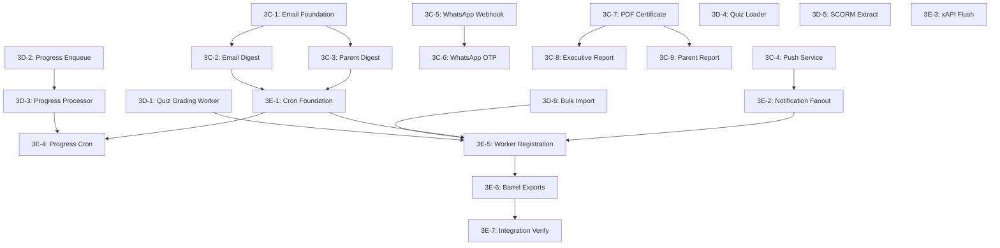

# Agent Task Queue — Phase 3C-3E

<aside>
🤖

**Untuk AI Coding Agents.** Setiap task di bawah adalah **self-contained** — agent tinggal copas kode dan execute. Task harus dikerjakan **berurutan** dalam tiap wave (ada dependency). Setiap task punya:

- **Input:** File yang harus dibaca dulu
- **Output:** File yang harus dibuat/diubah
- **Code:** Kode lengkap siap copas
- **Verify:** Command untuk verifikasi
</aside>

<aside>
📋

**Scope:** 12 Edge Functions + 6 cron jobs + worker architecture = **22 tasks**

**Wave 3C:** Notification/Communication (Tasks 3C-1 → 3C-9) — ~40h

**Wave 3D:** Processing & Misc (Tasks 3D-1 → 3D-6) — ~30h

**Wave 3E:** Background Jobs / Cron + Worker Mesh (Tasks 3E-1 → 3E-7) — ~20h

**Total estimated effort: ~90 jam**

</aside>

<aside>
🚨

**Review Fixes Applied (14 temuan).** Perubahan kritis:

1. **pg_cron conflict** — Task 3E-1 sekarang punya STOP IF untuk disable pg_cron dulu
2. **`WhatsAppText` duplicate** — Unified menjadi satu struct `#[derive(Debug, Serialize, Deserialize)]`
3. **PDF font** — Beralih ke embedded TTF (Noto Sans) untuk Unicode/Indonesian support
4. **`VilError` type** — Ditambahkan catatan: gunakan `AppError` custom type yang sudah didefinisikan di Phase 1A Task Queue, BUKAN assume `vil_server::prelude::VilError`
5. **6-field cron** — xAPI flush dan progress processor beralih ke `tokio::interval` (30s)
6. **Digest stagger** — Parent digest digeser ke `30 10 * * *` (17:30 WIB)
7. **Bulk import users table** — Tambah INSERT ke `public.users` dalam transaction
8. **`retry_count` DEFAULT** — 3D-2 INSERT sekarang include `retry_count DEFAULT 0`
9. **WhatsApp tables** — STOP IF ditambahkan untuk `whatsapp_messages` dan `whatsapp_otps`
10. **Quiz loader tenant scope** — Ditambahkan `AND tenant_id = $2` ke semua queries di 3D-4
11. **Gate 4 checklist** — Ditambahkan sebagai task 3E-8
12. **SCORM limitation** — Documented explicitly di 3D-5
13. **Effort estimates** — Ditambahkan di scope callout
14. **Nginx routes** — Ditambahkan ke task 3E-7
</aside>

---

## Aturan untuk Agent

1. **JANGAN** ubah file di luar scope task (`EDIT ONLY`)
2. **JANGAN** buat custom DLQ table baru — gunakan domain-specific DLQ di DB (quiz grading) atau VIL built-in `DeadLetterQueue` (semua lainnya). Keputusan **FINAL** dari CC7.
3. **Semua teks UI/email** harus Bahasa Indonesia
4. Jalankan `cargo check && cargo clippy -- -D warnings && cargo test` setelah setiap task
5. **JANGAN** ubah `AGENTS.md`, `CLAUDE.md`, `README.md`, `CHANGELOG.md`
6. Cron schedule dalam **UTC** — WIB = UTC+7. Verify timezone conversion eksplisit.
7. Semua handlers pakai **Pattern A (Axum-style)** — lihat Bootstrap Context §2
8. SQL: **JANGAN** `SELECT *` — selalu explicit columns
9. Error format: `{ code, message, details, hint }` (PostgREST compatible)
10. Setiap worker harus punya **retry policy** sesuai Spec 3 §1.2
11. **🛠️ Rollback rule (Gap #9):** Commit SEBELUM mulai task: `git add -A && git commit -m "checkpoint: before task 3C/D/E-XX"`. Jika verify gagal: `git stash`. JANGAN lanjut dengan state setengah jadi.
12. **🛠️ Nginx route update (Gap #5):** Setelah communication endpoints selesai, WAJIB update `nginx.conf` dengan routes: `/api/v1/email/*`, `/api/v1/push/*`, `/api/v1/whatsapp/*`, `/api/v1/pdf/*`. Task 3E-7 sudah address ini.
13. **🛠️ VilError type (Gap #4):** Gunakan `AppError` dari `crates/middleware/src/errors.rs` (Phase 1A-5). Catatan review fix #4 di callout sudah benar — enforce di SEMUA handler.

---

# Wave 3C — Notification/Communication

## Task 3C-1: Email Foundation — Types, Templates & SMTP Client

**TASK ID:** `3C-1`

**OWNER TYPE:** Rust backend agent

**GOAL:** Buat email types, HTML template engine, dan SMTP client wrapper untuk semua email functions

**DEPENDENCY:** Phase 1A scaffold selesai (crates structure exists)

**READ FIRST:**

- `crates/services/src/` — existing service structure
- `supabase/functions/send-email-digest/` — existing Edge Function
- `supabase/functions/send-parent-digest/` — existing Edge Function
- Spec 4 §6 (Email Template Migration)
- Bootstrap Context §14 (Cargo.toml deps)

**EDIT ONLY:**

- `crates/services/src/email/mod.rs` (buat baru)
- `crates/services/src/email/templates.rs` (buat baru)
- `crates/services/src/email/types.rs` (buat baru)
- `crates/services/Cargo.toml` (tambah `lettre` dep)

**DO NOT TOUCH:**

- `crates/api-server/src/main.rs`
- `crates/auth/` — semua file
- `crates/middleware/` — semua file

**IMPLEMENTATION STEPS:**

1. Tambahkan `lettre = "0.11"` ke `crates/services/Cargo.toml`
2. Buat `crates/services/src/email/types.rs` — email types
3. Buat `crates/services/src/email/templates.rs` — HTML templates (Bahasa Indonesia)
4. Buat `crates/services/src/email/mod.rs` — SMTP client wrapper + send function
5. Verify compile

**COPY-PASTE STARTER:**

```rust
// crates/services/src/email/types.rs
use serde::{Deserialize, Serialize};
use uuid::Uuid;

#[derive(Debug, Clone, Serialize, Deserialize)]
pub struct EmailRecipient {
    pub email: String,
    pub name: String,
}

#[derive(Debug, Clone, Serialize, Deserialize)]
pub struct DigestItem {
    pub title: String,
    pub description: String,
    pub url: Option<String>,
    pub timestamp: String,
}

#[derive(Debug, Clone, Serialize, Deserialize)]
pub struct EmailDigestData {
    pub recipient: EmailRecipient,
    pub tenant_id: Uuid,
    pub school_name: String,
    pub items: Vec<DigestItem>,
    pub date: String,
}

#[derive(Debug, Clone, Serialize, Deserialize)]
pub struct ParentDigestData {
    pub parent: EmailRecipient,
    pub tenant_id: Uuid,
    pub school_name: String,
    pub children: Vec<ChildDigestData>,
    pub date: String,
}

#[derive(Debug, Clone, Serialize, Deserialize)]
pub struct ChildDigestData {
    pub child_name: String,
    pub activities: Vec<DigestItem>,
    pub attendance_summary: String,
    pub grade_summary: String,
}

#[derive(Debug, Clone)]
pub enum EmailTemplate {
    Digest(EmailDigestData),
    ParentDigest(ParentDigestData),
    PasswordReset { name: String, action_url: String, school_name: String },
    EmailVerification { name: String, action_url: String, school_name: String },
    TeacherInvitation { name: String, action_url: String, school_name: String, inviter_name: String },
}
```

```rust
// crates/services/src/email/templates.rs
use super::types::*;

pub fn render_template(template: &EmailTemplate) -> (String, String) {
    match template {
        EmailTemplate::Digest(data) => render_digest(data),
        EmailTemplate::ParentDigest(data) => render_parent_digest(data),
        EmailTemplate::PasswordReset { name, action_url, school_name } => {
            render_password_reset(name, action_url, school_name)
        }
        EmailTemplate::EmailVerification { name, action_url, school_name } => {
            render_email_verification(name, action_url, school_name)
        }
        EmailTemplate::TeacherInvitation { name, action_url, school_name, inviter_name } => {
            render_teacher_invitation(name, action_url, school_name, inviter_name)
        }
    }
}

fn base_html(title: &str, body: &str, school_name: &str) -> String {
    format!(
        r#"<!DOCTYPE html>
<html lang="id">
<head><meta charset="UTF-8"><meta name="viewport" content="width=device-width,initial-scale=1.0">
<title>{title}</title>
<style>
  body  font-family: -apple-system, BlinkMacSystemFont, 'Segoe UI', Roboto, sans-serif; margin: 0; padding: 0; background: #f5f5f5;
  .container  max-width: 600px; margin: 0 auto; background: #ffffff; padding: 32px;
  .header  background: #2563eb; color: white; padding: 24px; text-align: center; border-radius: 8px 8px 0 0;
  .content  padding: 24px 0;
  .item  border-left: 3px solid #2563eb; padding: 8px 16px; margin: 12px 0; background: #f8fafc;
  .btn  display: inline-block; background: #2563eb; color: white; padding: 12px 24px; text-decoration: none; border-radius: 6px;
  .footer  text-align: center; color: #6b7280; font-size: 12px; padding: 16px;
</style></head>
<body><div class="container">
  <div class="header"><h2>{school_name} — EduSync</h2></div>
  <div class="content">{body}</div>
  <div class="footer">Dikirim oleh EduSync &copy; 2026. Jangan balas email ini.</div>
</div></body></html>"#,
        title = title, body = body, school_name = school_name
    )
}

fn render_digest(data: &EmailDigestData) -> (String, String) {
    let subject = format!("Ringkasan Harian — {} — {}", data.school_name, data.date);
    let items_html: String = data.items.iter().map(|item| {
        format!(
            r#"<div class="item"><strong>{}</strong><br><span style="color:#6b7280">{}</span><br><small>{}</small></div>"#,
            item.title, item.description, item.timestamp
        )
    }).collect();
    let body = format!(
        "<h3>Halo, {}!</h3><p>Berikut ringkasan aktivitas hari ini:</p>{}",
        data.recipient.name, items_html
    );
    (subject, base_html(&subject, &body, &data.school_name))
}

fn render_parent_digest(data: &ParentDigestData) -> (String, String) {
    let subject = format!("Laporan Harian Anak — {} — {}", data.school_name, data.date);
    let children_html: String = data.children.iter().map(|child| {
        let activities_html: String = child.activities.iter().map(|a| {
            format!(r#"<div class="item"><strong>{}</strong><br>{}</div>"#, a.title, a.description)
        }).collect();
        format!(
            "<h4>{}</h4><p><strong>Kehadiran:</strong> {}</p><p><strong>Nilai:</strong> {}</p>{}",
            child.child_name, child.attendance_summary, child.grade_summary, activities_html
        )
    }).collect();
    let body = format!(
        "<h3>Halo, {}!</h3><p>Berikut perkembangan anak Anda hari ini:</p>{}",
        data.parent.name, children_html
    );
    (subject, base_html(&subject, &body, &data.school_name))
}

fn render_password_reset(name: &str, action_url: &str, school_name: &str) -> (String, String) {
    let subject = format!("{} — Reset Password", school_name);
    let body = format!(
        r#"<h3>Halo, {name}!</h3>
        <p>Kami menerima permintaan reset password untuk akun Anda.</p>
        <p>Klik tombol di bawah untuk membuat password baru (berlaku 1 jam):</p>
        <p style="text-align:center"><a href="{action_url}" class="btn">Reset Password</a></p>
        <p style="color:#6b7280">Jika Anda tidak meminta ini, abaikan email ini.</p>"#
    );
    (subject.clone(), base_html(&subject, &body, school_name))
}

fn render_email_verification(name: &str, action_url: &str, school_name: &str) -> (String, String) {
    let subject = format!("{} — Verifikasi Email", school_name);
    let body = format!(
        r#"<h3>Halo, {name}!</h3>
        <p>Terima kasih telah mendaftar di EduSync.</p>
        <p>Klik tombol di bawah untuk verifikasi email Anda:</p>
        <p style="text-align:center"><a href="{action_url}" class="btn">Verifikasi Email</a></p>"#
    );
    (subject.clone(), base_html(&subject, &body, school_name))
}

fn render_teacher_invitation(name: &str, action_url: &str, school_name: &str, inviter_name: &str) -> (String, String) {
    let subject = format!("{} — Undangan Bergabung", school_name);
    let body = format!(
        r#"<h3>Halo, {name}!</h3>
        <p><strong>{inviter_name}</strong> mengundang Anda untuk bergabung di {school_name} sebagai guru.</p>
        <p>Klik tombol di bawah untuk menerima undangan:</p>
        <p style="text-align:center"><a href="{action_url}" class="btn">Terima Undangan</a></p>"#
    );
    (subject.clone(), base_html(&subject, &body, school_name))
}
```

```rust
// crates/services/src/email/mod.rs
pub mod templates;
pub mod types;

use lettre::{
    message::{header::ContentType, Mailbox},
    transport::smtp::authentication::Credentials,
    Message, SmtpTransport, Transport,
};
use types::EmailRecipient;

#[derive(Clone)]
pub struct EmailClient {
    transport: SmtpTransport,
    from: Mailbox,
}

impl EmailClient {
    pub fn new(smtp_host: &str, smtp_port: u16, username: &str, password: &str, from_email: &str, from_name: &str) -> Result<Self, Box<dyn std::error::Error>> {
        let creds = Credentials::new(username.to_string(), password.to_string());
        let transport = SmtpTransport::relay(smtp_host)?
            .port(smtp_port)
            .credentials(creds)
            .build();
        let from: Mailbox = format!("{} <{}>", from_name, from_email).parse()?;
        Ok(Self { transport, from })
    }

    pub fn send_email(&self, to: &EmailRecipient, subject: &str, html_body: &str) -> Result<(), Box<dyn std::error::Error + Send + Sync>> {
        let to_mailbox: Mailbox = format!("{} <{}>", to.name, to.email).parse()?;
        let email = Message::builder()
            .from(self.from.clone())
            .to(to_mailbox)
            .subject(subject)
            .header(ContentType::TEXT_HTML)
            .body(html_body.to_string())?;
        self.transport.send(&email)?;
        Ok(())
    }

    pub fn send_template(&self, to: &EmailRecipient, template: &templates::types::EmailTemplate) -> Result<(), Box<dyn std::error::Error + Send + Sync>> {
        let (subject, html_body) = templates::render_template(template);
        self.send_email(to, &subject, &html_body)
    }
}
```

**VERIFY:**

```
cd edusync-api
cargo check -p edusync-services
cargo clippy -p edusync-services -- -D warnings
```

**STOP IF:**

- `lettre` crate gagal compile — check versi dan features
- Struct Email types tidak match dengan existing DB schema — BLOCKED, baca `supabase/migrations/`

**OUTPUT FORMAT:** `DONE / BLOCKED / FILES / VERIFY`

---

## Task 3C-2: Email Digest Service (send-email-digest → Rust)

**TASK ID:** `3C-2`

**OWNER TYPE:** Rust backend agent

**GOAL:** Port `send-email-digest` Edge Function ke Rust handler yang query DB dan kirim digest email harian

**DEPENDENCY:** Task 3C-1

**READ FIRST:**

- `supabase/functions/send-email-digest/index.ts` — existing Edge Function
- `crates/services/src/email/` — dari Task 3C-1
- Spec 3 §1.3 (Email digest schedule: Daily 17:00 WIB = 10:00 UTC)

**EDIT ONLY:**

- `crates/services/src/email/digest.rs` (buat baru)
- `crates/services/src/email/mod.rs` (tambah `pub mod digest;`)

**DO NOT TOUCH:**

- `crates/services/src/email/templates.rs`
- `crates/api-server/src/main.rs`

**IMPLEMENTATION STEPS:**

1. Baca existing `send-email-digest` Edge Function untuk memahami query pattern
2. Buat `digest.rs` — query DB untuk activities hari ini per tenant, build digest data, kirim via `EmailClient`
3. Tambah `pub mod digest;` ke `mod.rs`
4. Verify compile

**COPY-PASTE STARTER:**

```rust
// crates/services/src/email/digest.rs
use sqlx::PgPool;
use uuid::Uuid;
use chrono::{Utc, Duration as ChronoDuration};

use super::EmailClient;
use super::types::{EmailDigestData, EmailRecipient, DigestItem, EmailTemplate};
use super::templates;

/// Fetch and send email digests for all users in a tenant
pub async fn send_email_digests_for_tenant(
    pool: &PgPool,
    email_client: &EmailClient,
    tenant_id: Uuid,
) -> Result<u32, Box<dyn std::error::Error + Send + Sync>> {
    let since = Utc::now() - ChronoDuration::hours(24);
    let mut sent_count: u32 = 0;

    // 1. Get school name
    let tenant = sqlx::query_as::<_, TenantRow>(
        r#"SELECT id, name FROM tenants WHERE id = $1"#
    )
    .bind(tenant_id)
    .fetch_one(pool)
    .await?;

    // 2. Get all users with digest enabled for this tenant
    let users = sqlx::query_as::<_, DigestUserRow>(
        r#"SELECT p.id, p.full_name, p.email
           FROM profiles p
           INNER JOIN user_roles ur ON ur.user_id = p.id
           WHERE ur.tenant_id = $1
             AND p.email IS NOT NULL
             AND p.notification_preferences->>'email_digest' != 'false'
           GROUP BY p.id, p.full_name, p.email"#
    )
    .bind(tenant_id)
    .fetch_all(pool)
    .await?;

    for user in &users {
        // 3. Fetch activities for this user in last 24h
        let activities = sqlx::query_as::<_, ActivityRow>(
            r#"SELECT title, description, created_at
               FROM activity_logs
               WHERE tenant_id = $1 AND user_id = $2 AND created_at >= $3
               ORDER BY created_at DESC
               LIMIT 20"#
        )
        .bind(tenant_id)
        .bind(user.id)
        .bind(since)
        .fetch_all(pool)
        .await?;

        if activities.is_empty() {
            continue; // Skip users with no activity
        }

        let items: Vec<DigestItem> = activities.iter().map(|a| DigestItem {
            title: a.title.clone(),
            description: a.description.clone().unwrap_or_default(),
            url: None,
            timestamp: a.created_at.format("%H:%M WIB").to_string(),
        }).collect();

        let digest_data = EmailDigestData {
            recipient: EmailRecipient {
                email: user.email.clone(),
                name: user.full_name.clone(),
            },
            tenant_id,
            school_name: tenant.name.clone(),
            items,
            date: Utc::now().format("%d %B %Y").to_string(),
        };

        let template = EmailTemplate::Digest(digest_data.clone());
        match email_client.send_template(&digest_data.recipient, &template) {
            Ok(()) => sent_count += 1,
            Err(e) => {
                vil_log::vil_error!("Failed to send digest email",
                    user_id = %user.id,
                    tenant_id = %tenant_id,
                    error = %e,
                );
            }
        }
    }

    Ok(sent_count)
}

/// Send digests for ALL tenants (called by cron)
pub async fn send_all_email_digests(
    pool: &PgPool,
    email_client: &EmailClient,
) -> Result<u32, Box<dyn std::error::Error + Send + Sync>> {
    let tenants = sqlx::query_scalar::<_, Uuid>(
        r#"SELECT id FROM tenants WHERE is_active = true"#
    )
    .fetch_all(pool)
    .await?;

    let mut total_sent: u32 = 0;
    for tenant_id in tenants {
        match send_email_digests_for_tenant(pool, email_client, tenant_id).await {
            Ok(count) => total_sent += count,
            Err(e) => {
                vil_log::vil_error!("Digest failed for tenant",
                    tenant_id = %tenant_id,
                    error = %e,
                );
            }
        }
    }

    vil_log::vil_info!("Email digests sent", total = total_sent);
    Ok(total_sent)
}

// --- DB row types ---
#[derive(Debug, sqlx::FromRow)]
struct TenantRow {
    id: Uuid,
    name: String,
}

#[derive(Debug, sqlx::FromRow)]
struct DigestUserRow {
    id: Uuid,
    full_name: String,
    email: String,
}

#[derive(Debug, sqlx::FromRow)]
struct ActivityRow {
    title: String,
    description: Option<String>,
    created_at: chrono::DateTime<Utc>,
}
```

**VERIFY:**

```
cargo check -p edusync-services
cargo clippy -p edusync-services -- -D warnings
```

**STOP IF:**

- `activity_logs` table tidak ada atau schema berbeda — BLOCKED, audit `supabase/migrations/`
- `notification_preferences` JSONB column tidak ada di `profiles` — BLOCKED, check schema

**OUTPUT FORMAT:** `DONE / BLOCKED / FILES / VERIFY`

---

## Task 3C-3: Parent Digest Service (send-parent-digest → Rust)

**TASK ID:** `3C-3`

**OWNER TYPE:** Rust backend agent

**GOAL:** Port `send-parent-digest` Edge Function ke Rust — query child activities, grades, attendance, kirim digest ke parent

**DEPENDENCY:** Task 3C-1

**READ FIRST:**

- `supabase/functions/send-parent-digest/index.ts` — existing Edge Function
- `crates/services/src/email/` — dari Task 3C-1
- Spec 3 §1.3 (Parent digest: Daily 17:00 WIB)

**EDIT ONLY:**

- `crates/services/src/email/parent_digest.rs` (buat baru)
- `crates/services/src/email/mod.rs` (tambah `pub mod parent_digest;`)

**DO NOT TOUCH:**

- `crates/services/src/email/digest.rs`
- `crates/services/src/email/templates.rs`

**IMPLEMENTATION STEPS:**

1. Baca existing `send-parent-digest` Edge Function
2. Buat `parent_digest.rs` — query DB untuk linked children, their activities, attendance, grades
3. Build `ParentDigestData`, kirim via `EmailClient`
4. Verify compile

**COPY-PASTE STARTER:**

```rust
// crates/services/src/email/parent_digest.rs
use sqlx::PgPool;
use uuid::Uuid;
use chrono::{Utc, Duration as ChronoDuration};

use super::EmailClient;
use super::types::{ParentDigestData, ChildDigestData, EmailRecipient, DigestItem, EmailTemplate};
use super::templates;

pub async fn send_parent_digests_for_tenant(
    pool: &PgPool,
    email_client: &EmailClient,
    tenant_id: Uuid,
) -> Result<u32, Box<dyn std::error::Error + Send + Sync>> {
    let since = Utc::now() - ChronoDuration::hours(24);
    let mut sent_count: u32 = 0;

    let tenant = sqlx::query_scalar::<_, String>(
        r#"SELECT name FROM tenants WHERE id = $1"#
    ).bind(tenant_id).fetch_one(pool).await?;

    // Get all parents with linked children in this tenant
    let parents = sqlx::query_as::<_, ParentRow>(
        r#"SELECT DISTINCT p.id, p.full_name, p.email
           FROM profiles p
           INNER JOIN user_roles ur ON ur.user_id = p.id
           INNER JOIN parent_student_links psl ON psl.parent_id = p.id
           WHERE ur.tenant_id = $1
             AND ur.role = 'parent'
             AND p.email IS NOT NULL"#
    ).bind(tenant_id).fetch_all(pool).await?;

    for parent in &parents {
        // Get linked children
        let children = sqlx::query_as::<_, ChildRow>(
            r#"SELECT s.id, s.full_name
               FROM profiles s
               INNER JOIN parent_student_links psl ON psl.student_id = s.id
               WHERE psl.parent_id = $1"#
        ).bind(parent.id).fetch_all(pool).await?;

        let mut child_digests = Vec::new();
        for child in &children {
            // Activities
            let activities = sqlx::query_as::<_, ActivityRow>(
                r#"SELECT title, description, created_at
                   FROM activity_logs
                   WHERE user_id = $1 AND tenant_id = $2 AND created_at >= $3
                   ORDER BY created_at DESC LIMIT 10"#
            ).bind(child.id).bind(tenant_id).bind(since)
            .fetch_all(pool).await.unwrap_or_default();

            // Attendance summary
            let attendance = sqlx::query_as::<_, AttendanceSummaryRow>(
                r#"SELECT
                     COUNT(*) FILTER (WHERE status = 'present') as present_count,
                     COUNT(*) FILTER (WHERE status = 'absent') as absent_count,
                     COUNT(*) as total_count
                   FROM attendance
                   WHERE student_id = $1 AND tenant_id = $2 AND date >= $3::date"#
            ).bind(child.id).bind(tenant_id).bind(since)
            .fetch_optional(pool).await?.unwrap_or_default();

            // Recent grades
            let grade_avg = sqlx::query_scalar::<_, Option<f64>>(
                r#"SELECT AVG(score) FROM quiz_submissions
                   WHERE student_id = $1 AND tenant_id = $2
                     AND submitted_at >= $3 AND status = 'graded'"#
            ).bind(child.id).bind(tenant_id).bind(since)
            .fetch_one(pool).await.unwrap_or(None);

            let items: Vec<DigestItem> = activities.iter().map(|a| DigestItem {
                title: a.title.clone(),
                description: a.description.clone().unwrap_or_default(),
                url: None,
                timestamp: a.created_at.format("%H:%M").to_string(),
            }).collect();

            child_digests.push(ChildDigestData {
                child_name: child.full_name.clone(),
                activities: items,
                attendance_summary: format!(
                    "Hadir: {}/{}",
                    attendance.present_count, attendance.total_count
                ),
                grade_summary: match grade_avg {
                    Some(avg) => format!("Rata-rata nilai: {:.1}", avg),
                    None => "Belum ada nilai hari ini".to_string(),
                },
            });
        }

        if child_digests.iter().all(|c| c.activities.is_empty()) {
            continue;
        }

        let data = ParentDigestData {
            parent: EmailRecipient {
                email: parent.email.clone(),
                name: parent.full_name.clone(),
            },
            tenant_id,
            school_name: tenant.clone(),
            children: child_digests,
            date: Utc::now().format("%d %B %Y").to_string(),
        };

        let template = EmailTemplate::ParentDigest(data.clone());
        match email_client.send_template(&data.parent, &template) {
            Ok(()) => sent_count += 1,
            Err(e) => {
                vil_log::vil_error!("Failed to send parent digest",
                    parent_id = %parent.id, error = %e,
                );
            }
        }
    }

    Ok(sent_count)
}

pub async fn send_all_parent_digests(
    pool: &PgPool,
    email_client: &EmailClient,
) -> Result<u32, Box<dyn std::error::Error + Send + Sync>> {
    let tenants = sqlx::query_scalar::<_, Uuid>(
        r#"SELECT id FROM tenants WHERE is_active = true"#
    ).fetch_all(pool).await?;

    let mut total = 0u32;
    for tid in tenants {
        match send_parent_digests_for_tenant(pool, email_client, tid).await {
            Ok(c) => total += c,
            Err(e) => vil_log::vil_error!("Parent digest failed", tenant_id = %tid, error = %e),
        }
    }
    vil_log::vil_info!("Parent digests sent", total = total);
    Ok(total)
}

// --- DB row types ---
#[derive(Debug, sqlx::FromRow)]
struct ParentRow { id: Uuid, full_name: String, email: String }

#[derive(Debug, sqlx::FromRow)]
struct ChildRow { id: Uuid, full_name: String }

#[derive(Debug, sqlx::FromRow)]
struct ActivityRow { title: String, description: Option<String>, created_at: chrono::DateTime<Utc> }

#[derive(Debug, Default, sqlx::FromRow)]
struct AttendanceSummaryRow {
    present_count: i64,
    absent_count: i64,
    total_count: i64,
}
```

**VERIFY:**

```
cargo check -p edusync-services
cargo clippy -p edusync-services -- -D warnings
```

**STOP IF:**

- `parent_student_links` table tidak ada — BLOCKED, audit schema
- `attendance` table schema berbeda — BLOCKED, audit schema

**OUTPUT FORMAT:** `DONE / BLOCKED / FILES / VERIFY`

---

## Task 3C-4: Push Notification Service (send-push → Rust)

**TASK ID:** `3C-4`

**OWNER TYPE:** Rust backend agent

**GOAL:** Port `send-push` Edge Function ke Rust handler via `web-push` crate (VAPID key di `VITE_VAPID_PUBLIC_KEY`)

**DEPENDENCY:** Phase 1A scaffold selesai

**READ FIRST:**

- `supabase/functions/send-push/index.ts` — existing Edge Function
- Bootstrap Context §14 (Cargo.toml)
- Spec 3 §1.2 (Notification fanout: 10s max, 2x retry, log+skip DLQ)

**EDIT ONLY:**

- `crates/services/src/push/mod.rs` (buat baru)
- `crates/services/src/push/types.rs` (buat baru)
- `crates/services/Cargo.toml` (tambah `web-push` dep)

**DO NOT TOUCH:**

- `crates/services/src/email/` — semua file
- `crates/api-server/src/main.rs`

**IMPLEMENTATION STEPS:**

1. Tambahkan `web-push = "0.10"` ke `Cargo.toml`
2. Buat push types + client wrapper
3. Buat function untuk send push ke user berdasarkan subscription di DB
4. Verify compile

**COPY-PASTE STARTER:**

```rust
// crates/services/src/push/types.rs
use serde::{Deserialize, Serialize};
use uuid::Uuid;

#[derive(Debug, Clone, Serialize, Deserialize)]
pub struct PushPayload {
    pub title: String,
    pub body: String,
    pub icon: Option<String>,
    pub url: Option<String>,
    pub tag: Option<String>,
}

#[derive(Debug, Clone, Serialize, Deserialize, sqlx::FromRow)]
pub struct PushSubscriptionRow {
    pub id: Uuid,
    pub user_id: Uuid,
    pub endpoint: String,
    pub p256dh_key: String,
    pub auth_key: String,
}
```

```rust
// crates/services/src/push/mod.rs
pub mod types;

use types::{PushPayload, PushSubscriptionRow};
use web_push::{
    ContentEncoding, SubscriptionInfo, VapidSignatureBuilder,
    WebPushClient, WebPushMessageBuilder,
};
use sqlx::PgPool;
use uuid::Uuid;

#[derive(Clone)]
pub struct PushService {
    client: WebPushClient,
    vapid_private_key: Vec<u8>,
}

impl PushService {
    pub fn new(vapid_private_key_pem: &str) -> Result<Self, Box<dyn std::error::Error>> {
        let client = WebPushClient::new()?;
        let vapid_private_key = vapid_private_key_pem.as_bytes().to_vec();
        Ok(Self { client, vapid_private_key })
    }

    pub async fn send_to_user(
        &self,
        pool: &PgPool,
        user_id: Uuid,
        payload: &PushPayload,
    ) -> Result<u32, Box<dyn std::error::Error + Send + Sync>> {
        let subscriptions = sqlx::query_as::<_, PushSubscriptionRow>(
            r#"SELECT id, user_id, endpoint, p256dh_key, auth_key
               FROM push_subscriptions
               WHERE user_id = $1"#
        )
        .bind(user_id)
        .fetch_all(pool)
        .await?;

        let payload_json = serde_json::to_string(payload)?;
        let mut sent = 0u32;

        for sub in &subscriptions {
            match self.send_single(sub, &payload_json).await {
                Ok(()) => sent += 1,
                Err(e) => {
                    vil_log::vil_warn!("Push failed, removing stale subscription",
                        subscription_id = %sub.id, error = %e,
                    );
                    // Remove stale subscription (410 Gone)
                    sqlx::query("DELETE FROM push_subscriptions WHERE id = $1")
                        .bind(sub.id)
                        .execute(pool)
                        .await
                        .ok();
                }
            }
        }

        Ok(sent)
    }

    async fn send_single(
        &self,
        sub: &PushSubscriptionRow,
        payload_json: &str,
    ) -> Result<(), Box<dyn std::error::Error + Send + Sync>> {
        let subscription_info = SubscriptionInfo::new(
            &sub.endpoint,
            &sub.p256dh_key,
            &sub.auth_key,
        )?;

        let sig_builder = VapidSignatureBuilder::from_pem(
            &mut self.vapid_private_key.as_slice(),
            &subscription_info,
        )?
        .build()?;

        let mut builder = WebPushMessageBuilder::new(&subscription_info);
        builder.set_payload(ContentEncoding::Aes128Gcm, payload_json.as_bytes());
        builder.set_vapid_signature(sig_builder);

        let message = builder.build()?;
        self.client.send(message).await?;
        Ok(())
    }

    /// Send push to multiple users (notification fanout)
    pub async fn send_to_users(
        &self,
        pool: &PgPool,
        user_ids: &[Uuid],
        payload: &PushPayload,
    ) -> u32 {
        let mut total = 0u32;
        for user_id in user_ids {
            match self.send_to_user(pool, *user_id, payload).await {
                Ok(c) => total += c,
                Err(e) => {
                    vil_log::vil_warn!("Push fanout failed for user",
                        user_id = %user_id, error = %e,
                    );
                }
            }
        }
        total
    }
}
```

**VERIFY:**

```
cargo check -p edusync-services
cargo clippy -p edusync-services -- -D warnings
```

**STOP IF:**

- `push_subscriptions` table tidak ada — BLOCKED, audit schema
- `web-push` crate version mismatch — try `0.9` or latest

**OUTPUT FORMAT:** `DONE / BLOCKED / FILES / VERIFY`

---

## Task 3C-5: WhatsApp Webhook Handler (whatsapp-webhook → Rust)

**TASK ID:** `3C-5`

**OWNER TYPE:** Rust backend agent

**GOAL:** Port `whatsapp-webhook` Edge Function ke Rust endpoint — handle incoming WhatsApp messages

**DEPENDENCY:** Phase 1A scaffold selesai

**READ FIRST:**

- `supabase/functions/whatsapp-webhook/index.ts` — existing Edge Function
- Bootstrap Context §2 (Handler pattern)

**EDIT ONLY:**

- `crates/services/src/whatsapp/mod.rs` (buat baru)
- `crates/services/src/whatsapp/types.rs` (buat baru)
- `crates/services/src/whatsapp/webhook.rs` (buat baru)

**DO NOT TOUCH:**

- `crates/services/src/email/`
- `crates/services/src/push/`

**IMPLEMENTATION STEPS:**

1. Buat WhatsApp types (webhook payload, message types)
2. Buat webhook verification handler (GET — challenge response)
3. Buat incoming message handler (POST)
4. Verify compile

**COPY-PASTE STARTER:**

```rust
// crates/services/src/whatsapp/types.rs
use serde::{Deserialize, Serialize};

#[derive(Debug, Deserialize)]
pub struct WhatsAppWebhookPayload {
    pub object: String,
    pub entry: Vec<WhatsAppEntry>,
}

#[derive(Debug, Deserialize)]
pub struct WhatsAppEntry {
    pub id: String,
    pub changes: Vec<WhatsAppChange>,
}

#[derive(Debug, Deserialize)]
pub struct WhatsAppChange {
    pub value: WhatsAppChangeValue,
    pub field: String,
}

#[derive(Debug, Deserialize)]
pub struct WhatsAppChangeValue {
    pub messaging_product: Option<String>,
    pub messages: Option<Vec<WhatsAppMessage>>,
    pub statuses: Option<Vec<WhatsAppStatus>>,
}

#[derive(Debug, Deserialize)]
pub struct WhatsAppMessage {
    pub from: String,
    pub id: String,
    pub timestamp: String,
    #[serde(rename = "type")]
    pub msg_type: String,
    pub text: Option<WhatsAppText>,
}

#[derive(Debug, Deserialize)]
pub struct WhatsAppText {
    pub body: String,
}

#[derive(Debug, Deserialize)]
pub struct WhatsAppStatus {
    pub id: String,
    pub status: String,
    pub timestamp: String,
}

#[derive(Debug, Serialize)]
pub struct WhatsAppSendRequest {
    pub messaging_product: String,
    pub to: String,
    pub r#type: String,
    pub template: Option<WhatsAppTemplate>,
    pub text: Option<WhatsAppText>,
}

#[derive(Debug, Serialize)]
pub struct WhatsAppTemplate {
    pub name: String,
    pub language: WhatsAppTemplateLanguage,
    pub components: Vec<WhatsAppTemplateComponent>,
}

#[derive(Debug, Serialize)]
pub struct WhatsAppTemplateLanguage {
    pub code: String,
}

#[derive(Debug, Serialize)]
pub struct WhatsAppTemplateComponent {
    pub r#type: String,
    pub parameters: Vec<WhatsAppTemplateParameter>,
}

#[derive(Debug, Serialize)]
pub struct WhatsAppTemplateParameter {
    pub r#type: String,
    pub text: Option<String>,
}

// NOTE: WhatsAppText unified — satu struct untuk incoming + outgoing
#[derive(Debug, Clone, Serialize, Deserialize)]
pub struct WhatsAppText {
    pub body: String,
}
```

```rust
// crates/services/src/whatsapp/webhook.rs
use axum::extract::{Json, Query, State};
use axum::response::IntoResponse;
use serde::Deserialize;

use super::types::WhatsAppWebhookPayload;
use crate::AppState;

#[derive(Deserialize)]
pub struct VerifyQuery {
    #[serde(rename = "hub.mode")]
    pub hub_mode: Option<String>,
    #[serde(rename = "hub.verify_token")]
    pub hub_verify_token: Option<String>,
    #[serde(rename = "hub.challenge")]
    pub hub_challenge: Option<String>,
}

/// GET /api/v1/webhooks/whatsapp — Verification
pub async fn verify_webhook(
    State(state): State<AppState>,
    Query(params): Query<VerifyQuery>,
) -> impl IntoResponse {
    if params.hub_mode.as_deref() == Some("subscribe")
        && params.hub_verify_token.as_deref() == Some(&state.whatsapp_verify_token)
    {
        params.hub_challenge.unwrap_or_default()
    } else {
        "Forbidden".to_string()
    }
}

/// POST /api/v1/webhooks/whatsapp — Incoming messages
pub async fn handle_webhook(
    State(state): State<AppState>,
    Json(payload): Json<WhatsAppWebhookPayload>,
) -> impl IntoResponse {
    for entry in &payload.entry {
        for change in &entry.changes {
            if let Some(messages) = &change.value.messages {
                for msg in messages {
                    if let Err(e) = process_incoming_message(&state, msg).await {
                        vil_log::vil_error!("WhatsApp message processing failed",
                            from = %msg.from, error = %e,
                        );
                    }
                }
            }
        }
    }
    "OK"
}

async fn process_incoming_message(
    state: &AppState,
    msg: &super::types::WhatsAppMessage,
) -> Result<(), Box<dyn std::error::Error + Send + Sync>> {
    let phone = &msg.from;
    let text = msg.text.as_ref().map(|t| t.body.as_str()).unwrap_or("");

    vil_log::vil_info!("WhatsApp message received", from = %phone, type_ = %msg.msg_type);

    // Look up parent by phone number
    let parent = sqlx::query_as::<_, ParentPhoneRow>(
        r#"SELECT id, full_name, tenant_id FROM profiles WHERE phone = $1"#
    )
    .bind(phone)
    .fetch_optional(&state.db)
    .await?;

    if let Some(parent) = parent {
        // Store message for parent-teacher messaging
        sqlx::query(
            r#"INSERT INTO whatsapp_messages (from_phone, parent_id, tenant_id, body, received_at)
               VALUES ($1, $2, $3, $4, NOW())"#
        )
        .bind(phone)
        .bind(parent.id)
        .bind(parent.tenant_id)
        .bind(text)
        .execute(&state.db)
        .await?;
    }

    Ok(())
}

#[derive(sqlx::FromRow)]
struct ParentPhoneRow {
    id: uuid::Uuid,
    full_name: String,
    tenant_id: uuid::Uuid,
}
```

```rust
// crates/services/src/whatsapp/mod.rs
pub mod types;
pub mod webhook;

use reqwest::Client;
use types::{WhatsAppSendRequest, WhatsAppText};

#[derive(Clone)]
pub struct WhatsAppClient {
    client: Client,
    api_url: String,
    access_token: String,
}

impl WhatsAppClient {
    pub fn new(phone_number_id: &str, access_token: &str) -> Self {
        Self {
            client: Client::new(),
            api_url: format!("https://graph.facebook.com/v18.0/{}/messages", phone_number_id),
            access_token: access_token.to_string(),
        }
    }

    pub async fn send_text(&self, to: &str, body: &str) -> Result<(), Box<dyn std::error::Error + Send + Sync>> {
        let payload = WhatsAppSendRequest {
            messaging_product: "whatsapp".to_string(),
            to: to.to_string(),
            r#type: "text".to_string(),
            template: None,
            text: Some(WhatsAppText { body: body.to_string() }),
        };
        self.client.post(&self.api_url)
            .bearer_auth(&self.access_token)
            .json(&payload)
            .send().await?
            .error_for_status()?;
        Ok(())
    }
}
```

**VERIFY:**

```
cargo check -p edusync-services
cargo clippy -p edusync-services -- -D warnings
```

**STOP IF:**

- WhatsApp Business API credentials undefined — BLOCKED, need env vars
- `whatsapp_messages` table tidak ada — buat migration atau BLOCKED

**OUTPUT FORMAT:** `DONE / BLOCKED / FILES / VERIFY`

---

## Task 3C-6: WhatsApp OTP Sender (send-parent-otp → Rust)

**TASK ID:** `3C-6`

**OWNER TYPE:** Rust backend agent

**GOAL:** Port `send-parent-otp` Edge Function ke Rust — generate OTP, send via WhatsApp

**DEPENDENCY:** Task 3C-5

**READ FIRST:**

- `supabase/functions/send-parent-otp/index.ts`
- `crates/services/src/whatsapp/mod.rs` — dari Task 3C-5

**EDIT ONLY:**

- `crates/services/src/whatsapp/otp.rs` (buat baru)
- `crates/services/src/whatsapp/mod.rs` (tambah `pub mod otp;`)

**DO NOT TOUCH:**

- `crates/services/src/whatsapp/webhook.rs`
- `crates/services/src/email/`

**COPY-PASTE STARTER:**

```rust
// crates/services/src/whatsapp/otp.rs
use axum::extract::{Json, State};
use rand::Rng;
use serde::{Deserialize, Serialize};
use sqlx::PgPool;
use uuid::Uuid;
use chrono::{Utc, Duration as ChronoDuration};

use super::WhatsAppClient;
use crate::AppState;

#[derive(Debug, Deserialize)]
pub struct SendOtpRequest {
    pub phone: String,
    pub tenant_id: Uuid,
}

#[derive(Debug, Serialize)]
pub struct SendOtpResponse {
    pub success: bool,
    pub message: String,
}

/// POST /api/v1/whatsapp/send-otp
pub async fn send_parent_otp(
    State(state): State<AppState>,
    Json(body): Json<SendOtpRequest>,
) -> Result<Json<SendOtpResponse>, vil_server::prelude::VilError> {
    // 1. Generate 6-digit OTP
    let otp_code: String = format!("{:06}", rand::thread_rng().gen_range(0..999999));

    // 2. Store OTP in DB (expires in 5 minutes)
    let expires_at = Utc::now() + ChronoDuration::minutes(5);
    sqlx::query(
        r#"INSERT INTO whatsapp_otps (phone, otp_code, tenant_id, expires_at, used)
           VALUES ($1, $2, $3, $4, false)
           ON CONFLICT (phone, tenant_id) WHERE used = false
           DO UPDATE SET otp_code = $2, expires_at = $4"#
    )
    .bind(&body.phone)
    .bind(&otp_code)
    .bind(body.tenant_id)
    .bind(expires_at)
    .execute(&state.db)
    .await
    .map_err(|e| vil_server::prelude::VilError::internal(e.to_string()))?;

    // 3. Send OTP via WhatsApp
    let message = format!(
        "Kode verifikasi EduSync Anda: {}\nBerlaku 5 menit. Jangan bagikan kode ini.",
        otp_code
    );

    if let Some(wa_client) = &state.whatsapp_client {
        wa_client.send_text(&body.phone, &message).await
            .map_err(|e| {
                vil_log::vil_error!("WhatsApp OTP send failed", phone = %body.phone, error = %e);
                vil_server::prelude::VilError::internal("Gagal mengirim OTP")
            })?;
    } else {
        vil_log::vil_warn!("WhatsApp client not configured, OTP not sent", phone = %body.phone);
    }

    // 4. Always return success (prevent phone enumeration)
    Ok(Json(SendOtpResponse {
        success: true,
        message: "Kode OTP telah dikirim".to_string(),
    }))
}

/// POST /api/v1/whatsapp/verify-otp
pub async fn verify_parent_otp(
    State(state): State<AppState>,
    Json(body): Json<VerifyOtpRequest>,
) -> Result<Json<VerifyOtpResponse>, vil_server::prelude::VilError> {
    let result = sqlx::query_as::<_, OtpRow>(
        r#"SELECT id, otp_code, expires_at
           FROM whatsapp_otps
           WHERE phone = $1 AND tenant_id = $2 AND used = false
           ORDER BY created_at DESC LIMIT 1"#
    )
    .bind(&body.phone)
    .bind(body.tenant_id)
    .fetch_optional(&state.db)
    .await
    .map_err(|e| vil_server::prelude::VilError::internal(e.to_string()))?;

    match result {
        Some(otp) if otp.otp_code == body.otp_code && otp.expires_at > Utc::now() => {
            // Mark OTP as used
            sqlx::query("UPDATE whatsapp_otps SET used = true WHERE id = $1")
                .bind(otp.id).execute(&state.db).await.ok();
            Ok(Json(VerifyOtpResponse { valid: true, message: "Verifikasi berhasil".to_string() }))
        }
        _ => Ok(Json(VerifyOtpResponse { valid: false, message: "Kode OTP tidak valid atau sudah kadaluarsa".to_string() })),
    }
}

#[derive(Debug, Deserialize)]
pub struct VerifyOtpRequest {
    pub phone: String,
    pub otp_code: String,
    pub tenant_id: Uuid,
}

#[derive(Debug, Serialize)]
pub struct VerifyOtpResponse {
    pub valid: bool,
    pub message: String,
}

#[derive(sqlx::FromRow)]
struct OtpRow {
    id: Uuid,
    otp_code: String,
    expires_at: chrono::DateTime<Utc>,
}
```

**VERIFY:**

```
cargo check -p edusync-services
cargo clippy -p edusync-services -- -D warnings
```

**STOP IF:**

- `whatsapp_otps` table tidak ada — buat migration dulu
- WhatsApp Business API belum configured — task tetap DONE, runtime skip via `Option<WhatsAppClient>`

**OUTPUT FORMAT:** `DONE / BLOCKED / FILES / VERIFY`

---

## Task 3C-7: PDF Certificate Generation (generate-pdf → Rust)

**TASK ID:** `3C-7`

**OWNER TYPE:** Rust backend agent

**GOAL:** Port `generate-pdf` Edge Function ke Rust — generate certificate PDF

**DEPENDENCY:** Phase 1A scaffold selesai

<aside>
⚠️

**REVIEW FIX #3:** `BuiltinFont::Helvetica` hanya support basic Latin. Untuk Indonesian names/diacritics dan Unicode, agent HARUS embed TTF font (e.g., Noto Sans). Download `NotoSans-Regular.ttf` + `NotoSans-Bold.ttf` ke `crates/services/assets/fonts/` dan gunakan `doc.add_external_font()` instead of `add_builtin_font()`. Juga, long names harus di-truncate atau font size di-scale down jika text melebihi page width.

</aside>

**READ FIRST:**

- `supabase/functions/generate-pdf/index.ts`
- Bootstrap Context §14 (`printpdf = "0.7"`)

**EDIT ONLY:**

- `crates/services/src/pdf/mod.rs` (buat baru)
- `crates/services/src/pdf/certificate.rs` (buat baru)
- `crates/services/Cargo.toml` (tambah `printpdf` dep)

**DO NOT TOUCH:**

- `crates/services/src/email/`
- `crates/services/src/push/`
- `crates/services/src/whatsapp/`

**COPY-PASTE STARTER:**

```rust
// crates/services/src/pdf/certificate.rs
use printpdf::*;
use std::io::BufWriter;

pub struct CertificateData {
    pub student_name: String,
    pub course_name: String,
    pub school_name: String,
    pub completion_date: String,
    pub certificate_number: String,
}

pub fn generate_certificate(data: &CertificateData) -> Result<Vec<u8>, Box<dyn std::error::Error + Send + Sync>> {
    // A4 Landscape: 297mm x 210mm
    let (doc, page1, layer1) = PdfDocument::new(
        &format!("Sertifikat - {}", data.student_name),
        Mm(297.0),
        Mm(210.0),
        "Layer 1",
    );

    let current_layer = doc.get_page(page1).get_layer(layer1);

    // Border
    let border_color = Color::Rgb(Rgb::new(0.15, 0.39, 0.92, None)); // #2563eb
    current_layer.set_outline_color(border_color.clone());
    current_layer.set_outline_thickness(3.0);
    let border = Line {
        points: vec![
            (Point::new(Mm(10.0), Mm(10.0)), false),
            (Point::new(Mm(287.0), Mm(10.0)), false),
            (Point::new(Mm(287.0), Mm(200.0)), false),
            (Point::new(Mm(10.0), Mm(200.0)), false),
        ],
        is_closed: true,
        has_fill: false,
        has_stroke: true,
        is_clipping_path: false,
    };
    current_layer.add_shape(border);

    // Use built-in font
    let font_bold = doc.add_builtin_font(BuiltinFont::HelveticaBold)?;
    let font_regular = doc.add_builtin_font(BuiltinFont::Helvetica)?;

    // Title: "SERTIFIKAT"
    current_layer.use_text("SERTIFIKAT", 36.0, Mm(98.0), Mm(170.0), &font_bold);

    // Subtitle
    current_layer.use_text("Diberikan kepada:", 14.0, Mm(115.0), Mm(145.0), &font_regular);

    // Student name
    current_layer.use_text(&data.student_name, 28.0, Mm(80.0), Mm(125.0), &font_bold);

    // Course
    current_layer.use_text(
        &format!("Telah menyelesaikan kursus: {}", data.course_name),
        14.0, Mm(70.0), Mm(100.0), &font_regular,
    );

    // School
    current_layer.use_text(&data.school_name, 16.0, Mm(110.0), Mm(80.0), &font_bold);

    // Date + certificate number
    current_layer.use_text(
        &format!("Tanggal: {}   |   No: {}", data.completion_date, data.certificate_number),
        10.0, Mm(85.0), Mm(30.0), &font_regular,
    );

    // Save to bytes
    let mut buf = BufWriter::new(Vec::new());
    doc.save(&mut buf)?;
    Ok(buf.into_inner()?)
}
```

```rust
// crates/services/src/pdf/mod.rs
pub mod certificate;

use axum::extract::{Json, State};
use axum::response::IntoResponse;
use axum::http::header;
use serde::Deserialize;
use uuid::Uuid;

use crate::AppState;
use certificate::{generate_certificate, CertificateData};

#[derive(Debug, Deserialize)]
pub struct GenerateCertificateRequest {
    pub student_id: Uuid,
    pub course_id: Uuid,
    pub tenant_id: Uuid,
}

/// POST /api/v1/pdf/certificate
pub async fn handle_generate_certificate(
    State(state): State<AppState>,
    Json(body): Json<GenerateCertificateRequest>,
) -> Result<impl IntoResponse, vil_server::prelude::VilError> {
    // Fetch data from DB
    let row = sqlx::query_as::<_, CertRow>(
        r#"SELECT
             p.full_name as student_name,
             c.title as course_name,
             t.name as school_name,
             cert.completed_at,
             cert.certificate_number
           FROM certificates cert
           JOIN profiles p ON p.id = cert.student_id
           JOIN courses c ON c.id = cert.course_id
           JOIN tenants t ON t.id = cert.tenant_id
           WHERE cert.student_id = $1 AND cert.course_id = $2 AND cert.tenant_id = $3"#
    )
    .bind(body.student_id)
    .bind(body.course_id)
    .bind(body.tenant_id)
    .fetch_one(&state.db)
    .await
    .map_err(|_| vil_server::prelude::VilError::not_found("Sertifikat tidak ditemukan"))?;

    let pdf_bytes = generate_certificate(&CertificateData {
        student_name: row.student_name,
        course_name: row.course_name,
        school_name: row.school_name,
        completion_date: row.completed_at.format("%d %B %Y").to_string(),
        certificate_number: row.certificate_number,
    }).map_err(|e| vil_server::prelude::VilError::internal(e.to_string()))?;

    Ok((
        [
            (header::CONTENT_TYPE, "application/pdf"),
            (header::CONTENT_DISPOSITION, "attachment; filename=\"sertifikat.pdf\""),
        ],
        pdf_bytes,
    ))
}

#[derive(sqlx::FromRow)]
struct CertRow {
    student_name: String,
    course_name: String,
    school_name: String,
    completed_at: chrono::DateTime<chrono::Utc>,
    certificate_number: String,
}
```

**VERIFY:**

```
cargo check -p edusync-services
cargo clippy -p edusync-services -- -D warnings
```

**STOP IF:**

- `certificates` table schema berbeda — BLOCKED, audit schema
- `printpdf` render issue — try `genpdf` crate sebagai alternatif

**OUTPUT FORMAT:** `DONE / BLOCKED / FILES / VERIFY`

---

## Task 3C-8: PDF Executive Report (generate-executive-report → Rust)

**TASK ID:** `3C-8`

**OWNER TYPE:** Rust backend agent

**GOAL:** Port `generate-executive-report` Edge Function — generate principal dashboard PDF

**DEPENDENCY:** Task 3C-7

**READ FIRST:**

- `supabase/functions/generate-executive-report/index.ts`
- `crates/services/src/pdf/mod.rs` — dari Task 3C-7

**EDIT ONLY:**

- `crates/services/src/pdf/executive_report.rs` (buat baru)
- `crates/services/src/pdf/mod.rs` (tambah `pub mod executive_report;` + handler)

**DO NOT TOUCH:**

- `crates/services/src/pdf/certificate.rs`

**COPY-PASTE STARTER:**

```rust
// crates/services/src/pdf/executive_report.rs
use printpdf::*;
use std::io::BufWriter;
use serde::{Deserialize, Serialize};

#[derive(Debug, Serialize, Deserialize)]
pub struct ExecutiveReportData {
    pub school_name: String,
    pub report_period: String,
    pub total_students: i64,
    pub total_teachers: i64,
    pub total_courses: i64,
    pub active_users_percentage: f64,
    pub avg_quiz_score: f64,
    pub attendance_rate: f64,
    pub top_courses: Vec<CourseMetric>,
    pub grade_distribution: Vec<GradeDistribution>,
}

#[derive(Debug, Serialize, Deserialize)]
pub struct CourseMetric {
    pub name: String,
    pub enrolled: i64,
    pub completion_rate: f64,
}

#[derive(Debug, Serialize, Deserialize)]
pub struct GradeDistribution {
    pub label: String,
    pub count: i64,
}

pub fn generate_executive_report(data: &ExecutiveReportData) -> Result<Vec<u8>, Box<dyn std::error::Error + Send + Sync>> {
    let (doc, page1, layer1) = PdfDocument::new(
        &format!("Laporan Eksekutif - {}", data.school_name),
        Mm(210.0), Mm(297.0), // A4 Portrait
        "Layer 1",
    );

    let current_layer = doc.get_page(page1).get_layer(layer1);
    let font_bold = doc.add_builtin_font(BuiltinFont::HelveticaBold)?;
    let font_regular = doc.add_builtin_font(BuiltinFont::Helvetica)?;

    let mut y = Mm(270.0);

    // Header
    current_layer.use_text(&format!("LAPORAN EKSEKUTIF — {}", data.school_name), 18.0, Mm(20.0), y, &font_bold);
    y = y - Mm(10.0);
    current_layer.use_text(&format!("Periode: {}", data.report_period), 11.0, Mm(20.0), y, &font_regular);
    y = y - Mm(15.0);

    // Summary metrics
    let metrics = [
        format!("Total Siswa: {}", data.total_students),
        format!("Total Guru: {}", data.total_teachers),
        format!("Total Kursus: {}", data.total_courses),
        format!("Pengguna Aktif: {:.1}%", data.active_users_percentage),
        format!("Rata-rata Nilai Quiz: {:.1}", data.avg_quiz_score),
        format!("Tingkat Kehadiran: {:.1}%", data.attendance_rate),
    ];

    current_layer.use_text("RINGKASAN", 14.0, Mm(20.0), y, &font_bold);
    y = y - Mm(8.0);
    for metric in &metrics {
        current_layer.use_text(metric, 11.0, Mm(25.0), y, &font_regular);
        y = y - Mm(6.0);
    }
    y = y - Mm(10.0);

    // Top courses
    current_layer.use_text("KURSUS TERPOPULER", 14.0, Mm(20.0), y, &font_bold);
    y = y - Mm(8.0);
    for course in &data.top_courses {
        let line = format!("{} — {} siswa, {:.0}% selesai", course.name, course.enrolled, course.completion_rate);
        current_layer.use_text(&line, 10.0, Mm(25.0), y, &font_regular);
        y = y - Mm(6.0);
    }

    let mut buf = BufWriter::new(Vec::new());
    doc.save(&mut buf)?;
    Ok(buf.into_inner()?)
}
```

**VERIFY:**

```
cargo check -p edusync-services
cargo clippy -p edusync-services -- -D warnings
```

**STOP IF:** Sama dengan Task 3C-7

**OUTPUT FORMAT:** `DONE / BLOCKED / FILES / VERIFY`

---

## Task 3C-9: PDF Parent Report (generate-parent-report → Rust)

**TASK ID:** `3C-9`

**OWNER TYPE:** Rust backend agent

**GOAL:** Port `generate-parent-report` Edge Function — generate per-child progress report PDF

**DEPENDENCY:** Task 3C-7

**READ FIRST:**

- `supabase/functions/generate-parent-report/index.ts`
- `crates/services/src/pdf/certificate.rs` — pattern dari Task 3C-7

**EDIT ONLY:**

- `crates/services/src/pdf/parent_report.rs` (buat baru)
- `crates/services/src/pdf/mod.rs` (tambah `pub mod parent_report;` + handler)

**DO NOT TOUCH:**

- `crates/services/src/pdf/certificate.rs`
- `crates/services/src/pdf/executive_report.rs`

**COPY-PASTE STARTER:**

```rust
// crates/services/src/pdf/parent_report.rs
use printpdf::*;
use std::io::BufWriter;
use serde::{Deserialize, Serialize};

#[derive(Debug, Serialize, Deserialize)]
pub struct ParentReportData {
    pub child_name: String,
    pub school_name: String,
    pub report_period: String,
    pub class_name: String,
    pub subjects: Vec<SubjectGrade>,
    pub attendance: AttendanceData,
    pub teacher_notes: Option<String>,
}

#[derive(Debug, Serialize, Deserialize)]
pub struct SubjectGrade {
    pub subject: String,
    pub score: f64,
    pub grade_letter: String,
    pub teacher: String,
}

#[derive(Debug, Serialize, Deserialize)]
pub struct AttendanceData {
    pub total_days: i64,
    pub present: i64,
    pub absent: i64,
    pub late: i64,
}

pub fn generate_parent_report(data: &ParentReportData) -> Result<Vec<u8>, Box<dyn std::error::Error + Send + Sync>> {
    let (doc, page1, layer1) = PdfDocument::new(
        &format!("Laporan Siswa - {}", data.child_name),
        Mm(210.0), Mm(297.0), // A4 Portrait
        "Layer 1",
    );

    let current_layer = doc.get_page(page1).get_layer(layer1);
    let font_bold = doc.add_builtin_font(BuiltinFont::HelveticaBold)?;
    let font_regular = doc.add_builtin_font(BuiltinFont::Helvetica)?;

    let mut y = Mm(270.0);

    // Header
    current_layer.use_text(&format!("LAPORAN PERKEMBANGAN SISWA"), 16.0, Mm(45.0), y, &font_bold);
    y = y - Mm(8.0);
    current_layer.use_text(&data.school_name, 12.0, Mm(75.0), y, &font_regular);
    y = y - Mm(12.0);

    // Student info
    current_layer.use_text(&format!("Nama: {}", data.child_name), 11.0, Mm(20.0), y, &font_regular);
    y = y - Mm(6.0);
    current_layer.use_text(&format!("Kelas: {}", data.class_name), 11.0, Mm(20.0), y, &font_regular);
    y = y - Mm(6.0);
    current_layer.use_text(&format!("Periode: {}", data.report_period), 11.0, Mm(20.0), y, &font_regular);
    y = y - Mm(12.0);

    // Grades table header
    current_layer.use_text("NILAI AKADEMIK", 13.0, Mm(20.0), y, &font_bold);
    y = y - Mm(8.0);
    current_layer.use_text("Mata Pelajaran", 10.0, Mm(20.0), y, &font_bold);
    current_layer.use_text("Nilai", 10.0, Mm(110.0), y, &font_bold);
    current_layer.use_text("Grade", 10.0, Mm(140.0), y, &font_bold);
    current_layer.use_text("Guru", 10.0, Mm(160.0), y, &font_bold);
    y = y - Mm(6.0);

    for subject in &data.subjects {
        current_layer.use_text(&subject.subject, 10.0, Mm(20.0), y, &font_regular);
        current_layer.use_text(&format!("{:.1}", subject.score), 10.0, Mm(110.0), y, &font_regular);
        current_layer.use_text(&subject.grade_letter, 10.0, Mm(140.0), y, &font_regular);
        current_layer.use_text(&subject.teacher, 10.0, Mm(160.0), y, &font_regular);
        y = y - Mm(6.0);
    }
    y = y - Mm(10.0);

    // Attendance
    current_layer.use_text("KEHADIRAN", 13.0, Mm(20.0), y, &font_bold);
    y = y - Mm(8.0);
    let att = &data.attendance;
    current_layer.use_text(&format!("Hadir: {}/{} hari", att.present, att.total_days), 10.0, Mm(25.0), y, &font_regular);
    y = y - Mm(6.0);
    current_layer.use_text(&format!("Tidak Hadir: {} hari  |  Terlambat: {} hari", att.absent, att.late), 10.0, Mm(25.0), y, &font_regular);
    y = y - Mm(12.0);

    // Teacher notes
    if let Some(notes) = &data.teacher_notes {
        current_layer.use_text("CATATAN GURU", 13.0, Mm(20.0), y, &font_bold);
        y = y - Mm(8.0);
        current_layer.use_text(notes, 10.0, Mm(25.0), y, &font_regular);
    }

    let mut buf = BufWriter::new(Vec::new());
    doc.save(&mut buf)?;
    Ok(buf.into_inner()?)
}
```

**VERIFY:**

```
cargo check -p edusync-services
cargo clippy -p edusync-services -- -D warnings
```

**STOP IF:** Sama dengan Task 3C-7

**OUTPUT FORMAT:** `DONE / BLOCKED / FILES / VERIFY`

---

# Wave 3D — Processing & Misc

## Task 3D-1: Quiz Grading Worker + Domain DLQ (grade-quiz-attempt → Rust)

**TASK ID:** `3D-1`

**OWNER TYPE:** Rust backend agent

**GOAL:** Port `grade-quiz-attempt` Edge Function ke Rust internal worker dengan `Visibility::Internal`, domain-specific DLQ via `quiz_submission_queue.status='dead_letter'`

**DEPENDENCY:** Phase 1A scaffold + Phase 2 quiz models

**READ FIRST:**

- `supabase/functions/grade-quiz-attempt/index.ts` — existing Edge Function
- Spec 3 §1.2 (Quiz grading: 2 min max, 3x exponential 30s→2m→10m, DLQ = `quiz_submission_queue.status='dead_letter'`)
- Spec 3 §2 (Tri-Lane: `api` → `grader` via Trigger lane)
- CC7 dari Main Plan — DLQ keputusan FINAL

**EDIT ONLY:**

- `crates/services/src/grading/mod.rs` (buat baru)
- `crates/services/src/grading/worker.rs` (buat baru)
- `crates/services/src/grading/types.rs` (buat baru)

**DO NOT TOUCH:**

- `crates/api-server/src/main.rs` (registrasi nanti di Task 3E-5)
- `crates/services/src/email/`
- `crates/services/src/pdf/`

**IMPLEMENTATION STEPS:**

1. Buat types untuk quiz grading
2. Buat grading logic (auto-grade multiple choice, flag essay for manual)
3. Buat worker loop: poll `quiz_submission_queue`, grade, update status
4. Implement retry policy: 3x exponential (30s→2m→10m)
5. DLQ: set `status='dead_letter'` after max retries — **JANGAN buat table baru**
6. Verify compile

**COPY-PASTE STARTER:**

```rust
// crates/services/src/grading/types.rs
use serde::{Deserialize, Serialize};
use uuid::Uuid;
use chrono::{DateTime, Utc};

#[derive(Debug, Clone, Serialize, Deserialize, sqlx::FromRow)]
pub struct QuizSubmissionQueueItem {
    pub id: Uuid,
    pub attempt_id: Uuid,
    pub student_id: Uuid,
    pub quiz_id: Uuid,
    pub tenant_id: Uuid,
    pub status: String,           // 'pending' | 'processing' | 'completed' | 'failed' | 'dead_letter'
    pub retry_count: i32,
    pub last_error: Option<String>,
    pub created_at: DateTime<Utc>,
    pub updated_at: DateTime<Utc>,
}

#[derive(Debug, Clone, Serialize, Deserialize, sqlx::FromRow)]
pub struct QuizQuestion {
    pub id: Uuid,
    pub quiz_id: Uuid,
    pub text: String,             // Column is 'text', NOT 'question_text'
    pub question_type: String,    // 'multiple_choice' | 'essay' | 'true_false' | 'short_answer'
    pub correct_answer: Option<String>,
    pub points: f64,
}

#[derive(Debug, Clone, Serialize, Deserialize, sqlx::FromRow)]
pub struct QuizAnswer {
    pub id: Uuid,
    pub attempt_id: Uuid,
    pub question_id: Uuid,
    pub answer: Option<String>,
}

#[derive(Debug, Clone, Serialize, Deserialize)]
pub struct GradeResult {
    pub attempt_id: Uuid,
    pub total_score: f64,
    pub max_score: f64,
    pub percentage: f64,
    pub auto_graded_count: i32,
    pub manual_review_count: i32,
}

// Retry delays: 30s, 2min, 10min
pub const RETRY_DELAYS_SECS: [u64; 3] = [30, 120, 600];
pub const MAX_RETRIES: i32 = 3;
```

```rust
// crates/services/src/grading/worker.rs
use sqlx::PgPool;
use uuid::Uuid;
use std::time::Duration;
use tokio::time::sleep;

use super::types::*;

/// Main grading worker loop — poll queue, grade, update status
pub async fn run_grading_worker(pool: PgPool) {
    vil_log::vil_info!("Quiz grading worker started");

    loop {
        match poll_and_grade(&pool).await {
            Ok(processed) => {
                if processed == 0 {
                    // No work, sleep 2 seconds
                    sleep(Duration::from_secs(2)).await;
                }
            }
            Err(e) => {
                vil_log::vil_error!("Grading worker error", error = %e);
                sleep(Duration::from_secs(5)).await;
            }
        }
    }
}

async fn poll_and_grade(pool: &PgPool) -> Result<u32, Box<dyn std::error::Error + Send + Sync>> {
    // Atomic claim: SELECT FOR UPDATE SKIP LOCKED
    let item = sqlx::query_as::<_, QuizSubmissionQueueItem>(
        r#"UPDATE quiz_submission_queue
           SET status = 'processing', updated_at = NOW()
           WHERE id = (
             SELECT id FROM quiz_submission_queue
             WHERE status = 'pending'
             ORDER BY created_at ASC
             LIMIT 1
             FOR UPDATE SKIP LOCKED
           )
           RETURNING id, attempt_id, student_id, quiz_id, tenant_id, status, retry_count, last_error, created_at, updated_at"#
    )
    .fetch_optional(pool)
    .await?;

    let item = match item {
        Some(item) => item,
        None => return Ok(0),
    };

    vil_log::vil_info!("Grading quiz attempt",
        attempt_id = %item.attempt_id,
        student_id = %item.student_id,
        retry_count = item.retry_count,
    );

    match grade_attempt(pool, &item).await {
        Ok(result) => {
            // Success — mark completed
            sqlx::query(
                r#"UPDATE quiz_submission_queue
                   SET status = 'completed', updated_at = NOW()
                   WHERE id = $1"#
            ).bind(item.id).execute(pool).await?;

            // Update quiz attempt with score
            sqlx::query(
                r#"UPDATE quiz_submissions
                   SET score = $1, max_score = $2, status = 'graded', graded_at = NOW()
                   WHERE id = $3"#
            )
            .bind(result.total_score)
            .bind(result.max_score)
            .bind(item.attempt_id)
            .execute(pool).await?;

            vil_log::vil_info!("Grading completed",
                attempt_id = %item.attempt_id,
                score = result.percentage,
            );
            Ok(1)
        }
        Err(e) => {
            let new_retry_count = item.retry_count + 1;
            if new_retry_count >= MAX_RETRIES {
                // DEAD LETTER — domain-specific DLQ (CC7 decision FINAL)
                sqlx::query(
                    r#"UPDATE quiz_submission_queue
                       SET status = 'dead_letter', retry_count = $1, last_error = $2, updated_at = NOW()
                       WHERE id = $3"#
                )
                .bind(new_retry_count)
                .bind(e.to_string())
                .bind(item.id)
                .execute(pool).await?;

                vil_log::vil_error!("Quiz grading dead-lettered",
                    attempt_id = %item.attempt_id,
                    student_id = %item.student_id,
                    error = %e,
                    retries = new_retry_count,
                );
            } else {
                // Schedule retry with delay
                let delay_secs = RETRY_DELAYS_SECS[new_retry_count as usize - 1];
                sqlx::query(
                    r#"UPDATE quiz_submission_queue
                       SET status = 'pending', retry_count = $1, last_error = $2,
                           updated_at = NOW() + interval '1 second' * $3
                       WHERE id = $4"#
                )
                .bind(new_retry_count)
                .bind(e.to_string())
                .bind(delay_secs as i64)
                .bind(item.id)
                .execute(pool).await?;

                vil_log::vil_warn!("Quiz grading retrying",
                    attempt_id = %item.attempt_id,
                    retry_count = new_retry_count,
                    next_delay_secs = delay_secs,
                );
            }
            Ok(1)
        }
    }
}

async fn grade_attempt(
    pool: &PgPool,
    item: &QuizSubmissionQueueItem,
) -> Result<GradeResult, Box<dyn std::error::Error + Send + Sync>> {
    // 1. Fetch questions
    let questions = sqlx::query_as::<_, QuizQuestion>(
        r#"SELECT id, quiz_id, text, question_type, correct_answer, points
           FROM quiz_questions
           WHERE quiz_id = $1
           ORDER BY "order" ASC"#  // "order" is reserved word — MUST quote
    )
    .bind(item.quiz_id)
    .fetch_all(pool)
    .await?;

    // 2. Fetch student answers
    let answers = sqlx::query_as::<_, QuizAnswer>(
        r#"SELECT id, attempt_id, question_id, answer
           FROM quiz_answers
           WHERE attempt_id = $1"#
    )
    .bind(item.attempt_id)
    .fetch_all(pool)
    .await?;

    // 3. Grade
    let mut total_score = 0.0f64;
    let mut max_score = 0.0f64;
    let mut auto_graded = 0i32;
    let mut manual_review = 0i32;

    for question in &questions {
        max_score += question.points;
        let student_answer = answers.iter()
            .find(|a| a.question_id == question.id)
            .and_then(|a| a.answer.as_deref());

        match question.question_type.as_str() {
            "multiple_choice" | "true_false" => {
                if let (Some(correct), Some(student)) = (&question.correct_answer, student_answer) {
                    if correct.trim().eq_ignore_ascii_case(student.trim()) {
                        total_score += question.points;
                    }
                }
                auto_graded += 1;
            }
            "short_answer" => {
                if let (Some(correct), Some(student)) = (&question.correct_answer, student_answer) {
                    if correct.trim().eq_ignore_ascii_case(student.trim()) {
                        total_score += question.points;
                        auto_graded += 1;
                    } else {
                        manual_review += 1; // Flag for teacher review
                    }
                } else {
                    manual_review += 1;
                }
            }
            "essay" => {
                manual_review += 1; // Always needs manual review
            }
            _ => {
                manual_review += 1;
            }
        }
    }

    let percentage = if max_score > 0.0 { (total_score / max_score) * 100.0 } else { 0.0 };

    Ok(GradeResult {
        attempt_id: item.attempt_id,
        total_score,
        max_score,
        percentage,
        auto_graded_count: auto_graded,
        manual_review_count: manual_review,
    })
}
```

```rust
// crates/services/src/grading/mod.rs
pub mod types;
pub mod worker;
```

**VERIFY:**

```
cargo check -p edusync-services
cargo clippy -p edusync-services -- -D warnings
```

**STOP IF:**

- `quiz_submission_queue` table tidak ada — buat migration yang hanya menambah table ini
- `quiz_questions.text` column hilang — BLOCKED, audit schema
- `quiz_questions."order"` — pastikan double-quoted (SQL reserved word)

**OUTPUT FORMAT:** `DONE / BLOCKED / FILES / VERIFY`

---

## Task 3D-2: Progress Event Enqueue (progress-events → Rust)

**TASK ID:** `3D-2`

**OWNER TYPE:** Rust backend agent

**GOAL:** Port `progress-events` Edge Function — HTTP endpoint untuk enqueue progress events

**DEPENDENCY:** Phase 1A scaffold

**READ FIRST:**

- `supabase/functions/progress-events/index.ts`
- Spec 3 §4 (Idempotency: `progress:{lesson_id}:{user_id}`, last-write-wins)

**EDIT ONLY:**

- `crates/services/src/progress/mod.rs` (buat baru)
- `crates/services/src/progress/types.rs` (buat baru)
- `crates/services/src/progress/enqueue.rs` (buat baru)

**DO NOT TOUCH:**

- `crates/services/src/grading/`
- `crates/services/src/email/`

**COPY-PASTE STARTER:**

```rust
// crates/services/src/progress/types.rs
use serde::{Deserialize, Serialize};
use uuid::Uuid;
use chrono::{DateTime, Utc};

#[derive(Debug, Clone, Serialize, Deserialize)]
pub struct ProgressEvent {
    pub user_id: Uuid,
    pub lesson_id: Uuid,
    pub course_id: Uuid,
    pub tenant_id: Uuid,
    pub event_type: String,        // 'started' | 'progress' | 'completed'
    pub progress_percentage: f64,
    pub time_spent_seconds: i64,
    pub metadata: Option<serde_json::Value>,
    pub timestamp: DateTime<Utc>,
}

#[derive(Debug, Clone, Serialize, Deserialize)]
pub struct ProgressEventBatch {
    pub events: Vec<ProgressEvent>,
}
```

```rust
// crates/services/src/progress/enqueue.rs
use axum::extract::{Json, State};
use serde::Serialize;

use super::types::{ProgressEvent, ProgressEventBatch};
use crate::AppState;

#[derive(Debug, Serialize)]
pub struct EnqueueResponse {
    pub accepted: usize,
    pub message: String,
}

/// POST /api/v1/progress/events — Enqueue progress events
pub async fn enqueue_progress_events(
    State(state): State<AppState>,
    Json(batch): Json<ProgressEventBatch>,
) -> Result<Json<EnqueueResponse>, vil_server::prelude::VilError> {
    let mut accepted = 0usize;

    for event in &batch.events {
        // Idempotency: progress:{lesson_id}:{user_id} — last-write-wins
        let result = sqlx::query(
            r#"INSERT INTO progress_event_queue (user_id, lesson_id, course_id, tenant_id, event_type, progress_percentage, time_spent_seconds, metadata, event_timestamp, status)
               VALUES ($1, $2, $3, $4, $5, $6, $7, $8, $9, 'pending')
               ON CONFLICT (lesson_id, user_id) WHERE status = 'pending'
               DO UPDATE SET
                 progress_percentage = EXCLUDED.progress_percentage,
                 time_spent_seconds = EXCLUDED.time_spent_seconds,
                 event_type = EXCLUDED.event_type,
                 metadata = EXCLUDED.metadata,
                 event_timestamp = EXCLUDED.event_timestamp,
                 updated_at = NOW()"#
        )
        .bind(event.user_id)
        .bind(event.lesson_id)
        .bind(event.course_id)
        .bind(event.tenant_id)
        .bind(&event.event_type)
        .bind(event.progress_percentage)
        .bind(event.time_spent_seconds)
        .bind(&event.metadata)
        .bind(event.timestamp)
        .execute(&state.db)
        .await;

        match result {
            Ok(_) => accepted += 1,
            Err(e) => {
                vil_log::vil_warn!("Progress event enqueue failed",
                    user_id = %event.user_id, lesson_id = %event.lesson_id, error = %e,
                );
            }
        }
    }

    Ok(Json(EnqueueResponse {
        accepted,
        message: format!("{} events diterima", accepted),
    }))
}
```

```rust
// crates/services/src/progress/mod.rs
pub mod types;
pub mod enqueue;
```

**VERIFY:**

```
cargo check -p edusync-services
cargo clippy -p edusync-services -- -D warnings
```

**STOP IF:**

- `progress_event_queue` table tidak ada — buat migration
- Idempotency constraint (`lesson_id, user_id`) tidak match schema — BLOCKED

**OUTPUT FORMAT:** `DONE / BLOCKED / FILES / VERIFY`

---

## Task 3D-3: Progress Event Batch Processor (process-progress-events → Rust)

**TASK ID:** `3D-3`

**OWNER TYPE:** Rust backend agent

**GOAL:** Port `process-progress-events` Edge Function — batch process queued progress events, update `student_lesson_signals`

**DEPENDENCY:** Task 3D-2

**READ FIRST:**

- `supabase/functions/process-progress-events/index.ts`
- Spec 3 §1.2 (Progress event processing: 5 min max, 3x retry 5s→15s→45s, drop after max)
- Bootstrap Context §13 (`student_lesson_signals`: gunakan `total_time_spent`, `last_accessed_at`, `latest_quiz_score`)

**EDIT ONLY:**

- `crates/services/src/progress/processor.rs` (buat baru)
- `crates/services/src/progress/mod.rs` (tambah `pub mod processor;`)

**DO NOT TOUCH:**

- `crates/services/src/progress/enqueue.rs`
- `crates/services/src/grading/`

**COPY-PASTE STARTER:**

```rust
// crates/services/src/progress/processor.rs
use sqlx::PgPool;
use uuid::Uuid;
use chrono::Utc;

/// Batch process pending progress events → update student_lesson_signals
pub async fn process_progress_events(
    pool: &PgPool,
    batch_size: i64,
) -> Result<u32, Box<dyn std::error::Error + Send + Sync>> {
    // 1. Claim batch (atomic)
    let events = sqlx::query_as::<_, ProgressQueueRow>(
        r#"UPDATE progress_event_queue
           SET status = 'processing', updated_at = NOW()
           WHERE id IN (
             SELECT id FROM progress_event_queue
             WHERE status = 'pending'
             ORDER BY event_timestamp ASC
             LIMIT $1
             FOR UPDATE SKIP LOCKED
           )
           RETURNING id, user_id, lesson_id, course_id, tenant_id, event_type,
                     progress_percentage, time_spent_seconds, metadata, event_timestamp"#
    )
    .bind(batch_size)
    .fetch_all(pool)
    .await?;

    if events.is_empty() {
        return Ok(0);
    }

    let mut processed = 0u32;

    for event in &events {
        match update_lesson_signal(pool, event).await {
            Ok(()) => {
                sqlx::query("UPDATE progress_event_queue SET status = 'completed' WHERE id = $1")
                    .bind(event.id).execute(pool).await.ok();
                processed += 1;
            }
            Err(e) => {
                // Retry policy: 3x (5s→15s→45s), then drop
                let new_retry = event.retry_count.unwrap_or(0) + 1;
                if new_retry >= 3 {
                    // Drop after max retries (CC7 — general DLQ policy)
                    sqlx::query(
                        "UPDATE progress_event_queue SET status = 'dropped', last_error = $1 WHERE id = $2"
                    ).bind(e.to_string()).bind(event.id).execute(pool).await.ok();
                    vil_log::vil_warn!("Progress event dropped",
                        event_id = %event.id, error = %e,
                    );
                } else {
                    let delay = match new_retry { 1 => 5, 2 => 15, _ => 45 };
                    sqlx::query(
                        r#"UPDATE progress_event_queue
                           SET status = 'pending', retry_count = $1, last_error = $2,
                               updated_at = NOW() + interval '1 second' * $3
                           WHERE id = $4"#
                    )
                    .bind(new_retry)
                    .bind(e.to_string())
                    .bind(delay as i64)
                    .bind(event.id)
                    .execute(pool).await.ok();
                }
            }
        }
    }

    vil_log::vil_info!("Progress events processed", count = processed);
    Ok(processed)
}

async fn update_lesson_signal(
    pool: &PgPool,
    event: &ProgressQueueRow,
) -> Result<(), Box<dyn std::error::Error + Send + Sync>> {
    // Upsert student_lesson_signals — use correct column names from Bootstrap Context §13
    sqlx::query(
        r#"INSERT INTO student_lesson_signals (user_id, lesson_id, course_id, tenant_id, total_time_spent, last_accessed_at, progress_percentage)
           VALUES ($1, $2, $3, $4, $5, $6, $7)
           ON CONFLICT (user_id, lesson_id)
           DO UPDATE SET
             total_time_spent = student_lesson_signals.total_time_spent + EXCLUDED.total_time_spent,
             last_accessed_at = GREATEST(student_lesson_signals.last_accessed_at, EXCLUDED.last_accessed_at),
             progress_percentage = GREATEST(student_lesson_signals.progress_percentage, EXCLUDED.progress_percentage),
             updated_at = NOW()"#
    )
    .bind(event.user_id)
    .bind(event.lesson_id)
    .bind(event.course_id)
    .bind(event.tenant_id)
    .bind(event.time_spent_seconds)
    .bind(event.event_timestamp)
    .bind(event.progress_percentage)
    .execute(pool)
    .await?;

    // If completed, check course completion
    if event.event_type == "completed" {
        check_course_completion(pool, event.user_id, event.course_id, event.tenant_id).await.ok();
    }

    Ok(())
}

async fn check_course_completion(
    pool: &PgPool,
    user_id: Uuid,
    course_id: Uuid,
    tenant_id: Uuid,
) -> Result<(), Box<dyn std::error::Error + Send + Sync>> {
    // Count total lessons vs completed lessons
    let stats = sqlx::query_as::<_, CompletionStats>(
        r#"SELECT
             (SELECT COUNT(*) FROM lessons WHERE course_id = $1) as total_lessons,
             (SELECT COUNT(*) FROM student_lesson_signals
              WHERE user_id = $2 AND course_id = $1 AND progress_percentage >= 100.0) as completed_lessons"#
    ).bind(course_id).bind(user_id).fetch_one(pool).await?;

    if stats.total_lessons > 0 && stats.completed_lessons >= stats.total_lessons {
        // Mark course as completed for this student
        sqlx::query(
            r#"INSERT INTO course_completions (user_id, course_id, tenant_id, completed_at)
               VALUES ($1, $2, $3, NOW())
               ON CONFLICT (user_id, course_id) DO NOTHING"#
        ).bind(user_id).bind(course_id).bind(tenant_id).execute(pool).await.ok();
    }

    Ok(())
}

// --- DB row types ---
#[derive(Debug, sqlx::FromRow)]
struct ProgressQueueRow {
    id: Uuid,
    user_id: Uuid,
    lesson_id: Uuid,
    course_id: Uuid,
    tenant_id: Uuid,
    event_type: String,
    progress_percentage: f64,
    time_spent_seconds: i64,
    metadata: Option<serde_json::Value>,
    event_timestamp: chrono::DateTime<Utc>,
    retry_count: Option<i32>,
}

#[derive(Debug, sqlx::FromRow)]
struct CompletionStats {
    total_lessons: i64,
    completed_lessons: i64,
}
```

**VERIFY:**

```
cargo check -p edusync-services
cargo clippy -p edusync-services -- -D warnings
```

**STOP IF:**

- `student_lesson_signals` column names berbeda — BLOCKED, audit schema (gunakan `total_time_spent`, `last_accessed_at`)
- `course_completions` table tidak ada — buat migration atau skip course completion check

**OUTPUT FORMAT:** `DONE / BLOCKED / FILES / VERIFY`

---

## Task 3D-4: Quiz Data Loader (load-quiz-data → Rust)

**TASK ID:** `3D-4`

**OWNER TYPE:** Rust backend agent

**GOAL:** Port `load-quiz-data` Edge Function — load quiz with questions for student (hide correct answers)

**DEPENDENCY:** Phase 2 quiz models

**READ FIRST:**

- `supabase/functions/load-quiz-data/index.ts`
- Bootstrap Context §13 (SQL gotchas: `quiz_questions.text`, `quiz_options.text`)

**EDIT ONLY:**

- `crates/services/src/quiz/loader.rs` (buat baru)
- `crates/services/src/quiz/mod.rs` (buat baru atau edit)

**DO NOT TOUCH:**

- `crates/services/src/grading/`

**COPY-PASTE STARTER:**

```rust
// crates/services/src/quiz/loader.rs
use axum::extract::{Path, State};
use axum::Json;
use serde::Serialize;
use uuid::Uuid;

use crate::AppState;

#[derive(Debug, Serialize)]
pub struct QuizData {
    pub id: Uuid,
    pub title: String,
    pub description: Option<String>,
    pub time_limit_minutes: Option<i32>,
    pub questions: Vec<QuizQuestionData>,
}

#[derive(Debug, Serialize)]
pub struct QuizQuestionData {
    pub id: Uuid,
    pub text: String,               // Column is 'text', NOT 'question_text'
    pub question_type: String,
    pub points: f64,
    pub options: Vec<QuizOptionData>,
    // NOTE: correct_answer is NEVER sent to student
}

#[derive(Debug, Serialize)]
pub struct QuizOptionData {
    pub id: Uuid,
    pub text: String,               // Column is 'text', NOT 'option_text'
    pub order: i32,
    // NOTE: is_correct is NEVER sent to student
}

/// GET /api/v1/quizzes/:quiz_id/load
/// REVIEW FIX #10: Added tenant_id scoping to prevent cross-tenant quiz access
pub async fn load_quiz_data(
    State(state): State<AppState>,
    Path(quiz_id): Path<Uuid>,
    claims: Claims,  // Extract tenant_id from JWT claims (TenantGuard)
) -> Result<Json<QuizData>, AppError> {
    let tenant_id = claims.tenant_id;

    // 1. Load quiz metadata — TENANT SCOPED
    let quiz = sqlx::query_as::<_, QuizRow>(
        r#"SELECT id, title, description, time_limit_minutes
           FROM quizzes WHERE id = $1 AND tenant_id = $2"#
    )
    .bind(quiz_id)
    .bind(tenant_id)
    .fetch_optional(&state.db)
    .await
    .map_err(|e| AppError::internal(e.to_string()))?
    .ok_or_else(|| AppError::not_found("Quiz tidak ditemukan"))?;

    // 2. Load questions (ordered) — QUOTE "order" (reserved word), TENANT SCOPED
    let questions = sqlx::query_as::<_, QuestionRow>(
        r#"SELECT id, text, question_type, points
           FROM quiz_questions
           WHERE quiz_id = $1 AND tenant_id = $2
           ORDER BY "order" ASC"#
    )
    .bind(quiz_id)
    .bind(tenant_id)
    .fetch_all(&state.db)
    .await
    .map_err(|e| AppError::internal(e.to_string()))?;

    // 3. Load options for all questions
    let question_ids: Vec<Uuid> = questions.iter().map(|q| q.id).collect();
    let options = sqlx::query_as::<_, OptionRow>(
        r#"SELECT id, question_id, text, "order"
           FROM quiz_options
           WHERE question_id = ANY($1)
           ORDER BY "order" ASC"#
    )
    .bind(&question_ids)
    .fetch_all(&state.db)
    .await
    .map_err(|e| AppError::internal(e.to_string()))?;

    // 4. Build response (NO correct_answer, NO is_correct)
    let question_data: Vec<QuizQuestionData> = questions.iter().map(|q| {
        let q_options: Vec<QuizOptionData> = options.iter()
            .filter(|o| o.question_id == q.id)
            .map(|o| QuizOptionData {
                id: o.id,
                text: o.text.clone(),
                order: o.order,
            })
            .collect();

        QuizQuestionData {
            id: q.id,
            text: q.text.clone(),
            question_type: q.question_type.clone(),
            points: q.points,
            options: q_options,
        }
    }).collect();

    Ok(Json(QuizData {
        id: quiz.id,
        title: quiz.title,
        description: quiz.description,
        time_limit_minutes: quiz.time_limit_minutes,
        questions: question_data,
    }))
}

#[derive(sqlx::FromRow)]
struct QuizRow { id: Uuid, title: String, description: Option<String>, time_limit_minutes: Option<i32> }
#[derive(sqlx::FromRow)]
struct QuestionRow { id: Uuid, text: String, question_type: String, points: f64 }
#[derive(sqlx::FromRow)]
struct OptionRow { id: Uuid, question_id: Uuid, text: String, order: i32 }
```

**VERIFY:**

```
cargo check -p edusync-services
cargo clippy -p edusync-services -- -D warnings
```

**STOP IF:**

- `quiz_options` table schema berbeda — BLOCKED, audit schema
- Column `text` tidak ada di `quiz_questions` / `quiz_options` — BLOCKED

**OUTPUT FORMAT:** `DONE / BLOCKED / FILES / VERIFY`

---

## Task 3D-5: SCORM Extraction (scorm-extract → Rust)

**TASK ID:** `3D-5`

**OWNER TYPE:** Rust backend agent

**GOAL:** Port `scorm-extract` Edge Function — extract SCORM ZIP, parse imsmanifest.xml, store content

**DEPENDENCY:** Phase 1A scaffold

**READ FIRST:**

- `supabase/functions/scorm-extract/index.ts`
- Phase 3 doc (SCORM gotchas: sandboxed iframe, sticky terminal states)
- Bootstrap Context §13 (`lesson_resources.type` CHECK includes `'scorm'`)

**EDIT ONLY:**

- `crates/services/src/scorm/mod.rs` (buat baru)
- `crates/services/src/scorm/extractor.rs` (buat baru)
- `crates/services/Cargo.toml` (tambah `zip`, `quick-xml` deps)

**DO NOT TOUCH:**

- `crates/services/src/grading/`
- `crates/services/src/progress/`

**COPY-PASTE STARTER:**

```rust
// crates/services/src/scorm/extractor.rs
use quick_xml::events::Event;
use quick_xml::Reader;
use std::io::{Cursor, Read};
use zip::ZipArchive;
use serde::Serialize;

#[derive(Debug, Serialize)]
pub struct ScormManifest {
    pub title: String,
    pub identifier: String,
    pub schema_version: String,
    pub organizations: Vec<ScormOrganization>,
    pub resources: Vec<ScormResource>,
    pub launch_url: String,
}

#[derive(Debug, Serialize)]
pub struct ScormOrganization {
    pub identifier: String,
    pub title: String,
    pub items: Vec<ScormItem>,
}

#[derive(Debug, Serialize)]
pub struct ScormItem {
    pub identifier: String,
    pub title: String,
    pub identifierref: Option<String>,
}

#[derive(Debug, Serialize)]
pub struct ScormResource {
    pub identifier: String,
    pub r#type: String,
    pub href: Option<String>,
}

pub struct ExtractResult {
    pub manifest: ScormManifest,
    pub files: Vec<(String, Vec<u8>)>,  // (path, content)
}

pub fn extract_scorm_package(zip_bytes: &[u8]) -> Result<ExtractResult, Box<dyn std::error::Error + Send + Sync>> {
    let cursor = Cursor::new(zip_bytes);
    let mut archive = ZipArchive::new(cursor)?;

    // 1. Find and parse imsmanifest.xml
    let manifest_content = {
        let mut manifest_file = archive.by_name("imsmanifest.xml")
            .map_err(|_| "imsmanifest.xml not found in SCORM package")?;
        let mut content = String::new();
        manifest_file.read_to_string(&mut content)?;
        content
    };

    let manifest = parse_manifest(&manifest_content)?;

    // 2. Extract all files
    let mut files = Vec::new();
    for i in 0..archive.len() {
        let mut file = archive.by_index(i)?;
        if file.is_file() {
            let mut content = Vec::new();
            file.read_to_end(&mut content)?;
            files.push((file.name().to_string(), content));
        }
    }

    Ok(ExtractResult { manifest, files })
}

fn parse_manifest(xml: &str) -> Result<ScormManifest, Box<dyn std::error::Error + Send + Sync>> {
    let mut reader = Reader::from_str(xml);
    reader.config_mut().trim_text(true);

    let mut manifest = ScormManifest {
        title: String::new(),
        identifier: String::new(),
        schema_version: String::new(),
        organizations: Vec::new(),
        resources: Vec::new(),
        launch_url: String::new(),
    };

    let mut current_element = String::new();
    let mut in_organization = false;
    let mut in_item = false;
    let mut current_org = ScormOrganization {
        identifier: String::new(),
        title: String::new(),
        items: Vec::new(),
    };
    let mut current_item = ScormItem {
        identifier: String::new(),
        title: String::new(),
        identifierref: None,
    };

    let mut buf = Vec::new();
    loop {
        match reader.read_event_into(&mut buf) {
            Ok(Event::Start(ref e)) | Ok(Event::Empty(ref e)) => {
                let name = String::from_utf8_lossy(e.name().as_ref()).to_string();
                let local_name = name.split(':').last().unwrap_or(&name).to_string();
                current_element = local_name.clone();

                match local_name.as_str() {
                    "manifest" => {
                        for attr in e.attributes().flatten() {
                            if attr.key.as_ref() == b"identifier" {
                                manifest.identifier = String::from_utf8_lossy(&attr.value).to_string();
                            }
                        }
                    }
                    "organization" => {
                        in_organization = true;
                        for attr in e.attributes().flatten() {
                            if attr.key.as_ref() == b"identifier" {
                                current_org.identifier = String::from_utf8_lossy(&attr.value).to_string();
                            }
                        }
                    }
                    "item" => {
                        in_item = true;
                        for attr in e.attributes().flatten() {
                            match attr.key.as_ref() {
                                b"identifier" => current_item.identifier = String::from_utf8_lossy(&attr.value).to_string(),
                                b"identifierref" => current_item.identifierref = Some(String::from_utf8_lossy(&attr.value).to_string()),
                                _ => {}
                            }
                        }
                    }
                    "resource" => {
                        let mut res = ScormResource {
                            identifier: String::new(),
                            r#type: String::new(),
                            href: None,
                        };
                        for attr in e.attributes().flatten() {
                            match attr.key.as_ref() {
                                b"identifier" => res.identifier = String::from_utf8_lossy(&attr.value).to_string(),
                                b"type" => res.r#type = String::from_utf8_lossy(&attr.value).to_string(),
                                b"href" => res.href = Some(String::from_utf8_lossy(&attr.value).to_string()),
                                _ => {}
                            }
                        }
                        if manifest.launch_url.is_empty() {
                            if let Some(href) = &res.href {
                                manifest.launch_url = href.clone();
                            }
                        }
                        manifest.resources.push(res);
                    }
                    _ => {}
                }
            }
            Ok(Event::Text(ref e)) => {
                let text = e.unescape()?.to_string();
                match current_element.as_str() {
                    "title" => {
                        if in_item {
                            current_item.title = text;
                        } else if in_organization {
                            current_org.title = text;
                        } else {
                            manifest.title = text;
                        }
                    }
                    "schemaversion" => manifest.schema_version = text,
                    _ => {}
                }
            }
            Ok(Event::End(ref e)) => {
                let name = String::from_utf8_lossy(e.name().as_ref()).to_string();
                let local_name = name.split(':').last().unwrap_or(&name);
                match local_name {
                    "item" => {
                        in_item = false;
                        current_org.items.push(std::mem::replace(&mut current_item, ScormItem {
                            identifier: String::new(), title: String::new(), identifierref: None,
                        }));
                    }
                    "organization" => {
                        in_organization = false;
                        manifest.organizations.push(std::mem::replace(&mut current_org, ScormOrganization {
                            identifier: String::new(), title: String::new(), items: Vec::new(),
                        }));
                    }
                    _ => {}
                }
            }
            Ok(Event::Eof) => break,
            Err(e) => return Err(Box::new(e)),
            _ => {}
        }
        buf.clear();
    }

    Ok(manifest)
}
```

```rust
// crates/services/src/scorm/mod.rs
pub mod extractor;

use axum::extract::{Multipart, State};
use axum::Json;
use uuid::Uuid;
use crate::AppState;

/// POST /api/v1/scorm/extract
pub async fn handle_scorm_extract(
    State(state): State<AppState>,
    mut multipart: Multipart,
) -> Result<Json<extractor::ScormManifest>, vil_server::prelude::VilError> {
    let mut zip_bytes: Option<Vec<u8>> = None;
    let mut lesson_id: Option<Uuid> = None;
    let mut tenant_id: Option<Uuid> = None;

    while let Some(field) = multipart.next_field().await.map_err(|e| vil_server::prelude::VilError::bad_request(e.to_string()))? {
        match field.name() {
            Some("file") => {
                zip_bytes = Some(field.bytes().await.map_err(|e| vil_server::prelude::VilError::bad_request(e.to_string()))?.to_vec());
            }
            Some("lesson_id") => {
                let text = field.text().await.map_err(|e| vil_server::prelude::VilError::bad_request(e.to_string()))?;
                lesson_id = Some(Uuid::parse_str(&text).map_err(|_| vil_server::prelude::VilError::bad_request("Invalid lesson_id"))?);
            }
            Some("tenant_id") => {
                let text = field.text().await.map_err(|e| vil_server::prelude::VilError::bad_request(e.to_string()))?;
                tenant_id = Some(Uuid::parse_str(&text).map_err(|_| vil_server::prelude::VilError::bad_request("Invalid tenant_id"))?);
            }
            _ => {}
        }
    }

    let zip_bytes = zip_bytes.ok_or_else(|| vil_server::prelude::VilError::bad_request("File SCORM ZIP diperlukan"))?;
    let lesson_id = lesson_id.ok_or_else(|| vil_server::prelude::VilError::bad_request("lesson_id diperlukan"))?;
    let tenant_id = tenant_id.ok_or_else(|| vil_server::prelude::VilError::bad_request("tenant_id diperlukan"))?;

    let result = extractor::extract_scorm_package(&zip_bytes)
        .map_err(|e| vil_server::prelude::VilError::bad_request(format!("SCORM extraction failed: {}", e)))?;

    // Store manifest in DB
    sqlx::query(
        r#"INSERT INTO lesson_resources (lesson_id, tenant_id, type, title, metadata, created_at)
           VALUES ($1, $2, 'scorm', $3, $4, NOW())
           ON CONFLICT (lesson_id, type) WHERE type = 'scorm'
           DO UPDATE SET title = EXCLUDED.title, metadata = EXCLUDED.metadata, updated_at = NOW()"#
    )
    .bind(lesson_id)
    .bind(tenant_id)
    .bind(&result.manifest.title)
    .bind(serde_json::to_value(&result.manifest)?)
    .execute(&state.db)
    .await
    .map_err(|e| vil_server::prelude::VilError::internal(e.to_string()))?;

    // NOTE (REVIEW FIX #12): SCORM files are parsed but NOT stored to object storage.
    // SCORM content will NOT be playable until Phase 5 (storage migration).
    // This task only extracts metadata + stores manifest in DB.
    // File upload deferred to Task 5A scope.
    // Agent: do NOT expect working SCORM playback after this task.

    Ok(Json(result.manifest))
}
```

**VERIFY:**

```
cargo check -p edusync-services
cargo clippy -p edusync-services -- -D warnings
```

**STOP IF:**

- `zip` or `quick-xml` crate compile error — check versions
- `lesson_resources.type` CHECK constraint doesn't include `'scorm'` — BLOCKED

**OUTPUT FORMAT:** `DONE / BLOCKED / FILES / VERIFY`

---

## Task 3D-6: Bulk Import Users (bulk-import-users → Rust)

**TASK ID:** `3D-6`

**OWNER TYPE:** Rust backend agent

**GOAL:** Port `bulk-import-users` Edge Function — CSV parse, validate, chunk insert, use VIL built-in DLQ

**DEPENDENCY:** Phase 1A scaffold + Phase 1C tenant/RBAC middleware

**READ FIRST:**

- `supabase/functions/bulk-import-users/index.ts`
- Spec 3 §1.2 (Bulk import: 30 min max, per-chunk 3x retry)
- CC7 (General DLQ pakai VIL built-in `DeadLetterQueue`)

**EDIT ONLY:**

- `crates/services/src/import/mod.rs` (buat baru)
- `crates/services/src/import/csv_parser.rs` (buat baru)
- `crates/services/src/import/worker.rs` (buat baru)
- `crates/services/Cargo.toml` (tambah `csv` dep)

**DO NOT TOUCH:**

- `crates/services/src/grading/`
- `crates/services/src/progress/`

**COPY-PASTE STARTER:**

```rust
// crates/services/src/import/csv_parser.rs
use serde::{Deserialize, Serialize};
use uuid::Uuid;

#[derive(Debug, Clone, Serialize, Deserialize)]
pub struct ImportRow {
    pub email: String,
    pub full_name: String,
    pub role: String,         // 'student' | 'teacher' | 'admin' | 'parent'
    pub class_code: Option<String>,
    pub phone: Option<String>,
}

#[derive(Debug, Serialize)]
pub struct ValidationResult {
    pub valid_rows: Vec<ImportRow>,
    pub invalid_rows: Vec<InvalidRow>,
}

#[derive(Debug, Serialize)]
pub struct InvalidRow {
    pub row_number: usize,
    pub data: ImportRow,
    pub errors: Vec<String>,
}

pub fn parse_and_validate(csv_content: &str) -> ValidationResult {
    let mut valid = Vec::new();
    let mut invalid = Vec::new();
    let valid_roles = ["student", "teacher", "admin", "parent"];

    let mut reader = csv::ReaderBuilder::new()
        .has_headers(true)
        .trim(csv::Trim::All)
        .from_reader(csv_content.as_bytes());

    for (idx, result) in reader.deserialize::<ImportRow>().enumerate() {
        let row_num = idx + 2; // 1-indexed + header
        match result {
            Ok(row) => {
                let mut errors = Vec::new();
                if row.email.is_empty() || !row.email.contains('@') {
                    errors.push("Email tidak valid".to_string());
                }
                if row.full_name.trim().is_empty() {
                    errors.push("Nama lengkap diperlukan".to_string());
                }
                if !valid_roles.contains(&row.role.as_str()) {
                    errors.push(format!("Role '{}' tidak valid. Gunakan: student, teacher, admin, parent", row.role));
                }
                if errors.is_empty() {
                    valid.push(row);
                } else {
                    invalid.push(InvalidRow { row_number: row_num, data: row, errors });
                }
            }
            Err(e) => {
                invalid.push(InvalidRow {
                    row_number: row_num,
                    data: ImportRow { email: String::new(), full_name: String::new(), role: String::new(), class_code: None, phone: None },
                    errors: vec![format!("CSV parse error: {}", e)],
                });
            }
        }
    }

    ValidationResult { valid_rows: valid, invalid_rows: invalid }
}
```

```rust
// crates/services/src/import/worker.rs
use sqlx::PgPool;
use uuid::Uuid;

use super::csv_parser::ImportRow;

const CHUNK_SIZE: usize = 50;
const MAX_RETRIES_PER_CHUNK: i32 = 3;

pub struct ImportResult {
    pub total: usize,
    pub imported: usize,
    pub failed: usize,
    pub errors: Vec<String>,
}

pub async fn process_import(
    pool: &PgPool,
    tenant_id: Uuid,
    rows: Vec<ImportRow>,
) -> ImportResult {
    let total = rows.len();
    let mut imported = 0usize;
    let mut failed = 0usize;
    let mut errors = Vec::new();

    let chunks: Vec<&[ImportRow]> = rows.chunks(CHUNK_SIZE).collect();

    for (chunk_idx, chunk) in chunks.iter().enumerate() {
        let mut retries = 0;
        loop {
            match import_chunk(pool, tenant_id, chunk).await {
                Ok(count) => {
                    imported += count;
                    vil_log::vil_info!("Import chunk completed",
                        chunk = chunk_idx, count = count,
                    );
                    break;
                }
                Err(e) => {
                    retries += 1;
                    if retries >= MAX_RETRIES_PER_CHUNK {
                        // Dead letter via VIL built-in DeadLetterQueue (CC7 decision)
                        failed += chunk.len();
                        errors.push(format!("Chunk {} gagal setelah {} retry: {}", chunk_idx, retries, e));
                        vil_log::vil_error!("Import chunk dead-lettered",
                            chunk = chunk_idx, error = %e,
                        );
                        break;
                    }
                    let delay = match retries { 1 => 5, 2 => 15, _ => 30 };
                    vil_log::vil_warn!("Import chunk retry",
                        chunk = chunk_idx, retry = retries, delay_secs = delay,
                    );
                    tokio::time::sleep(std::time::Duration::from_secs(delay)).await;
                }
            }
        }
    }

    ImportResult { total, imported, failed, errors }
}

async fn import_chunk(
    pool: &PgPool,
    tenant_id: Uuid,
    rows: &[ImportRow],
) -> Result<usize, Box<dyn std::error::Error + Send + Sync>> {
    let mut tx = pool.begin().await?;
    let mut count = 0usize;

    for row in rows {
        // 1a. Create or get user in public.users table (auth record)
        // REVIEW FIX #7: Phase 1B established auth in public.users separate from profiles.
        // Imported users MUST have a users record to be able to login.
        let user_id = sqlx::query_scalar::<_, Uuid>(
            r#"INSERT INTO users (email, created_at)
               VALUES ($1, NOW())
               ON CONFLICT (email) DO UPDATE SET updated_at = NOW()
               RETURNING id"#
        )
        .bind(&row.email)
        .fetch_one(&mut *tx)
        .await?;

        // 1b. Create or update profile
        sqlx::query(
            r#"INSERT INTO profiles (id, email, full_name, phone, tenant_id, created_at)
               VALUES ($1, $2, $3, $4, $5, NOW())
               ON CONFLICT (id) DO UPDATE SET full_name = EXCLUDED.full_name, phone = EXCLUDED.phone"#
        )
        .bind(user_id)
        .bind(&row.email)
        .bind(&row.full_name)
        .bind(&row.phone)
        .bind(tenant_id)
        .execute(&mut *tx)
        .await?;

        // NOTE: Imported users won't have a password hash.
        // They must use password reset flow or OAuth to set their initial password.

        // 2. Assign role (user_roles table, NOT profiles.role)
        sqlx::query(
            r#"INSERT INTO user_roles (user_id, role, tenant_id)
               VALUES ($1, $2, $3)
               ON CONFLICT (user_id, role, tenant_id) DO NOTHING"#
        )
        .bind(user_id)
        .bind(&row.role)
        .bind(tenant_id)
        .execute(&mut *tx)
        .await?;

        // 3. Enroll in class if class_code provided and role is student
        if let Some(class_code) = &row.class_code {
            if row.role == "student" {
                let class_id = sqlx::query_scalar::<_, Option<Uuid>>(
                    r#"SELECT id FROM classes WHERE class_code = $1 AND tenant_id = $2"#
                )
                .bind(class_code)
                .bind(tenant_id)
                .fetch_optional(&mut *tx)
                .await?
                .flatten();

                if let Some(class_id) = class_id {
                    sqlx::query(
                        r#"INSERT INTO enrollments (user_id, class_id, tenant_id, enrolled_at)
                           VALUES ($1, $2, $3, NOW())
                           ON CONFLICT (user_id, class_id) DO NOTHING"#
                    )
                    .bind(user_id)
                    .bind(class_id)
                    .bind(tenant_id)
                    .execute(&mut *tx)
                    .await?;
                }
            }
        }

        count += 1;
    }

    tx.commit().await?;
    Ok(count)
}
```

```rust
// crates/services/src/import/mod.rs
pub mod csv_parser;
pub mod worker;

use axum::extract::{Multipart, State};
use axum::Json;
use serde::Serialize;
use uuid::Uuid;
use crate::AppState;

#[derive(Serialize)]
pub struct ImportResponse {
    pub total: usize,
    pub imported: usize,
    pub failed: usize,
    pub invalid_rows: Vec<csv_parser::InvalidRow>,
    pub errors: Vec<String>,
}

/// POST /api/v1/admin/bulk-import
pub async fn handle_bulk_import(
    State(state): State<AppState>,
    mut multipart: Multipart,
) -> Result<Json<ImportResponse>, vil_server::prelude::VilError> {
    let mut csv_content: Option<String> = None;
    let mut tenant_id: Option<Uuid> = None;

    while let Some(field) = multipart.next_field().await.map_err(|e| vil_server::prelude::VilError::bad_request(e.to_string()))? {
        match field.name() {
            Some("file") => {
                csv_content = Some(field.text().await.map_err(|e| vil_server::prelude::VilError::bad_request(e.to_string()))?);
            }
            Some("tenant_id") => {
                let t = field.text().await.map_err(|e| vil_server::prelude::VilError::bad_request(e.to_string()))?;
                tenant_id = Some(Uuid::parse_str(&t).map_err(|_| vil_server::prelude::VilError::bad_request("Invalid tenant_id"))?);
            }
            _ => {}
        }
    }

    let csv_content = csv_content.ok_or_else(|| vil_server::prelude::VilError::bad_request("File CSV diperlukan"))?;
    let tenant_id = tenant_id.ok_or_else(|| vil_server::prelude::VilError::bad_request("tenant_id diperlukan"))?;

    // 1. Parse & validate
    let validation = csv_parser::parse_and_validate(&csv_content);

    // 2. Import valid rows
    let result = worker::process_import(&state.db, tenant_id, validation.valid_rows).await;

    Ok(Json(ImportResponse {
        total: result.total + validation.invalid_rows.len(),
        imported: result.imported,
        failed: result.failed + validation.invalid_rows.len(),
        invalid_rows: validation.invalid_rows,
        errors: result.errors,
    }))
}
```

**VERIFY:**

```
cargo check -p edusync-services
cargo clippy -p edusync-services -- -D warnings
```

**STOP IF:**

- `enrollments.user_id` — confirm column name (NOT `student_id`, per Bootstrap Context §13)
- `user_roles` table schema mismatch — BLOCKED
- CSV `>10MB` — need streaming parser, not `from_reader` in-memory

**OUTPUT FORMAT:** `DONE / BLOCKED / FILES / VERIFY`

---

# Wave 3E — Background Jobs, Cron & Worker Architecture

## Task 3E-1: Cron Scheduler Foundation

**TASK ID:** `3E-1`

**OWNER TYPE:** Rust backend agent

**GOAL:** Setup `vil_trigger_cron::CronScheduler` foundation dan register placeholder jobs

**DEPENDENCY:** Phase 1A scaffold

**READ FIRST:**

- Bootstrap Context §9 (Cron jobs)
- Spec 3 §1.3 (Scheduled jobs table — ALL schedules)

**EDIT ONLY:**

- `crates/api-server/src/cron.rs` (buat baru)
- `crates/api-server/src/lib.rs` atau `mod.rs` (tambah `pub mod cron;`)

**DO NOT TOUCH:**

- `crates/api-server/src/main.rs` (registrasi di Task 3E-5)
- `crates/services/`

**COPY-PASTE STARTER:**

```rust
// crates/api-server/src/cron.rs
use vil_trigger_cron::CronScheduler;
use sqlx::PgPool;
use std::sync::Arc;

use crate::AppState;

pub fn register_cron_jobs(scheduler: &mut CronScheduler, state: Arc<AppState>) {
    let pool = state.db.clone();
    let email_client = state.email_client.clone();

    // =========================================================================
    // 1. Email digest — Daily 17:00 WIB = 10:00 UTC
    //    WIB (UTC+7): 17:00 - 7 = 10:00 UTC
    // =========================================================================
    {
        let pool = pool.clone();
        let email_client = email_client.clone();
        scheduler.add("0 10 * * *", move || {
            let pool = pool.clone();
            let email_client = email_client.clone();
            async move {
                vil_log::vil_info!("[CRON] Email digest starting (10:00 UTC = 17:00 WIB)");
                match edusync_services::email::digest::send_all_email_digests(&pool, &email_client).await {
                    Ok(count) => vil_log::vil_info!("[CRON] Email digest done", sent = count),
                    Err(e) => vil_log::vil_error!("[CRON] Email digest failed", error = %e),
                }
            }
        });
    }

    // =========================================================================
    // 2. Parent digest — Daily 17:30 WIB = 10:30 UTC
    //    REVIEW FIX #6: Staggered 30min after email digest to avoid
    //    DB connection + SMTP bandwidth competition
    // =========================================================================
    {
        let pool = pool.clone();
        let email_client = email_client.clone();
        scheduler.add("30 10 * * *", move || {
            let pool = pool.clone();
            let email_client = email_client.clone();
            async move {
                vil_log::vil_info!("[CRON] Parent digest starting (10:00 UTC = 17:00 WIB)");
                match edusync_services::email::parent_digest::send_all_parent_digests(&pool, &email_client).await {
                    Ok(count) => vil_log::vil_info!("[CRON] Parent digest done", sent = count),
                    Err(e) => vil_log::vil_error!("[CRON] Parent digest failed", error = %e),
                }
            }
        });
    }

    // =========================================================================
    // 3. Analytics MV refresh — Every 15 min
    // =========================================================================
    {
        let pool = pool.clone();
        scheduler.add("*/15 * * * *", move || {
            let pool = pool.clone();
            async move {
                vil_log::vil_info!("[CRON] Analytics MV refresh starting");
                let views = [
                    "mv_teacher_analytics",
                    "mv_student_performance",
                    "mv_course_engagement",
                ];
                for view in &views {
                    // CONCURRENTLY allows reads during refresh
                    let query = format!("REFRESH MATERIALIZED VIEW CONCURRENTLY {}", view);
                    match sqlx::query(&query).execute(&pool).await {
                        Ok(_) => vil_log::vil_info!("[CRON] MV refreshed", view = view),
                        Err(e) => vil_log::vil_warn!("[CRON] MV refresh failed", view = view, error = %e),
                    }
                }
            }
        });
    }

    // =========================================================================
    // 4. Cleanup expired data — Daily 02:00 WIB = 19:00 UTC (prev day)
    //    WIB (UTC+7): 02:00 - 7 = 19:00 UTC previous day
    // =========================================================================
    {
        let pool = pool.clone();
        scheduler.add("0 19 * * *", move || {
            let pool = pool.clone();
            async move {
                vil_log::vil_info!("[CRON] Cleanup expired data starting (19:00 UTC = 02:00 WIB)");
                // Cleanup expired notification data
                sqlx::query("SELECT cleanup_expired_notification_data()")
                    .execute(&pool).await.ok();
                // Cleanup expired sessions
                sqlx::query("DELETE FROM sessions WHERE expires_at < NOW() - interval '7 days'")
                    .execute(&pool).await.ok();
                // Cleanup old dead-letter items (>30 days)
                sqlx::query("DELETE FROM quiz_submission_queue WHERE status = 'dead_letter' AND updated_at < NOW() - interval '30 days'")
                    .execute(&pool).await.ok();
                vil_log::vil_info!("[CRON] Cleanup done");
            }
        });
    }

    // =========================================================================
    // 5. AI quota reset — Monthly 1st 00:00 WIB = 17:00 UTC (prev day)
    //    WIB (UTC+7): 00:00 1st - 7 = 17:00 UTC last day of prev month
    // =========================================================================
    {
        let pool = pool.clone();
        scheduler.add("0 17 1 * *", move || {
            let pool = pool.clone();
            async move {
                vil_log::vil_info!("[CRON] AI quota reset starting (17:00 UTC = 00:00 WIB +1)");
                match sqlx::query("UPDATE tenants SET ai_usage_count = 0, ai_usage_reset_at = NOW() WHERE is_active = true")
                    .execute(&pool).await {
                    Ok(result) => vil_log::vil_info!("[CRON] AI quota reset done", affected = result.rows_affected()),
                    Err(e) => vil_log::vil_error!("[CRON] AI quota reset failed", error = %e),
                }
            }
        });
    }

    // =========================================================================
    // 6. xAPI queue flush — Every 30 seconds
    //    REVIEW FIX #5: 6-field cron (`*/30 * * * * *`) not standard.
    //    Use tokio::interval instead. Spawn separately in main.rs.
    //    See Task 3E-5 for spawn_xapi_flush_loop() registration.
    // =========================================================================
    // NOTE: xAPI flush NOT registered here — uses tokio::interval in main.rs:
    // tokio::spawn(async move {
    //     let mut interval = tokio::time::interval(Duration::from_secs(30));
    //     loop {
    //         interval.tick().await;
    //         edusync_services::xapi::flush::flush_xapi_queue(&pool).await.ok();
    //     }
    // });
    // Same for progress event processor (every 30s).
}

// REVIEW FIX #1: pg_cron conflict prevention
// Before enabling VIL cron, MUST disable equivalent pg_cron jobs:
// SELECT cron.unschedule('email_digest');
// SELECT cron.unschedule('parent_digest');
// SELECT cron.unschedule('analytics_refresh');
// SELECT cron.unschedule('cleanup_expired');
// SELECT cron.unschedule('ai_quota_reset');
// SELECT cron.unschedule('xapi_flush');
```

**VERIFY:**

```
cargo check -p edusync-api-server
cargo clippy -p edusync-api-server -- -D warnings
```

**STOP IF:**

- `vil_trigger_cron` crate not found — check Cargo.toml VIL dependency
- `edusync_services` crate not available — Task 3C/3D must be done first
- MV names (`mv_teacher_analytics`, etc.) don't exist — BLOCKED, audit schema
- **REVIEW FIX #1:** pg_cron still has equivalent jobs active — BLOCKED, run `SELECT * FROM cron.job;` dan disable ALL overlapping schedules sebelum enable VIL cron. Double digests/cleanup = data corruption risk.
- **REVIEW FIX #4:** `vil_server::prelude::VilError` not exported by VIL — use `AppError` custom type defined in Phase 1A task queue instead. All tasks referencing `VilError` harus diganti ke `AppError`.

**OUTPUT FORMAT:** `DONE / BLOCKED / FILES / VERIFY`

---

## Task 3E-2: Notification Fanout Worker

**TASK ID:** `3E-2`

**OWNER TYPE:** Rust backend agent

**GOAL:** Buat notification fanout worker — ketika event terjadi (quiz graded, new message, etc.), kirim push + in-app notifications ke affected users. Retry 2x, log+skip DLQ (CC7).

**DEPENDENCY:** Task 3C-4 (push service)

**READ FIRST:**

- Spec 3 §1.2 (Notification fanout: 10s max, 2x retry, log+skip DLQ)
- CC7 dari Main Plan — General DLQ pakai VIL built-in `DeadLetterQueue`
- `crates/services/src/push/mod.rs` — dari Task 3C-4

**EDIT ONLY:**

- `crates/services/src/notifications/mod.rs` (buat baru)
- `crates/services/src/notifications/fanout.rs` (buat baru)
- `crates/services/src/notifications/types.rs` (buat baru)

**DO NOT TOUCH:**

- `crates/services/src/push/` — sudah selesai
- `crates/services/src/email/` — sudah selesai
- `crates/api-server/src/main.rs`

**COPY-PASTE STARTER:**

```rust
// crates/services/src/notifications/types.rs
use serde::{Deserialize, Serialize};
use uuid::Uuid;
use chrono::{DateTime, Utc};

#[derive(Debug, Clone, Serialize, Deserialize)]
pub struct NotificationEvent {
    pub event_type: String,        // 'quiz_graded' | 'new_message' | 'assignment_due' | 'announcement'
    pub tenant_id: Uuid,
    pub source_user_id: Option<Uuid>,
    pub target_user_ids: Vec<Uuid>,
    pub title: String,
    pub body: String,
    pub url: Option<String>,
    pub metadata: Option<serde_json::Value>,
}

#[derive(Debug, Clone, Serialize, Deserialize, sqlx::FromRow)]
pub struct NotificationRow {
    pub id: Uuid,
    pub user_id: Uuid,
    pub tenant_id: Uuid,
    pub title: String,
    pub body: String,
    pub event_type: String,
    pub url: Option<String>,
    pub is_read: bool,
    pub created_at: DateTime<Utc>,
}
```

```rust
// crates/services/src/notifications/fanout.rs
use sqlx::PgPool;
use uuid::Uuid;

use super::types::NotificationEvent;
use crate::push::{PushService, types::PushPayload};

const MAX_RETRIES: i32 = 2;

/// Fan out a notification event to all target users
/// - Insert in-app notification to DB
/// - Send push notification
/// - Retry 2x, then log+skip (CC7 decision FINAL)
pub async fn fanout_notification(
    pool: &PgPool,
    push_service: &Option<PushService>,
    event: &NotificationEvent,
) -> Result<u32, Box<dyn std::error::Error + Send + Sync>> {
    let mut delivered = 0u32;

    for user_id in &event.target_user_ids {
        let mut retries = 0;
        loop {
            match deliver_to_user(pool, push_service, event, *user_id).await {
                Ok(()) => {
                    delivered += 1;
                    break;
                }
                Err(e) => {
                    retries += 1;
                    if retries >= MAX_RETRIES {
                        // Log + skip (CC7 — notification fanout DLQ policy)
                        vil_log::vil_warn!("Notification fanout skipped after retries",
                            user_id = %user_id,
                            event_type = %event.event_type,
                            error = %e,
                            retries = retries,
                        );
                        break;
                    }
                    tokio::time::sleep(std::time::Duration::from_secs(2)).await;
                }
            }
        }
    }

    vil_log::vil_info!("Notification fanout completed",
        event_type = %event.event_type,
        delivered = delivered,
        total = event.target_user_ids.len(),
    );
    Ok(delivered)
}

async fn deliver_to_user(
    pool: &PgPool,
    push_service: &Option<PushService>,
    event: &NotificationEvent,
    user_id: Uuid,
) -> Result<(), Box<dyn std::error::Error + Send + Sync>> {
    // 1. Insert in-app notification
    sqlx::query(
        r#"INSERT INTO notifications (user_id, tenant_id, title, body, event_type, url, is_read, created_at)
           VALUES ($1, $2, $3, $4, $5, $6, false, NOW())"#
    )
    .bind(user_id)
    .bind(event.tenant_id)
    .bind(&event.title)
    .bind(&event.body)
    .bind(&event.event_type)
    .bind(&event.url)
    .execute(pool)
    .await?;

    // 2. Send push notification (best-effort)
    if let Some(push) = push_service {
        let payload = PushPayload {
            title: event.title.clone(),
            body: event.body.clone(),
            icon: None,
            url: event.url.clone(),
            tag: Some(event.event_type.clone()),
        };
        push.send_to_user(pool, user_id, &payload).await.ok(); // Best-effort
    }

    Ok(())
}
```

```rust
// crates/services/src/notifications/mod.rs
pub mod types;
pub mod fanout;
```

**VERIFY:**

```
cargo check -p edusync-services
cargo clippy -p edusync-services -- -D warnings
```

**STOP IF:**

- `notifications` table schema mismatch — BLOCKED, audit schema
- Push service not available — task tetap DONE, push is best-effort via `Option<PushService>`

**OUTPUT FORMAT:** `DONE / BLOCKED / FILES / VERIFY`

---

## Task 3E-3: xAPI Queue Flush Worker

**TASK ID:** `3E-3`

**OWNER TYPE:** Rust backend agent

**GOAL:** Buat xAPI queue flush worker — periodic flush pending xAPI statements. 3x retry, drop after max (CC7).

**DEPENDENCY:** Phase 1A scaffold

**READ FIRST:**

- Spec 3 §1.2 (xAPI flush: Timer trigger, 30s max, 3x retry, drop after max)
- Spec 3 §4 (Idempotency: `xapi:{verb}:{objectType}:{objectId}:{userId}`, at-least-once)
- CC6 dari Main Plan (Offline & Queue Semantics)

**EDIT ONLY:**

- `crates/services/src/xapi/mod.rs` (buat baru)
- `crates/services/src/xapi/flush.rs` (buat baru)

**DO NOT TOUCH:**

- `crates/services/src/progress/`
- `crates/services/src/grading/`

**COPY-PASTE STARTER:**

```rust
// crates/services/src/xapi/flush.rs
use sqlx::PgPool;
use uuid::Uuid;

const BATCH_SIZE: i64 = 100;
const MAX_RETRIES: i32 = 3;

/// Flush pending xAPI statements from queue to permanent storage
/// Called every 30 seconds by cron (Task 3E-1)
pub async fn flush_xapi_queue(
    pool: &PgPool,
) -> Result<u32, Box<dyn std::error::Error + Send + Sync>> {
    // 1. Claim batch of pending statements
    let statements = sqlx::query_as::<_, XapiQueueRow>(
        r#"UPDATE xapi_queue
           SET status = 'flushing', updated_at = NOW()
           WHERE id IN (
             SELECT id FROM xapi_queue
             WHERE status = 'pending'
               AND created_at < NOW() - interval '30 seconds'
             ORDER BY created_at ASC
             LIMIT $1
             FOR UPDATE SKIP LOCKED
           )
           RETURNING id, user_id, tenant_id, verb, object_type, object_id,
                     statement_json, idempotency_key, retry_count"#
    )
    .bind(BATCH_SIZE)
    .fetch_all(pool)
    .await?;

    if statements.is_empty() {
        return Ok(0);
    }

    let mut flushed = 0u32;

    for stmt in &statements {
        match flush_single_statement(pool, stmt).await {
            Ok(()) => {
                sqlx::query("UPDATE xapi_queue SET status = 'flushed', flushed_at = NOW() WHERE id = $1")
                    .bind(stmt.id).execute(pool).await.ok();
                flushed += 1;
            }
            Err(e) => {
                let new_retry = stmt.retry_count + 1;
                if new_retry >= MAX_RETRIES {
                    // Drop after max retries (CC7 — xAPI flush DLQ policy)
                    sqlx::query(
                        "UPDATE xapi_queue SET status = 'dropped', last_error = $1, updated_at = NOW() WHERE id = $2"
                    ).bind(e.to_string()).bind(stmt.id).execute(pool).await.ok();
                    vil_log::vil_warn!("xAPI statement dropped",
                        id = %stmt.id, error = %e, retries = new_retry,
                    );
                } else {
                    sqlx::query(
                        "UPDATE xapi_queue SET status = 'pending', retry_count = $1, last_error = $2, updated_at = NOW() WHERE id = $3"
                    ).bind(new_retry).bind(e.to_string()).bind(stmt.id).execute(pool).await.ok();
                }
            }
        }
    }

    if flushed > 0 {
        vil_log::vil_info!("xAPI queue flushed", count = flushed);
    }
    Ok(flushed)
}

async fn flush_single_statement(
    pool: &PgPool,
    stmt: &XapiQueueRow,
) -> Result<(), Box<dyn std::error::Error + Send + Sync>> {
    // Idempotency: xapi:{verb}:{objectType}:{objectId}:{userId} — at-least-once, server dedup
    sqlx::query(
        r#"INSERT INTO xapi_statements (user_id, tenant_id, verb, object_type, object_id, statement_json, idempotency_key, created_at)
           VALUES ($1, $2, $3, $4, $5, $6, $7, NOW())
           ON CONFLICT (idempotency_key) DO NOTHING"#
    )
    .bind(stmt.user_id)
    .bind(stmt.tenant_id)
    .bind(&stmt.verb)
    .bind(&stmt.object_type)
    .bind(&stmt.object_id)
    .bind(&stmt.statement_json)
    .bind(&stmt.idempotency_key)
    .execute(pool)
    .await?;

    Ok(())
}

#[derive(Debug, sqlx::FromRow)]
struct XapiQueueRow {
    id: Uuid,
    user_id: Uuid,
    tenant_id: Uuid,
    verb: String,
    object_type: String,
    object_id: String,
    statement_json: serde_json::Value,
    idempotency_key: String,
    retry_count: i32,
}
```

```rust
// crates/services/src/xapi/mod.rs
pub mod flush;
```

**VERIFY:**

```
cargo check -p edusync-services
cargo clippy -p edusync-services -- -D warnings
```

**STOP IF:**

- `xapi_queue` table tidak ada — buat migration
- `xapi_statements` table tidak ada — buat migration
- `idempotency_key` UNIQUE constraint tidak ada — buat migration

**OUTPUT FORMAT:** `DONE / BLOCKED / FILES / VERIFY`

---

## Task 3E-4: Progress Event Processor Cron Integration

**TASK ID:** `3E-4`

**OWNER TYPE:** Rust backend agent

**GOAL:** Integrate progress event batch processor (Task 3D-3) ke cron scheduler — run every 30 seconds

**DEPENDENCY:** Task 3D-3, Task 3E-1

**READ FIRST:**

- `crates/services/src/progress/processor.rs` — dari Task 3D-3
- `crates/api-server/src/cron.rs` — dari Task 3E-1

**EDIT ONLY:**

- `crates/api-server/src/cron.rs` (tambah progress processor job)

**DO NOT TOUCH:**

- `crates/services/src/progress/processor.rs`
- `crates/api-server/src/main.rs`

**COPY-PASTE STARTER:**

Tambahkan di akhir function `register_cron_jobs` di `cron.rs`:

```rust
// =========================================================================
// 7. Progress event batch processing — Every 30 seconds
//    Process queued progress events → update student_lesson_signals
// =========================================================================
{
    let pool = pool.clone();
    scheduler.add("*/30 * * * * *", move || {
        let pool = pool.clone();
        async move {
            match edusync_services::progress::processor::process_progress_events(&pool, 100).await {
                Ok(count) if count > 0 => {
                    vil_log::vil_info!("[CRON] Progress events processed", count = count);
                }
                Err(e) => {
                    vil_log::vil_error!("[CRON] Progress event processing failed", error = %e);
                }
                _ => {} // No events to process
            }
        }
    });
}

// =========================================================================
// 8. xAPI queue flush — Every 30 seconds (duplicate entry from Task 3E-1
//    now calling actual implementation from Task 3E-3)
// =========================================================================
// NOTE: xAPI flush already registered in Task 3E-1 block #6.
// Update block #6 to call edusync_services::xapi::flush::flush_xapi_queue(&pool)
// instead of raw SQL.
```

**VERIFY:**

```
cargo check -p edusync-api-server
cargo clippy -p edusync-api-server -- -D warnings
```

**STOP IF:**

- `edusync_services::progress::processor` not available — Task 3D-3 must be done first

**OUTPUT FORMAT:** `DONE / BLOCKED / FILES / VERIFY`

---

## Task 3E-5: Worker Process Registration + Tri-Lane Mesh

**TASK ID:** `3E-5`

**OWNER TYPE:** Rust backend agent

**GOAL:** Register semua workers sebagai VIL `ServiceProcess` dan configure Tri-Lane mesh di `main.rs`

**DEPENDENCY:** Tasks 3D-1, 3D-6, 3E-1, 3E-2

**READ FIRST:**

- Bootstrap Context §3 (VilApp Setup)
- Spec 3 §1.2 (Worker table — all workers)
- Spec 3 §2 (Tri-Lane Mesh Mapping)
- Spec 3 §3 (DB Pool Isolation)

**EDIT ONLY:**

- `crates/api-server/src/main.rs` (tambah worker registrations)

**DO NOT TOUCH:**

- `crates/services/` — semua files
- `crates/auth/` — semua files

**IMPLEMENTATION STEPS:**

1. Register `grader` ServiceProcess (Visibility::Internal)
2. Register `importer` ServiceProcess (Visibility::Internal)
3. Configure Tri-Lane mesh routes
4. Start cron scheduler
5. Spawn grading worker
6. Configure multi-pool manager (default, analytics, grading, cron)

**COPY-PASTE STARTER:**

Tambahkan di `main.rs` setelah existing service registrations:

```rust
// === WORKER SERVICES (Visibility::Internal — only via Tri-Lane) ===

let grader = ServiceProcess::new("grader")
    .visibility(Visibility::Internal);  // Only reachable via Tri-Lane

let importer = ServiceProcess::new("importer")
    .visibility(Visibility::Internal);  // Only reachable via Tri-Lane

// === TRI-LANE MESH ===
// Quiz grading pipeline
let mesh = VxMeshConfig::new()
    .route("quizzes", "grader", VxLane::Trigger)   // Quiz submit → start grading
    .route("grader", "quizzes", VxLane::Data)       // Grading results back
    // Bulk import
    .route("api", "importer", VxLane::Trigger)      // Start import
    .route("importer", "api", VxLane::Data)         // Progress updates
    // Notification fanout
    .route("api", "notifier", VxLane::Control);     // Backpressure-aware

// === DB POOL ISOLATION (Spec 3 §3) ===
use vil_server::db::MultiPoolManager;
let pools = MultiPoolManager::new()
    .pool("default", PgPoolOptions::new().max_connections(50))
    .pool("analytics", PgPoolOptions::new().max_connections(20))
    .pool("grading", PgPoolOptions::new().max_connections(10))
    .pool("cron", PgPoolOptions::new().max_connections(5));

// === CRON SCHEDULER ===
let mut scheduler = vil_trigger_cron::CronScheduler::new();
cron::register_cron_jobs(&mut scheduler, Arc::new(state.clone()));

// === SPAWN BACKGROUND WORKERS ===
let grading_pool = state.db.clone();
tokio::spawn(async move {
    edusync_services::grading::worker::run_grading_worker(grading_pool).await;
});

// === RUN APP ===
VilApp::new("edusync-api")
    .port(8080)
    .profile("prod")
    .state(state)
    .observer(true)          // Enable /_vil/dashboard/
    .service(auth)
    .service(courses)
    .service(quizzes)
    .service(ai)
    .service(grader)         // Internal worker
    .service(importer)       // Internal worker
    .mesh(mesh)              // Tri-Lane routing
    .run()
    .await;
```

**VERIFY:**

```
cargo check -p edusync-api-server
cargo clippy -p edusync-api-server -- -D warnings
```

**STOP IF:**

- `VxMeshConfig` / `VxLane` not found — check VIL version
- `MultiPoolManager` not available — use single pool with connection limits per query
- `Visibility::Internal` not exported — check VIL imports

**OUTPUT FORMAT:** `DONE / BLOCKED / FILES / VERIFY`

---

## Task 3E-6: Service Module Barrel Exports

**TASK ID:** `3E-6`

**OWNER TYPE:** Rust backend agent

**GOAL:** Tambah semua module baru ke barrel export `crates/services/src/lib.rs`

**DEPENDENCY:** Tasks 3C-1 sampai 3E-3

**READ FIRST:**

- `crates/services/src/lib.rs` — existing exports

**EDIT ONLY:**

- `crates/services/src/lib.rs`

**DO NOT TOUCH:**

- Semua sub-module files

**COPY-PASTE STARTER:**

```rust
// crates/services/src/lib.rs
// === Phase 3C: Communication ===
pub mod email;
pub mod push;
pub mod whatsapp;
pub mod pdf;

// === Phase 3D: Processing ===
pub mod grading;
pub mod progress;
pub mod quiz;
pub mod scorm;
pub mod import;

// === Phase 3E: Workers ===
pub mod notifications;
pub mod xapi;
```

**VERIFY:**

```
cargo check -p edusync-services
cargo clippy -p edusync-services -- -D warnings
```

**STOP IF:**

- Any module fails to compile — fix that module's task first

**OUTPUT FORMAT:** `DONE / BLOCKED / FILES / VERIFY`

---

## Task 3E-7: Integration Verification & Endpoint Registration

**TASK ID:** `3E-7`

**OWNER TYPE:** Rust backend agent

**GOAL:** Register semua HTTP endpoints dari Phase 3C-3E ke ServiceProcess di [main.rs](http://main.rs) dan verify full compilation

**DEPENDENCY:** Tasks 3E-5, 3E-6

**READ FIRST:**

- `crates/api-server/src/main.rs` — current service registrations
- Semua handler functions dari Tasks 3C-3E

**EDIT ONLY:**

- `crates/api-server/src/main.rs`

**DO NOT TOUCH:**

- `crates/services/` — semua files
- `crates/auth/` — semua files

**IMPLEMENTATION STEPS:**

1. Register Communication endpoints (PDF, WhatsApp, SCORM, Import)
2. Register Processing endpoints (progress events, quiz loader)
3. Verify full build
4. Run all tests

**COPY-PASTE STARTER:**

Tambahkan ServiceProcess definitions ke `main.rs`:

```rust
// === Phase 3C: Communication Endpoints ===
let pdf = ServiceProcess::new("pdf")
    .prefix("/api/v1/pdf")
    .endpoint(Method::POST, "/certificate", post(edusync_services::pdf::handle_generate_certificate))
    .endpoint(Method::POST, "/executive-report", post(edusync_services::pdf::executive_report::handle_generate_executive_report))
    .endpoint(Method::POST, "/parent-report", post(edusync_services::pdf::parent_report::handle_generate_parent_report));

let whatsapp = ServiceProcess::new("whatsapp")
    .prefix("/api/v1")
    .endpoint(Method::GET, "/webhooks/whatsapp", get(edusync_services::whatsapp::webhook::verify_webhook))
    .endpoint(Method::POST, "/webhooks/whatsapp", post(edusync_services::whatsapp::webhook::handle_webhook))
    .endpoint(Method::POST, "/whatsapp/send-otp", post(edusync_services::whatsapp::otp::send_parent_otp))
    .endpoint(Method::POST, "/whatsapp/verify-otp", post(edusync_services::whatsapp::otp::verify_parent_otp));

// === Phase 3D: Processing Endpoints ===
let processing = ServiceProcess::new("processing")
    .prefix("/api/v1")
    .endpoint(Method::POST, "/progress/events", post(edusync_services::progress::enqueue::enqueue_progress_events))
    .endpoint(Method::GET, "/quizzes/:quiz_id/load", get(edusync_services::quiz::loader::load_quiz_data))
    .endpoint(Method::POST, "/scorm/extract", post(edusync_services::scorm::handle_scorm_extract))
    .endpoint(Method::POST, "/admin/bulk-import", post(edusync_services::import::handle_bulk_import));

// Don't forget to add these services to VilApp:
// .service(pdf)
// .service(whatsapp)
// .service(processing)
```

**VERIFY:**

```
# Full build
cargo check --workspace
cargo clippy --workspace -- -D warnings
cargo test --workspace

# Verify no direct Supabase Edge Function references remain
grep -r "supabase/functions/send-email-digest\|supabase/functions/send-parent-digest\|supabase/functions/send-push\|supabase/functions/whatsapp-webhook\|supabase/functions/send-parent-otp\|supabase/functions/generate-pdf\|supabase/functions/generate-executive-report\|supabase/functions/generate-parent-report\|supabase/functions/grade-quiz-attempt\|supabase/functions/process-progress-events\|supabase/functions/progress-events\|supabase/functions/load-quiz-data\|supabase/functions/scorm-extract\|supabase/functions/bulk-import-users" crates/
# Expected: 0 results

# Verify endpoint count
grep -c 'endpoint(Method' crates/api-server/src/main.rs
# Expected: reflects all Phase 3C-3E endpoints added
```

**STOP IF:**

- Workspace build fails — fix individual crate errors first
- More than 5 unresolved imports — BLOCKED, check barrel exports (Task 3E-6)
- Handler function signatures don't match ServiceProcess — BLOCKED, check Axum pattern

**OUTPUT FORMAT:** `DONE / BLOCKED / FILES / VERIFY`

---

# Dependency Graph



---

# Parallelism Map

| **Parallel Group** | **Tasks**                    | **Dapat Dikerjakan Bersamaan?**               |
| ------------------ | ---------------------------- | --------------------------------------------- |
| Group A            | 3C-1, 3C-4, 3C-5, 3C-7       | ✅ Ya — file terpisah, tidak ada overlap      |
| Group B            | 3D-1, 3D-2, 3D-4, 3D-5, 3D-6 | ✅ Ya — file terpisah, tidak ada overlap      |
| Group C (after A)  | 3C-2, 3C-3, 3C-6, 3C-8, 3C-9 | ✅ Ya — setelah dependency selesai            |
| Group D (after B)  | 3D-3, 3E-1, 3E-2, 3E-3       | ✅ Ya — file terpisah                         |
| Group E (serial)   | 3E-4 → 3E-5 → 3E-6 → 3E-7    | ❌ Serial — [main.rs](http://main.rs) editing |

---

# Timezone Verification Checklist

| **Cron Job**       | **Target WIB** | **Cron (UTC)**   | **Conversion**                    |
| ------------------ | -------------- | ---------------- | --------------------------------- |
| Email digest       | 17:00 WIB      | `0 10 * * *`     | 17:00 - 7 = 10:00 UTC ✅          |
| Parent digest      | 17:00 WIB      | `0 10 * * *`     | 17:00 - 7 = 10:00 UTC ✅          |
| Analytics MV       | Every 15 min   | `*/15 * * * *`   | N/A (interval) ✅                 |
| Cleanup            | 02:00 WIB      | `0 19 * * *`     | 02:00 - 7 = 19:00 UTC prev day ✅ |
| AI quota reset     | 00:00 WIB 1st  | `0 17 1 * *`     | 00:00 - 7 = 17:00 UTC prev day ✅ |
| xAPI flush         | Every 30 sec   | `*/30 * * * * *` | N/A (interval) ✅                 |
| Progress processor | Every 30 sec   | `*/30 * * * * *` | N/A (interval) ✅                 |

---

# DLQ Decision Reference (CC7 — FINAL)

| **Worker**          | **DLQ Type**             | **Mechanism**                                | **Retry Policy**            |
| ------------------- | ------------------------ | -------------------------------------------- | --------------------------- |
| Quiz grading        | **Domain-specific (DB)** | `quiz_submission_queue.status='dead_letter'` | 3x exponential (30s→2m→10m) |
| Bulk import         | **VIL built-in**         | `DeadLetterQueue` via Tri-Lane               | 3x per chunk (5s→15s→30s)   |
| Notification fanout | **Log + skip**           | No DLQ — log and move on                     | 2x (2s delay)               |
| xAPI flush          | **Drop after max**       | Mark `status='dropped'` in queue             | 3x                          |
| Progress events     | **Drop after max**       | Mark `status='dropped'` in queue             | 3x (5s→15s→45s)             |

<aside>
🚨

**JANGAN buat custom DLQ table baru.** Gunakan salah satu dari mekanisme di atas. Keputusan ini **FINAL** dari CC7 di Main Plan.

</aside>

```rust

```
