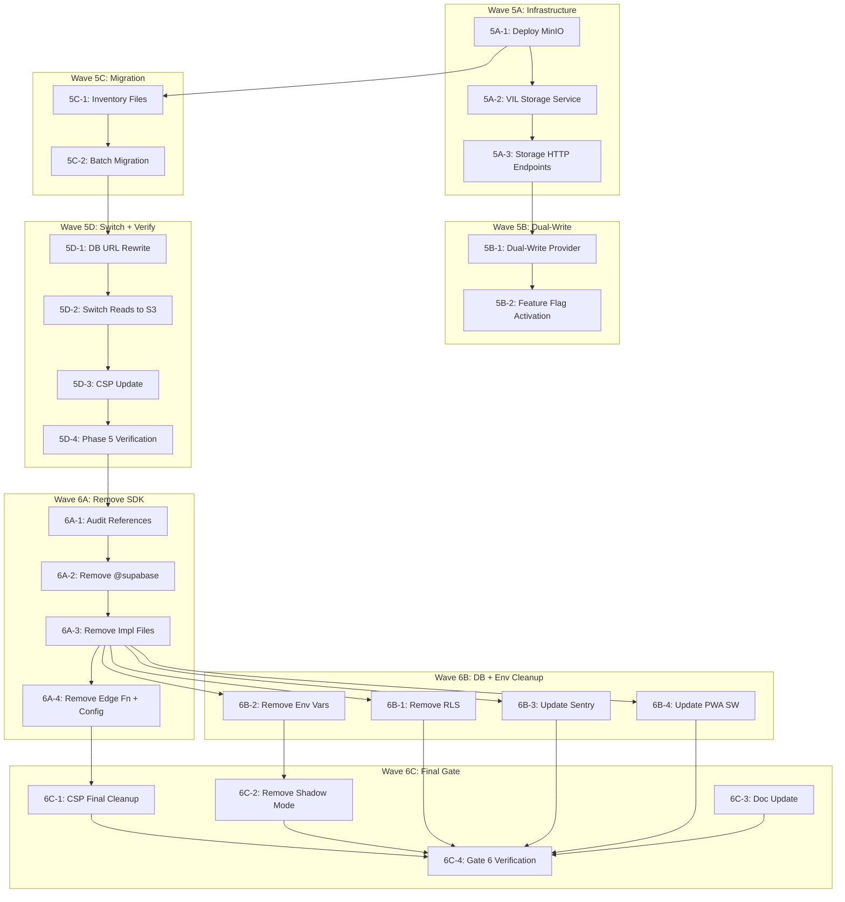

# Agent Task Queue — Phase 5-6

<aside>
🤖

**Untuk AI Coding Agents.** Setiap task di bawah adalah **self-contained** — agent tinggal copas kode dan execute. Task harus dikerjakan **berurutan** kecuali ditandai paralel. Setiap task punya:

- **Input:** File yang harus dibaca dulu
- **Output:** File yang harus dibuat/diubah
- **Code:** Kode lengkap siap copas
- **Verify:** Command untuk verifikasi
</aside>

---

## Aturan untuk Agent

1. **JANGAN** ubah file di luar scope task
2. **JANGAN** gunakan `npm` atau `yarn` — gunakan `pnpm`
3. **Semua teks UI** harus Bahasa Indonesia
4. **Semua komponen** harus punya `dark:` Tailwind variants
5. Jalankan `pnpm typecheck && pnpm lint` setelah setiap task
6. **JANGAN** ubah `AGENTS.md`, `CLAUDE.md`, `README.md`, `CHANGELOG.md`
7. Storage migration harus punya **rollback plan** — dual-read period before cutting over
8. Decommission tasks harus **ordered carefully** — jangan remove dependency sebelum replacement confirmed working
9. Jika menemukan hidden Supabase dependency yang belum di-port → **BLOCKED**
10. Final verification harus **exhaustive** — ini adalah last gate sebelum Gate 6 success
11. **🛠️ Rollback rule (Gap #9):** Commit SEBELUM mulai task: `git add -A && git commit -m "checkpoint: before task 5/6-XX"`. Jika verify gagal: `git stash`. JANGAN lanjut dengan state setengah jadi.
12. **🛠️ Nginx route update (Gap #5):** Storage endpoints (`/api/v1/storage/*`) HARUS ditambahkan ke `nginx.conf`. Phase 6 decommission harus juga update Nginx untuk remove Supabase proxy routes.
13. **🛠️ Supabase disable (Gap #7):** Phase 6 decommission HARUS disable Supabase services dalam urutan: Edge Functions → Realtime → Storage → Auth. Jangan disable semua sekaligus — per-service dengan monitoring 48 jam.

---

# Phase 5: Storage Migration (Minggu 61-66, ~80 jam)

---

## Wave 5A: S3/MinIO Infrastructure + VIL Storage Service

---

## Task 5A-1: Deploy MinIO via Docker Compose

**TASK ID:** 5A-1

**OWNER TYPE:** DevOps / Infra Agent

**GOAL:** Tambahkan MinIO service ke Docker Compose dan buat 5 buckets yang dibutuhkan EduSync.

**DEPENDENCY:** Phase 4 selesai, Docker Compose sudah ada dari Phase 1A (Spec 4 §9)

**READ FIRST:**

- `docker-compose.yml` (existing)
- Spec 3 §6.2 (Multi-stage Dockerfile)
- Phase 4-6 doc §Phase 5 Week 61

**EDIT ONLY:**

- `docker-compose.yml`
- `scripts/init-minio-buckets.sh` (baru)

**DO NOT TOUCH:**

- `edusync-api/` (Rust code)
- `src/` (frontend code)
- Nginx/Caddy config (belum)

**IMPLEMENTATION STEPS:**

1. Tambahkan MinIO service ke `docker-compose.yml`
2. Buat script init bucket
3. Tambahkan healthcheck
4. Verify MinIO accessible

**COPY-PASTE STARTER:**

```yaml
# Tambahkan ke docker-compose.yml di bagian services:
minio:
  image: minio/minio:RELEASE.2024-06-13T22-53-53Z
  container_name: edusync-minio
  ports:
    - '9000:9000' # API
    - '9001:9001' # Console
  environment:
    MINIO_ROOT_USER: ${MINIO_ROOT_USER:-minioadmin}
    MINIO_ROOT_PASSWORD: ${MINIO_ROOT_PASSWORD:-minioadmin}
  command: server /data --console-address ":9001"
  volumes:
    - minio_data:/data
  healthcheck:
    test: ['CMD', 'mc', 'ready', 'local']
    interval: 30s
    timeout: 10s
    retries: 3
  restart: unless-stopped

minio-init:
  image: minio/mc:latest
  container_name: edusync-minio-init
  depends_on:
    minio:
      condition: service_healthy
  entrypoint: /bin/sh
  command: /init-buckets.sh
  volumes:
    - ./scripts/init-minio-buckets.sh:/init-buckets.sh:ro
  environment:
    MINIO_ROOT_USER: ${MINIO_ROOT_USER:-minioadmin}
    MINIO_ROOT_PASSWORD: ${MINIO_ROOT_PASSWORD:-minioadmin}

# Tambahkan ke volumes:
minio_data:
```

```bash
#!/bin/bash
# scripts/init-minio-buckets.sh
set -e

echo "=== Initializing MinIO buckets for EduSync ==="

# Configure mc alias
mc alias set edusync http://minio:9000 "$MINIO_ROOT_USER" "$MINIO_ROOT_PASSWORD"

# Create buckets
BUCKETS=("edusync-videos" "edusync-files" "edusync-avatars" "edusync-certificates" "edusync-scorm")

for bucket in "${BUCKETS[@]}"; do
    if mc ls edusync/"$bucket" > /dev/null 2>&1; then
        echo "  Bucket $bucket already exists, skipping."
    else
        mc mb edusync/"$bucket"
        echo "  ✅ Created bucket: $bucket"
    fi
done

# Set public read policy for avatars and certificates (public assets)
mc anonymous set download edusync/edusync-avatars
mc anonymous set download edusync/edusync-certificates
echo "  ✅ Set public read on edusync-avatars and edusync-certificates"

# Videos: public read (streamed via CDN)
mc anonymous set download edusync/edusync-videos
echo "  ✅ Set public read on edusync-videos"

# Files and SCORM: private (presigned URLs only)
echo "  ℹ️  edusync-files and edusync-scorm remain private (presigned URLs)"

echo "=== MinIO initialization complete ==="
```

**VERIFY:**

```bash
# 1. Start MinIO
docker compose up -d minio minio-init

# 2. Wait for init
docker compose logs minio-init --follow
# Expected: "=== MinIO initialization complete ==="

# 3. Verify buckets exist
docker compose exec minio mc ls local/
# Expected: 5 buckets listed

# 4. Verify MinIO console accessible
curl -s http://localhost:9001 | head -1
# Expected: HTML response (MinIO console)

# 5. Verify API accessible
curl -s http://localhost:9000/minio/health/live
# Expected: HTTP 200
```

**STOP IF:**

- MinIO gagal start (port conflict, disk space)
- Buckets tidak bisa dibuat (permission issue)
- Docker Compose config breaks existing services

**OUTPUT FORMAT:** DONE / BLOCKED / FILES / VERIFY

---

## Task 5A-2: VIL Storage Service — Rust S3 Client

**TASK ID:** 5A-2

**OWNER TYPE:** Rust Backend Agent

**GOAL:** Buat StorageService di VIL yang connects ke S3-compatible storage (MinIO) menggunakan `vil_storage_s3` / `aws-sdk-s3`.

**DEPENDENCY:** Task 5A-1

**READ FIRST:**

- Agent Bootstrap Context §8 (vil_storage_s3)
- Phase 4-6 doc §Phase 5 Week 62
- `edusync-api/Cargo.toml`

**EDIT ONLY:**

- `edusync-api/Cargo.toml` (tambah dependency)
- `edusync-api/crates/services/src/storage.rs` (baru)
- `edusync-api/crates/services/src/lib.rs` (tambah `pub mod storage;`)

**DO NOT TOUCH:**

- Frontend code (`src/`)
- Existing service files
- Docker Compose

**IMPLEMENTATION STEPS:**

1. Tambahkan `aws-sdk-s3` dan `aws-config` ke Cargo.toml
2. Buat `StorageService` struct
3. Implement upload, download, delete, presigned URL, get public URL
4. Register di AppState

**COPY-PASTE STARTER:**

```toml
# Tambahkan ke edusync-api/Cargo.toml [workspace.dependencies]
aws-sdk-s3 = "1.30"
aws-config = { version = "1.5", features = ["behavior-version-latest"] }
aws-credential-types = "1.2"
aws-smithy-types = "1.2"
md-5 = "0.10"   # For checksum verification
```

```rust
// edusync-api/crates/services/src/storage.rs
use aws_sdk_s3::Client as S3Client;
use aws_sdk_s3::config::{Credentials, Region};
use aws_sdk_s3::presigning::PresigningConfig;
use aws_sdk_s3::primitives::ByteStream;
use std::time::Duration;
use uuid::Uuid;

#[derive(Clone)]
pub struct StorageService {
    client: S3Client,
    public_url: String, // CDN or direct S3 URL, e.g. https://cdn.edusync.id
}

#[derive(Debug, Clone)]
pub struct StorageConfig {
    pub endpoint: String,       // e.g. http://minio:9000
    pub access_key: String,
    pub secret_key: String,
    pub region: String,         // e.g. us-east-1
    pub public_url: String,     // e.g. https://cdn.edusync.id
}

#[derive(Debug, Clone, serde::Serialize)]
pub struct UploadResult {
    pub path: String,
    pub public_url: String,
    pub size_bytes: u64,
}

impl StorageService {
    pub async fn new(config: StorageConfig) -> Self {
        let creds = Credentials::new(
            &config.access_key,
            &config.secret_key,
            None,
            None,
            "edusync-storage",
        );

        let s3_config = aws_sdk_s3::Config::builder()
            .endpoint_url(&config.endpoint)
            .region(Region::new(config.region))
            .credentials_provider(creds)
            .force_path_style(true) // Required for MinIO
            .build();

        let client = S3Client::from_conf(s3_config);

        Self {
            client,
            public_url: config.public_url,
        }
    }

    /// Upload file to S3 bucket
    pub async fn upload(
        &self,
        bucket: &str,
        path: &str,
        data: Vec<u8>,
        content_type: &str,
    ) -> Result<UploadResult, StorageError> {
        let size = data.len() as u64;
        self.client
            .put_object()
            .bucket(bucket)
            .key(path)
            .body(ByteStream::from(data))
            .content_type(content_type)
            .send()
            .await
            .map_err(|e| StorageError::Upload(e.to_string()))?;

        Ok(UploadResult {
            path: path.to_string(),
            public_url: format!("{}/{}/{}", self.public_url, bucket, path),
            size_bytes: size,
        })
    }

    /// Download file from S3 bucket
    pub async fn download(
        &self,
        bucket: &str,
        path: &str,
    ) -> Result<Vec<u8>, StorageError> {
        let resp = self.client
            .get_object()
            .bucket(bucket)
            .key(path)
            .send()
            .await
            .map_err(|e| StorageError::Download(e.to_string()))?;

        let bytes = resp.body
            .collect()
            .await
            .map_err(|e| StorageError::Download(e.to_string()))?
            .into_bytes();

        Ok(bytes.to_vec())
    }

    /// Delete file from S3 bucket
    pub async fn delete(
        &self,
        bucket: &str,
        path: &str,
    ) -> Result<(), StorageError> {
        self.client
            .delete_object()
            .bucket(bucket)
            .key(path)
            .send()
            .await
            .map_err(|e| StorageError::Delete(e.to_string()))?;
        Ok(())
    }

    /// Generate presigned upload URL (for direct browser upload)
    pub async fn presigned_upload_url(
        &self,
        bucket: &str,
        path: &str,
        content_type: &str,
        expires_in: Duration,
    ) -> Result<String, StorageError> {
        let presigning = PresigningConfig::expires_in(expires_in)
            .map_err(|e| StorageError::Presign(e.to_string()))?;

        let url = self.client
            .put_object()
            .bucket(bucket)
            .key(path)
            .content_type(content_type)
            .presigned(presigning)
            .await
            .map_err(|e| StorageError::Presign(e.to_string()))?;

        Ok(url.uri().to_string())
    }

    /// Generate presigned download URL (for private files)
    pub async fn presigned_download_url(
        &self,
        bucket: &str,
        path: &str,
        expires_in: Duration,
    ) -> Result<String, StorageError> {
        let presigning = PresigningConfig::expires_in(expires_in)
            .map_err(|e| StorageError::Presign(e.to_string()))?;

        let url = self.client
            .get_object()
            .bucket(bucket)
            .key(path)
            .presigned(presigning)
            .await
            .map_err(|e| StorageError::Presign(e.to_string()))?;

        Ok(url.uri().to_string())
    }

    /// Get public URL for a file (for public buckets)
    pub fn get_public_url(&self, bucket: &str, path: &str) -> String {
        format!("{}/{}/{}", self.public_url, bucket, path)
    }

    /// Generate unique storage path with UUID prefix
    pub fn generate_path(prefix: &str, filename: &str) -> String {
        let id = Uuid::new_v4();
        format!("{}/{}/{}", prefix, id, filename)
    }

    /// List objects in a bucket with optional prefix
    pub async fn list_objects(
        &self,
        bucket: &str,
        prefix: Option<&str>,
    ) -> Result<Vec<String>, StorageError> {
        let mut builder = self.client.list_objects_v2().bucket(bucket);
        if let Some(p) = prefix {
            builder = builder.prefix(p);
        }

        let resp = builder
            .send()
            .await
            .map_err(|e| StorageError::List(e.to_string()))?;

        let keys: Vec<String> = resp
            .contents()
            .iter()
            .filter_map(|obj| obj.key().map(|k| k.to_string()))
            .collect();

        Ok(keys)
    }

    /// Check if object exists
    pub async fn exists(
        &self,
        bucket: &str,
        path: &str,
    ) -> Result<bool, StorageError> {
        match self.client
            .head_object()
            .bucket(bucket)
            .key(path)
            .send()
            .await
        {
            Ok(_) => Ok(true),
            Err(_) => Ok(false),
        }
    }
}

/// EduSync bucket names — matches init-minio-buckets.sh
pub mod buckets {
    pub const VIDEOS: &str = "edusync-videos";
    pub const FILES: &str = "edusync-files";
    pub const AVATARS: &str = "edusync-avatars";
    pub const CERTIFICATES: &str = "edusync-certificates";
    pub const SCORM: &str = "edusync-scorm";
}

#[derive(Debug, thiserror::Error)]
pub enum StorageError {
    #[error("Upload failed: {0}")]
    Upload(String),
    #[error("Download failed: {0}")]
    Download(String),
    #[error("Delete failed: {0}")]
    Delete(String),
    #[error("Presign failed: {0}")]
    Presign(String),
    #[error("List failed: {0}")]
    List(String),
}

impl From<StorageError> for vil_server::VilError {
    fn from(err: StorageError) -> Self {
        vil_server::VilError::internal(err.to_string())
    }
}
```

**VERIFY:**

```bash
cd edusync-api
cargo check --all-targets
cargo test -- storage --nocapture
```

**STOP IF:**

- `aws-sdk-s3` version conflict dengan VIL dependencies
- `cargo check` gagal
- MinIO tidak accessible dari Rust (network issue Docker)

**OUTPUT FORMAT:** DONE / BLOCKED / FILES / VERIFY

---

## Task 5A-3: VIL Storage HTTP Endpoints

**TASK ID:** 5A-3

**OWNER TYPE:** Rust Backend Agent

**GOAL:** Buat HTTP endpoints untuk storage operations (presigned upload, presigned download, delete) di VIL server.

**DEPENDENCY:** Task 5A-2

**READ FIRST:**

- `edusync-api/crates/services/src/storage.rs` (baru dari 5A-2)
- Agent Bootstrap Context §3 (VilApp Setup)
- Spec 3 §1.1 (File upload presigned URL — 100ms, 20/min per user)

**EDIT ONLY:**

- `edusync-api/crates/api-server/src/routes/storage.rs` (baru)
- `edusync-api/crates/api-server/src/routes/mod.rs` (tambah `pub mod storage;`)
- `edusync-api/src/main.rs` (register storage service)

**DO NOT TOUCH:**

- Frontend code
- Existing routes
- Docker Compose

**IMPLEMENTATION STEPS:**

1. Buat storage route handler file
2. Implement presigned upload, presigned download, delete endpoints
3. Register StorageService di AppState
4. Register storage routes di VilApp

**COPY-PASTE STARTER:**

```rust
// edusync-api/crates/api-server/src/routes/storage.rs
use axum::{
    extract::{Json, Path, State, Query},
    http::Method,
};
use serde::{Deserialize, Serialize};
use std::time::Duration;
use crate::AppState;
use crate::middleware::auth::Claims;
use crate::services::storage::{StorageService, buckets};

// === Request/Response types ===

#[derive(Deserialize)]
pub struct PresignedUploadRequest {
    pub bucket: String,
    pub filename: String,
    pub content_type: String,
    /// Optional subfolder prefix (e.g. "lessons/lesson-123")
    pub prefix: Option<String>,
}

#[derive(Serialize)]
pub struct PresignedUploadResponse {
    pub upload_url: String,
    pub file_path: String,
    pub public_url: String,
}

#[derive(Deserialize)]
pub struct PresignedDownloadRequest {
    pub bucket: String,
    pub path: String,
}

#[derive(Serialize)]
pub struct PresignedDownloadResponse {
    pub download_url: String,
}

#[derive(Deserialize)]
pub struct DeleteFileRequest {
    pub bucket: String,
    pub path: String,
}

// === Handlers ===

/// POST /api/v1/storage/presigned-upload
/// Generate presigned URL for direct browser upload to S3
pub async fn presigned_upload(
    State(state): State<AppState>,
    claims: Claims,
    Json(req): Json<PresignedUploadRequest>,
) -> Result<Json<PresignedUploadResponse>, vil_server::VilError> {
    // Validate bucket name
    validate_bucket(&req.bucket)?;

    // Validate content type
    validate_content_type(&req.bucket, &req.content_type)?;

    // Generate unique path
    let prefix = req.prefix.unwrap_or_else(|| claims.sub.clone());
    let file_path = StorageService::generate_path(&prefix, &req.filename);

    let storage = &state.storage;
    let upload_url = storage
        .presigned_upload_url(
            &req.bucket,
            &file_path,
            &req.content_type,
            Duration::from_secs(3600), // 1 hour expiry
        )
        .await?;

    let public_url = storage.get_public_url(&req.bucket, &file_path);

    Ok(Json(PresignedUploadResponse {
        upload_url,
        file_path,
        public_url,
    }))
}

/// POST /api/v1/storage/presigned-download
/// Generate presigned URL for downloading private files
pub async fn presigned_download(
    State(state): State<AppState>,
    _claims: Claims,
    Json(req): Json<PresignedDownloadRequest>,
) -> Result<Json<PresignedDownloadResponse>, vil_server::VilError> {
    validate_bucket(&req.bucket)?;

    let download_url = state.storage
        .presigned_download_url(
            &req.bucket,
            &req.path,
            Duration::from_secs(3600),
        )
        .await?;

    Ok(Json(PresignedDownloadResponse { download_url }))
}

/// DELETE /api/v1/storage/file
/// Delete a file from storage
pub async fn delete_file(
    State(state): State<AppState>,
    _claims: Claims,
    Json(req): Json<DeleteFileRequest>,
) -> Result<Json<serde_json::Value>, vil_server::VilError> {
    validate_bucket(&req.bucket)?;

    state.storage.delete(&req.bucket, &req.path).await?;

    Ok(Json(serde_json::json!({ "success": true })))
}

// === Validation helpers ===

fn validate_bucket(bucket: &str) -> Result<(), vil_server::VilError> {
    let valid = [
        buckets::VIDEOS,
        buckets::FILES,
        buckets::AVATARS,
        buckets::CERTIFICATES,
        buckets::SCORM,
    ];
    if !valid.contains(&bucket) {
        return Err(vil_server::VilError::bad_request(
            format!("Invalid bucket: {}. Allowed: {:?}", bucket, valid),
        ));
    }
    Ok(())
}

fn validate_content_type(bucket: &str, content_type: &str) -> Result<(), vil_server::VilError> {
    let allowed = match bucket {
        buckets::VIDEOS => vec!["video/mp4", "video/webm", "video/quicktime"],
        buckets::AVATARS => vec!["image/jpeg", "image/png", "image/webp", "image/gif"],
        buckets::FILES => vec![
            "application/pdf",
            "application/msword",
            "application/vnd.openxmlformats-officedocument.wordprocessingml.document",
            "application/vnd.ms-excel",
            "application/vnd.openxmlformats-officedocument.spreadsheetml.sheet",
            "application/vnd.ms-powerpoint",
            "application/vnd.openxmlformats-officedocument.presentationml.presentation",
            "text/plain",
            "text/csv",
            "image/jpeg",
            "image/png",
            "image/webp",
        ],
        buckets::CERTIFICATES => vec!["application/pdf", "image/png"],
        buckets::SCORM => vec!["application/zip", "application/x-zip-compressed"],
        _ => vec![],
    };

    if !allowed.contains(&content_type) {
        return Err(vil_server::VilError::bad_request(
            format!("Content type '{}' not allowed for bucket '{}'", content_type, bucket),
        ));
    }
    Ok(())
}
```

**VERIFY:**

```bash
cd edusync-api
cargo check --all-targets
cargo test -- storage --nocapture
```

**STOP IF:**

- Claims extractor belum tersedia (belum di-implement di Phase 1)
- AppState belum punya `storage` field
- Route registration pattern berbeda dari existing routes

**OUTPUT FORMAT:** DONE / BLOCKED / FILES / VERIFY

---

## Wave 5B: Dual-Write + Frontend Storage Switch

---

## Task 5B-1: Dual-Write Storage Provider (Frontend)

**TASK ID:** 5B-1

**OWNER TYPE:** Frontend Refactor Agent

**GOAL:** Update `StorageClient` abstraction agar writes go to BOTH Supabase Storage AND S3 (via VIL presigned URL). Reads tetap dari Supabase selama transition.

**DEPENDENCY:** Task 5A-3, Phase 0D selesai (StorageClient abstraction sudah ada)

**READ FIRST:**

- `src/services/api/apiClient.ts` (StorageClient interface)
- `src/services/api/supabaseApiClient.ts`
- `src/services/api/vilApiClient.ts`
- Phase 4-6 doc §Phase 5 Week 63-64 (Dual-Write Period)

**EDIT ONLY:**

- `src/services/storage/dualWriteStorage.ts` (baru)
- `src/services/api/index.ts` (export baru)

**DO NOT TOUCH:**

- `src/services/api/apiClient.ts` (interface tetap)
- `src/services/supabase/client.ts`
- Feature service files

**IMPLEMENTATION STEPS:**

1. Buat DualWriteStorageBucketClient yang wraps Supabase + S3
2. Upload: write ke S3 (primary) DAN Supabase (secondary, best-effort)
3. Download: read dari Supabase (tetap, belum switch)
4. getPublicUrl: return Supabase URL (tetap)
5. Export dari barrel

**COPY-PASTE STARTER:**

```tsx
// src/services/storage/dualWriteStorage.ts
import type {
  StorageBucketClient,
  StorageUploadResponse,
  StorageRemoveResponse,
} from '@/services/api'

const VIL_API_URL = import.meta.env.VITE_API_URL || 'http://localhost:8080'

/**
 * Dual-write storage: uploads go to BOTH S3 (via VIL) and Supabase.
 * Reads come from Supabase during transition, then switch to S3.
 *
 * Rollback: set VITE_STORAGE_DUAL_WRITE=false to disable S3 writes.
 */
export function createDualWriteStorageBucket(
  supabaseBucket: StorageBucketClient,
  bucketName: string,
  authToken: () => string | null
): StorageBucketClient {
  return {
    async upload(
      path: string,
      file: File | Blob | ArrayBuffer,
      options?: Record<string, unknown>
    ): Promise<StorageUploadResponse> {
      // 1. Upload to Supabase (primary during transition)
      const supabaseResult = await supabaseBucket.upload(path, file, options)

      // 2. Upload to S3 via VIL presigned URL (best-effort)
      try {
        const token = authToken()
        if (!token) throw new Error('No auth token')

        const contentType =
          file instanceof File
            ? file.type
            : (options?.contentType as string) || 'application/octet-stream'

        // Get presigned upload URL from VIL
        const presignResp = await fetch(`${VIL_API_URL}/api/v1/storage/presigned-upload`, {
          method: 'POST',
          headers: {
            'Content-Type': 'application/json',
            Authorization: `Bearer ${token}`,
          },
          body: JSON.stringify({
            bucket: bucketName,
            filename: path.split('/').pop() || path,
            content_type: contentType,
            prefix: path.split('/').slice(0, -1).join('/') || undefined,
          }),
        })

        if (presignResp.ok) {
          const { upload_url } = await presignResp.json()
          // Direct upload to S3
          const fileBlob = file instanceof ArrayBuffer ? new Blob([file]) : file
          await fetch(upload_url, {
            method: 'PUT',
            body: fileBlob,
            headers: { 'Content-Type': contentType },
          })
          console.debug('[DualWrite] S3 upload success:', path)
        }
      } catch (err) {
        // S3 upload failure is non-blocking during dual-write
        console.warn('[DualWrite] S3 upload failed (non-blocking):', path, err)
      }

      // Return Supabase result as canonical
      return supabaseResult
    },

    async download(path: string) {
      // During transition: read from Supabase
      return supabaseBucket.download(path)
    },

    async remove(paths: string[]): Promise<StorageRemoveResponse> {
      // Remove from both
      const supabaseResult = await supabaseBucket.remove(paths)

      // Best-effort S3 delete
      try {
        const token = authToken()
        if (token) {
          for (const path of paths) {
            await fetch(`${VIL_API_URL}/api/v1/storage/file`, {
              method: 'DELETE',
              headers: {
                'Content-Type': 'application/json',
                Authorization: `Bearer ${token}`,
              },
              body: JSON.stringify({ bucket: bucketName, path }),
            }).catch(() => {
              /* non-blocking */
            })
          }
        }
      } catch {
        console.warn('[DualWrite] S3 delete failed (non-blocking)')
      }

      return supabaseResult
    },

    getPublicUrl(path: string) {
      // During transition: return Supabase public URL
      return supabaseBucket.getPublicUrl(path)
    },

    async createSignedUrl(path: string, expiresIn: number) {
      // During transition: use Supabase signed URLs
      return supabaseBucket.createSignedUrl(path, expiresIn)
    },
  }
}
```

**VERIFY:**

```bash
pnpm typecheck
pnpm lint
# Manual test: upload a file → verify it appears in both Supabase Storage AND MinIO
```

**STOP IF:**

- StorageClient interface belum di-abstract (Phase 0D belum selesai)
- Auth token tidak accessible dari storage context
- Supabase upload returns different shape than expected

**OUTPUT FORMAT:** DONE / BLOCKED / FILES / VERIFY

---

## Task 5B-2: Activate Dual-Write via Feature Flag

**TASK ID:** 5B-2

**OWNER TYPE:** Frontend Refactor Agent

**GOAL:** Tambahkan feature flag `VITE_STORAGE_DUAL_WRITE` dan wire dual-write storage ke app initialization.

**DEPENDENCY:** Task 5B-1

**READ FIRST:**

- `src/main.tsx` (initialization flow)
- `src/vite-env.d.ts`
- `src/services/api/apiClient.ts`

**EDIT ONLY:**

- `src/vite-env.d.ts` (tambah env var)
- `src/main.tsx` (conditional dual-write activation)
- `.env.example` (tambah env var)

**DO NOT TOUCH:**

- StorageClient interface
- Feature service files

**IMPLEMENTATION STEPS:**

1. Tambah `VITE_STORAGE_DUAL_WRITE` ke vite-env.d.ts
2. Tambah `VITE_STORAGE_URL` ke vite-env.d.ts
3. Di main.tsx, wrap storage client dengan dual-write jika flag aktif
4. Update .env.example

**COPY-PASTE STARTER:**

```tsx
// src/vite-env.d.ts — TAMBAHKAN di dalam interface ImportMetaEnv:
  readonly VITE_STORAGE_DUAL_WRITE?: 'true' | 'false'
  readonly VITE_STORAGE_URL?: string  // e.g. https://cdn.edusync.id
```

```bash
# .env.example — TAMBAHKAN:
VITE_STORAGE_DUAL_WRITE=false
VITE_STORAGE_URL=http://localhost:9000
```

**VERIFY:**

```bash
pnpm typecheck
pnpm lint
```

**STOP IF:**

- main.tsx initialization pattern tidak cocok
- Multiple env vars conflict

**OUTPUT FORMAT:** DONE / BLOCKED / FILES / VERIFY

---

## Wave 5C: Background File Migration

---

## Task 5C-1: Inventory Supabase Storage Files

**TASK ID:** 5C-1

**OWNER TYPE:** DevOps / Script Agent

**GOAL:** Buat script yang inventory SEMUA files di Supabase Storage dan simpan manifest ke JSON file.

**DEPENDENCY:** Task 5A-1 (MinIO ready sebagai target)

**READ FIRST:**

- Phase 4-6 doc §Phase 5 Week 65
- Spec 4 §13 (Storage URL Migration Detail)

**EDIT ONLY:**

- `scripts/storage-migration/inventory.sh` (baru)
- `scripts/storage-migration/inventory.ts` (baru, Node.js alternative)

**DO NOT TOUCH:**

- `src/` (frontend)
- `edusync-api/` (backend)
- Production database

**IMPLEMENTATION STEPS:**

1. Buat script yang list semua objects di setiap Supabase Storage bucket
2. Output manifest JSON: bucket, path, size, content_type, last_modified
3. Count total files dan total size
4. Identify affected DB tables and columns

**COPY-PASTE STARTER:**

```bash
#!/bin/bash
# scripts/storage-migration/inventory.sh
# Inventory ALL files in Supabase Storage buckets
set -e

SUPABASE_URL="${SUPABASE_URL:?Set SUPABASE_URL}"
SUPABASE_SERVICE_KEY="${SUPABASE_SERVICE_KEY:?Set SUPABASE_SERVICE_KEY}"
OUTPUT_DIR="scripts/storage-migration/manifest"

mkdir -p "$OUTPUT_DIR"

BUCKETS=("videos" "files" "avatars" "certificates" "scorm")
TOTAL_FILES=0
TOTAL_SIZE=0

echo "=== Supabase Storage Inventory ==="
echo "Started: $(date -u +%Y-%m-%dT%H:%M:%SZ)"

for bucket in "${BUCKETS[@]}"; do
    echo ""
    echo "--- Bucket: $bucket ---"

    # List all objects via Supabase Storage API
    RESPONSE=$(curl -s \
        -H "Authorization: Bearer $SUPABASE_SERVICE_KEY" \
        -H "apikey: $SUPABASE_SERVICE_KEY" \
        "$SUPABASE_URL/storage/v1/object/list/$bucket" \
        -d '{"prefix":"","limit":10000,"offset":0,"sortBy":{"column":"name","order":"asc"}}' \
        -H "Content-Type: application/json")

    # Save raw manifest
    echo "$RESPONSE" | jq '.' > "$OUTPUT_DIR/${bucket}_manifest.json"

    # Count and summarize
    FILE_COUNT=$(echo "$RESPONSE" | jq 'length')
    BUCKET_SIZE=$(echo "$RESPONSE" | jq '[.[].metadata.size // 0] | add // 0')

    echo "  Files: $FILE_COUNT"
    echo "  Total size: $BUCKET_SIZE bytes"

    TOTAL_FILES=$((TOTAL_FILES + FILE_COUNT))
    TOTAL_SIZE=$((TOTAL_SIZE + BUCKET_SIZE))
done

echo ""
echo "=== Summary ==="
echo "Total files: $TOTAL_FILES"
echo "Total size: $TOTAL_SIZE bytes ($((TOTAL_SIZE / 1024 / 1024)) MB)"
echo "Manifests saved to: $OUTPUT_DIR/"

# DB URL audit — which columns reference Supabase storage URLs
echo ""
echo "=== DB URL Audit ==="
echo "Tables with potential Supabase Storage URLs:"
echo "  - profiles.avatar_url"
echo "  - lesson_resources.url"
echo "  - submission_files.file_url"
echo "  - certificates.pdf_url (if exists)"
echo "  - scorm_packages.package_url (if exists)"
echo "  - course_thumbnails / course cover images"
echo ""
echo "Run SQL audit:"
echo "  SELECT table_name, column_name"
echo "  FROM information_schema.columns"
echo "  WHERE column_name LIKE '%url%' OR column_name LIKE '%path%' OR column_name LIKE '%file%'"
echo "  AND table_schema = 'public';"

echo ""
echo "=== Inventory complete ==="
```

**VERIFY:**

```bash
chmod +x scripts/storage-migration/inventory.sh

# Run (requires Supabase credentials)
export SUPABASE_URL=https://xxx.supabase.co
export SUPABASE_SERVICE_KEY=eyJ...
bash scripts/storage-migration/inventory.sh

# Verify manifest files created
ls -la scripts/storage-migration/manifest/
# Expected: videos_manifest.json, files_manifest.json, avatars_manifest.json, etc.

# Verify JSON valid
jq '.' scripts/storage-migration/manifest/videos_manifest.json | head -5
```

**STOP IF:**

- Supabase Storage API returns error (auth/permissions)
- Bucket names berbeda dari expected
- Files count > 100,000 (perlu pagination strategy)

**OUTPUT FORMAT:** DONE / BLOCKED / FILES / VERIFY

---

## Task 5C-2: Batch Migration Script (Supabase → S3)

**TASK ID:** 5C-2

**OWNER TYPE:** DevOps / Script Agent

**GOAL:** Buat migration script yang copy SEMUA files dari Supabase Storage ke MinIO/S3 dengan progress tracking, checksum verification, dan resume capability.

**DEPENDENCY:** Task 5C-1 (inventory manifest exists)

**READ FIRST:**

- `scripts/storage-migration/manifest/*.json` (dari 5C-1)
- Phase 4-6 doc §Phase 5 Week 65

**EDIT ONLY:**

- `scripts/storage-migration/migrate.sh` (baru)
- `scripts/storage-migration/migrate-state.json` (generated at runtime)

**DO NOT TOUCH:**

- `src/` (frontend)
- Production database
- MinIO bucket policies

**IMPLEMENTATION STEPS:**

1. Baca manifest dari 5C-1
2. Download setiap file dari Supabase Storage
3. Upload ke MinIO/S3 dengan same path structure
4. Verify checksum (MD5)
5. Track progress in state file (for resume)
6. Log failures for retry

**COPY-PASTE STARTER:**

```bash
#!/bin/bash
# scripts/storage-migration/migrate.sh
# Migrate ALL files from Supabase Storage to MinIO/S3
# Supports: resume, checksum verify, progress tracking
set -e

SUPABASE_URL="${SUPABASE_URL:?Set SUPABASE_URL}"
SUPABASE_SERVICE_KEY="${SUPABASE_SERVICE_KEY:?Set SUPABASE_SERVICE_KEY}"
S3_ENDPOINT="${S3_ENDPOINT:-http://localhost:9000}"
S3_ACCESS_KEY="${S3_ACCESS_KEY:-minioadmin}"
S3_SECRET_KEY="${S3_SECRET_KEY:-minioadmin}"

MANIFEST_DIR="scripts/storage-migration/manifest"
STATE_FILE="scripts/storage-migration/migrate-state.json"
FAILED_LOG="scripts/storage-migration/failed.log"
TMP_DIR="/tmp/edusync-migrate"

mkdir -p "$TMP_DIR"
touch "$FAILED_LOG"

# Bucket mapping: Supabase bucket → S3 bucket
declare -A BUCKET_MAP
BUCKET_MAP["videos"]="edusync-videos"
BUCKET_MAP["files"]="edusync-files"
BUCKET_MAP["avatars"]="edusync-avatars"
BUCKET_MAP["certificates"]="edusync-certificates"
BUCKET_MAP["scorm"]="edusync-scorm"

# Configure mc (MinIO client)
mc alias set s3target "$S3_ENDPOINT" "$S3_ACCESS_KEY" "$S3_SECRET_KEY" 2>/dev/null

# Initialize or load state
if [ ! -f "$STATE_FILE" ]; then
    echo '{"migrated": {}, "failed": [], "total": 0, "done": 0}' > "$STATE_FILE"
fi

TOTAL_MIGRATED=0
TOTAL_FAILED=0
TOTAL_SKIPPED=0

for supabase_bucket in "${!BUCKET_MAP[@]}"; do
    s3_bucket="${BUCKET_MAP[$supabase_bucket]}"
    manifest="$MANIFEST_DIR/${supabase_bucket}_manifest.json"

    if [ ! -f "$manifest" ]; then
        echo "⚠️  No manifest for bucket: $supabase_bucket (skipping)"
        continue
    fi

    FILE_COUNT=$(jq 'length' "$manifest")
    echo ""
    echo "=== Migrating bucket: $supabase_bucket → $s3_bucket ($FILE_COUNT files) ==="

    for i in $(seq 0 $((FILE_COUNT - 1))); do
        FILE_NAME=$(jq -r ".[$i].name" "$manifest")
        FILE_ID=$(jq -r ".[$i].id // empty" "$manifest")

        # Skip if already migrated (resume support)
        ALREADY_DONE=$(jq -r ".migrated[\"$supabase_bucket/$FILE_NAME\"] // empty" "$STATE_FILE")
        if [ -n "$ALREADY_DONE" ]; then
            TOTAL_SKIPPED=$((TOTAL_SKIPPED + 1))
            continue
        fi

        echo "  [$((i+1))/$FILE_COUNT] Migrating: $FILE_NAME"

        # 1. Download from Supabase
        HTTP_CODE=$(curl -s -o "$TMP_DIR/tmpfile" -w "%{http_code}" \
            -H "Authorization: Bearer $SUPABASE_SERVICE_KEY" \
            -H "apikey: $SUPABASE_SERVICE_KEY" \
            "$SUPABASE_URL/storage/v1/object/$supabase_bucket/$FILE_NAME")

        if [ "$HTTP_CODE" != "200" ]; then
            echo "    ❌ Download failed (HTTP $HTTP_CODE)"
            echo "$supabase_bucket/$FILE_NAME" >> "$FAILED_LOG"
            TOTAL_FAILED=$((TOTAL_FAILED + 1))
            continue
        fi

        # 2. Calculate checksum (source)
        SRC_MD5=$(md5sum "$TMP_DIR/tmpfile" | cut -d' ' -f1)

        # 3. Upload to S3
        mc cp "$TMP_DIR/tmpfile" "s3target/$s3_bucket/$FILE_NAME" --quiet 2>/dev/null
        if [ $? -ne 0 ]; then
            echo "    ❌ Upload to S3 failed"
            echo "$supabase_bucket/$FILE_NAME" >> "$FAILED_LOG"
            TOTAL_FAILED=$((TOTAL_FAILED + 1))
            continue
        fi

        # 4. Verify checksum (download from S3 and compare)
        mc cp "s3target/$s3_bucket/$FILE_NAME" "$TMP_DIR/verify" --quiet 2>/dev/null
        DST_MD5=$(md5sum "$TMP_DIR/verify" | cut -d' ' -f1)

        if [ "$SRC_MD5" != "$DST_MD5" ]; then
            echo "    ❌ Checksum mismatch! src=$SRC_MD5 dst=$DST_MD5"
            echo "CHECKSUM_MISMATCH:$supabase_bucket/$FILE_NAME" >> "$FAILED_LOG"
            TOTAL_FAILED=$((TOTAL_FAILED + 1))
            continue
        fi

        # 5. Update state
        jq ".migrated[\"$supabase_bucket/$FILE_NAME\"] = \"$SRC_MD5\"" "$STATE_FILE" > "$STATE_FILE.tmp" && mv "$STATE_FILE.tmp" "$STATE_FILE"

        TOTAL_MIGRATED=$((TOTAL_MIGRATED + 1))
        echo "    ✅ Done (md5: $SRC_MD5)"

        # Cleanup tmp files
        rm -f "$TMP_DIR/tmpfile" "$TMP_DIR/verify"
    done
done

echo ""
echo "=== Migration Summary ==="
echo "Migrated: $TOTAL_MIGRATED"
echo "Skipped (already done): $TOTAL_SKIPPED"
echo "Failed: $TOTAL_FAILED"
if [ "$TOTAL_FAILED" -gt 0 ]; then
    echo "Failed files logged in: $FAILED_LOG"
fi
echo "State saved to: $STATE_FILE"
echo "=== Migration complete ==="
```

**VERIFY:**

```bash
chmod +x scripts/storage-migration/migrate.sh

# Dry run (small bucket first)
export SUPABASE_URL=https://xxx.supabase.co
export SUPABASE_SERVICE_KEY=eyJ...
export S3_ENDPOINT=http://localhost:9000
bash scripts/storage-migration/migrate.sh

# Verify file count matches
mc ls s3target/edusync-avatars --recursive | wc -l
# Should match Supabase avatar count from inventory

# Verify state file
jq '.migrated | length' scripts/storage-migration/migrate-state.json

# Resume test: run again → should skip already migrated
bash scripts/storage-migration/migrate.sh
# Expected: "Skipped" count matches previous "Migrated" count
```

**STOP IF:**

- Supabase Storage API rate limited
- Checksum mismatches > 1% of files
- Disk space insufficient for tmp files
- Network timeout between Supabase and MinIO

**OUTPUT FORMAT:** DONE / BLOCKED / FILES / VERIFY

---

## Wave 5D: Switch Reads + URL Rewriting

---

## Task 5D-1: DB URL Audit & Batch Rewrite Script

**TASK ID:** 5D-1

**OWNER TYPE:** DevOps / SQL Agent

**GOAL:** Audit SEMUA database columns yang contain Supabase Storage URLs, lalu batch update ke S3 URLs.

**DEPENDENCY:** Task 5C-2 (all files migrated to S3)

**READ FIRST:**

- Spec 4 §13 (Storage URL Migration Detail)
- Phase 4-6 doc §Phase 5 Week 65

**EDIT ONLY:**

- `scripts/storage-migration/audit-urls.sql` (baru)
- `scripts/storage-migration/rewrite-urls.sql` (baru)
- `scripts/storage-migration/rewrite-urls.sh` (baru)

**DO NOT TOUCH:**

- `src/` (frontend)
- Production database (until verified on staging)

**IMPLEMENTATION STEPS:**

1. Audit: find all columns with Supabase storage URLs
2. Count affected rows per table/column
3. Generate UPDATE statements
4. Run on staging first, then production

**COPY-PASTE STARTER:**

```sql
-- scripts/storage-migration/audit-urls.sql
-- Run this FIRST to identify all Supabase Storage URL columns

-- Step 1: Find columns that might contain URLs
SELECT table_name, column_name, data_type
FROM information_schema.columns
WHERE table_schema = 'public'
  AND (
    column_name LIKE '%url%'
    OR column_name LIKE '%path%'
    OR column_name LIKE '%file%'
    OR column_name LIKE '%image%'
    OR column_name LIKE '%avatar%'
    OR column_name LIKE '%thumbnail%'
    OR column_name LIKE '%cover%'
    OR column_name LIKE '%src%'
  )
  AND data_type IN ('text', 'character varying')
ORDER BY table_name, column_name;

-- Step 2: Count rows with Supabase URLs per table
-- Replace YOUR_SUPABASE_URL with actual Supabase project URL
-- e.g. https://abcdefghij.supabase.co

-- profiles.avatar_url
SELECT 'profiles.avatar_url' AS location,
       COUNT(*) AS total_rows,
       COUNT(*) FILTER (WHERE avatar_url LIKE '%supabase.co/storage%') AS supabase_urls
FROM profiles;

-- lesson_resources.url
SELECT 'lesson_resources.url' AS location,
       COUNT(*) AS total_rows,
       COUNT(*) FILTER (WHERE url LIKE '%supabase.co/storage%') AS supabase_urls
FROM lesson_resources;

-- submission_files.file_url
SELECT 'submission_files.file_url' AS location,
       COUNT(*) AS total_rows,
       COUNT(*) FILTER (WHERE file_url LIKE '%supabase.co/storage%') AS supabase_urls
FROM submission_files;

-- Add more tables as discovered from Step 1
```

```sql
-- scripts/storage-migration/rewrite-urls.sql
-- ⚠️ RUN ON STAGING FIRST! Then production.
-- Replace OLD_SUPABASE_URL and NEW_CDN_URL with actual values.

BEGIN;

-- Set variables
-- OLD: https://abcdefghij.supabase.co/storage/v1/object/public
-- NEW: https://cdn.edusync.id

-- profiles.avatar_url
UPDATE profiles
SET avatar_url = REPLACE(
    avatar_url,
    'https://abcdefghij.supabase.co/storage/v1/object/public/avatars',
    'https://cdn.edusync.id/edusync-avatars'
)
WHERE avatar_url LIKE '%supabase.co/storage%';

-- lesson_resources.url (videos bucket)
UPDATE lesson_resources
SET url = REPLACE(
    url,
    'https://abcdefghij.supabase.co/storage/v1/object/public/videos',
    'https://cdn.edusync.id/edusync-videos'
)
WHERE url LIKE '%supabase.co/storage%videos%';

-- lesson_resources.url (files bucket)
UPDATE lesson_resources
SET url = REPLACE(
    url,
    'https://abcdefghij.supabase.co/storage/v1/object/public/files',
    'https://cdn.edusync.id/edusync-files'
)
WHERE url LIKE '%supabase.co/storage%files%';

-- submission_files.file_url
UPDATE submission_files
SET file_url = REPLACE(
    file_url,
    'https://abcdefghij.supabase.co/storage/v1/object/public/files',
    'https://cdn.edusync.id/edusync-files'
)
WHERE file_url LIKE '%supabase.co/storage%';

-- certificates (if table exists)
UPDATE certificates
SET pdf_url = REPLACE(
    pdf_url,
    'https://abcdefghij.supabase.co/storage/v1/object/public/certificates',
    'https://cdn.edusync.id/edusync-certificates'
)
WHERE pdf_url LIKE '%supabase.co/storage%';

-- Verify counts
SELECT 'profiles' AS tbl, COUNT(*) FILTER (WHERE avatar_url LIKE '%supabase.co%') AS remaining FROM profiles
UNION ALL
SELECT 'lesson_resources', COUNT(*) FILTER (WHERE url LIKE '%supabase.co%') FROM lesson_resources
UNION ALL
SELECT 'submission_files', COUNT(*) FILTER (WHERE file_url LIKE '%supabase.co%') FROM submission_files;

-- If all remaining = 0, commit. Otherwise ROLLBACK.
-- COMMIT;
-- ROLLBACK;
```

**VERIFY:**

```bash
# 1. Run audit on staging
psql "$STAGING_DATABASE_URL" -f scripts/storage-migration/audit-urls.sql

# 2. Run rewrite on staging (in transaction)
psql "$STAGING_DATABASE_URL" -f scripts/storage-migration/rewrite-urls.sql

# 3. Verify zero remaining Supabase URLs
psql "$STAGING_DATABASE_URL" -c "
  SELECT COUNT(*) FROM profiles WHERE avatar_url LIKE '%supabase.co%';
  SELECT COUNT(*) FROM lesson_resources WHERE url LIKE '%supabase.co%';
  SELECT COUNT(*) FROM submission_files WHERE file_url LIKE '%supabase.co%';
"
# Expected: all 0

# 4. Spot-check: verify URLs resolve
curl -sI "https://cdn.edusync.id/edusync-avatars/some-avatar.jpg" | head -1
# Expected: HTTP 200
```

**STOP IF:**

- Audit finds columns not accounted for in rewrite script
- Supabase URL format varies (some use signed URLs, not public URLs)
- More than 5 tables affected (need to expand script)
- ROLLBACK required after testing

**OUTPUT FORMAT:** DONE / BLOCKED / FILES / VERIFY

---

## Task 5D-2: Switch Frontend StorageClient to S3 Reads

**TASK ID:** 5D-2

**OWNER TYPE:** Frontend Refactor Agent

**GOAL:** Update StorageClient sehingga reads (download, getPublicUrl) menggunakan S3/CDN URL instead of Supabase.

**DEPENDENCY:** Task 5D-1 (DB URLs rewritten), Task 5C-2 (files migrated)

**READ FIRST:**

- `src/services/storage/dualWriteStorage.ts` (dari 5B-1)
- `src/services/api/apiClient.ts`

**EDIT ONLY:**

- `src/services/storage/s3Storage.ts` (baru)
- `src/services/api/vilApiClient.ts` (update storage implementation)

**DO NOT TOUCH:**

- `src/services/api/apiClient.ts` (interface tetap)
- `src/services/supabase/client.ts`

**IMPLEMENTATION STEPS:**

1. Buat S3StorageBucketClient yang reads from S3/CDN
2. Update vilApiClient storage to use S3
3. Keep dual-write for upload, but reads from S3

**COPY-PASTE STARTER:**

```tsx
// src/services/storage/s3Storage.ts
import type {
  StorageBucketClient,
  StorageUploadResponse,
  StorageRemoveResponse,
} from '@/services/api'

const VIL_API_URL = import.meta.env.VITE_API_URL || 'http://localhost:8080'
const STORAGE_URL = import.meta.env.VITE_STORAGE_URL || 'http://localhost:9000'

/** Bucket name mapping: Supabase bucket → S3 bucket */
const BUCKET_MAP: Record<string, string> = {
  videos: 'edusync-videos',
  files: 'edusync-files',
  avatars: 'edusync-avatars',
  certificates: 'edusync-certificates',
  scorm: 'edusync-scorm',
}

export function createS3StorageBucket(
  bucketName: string,
  authToken: () => string | null
): StorageBucketClient {
  const s3Bucket = BUCKET_MAP[bucketName] || `edusync-${bucketName}`

  return {
    async upload(
      path: string,
      file: File | Blob | ArrayBuffer,
      options?: Record<string, unknown>
    ): Promise<StorageUploadResponse> {
      const token = authToken()
      if (!token) {
        return { data: null, error: { message: 'No auth token' } }
      }

      const contentType =
        file instanceof File
          ? file.type
          : (options?.contentType as string) || 'application/octet-stream'

      try {
        // Get presigned upload URL from VIL
        const presignResp = await fetch(`${VIL_API_URL}/api/v1/storage/presigned-upload`, {
          method: 'POST',
          headers: {
            'Content-Type': 'application/json',
            Authorization: `Bearer ${token}`,
          },
          body: JSON.stringify({
            bucket: s3Bucket,
            filename: path.split('/').pop() || path,
            content_type: contentType,
            prefix: path.split('/').slice(0, -1).join('/') || undefined,
          }),
        })

        if (!presignResp.ok) {
          const err = await presignResp.json()
          return { data: null, error: { message: err.message || 'Presign failed' } }
        }

        const { upload_url, file_path, public_url } = await presignResp.json()

        // Direct upload to S3
        const fileBlob = file instanceof ArrayBuffer ? new Blob([file]) : file
        const uploadResp = await fetch(upload_url, {
          method: 'PUT',
          body: fileBlob,
          headers: { 'Content-Type': contentType },
        })

        if (!uploadResp.ok) {
          return { data: null, error: { message: 'S3 upload failed' } }
        }

        return {
          data: { path: file_path, fullPath: public_url },
          error: null,
        }
      } catch (err) {
        return {
          data: null,
          error: { message: err instanceof Error ? err.message : 'Upload failed' },
        }
      }
    },

    async download(path: string) {
      try {
        const resp = await fetch(`${STORAGE_URL}/${s3Bucket}/${path}`)
        if (!resp.ok) {
          return { data: null, error: { message: `Download failed: ${resp.status}` } }
        }
        const blob = await resp.blob()
        return { data: blob, error: null }
      } catch (err) {
        return { data: null, error: err }
      }
    },

    async remove(paths: string[]): Promise<StorageRemoveResponse> {
      const token = authToken()
      if (!token) {
        return { data: null, error: { message: 'No auth token' } }
      }

      try {
        for (const path of paths) {
          await fetch(`${VIL_API_URL}/api/v1/storage/file`, {
            method: 'DELETE',
            headers: {
              'Content-Type': 'application/json',
              Authorization: `Bearer ${token}`,
            },
            body: JSON.stringify({ bucket: s3Bucket, path }),
          })
        }
        return { data: paths.map((p) => ({ name: p })), error: null }
      } catch (err) {
        return { data: null, error: { message: 'Delete failed' } }
      }
    },

    getPublicUrl(path: string) {
      return {
        data: {
          publicUrl: `${STORAGE_URL}/${s3Bucket}/${path}`,
        },
      }
    },

    async createSignedUrl(path: string, expiresIn: number) {
      const token = authToken()
      if (!token) {
        return { data: null, error: { message: 'No auth token' } }
      }

      try {
        const resp = await fetch(`${VIL_API_URL}/api/v1/storage/presigned-download`, {
          method: 'POST',
          headers: {
            'Content-Type': 'application/json',
            Authorization: `Bearer ${token}`,
          },
          body: JSON.stringify({ bucket: s3Bucket, path }),
        })

        if (!resp.ok) {
          return { data: null, error: { message: 'Presign failed' } }
        }

        const { download_url } = await resp.json()
        return { data: { signedUrl: download_url }, error: null }
      } catch (err) {
        return { data: null, error: err }
      }
    },
  }
}
```

**VERIFY:**

```bash
pnpm typecheck
pnpm lint

# Manual test:
# 1. Set VITE_API_BACKEND=vil
# 2. Load a page with avatar images → should load from S3 URL
# 3. Upload a file → should go to S3
# 4. Download a file → should come from S3
```

**STOP IF:**

- S3/CDN URLs return 403 (CORS issue)
- Public URL format doesn't match DB URLs from 5D-1
- Frontend still requests Supabase URLs somewhere

**OUTPUT FORMAT:** DONE / BLOCKED / FILES / VERIFY

---

## Task 5D-3: CSP Header Update

**TASK ID:** 5D-3

**OWNER TYPE:** Frontend Agent

**GOAL:** Update Content-Security-Policy di `index.html` untuk allow S3/CDN domain.

**DEPENDENCY:** Task 5D-2

**READ FIRST:**

- `index.html` (current CSP meta tag)
- Phase 4-6 doc §Phase 5 Week 66 (CSP Header Update)

**EDIT ONLY:**

- `index.html`

**DO NOT TOUCH:**

- `src/` (logic files)
- `vite.config.ts`

**IMPLEMENTATION STEPS:**

1. Locate existing CSP meta tag in index.html
2. Add S3/CDN domain to `img-src`, `connect-src`, `media-src`
3. Remove Supabase storage domain (setelah confirmed semua reads dari S3)

**COPY-PASTE STARTER:**

```html
<!-- index.html — update Content-Security-Policy -->
<!-- SEBELUM (example): -->
<!-- <meta http-equiv="Content-Security-Policy" content="
  img-src 'self' data: blob: https://abcdefghij.supabase.co https://api.dicebear.com;
  connect-src 'self' https://abcdefghij.supabase.co wss://abcdefghij.supabase.co;
  media-src 'self' blob: https://abcdefghij.supabase.co;
"> -->

<!-- SESUDAH: -->
<!-- Add cdn.edusync.id (S3 CDN) + keep Supabase during transition -->
<meta
  http-equiv="Content-Security-Policy"
  content="
  img-src 'self' data: blob: https://cdn.edusync.id https://abcdefghij.supabase.co https://api.dicebear.com;
  connect-src 'self' https://api.edusync.id wss://api.edusync.id https://cdn.edusync.id https://abcdefghij.supabase.co;
  media-src 'self' blob: https://cdn.edusync.id https://abcdefghij.supabase.co;
"
/>

<!-- Phase 6 (setelah decommission): hapus semua Supabase URLs -->
```

**VERIFY:**

```bash
pnpm build

# Check CSP includes CDN domain
grep -o 'cdn.edusync.id' dist/index.html | wc -l
# Expected: >= 3 (img-src, connect-src, media-src)

# Browser test: open DevTools → Console → no CSP violation errors
```

**STOP IF:**

- CSP meta tag doesn't exist in index.html (might use response headers instead)
- CDN domain belum di-setup (need reverse proxy / DNS first)

**OUTPUT FORMAT:** DONE / BLOCKED / FILES / VERIFY

---

## Task 5D-4: Phase 5 Verification

**TASK ID:** 5D-4

**OWNER TYPE:** QA / Verification Agent

**GOAL:** Full verification bahwa storage migration complete dan functional.

**DEPENDENCY:** Task 5D-1, 5D-2, 5D-3

**READ FIRST:**

- Phase 4-6 doc §Phase 5 Week 66 (Verification Checklist)
- `scripts/storage-migration/migrate-state.json`

**EDIT ONLY:**

- `scripts/storage-migration/verify.sh` (baru)

**DO NOT TOUCH:** Semua source code

**IMPLEMENTATION STEPS:**

1. Verify file count matches (Supabase vs S3)
2. Verify all public URLs resolve
3. Verify upload flow end-to-end
4. Verify presigned download works
5. Verify delete works
6. Run E2E tests

**COPY-PASTE STARTER:**

```bash
#!/bin/bash
# scripts/storage-migration/verify.sh
set -e

echo "=== Phase 5 Storage Migration Verification ==="

S3_ENDPOINT="${S3_ENDPOINT:-http://localhost:9000}"
CDN_URL="${CDN_URL:-http://localhost:9000}"
DATABASE_URL="${DATABASE_URL:?Set DATABASE_URL}"

FAILED=0

check() {
    local desc="$1"
    local result="$2"
    if [ "$result" = "0" ] || [ -z "$result" ]; then
        echo "  ✅ $desc"
    else
        echo "  ❌ $desc (found: $result)"
        FAILED=$((FAILED + 1))
    fi
}

echo ""
echo "--- 1. File Count Match ---"
for bucket in edusync-videos edusync-files edusync-avatars edusync-certificates edusync-scorm; do
    S3_COUNT=$(mc ls s3target/$bucket --recursive 2>/dev/null | wc -l)
    echo "  $bucket: $S3_COUNT files in S3"
done

echo ""
echo "--- 2. Zero Supabase URLs in DB ---"
SB_PROFILES=$(psql "$DATABASE_URL" -t -c "SELECT COUNT(*) FROM profiles WHERE avatar_url LIKE '%supabase.co%';" | tr -d ' ')
check "profiles.avatar_url has 0 Supabase URLs" "$SB_PROFILES"

SB_RESOURCES=$(psql "$DATABASE_URL" -t -c "SELECT COUNT(*) FROM lesson_resources WHERE url LIKE '%supabase.co%';" | tr -d ' ')
check "lesson_resources.url has 0 Supabase URLs" "$SB_RESOURCES"

SB_SUBMISSIONS=$(psql "$DATABASE_URL" -t -c "SELECT COUNT(*) FROM submission_files WHERE file_url LIKE '%supabase.co%';" | tr -d ' ')
check "submission_files.file_url has 0 Supabase URLs" "$SB_SUBMISSIONS"

echo ""
echo "--- 3. S3 Public URL Accessibility ---"
# Spot-check a few URLs
SAMPLE_AVATAR=$(psql "$DATABASE_URL" -t -c "SELECT avatar_url FROM profiles WHERE avatar_url IS NOT NULL LIMIT 1;" | tr -d ' ')
if [ -n "$SAMPLE_AVATAR" ]; then
    HTTP_CODE=$(curl -sI -o /dev/null -w "%{http_code}" "$SAMPLE_AVATAR")
    if [ "$HTTP_CODE" = "200" ]; then
        check "Sample avatar accessible" "0"
    else
        check "Sample avatar accessible (HTTP $HTTP_CODE)" "1"
    fi
else
    echo "  ⚠️  No avatar URLs found (skipping)"
fi

echo ""
echo "--- 4. Upload + Download E2E ---"
echo "  (Run manually: pnpm test:e2e -- --grep storage)"

echo ""
echo "--- 5. CSP Headers ---"
grep -c 'cdn.edusync.id' index.html > /dev/null 2>&1
check "CSP includes cdn.edusync.id" "$?"

echo ""
echo "=== Verification Summary ==="
if [ "$FAILED" -eq 0 ]; then
    echo "✅ ALL CHECKS PASSED — Phase 5 Storage Migration Complete"
else
    echo "❌ $FAILED CHECK(S) FAILED — Review and fix before proceeding to Phase 6"
    exit 1
fi
```

**VERIFY:**

```bash
chmod +x scripts/storage-migration/verify.sh
bash scripts/storage-migration/verify.sh

# Plus:
pnpm validate
pnpm test:e2e
```

**STOP IF:**

- Any verification check fails
- Supabase URLs still found in DB
- Files not accessible from S3
- E2E tests fail on storage-related flows

**OUTPUT FORMAT:** DONE / BLOCKED / FILES / VERIFY

---

# Phase 6: Supabase Decommission (Minggu 67-72, ~50 jam)

---

## Wave 6A: Remove Supabase SDK + Dependencies

---

## Task 6A-1: Audit Remaining Supabase References

**TASK ID:** 6A-1

**OWNER TYPE:** Audit Agent

**GOAL:** Final comprehensive audit of ALL remaining Supabase references in the codebase. Identify anything that would break if Supabase is removed.

**DEPENDENCY:** Phase 5 complete (all storage migrated)

**READ FIRST:**

- `package.json`
- `src/services/supabase/` directory
- `src/services/api/supabaseApiClient.ts`
- Phase 4-6 doc §Phase 6 Week 67-68

**EDIT ONLY:**

- `scripts/decommission/audit-supabase.sh` (baru)
- `scripts/decommission/audit-report.md` (generated)

**DO NOT TOUCH:** Semua source code (ini hanya audit)

**IMPLEMENTATION STEPS:**

1. Scan semua files untuk Supabase references
2. Categorize: code import, env var, comment/doc, config
3. Generate report

**COPY-PASTE STARTER:**

````bash
#!/bin/bash
# scripts/decommission/audit-supabase.sh
# Final audit of ALL Supabase references before decommission
set -e

OUTPUT="scripts/decommission/audit-report.md"
mkdir -p scripts/decommission

echo "# Supabase Decommission Audit Report" > "$OUTPUT"
echo "Generated: $(date -u +%Y-%m-%dT%H:%M:%SZ)" >> "$OUTPUT"
echo "" >> "$OUTPUT"

# 1. Package dependencies
echo "## 1. Package Dependencies" >> "$OUTPUT"
echo '```' >> "$OUTPUT"
grep -n "supabase" package.json || echo "None found" >> "$OUTPUT"
echo '```' >> "$OUTPUT"
echo "" >> "$OUTPUT"

# 2. Source code imports (excluding node_modules, dist, tests)
echo "## 2. Source Code Imports" >> "$OUTPUT"
echo '```' >> "$OUTPUT"
grep -rn "from.*supabase" src/ --include="*.ts" --include="*.tsx" \
    | grep -v node_modules | grep -v dist | grep -v __tests__ \
    | grep -v ".d.ts" >> "$OUTPUT" 2>/dev/null || echo "None found" >> "$OUTPUT"
echo '```' >> "$OUTPUT"
echo "" >> "$OUTPUT"

# 3. Direct @supabase imports
echo "## 3. @supabase Package Imports" >> "$OUTPUT"
echo '```' >> "$OUTPUT"
grep -rn "@supabase" src/ --include="*.ts" --include="*.tsx" \
    | grep -v node_modules >> "$OUTPUT" 2>/dev/null || echo "None found" >> "$OUTPUT"
echo '```' >> "$OUTPUT"
echo "" >> "$OUTPUT"

# 4. Environment variables
echo "## 4. Environment Variables" >> "$OUTPUT"
echo '```' >> "$OUTPUT"
grep -rn "SUPABASE" src/ --include="*.ts" --include="*.tsx" --include="*.env*" \
    | grep -v node_modules >> "$OUTPUT" 2>/dev/null || echo "None found" >> "$OUTPUT"
echo '```' >> "$OUTPUT"
echo "" >> "$OUTPUT"

# 5. Supabase client file
echo "## 5. Supabase Client Files" >> "$OUTPUT"
echo '```' >> "$OUTPUT"
find src/ -path "*supabase*" -name "*.ts" -o -name "*.tsx" 2>/dev/null >> "$OUTPUT" || echo "None found" >> "$OUTPUT"
echo '```' >> "$OUTPUT"
echo "" >> "$OUTPUT"

# 6. Edge Functions
echo "## 6. Edge Functions Directory" >> "$OUTPUT"
echo '```' >> "$OUTPUT"
if [ -d "supabase/functions" ]; then
    find supabase/functions/ -type f | head -50 >> "$OUTPUT"
else
    echo "Directory not found" >> "$OUTPUT"
fi
echo '```' >> "$OUTPUT"
echo "" >> "$OUTPUT"

# 7. Supabase config
echo "## 7. Supabase Config Files" >> "$OUTPUT"
echo '```' >> "$OUTPUT"
ls -la supabase/config.toml 2>/dev/null >> "$OUTPUT" || echo "Not found" >> "$OUTPUT"
echo '```' >> "$OUTPUT"
echo "" >> "$OUTPUT"

# 8. Supabase URLs in code
echo "## 8. Hardcoded Supabase URLs" >> "$OUTPUT"
echo '```' >> "$OUTPUT"
grep -rn "supabase\.co" src/ --include="*.ts" --include="*.tsx" \
    | grep -v node_modules >> "$OUTPUT" 2>/dev/null || echo "None found" >> "$OUTPUT"
echo '```' >> "$OUTPUT"
echo "" >> "$OUTPUT"

# 9. Feature flags to remove
echo "## 9. Feature Flags to Remove" >> "$OUTPUT"
echo '```' >> "$OUTPUT"
grep -rn "VITE_API_BACKEND\|VITE_STORAGE_DUAL_WRITE" src/ --include="*.ts" --include="*.tsx" \
    | grep -v node_modules >> "$OUTPUT" 2>/dev/null || echo "None found" >> "$OUTPUT"
echo '```' >> "$OUTPUT"
echo "" >> "$OUTPUT"

# Summary
IMPORT_COUNT=$(grep -rn "from.*supabase" src/ --include="*.ts" --include="*.tsx" | grep -v node_modules | grep -v __tests__ | wc -l)
PKG_COUNT=$(grep -c "supabase" package.json 2>/dev/null || echo 0)
URL_COUNT=$(grep -rn "supabase\.co" src/ --include="*.ts" --include="*.tsx" | grep -v node_modules | wc -l)

echo "## Summary" >> "$OUTPUT"
echo "- Source imports referencing supabase: **$IMPORT_COUNT**" >> "$OUTPUT"
echo "- Package.json supabase entries: **$PKG_COUNT**" >> "$OUTPUT"
echo "- Hardcoded supabase.co URLs: **$URL_COUNT**" >> "$OUTPUT"
echo "" >> "$OUTPUT"

if [ "$IMPORT_COUNT" -eq 0 ] && [ "$URL_COUNT" -eq 0 ]; then
    echo "✅ **READY FOR DECOMMISSION** — no blocking Supabase references" >> "$OUTPUT"
else
    echo "❌ **NOT READY** — $IMPORT_COUNT imports and $URL_COUNT URLs must be resolved first" >> "$OUTPUT"
fi

echo ""
cat "$OUTPUT"
echo ""
echo "Report saved to: $OUTPUT"
````

**VERIFY:**

```bash
chmod +x scripts/decommission/audit-supabase.sh
bash scripts/decommission/audit-supabase.sh

# Review report
cat scripts/decommission/audit-report.md
```

**STOP IF:**

- Audit reveals Supabase imports in feature service files (Phase 0 not complete)
- Audit reveals Edge Functions still exist (Phase 3 not complete)
- Any BLOCKED items found

**OUTPUT FORMAT:** DONE / BLOCKED / FILES / VERIFY

---

## Task 6A-2: Remove @supabase/supabase-js Dependency

**TASK ID:** 6A-2

**OWNER TYPE:** Frontend Cleanup Agent

**GOAL:** Remove `@supabase/supabase-js` dari `package.json` dan semua code yang depend on it.

**DEPENDENCY:** Task 6A-1 (audit shows READY)

**READ FIRST:**

- `scripts/decommission/audit-report.md` (dari 6A-1)
- `package.json`
- `src/services/api/supabaseApiClient.ts`
- `src/services/supabase/client.ts`

**EDIT ONLY:**

- `package.json` (remove dependency)
- `pnpm-lock.yaml` (auto-updated)

**DO NOT TOUCH:**

- `src/services/api/apiClient.ts` (interface — keep)
- `src/services/api/types.ts` (keep)
- Feature service files

**IMPLEMENTATION STEPS:**

1. Remove `@supabase/supabase-js` from package.json
2. Run `pnpm install` to update lockfile
3. Verify no imports break

**COPY-PASTE STARTER:**

```bash
# Remove Supabase SDK
pnpm remove @supabase/supabase-js

# Remove Supabase CLI (devDependency)
pnpm remove supabase --save-dev 2>/dev/null || true

# Verify removal
grep -c "@supabase" package.json
# Expected: 0
```

**VERIFY:**

```bash
# 1. Verify no @supabase in package.json
grep "@supabase" package.json
# Expected: no output

# 2. Typecheck (will fail if anything still imports @supabase)
pnpm typecheck
# Expected: 0 errors (or known errors unrelated to supabase)

# 3. Lint
pnpm lint
```

**STOP IF:**

- `pnpm typecheck` fails with supabase-related errors (means code still imports it)
- Other packages depend on `@supabase/supabase-js` as peer dependency

**OUTPUT FORMAT:** DONE / BLOCKED / FILES / VERIFY

---

## Task 6A-3: Remove Supabase Implementation Files

**TASK ID:** 6A-3

**OWNER TYPE:** Frontend Cleanup Agent

**GOAL:** Remove all Supabase-specific implementation files. Keep interfaces for reference.

**DEPENDENCY:** Task 6A-2

**READ FIRST:**

- `src/services/supabase/` directory
- `src/services/api/supabaseApiClient.ts`

**EDIT ONLY:**

- Delete: `src/services/supabase/client.ts`
- Delete: `src/services/api/supabaseApiClient.ts`
- Delete: `src/services/storage/dualWriteStorage.ts` (no longer needed)
- Update: `src/services/api/index.ts` (remove supabase exports)
- Update: `src/main.tsx` (remove supabase initialization branch)

**DO NOT TOUCH:**

- `src/services/api/apiClient.ts` (interface — KEEP)
- `src/services/api/types.ts` (KEEP)
- `src/services/api/vilApiClient.ts` (KEEP — this is now the only impl)
- `src/services/storage/s3Storage.ts` (KEEP)

**IMPLEMENTATION STEPS:**

1. Delete Supabase client file
2. Delete Supabase API client wrapper
3. Delete dual-write storage (S3 is now sole provider)
4. Update barrel exports
5. Update main.tsx: remove supabase branch, VIL is now the only backend
6. Remove `VITE_API_BACKEND` feature flag logic

**COPY-PASTE STARTER:**

```bash
# Delete Supabase implementation files
rm -f src/services/supabase/client.ts
rm -f src/services/api/supabaseApiClient.ts
rm -f src/services/storage/dualWriteStorage.ts

# If supabase directory is now empty, remove it
rmdir src/services/supabase/ 2>/dev/null || true
```

```tsx
// src/services/api/index.ts — UPDATE: remove supabase exports
// SEBELUM:
// export { createSupabaseApiClient } from './supabaseApiClient'
// export { createVilApiClient } from './vilApiClient'

// SESUDAH:
export type { ApiClient, QueryBuilder, StorageClient, StorageBucketClient } from './apiClient'
export { getApiClient, setApiClient, getApiBackend } from './apiClient'
export { createVilApiClient } from './vilApiClient'
export type {
  ApiBackend,
  PostgrestError,
  QueryResult,
  QueryArrayResult,
  SelectOptions,
  RealtimeChannelConfig,
  RealtimeSubscription,
  StorageUploadResult,
  StorageUploadResponse,
  StorageRemoveResponse,
} from './types'
```

```tsx
// src/main.tsx — UPDATE: remove supabase initialization branch
// SEBELUM:
// const apiBackend = (import.meta.env.VITE_API_BACKEND as 'supabase' | 'vil') ?? 'supabase'
// if (apiBackend === 'vil') {
//   setApiClient(createVilApiClient(...), 'vil')
// } else {
//   setApiClient(createSupabaseApiClient(), 'supabase')
// }

// SESUDAH:
import { setApiClient } from '@/services/api'
import { createVilApiClient } from '@/services/api/vilApiClient'

// VIL is the only backend — Supabase decommissioned
setApiClient(createVilApiClient(import.meta.env.VITE_API_URL || 'http://localhost:8080'), 'vil')
```

**VERIFY:**

```bash
# 1. No supabase imports remain
grep -rn "from.*supabase" src/ --include="*.ts" --include="*.tsx" | grep -v node_modules | grep -v __tests__ | grep -v ".d.ts"
# Expected: 0 results (or only comments)

# 2. Typecheck
pnpm typecheck

# 3. Lint
pnpm lint

# 4. Build
pnpm build
```

**STOP IF:**

- Any file still imports from `@/services/supabase/client`
- TypeScript errors from removing supabase types
- Other services depend on `createSupabaseApiClient`

**OUTPUT FORMAT:** DONE / BLOCKED / FILES / VERIFY

---

## Task 6A-4: Remove Edge Functions + Supabase Config

**TASK ID:** 6A-4

**OWNER TYPE:** Cleanup Agent

**GOAL:** Remove Edge Functions directory dan Supabase configuration files.

**DEPENDENCY:** Task 6A-3, Phase 3 complete (all Edge Functions ported to VIL)

**READ FIRST:**

- `supabase/` directory structure
- Phase 4-6 doc §Phase 6 Week 69-70

**EDIT ONLY:**

- Delete: `supabase/functions/` directory
- Delete: `supabase/config.toml`
- Delete: `supabase/.temp/` directory
- Keep: `supabase/migrations/` (historical reference)
- Keep: `supabase/seed/` (historical reference)

**DO NOT TOUCH:**

- `src/` (frontend)
- `edusync-api/` (Rust backend)
- Database

**IMPLEMENTATION STEPS:**

1. Delete Edge Functions directory
2. Delete Supabase config
3. Delete temp directory
4. Keep migrations as historical reference (or move)

**COPY-PASTE STARTER:**

```bash
# Remove Edge Functions (already ported to VIL in Phase 3)
rm -rf supabase/functions/
echo "✅ Removed supabase/functions/"

# Remove Supabase config
rm -f supabase/config.toml
echo "✅ Removed supabase/config.toml"

# Remove temp directory
rm -rf supabase/.temp/
echo "✅ Removed supabase/.temp/"

# Keep migrations as reference
if [ -d "supabase/migrations" ]; then
    echo "ℹ️  Keeping supabase/migrations/ as historical reference"
    echo "    Consider moving to edusync-api/migrations-archive/ later"
fi

# Keep seed for reference
if [ -d "supabase/seed" ]; then
    echo "ℹ️  Keeping supabase/seed/ as historical reference"
fi

# Verify
ls supabase/ 2>/dev/null || echo "supabase/ directory fully cleaned"
```

**VERIFY:**

```bash
# Verify Edge Functions removed
ls supabase/functions/ 2>/dev/null
# Expected: No such file or directory

# Verify config removed
ls supabase/config.toml 2>/dev/null
# Expected: No such file or directory

# Verify migrations kept
ls supabase/migrations/ | head -3
# Expected: migration files listed

# Build still works
pnpm build
```

**STOP IF:**

- Edge Functions directory doesn't exist (already removed)
- Some Edge Function was NOT ported to VIL (Phase 3 incomplete) → **BLOCKED**

**OUTPUT FORMAT:** DONE / BLOCKED / FILES / VERIFY

---

## Wave 6B: Database Cleanup + Environment

---

## Task 6B-1: Remove RLS Policies

**TASK ID:** 6B-1

**OWNER TYPE:** SQL / DBA Agent

**GOAL:** Disable Row-Level Security pada semua tabel karena sekarang di-enforce oleh TenantGuard + RbacGuard middleware di VIL.

**DEPENDENCY:** Phase 2 complete (all CRUD through VIL), Task 6A-3

**READ FIRST:**

- Phase 4-6 doc §Phase 6 Week 71 (Remove RLS Policies)
- Spec 4 §3 (Supabase auth.\* SQL Functions Migration)

**EDIT ONLY:**

- `edusync-api/migrations/YYYYMMDDHHMMSS_remove_rls.sql` (baru)

**DO NOT TOUCH:**

- Table data
- Table structure (columns, indexes)
- VIL Rust code

**IMPLEMENTATION STEPS:**

1. Generate migration file
2. Disable RLS on all tables
3. Drop RLS policies
4. Remove auth.\* replacement functions (if no longer needed)
5. Run on staging first

**COPY-PASTE STARTER:**

```sql
-- edusync-api/migrations/YYYYMMDDHHMMSS_remove_rls.sql
-- ⚠️ RUN ON STAGING FIRST!
-- Precondition: ALL data access goes through VIL middleware (TenantGuard + RbacGuard)
-- If VIL middleware is NOT covering all tables → DO NOT RUN THIS

BEGIN;

-- Disable RLS on all tables
-- List generated from: SELECT tablename FROM pg_tables WHERE schemaname = 'public' AND rowsecurity = true;

ALTER TABLE courses DISABLE ROW LEVEL SECURITY;
ALTER TABLE classes DISABLE ROW LEVEL SECURITY;
ALTER TABLE enrollments DISABLE ROW LEVEL SECURITY;
ALTER TABLE lessons DISABLE ROW LEVEL SECURITY;
ALTER TABLE course_modules DISABLE ROW LEVEL SECURITY;
ALTER TABLE quiz_attempts DISABLE ROW LEVEL SECURITY;
ALTER TABLE quiz_questions DISABLE ROW LEVEL SECURITY;
ALTER TABLE quiz_options DISABLE ROW LEVEL SECURITY;
ALTER TABLE assignments DISABLE ROW LEVEL SECURITY;
ALTER TABLE grades DISABLE ROW LEVEL SECURITY;
ALTER TABLE profiles DISABLE ROW LEVEL SECURITY;
ALTER TABLE notifications DISABLE ROW LEVEL SECURITY;
ALTER TABLE discussion_threads DISABLE ROW LEVEL SECURITY;
ALTER TABLE discussion_comments DISABLE ROW LEVEL SECURITY;
ALTER TABLE attendance_records DISABLE ROW LEVEL SECURITY;
ALTER TABLE student_parent_links DISABLE ROW LEVEL SECURITY;
ALTER TABLE submission_files DISABLE ROW LEVEL SECURITY;
ALTER TABLE lesson_resources DISABLE ROW LEVEL SECURITY;
ALTER TABLE certificates DISABLE ROW LEVEL SECURITY;
ALTER TABLE gamification_events DISABLE ROW LEVEL SECURITY;
ALTER TABLE user_roles DISABLE ROW LEVEL SECURITY;
ALTER TABLE tenants DISABLE ROW LEVEL SECURITY;
ALTER TABLE tenant_memberships DISABLE ROW LEVEL SECURITY;
ALTER TABLE course_collaborators DISABLE ROW LEVEL SECURITY;
ALTER TABLE surveys DISABLE ROW LEVEL SECURITY;
ALTER TABLE survey_responses DISABLE ROW LEVEL SECURITY;
ALTER TABLE calendar_events DISABLE ROW LEVEL SECURITY;
ALTER TABLE activity_logs DISABLE ROW LEVEL SECURITY;
-- ... add remaining tables as found

-- Remove auto_set_tenant_id trigger (now handled by VIL TenantGuard)
-- Keep the function definition as reference, just remove triggers
DO $$
DECLARE
    r RECORD;
BEGIN
    FOR r IN
        SELECT trigger_name, event_object_table
        FROM information_schema.triggers
        WHERE trigger_name LIKE '%tenant%'
        AND trigger_schema = 'public'
    LOOP
        EXECUTE format('DROP TRIGGER IF EXISTS %I ON %I', r.trigger_name, r.event_object_table);
        RAISE NOTICE 'Dropped trigger: % on %', r.trigger_name, r.event_object_table;
    END LOOP;
END $$;

-- Remove auth.* replacement functions (created in Phase 1A)
-- Only if no stored procedures still reference them
-- Check first: grep -r 'current_user_id\|current_tenant_id' in stored procedures
DROP FUNCTION IF EXISTS current_user_id();
DROP FUNCTION IF EXISTS current_tenant_id();
DROP FUNCTION IF EXISTS get_my_tenant_id();

-- Verify: no RLS enabled tables remaining
SELECT tablename, rowsecurity
FROM pg_tables
WHERE schemaname = 'public' AND rowsecurity = true;
-- Expected: 0 rows

COMMIT;
```

**VERIFY:**

```bash
# 1. Run on staging
psql "$STAGING_DATABASE_URL" -f edusync-api/migrations/YYYYMMDDHHMMSS_remove_rls.sql

# 2. Verify no RLS tables remain
psql "$STAGING_DATABASE_URL" -c "
  SELECT tablename FROM pg_tables
  WHERE schemaname = 'public' AND rowsecurity = true;
"
# Expected: 0 rows

# 3. Run E2E tests against staging to verify access control still works via VIL
pnpm test:e2e

# 4. Test tenant isolation
# Login as Tenant A teacher → should NOT see Tenant B courses
```

**STOP IF:**

- Stored procedures still reference `current_user_id()` or `get_my_tenant_id()`
- VIL middleware NOT covering all tables (data leak risk)
- E2E tests show cross-tenant data leaks

**OUTPUT FORMAT:** DONE / BLOCKED / FILES / VERIFY

---

## Task 6B-2: Remove Environment Variables + Feature Flags

**TASK ID:** 6B-2

**OWNER TYPE:** Frontend Cleanup Agent

**GOAL:** Remove ALL Supabase-related env vars dan migration feature flags.

**DEPENDENCY:** Task 6A-3

**READ FIRST:**

- `src/vite-env.d.ts`
- `.env` / `.env.example` / `.env.local`
- `src/main.tsx`

**EDIT ONLY:**

- `src/vite-env.d.ts` (remove Supabase env types)
- `.env.example` (remove Supabase vars)
- `.env` / `.env.local` (remove Supabase vars)

**DO NOT TOUCH:**

- `src/services/api/` (already cleaned in 6A-3)
- VIL-related env vars

**IMPLEMENTATION STEPS:**

1. Remove VITE_SUPABASE_URL, VITE_SUPABASE_ANON_KEY from env type definitions
2. Remove VITE_API_BACKEND (no longer needed — VIL is only backend)
3. Remove VITE_STORAGE_DUAL_WRITE (S3 is only storage)
4. Update .env files

**COPY-PASTE STARTER:**

```tsx
// src/vite-env.d.ts — FINAL VERSION
/// <reference types="vite/client" />

interface ImportMetaEnv {
  // VIL Backend
  readonly VITE_API_URL: string // e.g. https://api.edusync.id
  readonly VITE_WS_URL: string // e.g. wss://api.edusync.id/ws
  readonly VITE_STORAGE_URL: string // e.g. https://cdn.edusync.id

  // Monitoring
  readonly VITE_SENTRY_DSN?: string

  // Push Notifications
  readonly VITE_VAPID_PUBLIC_KEY?: string

  // REMOVED:
  // readonly VITE_SUPABASE_URL — DECOMMISSIONED
  // readonly VITE_SUPABASE_ANON_KEY — DECOMMISSIONED
  // readonly VITE_API_BACKEND — DECOMMISSIONED (VIL is only backend)
  // readonly VITE_STORAGE_DUAL_WRITE — DECOMMISSIONED (S3 is only storage)
  // readonly VITE_API_URL — kept but now mandatory (was optional)
}

interface ImportMeta {
  readonly env: ImportMetaEnv
}
```

```bash
# .env.example — FINAL VERSION
# VIL Backend
VITE_API_URL=https://api.edusync.id
VITE_WS_URL=wss://api.edusync.id/ws
VITE_STORAGE_URL=https://cdn.edusync.id

# Monitoring
VITE_SENTRY_DSN=

# Push Notifications
VITE_VAPID_PUBLIC_KEY=

# REMOVED:
# VITE_SUPABASE_URL — DECOMMISSIONED
# VITE_SUPABASE_ANON_KEY — DECOMMISSIONED
# VITE_API_BACKEND — DECOMMISSIONED
# VITE_STORAGE_DUAL_WRITE — DECOMMISSIONED
```

**VERIFY:**

```bash
# 1. No SUPABASE env vars in type definitions
grep -n "SUPABASE" src/vite-env.d.ts
# Expected: only in comments

# 2. No VITE_API_BACKEND references
grep -rn "VITE_API_BACKEND" src/ --include="*.ts" --include="*.tsx" | grep -v __tests__
# Expected: 0 results

# 3. Typecheck
pnpm typecheck

# 4. Build
pnpm build
```

**STOP IF:**

- Code still references VITE_SUPABASE_URL at runtime
- Build fails due to missing env var

**OUTPUT FORMAT:** DONE / BLOCKED / FILES / VERIFY

---

## Task 6B-3: Update Sentry Configuration

**TASK ID:** 6B-3

**OWNER TYPE:** Frontend Agent

**GOAL:** Update Sentry error tracking to point exclusively ke VIL endpoints.

**DEPENDENCY:** Task 6A-3

**READ FIRST:**

- `src/utils/sentry.ts` (atau file Sentry init)
- `src/main.tsx`

**EDIT ONLY:**

- `src/utils/sentry.ts`

**DO NOT TOUCH:**

- Sentry DSN (keep existing)
- VIL Rust Sentry config

**IMPLEMENTATION STEPS:**

1. Update `tracePropagationTargets` to only include VIL API domain
2. Remove Supabase domain from Sentry config
3. Update source maps upload config if needed

**COPY-PASTE STARTER:**

```tsx
// src/utils/sentry.ts — UPDATE tracePropagationTargets
// SEBELUM:
// tracePropagationTargets: ['localhost', 'abcdefghij.supabase.co', 'api.edusync.id']

// SESUDAH:
tracePropagationTargets: [
  'localhost',
  'api.edusync.id',
  // Removed: 'abcdefghij.supabase.co' — DECOMMISSIONED
]
```

**VERIFY:**

```bash
pnpm typecheck
grep -n "supabase" src/utils/sentry.ts
# Expected: 0 results (or only in comments)
```

**STOP IF:**

- Sentry file doesn't exist or has different structure

**OUTPUT FORMAT:** DONE / BLOCKED / FILES / VERIFY

---

## Task 6B-4: Update PWA Service Worker

**TASK ID:** 6B-4

**OWNER TYPE:** Frontend Agent

**GOAL:** Update Service Worker cache strategy untuk VIL API endpoints, remove Supabase URL patterns.

**DEPENDENCY:** Task 6A-3

**READ FIRST:**

- Service Worker config (likely in `vite.config.ts` or `src/sw.ts` or `workbox-config.js`)
- Phase 4-6 doc §Phase 6 Week 69-70 (PWA Service Worker)

**EDIT ONLY:**

- Service Worker configuration file(s)

**DO NOT TOUCH:**

- `src/services/` (API layer)
- `index.html`

**IMPLEMENTATION STEPS:**

1. Find Service Worker config
2. Update runtime caching routes: Supabase URLs → VIL URLs
3. Update precache manifest exclusions
4. Update background sync URLs

**COPY-PASTE STARTER:**

```tsx
// Service Worker cache configuration — UPDATE
// Typical location: vite.config.ts (VitePWA plugin) or workbox-config.js

// SEBELUM (example runtimeCaching):
// {
//   urlPattern: /^https:\/\/abcdefghij\.supabase\.co\/rest\/v1\/.*/,
//   handler: 'NetworkFirst',
// }

// SESUDAH:
{
  urlPattern: /^https:\/\/api\.edusync\.id\/api\/v1\/.*/,
  handler: 'NetworkFirst',
  options: {
    cacheName: 'api-cache',
    expiration: {
      maxEntries: 100,
      maxAgeSeconds: 60 * 60, // 1 hour
    },
    cacheableResponse: {
      statuses: [0, 200],
    },
  },
},
{
  urlPattern: /^https:\/\/cdn\.edusync\.id\/.*/,
  handler: 'CacheFirst',
  options: {
    cacheName: 'storage-cache',
    expiration: {
      maxEntries: 500,
      maxAgeSeconds: 60 * 60 * 24 * 30, // 30 days
    },
    cacheableResponse: {
      statuses: [0, 200],
    },
  },
},
```

**VERIFY:**

```bash
pnpm typecheck
pnpm build

# Check no Supabase URLs in built SW
grep -r "supabase" dist/sw.js dist/workbox-*.js 2>/dev/null
# Expected: 0 results
```

**STOP IF:**

- No Service Worker configured (VitePWA not used)
- Service Worker uses different caching framework

**OUTPUT FORMAT:** DONE / BLOCKED / FILES / VERIFY

---

## Wave 6C: Final Verification + CSP Cleanup

---

## Task 6C-1: CSP Final Cleanup — Remove Supabase Domains

**TASK ID:** 6C-1

**OWNER TYPE:** Frontend Agent

**GOAL:** Remove ALL Supabase domains from Content-Security-Policy.

**DEPENDENCY:** Task 6A-3, Task 5D-3

**READ FIRST:**

- `index.html` (CSP dari Task 5D-3)

**EDIT ONLY:**

- `index.html`

**DO NOT TOUCH:** Everything else

**IMPLEMENTATION STEPS:**

1. Remove all Supabase URLs from CSP directives
2. Keep only VIL + CDN + necessary third-party domains

**COPY-PASTE STARTER:**

```html
<!-- index.html — FINAL Content-Security-Policy -->
<meta
  http-equiv="Content-Security-Policy"
  content="
  default-src 'self';
  script-src 'self' 'unsafe-inline';
  style-src 'self' 'unsafe-inline';
  img-src 'self' data: blob: https://cdn.edusync.id https://api.dicebear.com;
  connect-src 'self' https://api.edusync.id wss://api.edusync.id https://cdn.edusync.id;
  media-src 'self' blob: https://cdn.edusync.id;
  font-src 'self';
  worker-src 'self' blob:;
"
/>
<!-- REMOVED: all references to *.supabase.co -->
```

**VERIFY:**

```bash
grep -c "supabase" index.html
# Expected: 0

pnpm build
```

**STOP IF:**

- Supabase URLs still needed (some service not yet migrated)

**OUTPUT FORMAT:** DONE / BLOCKED / FILES / VERIFY

---

## Task 6C-2: Remove Shadow Mode Infrastructure

**TASK ID:** 6C-2

**OWNER TYPE:** Cleanup Agent

**GOAL:** Remove shadow mode testing infrastructure (dual-request comparison code).

**DEPENDENCY:** Task 6A-3

**READ FIRST:**

- Shadow mode files (if created during Phase 1-2)
- Any middleware/interceptors that duplicate requests

**EDIT ONLY:**

- Shadow mode related files (delete)
- Any interceptor/middleware that compares Supabase vs VIL responses (delete)

**DO NOT TOUCH:**

- VIL API client
- Feature service files

**IMPLEMENTATION STEPS:**

1. Find and remove shadow mode infrastructure
2. Remove any dual-request comparison logic
3. Remove per-flow feature flag infrastructure

**COPY-PASTE STARTER:**

```bash
# Find shadow mode files
grep -rn "shadow\|dual.*request\|compare.*response" src/ --include="*.ts" --include="*.tsx" | grep -v node_modules | grep -v __tests__

# Remove identified files/code
# (Specific files depend on implementation from Phase 1-2)

# Remove per-flow feature flag config if it exists
rm -f src/config/flowFlags.ts 2>/dev/null
rm -f src/config/featureFlags.ts 2>/dev/null
# Only if these files are SOLELY for migration flags
```

**VERIFY:**

```bash
pnpm typecheck
pnpm lint

# No shadow mode references
grep -rn "shadowMode\|shadow_mode\|dualRequest" src/ --include="*.ts" --include="*.tsx"
# Expected: 0 results
```

**STOP IF:**

- Feature flag system is used for non-migration purposes (don't remove shared infra)

**OUTPUT FORMAT:** DONE / BLOCKED / FILES / VERIFY

---

## Task 6C-3: Documentation Update

**TASK ID:** 6C-3

**OWNER TYPE:** Docs Agent

**GOAL:** Update README, deployment docs, dan architecture docs to reflect VIL-only architecture.

**DEPENDENCY:** Task 6A-4, Task 6B-2

**READ FIRST:**

- `README.md`
- `docs/` directory (if exists)
- Existing deployment docs

**EDIT ONLY:**

- `README.md` (update stack, setup instructions)
- `docs/deployment.md` (if exists)
- `docs/architecture.md` (if exists)

**DO NOT TOUCH:**

- `AGENTS.md` (rule: jangan ubah)
- `CLAUDE.md` (rule: jangan ubah)
- `CHANGELOG.md` (rule: jangan ubah)
- Source code

**IMPLEMENTATION STEPS:**

1. Update README tech stack: remove Supabase, add VIL
2. Update setup instructions: Docker Compose dengan VIL + MinIO + PgBouncer
3. Update environment variable documentation
4. Update architecture diagram

**COPY-PASTE STARTER:**

```markdown
<!-- README.md — Update Tech Stack section -->

## Tech Stack

### Frontend

- React 19 + TypeScript 5.8
- Vite 6 + Tailwind CSS v4
- TanStack Query + React Router

### Backend

- VIL Server (Rust) — HTTP API, WebSocket, SSE
- PostgreSQL 15+ — primary database
- MinIO/S3 — object storage
- PgBouncer — connection pooling

### Infrastructure

- Docker Compose
- Nginx/Caddy — reverse proxy + TLS
- Grafana + VIL Observer — monitoring
- Sentry — error tracking

## Getting Started

### Prerequisites

- Rust 1.78+
- Node.js 20+ / pnpm 9+
- Docker + Docker Compose

### Setup
```

# 1. Clone

git clone [https://github.com/OceanOS-id/edusync-lms.git](https://github.com/OceanOS-id/edusync-lms.git)

cd edusync-lms

# 2. Start backend services

cd edusync-api

docker compose up -d

# 3. Run VIL server

cargo run

# 4. Start frontend

cd ../

pnpm install

pnpm dev

```

### Environment Variables
See `.env.example` for required variables:
- `VITE_API_URL` — VIL API endpoint
- `VITE_WS_URL` — WebSocket endpoint
- `VITE_STORAGE_URL` — S3/CDN endpoint
```

**VERIFY:**

```bash
# No Supabase setup instructions in README
grep -ic "supabase" README.md
# Expected: 0 (or only in "migration history" section)
```

**STOP IF:**

- README format varies significantly from expected

**OUTPUT FORMAT:** DONE / BLOCKED / FILES / VERIFY

---

## Task 6C-4: Gate 6 — Final Verification Suite

**TASK ID:** 6C-4

**OWNER TYPE:** QA / Verification Agent

**GOAL:** Run EXHAUSTIVE final verification. This is the last gate before declaring migration success.

**DEPENDENCY:** ALL previous tasks complete

**READ FIRST:**

- Phase 4-6 doc §Phase 6 Week 72 (Final Verification & Launch)
- Phase 4-6 doc §Final Checklist
- Main plan doc (Verification Strategy)

**EDIT ONLY:**

- `scripts/decommission/final-verification.sh` (baru)

**DO NOT TOUCH:** Everything else

**IMPLEMENTATION STEPS:**

1. Run comprehensive verification script
2. Check every criterion from Gate 6 checklist
3. Generate final report

**COPY-PASTE STARTER:**

```bash
#!/bin/bash
# scripts/decommission/final-verification.sh
# Gate 6 — Final Migration Verification
set -e

echo "╔══════════════════════════════════════════════════════════╗"
echo "║  EduSync VIL Migration — Gate 6 Final Verification      ║"
echo "╚══════════════════════════════════════════════════════════╝"
echo ""
echo "Started: $(date)"
echo ""

FAILED=0
WARNING=0

pass() { echo "  ✅ $1"; }
fail() { echo "  ❌ $1"; FAILED=$((FAILED + 1)); }
warn() { echo "  ⚠️  $1"; WARNING=$((WARNING + 1)); }

# ─── 1. Zero @supabase dependency ───
echo "[1/12] Checking @supabase dependency..."
if grep -q "@supabase" package.json 2>/dev/null; then
    fail "@supabase found in package.json"
else
    pass "Zero @supabase in package.json"
fi

# ─── 2. Zero Supabase SDK imports ───
echo "[2/12] Checking Supabase SDK imports..."
SB_IMPORTS=$(grep -rn "@supabase" src/ --include="*.ts" --include="*.tsx" | grep -v node_modules | grep -v __tests__ | wc -l)
if [ "$SB_IMPORTS" -gt 0 ]; then
    fail "$SB_IMPORTS files still import @supabase"
else
    pass "Zero @supabase imports in src/"
fi

# ─── 3. Zero Supabase client references ───
echo "[3/12] Checking direct Supabase client references..."
SB_CLIENT=$(grep -rn "from.*supabase/client" src/ --include="*.ts" --include="*.tsx" | grep -v node_modules | grep -v __tests__ | wc -l)
if [ "$SB_CLIENT" -gt 0 ]; then
    fail "$SB_CLIENT files still reference supabase/client"
else
    pass "Zero direct supabase/client references"
fi

# ─── 4. Zero hardcoded Supabase URLs ───
echo "[4/12] Checking hardcoded Supabase URLs..."
SB_URLS=$(grep -rn "supabase\.co" src/ --include="*.ts" --include="*.tsx" --include="*.html" | grep -v node_modules | grep -v __tests__ | grep -v "//.*supabase" | wc -l)
if [ "$SB_URLS" -gt 0 ]; then
    fail "$SB_URLS hardcoded supabase.co URLs found"
else
    pass "Zero hardcoded supabase.co URLs"
fi

# ─── 5. TypeScript check ───
echo "[5/12] Running TypeScript check..."
if pnpm typecheck 2>/dev/null; then
    pass "pnpm typecheck passed"
else
    fail "pnpm typecheck failed"
fi

# ─── 6. Lint ───
echo "[6/12] Running lint..."
LINT_ERRORS=$(pnpm lint 2>&1 | grep -c "error" || true)
if [ "$LINT_ERRORS" -gt 3 ]; then
    fail "Lint has $LINT_ERRORS errors"
else
    pass "Lint passed (errors: $LINT_ERRORS)"
fi

# ─── 7. Unit tests ───
echo "[7/12] Running unit tests..."
if pnpm test:ci 2>/dev/null; then
    pass "Unit tests passed"
else
    fail "Unit tests failed"
fi

# ─── 8. E2E tests ───
echo "[8/12] Running E2E tests..."
if pnpm test:e2e 2>/dev/null; then
    pass "E2E tests passed"
else
    fail "E2E tests failed"
fi

# ─── 9. Build ───
echo "[9/12] Running production build..."
if pnpm build 2>/dev/null; then
    pass "Production build succeeded"
else
    fail "Production build failed"
fi

# ─── 10. Load test (smoke) ───
echo "[10/12] Running load test (smoke)..."
if command -v k6 &> /dev/null; then
    if k6 run tests/load/smoke.js 2>/dev/null; then
        pass "Load test (smoke) passed"
    else
        fail "Load test (smoke) failed"
    fi
else
    warn "k6 not installed — skipping load test"
fi

# ─── 11. Supabase DB URLs ───
echo "[11/12] Checking DB for Supabase URLs..."
if [ -n "$DATABASE_URL" ]; then
    DB_SB=$(psql "$DATABASE_URL" -t -c "
        SELECT COUNT(*) FROM (
            SELECT 1 FROM profiles WHERE avatar_url LIKE '%supabase.co%'
            UNION ALL
            SELECT 1 FROM lesson_resources WHERE url LIKE '%supabase.co%'
            UNION ALL
            SELECT 1 FROM submission_files WHERE file_url LIKE '%supabase.co%'
        ) t;
    " 2>/dev/null | tr -d ' ')
    if [ "$DB_SB" = "0" ] || [ -z "$DB_SB" ]; then
        pass "Zero Supabase URLs in database"
    else
        fail "$DB_SB Supabase URLs still in database"
    fi
else
    warn "DATABASE_URL not set — skipping DB check"
fi

# ─── 12. CSP check ───
echo "[12/12] Checking CSP for Supabase domains..."
if grep -q "supabase" index.html 2>/dev/null; then
    fail "Supabase domain still in index.html CSP"
else
    pass "CSP clean — no Supabase domains"
fi

# ─── Summary ───
echo ""
echo "╔══════════════════════════════════════════════════════════╗"
if [ "$FAILED" -eq 0 ]; then
    echo "║  🎉 GATE 6 PASSED — Migration Complete!                 ║"
    echo "║  EduSync is now 100% on VIL. Supabase dependency = ZERO ║"
else
    echo "║  ❌ GATE 6 FAILED — $FAILED check(s) failed               ║"
    echo "║  Fix all failures before declaring migration complete.   ║"
fi
if [ "$WARNING" -gt 0 ]; then
    echo "║  ⚠️  $WARNING warning(s) — review manually                 ║"
fi
echo "╚══════════════════════════════════════════════════════════╝"
echo ""
echo "Completed: $(date)"

exit $FAILED
```

**VERIFY:**

```bash
chmod +x scripts/decommission/final-verification.sh
bash scripts/decommission/final-verification.sh

# Expected output: "🎉 GATE 6 PASSED"
# Exit code: 0
```

**STOP IF:**

- ANY check fails → fix before re-running
- E2E tests fail → investigate root cause
- Load tests fail → performance regression

**OUTPUT FORMAT:** DONE / BLOCKED / FILES / VERIFY

---

<aside>
🎉

**Gate 6: SUCCESS!** Jika Task 6C-4 passes semua checks:

- EduSync production berjalan **fully on VIL**
- Supabase dependency = **ZERO**
- **Post-launch monitoring (2 minggu):** - Monitor error rates, latency, user complaints - Keep database backup strategy active - Jika stable → optionally migrasi DB hosting ke self-hosted/Neon - Celebrate! 🦀🎉
</aside>

---

## Task Dependency Graph



---

## Parallelism Map

| **Parallel Group** | **Tasks**                          | **Catatan**                                |
| ------------------ | ---------------------------------- | ------------------------------------------ |
| Phase 5 Infra      | 5A-1 → 5A-2 → 5A-3 (serial)        | Must be sequential                         |
| Phase 5 Dual-Write | 5B-1 → 5B-2 (serial)               | Depends on 5A-3                            |
| Phase 5 Migration  | 5C-1 → 5C-2 (serial)               | Can run parallel with 5B after 5A-1        |
| Phase 5 Switch     | 5D-1 → 5D-2 → 5D-3 → 5D-4 (serial) | After 5C-2 complete                        |
| Phase 6 Remove     | 6A-1 → 6A-2 → 6A-3 → 6A-4 (serial) | Strictly ordered                           |
| Phase 6 Cleanup    | 6B-1, 6B-2, 6B-3, 6B-4 (parallel)  | All depend on 6A-3, can run simultaneously |
| Phase 6 Gate       | 6C-1, 6C-2, 6C-3 → 6C-4 (gate)     | 6C-4 waits for ALL previous tasks          |

---

## 🔧 Review Fixes — 14 Gap dari Review

<aside>
🔧

**14 gap ditemukan dari review.** Fixes di bawah sudah di-incorporate ke task yang relevan. Agent harus baca section ini SEBELUM mengerjakan task manapun.

</aside>

### 🔴 Fix 1: Dual-Write Silent Failures → Reconciliation Task

**Affected:** Task 5B-1, Task 5C-2

**Problem:** S3 upload failures during dual-write are silently dropped. Files uploaded after dual-write activation but before migration script runs will exist ONLY in Supabase → missing when reads switch to S3.

**Fix:** Tambahkan **Task 5C-3: Reconciliation Script** yang HARUS dijalankan SETELAH dual-write period dan SEBELUM switching reads. Script ini:

1. List ALL files di Supabase Storage (fresh, bukan dari manifest lama)
2. List ALL files di S3
3. Diff: find files in Supabase but NOT in S3
4. Copy missing files ke S3
5. Verify zero diff

```bash
#!/bin/bash
# scripts/storage-migration/reconcile.sh
# Run AFTER dual-write period, BEFORE switching reads to S3
set -e
echo "=== Reconciliation: Supabase vs S3 ==="
for supabase_bucket in videos files avatars certificates scorm; do
    s3_bucket="edusync-${supabase_bucket}"
    echo "--- Reconciling: $supabase_bucket → $s3_bucket ---"
    # Fresh inventory from Supabase
    curl -s -H "Authorization: Bearer $SUPABASE_SERVICE_KEY" \
        "$SUPABASE_URL/storage/v1/object/list/$supabase_bucket" \
        -d '{"prefix":"","limit":10000}' -H "Content-Type: application/json" \
        | jq -r '.[].name' | sort > /tmp/supabase_files.txt
    # Current S3 inventory
    mc ls s3target/$s3_bucket --recursive | awk '{print $NF}' | sort > /tmp/s3_files.txt
    # Diff
    MISSING=$(comm -23 /tmp/supabase_files.txt /tmp/s3_files.txt)
    MISSING_COUNT=$(echo "$MISSING" | grep -c . || true)
    if [ "$MISSING_COUNT" -gt 0 ]; then
        echo "  ⚠️ $MISSING_COUNT files in Supabase but NOT in S3 — copying..."
        echo "$MISSING" | while read file; do
            curl -s -o /tmp/reconcile_file \
                -H "Authorization: Bearer $SUPABASE_SERVICE_KEY" \
                "$SUPABASE_URL/storage/v1/object/$supabase_bucket/$file"
            mc cp /tmp/reconcile_file "s3target/$s3_bucket/$file" --quiet
            echo "    ✅ Copied: $file"
        done
    else
        echo "  ✅ All files in sync"
    fi
done
echo "=== Reconciliation complete ==="
```

**Updated dependency chain:** 5C-1 → 5C-2 → **5C-3 (reconcile)** → 5D-1

Tambahan di Task 5B-1: S3 failures juga harus di-log ke `localStorage` key `dualwrite_failed_uploads` untuk audit.

---

### 🔴 Fix 2: DB URL Rewrite — Auto-Discover Supabase URL

**Affected:** Task 5D-1

**Problem:** SQL hardcodes `https://abcdefghij.supabase.co` — will match zero rows if actual URL berbeda.

**Fix:** Tambahkan discovery step SEBELUM rewrite:

```sql
-- Step 0: Auto-discover actual Supabase Storage base URL
SELECT DISTINCT
    substring(avatar_url from '(https://[^/]+\.supabase\.co/storage/v1/object/public)') AS base_url
FROM profiles
WHERE avatar_url LIKE '%supabase.co/storage%'
LIMIT 5;
-- Use the result as OLD_BASE in all REPLACE() calls below
-- e.g. OLD_BASE = 'https://abcdefghij.supabase.co/storage/v1/object/public'
```

Rewrite script harus pakai `\set old_base` atau shell variable, BUKAN hardcoded URL.

---

### 🔴 Fix 3: RLS Removal — Dynamic SQL

**Affected:** Task 6B-1

**Problem:** Hardcoded ~25 table names may miss tables added in Phase 3-4.

**Fix:** Replace static ALTER TABLE list dengan dynamic SQL:

```sql
-- Dynamic RLS removal — catches ALL tables with RLS enabled
DO $$
DECLARE
    r RECORD;
BEGIN
    FOR r IN
        SELECT tablename FROM pg_tables
        WHERE schemaname = 'public' AND rowsecurity = true
    LOOP
        EXECUTE format('ALTER TABLE %I DISABLE ROW LEVEL SECURITY', r.tablename);
        RAISE NOTICE 'Disabled RLS on: %', r.tablename;
    END LOOP;
END $$;
```

Tambahkan juga: `pg_dump --schema-only > rls_backup_$(date +%Y%m%d).sql` SEBELUM removal (Fix 12).

---

### 🔴 Fix 4: Task 6C-5 — Stop Supabase Services/Billing

**New task:** Tambahkan ke Wave 6C setelah Gate 6 passed.

**TASK ID:** 6C-5

**GOAL:** Disable Supabase services dan downgrade/pause project.

**STEPS:**

1. Disable Supabase Realtime (Dashboard → Settings → Realtime → Disable)
2. Disable Edge Functions (sudah dihapus di 6A-4, tapi disable di dashboard juga)
3. Disable Storage (Dashboard → Storage → Settings)
4. Downgrade ke Free tier atau Pause project
5. Setelah 2 minggu monitoring clean → Delete project

**Ini operational task, bukan coding task.** Tapi harus ada di checklist.

---

### 🟡 Fix 5: Bucket Name Mapping — Document Clearly

**Affected:** Task 5C-2, 5D-1

**Problem:** Supabase `avatars` → MinIO `edusync-avatars`. Mapping sudah di-handle di code, tapi migration script harus konsisten.

**Fix:** Sudah correct — `BUCKET_MAP` di [migrate.sh](http://migrate.sh) dan `BUCKET_MAP` di s3Storage.ts match. Tambahkan comment di kedua file yang cross-reference satu sama lain:

```bash
# BUCKET_MAP must match s3Storage.ts BUCKET_MAP and rewrite-urls.sql
```

---

### 🟡 Fix 6: CDN Setup Task

**Affected:** Task 5D-2

**Problem:** `VITE_STORAGE_URL` might be raw MinIO URL, not CDN.

**Fix:** Tambahkan note ke Task 5A-1:

> **Prerequisite untuk production:** Setup Nginx/Caddy reverse proxy untuk MinIO → `https://cdn.edusync.id`. Atau gunakan Cloudflare R2 dengan custom domain. `VITE_STORAGE_URL` di production HARUS point ke CDN, bukan raw MinIO. Development boleh pakai `http://localhost:9000`.

---

### 🟡 Fix 7: force_path_style Configurable

**Affected:** Task 5A-2

**Problem:** `.force_path_style(true)` hardcoded — breaks AWS S3.

**Fix:** Update StorageConfig:

```rust
pub struct StorageConfig {
    // ... existing fields ...
    pub force_path_style: bool, // true for MinIO, false for AWS S3
}
// In StorageService::new():
.force_path_style(config.force_path_style)
```

Env var: `S3_FORCE_PATH_STYLE=true` (default true untuk MinIO).

---

### 🟡 Fix 8: File Size Limits

**Affected:** Task 5A-3

**Problem:** No file size limits on presigned upload.

**Fix:** Tambahkan `max_file_size` per bucket ke `presigned_upload` handler:

```rust
fn max_file_size(bucket: &str) -> u64 {
    match bucket {
        buckets::VIDEOS => 2 * 1024 * 1024 * 1024,      // 2 GB
        buckets::FILES => 100 * 1024 * 1024,             // 100 MB
        buckets::AVATARS => 5 * 1024 * 1024,             // 5 MB
        buckets::CERTIFICATES => 10 * 1024 * 1024,       // 10 MB
        buckets::SCORM => 500 * 1024 * 1024,             // 500 MB
        _ => 10 * 1024 * 1024,                           // 10 MB default
    }
}
// Add content-length-range condition to presigned URL
```

---

### 🟡 Fix 9: Delete ALL Supabase Provider Files

**Affected:** Task 6A-3

**Problem:** Only deletes `supabaseApiClient.ts` dan `client.ts`, tapi Phase 0B-0D created `supabaseAuthProvider.ts`, `supabaseRealtimeProvider.ts`, `supabaseStorageProvider.ts`.

**Fix:** Update Task 6A-3 EDIT ONLY list:

```bash
# TAMBAHKAN ke Task 6A-3 delete list:
rm -f src/services/auth/supabaseAuthProvider.ts
rm -f src/services/realtime/supabaseRealtimeProvider.ts
rm -f src/services/storage/supabaseStorageProvider.ts
# Update barrel exports di masing-masing directory
```

---

### 🟡 Fix 10: Safe Function Drop with Pre-Check

**Affected:** Task 6B-1

**Problem:** `DROP FUNCTION get_my_tenant_id()` might break stored procedures.

**Fix:** Add mandatory pre-check BEFORE drop:

```sql
-- MANDATORY: Check if any stored procedure references these functions
-- If ANY results returned, DO NOT DROP — fix the stored procedure first
SELECT proname, prosrc
FROM pg_proc
WHERE prosrc LIKE '%get_my_tenant_id%'
   OR prosrc LIKE '%current_user_id%'
   OR prosrc LIKE '%current_tenant_id%';
-- Expected: 0 rows. If > 0, those RPCs must be updated first.
```

---

### 🟢 Fix 11: Parallel Migration

**Affected:** Task 5C-2

**Fix:** Add note: "Untuk dataset besar (>1000 files), gunakan `xargs -P 4` atau `gnu-parallel` untuk parallel download/upload. Current serial approach is safe but slow."

---

### 🟢 Fix 12: RLS Backup Before Removal

**Affected:** Task 6B-1

**Fix:** Add step 0 ke 6B-1:

```bash
# SEBELUM menjalankan remove_rls.sql:
pg_dump --schema-only "$DATABASE_URL" > edusync-api/backups/rls_backup_$(date +%Y%m%d).sql
echo "✅ RLS policy backup saved"
```

---

### 🟢 Fix 13: Explicit Supabase CLI Package Name

**Affected:** Task 6A-2

**Fix:** Replace `pnpm remove supabase --save-dev 2>/dev/null || true` dengan:

```bash
# Try both possible package names
pnpm remove supabase 2>/dev/null || true
pnpm remove @supabase/cli 2>/dev/null || true
# Verify
grep -c "supabase" package.json || echo "Clean"
```

---

### 🟢 Fix 14: Effort Estimates per Wave

**Phase 5 (~80 jam):**

- Wave 5A (Infra + Storage Service): ~20 jam
- Wave 5B (Dual-Write): ~10 jam
- Wave 5C (Migration + Reconciliation): ~20 jam
- Wave 5D (Switch + Verify): ~30 jam

**Phase 6 (~50 jam):**

- Wave 6A (Remove SDK): ~15 jam
- Wave 6B (DB + Env Cleanup): ~15 jam
- Wave 6C (Final Gate): ~20 jam

---

## Catatan untuk Agent Selanjutnya (Post Gate 6)

Setelah Gate 6 passed:

1. **Post-launch monitoring** selama 2 minggu — monitor error rates, latency
2. **Optional:** Migrasi PostgreSQL hosting dari Supabase ke self-hosted/Neon (Spec 4 §10)
3. **Optional:** Remove `supabase/migrations/` archive directory
4. **Performance tuning:** VIL Observer dashboard → identify slow endpoints
5. **Celebrate! 🦀🎉** Full migration Supabase → VIL complete
