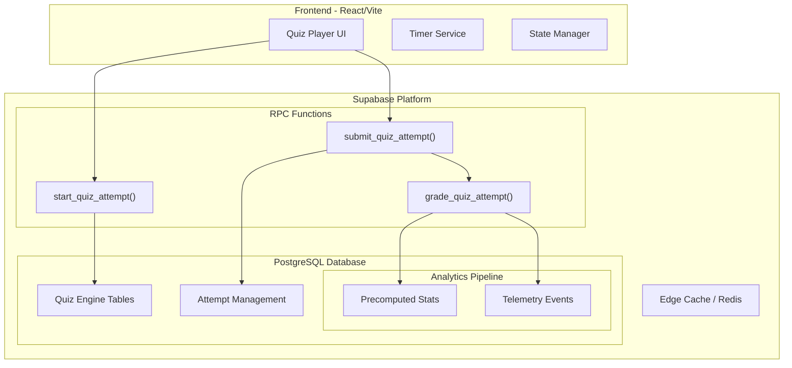
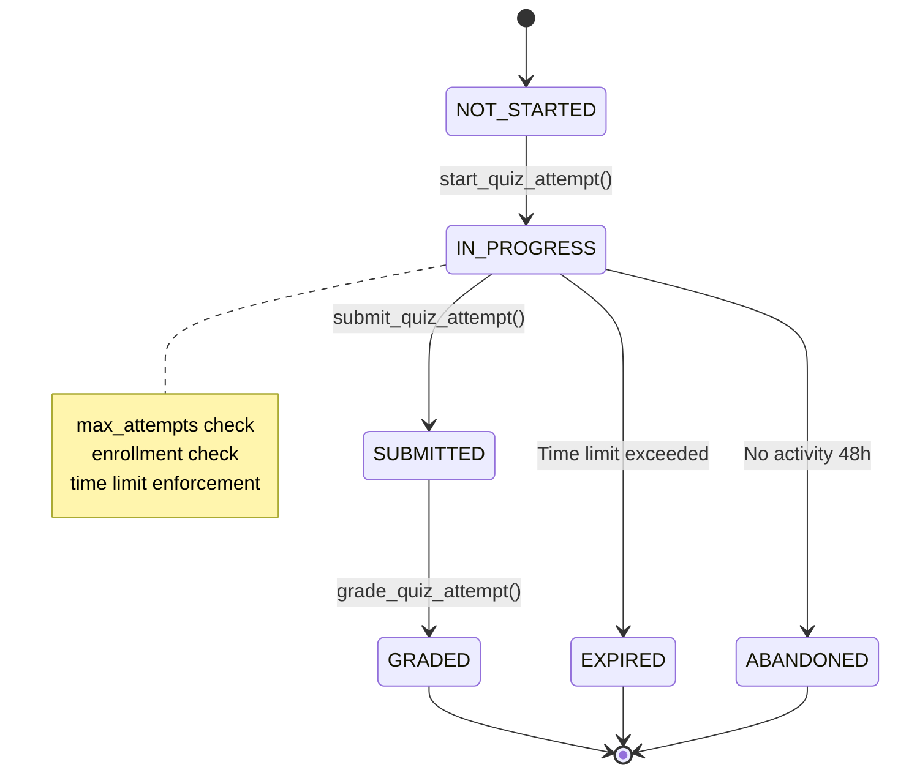
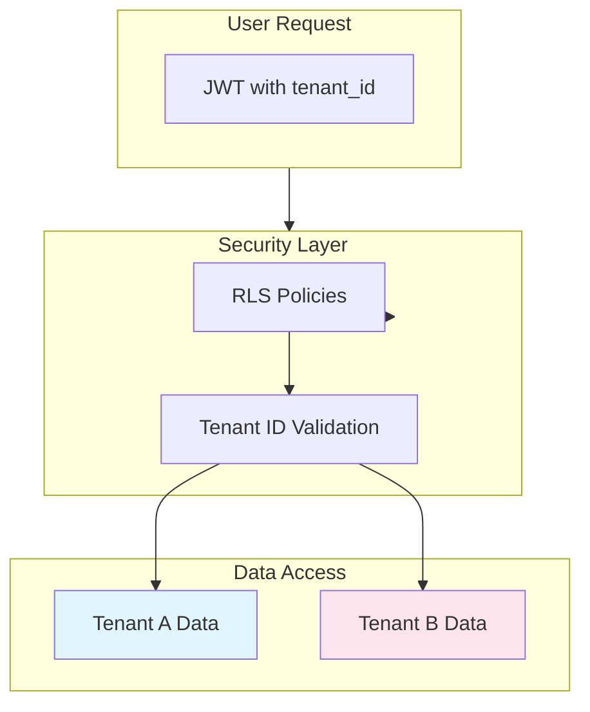
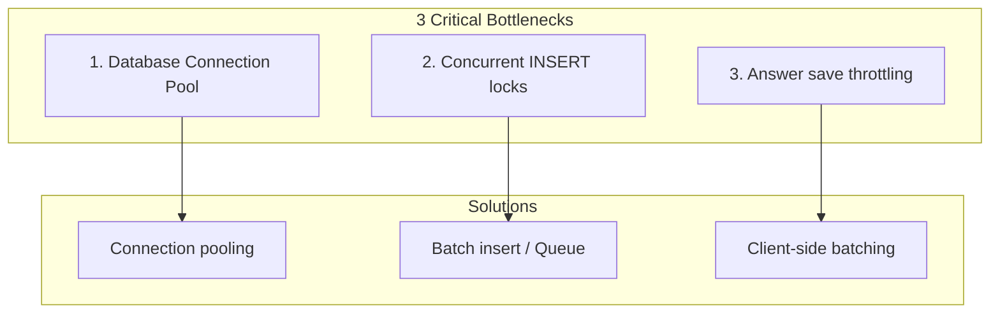
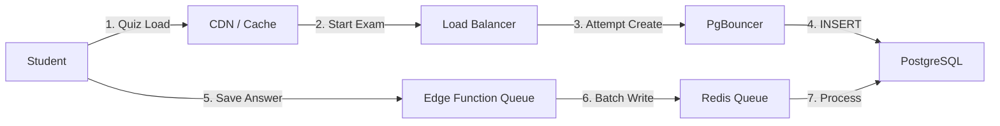

# EduSync Quiz System Technical Architecture

## Production-Grade Design for 1M Students with 100K Concurrent Exams

---

## Table of Contents

1. [Executive Summary](#1-executive-summary)
2. [Quiz Subsystems Architecture](#2-quiz-subsystems-architecture)
3. [Quiz Engine Principles](#3-quiz-engine-principles)
4. [Database Architecture](#4-database-architecture)
5. [Quiz Features Implementation](#5-quiz-features-implementation)
6. [Backend Architecture](#6-backend-architecture)
7. [Security & Multi-Tenant Isolation](#7-security--multi-tenant-isolation)
8. [Performance & Scalability](#8-performance--scalability)
9. [Testing & Verification](#9-testing--verification)
10. [Frontend Architecture](#10-frontend-architecture)
11. [Failure Cases & Anti-Patterns](#11-failure-cases--anti-patterns)
12. [Implementation Roadmap](#12-implementation-roadmap)

---

## 1. Executive Summary



### Design Goals

| Goal | Target | Current Status |
|------|--------|----------------|
| Concurrent Students | 100,000 | Implemented |
| Total Students | 1,000,000 | Designed |
| Multi-Tenant | 100+ Schools | Implemented |
| Auto-Grading | < 1 second | Implemented |
| Quiz Load | < 500ms | Implemented |

---

## 2. Quiz Subsystems Architecture

EduSync memiliki **dua subsistem quiz** dengan tujuan berbeda namun berbagi engine backend yang sama.

| Subsystem | Purpose | Entry Point | Builder |
|-----------|---------|-------------|--------|
| **Lesson Quiz** | Learning reinforcement after lesson | Smart Player | Course Builder |
| **Standalone Quiz** | Assessment platform (Quizizz/Kahoot style) | Kuis & Evaluasi | Quiz Platform Builder |

### System Architecture

```
                    EduSync Quiz System
                            │
                    Quiz Engine (Backend)
              PostgreSQL + RPC + RLS + Analytics
                            │
            ┌───────────────┴───────────────┐
            │                               │
       Lesson Quiz                    Standalone Quiz
       Smart Player                   Quiz Platform
            │                               │
  LessonViewer.tsx                     Quiz.tsx
  QuizViewer.tsx                       QuizGradebook.tsx
                                       QuizTakingView
```

### Key Differences

| Feature | Lesson Quiz | Standalone Quiz |
|---------|-------------|----------------|
| Linked to course/lesson | ✅ | ❌ |
| Quiz listing page | ❌ | ✅ |
| AI question generator | ❌ | ✅ (planned) |
| Question bank | ❌ | ✅ (planned) |
| Analytics dashboard | Limited | Full |
| Leaderboard | ❌ | Optional |
| Gradebook | ❌ | ✅ |
| Time limits | ✅ | ✅ |
| Multi-type questions | ✅ | ✅ |

### Data Ownership

> [!IMPORTANT]
> **Quiz data is NOT duplicated.** Both subsystems read from the same `quizzes`, `quiz_questions`, and `quiz_options` tables.
>
> - **Lesson Quiz Builder** → Course Builder (`QuizBlockEditor.tsx`) → creates quizzes linked to a lesson
> - **Standalone Quiz Builder** → Quiz Platform (planned) → creates quizzes without lesson linkage
>
> The `quizzes.lesson_id` field determines ownership:
> - `lesson_id IS NOT NULL` → Lesson Quiz (appears in Smart Player)
> - `lesson_id IS NULL` → Standalone Quiz (appears in Kuis & Evaluasi)

---

## 3. Quiz Engine Principles

These principles apply to **all quiz subsystems** and must be followed by all developers.

1. **Backend-first** — All scoring, validation, and attempt management happens in PostgreSQL RPC functions. Frontend is a thin client.
2. **Attempt records are immutable** — Once a quiz attempt is submitted, the `quiz_attempts` and `quiz_attempt_questions` records cannot be modified (except by manual grading flow).
3. **Question order is deterministic** — Shuffle uses `md5(question_id || attempt_seed)`, not `random()`. This ensures consistent ordering on attempt recovery.
4. **All scoring happens server-side** — `submit_quiz_attempt()` RPC calculates scores. Frontend never computes scores.
5. **Quiz subsystems share the same engine** — Lesson Quiz and Standalone Quiz use identical backend tables, RPCs, and RLS policies. Only the frontend entry points differ.
6. **Question snapshots are frozen at attempt start** — `question_snapshot JSONB` captures the full question + options at `start_quiz_attempt()`. Teacher edits after attempt start do NOT affect in-progress attempts.
7. **Multi-tenant isolation is non-negotiable** — Every query enforces `tenant_id`. RLS is always enabled.

> [!CAUTION]
> **Quiz Engine ≠ UI.** The Quiz Engine is the backend system (tables + RPCs + RLS). UI components are consumers of the engine, not part of it. Never put business logic in React components.

---

## 4. Database Architecture

### 2.1 Core Tables Schema

```sql
-- ============================================================================
-- CORE QUIZ TABLES
-- ============================================================================

-- Multi-tenant isolation table
CREATE TABLE IF NOT EXISTS public.tenants (
    id UUID PRIMARY KEY DEFAULT gen_random_uuid(),
    name TEXT NOT NULL,
    slug TEXT UNIQUE NOT NULL,
    plan TEXT DEFAULT 'free',
    settings JSONB DEFAULT '{}',
    created_at TIMESTAMPTZ DEFAULT now(),
    updated_at TIMESTAMPTZ DEFAULT now()
);

-- Courses table with tenant isolation
CREATE TABLE IF NOT EXISTS public.courses (
    id UUID PRIMARY KEY DEFAULT gen_random_uuid(),
    tenant_id UUID REFERENCES tenants(id) ON DELETE CASCADE,
    title TEXT NOT NULL,
    description TEXT,
    subject TEXT,
    grade TEXT,
    created_by UUID REFERENCES auth.users(id),
    created_at TIMESTAMPTZ DEFAULT now(),
    updated_at TIMESTAMPTZ DEFAULT now()
);

-- Classes table
CREATE TABLE IF NOT EXISTS public.classes (
    id UUID PRIMARY KEY DEFAULT gen_random_uuid(),
    tenant_id UUID REFERENCES tenants(id) ON DELETE CASCADE,
    course_id UUID REFERENCES courses(id) ON DELETE CASCADE,
    name TEXT NOT NULL,
    code TEXT,
    max_students INTEGER DEFAULT 30,
    created_by UUID REFERENCES auth.users(id),
    created_at TIMESTAMPTZ DEFAULT now(),
    updated_at TIMESTAMPTZ DEFAULT now()
);

-- Enrollments table
CREATE TABLE IF NOT EXISTS public.enrollments (
    id UUID PRIMARY KEY DEFAULT gen_random_uuid(),
    tenant_id UUID REFERENCES tenants(id) ON DELETE CASCADE,
    student_id UUID REFERENCES auth.users(id),
    class_id UUID REFERENCES classes(id) ON DELETE CASCADE,
    status TEXT DEFAULT 'ACTIVE',
    enrolled_at TIMESTAMPTZ DEFAULT now(),
    dropped_at TIMESTAMPTZ,
    UNIQUE(tenant_id, student_id, class_id)
);
```

### 2.2 Quiz Tables

```sql
-- ============================================================================
-- QUIZ TABLES
-- ============================================================================

-- Quiz Mode Enum
CREATE TYPE quiz_mode AS ENUM ('practice', 'graded', 'exam');

-- Quiz Status Enum
CREATE TYPE quiz_status AS ENUM ('draft', 'published', 'archived');

-- Main Quiz Table
CREATE TABLE IF NOT EXISTS public.quizzes (
    id UUID PRIMARY KEY DEFAULT gen_random_uuid(),
    tenant_id UUID REFERENCES tenants(id) ON DELETE CASCADE NOT NULL,
    course_id UUID REFERENCES courses(id) ON DELETE CASCADE,
    class_id UUID REFERENCES classes(id) ON DELETE SET NULL,
    title TEXT NOT NULL,
    description TEXT,
    mode quiz_mode DEFAULT 'graded',
    status quiz_status DEFAULT 'draft',
    
    -- Attempt Control
    max_attempts INTEGER DEFAULT 1,
    time_limit_minutes INTEGER DEFAULT 30,
    
    -- Quiz Window
    start_at TIMESTAMPTZ,
    end_at TIMESTAMPTZ,
    
    -- Scoring
    passing_score INTEGER DEFAULT 70,
    
    -- Anti-cheating
    shuffle_questions BOOLEAN DEFAULT false,
    shuffle_options BOOLEAN DEFAULT false,
    show_feedback BOOLEAN DEFAULT true,
    show_correct_answers BOOLEAN DEFAULT true,
    
    -- Metadata
    created_by UUID REFERENCES auth.users(id),
    created_at TIMESTAMPTZ DEFAULT now(),
    updated_at TIMESTAMPTZ DEFAULT now()
);

-- Question Type Enum
CREATE TYPE question_type AS ENUM (
    'MCQ',           -- Single choice multiple choice
    'MULTIPLE_SELECT', -- Multiple correct answers
    'TRUE_FALSE',    -- True/False questions
    'SHORT_ANSWER',  -- Short text answer
    'ESSAY'          -- Essay/long answer
);

-- Quiz Questions Table
CREATE TABLE IF NOT EXISTS public.quiz_questions (
    id UUID PRIMARY KEY DEFAULT gen_random_uuid(),
    tenant_id UUID REFERENCES tenants(id) ON DELETE CASCADE NOT NULL,
    quiz_id UUID REFERENCES quizzes(id) ON DELETE CASCADE NOT NULL,
    
    -- Question Content
    text TEXT NOT NULL,
    question_type question_type NOT NULL DEFAULT 'MCQ',
    explanation TEXT,
    points INTEGER DEFAULT 1,
    difficulty TEXT DEFAULT 'medium',
    
    -- Metadata
    "order" INTEGER DEFAULT 0,
    created_by UUID REFERENCES auth.users(id),
    created_at TIMESTAMPTZ DEFAULT now(),
    updated_at TIMESTAMPTZ DEFAULT now()
);

-- Quiz Options Table
CREATE TABLE IF NOT EXISTS public.quiz_options (
    id UUID PRIMARY KEY DEFAULT gen_random_uuid(),
    tenant_id UUID REFERENCES tenants(id) ON DELETE CASCADE NOT NULL,
    question_id UUID REFERENCES quiz_questions(id) ON DELETE CASCADE NOT NULL,
    
    -- Option Content
    text TEXT NOT NULL,
    is_correct BOOLEAN DEFAULT false,
    explanation TEXT,
    
    -- Metadata
    "order" INTEGER DEFAULT 0,
    created_at TIMESTAMPTZ DEFAULT now()
);

-- Attempt Status Enum
CREATE TYPE attempt_status AS ENUM (
    'NOT_STARTED',
    'IN_PROGRESS',
    'SUBMITTED',
    'GRADED',
    'EXPIRED',
    'ABANDONED'
);

-- Quiz Attempts Table
CREATE TABLE IF NOT EXISTS public.quiz_attempts (
    id UUID PRIMARY KEY DEFAULT gen_random_uuid(),
    tenant_id UUID REFERENCES tenants(id) ON DELETE CASCADE NOT NULL,
    quiz_id UUID REFERENCES quizzes(id) ON DELETE CASCADE NOT NULL,
    student_id UUID REFERENCES auth.users(id) NOT NULL,
    
    -- Attempt State
    status attempt_status DEFAULT 'NOT_STARTED',
    attempt_number INTEGER DEFAULT 1,  -- For unique constraint
    
    -- Scoring (precomputed - immutable after submit)
    score NUMERIC(5,2),
    passed BOOLEAN,
    correct_count INTEGER DEFAULT 0,
    total_questions INTEGER DEFAULT 0,
    
    -- Timing
    started_at TIMESTAMPTZ,
    submitted_at TIMESTAMPTZ,
    finished_at TIMESTAMPTZ,
    expires_at TIMESTAMPTZ,
    time_spent_seconds INTEGER,
    
    -- Anti-cheating
    cheating_signals JSONB DEFAULT '[]'::jsonb,
    
    -- Randomization seed for this attempt (for deterministic shuffle)
    question_seed UUID,
    
    -- Metadata
    created_at TIMESTAMPTZ DEFAULT now(),
    updated_at TIMESTAMPTZ DEFAULT now(),
    
    -- FIXED: Correct unique constraint with attempt_number
    UNIQUE(quiz_id, student_id, attempt_number)
);

-- Attempt Questions Snapshot Table
-- Stores randomized questions for each attempt (immutable)
CREATE TABLE IF NOT EXISTS public.quiz_attempt_questions (
    id UUID PRIMARY KEY DEFAULT gen_random_uuid(),
    tenant_id UUID REFERENCES tenants(id) ON DELETE CASCADE NOT NULL,
    attempt_id UUID REFERENCES quiz_attempts(id) ON DELETE CASCADE NOT NULL,
    question_id UUID REFERENCES quiz_questions(id) ON DELETE CASCADE NOT NULL,
    
    -- Snapshot of question at attempt time
    text TEXT NOT NULL,
    question_type question_type NOT NULL,
    explanation TEXT,
    points INTEGER DEFAULT 1,
    order_index INTEGER NOT NULL,
    
    -- IMPROVED: Full option snapshot for immutability
    option_snapshot JSONB DEFAULT '[]'::jsonb,
    
    -- Student's answer (immutable after submit)
    -- FIXED: Use array for MULTIPLE_SELECT
    selected_option_id UUID REFERENCES quiz_options(id),
    selected_option_ids UUID[] DEFAULT '{}',  -- For MULTIPLE_SELECT
    selected_text TEXT,
    is_correct BOOLEAN,
    earned_points NUMERIC(5,2) DEFAULT 0,
    
    -- For manual grading
    graded_at TIMESTAMPTZ,
    graded_by UUID REFERENCES auth.users(id),
    teacher_comment TEXT,
    
    created_at TIMESTAMPTZ DEFAULT now(),
    updated_at TIMESTAMPTZ DEFAULT now(),
    
    UNIQUE(attempt_id, question_id)
);

-- Partitioned version for 50M+ rows
-- Uncomment for production with large scale:
/*
CREATE TABLE public.quiz_attempt_questions_partitioned (
    LIKE public.quiz_attempt_questions INCLUDING ALL
) PARTITION BY RANGE (created_at);

CREATE TABLE public.quiz_attempt_questions_2026_01 PARTITION OF public.quiz_attempt_questions_partitioned
    FOR VALUES FROM ('2026-01-01') TO ('2026-02-01');
*/
```

### 2.3 Question Bank Tables

```sql
-- ============================================================================
-- QUESTION BANK TABLES
-- ============================================================================

-- Question Bank for reusable questions
CREATE TABLE IF NOT EXISTS public.question_bank (
    id UUID PRIMARY KEY DEFAULT gen_random_uuid(),
    tenant_id UUID REFERENCES tenants(id) ON DELETE CASCADE NOT NULL,
    
    -- Question Content
    text TEXT NOT NULL,
    question_type question_type NOT NULL DEFAULT 'MCQ',
    explanation TEXT,
    difficulty TEXT DEFAULT 'medium',
    
    -- Metadata
    tags TEXT[],
    course_id UUID REFERENCES courses(id),
    created_by UUID REFERENCES auth.users(id),
    created_at TIMESTAMPTZ DEFAULT now(),
    updated_at TIMESTAMPTZ DEFAULT now(),
    
    -- Usage statistics
    times_used INTEGER DEFAULT 0,
    times_correct INTEGER DEFAULT 0
);

-- Question Bank Options
CREATE TABLE IF NOT EXISTS public.question_bank_options (
    id UUID PRIMARY KEY DEFAULT gen_random_uuid(),
    tenant_id UUID REFERENCES tenants(id) ON DELETE CASCADE NOT NULL,
    question_id UUID REFERENCES question_bank(id) ON DELETE CASCADE NOT NULL,
    
    text TEXT NOT NULL,
    is_correct BOOLEAN DEFAULT false,
    explanation TEXT,
    "order" INTEGER DEFAULT 0
);

-- Quiz Question Bank Mapping
-- Defines which questions from bank are included in a quiz
CREATE TABLE IF NOT EXISTS public.quiz_question_bank (
    id UUID PRIMARY KEY DEFAULT gen_random_uuid(),
    quiz_id UUID REFERENCES quizzes(id) ON DELETE CASCADE NOT NULL,
    question_bank_id UUID REFERENCES question_bank(id) ON DELETE CASCADE NOT NULL,
    
    -- Configuration
    num_questions INTEGER,  -- If NULL, use all; if set, randomly select N questions
    points_each INTEGER DEFAULT 1,
    
    created_at TIMESTAMPTZ DEFAULT now(),
    UNIQUE(quiz_id, question_bank_id)
);
```

### 2.4 Analytics Tables

```sql
-- ============================================================================
-- ANALYTICS TABLES
-- ============================================================================

-- Precomputed Quiz Statistics
CREATE TABLE IF NOT EXISTS public.quiz_stats (
    id UUID PRIMARY KEY DEFAULT gen_random_uuid(),
    tenant_id UUID REFERENCES tenants(id) ON DELETE CASCADE NOT NULL,
    quiz_id UUID REFERENCES quizzes(id) ON DELETE CASCADE NOT NULL,
    
    -- Precomputed metrics (updated via trigger/cron)
    total_attempts INTEGER DEFAULT 0,
    completed_attempts INTEGER DEFAULT 0,
    average_score NUMERIC(5,2),
    median_score NUMERIC(5,2),
    highest_score NUMERIC(5,2),
    lowest_score NUMERIC(5,2),
    pass_rate NUMERIC(5,2),
    average_time_seconds INTEGER,
    
    -- Difficulty index calculation
    difficulty_index NUMERIC(5,2),
    discrimination_index NUMERIC(5,2),
    
    last_updated TIMESTAMPTZ DEFAULT now(),
    UNIQUE(quiz_id)
);

-- Precomputed Question Statistics
CREATE TABLE IF NOT EXISTS public.question_stats (
    id UUID PRIMARY KEY DEFAULT gen_random_uuid(),
    tenant_id UUID REFERENCES tenants(id) ON DELETE CASCADE NOT NULL,
    question_id UUID REFERENCES quiz_questions(id) ON DELETE CASCADE NOT NULL,
    quiz_id UUID REFERENCES quizzes(id) ON DELETE CASCADE NOT NULL,
    
    -- Precomputed metrics
    times_shown INTEGER DEFAULT 0,
    times_correct INTEGER DEFAULT 0,
    difficulty_percent NUMERIC(5,2),  -- % answered correctly
    
    -- Response distribution
    option_distribution JSONB DEFAULT '{}'::jsonb,
    
    last_updated TIMESTAMPTZ DEFAULT now(),
    UNIQUE(question_id, quiz_id)
);

-- Student Quiz History (for analytics)
CREATE TABLE IF NOT EXISTS public.student_quiz_history (
    id UUID PRIMARY KEY DEFAULT gen_random_uuid(),
    tenant_id UUID REFERENCES tenants(id) ON DELETE CASCADE NOT NULL,
    student_id UUID REFERENCES auth.users(id) NOT NULL,
    quiz_id UUID REFERENCES quizzes(id) ON DELETE CASCADE NOT NULL,
    
    -- Attempt summary
    best_score NUMERIC(5,2),
    total_attempts INTEGER DEFAULT 0,
    passed BOOLEAN DEFAULT false,
    last_attempt_at TIMESTAMPTZ,
    
    -- Time-based metrics
    average_time_seconds INTEGER,
    fastest_time_seconds INTEGER,
    
    created_at TIMESTAMPTZ DEFAULT now(),
    updated_at TIMESTAMPTZ DEFAULT now(),
    UNIQUE(student_id, quiz_id)
);

-- IMPROVED: Quiz Leaderboard Materialized View
-- For fast leaderboard queries without scanning millions of rows
CREATE MATERIALIZED VIEW IF NOT EXISTS public.quiz_leaderboard AS
SELECT 
    qa.quiz_id,
    qa.tenant_id,
    qa.student_id,
    p.full_name,
    qa.score,
    qa.time_spent_seconds,
    qa.submitted_at,
    ROW_NUMBER() OVER (
        PARTITION BY qa.quiz_id, qa.tenant_id 
        ORDER BY qa.score DESC, qa.time_spent_seconds ASC
    ) as rank
FROM public.quiz_attempts qa
JOIN public.profiles p ON p.id = qa.student_id
WHERE qa.status = 'GRADED'
WITH DATA;

-- Index for leaderboard refresh
CREATE UNIQUE INDEX IF NOT EXISTS idx_quiz_leaderboard_unique 
ON public.quiz_leaderboard(quiz_id, tenant_id, student_id);

-- Function to refresh leaderboard
CREATE OR REPLACE FUNCTION public.refresh_quiz_leaderboard(p_quiz_id UUID DEFAULT NULL)
RETURNS void
LANGUAGE plpgsql
AS $
BEGIN
    IF p_quiz_id IS NULL THEN
        REFRESH MATERIALIZED VIEW CONCURRENTLY public.quiz_leaderboard;
    ELSE
        DELETE FROM public.quiz_leaderboard WHERE quiz_id = p_quiz_id;
        INSERT INTO public.quiz_leaderboard
        SELECT 
            qa.quiz_id,
            qa.tenant_id,
            qa.student_id,
            p.full_name,
            qa.score,
            qa.time_spent_seconds,
            qa.submitted_at,
            ROW_NUMBER() OVER (
                PARTITION BY qa.quiz_id, qa.tenant_id 
                ORDER BY qa.score DESC, qa.time_spent_seconds ASC
            ) as rank
        FROM public.quiz_attempts qa
        JOIN public.profiles p ON p.id = qa.student_id
        WHERE qa.status = 'GRADED' AND qa.quiz_id = p_quiz_id;
    END IF;
END;
$;
```

### 2.5 Indexes

```sql
-- ============================================================================
-- INDEXES FOR PERFORMANCE
-- ============================================================================

-- Tenant isolation indexes
CREATE INDEX idx_quizzes_tenant ON public.quizzes(tenant_id);
CREATE INDEX idx_quiz_questions_tenant ON public.quiz_questions(tenant_id);
CREATE INDEX idx_quiz_options_tenant ON public.quiz_options(tenant_id);
CREATE INDEX idx_quiz_attempts_tenant ON public.quiz_attempts(tenant_id);
CREATE INDEX idx_quiz_attempt_questions_tenant ON public.quiz_attempt_questions(tenant_id);

-- Quiz attempt indexes
CREATE INDEX idx_quiz_attempts_quiz_student ON public.quiz_attempts(quiz_id, student_id);
CREATE INDEX idx_quiz_attempts_status ON public.quiz_attempts(status);
CREATE INDEX idx_quiz_attempts_submitted_at ON public.quiz_attempts(submitted_at)
    WHERE status IN ('SUBMITTED', 'GRADED');

-- Analytics indexes
CREATE INDEX idx_quiz_stats_quiz ON public.quiz_stats(quiz_id);
CREATE INDEX idx_question_stats_question ON public.question_stats(question_id);
CREATE INDEX idx_student_quiz_history_student ON public.student_quiz_history(student_id);

-- Question bank indexes
CREATE INDEX idx_question_bank_tenant ON public.question_bank(tenant_id);
CREATE INDEX idx_question_bank_course ON public.question_bank(course_id);

-- Partition support indexes
CREATE INDEX idx_quiz_attempts_created ON public.quiz_attempts(created_at);
CREATE INDEX idx_quiz_attempt_questions_created ON public.quiz_attempt_questions(created_at);
```

---

## 3. Quiz Features Implementation

### 3.1 Attempt Control System



**Implementation:**

```sql
-- RPC: Start Quiz Attempt with full validation
CREATE OR REPLACE FUNCTION public.start_quiz_attempt(p_quiz_id UUID)
RETURNS JSONB
LANGUAGE plpgsql
SECURITY DEFINER
AS $$
DECLARE
    v_tenant_id UUID;
    v_attempt_id UUID;
    v_status public.attempt_status;
    v_time_limit INTEGER;
    v_expires_at TIMESTAMPTZ;
    v_max_attempts INTEGER;
    v_attempt_count INTEGER;
    v_course_id UUID;
    v_is_enrolled BOOLEAN;
    v_quiz_mode quiz_mode;
BEGIN
    -- 1. Identity & Tenant Isolation
    SELECT tenant_id INTO v_tenant_id FROM public.profiles WHERE id = auth.uid();
    IF v_tenant_id IS NULL THEN
        RAISE EXCEPTION 'Tenant not found';
    END IF;

    -- 2. Validate Quiz Ownership & Metadata
    SELECT tenant_id, time_limit_minutes, max_attempts, course_id, mode 
    INTO v_tenant_id, v_time_limit, v_max_attempts, v_course_id, v_quiz_mode
    FROM public.quizzes 
    WHERE id = p_quiz_id AND tenant_id = v_tenant_id AND status = 'published';

    IF v_tenant_id IS NULL THEN
        RAISE EXCEPTION 'Quiz not found or not published';
    END IF;

    -- 3. Check Quiz Window (start_at, end_at)
    IF v_quiz_mode != 'practice' THEN
        IF now() < (SELECT start_at FROM public.quizzes WHERE id = p_quiz_id) THEN
            RAISE EXCEPTION 'Quiz has not started yet';
        END IF;
        IF now() > (SELECT end_at FROM public.quizzes WHERE id = p_quiz_id) THEN
            RAISE EXCEPTION 'Quiz has ended';
        END IF;
    END IF;

    -- 4. Enrollment Check
    SELECT EXISTS (
        SELECT 1 FROM public.enrollments e
        JOIN public.classes c ON c.id = e.class_id
        WHERE e.student_id = auth.uid() 
        AND c.course_id = v_course_id
        AND e.status = 'ACTIVE'
        AND e.tenant_id = v_tenant_id
    ) INTO v_is_enrolled;

    IF NOT v_is_enrolled THEN
        RAISE EXCEPTION 'Not enrolled in this course';
    END IF;

    -- 5. Recovery: Check for active attempt
    SELECT id, status INTO v_attempt_id, v_status
    FROM public.quiz_attempts
    WHERE student_id = auth.uid() AND quiz_id = p_quiz_id AND status = 'IN_PROGRESS'
    ORDER BY started_at DESC
    LIMIT 1;

    IF v_attempt_id IS NOT NULL THEN
        RETURN jsonb_build_object(
            'attempt_id', v_attempt_id,
            'status', v_status,
            'recovered', true
        );
    END IF;

    -- 6. Attempt Limit Validation
    IF v_quiz_mode = 'practice' THEN
        -- Practice mode: unlimited attempts
        v_max_attempts := 999999;
    ELSIF v_quiz_mode = 'exam' THEN
        -- Exam mode: strict 1 attempt
        v_max_attempts := 1;
    END IF;
    
    -- For graded mode, use the configured max_attempts
    -- For practice, skip the check
    
    IF v_quiz_mode != 'practice' THEN
        SELECT count(*) INTO v_attempt_count
        FROM public.quiz_attempts
        WHERE quiz_id = p_quiz_id 
          AND student_id = auth.uid() 
          AND status IN ('SUBMITTED', 'GRADED');

        IF v_attempt_count >= COALESCE(v_max_attempts, 1) THEN
            RAISE EXCEPTION 'Attempt limit reached. Maximum allowed: %', v_max_attempts;
        END IF;
    END IF;

    -- 7. Create New Attempt
    IF v_time_limit > 0 AND v_quiz_mode != 'practice' THEN
        v_expires_at := now() + (v_time_limit * INTERVAL '1 minute');
    END IF;

    INSERT INTO public.quiz_attempts (
        quiz_id, student_id, tenant_id, status, started_at, expires_at,
        question_seed
    ) VALUES (
        p_quiz_id, auth.uid(), v_tenant_id, 'IN_PROGRESS', now(), v_expires_at,
        gen_random_uuid()
    ) RETURNING id INTO v_attempt_id;

    -- 8. Snapshot Questions with BACKEND RANDOMIZATION
    -- Uses attempt-specific seed for reproducible randomization
    INSERT INTO public.quiz_attempt_questions (
        attempt_id, question_id, tenant_id, text, question_type, explanation, 
        points, order_index
    )
    SELECT 
        v_attempt_id,
        q.id,
        v_tenant_id,
        q.text,
        q.question_type,
        q.explanation,
        q.points,
        ROW_NUMBER() OVER (ORDER BY md5(q.id::text || v_question_seed::text))  -- Deterministic shuffle
    FROM public.quiz_questions q
    WHERE q.quiz_id = p_quiz_id;

    RETURN jsonb_build_object(
        'attempt_id', v_attempt_id,
        'status', 'IN_PROGRESS',
        'recovered', false,
        'expires_at', v_expires_at
    );
END;
$$;
```

### 3.2 Auto-Grading System

```sql
-- RPC: Submit and Grade Quiz Attempt
CREATE OR REPLACE FUNCTION public.submit_quiz_attempt(
    p_quiz_id UUID,
    p_answers JSONB
)
RETURNS JSONB
LANGUAGE plpgsql
SECURITY DEFINER
AS $$
DECLARE
    v_attempt_id UUID;
    v_tenant_id UUID;
    v_student_id UUID := auth.uid();
    v_status attempt_status;
    v_quiz_mode quiz_mode;
    v_show_feedback BOOLEAN;
    v_show_correct BOOLEAN;
    v_passing_score INTEGER;
    v_total_questions INTEGER;
    v_correct_count INTEGER := 0;
    v_score NUMERIC(5,2);
    v_passed BOOLEAN;
    v_time_spent INTEGER;
    v_expires_at TIMESTAMPTZ;
    v_answer JSONB;
    v_question_id UUID;
    v_selected_option_id UUID;
    v_is_correct BOOLEAN;
    v_question_type question_type;
    v_has_essay BOOLEAN := false;
BEGIN
    -- 1. Get attempt and validate
    SELECT id, tenant_id, status, expires_at
    INTO v_attempt_id, v_tenant_id, v_status, v_expires_at
    FROM public.quiz_attempts
    WHERE quiz_id = p_quiz_id 
      AND student_id = v_student_id 
      AND status = 'IN_PROGRESS'
    ORDER BY started_at DESC
    LIMIT 1
    FOR UPDATE;  -- Lock to prevent double submission

    IF v_attempt_id IS NULL THEN
        RAISE EXCEPTION 'No active attempt found';
    END IF;

    -- 2. Check time limit
    IF v_expires_at IS NOT NULL AND now() > v_expires_at THEN
        UPDATE public.quiz_attempts
        SET status = 'EXPIRED', finished_at = v_expires_at
        WHERE id = v_attempt_id;
        RAISE EXCEPTION 'Time limit exceeded';
    END IF;

    -- 3. Get quiz settings
    SELECT mode, show_feedback, show_correct_answers, passing_score
    INTO v_quiz_mode, v_show_feedback, v_show_correct, v_passing_score
    FROM public.quizzes
    WHERE id = p_quiz_id;

    -- 4. Process each answer
    FOR v_answer IN SELECT * FROM jsonb_array_elements(p_answers)
    LOOP
        v_question_id := (v_answer->>'question_id')::UUID;
        v_selected_option_id := (v_answer->>'option_id')::UUID;
        
        -- Get question type
        SELECT question_type INTO v_question_type
        FROM public.quiz_attempt_questions
        WHERE id = v_attempt_id AND question_id = v_question_id;
        
        -- Check if it's an essay or short answer (needs manual grading)
        IF v_question_type IN ('ESSAY', 'SHORT_ANSWER') THEN
            v_has_essay := true;
            -- Still save the answer
            UPDATE public.quiz_attempt_questions
            SET selected_text = v_answer->>'text_answer',
                updated_at = now()
            WHERE attempt_id = v_attempt_id AND question_id = v_question_id;
            CONTINUE;
        END IF;
        
        -- Auto-grade MCQ, TRUE_FALSE, MULTIPLE_SELECT
        IF v_selected_option_id IS NOT NULL THEN
            SELECT is_correct INTO v_is_correct
            FROM public.quiz_options
            WHERE id = v_selected_option_id AND tenant_id = v_tenant_id;
            
            UPDATE public.quiz_attempt_questions
            SET selected_option_id = v_selected_option_id,
                is_correct = COALESCE(v_is_correct, false),
                earned_points = CASE WHEN COALESCE(v_is_correct, false) THEN points ELSE 0 END,
                updated_at = now()
            WHERE attempt_id = v_attempt_id AND question_id = v_question_id;
            
            IF COALESCE(v_is_correct, false) THEN
                v_correct_count := v_correct_count + 1;
            END IF;
        END IF;
    END LOOP;

    -- 5. Calculate score
    SELECT COUNT(*) INTO v_total_questions
    FROM public.quiz_attempt_questions
    WHERE attempt_id = v_attempt_id;

    IF v_total_questions > 0 THEN
        -- Only count auto-graded questions for score
        v_score := ROUND(
            (SELECT COALESCE(SUM(earned_points), 0) 
             FROM public.quiz_attempt_questions 
             WHERE attempt_id = v_attempt_id 
               AND question_type NOT IN ('ESSAY', 'SHORT_ANSWER'))
            /
            (SELECT COALESCE(SUM(points), 1) 
             FROM public.quiz_attempt_questions 
             WHERE attempt_id = v_attempt_id 
               AND question_type NOT IN ('ESSAY', 'SHORT_ANSWER')) * 100
        , 2);
    END IF;

    -- 6. Determine pass/fail
    v_passed := v_score >= v_passing_score;

    -- 7. Calculate time spent
    v_time_spent := EXTRACT(EPOCH FROM (now() - started_at))::INTEGER
    FROM public.quiz_attempts WHERE id = v_attempt_id;

    -- 8. Update attempt (immutable - no UPDATE after this)
    IF v_has_essay THEN
        -- Move to submitted, pending manual grading
        UPDATE public.quiz_attempts
        SET status = 'SUBMITTED',
            submitted_at = now(),
            finished_at = now(),
            time_spent_seconds = v_time_spent,
            score = v_score,
            correct_count = v_correct_count,
            total_questions = v_total_questions,
            updated_at = now()
        WHERE id = v_attempt_id;
    ELSE
        -- Auto-grade complete
        UPDATE public.quiz_attempts
        SET status = 'GRADED',
            submitted_at = now(),
            finished_at = now(),
            time_spent_seconds = v_time_spent,
            score = v_score,
            passed = v_passed,
            correct_count = v_correct_count,
            total_questions = v_total_questions,
            updated_at = now()
        WHERE id = v_attempt_id;
    END IF;

    -- 9. Emit telemetry event
    PERFORM public.create_activity_event(
        v_tenant_id,
        v_student_id,
        'quiz_attempt_activity',
        jsonb_build_object(
            'action', 'quiz_submitted',
            'quiz_id', p_quiz_id,
            'attempt_id', v_attempt_id,
            'score', v_score,
            'passed', v_passed,
            'has_essay', v_has_essay
        )
    );

    -- 10. Return result
    RETURN jsonb_build_object(
        'attempt_id', v_attempt_id,
        'score', v_score,
        'passed', v_passed,
        'correct_answers', v_correct_count,
        'total_questions', v_total_questions,
        'status', CASE WHEN v_has_essay THEN 'SUBMITTED' ELSE 'GRADED' END,
        'show_feedback', v_show_feedback,
        'show_correct_answers', v_show_correct
    );
END;
$$;
```

### 3.3 Quiz Modes

| Mode | Max Attempts | Time Score Recorded | Limit | Feedback | Use Case |
|------|--------------|------------|----------|----------------|----------|
| **practice** | Unlimited | Optional | Immediate | No | Learning |
| **graded** | Configurable | Required | After submit | Yes | Homework |
| **exam** | 1 | Strict (no recovery) | After deadline | Yes | Final Exam |

```sql
-- Quiz Mode Configuration
ALTER TABLE public.quizzes ADD COLUMN IF NOT EXISTS mode quiz_mode DEFAULT 'graded';
ALTER TABLE public.quizzes ADD COLUMN IF NOT EXISTS show_feedback BOOLEAN DEFAULT true;
ALTER TABLE public.quizzes ADD COLUMN IF NOT EXISTS show_correct_answers BOOLEAN DEFAULT true;

-- Practice mode overrides
-- In start_quiz_attempt():
IF v_quiz_mode = 'practice' THEN
    v_max_attempts := 999999;  -- Unlimited
    v_expires_at := NULL;       -- No time limit
END IF;
```

### 3.4 Shuffle Questions & Options

```sql
-- Backend Shuffle Implementation
-- Questions are shuffled at attempt creation time using deterministic seed

-- FIXED: Use md5() with seed for reproducible randomization
-- Function to get shuffled options for a question
CREATE OR REPLACE FUNCTION public.get_shuffled_options(
    p_question_id UUID,
    p_seed UUID DEFAULT gen_random_uuid()
)
RETURNS TABLE(id UUID, text TEXT, order_index INTEGER)
LANGUAGE plpgsql
AS $
BEGIN
    RETURN QUERY
    SELECT 
        id, 
        text, 
        ROW_NUMBER() OVER (
            ORDER BY md5(id::text || p_seed::text)
        ) as order_index
    FROM public.quiz_options
    WHERE question_id = p_question_id;
END;
$;

-- Deterministic question ordering for attempt
-- Uses question_seed for reproducible shuffle
INSERT INTO public.quiz_attempt_questions (
    attempt_id, question_id, tenant_id, text, question_type, explanation, 
    points, order_index
)
SELECT 
    v_attempt_id,
    q.id,
    v_tenant_id,
    q.text,
    q.question_type,
    q.explanation,
    q.points,
    ROW_NUMBER() OVER (
        ORDER BY md5(q.id::text || v_question_seed::text)
    )
FROM public.quiz_questions q
WHERE q.quiz_id = p_quiz_id;
```

### 3.5 Manual Grading for Essays

```sql
-- RPC: Grade individual question (for essay/short answer)
CREATE OR REPLACE FUNCTION public.grade_attempt_question(
    p_attempt_question_id UUID,
    p_score NUMERIC(5,2),
    p_comment TEXT DEFAULT NULL,
    p_is_correct BOOLEAN DEFAULT NULL
)
RETURNS JSONB
LANGUAGE plpgsql
SECURITY DEFINER
AS $$
DECLARE
    v_attempt_id UUID;
    v_attempt_status attempt_status;
    v_question_points NUMERIC(5,2);
    v_tenant_id UUID;
BEGIN
    -- Get attempt info
    SELECT attempt_id, question_type, points, tenant_id
    INTO v_attempt_id, v_question_points, v_tenant_id
    FROM public.quiz_attempt_questions
    WHERE id = p_attempt_question_id;

    -- Verify grading permissions (teacher/admin only)
    IF NOT EXISTS (
        SELECT 1 FROM public.profiles p
        JOIN public.user_roles ur ON ur.user_id = p.id
        WHERE p.id = auth.uid()
          AND ur.role_id IN (SELECT id FROM public.roles WHERE name IN ('teacher', 'admin'))
    ) THEN
        RAISE EXCEPTION 'Only teachers can grade questions';
    END IF;

    -- Update the question grade
    UPDATE public.quiz_attempt_questions
    SET is_correct = p_is_correct,
        earned_points = LEAST(p_score, v_question_points),
        teacher_comment = p_comment,
        graded_at = now(),
        graded_by = auth.uid(),
        updated_at = now()
    WHERE id = p_attempt_question_id;

    -- Check if all questions are graded
    SELECT status INTO v_attempt_status
    FROM public.quiz_attempts
    WHERE id = v_attempt_id;

    IF v_attempt_status = 'SUBMITTED' THEN
        -- Recalculate total score
        PERFORM public.recalculate_attempt_score(v_attempt_id);
    END IF;

    RETURN jsonb_build_object('success', true);
END;
$$;

-- Recalculate attempt score after manual grading
CREATE OR REPLACE FUNCTION public.recalculate_attempt_score(p_attempt_id UUID)
RETURNS void
LANGUAGE plpgsql
SECURITY DEFINER
AS $$
DECLARE
    v_total_questions INTEGER;
    v_correct_count INTEGER;
    v_score NUMERIC(5,2);
    v_passing_score INTEGER;
    v_passed BOOLEAN;
    v_quiz_id UUID;
BEGIN
    -- Get quiz passing score
    SELECT quiz_id, passing_score INTO v_quiz_id, v_passing_score
    FROM public.quizzes q
    JOIN public.quiz_attempts a ON a.quiz_id = q.id
    WHERE a.id = p_attempt_id;

    -- Calculate new score
    SELECT COUNT(*), SUM(CASE WHEN is_correct THEN 1 ELSE 0 END)
    INTO v_total_questions, v_correct_count
    FROM public.quiz_attempt_questions
    WHERE attempt_id = p_attempt_id;

    -- Only count auto-graded or manually graded questions
    SELECT ROUND(
        COALESCE(SUM(earned_points), 0) /
        NULLIF(SUM(points), 0) * 100, 2
    ) INTO v_score
    FROM public.quiz_attempt_questions
    WHERE attempt_id = p_attempt_id;

    v_passed := v_score >= v_passing_score;

    -- Check if all questions are graded
    IF NOT EXISTS (
        SELECT 1 FROM public.quiz_attempt_questions
        WHERE attempt_id = p_attempt_id
          AND question_type IN ('ESSAY', 'SHORT_ANSWER')
          AND graded_at IS NULL
    ) THEN
        -- All graded, update attempt
        UPDATE public.quiz_attempts
        SET status = 'GRADED',
            score = v_score,
            passed = v_passed,
            correct_count = v_correct_count,
            total_questions = v_total_questions,
            finished_at = now()
        WHERE id = p_attempt_id;
    END IF;
END;
$$;
```

---

## 4. Backend Architecture

### 4.1 Supabase RPC Functions

| Function | Purpose | Security |
|----------|---------|----------|
| `start_quiz_attempt()` | Initialize attempt, validate enrollment, check limits | SECURITY DEFINER |
| `submit_quiz_attempt()` | Save answers, auto-grade, calculate score | SECURITY DEFINER |
| `grade_attempt_question()` | Manual grading for essays | Teacher role |
| `get_quiz_for_student()` | Get quiz with shuffled questions | RLS |
| `get_attempt_detail()` | Get attempt results for review | Student own |
| `get_question_difficulty()` | Analytics: question difficulty | Teacher role |
| `cleanup_stale_quiz_attempts()` | Mark expired/abandoned attempts | Service role |

### 4.2 Row Level Security (RLS)

```sql
-- ============================================================================
-- RLS POLICIES FOR QUIZ SYSTEM
-- ============================================================================

-- Enable RLS
ALTER TABLE public.quizzes ENABLE ROW LEVEL SECURITY;
ALTER TABLE public.quiz_questions ENABLE ROW LEVEL SECURITY;
ALTER TABLE public.quiz_options ENABLE ROW LEVEL SECURITY;
ALTER TABLE public.quiz_attempts ENABLE ROW LEVEL SECURITY;
ALTER TABLE public.quiz_attempt_questions ENABLE ROW LEVEL SECURITY;

-- Quiz: Students can view enrolled quizzes
CREATE POLICY "Students can view enrolled quizzes"
ON public.quizzes FOR SELECT
USING (
    tenant_id = (SELECT public.get_current_tenant_id())
    AND status = 'published'
    AND id IN (
        SELECT q.id FROM public.quizzes q
        JOIN public.classes c ON c.course_id = q.course_id
        JOIN public.enrollments e ON e.class_id = c.id
        WHERE e.student_id = auth.uid()
    )
);

-- Quiz: Teachers can manage their quizzes
CREATE POLICY "Teachers can manage quizzes"
ON public.quizzes FOR ALL
USING (
    tenant_id = (SELECT public.get_current_tenant_id())
    AND created_by = auth.uid()
);

-- Quiz Attempts: Students can view own attempts
CREATE POLICY "Students view own attempts"
ON public.quiz_attempts FOR SELECT
USING (
    tenant_id = (SELECT public.get_current_tenant_id())
    AND student_id = auth.uid()
);

-- Quiz Attempts: Teachers can view all attempts for their quizzes
CREATE POLICY "Teachers view all attempts"
ON public.quiz_attempts FOR SELECT
USING (
    tenant_id = (SELECT public.get_current_tenant_id())
    AND quiz_id IN (
        SELECT id FROM public.quizzes 
        WHERE created_by = auth.uid()
    )
);

-- Quiz Attempt Questions: Strict own attempt only
CREATE POLICY "Students view own attempt questions"
ON public.quiz_attempt_questions FOR SELECT
USING (
    tenant_id = (SELECT public.get_current_tenant_id())
    AND attempt_id IN (
        SELECT id FROM public.quiz_attempts 
        WHERE student_id = auth.uid()
    )
);
```

### 4.3 Triggers & Events

```sql
-- ============================================================================
-- TRIGGERS FOR EVENT-DRIVEN SYSTEM
-- ============================================================================

-- Trigger: Quiz attempt activity
CREATE OR REPLACE FUNCTION trg_quiz_attempt_activity()
RETURNS trigger
LANGUAGE plpgsql
AS $
BEGIN
    IF NEW.status IN ('IN_PROGRESS', 'SUBMITTED', 'GRADED') THEN
        INSERT INTO public.activity_events (
            tenant_id, user_id, event_type, event_data
        ) VALUES (
            NEW.tenant_id,
            NEW.student_id,
            'quiz_attempt_activity',
            jsonb_build_object(
                'action', NEW.status,
                'quiz_id', NEW.quiz_id,
                'attempt_id', NEW.id,
                'score', NEW.score
            )
        );
    END IF;
    RETURN NEW;
END;
$;

CREATE TRIGGER quiz_attempt_activity_trigger
AFTER INSERT OR UPDATE ON public.quiz_attempts
FOR EACH ROW
EXECUTE FUNCTION trg_quiz_attempt_activity();

-- FIXED: Trigger for essay grading - auto-update score when graded
CREATE OR REPLACE FUNCTION trg_essay_graded()
RETURNS trigger
LANGUAGE plpgsql
AS $
DECLARE
    v_attempt_id UUID;
    v_total_questions INTEGER;
    v_correct_count INTEGER;
    v_score NUMERIC(5,2);
    v_passing_score INTEGER;
    v_passed BOOLEAN;
    v_quiz_id UUID;
    v_remaining INTEGER;
BEGIN
    -- Only trigger when graded_at is set
    IF NEW.graded_at IS NOT NULL AND OLD.graded_at IS NULL THEN
        v_attempt_id := NEW.attempt_id;
        
        -- Get quiz passing score
        SELECT quiz_id INTO v_quiz_id
        FROM public.quiz_attempts
        WHERE id = v_attempt_id;
        
        SELECT passing_score INTO v_passing_score
        FROM public.quizzes
        WHERE id = v_quiz_id;
        
        -- Check if all questions are graded
        SELECT COUNT(*) INTO v_remaining
        FROM public.quiz_attempt_questions
        WHERE attempt_id = v_attempt_id
          AND question_type IN ('ESSAY', 'SHORT_ANSWER')
          AND graded_at IS NULL;
        
        IF v_remaining = 0 THEN
            -- All graded, recalculate and finalize
            SELECT 
                COUNT(*), 
                SUM(CASE WHEN is_correct THEN 1 ELSE 0 END)
            INTO v_total_questions, v_correct_count
            FROM public.quiz_attempt_questions
            WHERE attempt_id = v_attempt_id;
            
            SELECT ROUND(
                COALESCE(SUM(earned_points), 0) /
                NULLIF(SUM(points), 0) * 100, 2
            ) INTO v_score
            FROM public.quiz_attempt_questions
            WHERE attempt_id = v_attempt_id;
            
            v_passed := v_score >= v_passing_score;
            
            UPDATE public.quiz_attempts
            SET status = 'GRADED',
                score = v_score,
                passed = v_passed,
                correct_count = v_correct_count,
                total_questions = v_total_questions,
                finished_at = now()
            WHERE id = v_attempt_id;
        END IF;
    END IF;
    
    RETURN NEW;
END;
$;

CREATE TRIGGER essay_graded_trigger
AFTER UPDATE OF graded_at ON public.quiz_attempt_questions
FOR EACH ROW
EXECUTE FUNCTION trg_essay_graded();

-- Trigger: Update question stats on attempt submit
CREATE OR REPLACE FUNCTION trg_update_question_stats()
RETURNS trigger
LANGUAGE plpgsql
AS $$
BEGIN
    IF NEW.status = 'GRADED' THEN
        -- Update question statistics
        INSERT INTO public.question_stats (
            tenant_id, question_id, quiz_id,
            times_shown, times_correct, difficulty_percent
        )
        SELECT 
            qaq.tenant_id, qaq.question_id, NEW.quiz_id,
            1, 
            CASE WHEN qaq.is_correct THEN 1 ELSE 0 END,
            CASE WHEN qaq.is_correct THEN 100 ELSE 0 END
        FROM public.quiz_attempt_questions qaq
        WHERE qaq.attempt_id = NEW.id
        ON CONFLICT (question_id, quiz_id) DO UPDATE
        SET times_shown = question_stats.times_shown + 1,
            times_correct = question_stats.times_correct + 
                CASE WHEN EXCLUDED.times_correct = 1 THEN 1 ELSE 0 END,
            difficulty_percent = ROUND(
                (question_stats.times_correct + CASE WHEN EXCLUDED.times_correct = 1 THEN 1 ELSE 0 END)::NUMERIC /
                (question_stats.times_shown + 1) * 100, 2
            ),
            last_updated = now();
    END IF;
    RETURN NEW;
END;
$$;

CREATE TRIGGER update_question_stats_trigger
AFTER UPDATE ON public.quiz_attempts
FOR EACH ROW
EXECUTE FUNCTION trg_update_question_stats();
```

---

## 5. Security & Multi-Tenant Isolation

### 5.1 Tenant Isolation Architecture



### 5.2 Security Checklist

| Security Measure | Implementation |
|-----------------|----------------|
| Tenant Isolation | All tables have `tenant_id` with RLS |
| Score Calculation | Server-side RPC only |
| Answer Exposure | Frontend only sees selected option |
| Time Limit | Server-side enforcement |
| Attempt Limit | Server-side validation |
| No Bypass | No service role in frontend |

---

## 6. Performance & Scalability

### 6.1 Caching Strategy

```sql
-- ============================================================================
-- CACHING WITH EDGE FUNCTIONS
-- ============================================================================

-- Quiz Structure Cache (5 minutes)
-- Implemented via Supabase Edge Functions or CDN cache headers

-- Cache-Control: public, max-age=300, stale-while-revalidate=60
```

### 6.2 Partitioning Strategy

```sql
-- ============================================================================
-- TABLE PARTITIONING FOR 50M+ ROWS
-- ============================================================================

-- Partition quiz_attempts by month
CREATE TABLE public.quiz_attempts_partitioned (
    LIKE public.quiz_attempts INCLUDING ALL
) PARTITION BY RANGE (created_at);

-- Create partitions for 12 months
CREATE TABLE public.quiz_attempts_2026_01 PARTITION OF public.quiz_attempts_partitioned
    FOR VALUES FROM ('2026-01-01') TO ('2026-02-01');

CREATE TABLE public.quiz_attempts_2026_02 PARTITION OF public.quiz_attempts_partitioned
    FOR VALUES FROM ('2026-02-01') TO ('2026-03-01');

-- ... continue for other months

-- Partition quiz_attempt_questions similarly
CREATE TABLE public.quiz_attempt_questions_partitioned (
    LIKE public.quiz_attempt_questions INCLUDING ALL
) PARTITION BY RANGE (created_at);
```

### 6.3 Precomputed Scoring

```sql
-- Scores are IMMUTABLE after submission
-- Stored directly in quiz_attempts table, NOT calculated in SELECT

-- WRONG: SELECT (correct_count / total_questions) * 100 as score...
-- RIGHT: SELECT score FROM quiz_attempts WHERE id = ?

-- Index for fast score lookups
CREATE INDEX idx_quiz_attempts_score ON public.quiz_attempts(quiz_id, score);
CREATE INDEX idx_quiz_attempts_passed ON public.quiz_attempts(quiz_id, passed);
```

### 6.4 Query Optimization

```sql
-- Avoid N+1: Use JSON aggregation
SELECT 
    q.*,
    jsonb_agg(
        jsonb_build_object(
            'id', qq.id,
            'text', qq.text,
            'options', (
                SELECT jsonb_agg(jsonb_build_object('id', o.id, 'text', o.text))
                FROM public.quiz_options o WHERE o.question_id = qq.id
            )
        ) ORDER BY qq.order_index
    ) as questions
FROM public.quizzes q
WHERE q.id = ?
GROUP BY q.id;

-- Use covering indexes
CREATE INDEX idx_quiz_attempts_cover ON public.quiz_attempts
    (quiz_id, student_id, status, score, passed)
    INCLUDE (started_at, submitted_at);
```

---

## 7. Testing & Verification

### 7.1 Test Cases

| Test Case | Expected Result |
|-----------|----------------|
| 1000 concurrent attempts | All start successfully |
| max_attempts=2, 3rd attempt | Rejected with error |
| Student A question order | Different from Student B |
| RLS: Student from other class | Cannot SELECT quiz |
| 7/10 correct | score = 70% |
| Time limit exceeded | Auto-submit, marked EXPIRED |

### 7.2 Test Scripts

```sql
-- Test: Attempt limit enforcement
-- Setup: max_attempts = 2
INSERT INTO public.quiz_attempts (quiz_id, student_id, tenant_id, status)
VALUES (quiz_id, student_id, tenant_id, 'GRADED');
INSERT INTO public.quiz_attempts (quiz_id, student_id, tenant_id, status)
VALUES (quiz_id, student_id, tenant_id, 'GRADED');

-- This should fail
SELECT start_quiz_attempt(quiz_id);
-- Expected: RAISE EXCEPTION 'Attempt limit reached'

-- Test: Scoring 7/10 = 70%
-- Insert 10 questions with 7 correct
-- Expected: score = 70, passed (if passing_score = 70)
```

---

## 10. Frontend Architecture

### 10.1 Subsystem Component Map

The frontend is organized by quiz subsystem. Both subsystems share `quizService.ts`.

```
Frontend
│
├── Smart Player (Lesson Quiz)
│     src/components/LessonViewer/
│     ├── LessonViewer.tsx          # Lesson container
│     └── QuizViewer.tsx            # Quiz player (embedded in lesson)
│
├── Quiz Platform (Standalone Quiz)
│     src/pages/
│     ├── Quiz.tsx                  # Quiz listing + QuizTakingView
│     └── QuizGradebook.tsx         # Teacher gradebook
│
├── Quiz Builder
│     src/components/CourseBuilder/blocks/
│     └── QuizBlockEditor.tsx       # Question type builder (Course Builder)
│
└── Shared
      src/services/
      └── quizService.ts            # API layer (shared by both subsystems)
```

### 10.2 Service Layer

```typescript
// src/services/quizService.ts — SHARED by both subsystems

export type QuestionType = 'MCQ' | 'TRUE_FALSE' | 'MULTIPLE_SELECT' | 'SHORT_ANSWER' | 'ESSAY';
export type QuizMode = 'practice' | 'graded' | 'exam';

export interface Quiz {
    id: string;
    title: string;
    description: string;
    mode: QuizMode;
    time_limit_minutes: number;
    max_attempts: number;
    available_from: string | null;
    available_until: string | null;
    shuffle_questions: boolean;
    shuffle_options: boolean;
    show_feedback: boolean;
    show_correct_answers: boolean;
    passing_score: number;
    quiz_questions?: QuizQuestion[];
}

export interface QuizQuestion {
    id: string;
    text: string;
    question_type: QuestionType;
    explanation: string | null;
    points: number;
    quiz_options?: QuizOption[];
}

export interface QuizOption {
    id: string;
    text: string;
    order_index: number;
}

export interface QuizAttemptResult {
    attempt_id: string;
    score: number;
    passed: boolean;
    correct_answers: number;
    total_questions: number;
    status: string;
    show_feedback: boolean;
    show_correct_answers: boolean;
}

// Answer format supports all 5 question types
export interface QuizAnswer {
    question_id: string;
    selected_option_ids: string[];  // MCQ, TF, MULTIPLE_SELECT
    text_answer?: string;           // SHORT_ANSWER, ESSAY
}

export const quizService = {
    async startQuizAttempt(quizId: string) { /* RPC call */ },
    async submitQuizAttempt(quizId: string, answers: QuizAnswer[]) { /* RPC call */ },
    async saveQuizAnswer(attemptId: string, questionId: string, answer: Partial<QuizAnswer>) { /* Persistence */ },
    async recordHeartbeat(attemptId: string) { /* Heartbeat tracking */ },
    // ... getQuizForStudent, getAttemptQuestions, getUserAttempts
};
```

### 10.3 Question Type Renderers

| Question Type | UI Component | Input Control |
|--------------|-------------|---------------|
| MCQ | Radio buttons | Single select |
| TRUE_FALSE | Radio buttons | Single select (Benar/Salah) |
| MULTIPLE_SELECT | Checkboxes | Multi-toggle |
| SHORT_ANSWER | Text input | Single line with autofocus |
| ESSAY | Textarea | Multi-line with character counter |

> Both `QuizViewer.tsx` (Smart Player) and `QuizTakingView` (Quiz Platform) implement these renderers independently, sharing the same `quizService.ts` API layer.

---

## 11. Failure Cases & Anti-Patterns

### 9.1 Critical Anti-Patterns to Avoid

| Anti-Pattern | Risk | Solution |
|-------------|------|----------|
| **Score in SELECT query** | Manipulation possible | Use RPC, store precomputed |
| **No attempt limit check** | Unlimited attempts | Server-side validation |
| **Quiz structure in frontend** | Answer leakage | Cache server-side |
| **Client-side grading** | Cheating easy | RPC grading only |
| **No tenant_id in queries** | Data leak | RLS + explicit filter |
| **UPDATE after submit** | Score manipulation | Immutable attempts |

### 9.2 Failure Modes

```sql
-- FAILURE: Score calculated in SELECT (NEVER DO THIS)
-- WRONG:
SELECT 
    quiz_id,
    (correct_count::numeric / total_questions * 100) as score
FROM quiz_attempts;

-- CORRECT: Use precomputed score
SELECT score FROM quiz_attempts WHERE id = ?;

-- FAILURE: Frontend handles time limit (NEVER DO THIS)
-- WRONG: 
const handleTimeLimit = () => {
    submitQuiz(); // Client decides when to submit
};

-- CORRECT: Server enforces time limit
CREATE OR REPLACE FUNCTION submit_quiz_attempt() AS $$
    IF now() > expires_at THEN
        RAISE EXCEPTION 'Time limit exceeded';
    END IF;
$$;
```

---

## 12. Implementation Roadmap

### Phase 1 — Quiz Engine (Core Infrastructure) ✅ COMPLETED

**Shared backend engine used by both quiz subsystems.**

Implemented:
- [x] Core quiz tables (enums, columns, constraints)
- [x] Multi-class assignment (`quiz_assignments` table + origin_class_id)
- [x] Attempt system (`start_quiz_attempt`, `submit_quiz_attempt` RPCs)
- [x] Grading engine (auto-grade MCQ/TF/MULTIPLE_SELECT, manual-grade SHORT_ANSWER/ESSAY)
- [x] Manual grading infrastructure (`grade_attempt_question`, `recalculate_attempt_score`)
- [x] Analytics tables (`quiz_stats`, `question_stats`, `student_quiz_history`)
- [x] RLS security (tenant-scoped policies)
- [x] Frontend multi-type support (all 5 question types in both subsystems)
- [x] Deterministic shuffle (`md5(question_id || attempt_seed)`)

Used by:
```
Lesson Quiz (Smart Player) — QuizViewer.tsx
Standalone Quiz Platform   — Quiz.tsx + QuizTakingView
```

> **Migrations:** `63_quiz_engine_schema.sql`, `64_quiz_engine_rpc.sql`, `65_quiz_engine_rls.sql`, `81_quiz_assignments_schema.sql`

---

### Phase 2 — Standalone Quiz Platform

**Focus: Kuis & Evaluasi product.**

- [ ] Quiz library (browse, filter, search)
- [ ] Standalone quiz builder (separate from Course Builder)
- [ ] Teacher gradebook UI (`QuizGradebook.tsx` — "Perlu Dinilai" tab, inline grading)
- [ ] Quiz analytics dashboard (per-quiz stats, per-question difficulty)
- [ ] Quiz modes UI (practice/graded/exam behavior in frontend)
- [ ] Availability window UI (`available_from`, `available_until`)

---

### Phase 3 — Question Bank

**Shared question repository for both subsystems.**

- [ ] `question_bank` tables
- [ ] Question reuse across quizzes
- [ ] Random selection from bank
- [ ] Difficulty tracking per question
- [ ] Tag/category system

---

### Phase 4 — AI Question Generator

**Teacher workflow for automated question creation.**

```
Lesson / Topic
    ↓
AI generates questions (Edge Function)
    ↓
Teacher reviews & edits
    ↓
Publish to quiz or question bank
```

- [ ] AI generation Edge Function
- [ ] Review/edit UI
- [ ] Bulk publish to quiz
- [ ] Difficulty calibration

---

### Phase 5 — Performance & Scaling

**Target: 100K concurrent exam.**

- [ ] Table partitioning (quiz_attempts, quiz_attempt_questions)
- [ ] Redis cache for quiz structure
- [ ] Edge Function queue for batch answer writes
- [ ] Connection pooling optimization
- [ ] Load testing with k6 (10K concurrent)

---

### Phase 6 — Testing & Documentation

- [ ] Comprehensive test suite
- [ ] Security audit (RLS, tenant isolation)
- [ ] Load testing report
- [ ] Updated architecture documentation

---

## Summary

This architecture provides:

1. **Multi-tenant isolation** via RLS and tenant_id
2. **Security** with server-side scoring and validation
3. **Scalability** for 1M students, 100k concurrent
4. **Performance** with precomputed stats and caching
5. **Flexibility** via quiz modes and question banks
6. **Analytics** with real-time difficulty tracking

All scores are precomputed and immutable, preventing any client-side manipulation.

---

## Appendix A: Engineering Audit Fixes

The following issues were identified and fixed based on engineering review:

| Issue | Fix | Section |
|-------|-----|----------|
| UNIQUE constraint bug | Added `attempt_number` column | quiz_attempts |
| Non-deterministic randomization | Use `md5(seed)` for shuffle | Shuffle Questions |
| MULTIPLE_SELECT not supported | Added `selected_option_ids[]` array | quiz_attempt_questions |
| Essay grading trigger missing | Added `trg_essay_graded()` trigger | Triggers |
| Partitioning for large tables | Added partition strategy | Partitioning |
| Question options not snapshotted | Added `option_snapshot JSONB` | quiz_attempt_questions |
| No leaderboard optimization | Added `quiz_leaderboard` MV | Analytics Tables |

---

## Appendix B: 10K Concurrent Exam Bottlenecks

### The 3 Critical Bottlenecks

When 10,000 students take an exam simultaneously, three critical bottlenecks will destroy performance if not addressed:



### Bottleneck 1: Database Connection Pool

**Problem:**
```
10,000 students
→ 10,000 concurrent connections
→ PostgreSQL max_connections = 100
→ Connection refused / Queue overflow
```

**Solution:**
1. Use **PgBouncer** for connection pooling
2. Supabase already provides pooling - use it correctly
3. Keep transactions short (< 100ms)

```sql
-- Bad: Long transaction
BEGIN;
SELECT * FROM quiz_questions WHERE quiz_id = ?;  -- 50ms
-- User thinks, 30 seconds pass
UPDATE quiz_attempts SET ...;  -- Connection held 30s!
COMMIT;

-- Good: Minimal transaction
START TRANSACTION;
SELECT * FROM quiz_questions WHERE quiz_id = ? FOR UPDATE;  -- 5ms
COMMIT;
-- User thinks
START TRANSACTION;
INSERT INTO quiz_attempt_questions ...;  -- 5ms
COMMIT;
```

### Bottleneck 2: Concurrent INSERT Locks

**Problem:**
```
10,000 students start quiz
→ 10,000 INSERT to quiz_attempts
→ Row-level lock contention
→ "could not serialize access"
```

**Solution:**
1. **Batch the inserts** - Insert questions in batches
2. Use **advisory locks** for attempt creation
3. **Queue system** - Use background workers

```sql
-- BEFORE: Individual inserts
INSERT INTO quiz_attempt_questions (...) VALUES (...);  -- 1 row
-- x 10 questions = 10 round trips

-- AFTER: Batch insert
INSERT INTO quiz_attempt_questions 
    (attempt_id, question_id, ...)
SELECT ... FROM quiz_questions 
WHERE quiz_id = ?;
-- Single round trip!
```

### Bottleneck 3: Answer Save Throttling

**Problem:**
```
10,000 students answering
→ Each answer = 1 DB write
→ 50 questions x 10,000 = 500,000 writes
→ Database overwhelmed
```

**Solution:**
1. **Client-side batching** - Save locally, batch every 5 seconds
2. **Debounced saves** - Only save on question change
3. **Background queue** - Use Edge Function queue

```typescript
// Frontend: Batch answer saves
const answerBuffer = new Map<string, string>();

// Save every 5 seconds, not on every click
setInterval(async () => {
    if (answerBuffer.size > 0) {
        await supabase.rpc('batch_save_answers', {
            p_answers: Array.from(answerBuffer)
        });
        answerBuffer.clear();
    }
}, 5000);
```

### Supabase-Specific Optimizations

| Optimization | Implementation |
|--------------|----------------|
| Connection pooling | Use Supabase pooler, not direct connection |
| Prepared statements | Use RPC functions (already prepared) |
| Row-level security | Keep it simple, avoid complex subqueries |
| Caching | Cache quiz structure for read-only |
| Rate limiting | Supabase Pro has built-in rate limiting |

### Recommended Architecture for 10K Concurrent



**Key components:**
1. **Supabase Edge Functions** - Handle answer save queue
2. **Redis** (if available) - Queue for batch processing
3. **PgBouncer** - Connection pooling (via Supabase)
4. **CDN** - Cache static quiz structure

### Test Plan for 10K Concurrent

```bash
# Use pgbench or k6 for load testing
# Test scenarios:
1. Quiz load (10K requests in 1 minute)
2. Start attempt (1K concurrent starts)
3. Save answer (10K x 50 questions = 500K writes)
4. Submit (1K concurrent submissions)
```

---

*Document Version: 1.3*
*Last Updated: 2026-03-12*
*Architecture: EduSync LMS Quiz System*
*Engineering Review: Applied fixes from audit + CTO architecture corrections*
*Phase 1 Status: ✅ Quiz Engine COMPLETED*
*Subsystem Architecture: Lesson Quiz (Smart Player) + Standalone Quiz (Quiz Platform)*
