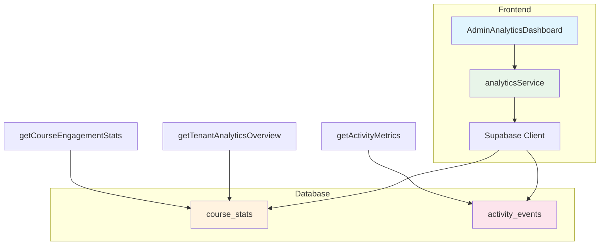

# Admin Analytics Dashboard Implementation Plan

## Overview
Create a tenant-level analytics dashboard for EduSync LMS that provides administrators with a comprehensive view of learning activities across all courses in their organization.

## Data Sources

### 1. course_stats Table
- Pre-aggregated course-level metrics
- Columns: tenant_id, course_id, total_enrolled, active_students, avg_progress, avg_quiz_score, lesson_completion_rate, quiz_pass_rate, student_ranking, last_refreshed_at
- Use: Aggregate across all courses for tenant-level metrics

### 2. activity_events Table
- Event-level data for learning activities
- Columns: id, tenant_id, event_type, event_version, actor_id, payload, created_at
- Event types: LESSON_COMPLETED, QUIZ_ATTEMPT, ASSIGNMENT_SUBMITTED, etc.
- Use: Count specific events, timeline data

## Implementation Steps

### Step 1: Extend analyticsService.ts
Add three new functions:
- `getTenantAnalyticsOverview()` - Aggregates course_stats across tenant
- `getActivityMetrics()` - Counts events from activity_events
- `getCourseEngagementStats()` - Course-level engagement data

### Step 2: Add Navigation Entry
Add to `src/config/navigation.ts`:
```typescript
{
  id: 'admin-analytics',
  name: "Analitik",
  path: "/admin/analytics",
  icon: BarChart3,
  roles: ['admin'],
  location: 'admin-hub',
  description: "Dashboard analitik pembelajaran."
}
```

### Step 3: Add Route in App.tsx
Add route: `<Route path="admin/analytics" element={<RoleRoute role="admin"><AdminAnalyticsDashboard /></RoleRoute>} />`

### Step 4: Create AdminAnalyticsDashboard.tsx

#### Metrics Cards (6 cards):
1. **Total Students** - Sum of total_enrolled from course_stats
2. **Active Students** - Sum of active_students from course_stats (last 7 days)
3. **Total Courses** - Count of courses in course_stats
4. **Courses Running** - Courses with active_students > 0
5. **Assignments Submitted** - Count from activity_events (ASSIGNMENT_SUBMITTED)
6. **Quiz Attempts** - Count from activity_events (QUIZ_ATTEMPT)

#### Charts (using Recharts):
1. **Activity Over Time** - Line chart showing events per day/week
2. **Course Engagement Distribution** - Bar/Pie chart of engagement by course
3. **Student Participation Metrics** - Breakdown of active vs inactive students

#### UI States:
- Loading: Spinner with "Memuat data analitik..."
- Empty: Message "Belum ada data analitik tersedia"
- Error: Error message with retry button

## Architecture Diagram



## File Changes

| File | Change Type |
|------|-------------|
| src/services/analyticsService.ts | Extend with new functions |
| src/config/navigation.ts | Add nav entry |
| src/App.tsx | Add route |
| src/pages/admin/AdminAnalyticsDashboard.tsx | New file |

## Constraints

- DO NOT modify database schema
- DO NOT create migrations  
- DO NOT modify Supabase RPC functions
- Only perform read-only queries
- RLS enforces tenant isolation automatically
