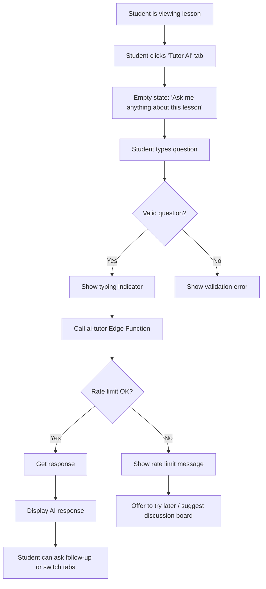

# AI Tutor UI Integration Plan — Smart Player

> **Design Principle:** AI Tutor should be available but **never distracting**. It must enhance learning without interrupting the student's flow.

---

## Executive Summary

The AI Tutor backend exists in [`supabase/functions/ai-tutor/index.ts`](supabase/functions/ai-tutor/index.ts:1) but has **no UI integration** in the Smart Player. This plan designs a non-intrusive UI that:

1. Keeps students in their learning flow
2. Provides contextual AI help when needed
3. Respects the existing tab-based navigation
4. Integrates with existing feature toggle system

---

## 1. Design Analysis

### 1.1 Current State

| Component | Status | Location |
|-----------|--------|----------|
| AI Tutor Edge Function | ✅ Implemented | `supabase/functions/ai-tutor/index.ts` |
| Rate Limiting (20/min, 200/day) | ✅ Implemented | Edge Function |
| Quiz Protection | ✅ Implemented | Edge Function (blocks answer requests) |
| Difficulty Classification | ✅ Implemented | Returns `difficulty` + `signals` |
| Feature Toggle | ✅ Documented | `docs/architecture/FEATURE_TOGGLES.md` |
| **Smart Player UI Integration** | ❌ **Missing** | — |

### 1.2 Smart Player Current Layout

```
┌─────────────────────────────────────────────────────────────┐
│  LessonViewer.tsx                                          │
│  ┌──────────────┬────────────────────────────────────────┐  │
│  │   Sidebar    │           Main Content Area            │  │
│  │  (Lessons)   │  ┌──────────────────────────────────┐  │  │
│  │              │  │         Top Bar + Tabs           │  │  │
│  │              │  │  [Materi] [Diskusi]              │  │  │
│  │              │  ├──────────────────────────────────┤  │  │
│  │              │  │                                  │  │  │
│  │              │  │     Content / Discussion         │  │  │
│  │              │  │     (Video/Article/Quiz)        │  │  │
│  │              │  │                                  │  │  │
│  └──────────────┴────────────────────────────────────────┘  │
└─────────────────────────────────────────────────────────────┘
```

### 1.3 Key Design Concern: Non-Distracción

> "Jika implementasi UI tidak hati-hati, AI bisa menjadi distraksi dalam proses belajar."

The UI must follow these principles:

| Principle | Implementation |
|-----------|----------------|
| **Proactive but subtle** | AI help is available but not pushed |
| **Respect learning flow** | No popups, no interruptions during video |
| **Contextual** | Only appears when viewing lesson content |
| **Respectful of attention** | Minimal visual footprint, expands on demand |
| **Rate-limit aware** | UI shows remaining quota to manage expectations |

---

## 2. UI Architecture

### 2.1 Recommended Layout

```
┌─────────────────────────────────────────────────────────────┐
│  LessonViewer.tsx                                          │
│  ┌──────────────┬────────────────────────────────────────┐  │
│  │   Sidebar    │           Main Content Area             │  │
│  │  (Lessons)   │  ┌──────────────────────────────────┐  │  │
│  │              │  │         Top Bar + Tabs           │  │  │
│  │              │  │  [Materi] [Diskusi] [Tutor AI]   │  │  │
│  │              │  ├──────────────────────────────────┤  │  │
│  │              │  │                                  │  │  │
│  │              │  │     Tab Content                   │  │  │
│  │              │  │     (Video/Article/Quiz/          │  │  │
│  │              │  │      AI Tutor Chat)              │  │  │
│  │              │  │                                  │  │  │
│  └──────────────┴────────────────────────────────────────┘  │
└─────────────────────────────────────────────────────────────┘
```

### 2.2 Alternative: Floating Action Button (Hybrid)

For more emphasis on AI availability without changing the tab structure:

```
┌─────────────────────────────────────────────────────────────┐
│  ┌──────────────┬────────────────────────────────────────┐  │
│  │   Sidebar    │           Main Content Area             │  │
│  │              │                              ┌────────┐ │  │
│  │              │                              │  🤖    │ │  │
│  │              │                              │  AI    │ │  │
│  │              │                              │ Tutor  │ │  │
│  │              │                              └────────┘ │  │
│  └──────────────┴────────────────────────────────────────┘  │
└─────────────────────────────────────────────────────────────┘
```

**Recommendation:** Start with **Option 1 (Tab-based)** because:
- It's consistent with existing navigation patterns
- It's less intrusive than a floating button
- Students can discover AI help naturally through the existing UI

---

## 3. Component Design

### 3.1 New Components

```
src/components/LessonViewer/
├── AITutorPanel.tsx      # Main AI Tutor chat interface
├── AITutorChat.tsx       # Chat message bubbles
├── AITutorInput.tsx      # Question input with rate limit display
├── AITutorTyping.tsx     # Loading animation
└── index.ts              # Export all components
```

### 3.2 AITutorPanel Component

```typescript
interface AITutorPanelProps {
  lessonId: string;
  lessonTitle: string;
  courseId: string;
  isOpen: boolean;
  onClose?: () => void;
}
```

**Features:**
- Chat-style interface (like WhatsApp/Telegram)
- Shows student difficulty level indicator
- Displays rate limit quota
- Supports markdown in responses
- "Ask another question" prompt after response

### 3.3 State Management

```typescript
interface AITutorState {
  messages: AITutorMessage[];
  isLoading: boolean;
  error: string | null;
  rateLimit: {
    remaining: number;
    resetsAt: Date;
  } | null;
  difficulty: DifficultyLevel;
}

interface AITutorMessage {
  id: string;
  role: 'user' | 'assistant';
  content: string;
  timestamp: Date;
}
```

---

## 4. Interaction Flow

### 4.1 User Journey



### 4.2 Error Handling

| Error | User Message | Action |
|-------|--------------|--------|
| Rate limit (minute) | "Sedang banyak permintaan, coba lagi dalam X detik" | Show countdown |
| Rate limit (daily) | "Batas harian tercapai. Coba lagi besok!" | Suggest discussion board |
| LLM timeout | "AI sedang sibuk. Coba lagi sebentar." | Retry button |
| Network error | "Koneksi terputus. Periksa internet Anda." | Retry button |
| Quiz question | "Maaf, saya tidak bisa memberikan jawaban kuis." | Show alternative help |

---

## 5. Feature Toggle Integration

### 5.1 Check AI Tutor Availability

The AI Tutor UI should only render when the feature is enabled for the tenant:

```typescript
// In LessonViewer.tsx
const { features } = useFeatures(); // Existing hook

// Tab visibility
{features.ai_tutor && (
  <button
    role="tab"
    id="tab-ai-tutor"
    aria-selected={activeTab === 'ai_tutor'}
    onClick={() => setActiveTab('ai_tutor')}
    className={cn(
      "px-4 py-3 text-sm font-bold flex items-center gap-2",
      activeTab === 'ai_tutor' 
        ? "border-blue-600 text-blue-600" 
        : "border-transparent text-slate-400"
    )}
  >
    <Sparkles className="w-4 h-4" />
    Tutor AI
    {difficultyIndicator && (
      <span className={cn("text-xs px-1.5 py-0.5 rounded", difficultyColor)}>
        {difficultyIndicator}
      </span>
    )}
  </button>
)}
```

### 5.2 Feature Toggle Config (Future)

```sql
-- tenant_features table can hold AI Tutor config
INSERT INTO tenant_features (tenant_id, feature_key, enabled, config)
VALUES ('uuid-tenant', 'ai_tutor', true, '{"max_daily_requests": 200}');
```

---

## 6. Security & Privacy

### 6.1 Frontend Security

- **No API keys** exposed in frontend — all calls go through Edge Function
- **JWT-based auth** — user identity verified via Supabase session
- **Tenant isolation** — enforced by Edge Function (already implemented)

### 6.2 Data Privacy

- **Student questions** stored in `ai_tutor_interactions` (already exists)
- **No cross-tenant data** — RLS enforces tenant boundaries
- **No quiz answer storage** — `answers` column excluded from context query

### 6.3 Content Safety

- **Quiz protection** already implemented in Edge Function
- **Prompt injection guard** in system prompt
- **Rate limiting** prevents abuse

---

## 7. Implementation Steps

### Phase 1: Core UI (Priority: High)

| Step | Task | File(s) |
|------|------|---------|
| 1.1 | Create AITutorPanel component | `src/components/LessonViewer/AITutorPanel.tsx` |
| 1.2 | Create chat input component | `src/components/LessonViewer/AITutorInput.tsx` |
| 1.3 | Create typing indicator | `src/components/LessonViewer/AITutorTyping.tsx` |
| 1.4 | Create service for Edge Function calls | `src/services/aiTutorService.ts` |
| 1.5 | Add 'Tutor AI' tab to LessonViewer | `src/pages/LessonViewer.tsx` |
| 1.6 | Wire up AITutorPanel to tab | `src/pages/LessonViewer.tsx` |

### Phase 2: Integration (Priority: High)

| Step | Task | File(s) |
|------|------|---------|
| 2.1 | Add feature toggle check | `src/pages/LessonViewer.tsx` |
| 2.2 | Handle rate limit UI | `src/components/LessonViewer/AITutorInput.tsx` |
| 2.3 | Handle error states | `src/components/LessonViewer/AITutorPanel.tsx` |
| 2.4 | Add difficulty indicator | `src/components/LessonViewer/AITutorPanel.tsx` |

### Phase 3: Polish (Priority: Medium)

| Step | Task | File(s) |
|------|------|---------|
| 3.1 | Add loading animations | `src/components/LessonViewer/AITutorTyping.tsx` |
| 3.2 | Improve message formatting (markdown) | `src/components/LessonViewer/AITutorChat.tsx` |
| 3.3 | Add empty state design | `src/components/LessonViewer/AITutorPanel.tsx` |
| 3.4 | Mobile responsive adjustments | CSS classes |

### Phase 4: Documentation (Priority: Low)

| Step | Task | File(s) |
|------|------|---------|
| 4.1 | Update ENGINEERING_ROADMAP.md | `docs/ENGINEERING_ROADMAP.md` |
| 4.2 | Update DATABASE_ARCHITECTURE.md if needed | `docs/DATABASE_ARCHITECTURE.md` |

---

## 8. File Structure After Implementation

```
src/
├── components/
│   └── LessonViewer/
│       ├── AITutorPanel.tsx      # NEW
│       ├── AITutorChat.tsx       # NEW
│       ├── AITutorInput.tsx      # NEW
│       ├── AITutorTyping.tsx     # NEW
│       ├── VideoViewer.tsx       # EXISTING
│       ├── ArticleViewer.tsx     # EXISTING
│       ├── QuizViewer.tsx        # EXISTING
│       ├── AssignmentViewer.tsx  # EXISTING
│       ├── LessonSidebar.tsx     # EXISTING
│       ├── index.ts              # UPDATE - export new components
├── services/
│   ├── aiTutorService.ts         # NEW - call Edge Function
│   └── lessonService.ts          # EXISTING
├── pages/
│   └── LessonViewer.tsx          # UPDATE - add AI Tutor tab
```

---

## 9. Edge Function Compatibility

The existing Edge Function [`ai-tutor/index.ts`](supabase/functions/ai-tutor/index.ts:1) is already compatible:

**Request format (no changes needed):**
```json
{
  "lesson_id": "uuid",
  "question": "Apa itu eigenvalue?"
}
```

**Response format (no changes needed):**
```json
{
  "response": "Eigenvalue adalah...",
  "difficulty": "struggling",
  "signals": ["low_quiz_score", "mid_progress"]
}
```

---

## 10. Summary

This plan delivers a **non-intrusive AI Tutor UI** that:

1. ✅ Is available within existing Smart Player navigation (tab-based)
2. ✅ Shows difficulty indicator to help students understand their learning state
3. ✅ Respects rate limits with clear feedback
4. ✅ Handles errors gracefully
5. ✅ Integrates with existing feature toggle system
6. ✅ Uses existing Edge Function (no backend changes)
7. ✅ Follows EduSync security principles

**The key design decision:** Adding AI Tutor as a **third tab** keeps it discoverable but non-intrusive. Students in learning flow won't be interrupted — they can consciously choose to switch to the AI Tutor tab when they need help.

---

*Plan created: 2026-03-09*
*Status: Ready for implementation approval*
