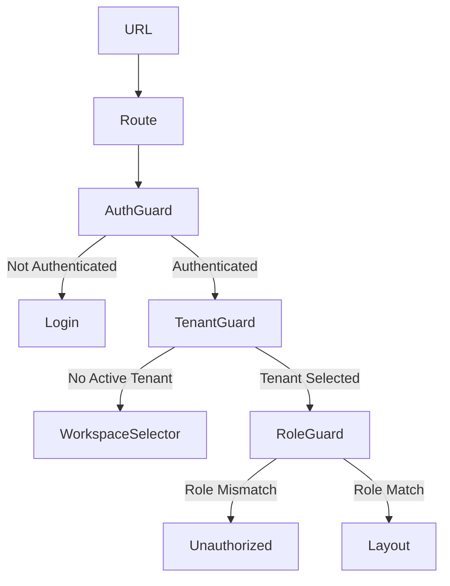

# EduSync UX/UI & Flow Implementation Plan (v2)

## Executive Summary

This plan implements production-grade UX/UI for **Auth/RBAC + Quiz Experience** based on the architecture blueprint. The foundation is already in place—now we refine, organize, and enhance the user experience.

---

## Priority 1: Auth & Roles UX

### 1.1 Auth Architecture - Multi-Tenant Context

**AuthContext must include:**

```typescript
interface AuthContextType {
  // User
  user: User | null
  session: Session | null

  // Profile
  profile: Profile | null

  // Multi-tenant
  memberships: TenantMembership[] // All tenant memberships
  activeTenant: Tenant | null // Current active tenant
  setActiveTenant: (tenantId: string) => void

  // Role
  roles: Role[]
  role: Role // Primary role (highest privilege)

  // State
  loading: boolean
  // ... methods
}

interface TenantMembership {
  tenant_id: string
  tenant_name: string
  tenant_logo: string | null
  role: Role
  last_workspace_id?: string
}
```

### 1.2 Auth Flow with last_workspace

```mermaid
graph TD
    A[Login] --> B{Auth Success}
    B --> C{last_workspace_id exists?}
    C -->|Yes| D[Auto redirect to /app]
    C -->|No| E[Workspace Selector]
    D --> F[Role Router]
    E --> G[Select Tenant]
    G --> F
    F --> H{role}
    H -->|ADMIN| I[/app/admin]
    H -->|TEACHER| J[/app/teacher]
    H -->|STUDENT| K[/app/student]
```

### 1.3 Route Guard Architecture (3-Layer)



**Guard Components:**

1. **AuthGuard** - Checks if user is authenticated
2. **TenantGuard** - Validates active tenant exists
3. **RoleGuard** - Validates user has required role

```typescript
// Usage
<Route path="/app" element={
  <AuthGuard>
    <TenantGuard>
      <RoleRoute allowedRoles={['admin', 'teacher', 'student']}>
        <AppLayout />
      </RoleRoute>
    </TenantGuard>
  </AuthGuard>
} />
```

### 1.4 Role Resolver Route

**Entry Point:** `/app`

```typescript
// Route behavior
switch (role) {
  case 'ADMIN':
    redirect('/app/admin')
  case 'TEACHER':
    redirect('/app/teacher')
  case 'STUDENT':
    redirect('/app/student')
}
```

### 1.5 Auth Screens Implementation

| Screen                 | URL                 | Current Status | Action             |
| ---------------------- | ------------------- | -------------- | ------------------ |
| Login                  | /login              | ✅ Exists      | Minor improvements |
| Register               | /register           | ✅ In Login    | Keep as-is         |
| Forgot Password        | /forgot-password    | ✅ Exists      | Keep as-is         |
| Reset Password         | /reset-password     | ✅ Exists      | Keep as-is         |
| Verify Email           | /verify-email       | ✅ Exists      | Keep as-is         |
| **Workspace Selector** | /workspace-selector | ❌ Missing     | **CREATE**         |

### 1.6 Route Structure

**Target (Hierarchical):**

```
/login
/workspace-selector
/app
├── /app (role resolver → redirect)
├── /app/student
│   ├── /app/student/dashboard
│   ├── /app/student/courses
│   ├── /app/student/quizzes
│   └── /app/student/assignments
├── /app/teacher
│   ├── /app/teacher/dashboard
│   ├── /app/teacher/quiz-manager
│   └── /app/teacher/courses
└── /app/admin
    ├── /app/admin/dashboard
    └── /app/admin/users
```

### 1.7 Implementation Steps (Phase 1)

1. Update [`AuthContext.tsx`](src/contexts/AuthContext.tsx):
   - Add `memberships` state
   - Add `activeTenant` state
   - Add `setActiveTenant()` method
   - Add `last_workspace` logic after login
   - Add login redirect logic

2. Create [`components/guards/AuthGuard.tsx`](src/components/guards/AuthGuard.tsx)
3. Create [`components/guards/TenantGuard.tsx`](src/components/guards/TenantGuard.tsx)
4. Create [`pages/WorkspaceSelector.tsx`](src/pages/WorkspaceSelector.tsx)
5. Refactor [`App.tsx`](src/App.tsx):
   - Add `/app` role resolver route
   - Add nested route structure with guards

---

## Priority 2: Quiz Experience (Student)

### 2.1 Quiz Center UI

```text
/student/quizzes (or /quiz)

┌─────────────────────────────────────────┐
│  Kuis & Evaluasi                        │
│  Uji pemahaman Anda dengan kuis...      │
│                                         │
│  ┌──────┐ ┌──────┐ ┌──────┐ ┌──────┐   │
│  │Total │ │Selesai│ │Rata2 │ │XP    │   │
│  │  12  │ │   5   │ │ 85%  │ │ 450  │   │
│  └──────┘ └──────┘ └──────┘ └──────┘   │
│                                         │
│  [Search............] [Filter: Kelas ▼] │
│                                         │
│  ┌───────────────────────────────────┐  │
│  │ 📝 Math Midterm                   │  │
│  │ ⏱ 30 minutes                     │  │
│  │ Due: Tomorrow                     │  │
│  │                                   │  │
│  │ [Start Quiz] [Resume]             │  │
│  └───────────────────────────────────┘  │
└─────────────────────────────────────────┘
```

### 2.2 Quiz Player - Resume Attempt

**Flow:**

1. Open quiz → Check for existing attempt
2. If exists → Fetch attempt with last question index
3. Resume from last position

```typescript
// In Quiz.tsx
const activeAttempt = quizAttempts.find(
  (a) => a.assignment_id === quiz.assignment_id && a.status === 'IN_PROGRESS'
)

if (activeAttempt) {
  // Resume from last question
  const lastQuestionIndex = activeAttempt.current_index || 0
  setCurrentQuestionIdx(lastQuestionIndex)
}
```

### 2.3 Quiz Player - Autosave Strategy

**Debounce:** 2-3 seconds

```typescript
// Flow:
answer selected
→ update local state (immediate)
→ debounce 2-3 seconds
→ RPC save_answer (to server)
→ update save status indicator
```

### 2.4 Quiz Player - Question Prefetch

**Strategy:** Fetch only the next question

```typescript
// When user is on question N, prefetch question N+1
useEffect(() => {
  if (currentQuestionIdx < totalQuestions - 1) {
    prefetchQuestion(attemptQuestions[currentQuestionIdx + 1].id)
  }
}, [currentQuestionIdx])
```

### 2.5 Quiz Player Layout

```text
┌─────────────────────────────────────────┐
│  Timer       Quiz Title        [Submit] │
├─────────────────────────────────────────┤
│                                         │
│  Question 3 of 20                       │
│                                         │
│  What is 2 + 2 ?                        │
│                                         │
│  ┌─────────────────────────────────────┐ │
│  │ (A) 3                               │ │
│  ├─────────────────────────────────────┤ │
│  │ (B) 4 ✓                             │ │
│  ├─────────────────────────────────────┤ │
│  │ (C) 5                               │ │
│  ├─────────────────────────────────────┤ │
│  │ (D) 6                               │ │
│  └─────────────────────────────────────┘ │
│                                         │
│  [Flag]          [Previous] [Next]      │
│                                         │
│  ────────────────────────────────────   │
│  Autosave: Saved at 10:42               │
└─────────────────────────────────────────┘
```

### 2.6 XP Calculation - Server Side Only

**SECURITY RULE:** XP and badge calculation MUST happen on server side.

```typescript
// WRONG ❌
const xp = calculateXP(score, correctAnswers) // Frontend calculation

// CORRECT ✅
const result = await submitAttempt({ answers })
const { xp_earned, badges } = result // From server
```

**Server-side RPC should:**

1. Calculate score based on answers
2. Award XP based on score/performance
3. Check and award badges
4. Return final values to frontend

### 2.7 Quiz Result Screen

```text
┌─────────────────────────────────────────┐
│  🎉 Good Job!                           │
│                                         │
│  Score: 85 / 100 (Grade: A)            │
│                                         │
│  ┌───────────────────────────────────┐  │
│  │ +50 XP                             │  │
│  │ 🏆 Excellence Badge                │  │
│  └───────────────────────────────────┘  │
│                                         │
│  Teacher Feedback:                     │
│  "Good work! Keep practicing..."       │
│                                         │
│  [Retry Quiz] [View Answers] [Close]   │
└─────────────────────────────────────────┘
```

### 2.8 Implementation Steps (Phase 2)

1. Enhance [`pages/Quiz.tsx`](src/pages/Quiz.tsx):
   - Add resume attempt logic
   - Hero section with stats

2. Update [`QuizPlayer.tsx`](src/features/quizzes/components/player/QuizPlayer.tsx):
   - Add question prefetch
   - Verify autosave uses 2-3 second debounce

3. Enhance [`QuizResultsView.tsx`](src/features/quizzes/components/student/QuizResultsView.tsx):
   - Display XP/badge from server response only

4. Verify quiz submission RPC returns XP calculation

---

## Priority 3: Quiz Manager (Teacher)

### 3.1 Updated Quiz Creation Flow

```
Create Quiz
    ↓
Add Questions
    ↓
Configure Settings
    ↓
┌──────────────────────────────────────┐
│ ASSIGN TO CLASS                       │
│  • Select classes                     │
│  • Set due date                       │
│  • Set availability window            │
└──────────────────────────────────────┘
    ↓
Publish
```

### 3.2 Quiz Manager UI

```text
/teacher/quizzes (or /teaching/quiz-manager)

┌─────────────────────────────────────────┐
│  ← Manajemen Kuis                      │
│                                         │
│  [Buat Kuis Baru]                       │
│                                         │
│  Class: X IPA 1 (Student: 32)           │
│  Join Code: ABC123 [Copy] [Link]        │
│                                         │
│  [Kuis Kelas Ini] [Semua Kuis]          │
│                                         │
│  ┌───────────────────────────────────┐  │
│  │ 📝 Math Midterm     [Published ▼] │  │
│  │ 20 soal • 30 menit • Max 3x      │  │
│  │ [Edit] [Delete]                   │  │
│  └───────────────────────────────────┘  │
└─────────────────────────────────────────┘
```

### 3.3 Implementation Steps (Phase 3)

1. Enhance [`QuizManager.tsx`](src/pages/QuizManager.tsx):
   - Add assignment step/wizard
   - Class selection with due dates
   - Availability window settings

---

## Priority 4: Design System

**⚠️ PHASE CONSTRAINT:** Design System (Phase 4) must ONLY start AFTER Phase 2 is completed.

### 4.1 Component Structure

```
src/components/
├── ui/                    # Base UI components
│   ├── Button.tsx
│   ├── Card.tsx
│   ├── Input.tsx
│   ├── Modal.tsx
│   └── Badge.tsx
├── auth/                  # Auth components
│   ├── WorkspaceCard.tsx
│   └── PasswordInput.tsx
└── quiz/                  # Quiz components
    ├── QuizCard.tsx
    ├── Timer.tsx
    └── ResultCard.tsx
```

---

## Files to Create/Modify

### New Files

```
src/components/guards/AuthGuard.tsx
src/components/guards/TenantGuard.tsx
src/pages/WorkspaceSelector.tsx
```

### Files to Modify

```
src/contexts/AuthContext.tsx    # Add memberships, activeTenant
src/App.tsx                     # Route restructure with guards
src/pages/Quiz.tsx             # Resume attempt logic
src/features/quizzes/components/player/QuizPlayer.tsx  # Prefetch
src/features/quizzes/components/student/QuizResultsView.tsx
src/pages/QuizManager.tsx      # Assignment wizard
```

---

## Success Criteria

1. **Auth:** Login → last_workspace check → workspace selector OR redirect → role-based dashboard
2. **Security:**
   - 3-layer guards (Auth → Tenant → Role)
   - XP calculated server-side only
3. **Quiz:**
   - Resume from last position
   - Autosave with 2-3s debounce
   - Question prefetch
4. **Teacher:** Create → Assign → Publish flow
5. **Phase Order:** Phase 4 starts only after Phase 2 complete
