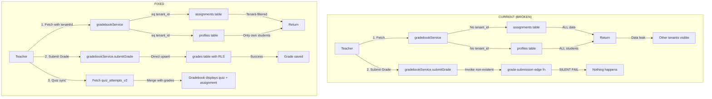

# EduSync Gradebook Critical Bugs - Implementation Plan

## Executive Summary

This document outlines the implementation plan to fix 3 CRITICAL bugs and 3 minor issues in the EduSync LMS Gradebook module.

### Bugs Status

| Severity | Issue | Status |
|----------|-------|--------|
| CRITICAL | Multi-tenant isolation failure in gradebookService | Pending |
| CRITICAL | Non-existent edge function for grade submission | Pending |
| CRITICAL | Quiz grades not synced to Gradebook | Pending |
| WARNING | Unused parameters in classroomService | Pending |
| SUGGESTION | Typo "Fluhed" in lessonService | Pending |
| SUGGESTION | Hardcoded "35 Siswa" in TeacherDashboard | Pending |

---

## CRITICAL BUG #1: Multi-Tenant Isolation Failure

### Problem
The `fetchGradebook()` function in [`gradebookService.ts`](src/services/gradebookService.ts:38) does NOT filter by `tenant_id`. This causes:
- Teachers from School A can see ALL students from School B, C, D...
- Complete violation of multi-tenant architecture (EduSync Constitution Rule #3)
- GDPR-like data privacy breach

### Root Cause Analysis
```typescript
// CURRENT (BROKEN) - Lines 40-43
const { data: assignmentsData } = await supabase
    .from('assignments')
    .select('id, title, due_date, created_at')  // NO tenant_id filter!
    .order('created_at', { ascending: false });

// CURRENT (BROKEN) - Lines 62-66
const { data: profilesData } = await supabase
    .from('profiles')
    .select('id, first_name, last_name, email')  // NO tenant_id filter!
    .eq('is_active', true);
```

### Solution
Add `tenant_id` filtering following the established pattern in other services:
```typescript
// FIXED - Add tenantId parameter
async fetchGradebook(tenantId: string): Promise<GradebookData> {
    // Filter assignments by tenant
    const { data: assignmentsData } = await supabase
        .from('assignments')
        .select('id, title, due_date, created_at')
        .eq('tenant_id', tenantId)  // ADD THIS
        .order('created_at', { ascending: false });
    
    // Filter profiles by tenant
    const { data: profilesData } = await supabase
        .from('profiles')
        .select('id, first_name, last_name, email')
        .eq('tenant_id', tenantId)  // ADD THIS
        .eq('is_active', true);
    
    // ... rest of the code
}
```

### Files to Modify
- [`src/services/gradebookService.ts`](src/services/gradebookService.ts:1) - Add tenantId parameter and filtering
- [`src/contexts/GradebookContext.tsx`](src/contexts/GradebookContext.tsx:1) - Pass tenantId from AuthContext

---

## CRITICAL BUG #2: Non-Existent Edge Function

### Problem
The [`submitGrade()`](src/services/gradebookService.ts:93) function calls `supabase.functions.invoke('grade-submission', ...)` but this edge function DOES NOT EXIST. Grade updates silently fail.

### Root Cause Analysis
```typescript
// CURRENT (BROKEN) - Line 94
async submitGrade(submissionId: string, score: number, feedback?: string): Promise<void> {
    const { error } = await supabase.functions.invoke('grade-submission', {
        body: { submission_id: submissionId, score, feedback },
    });
    if (error) throw error;
}
```

### Solution
Replace edge function call with direct Supabase database operation using RLS:
```typescript
// FIXED - Use direct DB with RLS
async submitGrade(
    submissionId: string, 
    score: number, 
    feedback?: string,
    tenantId?: string
): Promise<void> {
    const { error } = await supabase
        .from('grades')
        .upsert({
            submission_id: submissionId,
            score,
            feedback,
            tenant_id: tenantId,
            graded_at: new Date().toISOString()
        }, {
            onConflict: 'submission_id'
        });
    
    if (error) throw error;
}
```

### Alternative Solution (Better)
Use the existing `assignment_submissions` table directly with proper grading:
```typescript
async submitGrade(
    submissionId: string,
    score: number,
    feedback?: string,
    tenantId?: string
): Promise<void> {
    const { error } = await supabase
        .from('assignment_submissions')
        .update({
            status: 'GRADED',
            grade: score,
            feedback: feedback,
            graded_at: new Date().toISOString()
        })
        .eq('id', submissionId);
    
    if (error) throw error;
}
```

### Files to Modify
- [`src/services/gradebookService.ts`](src/services/gradebookService.ts:93)
- [`src/contexts/GradebookContext.tsx`](src/contexts/GradebookContext.tsx:46) - Update to pass tenantId

---

## CRITICAL BUG #3: Quiz Grades Not Synced to Gradebook

### Problem
Quiz attempts are stored in `quiz_attempts_v2`, but Gradebook fetches from `assignments` table. Teachers using QuizGradebook see quiz results, but main Gradebook shows empty quiz columns.

### Architecture Issue
```
Current flow:
quiz_attempts_v2 (quiz results) → NOT synced → grades/gradebook

Expected flow:
quiz_attempts_v2 → SYNCED → grades table → gradebook
```

### Solution Options

#### Option A: Database View (Recommended - Easiest)
Create a view that combines quiz attempts with the grades structure:

```sql
CREATE VIEW gradebook_quiz_results AS
SELECT 
    qa.id as submission_id,
    qa.tenant_id,
    qa.class_id,
    qa.quiz_id as assignment_id,
    qa.student_id,
    qa.score,
    qa.passed,
    qa.submitted_at as graded_at,
    'quiz' as source_type
FROM quiz_attempts_v2 qa
WHERE qa.status = 'GRADED';
```

#### Option B: Trigger (More Production-Ready)
Create a trigger that automatically syncs quiz results to grades when submitted:

```sql
-- Create trigger function
CREATE OR REPLACE FUNCTION sync_quiz_to_grades()
RETURNS TRIGGER AS $$
BEGIN
    IF NEW.status = 'GRADED' AND OLD.status != 'GRADED' THEN
        INSERT INTO grades (
            tenant_id,
            student_id,
            source_type,
            source_id,
            score,
            graded_at
        )
        VALUES (
            NEW.tenant_id,
            NEW.student_id,
            'quiz',
            NEW.quiz_id,
            NEW.score,
            NEW.graded_at
        )
        ON CONFLICT (source_type, source_id, student_id) 
        DO UPDATE SET score = NEW.score, graded_at = NEW.graded_at;
    END IF;
    RETURN NEW;
END;
$$ LANGUAGE plpgsql;

-- Attach trigger
CREATE TRIGGER trg_quiz_grade_sync
    AFTER UPDATE ON quiz_attempts_v2
    FOR EACH ROW
    EXECUTE FUNCTION sync_quiz_to_grades();
```

#### Option C: Frontend Fetch (Quick Fix)
Modify gradebookService to also fetch quiz results and merge them:

```typescript
async fetchGradebook(tenantId: string): Promise<GradebookData> {
    // ... existing assignment code ...
    
    // ADD: Fetch quiz attempts
    const { data: quizAttempts } = await supabase
        .from('quiz_attempts_v2')
        .select('id, quiz_id, student_id, score, status')
        .eq('tenant_id', tenantId)
        .eq('status', 'GRADED');
    
    // Merge quiz results into grades
    if (quizAttempts) {
        quizAttempts.forEach(attempt => {
            if (!grades[attempt.student_id]) grades[attempt.student_id] = {};
            grades[attempt.student_id][attempt.quiz_id] = {
                score: attempt.score,
                status: 'graded',
                source: 'quiz'
            };
        });
    }
    
    return { assignments, students, grades };
}
```

### Recommended Approach
Use **Option C (Frontend Fetch)** for immediate fix, then implement **Option B (Trigger)** for production robustness.

### Files to Modify
- [`src/services/gradebookService.ts`](src/services/gradebookService.ts:38) - Add quiz fetching
- Database: Create trigger for production (requires migration)

---

## Minor Issues

### WARNING #1: Unused Parameters in classroomService

#### Problem
Lines 87 and 121 have unused parameters that cause lint warnings.

#### Solution
Remove unused parameters or properly use them:

```typescript
// Line 87 - CURRENT
async joinClassroom(_studentId: string, joinCode: string, _tenantId: string): Promise<void>

// FIXED - Remove unused params since RPC handles them
async joinClassroom(joinCode: string): Promise<void> {
    const { error } = await supabase.rpc('enroll_student', {
        p_join_code: joinCode.toUpperCase()
    });
    // ...
}
```

### SUGGESTION #1: Typo in lessonService

#### Problem
Line 330 has typo: "Fluhed" → "Flushed"

#### Solution
```typescript
// Line 330 - CURRENT
console.log('[Offline Queue] Fluhed successfully');

// FIXED
console.log('[Offline Queue] Flushed successfully');
```

### SUGGESTION #2: Hardcoded Student Count

#### Problem
Line 119 has hardcoded "35 Siswa" instead of dynamic count.

#### Solution
```typescript
// Line 119 - CURRENT
<p className="text-sm text-slate-500 mt-1">35 Siswa</p>

// FIXED
<p className="text-sm text-slate-500 mt-1">
    {classroom.studentCount || 0} Siswa
</p>
```

---

## Implementation Order

1. **Phase 1: Critical Fixes** (Must be done before production)
   - Fix CRITICAL BUG #1: Add tenant filtering
   - Fix CRITICAL BUG #2: Replace edge function
   - Fix CRITICAL BUG #3: Add quiz sync

2. **Phase 2: Minor Fixes** (Can be done anytime)
   - Remove unused parameters
   - Fix typo
   - Fix hardcoded text

3. **Phase 3: Production Hardening** (Optional but recommended)
   - Create database trigger for quiz sync
   - Add comprehensive RLS policies verification

---

## Testing Checklist

- [ ] Verify tenant isolation: Different tenant users should NOT see each other's data
- [ ] Verify grade submission: Teachers can save grades and they persist
- [ ] Verify quiz sync: Quiz results appear in gradebook
- [ ] Verify no console errors after fixes
- [ ] Verify existing functionality still works

---

## Mermaid Diagram: Current vs Fixed Flow



---

## Related Documentation

- [Tenant Architecture](docs/TENANT_ARCHITECTURE.md)
- [RLS Policies](docs/RLS_POLICIES.md)
- [Database Architecture](docs/DATABASE_ARCHITECTURE.md)
