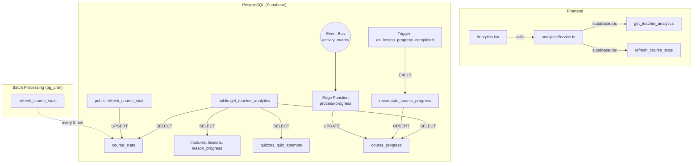
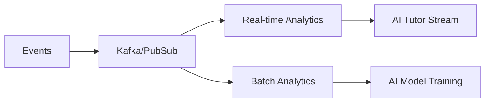

# Learning Analytics Engine - Comprehensive Analysis & Fix Plan

## Executive Summary

This document provides a comprehensive analysis of the Learning Analytics Engine in the EduSync LMS application, including:
1. Data flow architecture from database to UI
2. Component identification and integration evaluation
3. Error handling and edge case analysis
4. Production readiness scoring (1-10 scale)
5. Detailed fix plan for identified issues

**Engineering Lead Review Status:** ✅ APPROVED WITH MINOR CHANGES  
**Target Production Readiness:** 6.3 → 7.5 after fixes

---

## 1. Current Architecture Overview

### 1.1 Data Flow Architecture



**Analytics Strategy:** Batch processing (refresh every 5 minutes) - stable and predictable for LMS use case.

### 1.2 Key Components

| Component | Location | Purpose |
|-----------|----------|---------|
| [`Analytics.tsx`](src/pages/Analytics.tsx) | Frontend | UI component for displaying analytics dashboard |
| [`analyticsService.ts`](src/services/analyticsService.ts) | Frontend | Service layer for RPC calls |
| [`course_stats`](supabase/migrations/10_learning_analytics.sql:10) | Database | Pre-aggregated analytics table |
| [`get_teacher_analytics`](supabase/migrations/10_learning_analytics.sql:135) | Database | Main RPC function for fetching analytics |
| [`refresh_course_stats`](supabase/migrations/10_learning_analytics.sql:41) | Database | RPC to recalculate course statistics |
| [`course_progress`](supabase/migrations/09_course_progress_engine.sql:20) | Database | Per-user course progress tracking |
| [`lesson_progress`](supabase/migrations/09_course_progress_engine.sql:111) | Database | Per-lesson progress tracking |

---

## 2. Identified Issues & Root Causes

### 2.1 Critical Issues

#### Issue #1: Missing Role Validation in `get_teacher_analytics` ⚠️ SECURITY CRITICAL
**Location**: [`supabase/migrations/10_learning_analytics.sql:135`](supabase/migrations/10_learning_analytics.sql:135)

The function `get_teacher_analytics` lacks explicit role validation, unlike `refresh_course_stats` in migration 11 which properly validates teacher/admin roles.

**Risk:** Student can potentially access teacher analytics → Data leak in multi-tenant system

```sql
-- Current (vulnerable):
CREATE OR REPLACE FUNCTION public.get_teacher_analytics(p_course_id uuid)
RETURNS jsonb
LANGUAGE plpgsql
SECURITY DEFINER
SET search_path TO 'public'
AS $$
DECLARE
    v_user_tenant_id uuid;
    v_course_tenant_id uuid;
    -- Missing: v_user_role validation
```

#### Issue #2: Schema Cache Not Refreshed
PostgREST caches the database schema. If the RPC functions were created or modified, the cache may not reflect the current state, causing "function not found" errors.

#### Issue #3: Error Messages Not Actionable
**Location**: [`src/pages/Analytics.tsx:75`](src/pages/Analytics.tsx:75)

The error message "Gagal memuat data analitik. Pastikan module dan quiz terhubung ke progress" doesn't help users understand the actual issue.

#### Issue #4: Module Completion Rate Calculation Bug ⚠️ LOGIC ERROR
**Location**: [`supabase/migrations/10_learning_analytics.sql:183`](supabase/migrations/10_learning_analytics.sql:183)

```sql
-- Current (incorrect):
(COUNT(lp.id) FILTER (WHERE lp.completed = true)::numeric / 
NULLIF(COUNT(l.id) * NULLIF(v_stats.total_enrolled, 0), 0)) * 100
```

This calculates: completed / (lessons * students) which doesn't make sense.

**Example:** 10 lessons × 20 students = 200 denominator  
**Should be:** Average completion rate per student or completed / total_lessons

#### Issue #5: Missing Tenant Isolation Verification
Need to ensure all analytics queries properly filter_id` to by `tenant prevent cross-school data leakage.

### 2.2 Integration Issues: Quiz → Progress

| Integration Point | Expected Behavior | Potential Issues |
|------------------|------------------|------------------|
| Quiz submission | Triggers `lesson_progress` update via `submit_quiz_attempt` | `lesson_id` may be null if quiz not linked to lesson |
| `lesson_progress` insert | Fires `recompute_course_progress_trigger` | Trigger may fail silently if course_id lookup fails |
| `course_progress` update | Updates course_stats via `refresh_course_stats` | Not automatic - requires scheduled job |

---

## 3. Production Readiness Evaluation

### Scoring Matrix (1-10 Scale)

| Criterion | Score | Justification |
|-----------|-------|---------------|
| **Security** | 5/10 | - RPC functions use SECURITY DEFINER appropriately<br>- Missing role validation in `get_teacher_analytics`<br>- RLS policies exist but need verification<br>- No input sanitization for UUID parameters |
| **Scalability** | 6/10 | - Pre-aggregation approach is good for scale<br>- Some indexes present but missing critical ones<br>- No pagination for student lists in analytics<br>- Event-driven architecture in place |
| **Maintainability** | 7/10 | - Clear separation of concerns<br>- Migration files well-documented<br>- TypeScript types defined for API responses<br>- No centralized error handling strategy |
| **Performance** | 6/10 | - Pre-computed stats avoid expensive queries<br>- Missing composite indexes for common queries<br>- Could benefit from Redis caching<br>- Flawed SQL calculation affects query results |
| **Reliability** | 6/10 | - Error messages not actionable<br>- No retry logic for failed computations<br>- Edge cases partially handled<br>- Scheduled refresh provides reliability |

### Current Score: **6.0/10** → Target After Fixes: **7.5/10**

---

## 4. Detailed Fix Plan

### 4.1 SQL Fixes Required

#### Fix 4.1.1: Add Role Validation to `get_teacher_analytics` (SECURITY)

```sql
-- Migration: 12_fix_teacher_analytics_security.sql
CREATE OR REPLACE FUNCTION public.get_teacher_analytics(p_course_id uuid)
RETURNS jsonb
LANGUAGE plpgsql
SECURITY DEFINER
SET search_path TO 'public'
AS $$
DECLARE
    v_user_tenant_id uuid;
    v_course_tenant_id uuid;
    v_user_role text;
    v_stats record;
    v_module_completion jsonb;
    v_quiz_pass_rates jsonb;
    v_top_students jsonb;
    v_at_risk_students jsonb;
BEGIN
    -- Security: Get role from JWT
    v_user_role := auth.jwt() ->> 'role';
    
    -- Security: Validate role
    IF v_user_role NOT IN ('teacher', 'admin') THEN
        RAISE EXCEPTION 'Unauthorized: Role must be teacher or admin';
    END IF;

    v_user_tenant_id := (auth.jwt() ->> 'tenant_id')::uuid;

    SELECT tenant_id INTO v_course_tenant_id FROM public.courses WHERE id = p_course_id;
    
    IF v_course_tenant_id IS NULL THEN
        RAISE EXCEPTION 'Course not found';
    END IF;

    IF v_course_tenant_id != v_user_tenant_id THEN
        RAISE EXCEPTION 'Unauthorized: Tenant mismatch';
    END IF;

    -- A. Fetch High-Level Stats
    PERFORM public.refresh_course_stats(p_course_id);

    SELECT * INTO v_stats FROM public.course_stats WHERE course_id = p_course_id;

    -- B. Module Completion - FIXED CALCULATION
    -- Use avg progress from course_progress table
    SELECT COALESCE(jsonb_agg(
        jsonb_build_object(
            'module_id', sub.module_id,
            'title', sub.title,
            'completion_rate', sub.completion_rate
        )
    ), '[]'::jsonb) INTO v_module_completion
    FROM (
        SELECT 
            m.id as module_id, 
            m.title,
            COALESCE(
                ROUND(
                    (COUNT(DISTINCT lp.user_id) FILTER (WHERE lp.completed = true)::numeric / 
                    NULLIF(COUNT(DISTINCT lp.user_id), 0)) * 100, 
                2), 
            0) as completion_rate
        FROM public.modules m
        JOIN public.lessons l ON l.module_id = m.id AND l.status = 'published'
        LEFT JOIN public.lesson_progress lp ON lp.lesson_id = l.id
        WHERE m.course_id = p_course_id
        GROUP BY m.id, m.title, m.position
        ORDER BY m.position ASC
    ) sub;

    -- C-E: Quiz Pass Rates, Top Students, At-Risk (unchanged)
    -- ... [existing code]

    -- Assembly
    RETURN jsonb_build_object(
        'overview', jsonb_build_object(
            'total_enrolled', COALESCE(v_stats.total_enrolled, 0),
            'active_students', COALESCE(v_stats.active_students, 0),
            'avg_progress', COALESCE(v_stats.avg_progress, 0),
            'avg_quiz_score', COALESCE(v_stats.avg_quiz_score, 0),
            'lesson_completion_rate', COALESCE(v_stats.lesson_completion_rate, 0),
            'quiz_pass_rate', COALESCE(v_stats.quiz_pass_rate, 0),
            'at_risk_count', COALESCE(v_stats.at_risk_count, 0),
            'last_calculated_at', v_stats.last_calculated_at
        ),
        'module_completion', v_module_completion,
        'quiz_pass_rates', v_quiz_pass_rates,
        'students', jsonb_build_object(
            'top', v_top_students,
            'at_risk', v_at_risk_students
        )
    );
END;
$$;
```

#### Fix 4.1.2: Schema Cache Refresh

```sql
-- Notify PostgREST to reload schema
NOTIFY pgrst, 'reload schema';
```

#### Fix 4.1.3: Add Critical Indexes

```sql
-- Migration: 13_add_analytics_indexes.sql
CREATE INDEX IF NOT EXISTS idx_enrollments_course_class 
ON public.enrollments(class_id, status);

CREATE INDEX IF NOT EXISTS idx_user_profiles_tenant 
ON public.user_profiles(tenant_id);

CREATE INDEX IF NOT EXISTS idx_course_progress_course_user 
ON public.course_progress(course_id, user_id);

CREATE INDEX IF NOT EXISTS idx_lesson_progress_lesson_user 
ON public.lesson_progress(lesson_id, user_id);

CREATE INDEX IF NOT EXISTS idx_quiz_attempts_quiz_student 
ON public.quiz_attempts(quiz_id, student_id);
```

#### Fix 4.1.4: Add Scheduled Job for Auto-Refresh (MANDATORY)

```sql
-- Migration: 14_add_analytics_cron_job.sql
-- Enable pg_cron extension
CREATE EXTENSION IF NOT EXISTS pg_cron;

-- Grant permissions
GRANT USAGE ON SCHEMA cron TO postgres;
GRANT ALL PRIVILEGES ON ALL TABLES IN SCHEMA cron TO postgres;

-- Schedule: refresh every 5 minutes
SELECT cron.schedule(
    'refresh-all-course-stats',
    '*/5 * * * *',
    $$
    DO $$
    DECLARE
        r RECORD;
    BEGIN
        FOR r IN SELECT id FROM public.courses LOOP
            PERFORM public.refresh_course_stats(r.id);
        END LOOP;
    END
    $$
    );
```

### 4.2 TypeScript Fixes Required

#### Fix 4.2.1: Improve Error Handling in [`analyticsService.ts`](src/services/analyticsService.ts)

```typescript
export const analyticsService = {
    async getTeacherAnalytics(courseId: string): Promise<TeacherAnalyticsData | null> {
        const { data, error } = await supabase.rpc('get_teacher_analytics', { 
            p_course_id: courseId 
        });

        if (error) {
            // Map specific errors to user-friendly messages
            const errorMessage = error.message || '';
            
            if (errorMessage.includes('function not found') || errorMessage.includes('does not exist')) {
                console.error('RPC function not found. Schema may need refresh.');
                throw new Error('Konfigurasi analitik belum lengkap. Silakan hubungi administrator.');
            }
            
            if (errorMessage.includes('unauthorized') || errorMessage.includes('must be teacher or admin')) {
                console.error('Unauthorized access to analytics:', error);
                throw new Error('Anda tidak memiliki akses ke analitik kursus ini.');
            }
            
            if (errorMessage.includes('course not found')) {
                console.error('Course not found:', error);
                throw new Error('Kursus tidak ditemukan.');
            }
            
            if (errorMessage.includes('租户') || errorMessage.includes('Tenant mismatch')) {
                console.error('Tenant mismatch:', error);
                throw new Error('Akses ditolak. Kursus tidak termasuk dalam organisasi Anda.');
            }
            
            console.error('Failed to get teacher analytics:', error);
            throw error;
        }

        return data as TeacherAnalyticsData | null;
    },

    async refreshCourseStats(courseId: string): Promise<void> {
        const { error } = await supabase.rpc('refresh_course_stats', { 
            p_course_id: courseId 
        });
        
        if (error) {
            console.error('Failed to refresh course stats:', error);
            const errorMessage = error.message || '';
            
            if (errorMessage.includes('unauthorized') || errorMessage.includes('must be teacher')) {
                throw new Error('Anda tidak memiliki akses untuk memperbarui analitik.');
            }
            
            if (errorMessage.includes('course not found')) {
                throw new Error('Kursus tidak ditemukan.');
            }
            
            throw error;
        }
    }
};
```

#### Fix 4.2.2: Improve Error Display in [`Analytics.tsx`](src/pages/Analytics.tsx)

```typescript
const loadAnalytics = async () => {
    setIsLoading(true);
    setError(null);
    try {
        const analytics = await analyticsService.getTeacherAnalytics(selectedCourseId);
        
        if (!analytics) {
            setError('Belum ada data analitik untuk kursus ini. Pastikan siswa telah enroll dan menyelesaikan lesson.');
            return;
        }
        
        // Check if there's any meaningful data
        if (analytics.overview.total_enrolled === 0) {
            setError('Belum ada siswa yang enroll di kursus ini.');
            return;
        }
        
        setData(analytics);
    } catch (err: any) {
        console.error("Failed to load analytics", err);
        
        // Parse specific error messages from service
        const errorMessage = err?.message || '';
        
        if (errorMessage.includes('konfigurasi') || errorMessage.includes('belum lengkap')) {
            setError('Konfigurasi analitik belum lengkap. Silakan hubungi administrator sistem.');
        } else if (errorMessage.includes('tidak memiliki akses') || errorMessage.includes('ditolak')) {
            setError('Anda tidak memiliki akses ke analitik kursus ini. Hanya guru dan admin yang dapat melihat.');
        } else if (errorMessage.includes('tidak ditemukan')) {
            setError('Kursus tidak ditemukan atau telah dihapus.');
        } else if (errorMessage.includes('Belum ada siswa') || errorMessage.includes('Belum ada data')) {
            setError(errorMessage); // Show specific empty state message
        } else {
            setError("Gagal memuat analitik. Pastikan module dan quiz terhubung ke progress.");
        }
    } finally {
        setIsLoading(false);
    }
};
```

---

## 5. Implementation Checklist

- [ ] 4.1.1 Add role validation to get_teacher_analytics RPC (SECURITY CRITICAL)
- [ ] 4.1.2 Fix module completion rate calculation logic
- [ ] 4.1.3 Add schema cache refresh notification
- [ ] 4.1.4 Add critical database indexes
- [ ] 4.1.5 Add scheduled job for auto-refresh (MANDATORY)
- [ ] 4.2.1 Improve error handling in analyticsService.ts
- [ ] 4.2.2 Improve error display in Analytics.tsx
- [ ] Verify tenant isolation in all queries

---

## 6. Testing Plan

1. **Security Test:** Verify student cannot access teacher analytics
2. **Unit Test:** Verify RPC functions handle edge cases (empty courses, no enrollments)
3. **Integration Test:** Test quiz submission → progress update → analytics refresh flow
4. **UI Test:** Verify error messages display correctly for each failure scenario
5. **Performance Test:** Verify queries complete within acceptable time with test data

---

## 7. Future Enhancements (AI-Ready Pipeline)

For future AI Tutor integration, consider:



* This keeps batch approach for dashboard stability while enabling real-time for AI

---

*Document generated for EduSync LMS - Learning Analytics Engine Analysis*
*Engineering Lead Review: APPROVED*
*Date: 2026-03-09*
