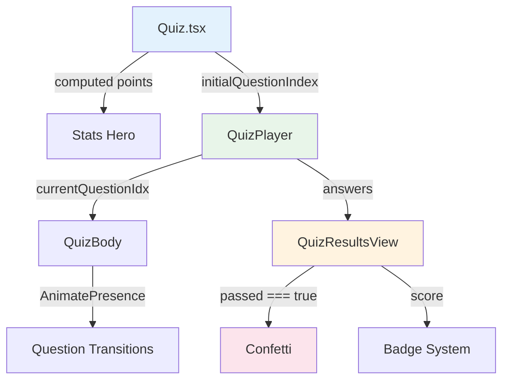

# Phase 2 Student Quiz Experience - Implementation Plan

## Overview
Improve quiz UX for students: hero stats, resume flow, player smoothness, and gamified results.
- **Constraint**: Frontend-only changes. No database schema or RPC modifications.

## User Feedback Incorporation
1. **XP → Points only** - Display result.score sum as "Points", no gamification system
2. **Resume via current_index** - Computed from answered questions in frontend (not backend DB field)
3. **tenantId in queryKeys** - Prevents multi-tenant cache leaks
4. **Animation scoped to QuizBody** - No unnecessary re-renders
5. **Lazy-loaded confetti** - CSS-based, React.lazy dynamic import, zero bundle impact

---

## Files to Modify

| File | Changes |
|------|---------|
| `src/pages/Quiz.tsx` | Replace XP with Points, compute from scores, add resume index |
| `src/features/quizzes/components/player/QuizPlayer.tsx` | Accept initialQuestionIndex prop |
| `src/features/quizzes/components/player/QuizBody.tsx` | Add AnimatePresence for question transitions |
| `src/features/quizzes/components/student/QuizResultsView.tsx` | Add Points, Badge, Confetti, View Answers |
| `src/features/quizzes/types/quizzes.types.ts` | Add currentIndex to QuizAttempt |
| `src/features/quizzes/api/quizPlayer.service.ts` | Add getCurrentQuestionIndex utility |
| `src/features/quizzes/queries/queryKeys.ts` | Verify tenantId in all keys |
| `src/features/quizzes/components/student/Confetti.tsx` | **NEW** - CSS-based confetti |

---

## Implementation Steps

### Step 1: Replace XP with Points Display (Quiz.tsx)

**Current State:**
- Line 52: `const [totalXP, setTotalXP] = useState(100);`
- Line 145: `if (result.passed) setTotalXP(prev => prev + 50);`
- Line 267: Shows hardcoded `{totalXP}` with label "XP Diterima"

**Changes:**
1. Remove `totalXP` state variable
2. Calculate real points from completed attempts: `completedAttempts.reduce((sum, a) => sum + (a.score || 0), 0)`
3. Replace XP stat card with Points showing computed total
4. Change label from "XP Diterima" to "Poin Total"

---

### Step 2: Resume with Computed current_index

**Approach:** Since there's no `current_index` column in `quiz_attempts_v2`, compute it from answered questions in the frontend service layer.

**Implementation:**
1. **Add utility in quizPlayer.service.ts:**
   ```typescript
   export function getCurrentQuestionIndex(questions: QuizAttemptQuestion[]): number {
     // Find first unanswered question index
     const firstUnanswered = questions.findIndex(
       q => !q.selected_option_ids?.length && !q.text_answer
     );
     
     // If all answered, go to last question
     return firstUnanswered === -1 ? questions.length - 1 : firstUnanswered;
   }
   ```

   **Logic Explanation:**
   - If student answered Q1, skipped Q2, answered Q3 → resumes at Q2 (first unanswered)
   - If all questions answered → resumes at last question for review
   - This ensures students don't skip questions accidentally

2. **Update QuizAttempt type** in `quizzes.types.ts`:
   ```typescript
   interface QuizAttempt {
     // ... existing fields
     currentIndex?: number; // computed in frontend
   }
   ```

3. **In Quiz.tsx handleStartOrResume:**
   - After fetching questions, compute currentIndex
   - Pass as `initialQuestionIndex` prop to QuizPlayer

4. **In QuizPlayer.tsx:**
   - Accept `initialQuestionIndex?: number` prop
   - Initialize `currentQuestionIdx` with it (default 0)

---

### Step 3: Verify tenantId in queryKeys

**Current State:** Most keys include tenantId, but verify `activeAttempt`:
```typescript
activeAttempt: (quizId: string | null, tenantId: string | undefined, assignmentId?: string | null) =>
  ['quiz', 'activeAttempt', quizId, tenantId, assignmentId],
```

**Action:** Confirm all keys include tenantId - appears already correct.

---

### Step 4: Question Transition Animation (QuizBody.tsx)

**Current State:** No animation between questions - direct render.

**Changes:**
1. Import: `import { AnimatePresence, motion } from 'motion/react';`
2. Wrap question content:
   ```tsx
   <AnimatePresence mode="wait">
     <motion.div
       key={question.id}
       initial={{ opacity: 0, x: 20 }}
       animate={{ opacity: 1, x: 0 }}
       exit={{ opacity: 0, x: -20 }}
       transition={{ duration: 0.2 }}
     >
       {/* Existing question content */}
     </motion.div>
   </AnimatePresence>
   ```

**Note:** Animation scoped to QuizBody only - header, sidebar, footer unaffected.

---

### Step 5: QuizResultsView Enhancement

**New Features:**
1. **Points Display:** Show result.score with "Poin" label
2. **Badge System:**
   - Excellence: score ≥ 90%
   - Good: score ≥ 70%
   - Needs Improvement: score < 70%
3. **Confetti:** CSS-based, lazy-loaded on pass
4. **View Answers Button:** If `show_correct_answers === true`
5. **Gradient Accents:** Improve visual design

**Confetti Implementation:**
- Create `Confetti.tsx` with pure CSS keyframes
- Lazy-load: `const Confetti = React.lazy(() => import('./Confetti'))`
- Zero external dependencies

---

## Architecture Diagram



---

## Verification Plan

### Build Verification
```bash
cd /home/rog/Documents/edusync1/LMS && npx tsc --noEmit
```

### Manual Verification Checklist

| Feature | Test Case | Expected Result |
|---------|-----------|-----------------|
| Points Display | Visit /quiz | Shows computed points from scores, no hardcoded XP |
| Resume Flow | Start quiz → answer 3Q → close → reopen | Resumes at Q3 via computed index |
| Question Transitions | Navigate between questions | Smooth fade/slide animation in QuizBody |
| Result Screen | Complete quiz | Shows score, points, badge, confetti on pass |
| Multi-tenant | Different tenant logins | Isolated quiz data, no cache leaks |

---

## Notes

- **No database changes** - current_index computed from existing answer data
- **Zero bundle impact** - confetti is CSS-only, lazy-loaded
- **Tenant isolation** - all queryKeys verified for tenantId
- **Scoped animation** - only QuizBody re-renders on question change
