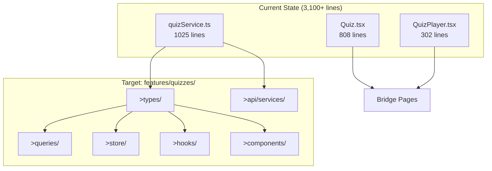

# Quiz Engine Refactor - Phase 2 Implementation Plan

## Overview

This plan implements the strangler pattern migration for the Quiz Engine, moving from monolithic files to a modular architecture in `features/quizzes/`.

## Architecture Overview



## Scope Confirmed by User

- **Include QuizManager.tsx**: Teacher quiz CRUD included in this phase
- **Backward Compatibility**: quizService.ts kept as wrapper (re-exports from new services)
- **useQuizTimer**: Simply move to hooks/ (no further refactoring)

## Implementation Phases

### Phase 1: Domain Types
- [ ] Consolidate TypeScript interfaces from `quizService.ts` into `features/quizzes/types/`
- [ ] Create proper domain types: QuizAttempt, QuizAttemptStatus, QuizAttemptResult, QuizQuestion, QuizAttemptQuestion, QuizOptionSnapshot, QuizAssignment, StudentQuizAssignment, SubmitAnswer, QuestionType, QuizMode, SaveStatus

### Phase 2: Service Layer (Split by Domain)
- [ ] Create `quizPlayer.service.ts` - Student-facing quiz player services
- [ ] Create `quizManager.service.ts` - Teacher-facing quiz management
- [ ] Create `quizAssignment.service.ts` - Assignment management

### Phase 3: React Query Layer
- [ ] Create `quizPlayer.queries.ts` - Query hooks
- [ ] Create `quizPlayer.mutations.ts` - Mutation hooks
- [ ] Create `quizManager.queries.ts` - Teacher query hooks
- [ ] Update `queryKeys.ts` with new quiz keys

### Phase 4: Zustand Store
- [ ] Create `quizPlayer.store.ts` - Local UI state for instant updates

### Phase 5: Custom Hooks
- [ ] Extract `useAutosaveAnswers.ts` from QuizPlayer.tsx lines 86-130
- [ ] Move `useQuizTimer.ts` from pages/quiz/QuizTimer.tsx to hooks/
- [ ] Extract `useAntiCheat.ts` from QuizPlayer.tsx lines 61-76
- [ ] Extract `useQuizHeartbeat.ts` from QuizPlayer.tsx lines 78-83

### Phase 6: Components
- [ ] Move presentational components from `pages/quiz/` to `features/quizzes/components/player/`
- [ ] Create new orchestrator `QuizPlayer.tsx` (≤150 lines)

### Phase 7: Bridge Pages (Strangler Pattern)
- [ ] Refactor `Quiz.tsx` to use React Query hooks (target: ≤200 lines)
- [ ] Create thin bridge for `QuizPlayer.tsx`

### Phase 8: Barrel Export
- [ ] Update `features/quizzes/index.ts` with public API exports

## File Mapping

| Source | Destination | Notes |
|--------|-------------|-------|
| `quizService.ts` (types) | `features/quizzes/types/quizzes.types.ts` | Extract interfaces |
| `quizService.ts` (player) | `features/quizzes/api/quizPlayer.service.ts` | Start/submit/save |
| `quizService.ts` (manager) | `features/quizzes/api/quizManager.service.ts` | CRUD operations |
| `quizService.ts` (assign) | `features/quizzes/api/quizAssignment.service.ts` | Assignment mgmt |
| `QuizPlayer.tsx` (hooks) | `features/quizzes/hooks/` | Extract 4 hooks |
| `QuizTimer.tsx` | `features/quizzes/hooks/` + `components/` | Split hook/UI |
| `pages/quiz/*.tsx` | `features/quizzes/components/player/` | Move components |
| `Quiz.tsx` | `pages/Quiz.tsx` | Refactor to bridge |
| `QuizPlayer.tsx` (pages) | `pages/quiz/QuizPlayer.tsx` | Thin re-export |

## Verification

### Automated Tests
```bash
# TypeScript compilation check
npx tsc --noEmit

# Build check
npm run build

# Existing unit tests
npx vitest run
```

### Manual Verification
- [ ] Student flow: Open quiz list → start quiz → answer → autosave → submit → results
- [ ] Timer: Verify countdown from server `expires_at`
- [ ] Tab switch: Switch tab → anti-cheat warning toast
- [ ] Network: React Query Devtools shows cache entries
- [ ] Teacher flow: Quiz manager create/edit/publish works

## Dependencies

- React Query: Already installed (`@tanstack/react-query`)
- Zustand: Already installed (`zustand`)
- Supabase: Already configured (`@supabase/supabase-js`)
