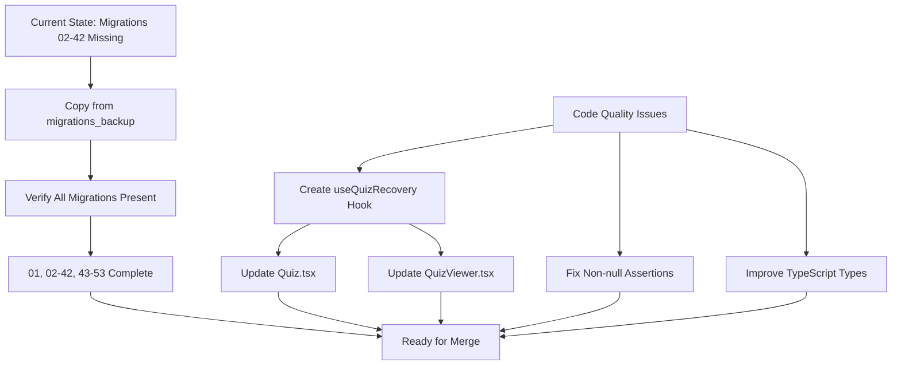

# Quiz System Code Review - Remediation Plan

## Executive Summary

After thorough analysis of the codebase, I've identified that **2 of the 3 critical issues** in the code review report are **NOT actually issues** in the current codebase. However, there are real issues that need to be addressed:

| Priority | Issue | Status | Action Required |
|----------|-------|--------|-----------------|
| CRITICAL | Migration deletion (38 files) | VALID | Restore migrations from backup |
| CRITICAL | Missing RPC functions | **INVALID** | Functions exist in migrations 47-48 |
| CRITICAL | Route placement bug | **INVALID** | Routes are correctly inside Layout |
| WARNING | Duplicate recovery logic | VALID | Extract to shared hook |
| WARNING | Non-null assertion | VALID | Add null checks |
| WARNING | Type safety (any cast) | VALID | Improve typing |

---

## Issue Analysis & Findings

### ✅ Issue 2: Missing RPC Functions - NOT AN ISSUE

**Finding:** The RPC functions `record_cheating_signal` and `record_quiz_heartbeat` **DO EXIST** in the codebase:

- **Migration 47** (`supabase/migrations/47_quiz_heartbeat_system.sql`):
  - Lines 22-34: `record_quiz_heartbeat` function
  - Lines 37-65: `record_cheating_signal` function

- **Migration 48** (`supabase/migrations/48_quiz_final_hardening.sql`):
  - Lines 92-111: Refined `record_quiz_heartbeat` with tenant isolation
  - Lines 113-145: Refined `record_cheating_signal` with tenant isolation

**QuizService.ts** correctly calls these functions:
- Line 214: `supabase.rpc('record_cheating_signal', ...)`
- Line 228: `supabase.rpc('record_quiz_heartbeat', ...)`

**Conclusion:** The code review report was incorrect about this issue. No action needed.

---

### ✅ Issue 3: Route Placement Bug - NOT AN ISSUE

**Finding:** The route structure in `src/App.tsx` is **CORRECT**:

```jsx
<Routes>
  <Route path="/login" element={<Login />} />
  <Route path="/" element={<Layout />}>
    {/* ALL protected routes inside Layout */}
    <Route path="courses" element={<RoleRoute...><LessonViewer /></RoleRoute>} />
    <Route path="courses/:courseId" element={<RoleRoute...><LessonViewer /></RoleRoute>} />
    {/* ... all other routes ... */}
  </Route>
</Routes>
```

All routes including `/courses` are properly nested inside the `<Layout>` component.

**Conclusion:** The code review report was incorrect about this issue. No action needed.

---

### ⚠️ Issue 1: Migration Gap - VALID ISSUE

**Finding:** Migrations 02-42 exist in `supabase/migrations_backup/` but are missing from `supabase/migrations/`.

Current migrations folder contains:
- `01_migration.sql` (base schema)
- `43_migration.sql` through `53_quiz_schema_corrections.sql`

Missing: migrations 02-42

**Risk:** New team members cannot rebuild database from scratch. Existing deployments may have gaps.

**Solution:** Copy migrations from `migrations_backup/` to `migrations/`

---

### ⚠️ Issue 4: Duplicate Recovery Logic - VALID WARNING

**Finding:** Identical quiz recovery logic exists in two places:

1. **`src/pages/Quiz.tsx`** (lines 72-93):
   - Checks for existing IN_PROGRESS attempt
   - Restores questions from snapshot
   - Restores answers
   - Restores timer

2. **`src/components/LessonViewer/QuizViewer.tsx`** (lines 53-98):
   - Same logic duplicated

**Solution:** Extract to shared hook `useQuizRecovery`

---

### ⚠️ Issue 5: Non-null Assertion Risk - VALID WARNING

**Finding:** Non-null assertions without guards:

1. **`src/pages/LessonViewer.tsx`** line 377:
   ```typescript
   return <CourseBrowser ... tenantId={tenantId!} ... />;
   ```

2. **`src/pages/LessonViewer.tsx`** line 626:
   ```typescript
   tenantId={tenantId!}
   ```

**Solution:** Add proper null checks and return early or redirect

---

### ⚠️ Issue 6: Type Safety Violation - VALID WARNING

**Finding:** Multiple `as any` casts:

1. **`src/pages/Quiz.tsx`** lines 199, 244:
   ```typescript
   quiz_options: (sq as any).quiz_questions?.quiz_options || []
   ```

2. **`src/components/LessonViewer/QuizViewer.tsx`** lines 69, 200:
   ```typescript
   quiz_options: (sq as any).quiz_questions?.quiz_options || []
   ```

3. **`src/services/quizService.ts`** line 186:
   ```typescript
   .single() as any;
   ```

**Solution:** Define proper TypeScript interfaces

---

## Implementation Plan

### Step 1: Restore Missing Migrations

```bash
# Copy migrations 02-42 from backup to main migrations folder
cp supabase/migrations_backup/02_*.sql supabase/migrations/
cp supabase/migrations_backup/03_*.sql supabase/migrations/
# ... continue for 04-42
```

### Step 2: Create Shared Quiz Recovery Hook

Create `src/hooks/useQuizRecovery.ts`:
```typescript
export function useQuizRecovery(quizId: string, tenantId: string) {
  // Recovery logic
}
```

Update Quiz.tsx and QuizViewer.tsx to use the hook.

### Step 3: Fix Non-null Assertions

Add null checks in LessonViewer.tsx:
```typescript
if (!tenantId) {
  return <Navigate to="/" replace />;
}
```

### Step 4: Improve Type Safety

Define proper interfaces in quizService.ts:
```typescript
interface QuizAttemptQuestion {
  id: string;
  question_id: string;
  text: string;
  // ...
}
```

---

## Migration Diagram



---

## Files to Modify

1. **supabase/migrations/** - Copy files from migrations_backup (41 files)
2. **src/hooks/useQuizRecovery.ts** - New file
3. **src/pages/Quiz.tsx** - Use shared hook
4. **src/components/LessonViewer/QuizViewer.tsx** - Use shared hook
5. **src/pages/LessonViewer.tsx** - Add null checks
6. **src/services/quizService.ts** - Improve types

---

## Recommendation

The code review's "BLOCKED" status should be **REVISED** because:

1. Two critical issues (RPC functions, route placement) are NOT actual issues
2. The migration gap is real but can be quickly fixed
3. The warnings are code quality improvements that don't block functionality

**Suggested Status:** PROCEED WITH CAUTION - Fix migration gap and code quality issues before merge.
